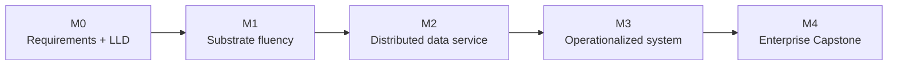

# Learning Roadmap — Durations, Prerequisites, Milestones

This roadmap turns the curriculum map into a journey with checkpoints. Durations are **estimates for a working engineer studying part-time (~8–10 hrs/week)** and are *illustrative*, not guarantees.

---

## The five phases

The 20 Parts cluster into five phases. Each phase ends with a **milestone**: a concrete deliverable proving competence.

### Phase 0 — Foundations of Thought (Parts 1–2)
- **Focus:** mindset, requirements, tradeoffs, architecture styles, LLD.
- **Est. duration:** 3–4 weeks.
- **Prerequisites:** the platform's assumed knowledge (OOP, DSA, OS, basic DB/networking).
- **Milestone M0:** Take a vague prompt ("design a ticket booking app") and produce a requirements doc + capacity estimate + one ADR + a high-level component diagram. No distributed concerns yet.

### Phase 1 — The Substrate (Parts 3–6)
- **Focus:** networking, storage engines, databases, caching.
- **Est. duration:** 6–8 weeks.
- **Prerequisites:** Phase 0.
- **Milestone M1:** Explain, from first principles, what happens from "user types a URL" to "bytes return from a B-Tree/LSM-backed DB through a cache and CDN." Choose a database for three different workloads and justify each with internals.

### Phase 2 — Scaling & Distribution (Parts 7–11)
- **Focus:** scalability, distributed-systems theory, messaging, consistency, fault tolerance. **This is the intellectual core.**
- **Est. duration:** 10–14 weeks.
- **Prerequisites:** Phase 1 (especially storage, databases, networking).
- **Milestone M2:** Design a replicated, partitioned data service. Specify its consistency model precisely (linearizable? causal? eventual?), its replication topology, its partition behavior under CAP/PACELC, and its failure/recovery behavior. Defend it in a mock design review.

### Phase 3 — Building Modern Systems (Parts 12–17)
- **Focus:** microservices, cloud native/Kubernetes, SRE, security, observability, performance.
- **Est. duration:** 10–12 weeks.
- **Prerequisites:** Phase 2.
- **Milestone M3:** Take the Phase 2 data service and operationalize it: containerize, deploy to K8s (conceptually), define SLOs and error budgets, add observability, threat-model it, and write a production-readiness checklist.

### Phase 4 — Mastery & Synthesis (Parts 18–20)
- **Focus:** real-world architectures, interview designs, the enterprise capstone.
- **Est. duration:** 8–12 weeks.
- **Prerequisites:** Phases 0–3.
- **Milestone M4 (Capstone):** Complete the Wealth Management Platform design end to end, with every major decision defended and alternatives weighed. Conduct a self/peer design review.

---

## Milestone ladder (at a glance)

---

## Competency rubric per phase

| Phase | You can… | Interview level reached |
|------|-----------|--------------------------|
| 0 | gather requirements, estimate, draw a clean component design | Junior → Mid |
| 1 | reason about storage/db/cache/network internals & choices | Mid |
| 2 | design correct distributed data systems and defend consistency tradeoffs | Senior |
| 3 | operate, secure, observe, and scale services in production terms | Senior → Staff |
| 4 | architect and defend an enterprise system end to end | Staff → Principal |

---

## Prerequisite gates (do not skip)

- Do **not** start Part 8 (Distributed Systems Core) without Part 3 (networking) and Part 5 (databases/transactions). The theory is meaningless without the substrate.
- Do **not** start Part 10 (Consistency & Replication) without Part 8 (clocks, ordering, consensus).
- Do **not** start Part 11 (Fault Tolerance) without Part 9 (messaging) and Part 10 (consistency).
- Do **not** start Part 19/20 (designs/capstone) until M2 is achieved; otherwise designs become buzzword soup.

---

## How to know you're ready to move on

After each Part, you should be able to (without notes):
1. State the problem the Part solves and why it exists.
2. Draw the core diagram(s) from memory.
3. List the top 3 tradeoffs and when each side wins.
4. Answer the Hard and Staff+ interview questions in that Part's lessons.
5. Connect the topic to at least two other Parts via the dependency graph.

If you can't do all five, re-study before advancing. Depth compounds; gaps compound faster.
