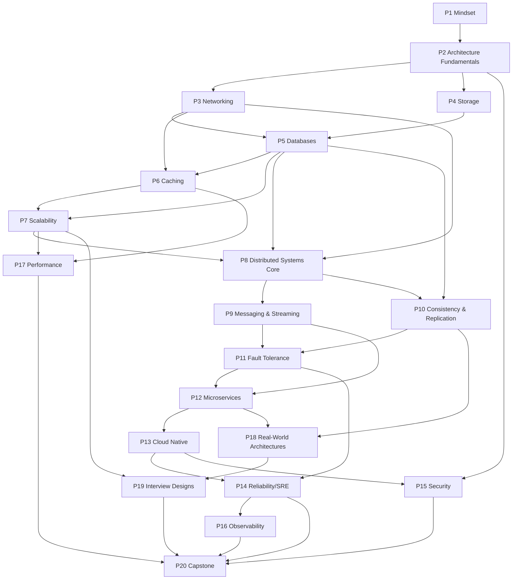

# Concept Dependency Graph

What must be learned before what. Use this to plan a non-linear path or to diagnose why a topic isn't "clicking" (usually a missing prerequisite upstream).

The arrows mean **"is a prerequisite for"** (A → B means *learn A before B*).

---

## Top-level Part dependencies

---

## Critical-path concepts (the spine of distributed systems)

These are the concepts where a weak foundation breaks everything downstream. Master them in this exact order:

```mermaid
flowchart LR
    A[Latency/throughput\n& estimation] --> B[Sequential vs random I/O]
    B --> C[B-Tree / LSM storage]
    C --> D[ACID & isolation levels]
    D --> E[MVCC & concurrency control]
    E --> F[Replication topologies]
    F --> G[Replication lag &\nread guarantees]
    G --> H[Logical & vector clocks]
    H --> I[Quorums R+W>N]
    I --> J[Consensus: Raft/Paxos]
    J --> K[Linearizability vs\nSerializability]
    K --> L[CAP / PACELC]
    L --> M[Distributed txns:\n2PC & Saga]
    M --> N[Idempotency &\nexactly-once effects]
```

If a system-design answer ever feels hand-wavy, the gap is almost always one of these 14 nodes.

---

## Cross-cutting concepts (touch many Parts)

| Concept | First taught | Reused heavily in |
|--------|--------------|-------------------|
| Tradeoff reasoning | P1 | every Part |
| Capacity estimation | P1 | P7, P17, P19, P20 |
| Idempotency | P8/P11 | P9, P12, P19.2.3 (payments), P20 |
| Consistent hashing | P7 | P5, P6, P8, P18 |
| Quorums | P8 | P10, P11, P18 |
| Write-ahead log | P4/P5 | P9 (the log), P10, P20 (event sourcing) |
| Backpressure | P3 | P9, P11, P17 |
| Replication | P5 | P10, P11, P12, P18, P20 |
| Partitioning/sharding | P7 | P5, P8, P9, P18, P20 |
| SLO/error budget | P14 | P16, P17, P20 |

---

## "If you only have limited time" subgraphs

**Interview-focused minimal path:**
`P1 → P2.2 → P5 → P6 → P7 → P8.3 (quorums/consensus at a high level) → P10.7–10.8 (CAP/PACELC) → P9 (log + delivery semantics) → P11.3 (resilience patterns) → P19 problems`

**Backend-engineer-on-the-job path:**
`P1 → P3 → P4 → P5 → P6 → P9 → P11 → P12 → P13 → P14 → P16`

**Distributed-systems-depth path:**
`P1 → P4 → P5.2 → P7 → P8 (all) → P10 (all) → P11 → P18`

Use these subgraphs with the schedules in `04-STUDY-SCHEDULES.md`.
