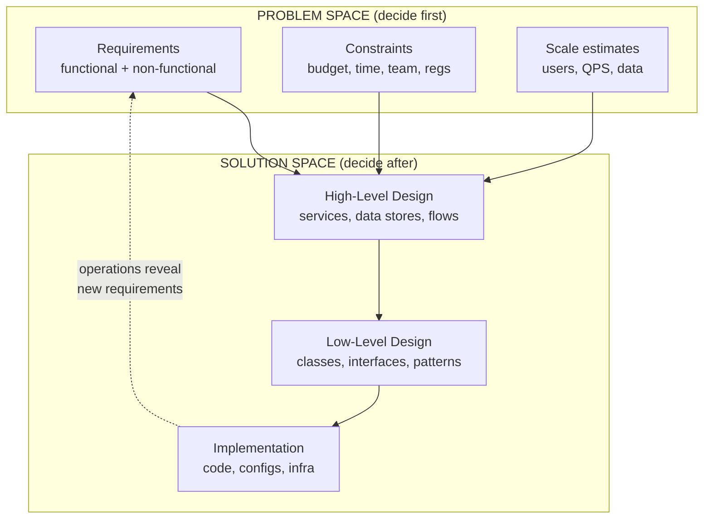
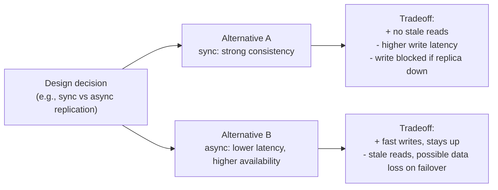

# Lesson 1.1.1 — What System Design Actually Is (and Isn't)

> Part 1: The Mindset of System Design · Module 1.1: Thinking in Systems · Difficulty: 🟢 Foundational
>
> **Prerequisites:** none beyond the platform's assumed knowledge.
> **Unlocks:** 1.1.2 (functional vs non-functional requirements), 1.1.5 (tradeoffs), all of Part 2.

---

## 1. Learning Objectives

After this lesson you will be able to:

- Define system design precisely and distinguish it from coding, algorithms, and low-level (class-level) design.
- Explain the difference between **problem-space** thinking and **solution-space** thinking, and why senior engineers spend more time in the problem space.
- Articulate the three forces every system design must balance: **correctness, the quality attributes, and cost** (including human/operational cost).
- Recognize why "there is no best design, only the best design under stated constraints" — the single most important idea in the entire platform.
- Frame any design problem as a sequence of **decisions under uncertainty**, each with consequences you can reason about.

---

## 2. Motivation — Why this discipline exists

Early software was a single program on a single machine. Correctness meant "the algorithm produces the right output." That was it. The hard problems were algorithmic.

Three forces changed everything:

1. **Scale outgrew the single machine.** Once a workload exceeds what one machine can store or process, you are *forced* into multiple machines. The moment you have more than one machine cooperating over a network, you inherit an entirely new class of problems — partial failure, message loss, clock disagreement, and coordination — that simply do not exist in a single-process program. (We formalize these in Part 8.)

2. **Software became continuously operated, not shipped-and-forgotten.** A modern system runs 24/7, is upgraded while running, and must survive hardware failures, traffic spikes, and bad deploys. "It compiles and the tests pass" is necessary but nowhere near sufficient.

3. **Businesses depend on properties beyond correctness.** A bank's ledger must be *correct*, but it must also be *available* when customers log in, *durable* so money never vanishes, *secure*, *auditable*, and *affordable* to run. These are the **quality attributes** (a.k.a. non-functional requirements or architecture characteristics — Lesson 1.2.1). They are often *harder* to satisfy than the functional behavior.

System design is the discipline that emerged to handle this combination: **building software whose structure satisfies not just what it must do, but how well it must do it, under real-world failure, scale, and cost constraints — and continues to do so as it evolves.**

Historically you can see this in the literature's own evolution: from algorithm-centric texts, to database transaction theory (ACID, recovery), to distributed-systems theory (consensus, time, ordering), to today's synthesis of all three with cloud operations and reliability engineering. This platform deliberately retraces that arc in dependency order.

---

## 3. Theory — From first principles

### 3.1 A working definition

> **System design** is the activity of choosing a *structure* — components, their responsibilities, the data that flows between them, and the guarantees they make to each other — such that the resulting system satisfies its functional requirements **and** its quality attributes, within explicit constraints, and remains operable and evolvable over time.

Unpack each clause:

- **"Choosing a structure"** — design is fundamentally about *decomposition* (what are the parts?) and *connection* (how do parts interact?). Everything else follows from these two choices.
- **"Responsibilities… guarantees they make to each other"** — components communicate through *contracts*. A database promises durability; a queue promises at-least-once delivery; a service promises a latency SLO. Design is largely the art of choosing and composing guarantees.
- **"Functional requirements AND quality attributes"** — both must hold. A correct system that falls over at 1,000 users may be useless; a blazing-fast system that returns wrong answers is worse than useless.
- **"Within explicit constraints"** — budget, team size, deadline, existing tech, regulatory rules. Constraints are not annoyances; they are the inputs that make a design *decidable*.
- **"Operable and evolvable"** — the design must be runnable by humans on call at 3 a.m. and changeable by teams six months from now.

### 3.2 Problem space vs solution space

Junior engineers jump to the solution space ("use Kafka and Redis"). Senior engineers live first in the **problem space**:

- *Problem space:* What are we actually building? Who uses it? How much? What must never break? What can be slightly wrong? What does "done" mean? What are we optimizing for?
- *Solution space:* Given the answers, what structure best satisfies them?

A solution is only as good as the problem statement it answers. **Most bad designs are correct answers to the wrong question.** This is why the design framework (Lesson 1.3.1) front-loads requirements clarification and capacity estimation before any box is drawn.

### 3.3 The three forces every design balances

Every design decision is a negotiation among three forces:

1. **Correctness** — does it produce the right results, including under concurrency and failure? (Non-negotiable for things like money; relaxable for things like a "likes" counter.)
2. **Quality attributes** — latency, throughput, availability, durability, scalability, security, maintainability, etc. These *conflict with each other* (Lesson 1.2.4). Strong consistency fights availability under partition (CAP, Lesson 10.7). Low latency fights durability. Flexibility fights performance.
3. **Cost** — infrastructure spend, but also *engineering effort*, *operational burden*, and *cognitive load* on the team. A "perfect" design no one can operate is a failed design.

```
        Correctness
            /\
           /  \
          /    \
         / DESIGN\
        /  SPACE  \
       /__________\
Quality            Cost
attributes   (infra + people)
```

You are always somewhere inside this triangle. Moving toward one vertex usually moves you away from another. **Naming where you are sitting, and why, is what design review is for.**

### 3.4 Design as decisions under uncertainty

You never have complete information: traffic forecasts are guesses, requirements change, failures are probabilistic. So design is a sequence of **decisions under uncertainty**, each of which:

- has **alternatives** (there's always more than one option),
- has **consequences** (tradeoffs that ripple through the system),
- is made with **incomplete information**, and
- should be **reversible where possible** and **documented where not** (ADRs, Lesson 1.3.3).

A useful distinction (popularized in industry, `[CONV]`): separate **one-way doors** (hard/expensive to reverse — e.g., your core data model, your partitioning key) from **two-way doors** (cheap to reverse — e.g., a cache TTL, a retry count). Spend your scarce design rigor on the one-way doors; move fast on the two-way doors.

### 3.5 What system design is *not*

- **Not algorithm design.** Algorithms optimize a computation on given data structures. System design decides *which* components exist, where data lives, and how parts survive failure. (You'll use algorithms *inside* components — consistent hashing, LRU, Raft — but that's a means, not the activity itself.)
- **Not (only) low-level design.** LLD (Part 2.4) is class/object-level: interfaces, design patterns, SOLID. It answers "how is this one service structured internally?" HLD answers "what services exist and how do they interact?" Both matter; they operate at different zoom levels (Lesson 2.4.5).
- **Not picking trendy technology.** Tools are solution-space *instances*. "Use Kafka" is not a design; "decouple producers from consumers with a durable, replayable, partitioned log because we need X throughput, replay for reprocessing, and independent consumer scaling" is a design — Kafka is just one implementation of it.
- **Not a one-time activity.** Architecture evolves. Good design plans for change (evolutionary architecture, Lesson 2.3.3).

---

## 4. Visual Intuition

### The zoom levels of design



The dashed feedback arrow is essential: running the system in production teaches you things the problem statement never could, which feeds back into requirements. Design is a **loop**, not a line.

### The decision-tradeoff model



Notice: neither alternative is "correct." Each is correct *for a different set of priorities*. That is the texture of every real design decision.

---

## 5. Real-World Analogy

**System design is urban planning, not bricklaying.**

A bricklayer (the coder) lays a perfect wall. An architect designs the building. But a *city planner* (the system designer) decides where roads, water, power, hospitals, and zoning go — anticipating growth, traffic at rush hour (load spikes), power outages (failures), and budgets, while knowing the city will keep growing and changing for decades.

- A beautiful building on a road that floods every year is a bad system.
- A city optimized purely for car throughput becomes unlivable (over-optimizing one quality attribute starves others).
- You can't rebuild the sewage system every week, so you design it carefully up front (one-way door); you *can* repaint a building cheaply (two-way door).
- The plan must work when a bridge closes (graceful degradation) and when a neighborhood doubles in population (scaling).

The planner never says "this is the perfect city." They say "this is the best layout *given* the geography, budget, population forecast, and laws." That hedge is the heart of system design.

---

## 6. Industry Example

A few publicly discussed patterns illustrate the mindset (treat exact internals as *representative*, not verbatim):

- **Amazon's "one-way vs two-way door" framing** `[CONV]` is widely cited in their leadership writing: reversible decisions should be made fast and locally; irreversible ones deserve heavy deliberation. This is exactly the "decisions under uncertainty" model from §3.4.
- **The migration arc many companies describe** (e.g., publicly documented journeys at firms like Amazon, Netflix, and others) — *monolith first, then decompose when the organization and load demand it* — is a direct expression of "best design under current constraints." The monolith was the right design at small scale; microservices became the right design at large scale and large org size. Neither was universally "better" (we make this rigorous in Part 12).
- **Google's SRE writing** `[BP]` frames reliability itself as a *deliberate target with a budget* (SLOs and error budgets, Part 14), not as "always up." That is the quality-attribute-and-cost triangle made operational: 100% reliability is the wrong target because its cost is unbounded.

The common thread: mature engineering organizations talk about *tradeoffs and constraints*, not *best technologies*.

---

## 7. Implementation Details

There's no algorithm to "implement" here, but the mindset has a concrete operational shape — a decision protocol you actually run:

**For each significant design decision:**

1. **State the decision and why it's needed now** (is it a one-way or two-way door?).
2. **Enumerate at least two real alternatives.** If you can only think of one, you don't understand the decision yet.
3. **List the forces** each alternative pushes on (correctness, which quality attributes, cost).
4. **Identify the dominant constraint** (the thing that breaks ties — e.g., "must be GDPR-compliant" or "team has no Kafka experience").
5. **Choose, and write down the tradeoff you are accepting** ("we accept stale reads up to ~Xs in exchange for staying available during a replica failure").
6. **Define how you'd know you were wrong** (a metric or condition that would trigger revisiting — this connects to fitness functions, Lesson 2.3.3).

Complexity-wise, the *cost* of a wrong one-way-door decision scales with how deeply downstream components depend on it. A wrong partitioning key, discovered after 100 TB of data has been written under it, can cost months. This is why §3.4's one-way/two-way classification is not bureaucracy — it's risk triage.

---

## 8. Advantages (of adopting this mindset)

- **Portable across technologies.** Tools change every few years; the ability to reason about decomposition, contracts, and tradeoffs does not.
- **Defensible decisions.** You can explain *why*, which is exactly what Staff+ interviews and design reviews test.
- **Cheaper mistakes.** Triaging one-way vs two-way doors concentrates rigor where reversal is expensive.
- **Better communication.** A shared vocabulary (quality attributes, contracts, tradeoffs) lets teams disagree productively.

---

## 9. Disadvantages / Costs

- **Slower at the start.** Problem-space thinking feels like "not coding." Under deadline pressure, teams skip it — and pay later.
- **Analysis paralysis risk.** Taken too far, "weighing tradeoffs" becomes an excuse not to decide. The cure: timebox, and remember most decisions are two-way doors.
- **Requires judgment, not just knowledge.** There's no lookup table for "the right design." This is why the skill takes years and why it commands seniority.

---

## 10. When NOT to over-apply it

- **Throwaway prototypes / spikes.** If the code's purpose is to learn something and then be deleted, heavy design is waste. Optimize for speed of learning.
- **Genuinely tiny, stable problems.** A cron script that moves a file does not need an architecture review. Match design effort to stakes and uncertainty.
- **When the dominant constraint is "ship today to survive as a company."** Sometimes the correct *engineering* decision is to take on deliberate, documented technical debt (Lesson 2.3.3). The mindset includes knowing when to cut corners *on purpose and visibly*.

The meta-skill: **calibrate design investment to reversibility × blast radius × uncertainty.**

---

## 11. Common Mistakes

1. **Jumping to solutions** ("we'll use microservices and Kafka") before stating requirements and scale. The cardinal sin.
2. **Treating quality attributes as free.** Saying "it should be highly available, strongly consistent, and low latency" without acknowledging these trade against each other (CAP/PACELC, Part 10).
3. **Optimizing for imaginary scale.** Designing for a billion users when you have a thousand. Over-engineering is as harmful as under-engineering, just more expensive.
4. **Ignoring operability and cost.** A design that can't be debugged or afforded is not a good design, no matter how elegant.
5. **Confusing tools with concepts.** Memorizing "use X for Y" instead of understanding the underlying decision. Tools are interchangeable; concepts are not.
6. **Presenting one option as the only option.** Signals shallow thinking in interviews and review.

---

## 12. Interview Questions

**🟢 Easy**
- In your own words, what is the difference between a functional and a non-functional requirement? Give two examples of each for a photo-sharing app.
- Why do we say "there is no best design"? Give an example where two valid designs serve different priorities.

**🟡 Medium**
- You're asked to "design Twitter." What questions do you ask *before* drawing anything, and why does each question matter?
- Give a concrete example of two quality attributes that conflict, and describe a product where each side of the conflict is the right call.

**🔴 Hard**
- Walk through a real decision you'd classify as a "one-way door" in a system you've worked on. What made it irreversible, and how much extra rigor did it deserve versus a two-way-door decision in the same system?
- A teammate proposes microservices for a brand-new product with three engineers and unknown product-market fit. Argue both for and against, and state what additional information would settle it.

**⚫ Staff+**
- You inherit a system that is "correct" but routinely misses its availability target during deploys and regional events. Describe how you'd reframe the *problem* (not the solution) with stakeholders, and how you'd convert vague "reliability" desires into engineering targets the org can fund and trade off. (Connects to SLOs/error budgets, Part 14.)
- How do you make architecture decisions in an organization where the team composition and product strategy will change within a year? Discuss reversibility, documentation, and evolutionary architecture as risk-management tools.

---

## 13. Production Pitfalls

- **The "we'll fix it later" data model.** Data-layer one-way doors (schema, partition key, ID scheme) calcify fast because data and downstream consumers pile on top. Pitfall: treating them as two-way doors early on.
- **Invisible technical debt.** Debt taken without documentation becomes indistinguishable from incompetence to the next team. Always make corner-cutting *explicit*.
- **Quality-attribute drift.** Requirements like "fast" or "reliable" that were never quantified can't be verified, so they silently rot. (Fix: quantify — Lesson 1.1.3, Part 14.)
- **Designing without operational feedback.** Teams that never close the §4 feedback loop keep solving last year's problem.

---

## 14. Optimization Techniques (for the skill itself)

- **Pre-mortems.** Before committing, ask "it's a year from now and this design failed — why?" Surfaces ignored forces cheaply.
- **Constraint-first design.** Start from the *hardest* constraint (the one that eliminates the most options) and design outward. It collapses the search space fast.
- **Two-list method.** For each decision, write the list of what each alternative *gives you* and *costs you*. Forcing the second list defeats motivated reasoning.
- **Steel-man the alternative you rejected.** If you can't argue the other side well, you haven't understood your own choice.

---

## 15. Summary

System design is choosing a *structure* — components, contracts, and data flows — that satisfies both functional requirements and quality attributes, under explicit constraints, while staying operable and evolvable. It is fundamentally **problem-space-first** work, expressed as a sequence of **decisions under uncertainty**, each balancing **correctness, quality attributes, and cost**. There is no universally best design — only the best design given stated constraints — so the core skill is **reasoning about and defending tradeoffs**, concentrating rigor on irreversible (one-way-door) decisions and moving fast on reversible ones. Everything else in this platform is, in a sense, a catalog of the components, contracts, and tradeoffs you'll compose with this mindset.

---

## 16. Revision Notes (flashcard-ready)

- **Q:** Define system design in one sentence. **A:** Choosing a structure (components, contracts, data flows) that meets functional + quality requirements under constraints, while staying operable and evolvable.
- **Q:** The three forces every decision balances? **A:** Correctness, quality attributes, cost (infra + people).
- **Q:** Why "no best design"? **A:** Quality attributes conflict; the best choice depends on which constraints dominate.
- **Q:** One-way vs two-way door? **A:** Irreversible/expensive-to-reverse vs cheap-to-reverse decisions; spend rigor on one-way doors.
- **Q:** Problem space vs solution space? **A:** *What/why/how-much* vs *what structure*; decide problem space first.
- **Q:** System design ≠ ? **A:** ≠ algorithms, ≠ only LLD, ≠ picking trendy tools, ≠ one-time activity.
- **Q:** Calibrate design effort to…? **A:** reversibility × blast radius × uncertainty.

---

## 17. Further Reading + Knowledge-Graph Links

**Within this platform**
- **Next:** [1.1.2 Functional vs Non-Functional Requirements] — turning vague asks into a spec.
- **Builds on this:** [1.1.5 Tradeoffs as the Core Skill], [1.2.4 How Characteristics Conflict], [1.3.1 The Design Framework], [1.3.3 ADRs].
- **Where this mindset becomes concrete:** [Part 10 CAP/PACELC] (the canonical quality-attribute conflict), [Part 12 Microservices] (monolith-vs-microservices as constraint-driven), [Part 14 SRE] (quality attributes as funded targets).

**Foundational texts (synthesized, not quoted)**
- Kleppmann, *Designing Data-Intensive Applications* — Ch. 1 frames reliability, scalability, maintainability as the goals; this lesson generalizes that framing.
- Richards & Ford, *Fundamentals of Software Architecture* — the centrality of architecture characteristics and "everything is a tradeoff."
- Ford, Richards, Sadalage, Dehghani, *Software Architecture: The Hard Parts* — decisions, tradeoffs, and why there are no easy answers at architectural scale.

**Concept tags used:** `[CS]` decisions-under-uncertainty model · `[CONV]` one-way/two-way doors · `[BP]` quantify quality attributes · `[OPINION]` "most bad designs answer the wrong question."
