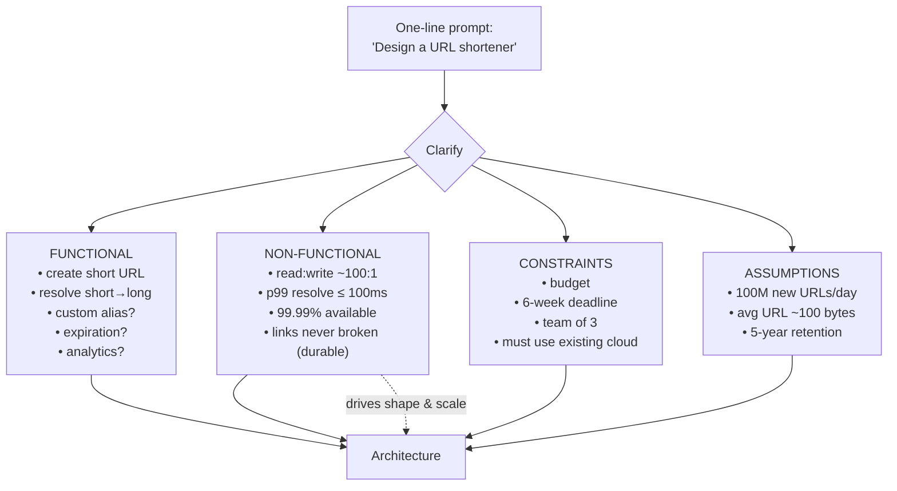
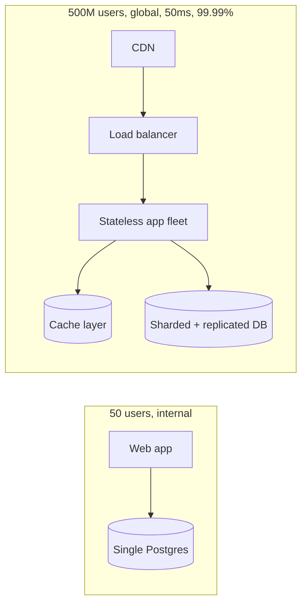

# Lesson 1.1.2 — Functional vs Non-Functional Requirements

> Part 1: The Mindset of System Design · Module 1.1: Thinking in Systems · Difficulty: 🟢 Foundational
>
> **Prerequisites:** [1.1.1 What System Design Is].
> **Unlocks:** [1.1.3 Vocabulary of Scale], [1.1.4 Capacity Estimation], [1.2.1 Quality Attributes], [1.3.1 The Design Framework].

---

## 1. Learning Objectives

After this lesson you will be able to:

- Cleanly separate **functional requirements (FRs)** — *what the system does* — from **non-functional requirements (NFRs)** — *how well it does it*.
- Extract both kinds of requirements from a vague, one-line prompt (the exact skill tested in interviews and demanded on day one of any real project).
- Express NFRs in **measurable, testable** terms instead of adjectives like "fast" or "reliable."
- Recognize **constraints** and **assumptions** as a third and fourth category that bound the design.
- Understand why NFRs — not FRs — are usually what *drives the architecture*.

---

## 2. Motivation — Why this distinction exists

Two systems can implement the **identical functionality** and yet require **completely different architectures**. Consider "store and retrieve a user's profile":

- For an internal admin tool with 50 users, a single Postgres instance and a simple web app is the *correct* design.
- For a social network serving the same *function* to 500 million users with a 50 ms latency target and 99.99% availability across three continents, you need replication, partitioning, caching, CDNs, and multi-region failover.

The function is the same. **What changed the architecture was the non-functional requirements.** This is why experienced designers obsess over NFRs: they are the forces that bend a design into its final shape.

The distinction also prevents a classic failure: teams that nail *what* the system does but never quantify *how well*, then discover in production that "it works" but is too slow, too fragile, or too expensive. NFRs make those properties explicit, negotiable, and verifiable up front.

---

## 3. Theory — From first principles

### 3.1 Functional requirements (FRs)

> **A functional requirement specifies a behavior: an input the system accepts and the output/effect it must produce.**

FRs are usually phrased as user-facing capabilities or system actions:

- "A user can shorten a long URL and receive a short alias."
- "A user can follow another user."
- "The system sends a push notification when a payment completes."

Good FRs are **verifiable by a test**: given this input/state, the system must produce that output/state. If you can't write a pass/fail test for it, it isn't yet a crisp FR.

A useful discipline: write FRs as **"actor → action → outcome"** triples. *Actor* (who/what), *action* (the verb), *outcome* (the observable result). This forces clarity about *who* triggers the behavior, which later informs API design (Lesson 1.3.1) and authorization (Part 15).

### 3.2 Non-functional requirements (NFRs / quality attributes)

> **A non-functional requirement specifies a quality of the system's operation — a property of *how* it delivers its functions, not *which* functions it delivers.**

NFRs answer questions like: How fast? How many at once? How available? How durable? How secure? How maintainable? How cheap? These are the **architecture characteristics** we formalize in Module 1.2. The critical rule:

> **An NFR is only useful if it is measurable.** "Fast" is a wish. "p99 read latency ≤ 100 ms at 50,000 QPS" is a requirement you can design toward and test against.

The transformation from adjective → metric:

| Vague adjective | Measurable NFR (illustrative) |
|---|---|
| "fast" | p50 ≤ 20 ms, p99 ≤ 150 ms for reads |
| "scalable" | sustain 100k QPS, grow to 1M QPS without re-architecture |
| "highly available" | 99.99% monthly availability (≈ 4.3 min/month downtime) |
| "durable" | no acknowledged write is ever lost; RPO = 0 for the ledger |
| "secure" | all data encrypted in transit + at rest; PII access audited |
| "cheap to run" | ≤ $X per million requests *(illustrative)* |

(We turn availability percentages into downtime budgets in Lesson 1.1.3 and Part 14.)

### 3.3 The categories that bound a design

Mature requirement-gathering produces **four** buckets, not two:

1. **Functional requirements** — what it does.
2. **Non-functional requirements** — how well it does it (the quality attributes).
3. **Constraints** — non-negotiable givens: budget, deadline, team size/skills, must-use-existing-tech, legal/regulatory rules (e.g., "financial data must stay in-region"). Constraints *remove options*; they make the design decidable (recall 1.1.1 §3.1).
4. **Assumptions** — things you *believe* true but haven't confirmed (e.g., "read:write ratio is ~100:1", "average object is ~1 KB"). Assumptions feed capacity estimation (1.1.4) and **must be stated**, because the whole design rests on them. State them out loud so they can be challenged.

### 3.4 Why NFRs usually drive the architecture

FRs determine **which components exist** (a URL shortener needs a write path to create aliases and a read path to resolve them). NFRs determine **the shape, redundancy, and distribution** of those components:

- A high read:write ratio → add caching and read replicas.
- A strict latency target → push data to the edge (CDN), denormalize, precompute.
- A high availability target → eliminate single points of failure, replicate across zones/regions.
- A strong-consistency requirement → constrains replication and may sacrifice availability under partition (CAP, Part 10).
- A regulatory data-residency constraint → forces regional partitioning of data.

So the heuristic: **FRs sketch the boxes; NFRs and constraints determine how many boxes, where they live, and what guarantees connect them.**

### 3.5 The "ility" trap and prioritization

You cannot maximize all NFRs simultaneously — many directly conflict (Lesson 1.2.4; CAP, Part 10). So requirements work isn't just *listing* NFRs; it's **ranking** them. Ask the stakeholder: *"If you had to sacrifice one, which goes first — a little staleness, or going down entirely?"* The answer reveals the system's true priorities and is worth more than a long unranked wishlist.

---

## 4. Visual Intuition

### Requirements decomposition

### Same function, different NFRs → different architecture

Identical functionality. The NFRs alone justify every extra box on the right.

---

## 5. Real-World Analogy

**Building a vehicle.** The *functional* requirement — "transport a person from A to B" — is satisfied equally by a bicycle, a sedan, and a Formula-1 car. What separates them is entirely **non-functional**: top speed, passenger capacity, fuel efficiency, safety rating, cost, terrain. A customer who says "I need to get to work" hasn't told you what to build. The moment they add "…carrying four kids, safely, cheaply, in snow," the NFRs collapse the design space to roughly one answer (a family SUV). The NFRs, not the FR, designed the vehicle.

---

## 6. Industry Example

- **Amazon's availability framing** `[CONV]`: many of their customer-facing systems publicly favor *availability* over strong consistency (the Dynamo lineage, Part 18) — an explicit NFR ranking ("stay up, tolerate slight staleness") that shaped a whole class of databases.
- **Stripe and payment systems** `[CONV]`: financial systems publicly emphasize *correctness and durability* NFRs (no double charges, no lost transactions) above raw latency — which is why they invest in idempotency keys and exactly-once *effects* (Part 11, Lesson 19.2.3). The same "charge a card" function in an e-commerce demo would never need that machinery; the NFRs do.
- **Google SRE** `[BP]`: codifies availability as a *numerical SLO with an error budget* (Part 14) — the discipline of turning the "highly available" adjective into a managed number is the entire premise of SRE.

The pattern across all three: the *function* is unremarkable; the **NFR ranking is the architectural decision.**

---

## 7. Implementation Details — A repeatable extraction procedure

Given any prompt, run this in order (this dovetails with the design framework in 1.3.1):

1. **Restate the prompt** and confirm scope. ("Design Twitter" → "the core: post tweets, follow users, view a home timeline. Do we include DMs, search, ads?")
2. **List FRs as actor→action→outcome triples.** Mark each **in-scope** or **out-of-scope** (explicitly deferring is itself a design decision).
3. **For each FR, ask the NFR questions:** latency? volume? consistency? availability? durability? Attach numbers (even rough ones).
4. **Surface constraints:** budget, deadline, team, tech mandates, compliance, data residency.
5. **State assumptions:** traffic, ratios, object sizes, growth. These become the inputs to capacity estimation (1.1.4).
6. **Rank the NFRs.** Identify the top 2–3 that dominate; note which you'd sacrifice first.
7. **Record everything** as the requirements section of the design (and the seed of an ADR, 1.3.3).

Time budget in a 45-minute interview `[CONV]`: spend ~5–8 minutes here. Too little → you design the wrong system. Too much → you run out of time for the design itself.

---

## 8. Advantages (of doing this rigorously)

- **Prevents solving the wrong problem** — the most expensive class of error (1.1.1 §3.2).
- **Makes "done" definable** — testable FRs and measurable NFRs give acceptance criteria.
- **Drives the architecture deterministically** — quantified NFRs point to specific patterns (caching, replication, partitioning).
- **Enables tradeoff conversations** — ranked NFRs let you negotiate explicitly instead of discovering conflicts in production.

---

## 9. Disadvantages / Costs

- **Up-front time** that pressured teams resist spending.
- **False precision risk** — numbers invented without data can mislead; label assumptions as assumptions and revisit them.
- **Requirements churn** — FRs and especially NFRs change; over-specifying early can lock in the wrong targets (favor ranges and revisit — connects to evolutionary architecture, 2.3.3).

---

## 10. When NOT to over-apply it

- **Exploratory spikes** where the goal is learning, not shipping — capture just enough to learn.
- **Trivial, stable tools** — a one-off script doesn't need an NFR matrix.
- **When NFRs are genuinely unknown early** (brand-new product, no traffic data): state explicit *placeholder* assumptions and design for *reversibility* rather than precise numbers. Don't fabricate certainty.

---

## 11. Common Mistakes

1. **Listing only FRs.** The most common interview failure — you describe *what* but never *how well*, so you can't justify any scaling decision later.
2. **Unmeasurable NFRs.** "Fast," "scalable," "secure" with no numbers. Untestable = useless.
3. **Unranked NFRs.** Treating all qualities as equally sacred; then you can't make tradeoffs when they conflict.
4. **Hidden assumptions.** Designing on unstated beliefs (read:write ratio, object size) that, if wrong, invalidate the whole design.
5. **Confusing constraints with requirements.** "Must use Cassandra" is a *constraint* (a given), not something you derived; conflating them hides whether it was actually justified.
6. **Gold-plating.** Inventing NFRs no stakeholder asked for ("global 5-region active-active" for an internal tool), multiplying cost and complexity.

---

## 12. Interview Questions

**🟢 Easy**
- For "design a chat app," list five functional and five non-functional requirements.
- Convert these adjectives into measurable NFRs: "fast," "always on," "handles lots of users."

**🟡 Medium**
- Two teams build the "same" feature; one needs a single database, the other needs sharding, replicas, and a cache. What kinds of requirements explain the difference? Give specific NFR values that would justify each.
- You're told the system must be "highly available *and* strongly consistent." How do you respond, and what NFR ranking question do you ask? (Foreshadows CAP, Part 10.)

**🔴 Hard**
- Given "design a payment system," derive the NFRs that force idempotency and durability machinery, and contrast with the NFRs of "design a view-counter," where you can relax them. Justify each with the cost the relaxation saves.
- A stakeholder gives you 12 NFRs, all "critical." How do you extract a real priority ordering, and how does that ordering change the architecture?

**⚫ Staff+**
- Describe how you'd evolve a system's NFRs over its lifecycle: launch (unknown traffic) → growth (10×/year) → maturity (cost optimization). What requirements work happens at each stage, and how do you avoid both premature over-engineering and late re-architecture?
- Your product org states FRs; your SRE org states reliability NFRs; they conflict (more features vs more stability). Design the *process* (error budgets, etc.) that turns this into a quantitative, fundable tradeoff rather than a political fight. (Connects to Part 14.)

---

## 13. Production Pitfalls

- **The unmeasured SLA.** Contracts promising "99.9% uptime" with no instrumentation to measure it → unverifiable and unenforceable.
- **NFR drift.** Latency targets met at launch silently degrade as data grows; without SLOs and alerts (Parts 14, 16) no one notices until customers do.
- **Assumption rot.** A read:write ratio assumed at design time inverts as the product changes (e.g., a read-heavy app adds a write-heavy feature), invalidating the caching/replication strategy.
- **Compliance discovered late.** A data-residency or PII constraint surfaced after launch can force a painful re-architecture (data partitioning by region) — these are one-way doors (1.1.1).

---

## 14. Optimization Techniques

- **The "so that" test for FRs:** every FR should trace to user/business value ("user can X *so that* Y"). FRs that fail this are scope creep.
- **The "or else" test for NFRs:** "p99 ≤ 100 ms *or else* users abandon checkout." Forces the *consequence*, which reveals the real priority and budget.
- **Quantify with ranges, not points,** when uncertain: "10k–50k QPS." Designs that survive the whole range are robust; designs that only work at one point are fragile.
- **Tie NFRs to SLOs early** so they're continuously verified in production, not just at design time (Part 14).

---

## 15. Summary

Functional requirements say **what** a system does (testable actor→action→outcome behaviors); non-functional requirements say **how well** it does it (measurable qualities — latency, throughput, availability, durability, security, cost). Two systems with identical FRs can need radically different architectures purely because of their NFRs — which is why **NFRs, together with constraints, are what actually drive the architecture.** Always express NFRs as numbers, surface your assumptions explicitly, capture hard constraints separately, and — crucially — **rank** the NFRs, because they conflict and you will have to trade them off. Getting this step right is the difference between designing the right system and building an elegant solution to the wrong problem.

---

## 16. Revision Notes (flashcard-ready)

- **Q:** FR vs NFR in one line each? **A:** FR = what it does (testable behavior); NFR = how well it does it (measurable quality).
- **Q:** Why do NFRs drive architecture? **A:** FRs decide which components exist; NFRs/constraints decide their number, distribution, redundancy, and guarantees.
- **Q:** What makes an NFR valid? **A:** It's measurable/testable (number + condition), not an adjective.
- **Q:** The four requirement buckets? **A:** Functional, non-functional, constraints, assumptions.
- **Q:** Most important thing to do with a list of NFRs? **A:** Rank them; identify which to sacrifice first (they conflict).
- **Q:** FR format to force clarity? **A:** actor → action → outcome.
- **Q:** Why state assumptions explicitly? **A:** The design rests on them; if wrong, the design is wrong — and they feed capacity estimation.

---

## 17. Further Reading + Knowledge-Graph Links

**Within this platform**
- **Previous:** [1.1.1 What System Design Is].
- **Next:** [1.1.3 The Vocabulary of Scale] — defining latency, throughput, concurrency precisely so NFRs are unambiguous.
- **Directly uses this:** [1.1.4 Capacity Estimation] (consumes your assumptions), [1.2.1–1.2.4 Quality Attributes] (the catalog of NFRs and their conflicts), [1.3.1 The Design Framework] (requirements is step 1).
- **Where NFRs become decisive:** [Part 10 CAP/PACELC], [Part 14 SRE/SLOs], [19.2.3 Payment System].

**Foundational texts (synthesized)**
- Kleppmann, *DDIA* Ch. 1 — reliability, scalability, maintainability as the core non-functional goals.
- Richards & Ford, *Fundamentals of Software Architecture* — architecture characteristics ("the -ilities") and the impossibility of maximizing all of them.

**Concept tags:** `[CONV]` interview time-boxing & NFR-ranking practice · `[BP]` quantify NFRs and tie them to SLOs · `[CS]` the FR/NFR distinction itself is standard requirements engineering.
