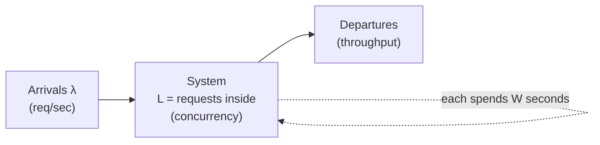
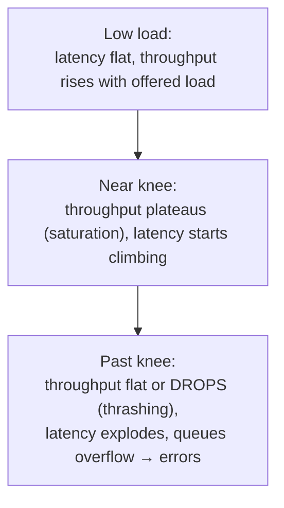

# Lesson 1.1.3 — The Vocabulary of Scale: Latency, Throughput, Concurrency, Utilization

> Part 1: The Mindset of System Design · Module 1.1: Thinking in Systems · Difficulty: 🟢 Foundational
>
> **Prerequisites:** [1.1.1], [1.1.2].
> **Unlocks:** [1.1.4 Capacity Estimation], [1.2.1 Quality Attributes], [Part 7 Scalability], [Part 17 Performance].

---

## 1. Learning Objectives

After this lesson you will be able to:

- Define **latency, response time, throughput, bandwidth, concurrency, and utilization** precisely, and stop using them interchangeably.
- Reason in **percentiles (p50/p95/p99/p99.9)** instead of averages, and explain why averages lie about user experience.
- Apply **Little's Law** (`L = λ × W`) to relate concurrency, throughput, and latency.
- Explain why **latency explodes as utilization approaches 100%** (the queueing-theory "knee") — one of the most important intuitions in all of performance engineering.
- Translate **availability percentages into downtime budgets** ("how many nines?").

---

## 2. Motivation — Why precise vocabulary matters

Most production incidents and most failed interviews share a root cause: **fuzzy use of scale vocabulary.** Someone says "the system is slow" — but is that high *latency* per request, or *low throughput* under load, or *queueing* because utilization is too high? Each has a different fix. Someone promises "we handle 10,000 users" — concurrent users? requests per second? daily actives? These differ by orders of magnitude.

These words are the **units of the design conversation**. If your units are sloppy, your estimates (1.1.4), your NFRs (1.1.2), and your bottleneck analysis (Part 17) are all sloppy. This lesson installs the precise definitions and the two or three laws that connect them.

---

## 3. Theory — From first principles

### 3.1 Latency vs response time vs service time

These are routinely conflated. Be precise `[CS]`:

- **Service time** — how long the system actively spends *processing* one request (CPU, disk, downstream calls).
- **Latency** — the duration a request is *waiting to be serviced* (queued, in flight on the network). Strictly, "latency" is the wait; colloquially it's used loosely.
- **Response time** — what the *client actually experiences* end to end = network transit + queueing + service time + serialization. **This is the number users feel**, so it's usually the right NFR target.

> Practical rule: when you write an NFR, you almost always mean **response time as observed by the client**, measured at a percentile.

### 3.2 Throughput vs bandwidth

- **Throughput** — useful work completed per unit time: requests/sec (QPS/RPS), transactions/sec (TPS), messages/sec, bytes/sec.
- **Bandwidth** — the *maximum* rate a channel *could* carry (capacity). Throughput is the *achieved* rate. You can be bandwidth-limited (pipe is full) or throughput-limited by something else (CPU, locks, a slow dependency).

Latency and throughput are **distinct and can move independently.** A system can have low latency but low throughput (handles each request fast but few at a time), or high throughput but high latency (batching: process millions/sec but each item waits in a batch window). Designing for one often trades against the other (batching is the canonical example — Part 17).

### 3.3 Concurrency vs parallelism

- **Concurrency** — number of requests *in flight at the same time* (being processed or waiting). A measure of *simultaneity of in-progress work*.
- **Parallelism** — number of things *literally executing at the same instant* (bounded by cores/machines). Concurrency is about *structure*; parallelism is about *execution* `[CS]`.

You can have high concurrency with low parallelism (1000 requests in flight, 8 cores) — the rest are waiting. This gap is where queueing lives.

### 3.4 Little's Law — the law that ties it together

For any stable system (arrival rate = departure rate over the long run) `[CS]`:

> **L = λ × W**
>
> - **L** = average number of requests *in the system* (concurrency)
> - **λ** (lambda) = average **arrival/throughput** rate (req/sec)
> - **W** = average **time in system** (response time, sec)

It is astonishingly general — no assumptions about distributions. Uses:

- **Sizing concurrency:** at λ = 5,000 req/s and W = 0.2 s, average in-flight requests L = 1,000. Your thread pools / connection pools / memory must accommodate ~1,000 concurrent requests, or you'll queue and shed load.
- **Capacity from threads:** if each request blocks a thread for W = 100 ms and you have 200 threads (L_max = 200), max throughput λ = L/W = 200/0.1 = 2,000 req/s. Beyond that, requests queue → response time climbs.

Little's Law is the bridge between the three core metrics. Memorize it.

### 3.5 Utilization and the latency "knee" (queueing intuition)

**Utilization (ρ)** = fraction of capacity in use (e.g., CPU at 70%). The crucial, counter-intuitive fact `[CS]`:

> As utilization approaches 100%, **queueing delay grows toward infinity** — and it does so *non-linearly*. The system doesn't degrade gracefully; it falls off a cliff.

For a simplified queue, waiting time scales roughly like **W ∝ 1/(1 − ρ)**. So:

| Utilization ρ | Rough relative queue wait *(illustrative)* |
|---|---|
| 50% | 2× |
| 80% | 5× |
| 90% | 10× |
| 95% | 20× |
| 99% | 100× |

This is **the** reason you never run shared resources at ~100%. The "knee" of the curve (where latency starts exploding) is typically well before saturation, which is why capacity planning (Part 14) targets utilization headroom (often ~60–70% `[BP]`, workload-dependent), not 100%. Variance in arrivals and service times makes the knee even sharper.

```
response
 time │                               *
      │                            *
      │                       *
      │                 *
      │           *
      │      *  *
      │ * *
      └─────────────────────────────── utilization
       0%       knee↑         ~100%
```

### 3.6 Percentiles, not averages

User experience is determined by the **tail**, not the mean. Why averages mislead:

- A few very slow requests barely move the *average* but ruin real users' experience.
- The slowest requests often hit your *most valuable* users (more data → more work) — Amazon and Google have publicly stressed tail latency for this reason `[CONV]`.

Use percentiles `[BP]`:
- **p50 (median)** — typical experience.
- **p95 / p99** — the slow tail most users hit occasionally.
- **p99.9 / p99.99** — rare but, at scale, *frequent in absolute terms* (at 1M req/day, p99.9 = ~1,000 slow requests/day).

**Tail amplification:** if a single request fans out to N backends and waits for all, the response time is the *max* of N samples — so even modest per-backend tails compound. With N=100 backends each at p99=10ms, the chance that *at least one* is slow per request is high, so the *overall* p99 is dominated by the backend tail. This is why fan-out systems (search, feeds) fight tail latency aggressively (hedged requests, Part 17).

> Never report a single "average latency." Always give percentiles, and always say at what throughput they were measured.

### 3.7 Availability: counting nines

Availability is usually an NFR (1.1.2). Translate the percentage into a **downtime budget** `[CS]`:

| Availability | Downtime / year | Downtime / month (≈30.4 d) | Downtime / day |
|---|---|---|---|
| 99% ("two nines") | ~3.65 days | ~7.3 hours | ~14.4 min |
| 99.9% ("three nines") | ~8.77 hours | ~43.8 min | ~1.44 min |
| 99.99% ("four nines") | ~52.6 min | ~4.38 min | ~8.6 sec |
| 99.999% ("five nines") | ~5.26 min | ~26.3 sec | ~0.86 sec |

Each extra nine ≈ 10× less downtime and *much* more than 10× the cost/complexity. This budget is the basis of **error budgets** in SRE (Part 14): 99.9% means you're *allowed* ~43 min/month of unavailability to spend on deploys, experiments, and incidents.

**Composition matters:** if a request depends on 5 services *in series*, each 99.9% available and independent, the combined availability ≈ 0.999⁵ ≈ 99.5% — *worse* than any component. Dependencies multiply; redundancy (parallel paths) is what claws nines back. (We formalize this in Part 11.)

---

## 4. Visual Intuition

### Little's Law as a pipe


`L = λ × W`: water in the pipe (L) = flow rate (λ) × time each drop spends inside (W).

### Latency vs throughput as load increases



The dangerous regime is L3: pushing more load *reduces* useful throughput (context-switch/lock/GC thrash) while latency skyrockets. Load shedding (Part 11) exists to keep you out of L3.

---

## 5. Real-World Analogy

**A highway.**
- **Latency** = how long *your* trip takes.
- **Throughput** = cars per hour passing a point.
- **Bandwidth** = the road's max possible cars/hour (number of lanes × speed limit).
- **Concurrency** = cars currently on the road.
- **Utilization** = how full the lanes are.

At 50% full, traffic flows; your trip is fast. As the road fills toward 100%, you hit the **knee**: a tiny increase in cars causes a traffic jam, and *both* your trip time (latency) explodes *and* throughput collapses (stop-and-go moves fewer cars than free flow). That's why traffic engineers — like capacity planners — keep roads below saturation. And the "average" trip time hides that rush-hour commuters (the p99) sit for an hour while 3 a.m. drivers (p50) sail through.

---

## 6. Industry Example

- **Google & Amazon on tail latency** `[CONV]`: both have publicly emphasized that *tail* latency (p99+), not average, governs user experience at scale, and that fan-out queries make tails compound — motivating techniques like hedged/tied requests. (We cover these in Part 17.)
- **Google SRE error budgets** `[BP]`: availability is managed as a numeric budget derived directly from the "nines" table above; teams spend the budget on velocity. This is §3.7 operationalized.
- **CDNs and edge caching** `[CONV]`: latency NFRs (response time as felt by users) are why companies push static and cacheable content to edge POPs — reducing *network transit*, the part of response time you can't compute your way out of (Part 3, Part 6).

---

## 7. Implementation Details — Using these in practice

**Measuring correctly:**
- Always record **response time at percentiles** under a **stated load**. "p99 = 90 ms at 20k QPS" is meaningful; "p99 = 90 ms" alone is half a statement.
- Percentiles **don't average** across servers/time windows. You cannot average two servers' p99s to get the fleet p99; you need the merged distribution (or specialized sketches like t-digest/HDR histograms `[CONV]`).
- Watch the **knee** via utilization + latency together; rising latency at flat throughput = you're at saturation.

**Estimating with Little's Law (worked):**
> A service holds a DB connection for the full request. Each request needs the DB for W_db = 5 ms. Pool size = 100 connections. Max DB-bound throughput λ = L/W = 100 / 0.005 = **20,000 req/s**. If offered load exceeds that, requests queue for a connection and response time climbs per §3.5. Fix: faster queries (↓W), bigger pool (↑L, until the DB itself saturates), or caching (↓ fraction needing the DB).

**Complexity intuition:** these aren't algorithms with Big-O, but the queueing relation `W ∝ 1/(1−ρ)` is the "complexity" that matters operationally — it's why headroom is non-optional.

---

## 8. Advantages (of fluency here)

- **Precise NFRs and estimates** — you can state and defend numbers (1.1.2, 1.1.4).
- **Correct diagnosis** — you distinguish "slow per request" from "queueing under load" and fix the right thing.
- **Predictive capacity planning** — Little's Law + utilization curves let you forecast when you'll hit the knee *before* an outage.

---

## 9. Disadvantages / Limits

- **Little's Law assumes a stable system** (arrivals ≈ departures). During bursts/overload it doesn't directly predict transient behavior — you also need queue-length and shedding analysis.
- **Percentiles need volume** — p99.9 is noisy with few samples.
- **Real workloads are bursty and correlated**, so simple `1/(1−ρ)` is a guide, not a guarantee; variance makes the knee sharper than the formula suggests.

---

## 10. When NOT to obsess over this

- **Low-scale internal tools** where any modern machine is far from the knee — precise percentile/queueing analysis is overkill; just ensure correctness.
- **Early prototypes** with no real traffic — use rough order-of-magnitude numbers, not false precision.
- But note: even then, knowing the *vocabulary* prevents miscommunication, which is always worth it.

---

## 11. Common Mistakes

1. **Reporting averages.** Hides the tail that defines user experience.
2. **Conflating latency and throughput.** "Make it faster" — by reducing per-request time, or by handling more per second? Different fixes.
3. **Targeting ~100% utilization** to "save money." Guarantees you live on the latency cliff; one traffic blip → cascading queueing failure.
4. **Quoting percentiles without load.** "p99 = 50 ms" at what QPS? Meaningless otherwise.
5. **Averaging percentiles** across hosts/windows. Statistically invalid.
6. **Ignoring dependency composition.** Assuming a system is as available as its best component, when serial dependencies *multiply* failure probabilities.
7. **Confusing "users" with "QPS."** 1M daily users ≠ 1M QPS; you must derive QPS from usage patterns (1.1.4).

---

## 12. Interview Questions

**🟢 Easy**
- Define latency vs throughput. Give an example where one is good and the other is bad.
- Convert 99.99% availability into approximate downtime per month.

**🟡 Medium**
- A service handles each request in 50 ms and has 40 worker threads (one per request). What's its max throughput, and what happens to response time beyond that? (Use Little's Law.)
- Why is p99 a better NFR target than average latency? When at scale is even p99 not enough?

**🔴 Hard**
- Explain, with the utilization–latency relationship, why a system that's "only at 85% CPU" can suddenly fall over when traffic rises 10%. What utilization target would you set and why?
- A request fans out to 50 independent backends and waits for all. Each backend has p99 = 10 ms. Reason about why the overall p99 is far worse than 10 ms, and name two mitigations.

**⚫ Staff+**
- Design the latency SLO strategy for a multi-tier system where the API depends on 6 downstream services in series. How do you allocate a 200 ms p99 budget across tiers, account for dependency composition of availability, and decide where to add redundancy vs caching vs hedging?
- Your service meets p50 targets but violates p99.9 during traffic spikes. Walk through how you'd use Little's Law, utilization curves, and tail-amplification analysis to localize and fix the cause without simply over-provisioning.

---

## 13. Production Pitfalls

- **Coordinated omission** in load testing: a naive load generator that waits for slow responses *under-counts* the slow requests, hiding the true tail. (Use open-model generators / corrected tools `[CONV]`.)
- **Autoscaling on average CPU** lets the tail rot while averages look fine; scale on latency SLO burn or p99, not just mean utilization.
- **Connection/thread pool sized by guess** rather than Little's Law → either starvation (too small) or memory blowup and thrash (too big).
- **Dashboards showing only averages** → teams are blind to the experience that actually pages them.

---

## 14. Optimization Techniques

- **Reduce W to raise λ** (Little's Law): caching, faster queries, fewer serial hops directly increase achievable throughput at fixed concurrency.
- **Keep utilization below the knee** (headroom) so latency stays flat; autoscale before the knee, not after.
- **Attack the tail directly:** hedged/tied requests, request timeouts + retries with budget, isolating slow tenants (Part 17, Part 11).
- **Batch to trade latency for throughput** *deliberately* where the NFR allows (analytics, logging), and avoid batching on the user-facing latency path.

---

## 15. Summary

Scale has a precise vocabulary: **latency/response time** (how long one request takes — measure as the client-felt response time), **throughput** (work per second — distinct from latency and from raw **bandwidth**), **concurrency** (in-flight requests) vs **parallelism** (simultaneously executing), and **utilization** (fraction of capacity used). **Little's Law (L = λ × W)** ties concurrency, throughput, and response time together and lets you size pools and predict throughput. The defining intuition is the **utilization knee**: as ρ → 100%, queueing delay grows like 1/(1−ρ) and latency explodes — so you always design for headroom. Reason in **percentiles, never averages**, always state the load at which they hold, and remember tails *compound* across fan-out and *availability multiplies* across serial dependencies. These units underpin every estimate, NFR, and bottleneck analysis in the rest of the platform.

---

## 16. Revision Notes (flashcard-ready)

- **Q:** Little's Law? **A:** L = λ × W (concurrency = throughput × time-in-system).
- **Q:** Latency vs throughput? **A:** Time per request vs requests per second; independent.
- **Q:** Concurrency vs parallelism? **A:** In-flight (structure) vs simultaneously-executing (cores).
- **Q:** Why headroom (not 100% utilization)? **A:** Queue wait ∝ 1/(1−ρ); latency explodes near saturation (the knee).
- **Q:** Why percentiles not averages? **A:** Tail defines user experience; averages hide slow requests; at scale p99.9 is frequent in absolute count.
- **Q:** 99.99% availability ≈ ? **A:** ~4.4 min downtime/month, ~52 min/year.
- **Q:** Availability of 5 serial 99.9% services? **A:** ≈0.999⁵ ≈ 99.5% — dependencies multiply, worse than any component.
- **Q:** Why does fan-out hurt tail latency? **A:** Waiting for the max of N responses; even small per-backend tails compound.

---

## 17. Further Reading + Knowledge-Graph Links

**Within this platform**
- **Previous:** [1.1.2 Functional vs Non-Functional Requirements].
- **Next:** [1.1.4 Back-of-the-Envelope Capacity Estimation] — applies this vocabulary to size systems.
- **Deep dives that build on this:** [Part 7 Scalability], [Part 14 SRE: SLOs, error budgets, capacity planning], [Part 17 Performance: tail latency, concurrency models], [Part 11 Fault Tolerance: load shedding, dependency composition].
- **Reference:** `reference/latency-and-estimation-cheatsheet.md`.

**Foundational texts (synthesized)**
- Kleppmann, *DDIA* Ch. 1 — percentiles, tail latency, and why averages mislead; head-of-line blocking and tail amplification.
- Kurose & Ross, *Computer Networking* — bandwidth, transmission/propagation/queueing delay components of response time.
- Beyer et al., *Site Reliability Engineering* — availability targets, error budgets, the cost of additional nines.

**Concept tags:** `[CS]` Little's Law, queueing/utilization relationship, availability math · `[CONV]` tail-latency emphasis, t-digest/HDR histograms, coordinated omission · `[BP]` percentiles-with-load, utilization headroom.
