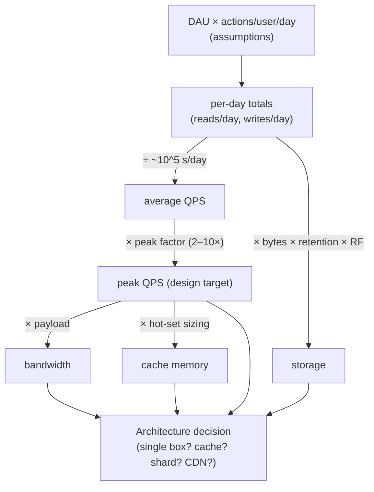

# Lesson 1.1.4 — Back-of-the-Envelope Capacity Estimation

> Part 1: The Mindset of System Design · Module 1.1: Thinking in Systems · Difficulty: 🟢🟡 Foundational→Intermediate
>
> **Prerequisites:** [1.1.2 Requirements], [1.1.3 Vocabulary of Scale].
> **Unlocks:** [1.3.1 Design Framework], [Part 7 Scalability], all of [Part 19 Interview Designs], [Part 20 Capstone].

---

## 1. Learning Objectives

After this lesson you will be able to:

- Convert usage assumptions (users, actions) into the four numbers that size every system: **QPS, storage, bandwidth, memory**.
- Compute **peak** load from average load using a realistic peak factor, and derive **read vs write** QPS from access ratios.
- Use the **powers-of-ten and latency cheat sheet** to keep arithmetic fast and approximate.
- Decide, from your estimates, **what kind of system you're building** (single box vs distributed) — the entire point of the exercise.
- Communicate estimates the way interviewers and design reviews expect: stated assumptions → rounded math → architectural implication.

---

## 2. Motivation — Why estimate at all

Capacity estimation answers the question that determines your whole architecture: **"How big is this problem, in orders of magnitude?"**

The goal is **not** precision. It's to learn whether you're dealing with:
- 100 QPS and 10 GB → one well-tuned database, done.
- 100,000 QPS and 10 TB → caching, replicas, maybe sharding.
- 10,000,000 QPS and 10 PB → partitioning, multi-region, CDNs, the works.

These regimes need *different architectures* (recall 1.1.2 §3.4). An estimate that's off by 2× is fine; one that tells you "thousands, not billions" has done its job. Skipping estimation is how engineers accidentally design a globally-sharded system for a workload that fits in RAM — or worse, a single database for a firehose.

In interviews `[CONV]`, estimation also signals seniority: it shows you reason about scale numerically, not by vibes, and it *justifies* every later decision ("we need a cache because reads are 100k QPS and the DB tops out around 20k").

---

## 3. Theory — The estimation method

### 3.1 The four target numbers

Almost every estimate reduces to four quantities:

1. **QPS (throughput)** — requests/sec, split into **read QPS** and **write QPS**.
2. **Storage** — total bytes at rest, including growth over the retention window.
3. **Bandwidth** — bytes/sec in and out (often dominated by reads × payload size).
4. **Memory** — working set you want to cache (e.g., to hit a latency NFR).

### 3.2 The pipeline: assumptions → daily → per-second → peak

A repeatable flow:

```
users/actions per day  →  per-second average  →  peak  →  split read/write  →  storage/bw/mem
```

**Step A — Start from a population and a per-user rate.**
e.g., 100 M daily active users (DAU), each posting 2 writes/day and reading 50 items/day.

**Step B — Convert per-day to per-second.** Use the key constant:

> **1 day ≈ 86,400 seconds ≈ 10⁵ seconds** (rounding to 100,000 keeps mental math fast `[CONV]`).

So *X per day ≈ X / 10⁵ per second* (a slight over-estimate of QPS, which is conservatively fine).

**Step C — Apply a peak factor.** Traffic isn't uniform; it clusters. A common modeling assumption `[CONV]` is **peak ≈ 2× to 10× average** (pick and *state* one; many use ~2–3× for steady consumer apps, higher for spiky/event-driven). Design for **peak**, not average — the average never pages you; the peak does (recall the utilization knee, 1.1.3).

**Step D — Split reads and writes.** From the read:write ratio (an assumption from 1.1.2). Read-heavy (e.g., 100:1) → caching/replicas dominate. Write-heavy → sharding/log-structured stores dominate.

**Step E — Derive storage, bandwidth, memory** from QPS × payload size × retention.

### 3.3 Storage = write rate × object size × retention

> **Storage ≈ writes/sec × bytes/write × seconds in retention window.**

Always include the **retention** horizon (NFR/constraint from 1.1.2). "100 M writes/day × 1 KB × 5 years" is a very different number from "× 1 day." Add overhead for **indexes, replication factor, and metadata**: a replication factor of 3 triples raw storage; indexes can add tens of percent.

### 3.4 Bandwidth = QPS × payload size

> **Egress ≈ read QPS × avg response bytes; Ingress ≈ write QPS × avg request bytes.**

For media (images/video) this dominates everything and usually justifies a CDN/object store (Parts 3, 6). For text/JSON it's often modest.

### 3.5 Memory for caching (the 80/20 heuristic)

A common starting heuristic `[CONV]`: **~20% of data drives ~80% of reads** (hot set). To serve the hot set from RAM:

> **Cache RAM ≈ (hot fraction) × (working dataset size)**, or sized from **read QPS × object size × cache window**.

This tells you how many cache nodes you need (e.g., total hot set / RAM per node), feeding the caching layer design (Part 6).

### 3.6 The powers-of-ten discipline

Do everything in **orders of magnitude**, rounding aggressively. Round 86,400 → 10⁵, 1 KB → 10³ B, a year (~31.5 M s) → ~3×10⁷ s. Track the exponent; the leading digit barely matters at this stage. Carry **units explicitly** (req/s, GB, Gb/s) — mixing bits and bytes or per-day and per-second is the #1 arithmetic error.

### 3.7 From estimate to architecture (the actual payoff)

Map the numbers to decisions:

| Signal from estimate | Architectural implication |
|---|---|
| Storage fits on one node (≲ a few TB) | single DB + replicas; no sharding yet |
| Storage ≫ one node | partition/shard (Part 7); choose a partition key |
| Read QPS ≫ single-DB capacity | cache + read replicas (Part 6, Part 10) |
| Write QPS ≫ single-DB capacity | shard writes; consider log-structured store (Part 4) |
| Bandwidth dominated by media | object storage + CDN (Parts 3, 6) |
| Hot set ≫ one cache node's RAM | distributed cache, consistent hashing (Part 7) |
| Peak ≫ average | autoscaling + load shedding (Parts 13, 11) |

> The estimate is worthless until you state *what it implies*. End every estimation with "…therefore we need X."

---

## 4. Visual Intuition

### The estimation funnel



---

## 5. Real-World Analogy

**Planning a restaurant.** Before signing a lease you estimate: ~300 customers/day, but they don't arrive evenly — 60% pile into a 2-hour dinner peak (the peak factor). That peak rate determines how many tables, cooks, and stoves you need (the *capacity*), not the daily average. You estimate ingredient storage from covers/day × portions × days-between-deliveries (retention). You don't compute it to the gram — you round to "about 200 kg of flour a week" — because the decision you're making (how big a fridge, how many ovens) only depends on the order of magnitude. Over-estimate and you waste rent on an empty kitchen; under-estimate and you turn away the dinner rush. Same logic, same rounding, same payoff.

---

## 6. Industry Example

- **Interview canon** `[CONV]`: the System Design Interview volumes consistently open every problem with exactly this funnel (DAU → QPS → storage/bandwidth) before any boxes are drawn — because the numbers justify the architecture (e.g., a feed system's read:write asymmetry forces fan-out/caching choices).
- **Capacity planning at scale** `[BP]`: Google's SRE practice formalizes demand forecasting and provisioning to a utilization target with headroom (ties back to the knee, 1.1.3) — the production-grade descendant of back-of-the-envelope estimation.
- **Media platforms** `[CONV]`: for video/image services, the estimate immediately reveals that *egress bandwidth*, not compute or QPS, is the dominant cost and constraint — which is precisely why such platforms are built around object storage + CDNs (Parts 3, 6, 18).

---

## 7. Implementation Details — Two fully worked examples

### Example 1: A Twitter-like home timeline (read-heavy)

**Assumptions (state them!):** 200 M DAU; each user reads the timeline 20×/day; each posts 0.5 tweets/day; tweet ≈ 300 bytes (text+metadata); retention 5 years; replication factor 3.

- **Writes/day** = 200M × 0.5 = 100M → **avg write QPS** ≈ 100M / 10⁵ = **1,000 w/s** → **peak (×3) ≈ 3,000 w/s**.
- **Reads/day** = 200M × 20 = 4B → **avg read QPS** ≈ 4B / 10⁵ = **40,000 r/s** → **peak (×3) ≈ 120,000 r/s**.
- **Read:write ≈ 40:1** → strongly read-heavy → *caching + fan-out + replicas* (Part 6, 19.1.5).
- **Storage of tweets** = 100M/day × 300 B × 365 × 5 ≈ 100M × 300 × ~1,825 ≈ ~5.5×10¹³ B ≈ **~55 TB raw**, ×3 RF ≈ **~165 TB** (+ indexes, + media stored separately). → *exceeds one node → partition* (Part 7).
- **Read bandwidth** ≈ 120,000 r/s × (say 5 KB rendered timeline page) ≈ 6×10⁸ B/s ≈ **~4.8 Gb/s** egress → *CDN/edge caching helps* (Part 3).
- **Implication:** distributed, sharded store + heavy caching + fan-out-on-write for the timeline; media offloaded to object store + CDN. (This *is* the skeleton of Lesson 19.1.5.)

### Example 2: A URL shortener (write-then-read-heavy, tiny payload)

**Assumptions:** 100 M new URLs/day; read:write = 100:1; each record ≈ 500 B (short code, long URL, metadata); retention 10 years; RF 3.

- **Write QPS** ≈ 100M / 10⁵ = **1,000 w/s**; **peak ≈ 2,000–3,000 w/s**.
- **Read QPS** ≈ 100× = **100,000 r/s avg**; **peak ≈ 200,000–300,000 r/s**.
- **Storage** = 100M/day × 500 B × 365 × 10 ≈ ~1.8×10¹⁴ B ≈ **~180 TB** raw, ×3 ≈ **~540 TB**. → *partition by key*.
- **Memory (cache the hot 20%):** the redirect path is latency-critical and tiny per record; caching hot codes in RAM serves most of the 100k+ read QPS cheaply. → *Redis-style cache in front of a key-value store*.
- **Implication:** key-value store partitioned by short code, fronted by a large distributed cache; the read path is a cache lookup, not a DB hit. (Skeleton of Lesson 19.1.1.)

### Mental-math toolkit (memorize)
- seconds/day ≈ **10⁵** (really 86,400); seconds/month ≈ **2.5×10⁶**; seconds/year ≈ **3×10⁷** (really ~31.5M).
- 1 KB=10³ B, 1 MB=10⁶, 1 GB=10⁹, 1 TB=10¹², 1 PB=10¹⁵ (decimal approximations for estimation `[CONV]`).
- char ≈ 1 B; typical small JSON record ≈ 0.5–2 KB; thumbnail ≈ tens of KB; photo ≈ low MB; minute of SD video ≈ several MB *(all illustrative)*.
- "X million/day ÷ 10 ≈ X×100 per second" shortcut: 1M/day ≈ ~12/s; 100M/day ≈ ~1,200/s (or ~1,000/s with the 10⁵ rounding).

(Full numbers in `reference/latency-and-estimation-cheatsheet.md`.)

---

## 8. Advantages

- **Sizes the problem in minutes** with paper-level effort.
- **Justifies architecture** — every component traces to a number, satisfying design reviews and interviewers.
- **Surfaces the dominant constraint early** (is it storage? QPS? bandwidth? memory?), focusing the design.
- **Catches order-of-magnitude mistakes** before they become quarters of wasted engineering.

---

## 9. Disadvantages / Limits

- **It's approximate** — never mistake an estimate for a measurement; validate with load tests (Part 7/17) once real.
- **Garbage in, garbage out** — wrong assumptions (especially read:write ratio and payload size) propagate; that's why you *state and rank* them.
- **Doesn't capture distribution/burstiness** beyond a crude peak factor — real spikes (launches, viral events) can exceed any static factor; combine with autoscaling/shedding.

---

## 10. When NOT to over-invest

- **Tiny/internal systems** clearly far below one machine's capacity — a one-line "this fits on one box" estimate suffices.
- **Brand-new products with no usage signal** — estimate a *range* and design for reversibility instead of betting on a precise number.
- **When real telemetry exists** — measured production numbers beat any envelope; use estimation to *forecast growth*, not to re-derive what you can observe.

---

## 11. Common Mistakes

1. **Designing for average, not peak.** The peak is what saturates you (1.1.3 knee).
2. **Forgetting retention and replication factor** in storage — off by 1–2 orders of magnitude.
3. **Mixing units** — bits vs bytes (×8), per-day vs per-second, GB vs Gb. Carry units religiously.
4. **Skipping the read:write split** — it's the single most architecture-determining ratio.
5. **False precision** — computing "47,329 QPS" implies confidence you don't have; say "~50k QPS."
6. **Not stating assumptions** — an unstated assumption can't be challenged or corrected.
7. **Estimating but never concluding** — numbers with no "therefore" are useless (the whole point is the architectural implication).
8. **Ignoring metadata/index/overhead** — real storage > raw payload sum.

---

## 12. Interview Questions

**🟢 Easy**
- Roughly how many seconds are in a day, and why do we round it to 10⁵?
- 50 M writes/day at 2 KB each, kept for 1 year, replication factor 3 — estimate total storage.

**🟡 Medium**
- For a photo-sharing app with 50 M DAU each uploading 2 photos/day (avg 1.5 MB) and viewing 100 photos/day, estimate write QPS, read QPS, daily storage growth, and read bandwidth. What's the dominant constraint?
- Given peak ≈ 3× average and a read:write ratio of 50:1, derive peak read and write QPS from 200 M reads/day.

**🔴 Hard**
- Estimate a video platform's storage and egress for 1 M hours of video uploaded/day at multiple encodings, with global viewing 100× the upload volume. Show how the numbers force an object-store + CDN architecture and where caching matters most.
- You estimate 540 TB and 250k peak read QPS for a key-value workload. Walk from these numbers to a concrete topology: how many shards, how many cache nodes, what replication, and why.

**⚫ Staff+**
- A product expects 10×/year growth for 3 years. Show how you'd estimate capacity at each horizon and design so the *one-way-door* decisions (partition key, ID scheme) survive all three, while two-way-door decisions are deferred. Where would naive estimation lead you to over-build on day one?
- Your envelope estimate and your measured production numbers disagree by 5×. Describe how you'd reconcile them, which you'd trust for which decision, and how the discrepancy itself informs capacity planning and SLOs.

---

## 13. Production Pitfalls

- **Estimating once, never revisiting.** Assumptions rot (1.1.2 §13); capacity must be re-forecast as the product changes.
- **Provisioning to average → outages at peak**; or provisioning to all-time peak → wasted spend. The fix is peak-aware capacity + autoscaling with headroom (Parts 13, 14).
- **Ignoring amplification:** one user action can trigger many internal requests (fan-out, retries, replication writes); internal QPS often ≫ external QPS. Estimate *internal* load, not just front-door.
- **Storage growth blindness:** linear daily growth that crosses a node/cluster limit months later, unnoticed until writes fail. Forecast the crossing point.

---

## 14. Optimization Techniques

- **Estimate internal amplification factors** (replication writes, fan-out reads, retries) and apply them — the real load on the DB is rarely the external QPS.
- **Separate hot/cold data** in the estimate; size expensive fast storage for hot data only, cheap object storage for cold (cost engineering, Part 17).
- **Use the estimate to choose the partition count up front** so you don't re-shard later (a painful one-way door — Part 7).
- **Pre-compute the "cache vs DB" split**: fraction of reads served from cache directly sets DB QPS and thus DB sizing.

---

## 15. Summary

Back-of-the-envelope estimation turns usage assumptions into the four numbers that size any system — **QPS (read/write), storage, bandwidth, and cache memory** — using a simple funnel: *population × per-user rate → per-day → ÷10⁵ for per-second → × peak factor → split reads/writes → derive storage (× size × retention × replication) and bandwidth (× payload)*. Work in **orders of magnitude**, carry **units**, **state assumptions**, design for **peak**, and — most importantly — **conclude with the architectural implication** ("therefore single box / cache / shard / CDN"). The aim is never precision; it's to learn which *regime* you're in, because the regime dictates the architecture. This skill is the numerical backbone of every interview design (Part 19) and the capstone (Part 20).

---

## 16. Revision Notes (flashcard-ready)

- **Q:** Four numbers to estimate? **A:** QPS (read/write), storage, bandwidth, cache memory.
- **Q:** Seconds/day for mental math? **A:** ~10⁵ (86,400).
- **Q:** Average → peak? **A:** × peak factor (~2–10×, state it); design for peak.
- **Q:** Storage formula? **A:** writes/s × bytes/write × retention seconds × replication factor (+ index/metadata overhead).
- **Q:** Bandwidth formula? **A:** QPS × payload bytes (reads dominate egress; media dominates everything).
- **Q:** Most architecture-determining ratio? **A:** read:write ratio.
- **Q:** The point of estimating? **A:** Determine the regime → the architectural implication ("therefore X").
- **Q:** Why estimate internal (not just external) load? **A:** Fan-out, replication, retries amplify front-door QPS.

---

## 17. Further Reading + Knowledge-Graph Links

**Within this platform**
- **Previous:** [1.1.3 The Vocabulary of Scale] (provides QPS, percentiles, Little's Law).
- **Next:** [1.1.5 Tradeoffs as the Core Skill].
- **Used directly by:** [1.3.1 Design Framework] (estimation is step 2), every [Part 19] problem, and [Part 20] capstone (20.2 capacity).
- **Feeds:** [Part 7 Scalability] (sharding/cache sizing), [Part 14 SRE] (capacity planning), [Part 17 Performance/cost].
- **Reference:** `reference/latency-and-estimation-cheatsheet.md`.

**Foundational texts (synthesized)**
- *System Design Interview* Vol. 1 & 2 — the DAU→QPS→storage estimation funnel applied per problem.
- Kleppmann, *DDIA* — read/write ratios and access patterns as the basis for storage-engine and replication choices.
- Beyer et al., *SRE* — capacity planning, demand forecasting, provisioning with headroom.

**Concept tags:** `[CONV]` rounding conventions, peak factors, 80/20 hot-set heuristic, interview funnel · `[BP]` design-for-peak with headroom, state assumptions · `[CS]` the underlying arithmetic and units.
