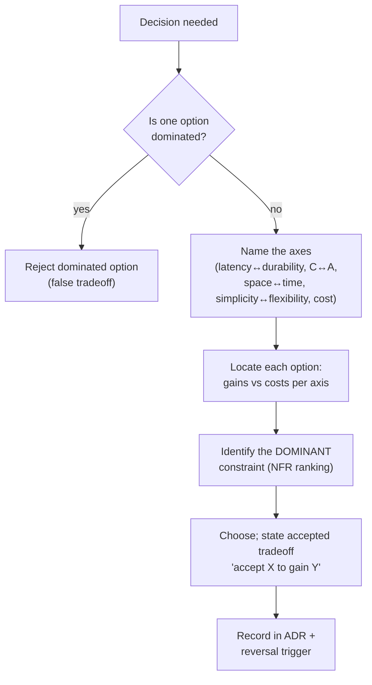
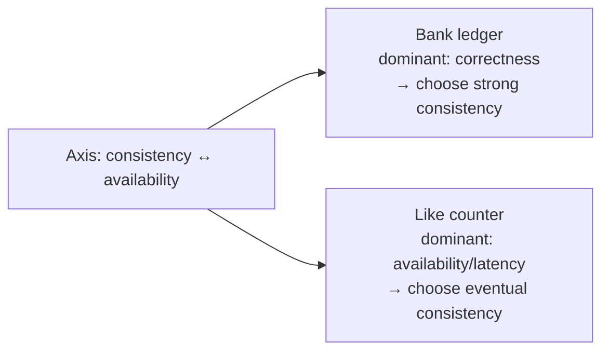

# Lesson 1.1.5 — Tradeoffs as the Core Skill

> Part 1: The Mindset of System Design · Module 1.1: Thinking in Systems · Difficulty: 🟢🟡 Foundational→Intermediate
>
> **Prerequisites:** [1.1.1 What System Design Is], [1.1.2 Requirements], [1.1.3 Vocabulary of Scale].
> **Unlocks:** [1.2.4 How Characteristics Conflict], [1.3.1 Design Framework], [Part 10 CAP/PACELC], and essentially every design decision in the platform.

---

## 1. Learning Objectives

After this lesson you will be able to:

- Articulate why **"everything is a tradeoff"** is the single most defining sentence of senior engineering — and use it without sounding glib.
- Recognize the **recurring tradeoff axes** that appear in nearly every system (latency↔durability, consistency↔availability, space↔time, simplicity↔flexibility, cost↔everything).
- Run a structured **tradeoff analysis**: name the axes, locate where each option sits, identify the *dominant constraint* that breaks the tie.
- Distinguish a **real tradeoff** (genuine give-and-take) from a **false tradeoff** (a strictly-dominated option you should just reject).
- Communicate tradeoffs the way Staff+ reviews and interviews expect: *"We chose X over Y, accepting cost A to gain benefit B, because constraint C dominates here."*

---

## 2. Motivation — Why this is *the* skill

Junior engineers ask "What's the best database / pattern / architecture?" Senior engineers know the question is malformed — the honest answer is always **"it depends, and here's exactly on what."** Everything that follows in this platform — replication topologies, consistency models, caching strategies, microservices vs monolith — is ultimately a **menu of tradeoffs**. Knowing the options is table stakes; knowing *which tradeoff to make under which constraints* is the actual expertise.

This is also the thing interviews and promotion committees are really testing. They rarely care whether you say "Cassandra" or "DynamoDB." They care whether you can say *why*, *what you're giving up*, and *what would change your mind*. A candidate who lists features sounds like a brochure; a candidate who reasons about tradeoffs sounds like an architect.

The "Hard Parts" of architecture (Part 2.3, Part 12) get their name precisely because they have **no right answer** — only tradeoffs you must analyze and defend. This lesson installs the engine you'll run thousands of times.

---

## 3. Theory — From first principles

### 3.1 Why tradeoffs are unavoidable

Tradeoffs exist because **resources and physical laws are finite and quality attributes conflict** (1.1.2, 1.2.4):

- You cannot make a write both *durable on multiple machines* and *as fast as a single in-memory write* — replication takes time and network round trips (1.1.3 latency numbers).
- You cannot be both *strongly consistent* and *fully available* when the network partitions — that's a theorem, not a preference (CAP, Part 10).
- You cannot have a structure that is *maximally simple* and *maximally flexible* — flexibility adds indirection, which adds complexity.

So design is **constrained optimization**: maximize the objectives you care most about, subject to the laws and resources you can't escape. Because objectives conflict, improving one usually costs another. That "usually" is the tradeoff.

### 3.2 The recurring tradeoff axes

A surprisingly small set of axes recurs across the entire field. Learn to spot them and you can analyze almost any decision `[CONV]`/`[CS]`:

1. **Latency ↔ Durability/Consistency.** Acknowledge a write faster (risk loss / staleness) vs replicate-and-confirm first (safer, slower). (Replication, Part 10; WAL/fsync, Part 4.)
2. **Consistency ↔ Availability** (under partition). Refuse to serve possibly-stale data (consistent, less available) vs serve it (available, possibly stale). (CAP/PACELC, Part 10.)
3. **Space ↔ Time.** Precompute/denormalize/cache/index (more storage, faster reads) vs compute on demand (less storage, slower). The most common engineering tradeoff of all. (Caching Part 6; indexing Part 4; materialized views Part 9.)
4. **Read-optimized ↔ Write-optimized.** B-Trees (fast reads) vs LSM-Trees (fast writes); normalized (fast writes, clean) vs denormalized (fast reads). (Part 4, Part 5.)
5. **Simplicity ↔ Flexibility/Generality.** A simple, rigid design is easy to operate but hard to evolve; a flexible, abstract one is the reverse. (Architecture styles, Part 2.)
6. **Coupling ↔ Autonomy.** Tightly integrated (efficient, but changes ripple) vs decoupled services (independent, but more moving parts and eventual consistency). (Microservices, Part 12.)
7. **Cost ↔ Everything.** Every nine of availability, every ms of latency, every replica costs money and operational effort. Cost is the axis that touches all others (1.1.4, Part 17).
8. **Latency ↔ Throughput.** Batching raises throughput but adds per-item latency (1.1.3).
9. **Time-to-market ↔ Long-term maintainability.** Ship fast with debt vs build it right (Part 2.3, technical debt).

> **Mental move:** when facing any decision, ask *"which of these axes am I on?"* Naming the axis turns a vague "hmm, which is better?" into a structured analysis.

### 3.3 The anatomy of a tradeoff decision

A disciplined analysis has five parts (this operationalizes 1.1.1 §3.4):

1. **The decision** and whether it's a one-way or two-way door.
2. **The axes** in play (from §3.2).
3. **Where each option sits** on those axes — its *gains* and *costs*.
4. **The dominant constraint** — the requirement/NFR ranking (1.1.2 §3.5) that breaks the tie. *This is the crux.* Two options can be equally reasonable in the abstract; the dominant constraint decides.
5. **The accepted tradeoff, stated explicitly** — "we accept C to gain B."

The dominant constraint is why the *same* decision flips between contexts. "Strong vs eventual consistency" → strong for a bank ledger (correctness dominates), eventual for a like-counter (availability/latency dominate). Same axis, opposite answer, because the dominant constraint differs. **A tradeoff answer without a stated dominant constraint is incomplete.**

### 3.4 Real tradeoffs vs false tradeoffs (dominance)

Not every "choice" is a genuine tradeoff. Option A **dominates** option B if A is at least as good on every axis you care about and strictly better on one. A dominated option isn't a tradeoff — it's just *worse*; reject it. `[CS]`

- *False tradeoff:* "Should we add an index?" when reads are 1000:1 over writes, the table is huge, and write latency is non-critical — adding the index dominates. Don't agonize; just do it.
- *Real tradeoff:* the same index on a write-heavy, latency-critical table — now the write-amplification cost is real and the answer genuinely depends on the dominant constraint.

Senior skill includes *quickly discarding* dominated options so you spend analysis budget on the genuinely hard ones. (Beware, though: an option that looks dominated often has a hidden axis — operational simplicity, team familiarity, cost — that you forgot to list. Re-check before declaring dominance.)

### 3.5 Tradeoffs change over time

A tradeoff's "right" answer is a function of context, and context drifts:

- **Scale changes it:** a monolith dominates at small scale (simpler, faster to ship); microservices may win at large org/load scale. Neither is universally better (Part 12).
- **Hardware changes it:** when RAM was tiny and disks slow, certain space↔time tradeoffs went one way; cheap RAM/SSD flips them.
- **Team changes it:** "use the boring tech the team knows" can dominate "use the theoretically optimal tech nobody can operate."

Hence: **revisit one-way-door tradeoffs rarely but deliberately; revisit two-way-door tradeoffs freely.** And document the *context* that justified a decision (ADR, 1.3.3), so a future team knows when it no longer holds (fitness functions, 2.3.3).

### 3.6 Avoiding the two failure modes

- **Analysis paralysis** — endlessly weighing a two-way-door decision. Cure: timebox, pick, and note the reversal trigger.
- **Glib hand-waving** — saying "it's a tradeoff" as a thought-terminating phrase. Cure: *always* finish the sentence — *between what and what, costing what, gaining what, dominated by which constraint.* "It depends" is only a senior answer if you immediately say *on what*.

---

## 4. Visual Intuition

### The tradeoff analysis loop



### Same axis, opposite answers (dominant constraint flips it)



### A tradeoff "radar" for comparing options (conceptual)

```
        Latency
          *
   Cost *   * Consistency      Option A: ●  Option B: ○
       *     *
 Simplicity * Availability
        (plot each option's strength per axis;
         no option fills every spoke — that's the point)
```

---

## 5. Real-World Analogy

**Choosing a vehicle / a house / a meal — any constrained decision.** A sports car trades cargo space and fuel economy for speed; a minivan trades speed for capacity. Neither is "better" — it depends on whether you're racing or carpooling (the dominant constraint). The salesperson who insists one car is objectively best is selling, not advising. The good advisor asks *what you need it for* (requirements), notices you have three kids and a tight budget (constraints), and then the choice nearly makes itself. A car that's worse on *every* axis at the same price is dominated — you don't "trade off," you just don't buy it. And the right choice changes with life stage (context drift): the two-seater that was perfect at 25 is a bad call at 35 with a family.

---

## 6. Industry Example

- **CAP as the canonical tradeoff** `[CS]`: the entire NoSQL movement is organized around the consistency↔availability axis. Dynamo-lineage stores (Cassandra, DynamoDB) chose availability + eventual consistency; Spanner-lineage chose strong consistency at the cost of complex infrastructure (TrueTime) and write latency. Both are *correct* — for different dominant constraints (Parts 10, 18).
- **Monolith → microservices migrations** `[CONV]`: publicly documented journeys (e.g., at large consumer companies) explicitly frame the move as a tradeoff that *flipped* as the organization and load grew — autonomy/scalability began to dominate over the monolith's simplicity (Part 12).
- **Amazon's reversibility framing** `[CONV]`: one-way vs two-way doors is literally a tradeoff-management policy — invest analysis proportional to irreversibility (1.1.1).
- **"Boring technology" advocacy** `[OPINION]`: a widely-shared industry view that team familiarity and operational simplicity often *dominate* theoretical optimality — a tradeoff on the simplicity↔generality and human-cost axes.

---

## 7. Implementation Details — A reusable tradeoff worksheet

You'll use this in design reviews and interviews. (A blank copy lives in `reference/tradeoff-worksheet.md`.)

```
DECISION: ______________________________   Door type: [one-way / two-way]

OPTIONS:           Option A: ___________     Option B: ___________

AXES & POSITIONS (per axis, who wins and what it costs):
  Latency:         A ___  B ___
  Consistency:     A ___  B ___
  Availability:    A ___  B ___
  Space/$:         A ___  B ___
  Simplicity/Ops:  A ___  B ___
  Evolvability:    A ___  B ___

DOMINATED OPTION? (reject if any option loses on all axes you care about): ____

DOMINANT CONSTRAINT (the NFR/ranking that breaks the tie): ________________

DECISION: choose ____ ; ACCEPTING [cost] ____ TO GAIN [benefit] ____ .

REVERSAL TRIGGER (what future fact would change this): __________________
```

**How to drive it verbally (interview):** "There are two reasonable options. On the consistency↔availability axis, A gives me strong consistency but blocks writes during a partition; B stays available but allows stale reads. Since this is a payment ledger, *correctness dominates*, so I choose A, accepting reduced availability during partitions — and I'd mitigate that with [X]. If this were a social feed, I'd flip to B." That sentence is what Staff+ sounds like.

---

## 8. Advantages (of mastering tradeoff reasoning)

- **Universally portable** — works for any technology, present or future.
- **Defensible** — produces decisions you can justify to skeptics, reviewers, and committees.
- **Fast where it should be** — dominance-checking lets you discard easy options instantly and focus on the hard ones.
- **Aligns teams** — naming axes and the dominant constraint turns opinion fights into structured analysis.

---

## 9. Disadvantages / Costs

- **Requires judgment and breadth** — you must actually know the options and their costs (hence the rest of the platform).
- **Can stall decisions** if misused as an excuse to keep analyzing (paralysis, §3.6).
- **Hidden axes bite** — if you forget an axis (operational cost, security, team skill), your "dominant constraint" analysis can be confidently wrong.

---

## 10. When NOT to belabor tradeoffs

- **Dominated options** — when one choice is strictly better on all relevant axes, just pick it; "analysis" is theater.
- **Two-way doors with low blast radius** — pick the reasonable default, set a reversal trigger, move on (1.1.1).
- **Truly trivial/throwaway work** — match analysis to stakes.
- **When the dominant constraint is obvious and overwhelming** (e.g., a hard legal mandate) — state it and proceed; no need to enumerate the whole worksheet.

---

## 11. Common Mistakes

1. **"It depends" with no continuation.** The cardinal sin: stating a tradeoff exists without naming the axes, costs, and dominant constraint.
2. **Ignoring the dominant constraint.** Comparing options in the abstract and never grounding the choice in *this* system's ranked NFRs.
3. **Treating false tradeoffs as real** (agonizing over dominated options) — or the reverse, **declaring dominance prematurely** because you missed an axis.
4. **Optimizing one axis to the floor of others.** Maxing latency until durability or cost collapses; ignoring that axes are coupled.
5. **Forgetting context drift.** Defending a decision with reasoning that was true at 10× smaller scale or older hardware.
6. **No reversal trigger.** Making a call without recording what future fact should reopen it.
7. **Buzzword-driven choices.** Picking the trendy option and *back-filling* a tradeoff story (motivated reasoning). Steel-man the alternative to catch this.

---

## 12. Interview Questions

**🟢 Easy**
- Give three classic tradeoff axes in system design and one concrete decision on each.
- Why is "what's the best database?" a malformed question? How would you reframe it?

**🟡 Medium**
- For "add a secondary index," describe when it's a *false* tradeoff (just do it) and when it's a *real* one. What's the dominant constraint in each case?
- Take the consistency↔availability axis and give two real products where opposite choices are correct, naming the dominant constraint each time.

**🔴 Hard**
- You're choosing between a normalized schema and a denormalized one for a read-heavy feed. Walk the full tradeoff worksheet: axes, positions, dominant constraint, accepted tradeoff, and reversal trigger.
- A teammate insists technology X is "objectively best." Without knowing X, how do you redirect the conversation to surface the actual tradeoffs and constraints — and what hidden axes would you make sure to raise?

**⚫ Staff+**
- Describe a decision you'd revisit as a system scales 100×. Identify which tradeoffs *flip* with scale, which one-way doors you must get right *now* despite small current scale, and how you'd document the context so a future team knows when your choice expires.
- You're mediating two senior engineers who each have a defensible architecture. Design a *process* to resolve it objectively (axes, weighted constraints, prototyping/fitness functions) rather than by seniority or volume. How do you guard against motivated reasoning and hidden-axis blind spots?

---

## 13. Production Pitfalls

- **Stale tradeoffs in production.** A consistency/replication choice made at launch becomes wrong as load and data grow, but nobody revisits it because the *context* was never written down (fix: ADRs + fitness functions, 2.3.3).
- **Latency-vs-durability misconfiguration.** Defaulting a datastore to async/relaxed acks for speed, then losing acknowledged writes in a failover because durability was the *real* dominant constraint (Part 4, Part 11).
- **Over-optimized one axis.** Squeezing cost so hard you remove the redundancy that availability required — the cost↔availability tradeoff made implicitly and wrongly.
- **Hidden operational-cost axis.** Choosing a powerful-but-exotic tool whose operational burden (the unnamed axis) eventually dominates and pages the team nightly.

---

## 14. Optimization Techniques (for the reasoning itself)

- **Make the axes explicit and visible** (the worksheet/radar) so no axis is silently ignored — especially cost, ops, and security.
- **Rank NFRs first** (1.1.2 §3.5); the ranking *is* your dominant-constraint generator.
- **Steel-man the rejected option** to defeat motivated reasoning; if you can't argue it, you don't understand your choice.
- **Pre-mortem the chosen tradeoff** ("a year later this choice failed — which accepted cost bit us?") to test whether you mis-ranked constraints.
- **Attach reversal triggers** so two-way doors get revisited automatically when the context shifts (tie to metrics/fitness functions).

---

## 15. Summary

The core skill of system design is not knowing options — it's **reasoning about tradeoffs** among them. Tradeoffs are unavoidable because quality attributes and physical resources conflict, so design is constrained optimization. A small set of **recurring axes** (latency↔durability, consistency↔availability, space↔time, read↔write, simplicity↔flexibility, coupling↔autonomy, and cost cutting across all) covers most decisions. A complete tradeoff analysis names the axes, locates each option's gains and costs, and — crucially — identifies the **dominant constraint** (from your ranked NFRs) that breaks the tie, then states the accepted tradeoff explicitly and records a reversal trigger. Reject **dominated** options quickly (false tradeoffs) and spend analysis on the genuine ones; remember the right answer **drifts** with scale, hardware, and team. The mark of seniority is never "it depends" — it's "it depends *on this, and here's my call and why*."

---

## 16. Revision Notes (flashcard-ready)

- **Q:** Why are tradeoffs unavoidable? **A:** Quality attributes and resources conflict; design is constrained optimization.
- **Q:** Name five recurring axes. **A:** latency↔durability, consistency↔availability, space↔time, simplicity↔flexibility, cost↔everything (also read↔write, coupling↔autonomy, latency↔throughput).
- **Q:** What breaks a tradeoff tie? **A:** The dominant constraint — your ranked NFRs.
- **Q:** Real vs false tradeoff? **A:** Real = genuine give-and-take; false = a dominated option (just reject it).
- **Q:** Why does the same axis get opposite answers? **A:** Different dominant constraint (bank → consistency; like-counter → availability).
- **Q:** Complete a tradeoff sentence. **A:** "Choose X over Y, accepting cost A to gain B, because constraint C dominates; revisit if D."
- **Q:** Two failure modes? **A:** Analysis paralysis; glib "it depends" with no continuation.
- **Q:** What makes a tradeoff drift? **A:** Scale, hardware, team/context change.

---

## 17. Further Reading + Knowledge-Graph Links

**Within this platform**
- **Previous:** [1.1.4 Capacity Estimation]. **Completes:** Module 1.1 → next is [1.2.1 Quality Attributes].
- **Direct sequels:** [1.2.4 How Characteristics Conflict] (the axes formalized as architecture characteristics), [1.3.3 ADRs] (recording tradeoffs).
- **Where specific tradeoffs get rigorous:** [Part 4 B-Tree vs LSM], [Part 10 CAP/PACELC, consistency spectrum], [Part 12 Monolith vs Microservices], [Part 2.3 The Hard Parts].
- **Reference:** `reference/tradeoff-worksheet.md`, `reference/architecture-comparison-matrix.md`.

**Foundational texts (synthesized)**
- Ford, Richards, Sadalage, Dehghani, *Software Architecture: The Hard Parts* — "there are no best practices, only tradeoffs"; structured tradeoff analysis.
- Richards & Ford, *Fundamentals of Software Architecture* — conflicting architecture characteristics; "everything is a tradeoff."
- Kleppmann, *DDIA* — recurring concrete tradeoffs (storage engines, replication, consistency) used as worked examples throughout this platform.

**Concept tags:** `[CS]` constrained optimization, dominance · `[CONV]` recurring-axes framing, one-way/two-way doors · `[BP]` rank NFRs → dominant constraint, record reversal triggers · `[OPINION]` "boring technology" / human-cost axis.
