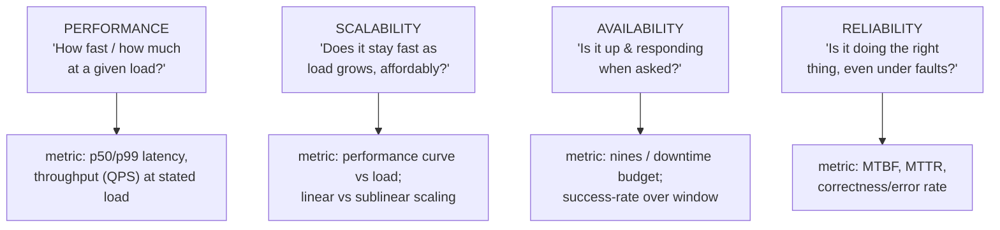
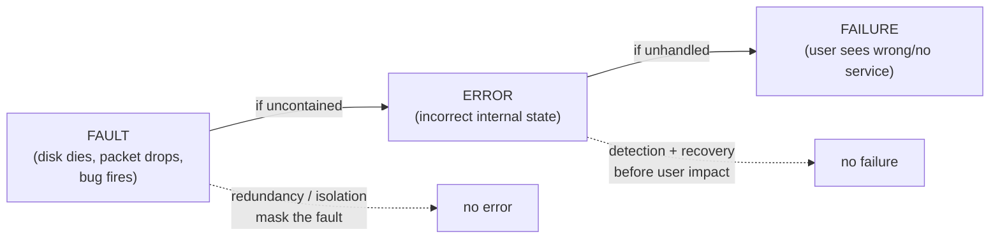

# Lesson 1.2.1 — Scalability, Performance, Availability, Reliability: Precise Definitions

> Part 1: The Mindset of System Design · Module 1.2: Quality Attributes · Difficulty: 🟢🟡
>
> **Prerequisites:** [1.1.2 Requirements], [1.1.3 Vocabulary of Scale].
> **Unlocks:** [1.2.2 Maintainability & Operability], [1.2.4 How Characteristics Conflict], [Part 7 Scalability], [Part 11 Fault Tolerance], [Part 14 SRE].

---

## 1. Learning Objectives

After this lesson you will be able to:

- Give **precise, non-overlapping definitions** of performance, scalability, availability, and reliability — four words engineers constantly blur together.
- Explain why **a system can be reliable but not available**, **available but not reliable**, **performant but not scalable**, and every other combination.
- Distinguish **fault, error, and failure** — the vocabulary that makes reliability discussable.
- Connect each attribute to a **measurable metric** (latency percentiles, QPS, nines, MTBF/MTTR) so it becomes an NFR you can design toward (1.1.2).
- Recognize these four as the "big four" architecture characteristics that dominate most system designs.

---

## 2. Motivation — Why definitions matter here

These four words appear in every design doc, incident review, and interview — and they're misused constantly. "The system is reliable" might mean it's fast, or up, or rarely wrong, depending on who's speaking. That ambiguity is dangerous: you can't *design for* or *measure* a word that means four things.

Kleppmann's framing in *DDIA* is a useful anchor `[CS]`: the three foundational concerns are **reliability, scalability, and maintainability**. We expand performance and availability out of that cluster because at scale they're targeted and measured independently. Getting these definitions crisp is what lets you write good NFRs (1.1.2), reason about tradeoffs among them (1.1.5, 1.2.4), and have precise incident conversations (Part 14). This lesson is the vocabulary spine for Parts 7, 11, and 14.

---

## 3. Theory — From first principles

### 3.1 Performance

> **Performance** = how well the system uses time and resources to do its work. Two facets (1.1.3): **response time/latency** (how long per request) and **throughput** (how much work per unit time).

Performance is about **a given load on given resources**. "Fast at 100 QPS" says nothing about behavior at 100,000 QPS — that's a *scalability* question. Measure performance as **latency percentiles at a stated throughput** (1.1.3 §3.6). Performance is a *point* measurement; scalability is about the *curve*.

### 3.2 Scalability

> **Scalability** = the system's ability to *maintain acceptable performance as load grows* (more users, more data, more requests), ideally by adding resources rather than re-architecting.

Key nuances `[CS]`:
- Scalability is a property of the **load→performance relationship**, not a single number. The right question (per *DDIA*) is: *"If load grows in a specific way, what are our options for coping?"*
- **Define the load dimension precisely** — requests/sec? data size? concurrent users? fan-out? A system can scale on one dimension and collapse on another.
- **Vertical scaling** (bigger machine) vs **horizontal scaling** (more machines) — the latter is what "scalable" usually implies at large scale, and it requires statelessness/partitioning (Part 7).
- **Linear scalability** (2× resources → ~2× capacity) is the ideal; real systems suffer **contention** and **coordination overhead** that bend the curve (Universal Scalability Law intuition `[CS]`: adding nodes eventually yields diminishing or even *negative* returns due to coordination cost).

So: *performant* = fast now; *scalable* = stays acceptably fast as load grows, affordably.

### 3.3 Availability

> **Availability** = the fraction of time the system is *operational and able to serve requests*. Usually expressed as a percentage ("nines") and converted to a downtime budget (1.1.3 §3.7).

Precise points:
- Availability is about **being up and responsive when asked**. A common operational definition `[CONV]`: `availability = successful requests / total requests` over a window, or `uptime / (uptime + downtime)`.
- It's measured from the **client's perspective** at a boundary (what the user experiences), not "was the server process running."
- Improved by **redundancy** and **fast recovery**, hurt by **single points of failure** and **serial dependencies** (which multiply failure probability — 1.1.3 §3.7).

### 3.4 Reliability

> **Reliability** = the system *continues to perform its function correctly*, including under adverse conditions (faults, high load, malicious input). Per *DDIA*: "continuing to work *correctly* even when things go wrong." `[CS]`

The crucial distinction from availability:
- **Availability = "is it up?"** **Reliability = "is it doing the right thing?"**
- A system can be **available but unreliable**: up and responding, but returning wrong answers or corrupting data.
- A system can be **reliable but unavailable**: when it *does* respond it's always correct, but it's frequently down.
- The gold standard is both: correct *and* up.

Reliability is often quantified with **MTBF** (mean time between failures) and **MTTR** (mean time to recovery). Note `availability ≈ MTBF / (MTBF + MTTR)` `[CS]` — so you raise availability either by failing less often (↑MTBF) *or* recovering faster (↓MTTR). **Reducing MTTR is frequently the cheaper, higher-leverage lever** (Part 14), because you can't prevent all faults but you *can* recover fast.

### 3.5 Fault vs Error vs Failure (the reliability vocabulary)

You cannot discuss reliability precisely without these `[CS]`:

- **Fault** — a component deviating from its spec (a disk dies, a packet drops, a bug triggers). Faults are *inevitable* at scale.
- **Error** — the system, due to a fault, enters an incorrect internal state.
- **Failure** — the system as a whole stops providing the correct service to users.

The goal of reliability engineering: **prevent faults from cascading into failures.** You can't stop faults (hardware dies, networks partition — Part 8), but you *can* build **fault-tolerant** systems where faults are contained, masked, or recovered before users see a failure (redundancy, isolation, graceful degradation — Part 11). A **fault-tolerant** system is one in which faults do not become failures.

> *DDIA* insight `[CS]`: deliberately *inducing* faults (chaos engineering, Part 14.8) is how you build confidence that they won't cause failures — you can't trust fault tolerance you've never exercised.

### 3.6 How the four relate (and why they're independent)

```
                  correct?
                  (RELIABILITY)
                   yes        no
            up?  ┌──────────┬──────────┐
   (AVAIL.) yes  │ ideal    │ available│
                 │          │ but wrong│
                 ├──────────┼──────────┤
            no   │ reliable │  worst   │
                 │ but down │          │
                 └──────────┴──────────┘
```

And **performance ⟂ scalability**: you can be fast at low load yet not scale; or scale to huge load but be mediocre at any single request. They're orthogonal axes you must target separately. This orthogonality is exactly why 1.1.2 insists on *separate, measurable* NFRs for each.

---

## 4. Visual Intuition

### The four attributes mapped to questions and metrics



### Fault → Error → Failure chain (and where to break it)



Fault tolerance = inserting those dashed escape paths so the chain breaks before "FAILURE."

---

## 5. Real-World Analogy

**An airline.**
- **Performance** = how fast a single flight gets you there (and how many passengers it carries).
- **Scalability** = whether the airline can add routes/planes to serve 10× passengers without the whole schedule collapsing.
- **Availability** = what fraction of scheduled flights actually depart and operate (gates open, planes ready).
- **Reliability** = whether flights arrive *safely and at the right destination*. A plane that takes off on time (available) but lands at the wrong city (unreliable) is a disaster. A famously safe airline that cancels half its flights is reliable-but-not-available.
- **Fault → error → failure:** an engine sensor glitches (fault). Redundant sensors and procedures (fault tolerance) keep the flight safe (no failure). Without redundancy, the fault could cascade into an accident (failure). Airlines *practice* emergencies in simulators — chaos engineering for pilots.
- **MTTR vs MTBF:** they can't prevent every mechanical fault (MTBF), so they invest heavily in fast turnaround and spare planes (MTTR) to keep availability high.

---

## 6. Industry Example

- **Google SRE** `[BP]`: operationalizes *availability* as numeric SLOs/error budgets and explicitly emphasizes **reducing MTTR** (fast detection + rollback) as often cheaper than chasing higher MTBF — exactly §3.4. They also treat 100% as the *wrong* reliability target (unbounded cost).
- **Amazon Dynamo lineage** `[CONV]`: famously prioritized *availability* (always answer writes) and accepted weaker consistency — a deliberate placement on the availability axis that shaped a generation of databases (Parts 10, 18).
- **Chaos engineering (Netflix's Chaos Monkey lineage)** `[CONV]`: deliberately induces *faults* in production to verify that fault tolerance prevents *failures* — the *DDIA* idea made into practice (Part 14.8).
- **Reliability vs availability in payments** `[CONV]`: payment systems weight *reliability/correctness* (never double-charge, never lose a transaction) extremely high — they'd rather be briefly unavailable than incorrect (Part 19.2.3).

---

## 7. Implementation Details — Making each attribute concrete

**Targeting performance:** measure p50/p99 latency and throughput under stated load (1.1.3); optimize via caching, indexing, fewer hops, concurrency (Parts 6, 4, 17).

**Engineering scalability:** make services **stateless** (externalize state) so you can add instances; **partition** data so it doesn't bottleneck on one node; minimize **coordination** (the thing that bends the scaling curve) — Part 7. Test scalability by load-testing across the load *range*, not a single point, and watch for the sublinear knee.

**Engineering availability:** eliminate single points of failure via **redundancy** (replicas across AZs/regions); add **fast failover**; reduce **serial dependency depth** (each serial dependency multiplies failure probability — 1.1.3 §3.7). Track with success-rate SLOs (Part 14).

**Engineering reliability:** contain faults via **isolation** (bulkheads), **timeouts/retries/circuit breakers** (Part 11), **idempotency** (so retries are safe), **validation** (reject bad input before it corrupts state), and **redundancy with correctness checks** (checksums, quorums). Drive down **MTTR** with observability (Part 16), runbooks, and automated rollback (Part 14). Verify with **chaos/fault injection**.

**The MTTR lever (worked intuition):** if MTBF = 30 days and MTTR = 1 hour, availability ≈ 720/(720+1) ≈ 99.86%. Halve MTTR to 30 min → ≈ 99.93%. You doubled the "uptime quality" without preventing a single fault — often far cheaper than doubling MTBF.

---

## 8. Advantages (of crisp definitions)

- **Writable, testable NFRs** — each attribute maps to a metric you can put in an SLO.
- **Precise incident analysis** — "we had an availability incident (up but erroring)" vs "a reliability incident (wrong answers)" leads to different fixes.
- **Honest tradeoff conversations** — you can't trade attributes you can't tell apart (1.1.5, 1.2.4).
- **Targeted investment** — knowing MTTR vs MTBF tells you where reliability dollars go furthest.

---

## 9. Disadvantages / Caveats

- **Measurement is harder than definition** — e.g., "availability from the client's perspective" requires external probing, not just server logs; reliability (correctness) is often *silent* when it fails (data corruption discovered weeks later).
- **The attributes interact** — pushing one (e.g., strong consistency for reliability) can lower another (availability under partition; Part 10). Definitions don't remove the conflict; they make it visible (1.2.4).
- **Vanity metrics risk** — measuring server uptime instead of user-perceived success rate flatters the dashboard while users suffer.

---

## 10. When NOT to over-engineer each

- **Don't chase nines you don't need.** 99.999% for an internal batch tool is wasted money; match availability to business impact (1.1.2 ranking).
- **Don't pre-scale.** Building horizontal scalability for a workload that fits on one box adds complexity now for load that may never come (1.1.1 over-engineering).
- **Don't gold-plate reliability** for non-critical paths — a best-effort recommendation widget needn't have ledger-grade correctness machinery.
- Calibrate each attribute's investment to the **ranked NFRs** and business stakes.

---

## 11. Common Mistakes

1. **Using the words interchangeably** — "reliable" to mean "fast" or "up." The root confusion this lesson fixes.
2. **Conflating performance and scalability** — "it's fast" (at current load) ≠ "it scales." Tested at one load point only.
3. **Measuring availability as server uptime** instead of client-perceived success rate.
4. **Ignoring the fault→error→failure chain** — treating every fault as an outage instead of building containment so faults *don't* become failures.
5. **Over-investing in MTBF, under-investing in MTTR** — chasing fault prevention while recovery stays slow.
6. **Forgetting that serial dependencies multiply** failure — assuming a system is as available as its best component.
7. **Treating reliability as binary** — it's about *degree* of correctness under *which* conditions; specify the conditions.

---

## 12. Interview Questions

**🟢 Easy**
- Define availability vs reliability and give an example of a system that is one but not the other.
- What's the difference between performance and scalability?

**🟡 Medium**
- Explain fault vs error vs failure with a concrete hardware example, and describe one technique that stops a fault from becoming a failure.
- Given MTBF = 100 hours and MTTR = 2 hours, estimate availability. Which would you improve first to raise availability cheaply, and why?

**🔴 Hard**
- A service shows 99.99% server uptime but users report frequent errors. How can both be true, and how would you redefine and re-measure "availability" to reflect reality?
- Your system scales linearly to 10 nodes, then throughput plateaus and even drops at 20. Explain the likely cause in terms of coordination/contention, and how it relates to the limits of scalability.

**⚫ Staff+**
- Design the metric and SLO strategy that separately captures performance, availability, and reliability for a payment platform where correctness outranks availability. How do you detect *silent* reliability failures (correct-looking but wrong), and how does that change your observability investment (Part 16)?
- Argue when you'd deliberately *lower* one of the big-four attributes to gain another, using a real scenario. Frame it with the fault→error→failure model and the MTBF/MTTR levers, and state the reversal trigger.

---

## 13. Production Pitfalls

- **Silent reliability failures:** data corruption or wrong results that don't trigger alerts (everything looks "up"). Mitigate with end-to-end correctness checks, checksums, reconciliation jobs, and business-level invariants monitoring.
- **Availability theater:** green uptime dashboards while real user success rate is poor — caused by measuring the wrong boundary (server vs client).
- **Scalability cliff in production:** a coordination point (a shared lock, a single coordinator, a hot partition) that's invisible at low load and catastrophic at high load (Part 7, Part 8).
- **Slow MTTR from poor observability:** faults happen but recovery drags because no one can localize the problem (Part 16) — availability suffers even with rare faults.

---

## 14. Optimization Techniques

- **Optimize MTTR aggressively** (fast detection, automated rollback, good runbooks) — usually the cheapest availability gains (Part 14).
- **Remove coordination** to straighten the scalability curve (statelessness, partitioning, async — Parts 7, 9).
- **Add redundancy at the right granularity** (AZ, region) to convert serial single-points-of-failure into parallel paths (claws back nines — 1.1.3 §3.7).
- **Shorten dependency chains** and add caching to improve both performance *and* availability (fewer things that can fail per request).
- **Inject faults regularly** (chaos) so your fault tolerance is exercised, not theoretical.

---

## 15. Summary

The "big four" architecture characteristics are precise and **orthogonal**: **performance** is how fast/how much at a *given* load (latency percentiles, throughput); **scalability** is whether performance *holds as load grows*, affordably (the load→performance curve, limited by coordination/contention); **availability** is *being up and responsive* when asked (nines/downtime budget, client-measured); and **reliability** is *being correct even under faults* (MTBF/MTTR, error rate). The reliability vocabulary — **fault → error → failure** — frames the whole game: faults are inevitable, and fault tolerance means breaking the chain so faults don't become user-visible failures. Crucially, `availability ≈ MTBF/(MTBF+MTTR)`, so recovering faster (↓MTTR) is often the cheapest way to be more available. Keep these four separate, measurable, and individually targeted — because they conflict, and you can only trade off attributes you can tell apart.

---

## 16. Revision Notes (flashcard-ready)

- **Q:** Performance vs scalability? **A:** Fast/much at a given load vs staying fast as load grows (the curve).
- **Q:** Availability vs reliability? **A:** "Is it up?" vs "Is it doing the right thing?"
- **Q:** Fault / error / failure? **A:** Component deviates / system enters wrong state / system stops serving correct service to users.
- **Q:** What is fault tolerance? **A:** Preventing faults from cascading into failures.
- **Q:** Availability formula via MTBF/MTTR? **A:** ≈ MTBF / (MTBF + MTTR).
- **Q:** Cheapest availability lever, usually? **A:** Reduce MTTR (recover faster).
- **Q:** Why measure availability client-side? **A:** Server uptime ≠ user-perceived success (availability theater).
- **Q:** What bends the scalability curve? **A:** Coordination/contention overhead (sublinear, even negative, returns).
- **Q:** Can a system be available but unreliable? **A:** Yes — up and responding but returning wrong answers.

---

## 17. Further Reading + Knowledge-Graph Links

**Within this platform**
- **Previous:** [1.1.5 Tradeoffs]. **Next:** [1.2.2 Maintainability, Evolvability, Operability, Observability].
- **Builds on:** [1.1.3 Vocabulary of Scale] (latency/throughput/nines), [1.1.2 Requirements] (these become NFRs).
- **Deep dives:** [Part 7 Scalability] (horizontal scaling, partitioning, coordination), [Part 11 Fault Tolerance] (breaking the fault→failure chain), [Part 14 SRE] (SLOs, MTTR, chaos), [Part 10] (consistency↔availability conflict).
- **Reference:** `reference/latency-and-estimation-cheatsheet.md` (nines table), `reference/production-readiness-checklist.md`.

**Foundational texts (synthesized)**
- Kleppmann, *DDIA* Ch. 1 — reliability (fault/error/failure, fault tolerance, chaos), scalability (describing load, coping with load), maintainability.
- Beyer et al., *SRE* — availability as SLO, MTBF/MTTR, error budgets, reducing MTTR.
- Richards & Ford, *Fundamentals of Software Architecture* — architecture characteristics and their interplay.

**Concept tags:** `[CS]` fault/error/failure, MTBF/MTTR↔availability, scalability curve/USL · `[CONV]` availability = success/total, Dynamo availability emphasis, chaos engineering · `[BP]` reduce MTTR, client-side availability measurement, match nines to business need.
