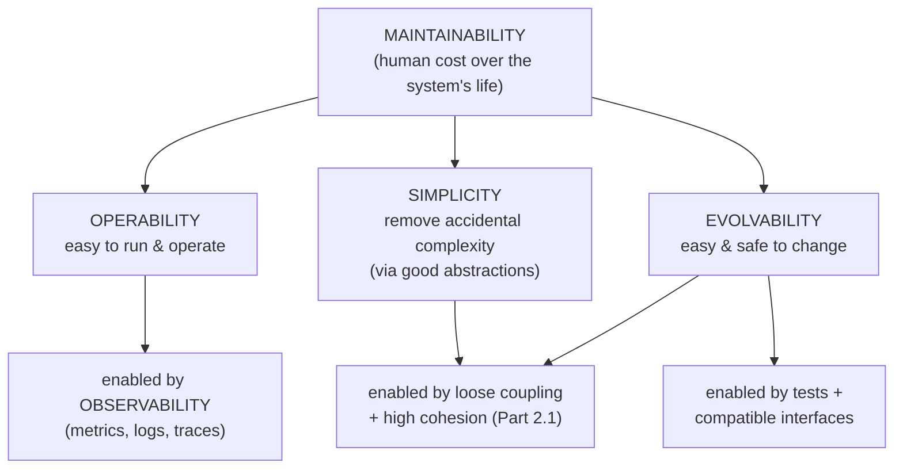
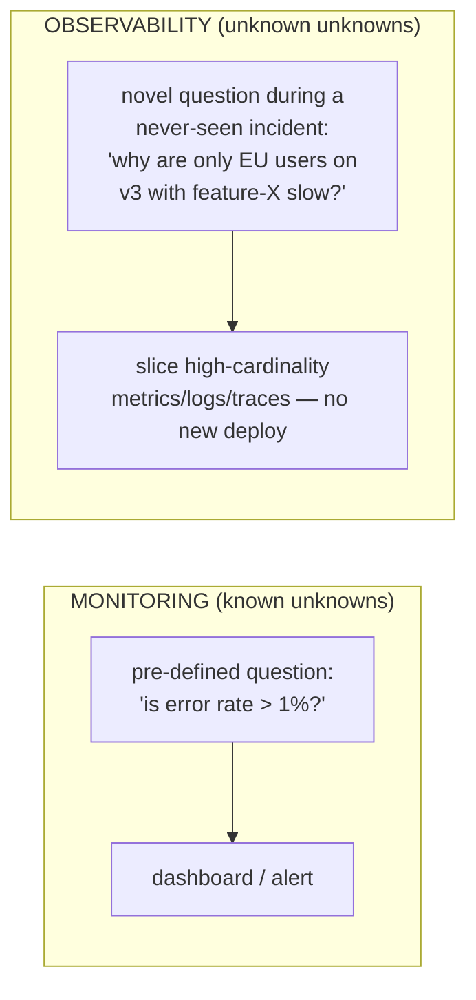

# Lesson 1.2.2 — Maintainability, Evolvability, Operability, Observability

> Part 1: The Mindset of System Design · Module 1.2: Quality Attributes · Difficulty: 🟢🟡
>
> **Prerequisites:** [1.2.1 The Big Four].
> **Unlocks:** [1.2.4 Conflicts], [2.3.3 Evolutionary Architecture], [Part 14 SRE], [Part 16 Observability].

---

## 1. Learning Objectives

After this lesson you will be able to:

- Define **maintainability, evolvability, operability, and observability** precisely and explain why these "day-2" attributes often matter *more* over a system's life than raw performance.
- Explain *DDIA*'s three maintainability sub-goals — **operability, simplicity, evolvability** — and why **accidental complexity** is the enemy.
- Distinguish **observability** (can I understand internal state from outputs?) from mere **monitoring** (predefined dashboards/alerts).
- Argue why these attributes are the ones that determine **total cost of ownership** and team velocity.
- Recognize that most of a system's cost and risk lives in **maintenance**, not initial construction.

---

## 2. Motivation — The attributes that dominate the long run

Performance and scalability get the attention, but most software spends the overwhelming majority of its life being *operated and changed*, not built. The dominant lifetime cost is **maintenance** — bug fixes, feature changes, dependency upgrades, incident response, on-call. A system that is fast and scalable but unmaintainable becomes a "legacy" millstone: every change is risky, every incident is a mystery, every new hire takes months to be productive.

*DDIA* `[CS]` elevates **maintainability** to one of the three foundational concerns (alongside reliability and scalability) precisely because it governs the *human* cost of the system over years. These attributes are also where the cost↔maintainability tradeoff (1.1.5) and technical debt (2.3.3) live. This lesson makes the "day-2" qualities concrete so you can design for them deliberately, not discover their absence at 3 a.m. during an incident.

---

## 3. Theory — From first principles

### 3.1 Maintainability and its three sub-goals (DDIA framing)

> **Maintainability** = the ease with which engineers can keep the system running, understand it, fix it, and change it over time.

*DDIA* decomposes it into three design principles `[CS]`:

1. **Operability** — make it easy for *operations* teams to keep the system running smoothly (good observability, automation, predictable behavior, sane defaults, self-healing where possible).
2. **Simplicity** — make it easy for *new engineers* to understand the system by removing **accidental complexity**. (See §3.2.)
3. **Evolvability** (a.k.a. extensibility/modifiability) — make it easy to *change* the system as requirements evolve. (See §3.3.)

These are human-centric qualities: they're about the *engineers and operators*, not the machine.

### 3.2 Simplicity and the war on accidental complexity

A key distinction `[CS]` (originally from Brooks/Moseley & Marks, adopted by *DDIA*):

- **Essential complexity** — inherent in the *problem* itself. A payment system is genuinely complex because money, fraud, and regulation are complex. You can't remove it; you can only manage it.
- **Accidental complexity** — complexity introduced by our *solution* that is *not* inherent in the problem: tangled dependencies, leaky abstractions, inconsistent patterns, premature generalization, copy-paste sprawl.

> Simplicity = ruthlessly eliminating *accidental* complexity. The primary tool is **good abstraction** — hiding implementation detail behind a clean, reusable interface (e.g., a high-level language hides assembly; SQL hides storage engines). A *leaky* or wrong abstraction *adds* accidental complexity, so abstraction is powerful but double-edged.

Simplicity is not "fewer features" or "less code" — it's *less needless interconnection and surprise*. A simple system is one a new engineer can form a correct mental model of quickly. This connects to coupling/cohesion/connascence (Lesson 2.1.1).

### 3.3 Evolvability

> **Evolvability** = how cheaply and safely the system can be changed to meet new requirements.

Requirements *always* change (1.1.1 — design is a loop). Evolvability is the structural property that determines whether change is a small, local, low-risk edit or a sprawling, high-risk rewrite. It's enabled by **simplicity**, **loose coupling** (Part 2.1), **good abstractions/modularity**, **automated tests** (safety net for change), and **backward/forward-compatible interfaces** (schema evolution, Part 4.3). It's the structural basis of *evolutionary architecture* (2.3.3) and a core reason teams choose certain architecture styles (Part 2.2) and microservice boundaries (Part 12).

Agility/velocity is the *outcome*; evolvability is the *property* that produces it.

### 3.4 Operability

> **Operability** = how easy it is to *run* the system in production — to keep it healthy, deploy changes, and respond to incidents.

Good operability `[BP]` includes: visibility into runtime behavior (→ observability), good automation (deploys, scaling, failover — Part 13), predictable and documented behavior (runbooks), avoiding undocumented dependencies and "magic," sane defaults and self-healing, and easy rollback. Poor operability shows up as toil (Part 14), long MTTR (1.2.1 — directly lowering availability), and burned-out on-call engineers. Operability is the attribute SRE (Part 14) exists to maximize.

### 3.5 Observability vs monitoring

A modern and frequently-confused distinction `[CONV]`/`[EMERGING]`:

- **Monitoring** — watching *predefined* signals and thresholds: "is CPU > 80%?", "is the error rate above X?" You decide *in advance* what to watch. Great for **known** failure modes.
- **Observability** — the property that you can **understand the system's internal state from its external outputs** (metrics, logs, traces), *including for questions you didn't anticipate*. It lets you ask *novel* questions during a never-seen-before incident without shipping new code.

The control-theory root `[CS]`: a system is *observable* if its internal state can be inferred from its outputs. In practice (Part 16), observability is built from the **three pillars** — **metrics** (aggregate numbers over time), **logs** (discrete events), **traces** (the path of a request across services) — plus high-cardinality, well-structured data so you can slice by any dimension.

> Monitoring tells you *that* something is wrong; observability helps you discover *why* — especially for the "unknown unknowns." You need both. Observability is the precondition for low MTTR (1.2.1) and thus for availability.

### 3.6 Why these are "day-2" but design-time concerns

The trap: these qualities are invisible on day 1 (the demo works!) and only bite later — when the team grows, the code ages, and incidents happen. But they're largely determined by **early structural decisions** (modularity, abstractions, whether you instrument from the start). Retrofitting observability or untangling accidental complexity is far more expensive than building them in. Hence they belong in the design conversation *now*, even though their payoff is *later* — a classic time-to-market ↔ maintainability tradeoff (1.1.5).

---

## 4. Visual Intuition

### Maintainability decomposed (DDIA)

### Monitoring vs Observability

---

## 5. Real-World Analogy

**Owning a house vs the open-house photos.** The glossy listing (performance demo) sells the house, but you *live in it* for years (maintenance). 
- **Operability** = how easy it is to run day-to-day: are the breaker box and water shutoff labeled and reachable, or hidden behind drywall?
- **Simplicity** = is the plumbing laid out sensibly, or a maze of pipes a new plumber can't follow (accidental complexity)?
- **Evolvability** = can you add a room or rewire without demolishing half the house?
- **Observability** = do you have gauges, smoke detectors, and access panels so that when something's wrong you can find out *why*, even for a problem you never anticipated — versus only a single "something's broken" light (monitoring)?

A beautiful house with hidden, tangled, ungaugeable systems becomes a money pit. So does software.

---

## 6. Industry Example

- **Google SRE** `[BP]`: treats **operability** and **toil reduction** as primary goals; the entire discipline is about running systems maintainably at scale (Part 14). Postmortems, runbooks, and automation are operability investments.
- **The observability movement** `[CONV]`/`[EMERGING]`: OpenTelemetry (CNCF) standardizes metrics/logs/traces precisely to make systems observable for unanticipated questions — vendors and engineering blogs (Honeycomb, etc.) popularized the monitoring-vs-observability distinction (Part 16).
- **Microservices and evolvability** `[CONV]`: a primary *stated* motivation for microservices (Newman, *Building Microservices*) is **independent deployability/evolvability** — teams change and ship services autonomously (Part 12). It trades simplicity (more moving parts) for evolvability — a 1.1.5 tradeoff.
- **"Simplicity" advocacy** `[OPINION]`: the widely-cited engineering value that fighting accidental complexity (boring tech, clear boundaries) compounds over years into velocity.

---

## 7. Implementation Details — Designing for day-2 qualities

**For simplicity:** prefer clear module boundaries and high cohesion (Part 2.1); choose good abstractions and watch for *leaky* ones; avoid premature generalization (YAGNI); standardize patterns across the codebase so there's one way to do common things; delete dead code. Measure via code/architecture *fitness functions* (2.3.3) and review for connascence (2.1.1).

**For evolvability:** keep interfaces backward/forward compatible (schema evolution, Part 4.3); decouple via well-defined contracts and async messaging where appropriate (Part 9); maintain a strong automated test suite so changes are safe; use anti-corruption layers at boundaries (Part 12.9).

**For operability:** automate deploys/rollbacks and scaling (Parts 13, 14); write runbooks; expose health checks and readiness probes; design for graceful degradation (Part 11); make behavior predictable and configuration explicit.

**For observability (Part 16):**
- **Metrics:** the four golden signals (latency, traffic, errors, saturation) at minimum; mind cardinality.
- **Logs:** structured (key-value/JSON), correlated with a request/trace ID.
- **Traces:** propagate context across service hops so you can follow one request end-to-end.
- **Instrument from day 1**, not after the first outage; emit high-cardinality, well-labeled data so you can slice by tenant, version, region, etc.

**Cost note:** observability data (especially high-cardinality metrics and full-fidelity traces) can be *expensive* to store/query — sampling and retention policies are themselves a cost↔insight tradeoff (Part 16).

---

## 8. Advantages (of investing here)

- **Lower total cost of ownership** — maintenance dominates lifetime cost; reducing it compounds.
- **Higher team velocity** — evolvable, simple systems let teams ship fast and safely.
- **Lower MTTR → higher availability** — observability + operability directly improve recovery (1.2.1).
- **Faster onboarding** — simple, well-instrumented systems make new engineers productive quickly.
- **Resilience to the unknown** — observability handles incidents you never predicted.

---

## 9. Disadvantages / Costs

- **Up-front and ongoing cost** — instrumentation, tests, automation, and refactoring take time that pressured teams cut first.
- **Observability isn't free at scale** — storage/query costs and cardinality explosions are real; needs governance.
- **Over-abstraction backfires** — chasing "evolvability" with speculative generality *adds* accidental complexity (the opposite of simplicity). These qualities can fight each other.
- **Hard to measure directly** — "maintainability" resists a single metric; proxies (change-failure rate, lead time, MTTR — DORA metrics `[CONV]`) help but are indirect.

---

## 10. When NOT to over-invest

- **Throwaway prototypes / spikes** — don't build full observability and abstractions into code you'll delete.
- **Tiny stable systems** — a script that rarely changes doesn't need an evolvability strategy.
- **Pre-product-market-fit** — sometimes deliberate, *documented* debt (skip some operability) is the right call to validate the product first (2.3.3). The key is *deliberate and visible*, not accidental.
- Avoid **speculative generality** — building flexibility for changes that may never come is over-engineering (1.1.1).

---

## 11. Common Mistakes

1. **Treating these as "later" problems** — they're determined by early structure and are expensive to retrofit.
2. **Confusing monitoring with observability** — having dashboards for known issues but being blind during novel incidents.
3. **Mistaking "less code" for simplicity** — clever, terse, highly-coupled code is *complex*; simplicity is about low surprise and clear models.
4. **Adding accidental complexity in the name of evolvability** — premature abstractions and frameworks for imagined future needs.
5. **Instrumenting after the first outage** — too late; you can't debug what you didn't instrument.
6. **Logging without structure or correlation IDs** — unsearchable logs are noise, not observability.
7. **Ignoring cardinality/cost** — naive high-cardinality metrics blow up the bill or the metrics system.

---

## 12. Interview Questions

**🟢 Easy**
- What are the three sub-goals of maintainability per DDIA?
- What's the difference between monitoring and observability?

**🟡 Medium**
- Distinguish essential from accidental complexity with an example, and name the primary tool for reducing accidental complexity.
- You're asked to "make the system more observable." What concretely do you add, and how does it differ from adding more dashboards?

**🔴 Hard**
- A team chose microservices "for evolvability" but velocity *dropped*. Explain how that can happen in terms of simplicity vs evolvability and accidental complexity, and how you'd diagnose whether the boundaries are wrong.
- Design an observability strategy for a 30-service system that lets on-call engineers answer questions they didn't anticipate, while controlling cost. What data do you collect, how do you correlate it, and where do you sample?

**⚫ Staff+**
- Maintenance is the dominant lifetime cost, yet it's hard to fund because it's invisible to stakeholders. How do you make maintainability *measurable and fundable* (e.g., DORA metrics, fitness functions, MTTR), and how do you trade it against feature velocity using error budgets?
- You inherit a fast but unmaintainable "big ball of mud." Lay out a strategy to improve simplicity, evolvability, and observability incrementally without halting feature work, and how you'd quantify progress.

---

## 13. Production Pitfalls

- **The unobservable outage:** an incident with no relevant instrumentation → MTTR balloons while engineers add logging *during* the incident (Part 16). 
- **Cardinality explosion:** a high-cardinality label (e.g., user ID on a metric) overwhelms the metrics system, causing a *monitoring* outage during a real incident.
- **Accidental-complexity creep:** each rushed change adds a little tangle; years later, change-failure rate is high and onboarding takes months (the "big ball of mud").
- **Abstraction leakage:** an abstraction that hides the wrong things forces every user to understand the internals anyway, adding complexity instead of removing it.
- **Toil accumulation:** manual operational steps that were "temporary" become permanent, eroding operability and burning out on-call (Part 14).

---

## 14. Optimization Techniques

- **Adopt DORA-style metrics** (deployment frequency, lead time, change-failure rate, MTTR) as proxies for maintainability/operability, and track trends `[CONV]`.
- **Write fitness functions** (2.3.3) that fail the build on architectural erosion (e.g., forbidden dependencies, cyclomatic thresholds).
- **Standardize observability** via a shared library/OpenTelemetry so every service emits correlated metrics/logs/traces by default.
- **Sample intelligently** (e.g., tail-based trace sampling that keeps slow/errored traces) to control observability cost without losing the interesting data.
- **Refactor toward simplicity continuously** (the "boy scout rule"), and make boundaries explicit to keep coupling low.

---

## 15. Summary

Beyond the big four, the attributes that dominate a system's *life* are the human-centric, "day-2" qualities. **Maintainability** (per *DDIA*) breaks into **operability** (easy to run), **simplicity** (remove *accidental* — not essential — complexity, chiefly via good abstractions), and **evolvability** (cheap, safe change). **Observability** — the ability to infer internal state from external outputs (metrics, logs, traces), enabling answers to *unanticipated* questions — is distinct from **monitoring** (predefined signals for known problems) and is the precondition for low MTTR and thus high availability. These qualities are invisible on day 1 but determined by early structure, so they're design-time concerns even though they pay off later. They embody the time-to-market ↔ maintainability tradeoff, and because maintenance is the dominant lifetime cost, investing here is usually the highest-leverage long-term decision — provided you avoid the trap of *adding* accidental complexity in the name of flexibility.

---

## 16. Revision Notes (flashcard-ready)

- **Q:** Maintainability's three sub-goals (DDIA)? **A:** Operability, simplicity, evolvability.
- **Q:** Essential vs accidental complexity? **A:** Inherent in the problem vs introduced by our solution; remove the accidental.
- **Q:** Main tool against accidental complexity? **A:** Good abstraction (beware leaky ones).
- **Q:** Monitoring vs observability? **A:** Predefined signals for known issues vs inferring internal state to answer novel questions.
- **Q:** Three pillars of observability? **A:** Metrics, logs, traces.
- **Q:** Why are day-2 qualities design-time concerns? **A:** They're set by early structure and costly to retrofit.
- **Q:** Observability → which big-four attribute? **A:** Lowers MTTR → raises availability.
- **Q:** Proxy metrics for maintainability? **A:** DORA: deploy frequency, lead time, change-failure rate, MTTR.

---

## 17. Further Reading + Knowledge-Graph Links

**Within this platform**
- **Previous:** [1.2.1 The Big Four]. **Next:** [1.2.3 Security, Compliance, Cost as First-Class].
- **Builds on:** structural concepts in [2.1.1 Coupling/Cohesion/Connascence] (simplicity), [4.3.1 Schema Evolution] (evolvability).
- **Deep dives:** [2.3.3 Evolutionary Architecture & Fitness Functions], [Part 14 SRE: operability, toil, MTTR], [Part 16 Observability: metrics/logs/traces, sampling], [Part 12 Microservices] (evolvability vs simplicity tradeoff).
- **Reference:** `reference/production-readiness-checklist.md`.

**Foundational texts (synthesized)**
- Kleppmann, *DDIA* Ch. 1 — maintainability = operability + simplicity + evolvability; essential vs accidental complexity; abstraction.
- Beyer et al., *SRE* — operability, toil, automation, postmortems.
- Newman, *Building Microservices* — independent deployability/evolvability as a primary driver; observability across services.

**Concept tags:** `[CS]` essential/accidental complexity, observability (control theory), maintainability sub-goals · `[CONV]` DORA metrics, three pillars, OpenTelemetry · `[EMERGING]` monitoring-vs-observability framing · `[OPINION]` simplicity/boring-tech advocacy.
