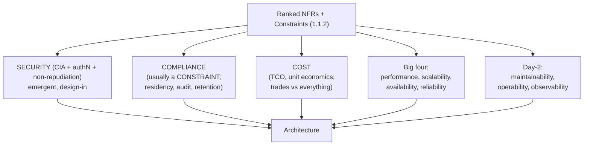
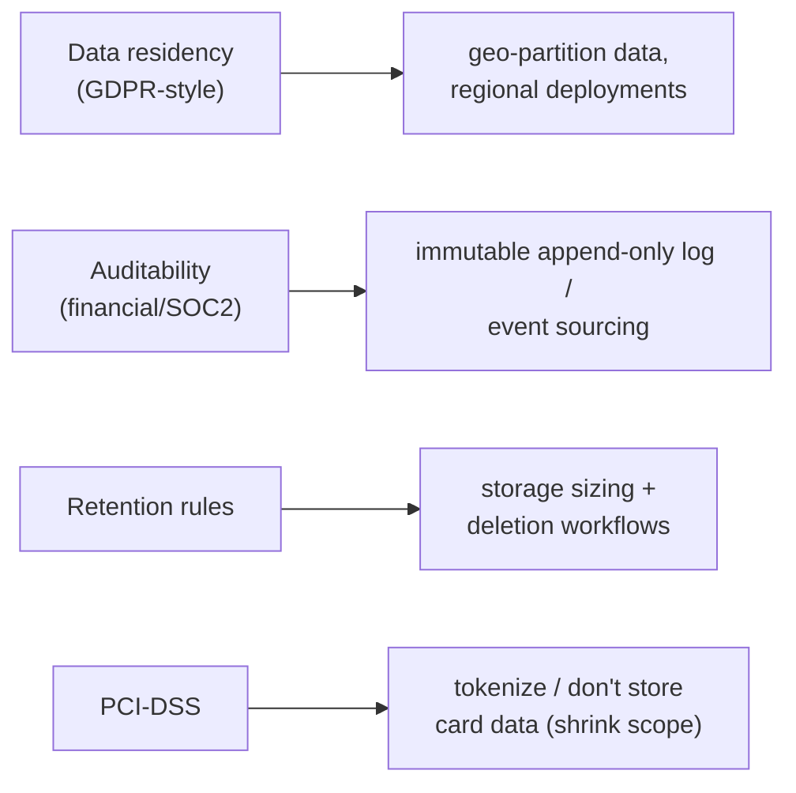

# Lesson 1.2.3 — Security, Compliance, and Cost as First-Class Characteristics

> Part 1: The Mindset of System Design · Module 1.2: Quality Attributes · Difficulty: 🟢🟡
>
> **Prerequisites:** [1.2.1 Big Four], [1.2.2 Day-2 Qualities].
> **Unlocks:** [1.2.4 Conflicts], [Part 15 Security], [Part 17 Performance/Cost], [Part 20 Capstone compliance].

---

## 1. Learning Objectives

After this lesson you will be able to:

- Treat **security, compliance, and cost** as first-class architecture characteristics that *shape structure*, not as afterthoughts bolted on at the end.
- State the **CIA triad** (confidentiality, integrity, availability) and how it maps to design decisions.
- Explain why security and compliance are often **constraints** (1.1.2) that *remove options* and create **one-way doors** (1.1.1).
- Reason about **cost** as a quality attribute with its own metrics (unit economics, TCO) that trades against every other attribute.
- Recognize when these attributes must be **designed in from day 1** versus deferred.

---

## 2. Motivation — Why these belong in the design conversation early

Three attributes are routinely treated as "we'll handle it later" — and each is brutally expensive to retrofit:

- **Security** bolted on after launch leaves gaps attackers exploit; a single breach can end a company. Security must be *designed in* (secure-by-design), because it's an *emergent* property of the whole system, not a feature you add.
- **Compliance** (GDPR, PCI-DSS, HIPAA, SOC 2, data residency) often dictates *where data lives, how it's encrypted, who can access it, and how long it's kept* — decisions that ripple into your data model, partitioning, and deployment topology. Discovering a residency requirement after you've built a single global database is a painful, sometimes existential, re-architecture (a one-way door — 1.1.1).
- **Cost** is the attribute that touches *everything* (1.1.5): every nine of availability, every ms of latency, every replica and region has a price. A technically brilliant system that bankrupts the business is a failed design. At scale, *unit economics* (cost per request/user/transaction) can determine whether the product is even viable.

These are first-class characteristics precisely because, like the big four, they **bend the architecture**. This lesson installs the vocabulary; Part 15 (security) and Part 17 (cost/performance) go deep, and Part 20 (capstone) makes compliance concrete for a financial system.

---

## 3. Theory — From first principles

### 3.1 Security: the CIA triad and "secure by design"

Security as an architecture characteristic rests on the **CIA triad** `[CS]`:

- **Confidentiality** — only authorized parties can read the data. (Enforced by authentication, authorization, encryption — Part 15.)
- **Integrity** — data is not tampered with or corrupted; changes are authorized and detectable. (Hashing, signing, access controls, audit logs.)
- **Availability** — the system (and its data) is accessible to authorized users when needed. (Note: this overlaps the big-four availability — DoS attacks are an *availability* attack; Part 15.)

Two more are often added: **Authentication** (proving identity) and **Non-repudiation** (you can't deny having done something — via signing/audit).

The defining principle `[BP]`:

> **Security is emergent and must be designed in, not added on.** It's a property of the *entire* system — its weakest link defines its strength. You can't sprinkle it on at the end.

Core design principles (Part 15 expands all):
- **Defense in depth** — multiple independent layers; no single control is trusted alone.
- **Least privilege** — every component/user gets the minimum access needed.
- **Zero trust** — never trust based on network location; authenticate and authorize every request.
- **Trust boundaries** — explicitly identify where data crosses from less-trusted to more-trusted zones (threat modeling, Part 15.1); validate everything crossing inward.
- **Fail secure** — on error, deny rather than allow.

Security trades against usability, performance (encryption/auth overhead), and cost — but unlike most tradeoffs, below a baseline it's **non-negotiable** (especially with user data, money, or regulatory exposure).

### 3.2 Compliance: external constraints that shape architecture

Compliance regimes encode legal/industry requirements into things your architecture *must* do. Examples and their architectural impact `[CONV]`:

- **GDPR (EU privacy)** → right to erasure ("delete all my data" — hard with backups, event logs, and caches), data minimization, consent tracking, and often **data residency** (EU data stays in EU). Residency forces **geo-partitioning** of data and regional deployments (Parts 7, 13).
- **PCI-DSS (payment cards)** → strict rules on storing/transmitting card data; often you *avoid storing it at all* (tokenization, delegate to a processor) to shrink scope. Shapes the payment architecture (Part 19.2.3, Part 20).
- **HIPAA (US health), SOC 2, ISO 27001** → access controls, encryption, **audit logging** (immutable record of who did what), retention policies.
- **Financial regulation** (capstone) → auditability, immutable ledgers, retention for years, segregation of duties.

The architectural consequences are concrete: **data residency → where databases physically live; auditability → immutable append-only logs (event sourcing, Part 9/20); retention → storage sizing (1.1.4) and deletion workflows; access control → fine-grained authorization (Part 15).**

> Compliance is usually a **constraint** (1.1.2 §3.3), not a goal you optimize — it *removes options*. Treat it as a hard input that bounds the design space, and surface it in requirements gathering *before* drawing boxes.

### 3.3 Cost as a quality attribute

Cost isn't just a budget line; it's a *characteristic you design for* `[BP]`. Make it measurable:

- **Total Cost of Ownership (TCO)** — infrastructure + engineering/operational labor + opportunity cost. The cheapest infra with the highest ops burden may have the worst TCO.
- **Unit economics** — cost per request, per user, per transaction, per GB stored/served. This is the metric that scales with the business and reveals viability. *(Specific dollar figures are deployment-dependent; reason in relative terms.)*
- **Cost drivers** at scale: **egress bandwidth** (often dominant for media — 1.1.4), **storage** (especially replicated/retained data), **compute** (idle over-provisioning), and **cross-region/cross-AZ data transfer**.

Cost trades against every other attribute (1.1.5 §3.2): more availability (replicas/regions), lower latency (edge/CDN, over-provisioning headroom — 1.1.3 knee), and stronger durability (more replicas) all cost more. The skill is spending where it buys the *ranked* NFRs and cutting where it doesn't (e.g., cold data on cheap object storage; right-sizing; autoscaling to avoid paying for idle peak capacity — Part 13).

### 3.4 Why these are often one-way doors

- **Compliance/data model:** once PII or financial data is written under a particular residency/retention scheme and consumers depend on it, changing it is a massive migration (1.1.1).
- **Security posture:** auth/identity and trust-boundary decisions are deeply woven through every service; retrofitting zero-trust onto a "trusted internal network" design is a multi-quarter effort.
- **Cost structure:** a partitioning/replication choice made for performance can lock in a cost structure (e.g., cross-region replication bandwidth) that's hard to unwind.

So these deserve **early, deliberate** decisions — exactly the rigor 1.1.1 reserves for one-way doors.

### 3.5 The "shift left" principle

Modern practice `[BP]`/`[CONV]`: **shift security and compliance "left"** — earlier in the lifecycle (design, code, CI) rather than right (audit, post-incident). Threat-model at design time (Part 15.1), encode compliance as automated checks (policy-as-code, fitness functions — 2.3.3), and treat cost as a metric on dashboards (FinOps `[EMERGING]`). The earlier these enter the conversation, the cheaper they are.

---

## 4. Visual Intuition

### The expanded characteristics map

### Compliance → concrete architectural forces

---

## 5. Real-World Analogy

**A bank building.** Security isn't a feature you add after construction — the vault, reinforced walls, alarm wiring, and guard stations are designed into the blueprint (secure by design); you can't bolt a vault onto a finished glass storefront. **Compliance** is the building code and banking regulations: they dictate fire exits, accessible ramps, where the safe-deposit room can be, and how long records are kept — non-negotiable constraints that shape the floor plan before the architect's preferences even enter. **Cost** is the construction and operating budget: marble floors and gold fixtures (extra nines, more regions) look great but might bankrupt the branch; the savvy owner spends on the vault and security (the ranked priorities) and uses sensible finishes elsewhere. Retrofitting any of the three after the building opens is enormously more expensive than designing them in.

---

## 6. Industry Example

- **PCI-DSS scope reduction via tokenization** `[CONV]`: payment companies (Stripe and others publicly) let merchants *avoid touching raw card data* by tokenizing through the processor — a compliance constraint that fundamentally shapes the integration architecture (Part 19.2.3).
- **GDPR & data residency** `[CONV]`: global products commonly deploy EU data in EU regions and partition user data by region to satisfy residency and erasure requirements — a compliance constraint driving geo-partitioning (Parts 7, 13).
- **Zero-trust / BeyondCorp (Google)** `[CONV]`: a publicly documented shift from "trusted internal network" to authenticating/authorizing every request regardless of network location — security as a pervasive architectural property (Part 15).
- **FinOps / cost-as-a-metric** `[EMERGING]`: cloud providers and the FinOps movement push unit-cost dashboards and right-sizing as engineering practice — cost treated as a first-class, monitored characteristic (Part 17).

---

## 7. Implementation Details — Designing for the three

**Security (Part 15 deep dive):** threat-model at design (STRIDE, trust boundaries); enforce authN (OAuth2/OIDC) and least-privilege authZ; encrypt in transit (TLS/mTLS) and at rest; manage secrets in a vault (never in code/config); validate all input at trust boundaries; add audit logging; rate-limit as an abuse control (Part 15.7); plan for DoS mitigation (availability is part of CIA).

**Compliance:** in requirements gathering, *explicitly ask* about regulatory scope (PII? payments? health? regions served?). Encode requirements as: data classification → where it may live (residency) → encryption/access rules → retention/deletion workflows → immutable audit trail. Prefer **scope reduction** (don't store sensitive data you don't need; tokenize/delegate). Automate compliance checks (policy-as-code) so violations fail CI.

**Cost:** define unit-economics metrics and put them on dashboards; right-size compute and use autoscaling (avoid paying for idle peak — Part 13); tier storage (hot vs cold/object storage — 1.1.4); minimize cross-region/AZ transfer; cache to cut both latency and backend cost (Part 6); model cost in capacity estimation (1.1.4) alongside QPS/storage. Track cost as part of the production-readiness review.

**Interaction:** these three constantly intersect (encryption costs compute; compliance forces extra regions which cost money; audit logs consume storage). Make the interactions explicit in the tradeoff worksheet (1.1.5).

---

## 8. Advantages (of first-class treatment)

- **Avoids catastrophic retrofits** — security/compliance designed in is vastly cheaper than after a breach or audit failure.
- **Business viability** — cost-as-attribute keeps unit economics sustainable at scale.
- **Faster audits and trust** — compliance-by-design produces evidence (audit logs, controls) auditors and customers want.
- **Reduced breach risk** — secure-by-design closes whole classes of vulnerability structurally.

---

## 9. Disadvantages / Costs

- **Adds up-front complexity and effort** — encryption, auth, audit, residency partitioning, cost instrumentation all take work.
- **Performance/usability friction** — encryption and auth add latency; least-privilege adds operational steps; residency adds deployment complexity.
- **Can over-constrain early** — applying maximal compliance/security to a pre-PMF prototype may be premature (but core security baselines never are).
- **Cost optimization can erode other attributes** — cutting too far removes redundancy (availability) or observability; cost must respect the ranked NFRs.

---

## 10. When NOT to over-apply

- **No sensitive data / not in a regulated domain** → don't build PCI/HIPAA machinery; match controls to actual data classification and threat model.
- **Early prototypes** → maintain a *security baseline* (no plaintext secrets, basic authN, TLS) but defer heavyweight compliance until the product is real and you know which regimes apply.
- **Premature cost optimization** → at tiny scale, engineering time ≫ infra cost; don't micro-optimize cents while burning engineer-days (but *do* avoid obviously wasteful architectures that won't scale economically).

---

## 11. Common Mistakes

1. **Treating security as a feature for later** — it's emergent; retrofitting leaves gaps. The cardinal sin.
2. **Discovering compliance constraints after building** — residency/retention found post-launch forces painful re-architecture.
3. **Storing sensitive data you didn't need** — increasing breach blast radius and compliance scope instead of minimizing/tokenizing.
4. **Ignoring cost until the bill arrives** — no unit-economics visibility until margins are already broken.
5. **Trusting the internal network** — assuming "behind the firewall = safe" (violates zero trust).
6. **Cutting cost by removing redundancy/observability** — saving money by sacrificing higher-ranked NFRs.
7. **Secrets in code/config** — the most common, most preventable security failure.

---

## 12. Interview Questions

**🟢 Easy**
- What is the CIA triad? Map each element to one design technique.
- Why must security be "designed in" rather than added later?

**🟡 Medium**
- A product will serve EU and US users and store personal data. What compliance-driven architectural decisions does this force, and at which layer (data model, partitioning, deployment)?
- Define unit economics and give two major cost drivers for a video-streaming platform. How would you reduce each?

**🔴 Hard**
- Design the data architecture for a system that must support GDPR "right to erasure" *and* an immutable financial audit log. These pull in opposite directions — how do you satisfy both? (Hint: crypto-shredding, tokenization, data separation.)
- You're asked to cut cloud cost 40% without breaching SLOs. Walk through where you'd look (compute, storage, egress, cross-region), what you'd measure first, and which cuts you'd refuse because they violate ranked NFRs.

**⚫ Staff+**
- For a global financial platform (the capstone), lay out how security, compliance (residency/audit/retention), and cost jointly constrain the data architecture and deployment topology. Identify which decisions are one-way doors and must be right on day 1.
- How do you embed security and compliance into the engineering lifecycle ("shift left") so they're continuously enforced (policy-as-code, threat modeling, cost dashboards) rather than audited after the fact — and how do you trade their friction against delivery velocity?

---

## 13. Production Pitfalls

- **The breach from a single weak link** — one unencrypted store, one over-privileged credential, one unvalidated input (security is only as strong as its weakest point).
- **Audit failure at the worst time** — discovering during an audit that logs are mutable or incomplete, or that data crossed a residency boundary.
- **Erasure that isn't** — "deleted" data lingering in backups, caches, event logs, and replicas — a common GDPR pitfall (mitigate with crypto-shredding: delete the key, not every copy).
- **Runaway egress/cross-region bills** — an architecture that constantly ships data across regions/AZs, discovered only when the invoice spikes.
- **Cost-cut outages** — aggressive right-sizing that removed the headroom availability needed (back to the utilization knee, 1.1.3).

---

## 14. Optimization Techniques

- **Minimize and tokenize sensitive data** — the smallest attack surface and compliance scope is the data you never store.
- **Crypto-shredding** for erasure — encrypt per-subject and delete keys to "erase" across many copies without rewriting backups.
- **Policy-as-code & fitness functions** (2.3.3) — fail CI on missing encryption, public buckets, residency violations, or budget overruns.
- **Tiered storage + lifecycle policies** — auto-move cold data to cheap object storage; expire per retention rules (cost + compliance together).
- **Autoscaling + right-sizing + spot/preemptible** for non-critical workloads — cut idle and peak over-provisioning cost (Part 13).
- **CDN/caching** — reduces egress *and* latency simultaneously (Part 6) — a rare win-win across cost and performance.

---

## 15. Summary

Security, compliance, and cost are **first-class architecture characteristics**, not afterthoughts. **Security** rests on the CIA triad (plus authentication and non-repudiation) and is **emergent — it must be designed in**, via defense-in-depth, least privilege, zero trust, and explicit trust boundaries; it's as strong as its weakest link. **Compliance** (GDPR, PCI-DSS, HIPAA, financial regs) is usually a **constraint** that *removes options* and dictates concrete structure — data residency drives geo-partitioning, auditability drives immutable logs, retention drives storage and deletion workflows; discovering it late is a costly one-way-door reversal. **Cost** is a measurable attribute (TCO, unit economics) that **trades against every other characteristic**, so you spend on the ranked NFRs and cut where it's safe. All three are expensive to retrofit, so they belong in requirements gathering and design *now* — the essence of "shifting left."

---

## 16. Revision Notes (flashcard-ready)

- **Q:** CIA triad? **A:** Confidentiality, Integrity, Availability (+ authentication, non-repudiation).
- **Q:** Core security principle? **A:** Emergent — design in, not bolt on; weakest link defines strength.
- **Q:** Four security design principles? **A:** Defense in depth, least privilege, zero trust, explicit trust boundaries (fail secure).
- **Q:** Compliance is usually a…? **A:** Constraint (removes options), not an optimization goal.
- **Q:** GDPR residency → ? **A:** Geo-partition data + regional deployments.
- **Q:** Auditability → ? **A:** Immutable append-only log / event sourcing.
- **Q:** Cost metrics? **A:** TCO and unit economics (cost per request/user/txn/GB).
- **Q:** Big cost drivers at scale? **A:** Egress bandwidth, storage (replicated/retained), idle compute, cross-region transfer.
- **Q:** Erase data across backups without rewriting them? **A:** Crypto-shredding (delete the key).

---

## 17. Further Reading + Knowledge-Graph Links

**Within this platform**
- **Previous:** [1.2.2 Day-2 Qualities]. **Next:** [1.2.4 How Characteristics Conflict].
- **Deep dives:** [Part 15 Security] (threat modeling, authN/authZ, crypto, zero trust, rate limiting), [Part 17 Performance/Cost] (cost engineering), [Part 13 Cloud Native] (autoscaling, multi-region), [Part 20 Capstone] (financial compliance made concrete).
- **Related:** [1.1.2 Requirements] (compliance as constraint), [2.3.3 Fitness Functions] (policy-as-code).
- **Reference:** `reference/production-readiness-checklist.md`.

**Foundational texts (synthesized)**
- Richards & Ford, *Fundamentals of Software Architecture* — security/cost as architecture characteristics among the "-ilities."
- Newman, *Building Microservices* — security across service boundaries, secrets, least privilege.
- Beyer et al., *SRE* — cost/efficiency and capacity as engineering concerns.
- *System Design Interview* Vol. 2 — compliance/security considerations in payment-system design.

**Concept tags:** `[CS]` CIA triad · `[BP]` secure-by-design, least privilege, cost-as-attribute · `[CONV]` tokenization/PCI scope, residency→geo-partitioning, zero-trust/BeyondCorp · `[EMERGING]` FinOps, policy-as-code.
