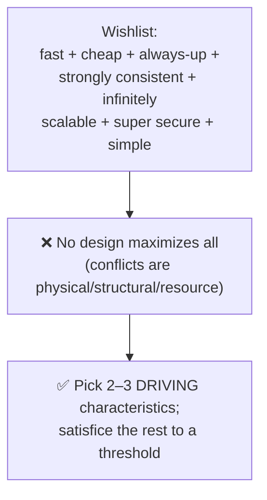
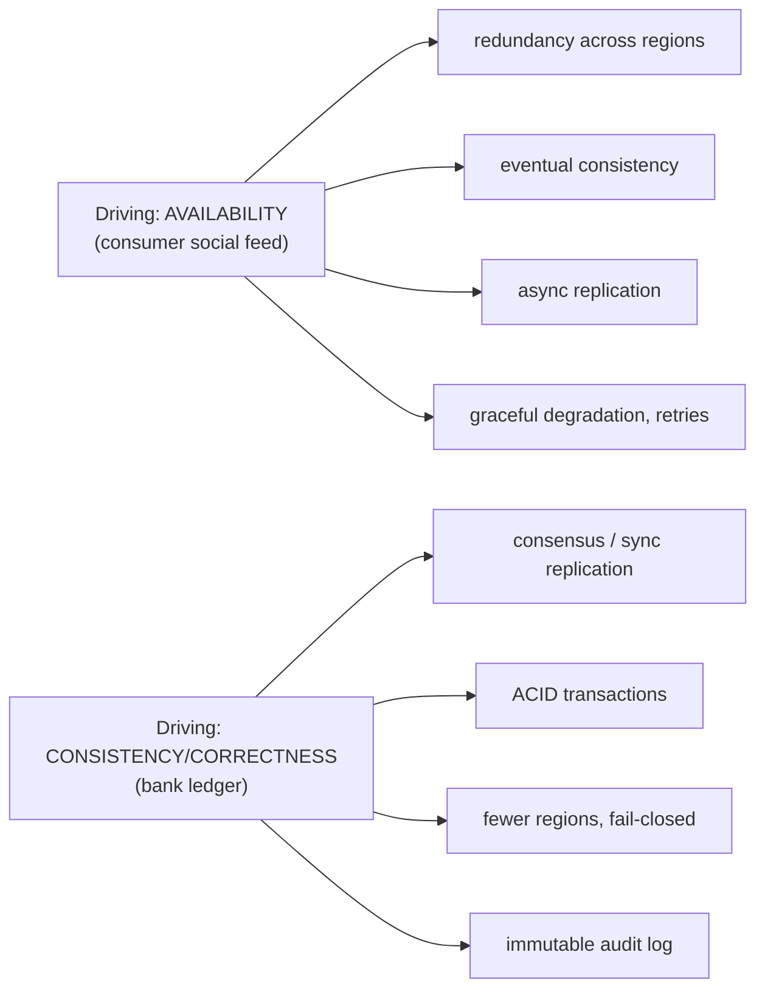

# Lesson 1.2.4 — How Characteristics Conflict and How to Prioritize

> Part 1: The Mindset of System Design · Module 1.2: Quality Attributes · Difficulty: 🟡
>
> **Prerequisites:** [1.1.5 Tradeoffs], [1.2.1 Big Four], [1.2.2 Day-2], [1.2.3 Security/Compliance/Cost].
> **Unlocks:** [1.3.1 Design Framework], [2.3.1 Characteristics → Style Selection], [Part 10 CAP/PACELC].

---

## 1. Learning Objectives

After this lesson you will be able to:

- Explain **why** architecture characteristics conflict (shared resources, physics, and structural opposition) rather than just memorizing which ones do.
- Map the **major conflict pairs** (consistency↔availability, latency↔durability, security↔usability, simplicity↔flexibility, cost↔everything) and the mechanism behind each.
- Apply the principle **"never maximize; satisfice and prioritize"** — pick the *fewest* driving characteristics and make the rest "good enough."
- Run a **prioritization process** that converts stakeholder wishes into a defensible ranking that drives architecture (closing the loop from 1.1.2 and 1.1.5).
- Avoid the classic failure of promising *all* characteristics at once ("fast, cheap, always-on, strongly consistent, infinitely scalable").

---

## 2. Motivation — Why this is the keystone of Part 1

Modules 1.1 and 1.2 built up the vocabulary (requirements, scale, tradeoffs) and the catalog of characteristics (big four, day-2, security/compliance/cost). This lesson is where it **converges into a method**: because characteristics *conflict*, you cannot have them all, so design *is* the act of choosing which few to favor and which to relax. 

This is the single most common failure in both interviews and real projects: the stakeholder (or candidate) lists ten characteristics, all "critical," and the resulting design tries to satisfy all of them — producing something that's mediocre at everything, over-complex, and over-budget. Richards & Ford put it bluntly `[CS]`/`[BP]`: *never try to maximize the number of architecture characteristics; the more characteristics you support, the more complex the design.* The mark of a mature designer is **deliberately choosing a small set of driving characteristics and consciously accepting "good enough" on the rest.**

---

## 3. Theory — From first principles

### 3.1 Why characteristics conflict (three mechanisms)

Conflicts aren't arbitrary — they arise from three root causes:

1. **Shared finite resources.** Many characteristics compete for the same budget of money, time, latency, or hardware. Spending latency budget on replication (durability) means less latency budget for response time. Spending money on regions (availability) means less for features. *(Resource competition.)*

2. **Physical law.** Some conflicts are theorems or physics, not preferences. **CAP** (Part 10): under a network partition you *cannot* have both strong consistency and full availability — pick one. **Speed of light** (1.1.3): cross-continent data can't have single-digit-ms latency *and* be in one place — you trade latency vs (single-copy) consistency by geo-replicating. *(Hard limits.)*

3. **Structural opposition.** Some characteristics pull the *structure* in opposite directions. **Simplicity vs flexibility**: flexibility needs indirection/abstraction, which adds moving parts, reducing simplicity (1.2.2). **Performance vs evolvability**: highly optimized, tightly-coupled code is fast but hard to change; clean, decoupled code is evolvable but adds layers. **Security vs usability**: more authentication steps and least-privilege friction reduce convenience. *(Opposite structural pressure.)*

> Because of these mechanisms, characteristics form a web of tradeoffs (the axes of 1.1.5). Improving one node usually pulls down a connected node. There is no design at the center that maximizes all of them — that point doesn't exist.

### 3.2 The major conflict pairs (and their mechanism)

| Conflict | Mechanism | Where resolved |
|---|---|---|
| **Consistency ↔ Availability** | physical law (CAP under partition) | Part 10 |
| **Consistency ↔ Latency** | physics + coordination (PACELC's "else") | Part 10 |
| **Latency ↔ Durability** | resource (replicate+fsync takes time) | Parts 4, 10 |
| **Latency ↔ Throughput** | resource (batching) | Part 17 |
| **Performance ↔ Scalability** | structural (optimization can add coordination) | Part 7 |
| **Simplicity ↔ Flexibility/Evolvability** | structural (indirection) | Part 2 |
| **Performance ↔ Evolvability/Maintainability** | structural (coupling for speed) | Part 2 |
| **Security ↔ Usability/Performance** | resource + structural (auth/crypto friction) | Part 15 |
| **Availability ↔ Consistency in replication** | physical (sync vs async) | Part 10 |
| **Cost ↔ (almost everything)** | resource (money buys nines/speed/redundancy) | Parts 14, 17 |
| **Time-to-market ↔ Maintainability** | resource + structural (debt) | Part 2.3 |

PACELC `[CS]` is the most useful refinement of CAP and the cleanest illustration: *if Partition, trade Availability vs Consistency; Else (normal operation), trade Latency vs Consistency.* So even with no partition, stronger consistency costs latency — a conflict that's *always* present, not just during failures (Part 10).

### 3.3 The principle: satisfice, don't maximize

Borrowing from decision theory `[CS]`: you **satisfice** most characteristics (make them "good enough" against a threshold) and **optimize** only the few that are *driving* the system.

- **Driving characteristics** — the top 2–3 that define the system's identity and shape its architecture. (For a bank ledger: correctness/consistency, durability, auditability. For a social feed: availability, latency, scalability.)
- **Satisficed characteristics** — everything else, held to an acceptable threshold without optimization.

Why so few? Richards & Ford's observation `[BP]`: **each additional characteristic you actively support multiplies design complexity** (and cost, and the chance of conflict). Three driving characteristics is a healthy target; beyond ~7 you almost certainly have an unprioritized wishlist, not a design.

> The reframed question is never "how do we get all of these?" but **"which 2–3 do we optimize, and what's the acceptable floor for the rest?"**

### 3.4 The prioritization process

Turning wishes into a ranking that drives architecture:

1. **Elicit candidate characteristics** from stakeholders (and from the domain — financial → auditability; consumer social → availability).
2. **Force a ranking, not a rating.** If everything is "high priority," nothing is. Use forced comparisons: *"If you had to sacrifice one of these two, which goes?"* (the question from 1.1.2 §3.5). Pairwise comparisons reveal the true order.
3. **Identify 2–3 driving characteristics.** These come from the domain's *implicit* needs as much as stated ones — stakeholders often *don't say* the most important characteristic (they assume it).
4. **Set "good enough" thresholds** for the rest (measurable, per 1.1.2): e.g., "availability 99.9% is fine; we won't pay for 99.99%."
5. **Check for fatal conflicts** among the driving set (e.g., "strong consistency + maximum availability + global low latency" — physically impossible together; force a choice via CAP/PACELC).
6. **Record the ranking and the sacrifices** (ADR, 1.3.3) so the whole team designs toward the same priorities.

This ranking is the **dominant-constraint generator** for every downstream tradeoff (1.1.5 §3.3): when two options tie on the merits, the driving characteristics break the tie.

### 3.5 Conflicts shift the *whole* design, consistently

Once the driving characteristics are set, they should consistently shape *every* layer. If "availability" drives the system, you'll see it everywhere: redundancy, eventual consistency, async replication, graceful degradation, retries. If "consistency/correctness" drives it: synchronous replication or consensus, transactions, fewer regions, fail-closed behavior. A design where the layers disagree about priorities (some optimize availability, some optimize consistency) is **incoherent** and usually broken. Coherence around the ranking is what makes an architecture feel "designed" rather than assembled.

---

## 4. Visual Intuition

### The impossible center

### Driving characteristics propagate through the design

Same problem domain, different driver → opposite architectures, each internally coherent.

---

## 5. Real-World Analogy

**The "fast, good, cheap — pick two" triangle**, generalized. Anyone who's hired a contractor knows you can have it *fast and good* (but not cheap), *cheap and good* (but not fast), or *fast and cheap* (but not good). You **cannot** have all three, because they compete for the same finite resources — that's not pessimism, it's arithmetic. A client who demands all three either gets lied to or gets a disaster. The professional's job is to make the tradeoff *explicit*: "Tell me your top priority and I'll optimize for it while keeping the others acceptable." System design is the same triangle with more vertices (consistency, availability, latency, cost, security, simplicity…) — and the same truth: you choose your few, and you say out loud what you're giving up.

---

## 6. Industry Example

- **CAP in the database market** `[CS]`/`[CONV]`: the split between AP stores (Cassandra, DynamoDB — chose availability) and CP/strongly-consistent stores (Spanner, traditional RDBMS — chose consistency) is the consistency↔availability conflict made into product categories. No store wins both; each picks a driver (Parts 10, 18).
- **Amazon's availability-first culture** `[CONV]`: for many customer-facing flows, availability is the explicit driving characteristic, and consistency is satisficed (eventual) — a coherent, top-down prioritization that shaped Dynamo and beyond.
- **Financial/payments systems** `[CONV]`: correctness/consistency/auditability drive the design; they accept higher latency and lower regional availability rather than risk incorrectness (Part 19.2.3, capstone Part 20).
- **Richards & Ford guidance** `[BP]`: the explicit advice to choose the *fewest* characteristics and to treat "least worst" (not "best") as the goal of architecture — there is no best, only the least-bad set of tradeoffs for your priorities.

---

## 7. Implementation Details — Running the prioritization in practice

**In a design review / interview (the verbal flow):**
1. List candidate characteristics from the prompt + domain.
2. State: "These conflict, so I'll pick the driving ones." Force the ranking by asking the sacrifice question.
3. Name 2–3 drivers and *why* (tie to the domain/NFRs from 1.1.2).
4. Note the satisficed ones and their thresholds.
5. Show the architecture flowing *coherently* from the drivers (§3.5).
6. Call out any physical conflict (CAP/PACELC) and resolve it explicitly.

**Tooling:**
- **Pairwise/forced-ranking matrix** to break "everything is critical."
- **The tradeoff worksheet** (1.1.5, `reference/tradeoff-worksheet.md`) for each major decision, using the ranking as the dominant constraint.
- **ADRs** (1.3.3) to record the ranking and accepted sacrifices, with reversal triggers (priorities drift as the business evolves — 1.1.5 §3.5).
- **Characteristics → style mapping** (2.3.1) to turn the ranking into an architecture style choice.

**Worked micro-example.** Prompt: "design a URL shortener." Domain implies: redirects must be *fast* and *highly available* (a broken/slow link is the whole product failing); creation can be slightly slower; perfect global consistency of analytics is *not* essential. → **Drivers: availability + low read latency + scalability (reads).** Satisfice: strong consistency (eventual is fine for click counts), write latency (a few ms more is fine). This ranking immediately justifies the cache-front + KV-store + eventual-consistency design (1.1.4 Example 2, Lesson 19.1.1) — and would *reject* a design that put strong global consistency ahead of availability.

---

## 8. Advantages (of prioritizing)

- **Coherent, defensible architecture** — every decision traces to the same small set of drivers.
- **Bounded complexity and cost** — fewer optimized characteristics = simpler, cheaper system.
- **Resolves conflicts decisively** — the ranking is the tie-breaker for every tradeoff.
- **Honest stakeholder conversations** — surfaces the sacrifices *before* they become production surprises.

---

## 9. Disadvantages / Risks

- **Wrong ranking → wrong system** — if you optimize the wrong drivers, you've coherently built the wrong thing. (Mitigate: validate the ranking with stakeholders; revisit as priorities drift.)
- **Stakeholders resist ranking** — they genuinely want everything; forcing sacrifice is politically hard (but necessary).
- **Hidden drivers** — the most important characteristic is often unstated (assumed); missing it is a silent failure (e.g., forgetting that a "simple internal tool" actually has a hard compliance driver).
- **Over-rigid ranking** — treating the ranking as permanent when it should evolve (1.1.5 §3.5).

---

## 10. When NOT to over-apply

- **Trivial systems** where any reasonable design satisfies all relevant characteristics comfortably (no real conflict to resolve).
- **When one characteristic is overwhelmingly dominant** (a hard legal mandate, a single brutal scale requirement) — just name it and proceed; no elaborate ranking needed.
- **Very early prototypes** — defer fine-grained prioritization; pick the one obvious driver (usually time-to-market/learning) and design for reversibility.

---

## 11. Common Mistakes

1. **The "everything is critical" wishlist** — refusing to rank, producing a system mediocre at all.
2. **Promising conflicting characteristics together** — "strongly consistent, always available, globally low-latency" (CAP/PACELC says no).
3. **Optimizing too many characteristics** — multiplying complexity and cost; >3 drivers is a red flag.
4. **Incoherent layers** — different parts optimizing different (conflicting) characteristics, yielding a broken whole.
5. **Missing the implicit/unstated driver** — designing for what was said, not what the domain actually requires.
6. **Ranking once, never revisiting** — priorities drift with scale and business stage.
7. **Confusing "best" with the goal** — there is no best; the goal is the *least-worst* set of tradeoffs for the chosen drivers.

---

## 12. Interview Questions

**🟢 Easy**
- Name two architecture characteristics that conflict and explain the mechanism.
- Why can't you maximize all characteristics at once?

**🟡 Medium**
- A stakeholder says the system must be "fast, cheap, always available, and strongly consistent." How do you respond, and what process do you run to make this designable?
- For a ride-hailing app, propose 2–3 driving characteristics and justify which ones you'd satisfice. (Foreshadows Part 19.2.4.)

**🔴 Hard**
- Take the same prompt ("design a messaging app") and produce two coherent architectures: one driven by availability, one by consistency. Show how each driver propagates through replication, storage, and failure behavior.
- Using PACELC, explain why a consistency↔latency tradeoff exists *even when there's no partition*, and how a chosen driving characteristic decides it.

**⚫ Staff+**
- You join a team whose architecture is "mediocre at everything." Diagnose how an unprioritized characteristic wishlist likely caused this, and design the process to re-establish 2–3 drivers and re-align the architecture without a full rewrite.
- Priorities have shifted: a system originally driven by consistency now needs higher availability as it globalizes. Walk through how you'd re-rank, which one-way-door decisions constrain you, and how you'd evolve the architecture (and data model) coherently toward the new driver.

---

## 13. Production Pitfalls

- **Conflict discovered in an incident:** a system assumed "consistent and available" silently chose one during a partition in a way nobody decided — surprising everyone mid-outage (Part 10). The fix is deciding the CAP behavior *explicitly* at design time.
- **Complexity from too many drivers:** an over-ambitious characteristic set yields a system so complex that operability and cost (the unranked losers) collapse in production.
- **Incoherent failover behavior:** one component fails-open (availability) while a dependent one fails-closed (consistency), producing inconsistent, hard-to-reason-about behavior under stress.
- **Drifted priorities, stale architecture:** the business now needs availability, but the consistency-driven design fights it at every turn; nobody re-ranked.

---

## 14. Optimization Techniques

- **Force a ranking with pairwise sacrifice questions** — the fastest way to collapse a wishlist into drivers.
- **Make the CAP/PACELC choice explicit and uniform** across the system so failure behavior is coherent (Part 10).
- **Express satisficed characteristics as thresholds**, not "don't care" — so they don't silently degrade below acceptable (tie to SLOs, Part 14).
- **Re-rank on a cadence / on triggers** (major scale milestones, new markets) using reversal triggers in ADRs.
- **Map drivers → architecture style** via 2.3.1 to keep the structure coherent with the priorities.

---

## 15. Summary

Architecture characteristics **conflict** for three reasons — they compete for **finite resources**, they collide with **physical law** (CAP/PACELC, speed of light), and they exert **opposite structural pressure** (simplicity vs flexibility, performance vs evolvability). Because of this, **no design maximizes everything**; the impossible center doesn't exist. The discipline, therefore, is to **satisfice, not maximize**: choose the **2–3 driving characteristics** that define the system (drawn from a *forced ranking* of the NFRs and the domain's implicit needs), hold the rest to **"good enough" thresholds**, and let the drivers **propagate coherently** through every layer of the design. The ranking becomes the dominant-constraint generator that resolves every downstream tradeoff (1.1.5). The professional never promises "all of them"; they say which few they optimize, what they sacrifice, and why — and revisit as priorities drift. This is the method the rest of the platform applies, problem after problem.

---

## 16. Revision Notes (flashcard-ready)

- **Q:** Three mechanisms of conflict? **A:** Shared finite resources, physical law, opposite structural pressure.
- **Q:** Core principle for characteristics? **A:** Satisfice, don't maximize — optimize 2–3 drivers, threshold the rest.
- **Q:** Why so few drivers? **A:** Each added characteristic multiplies design complexity and cost.
- **Q:** PACELC in one line? **A:** If Partition → Availability vs Consistency; Else → Latency vs Consistency (so the C↔L tradeoff is always present).
- **Q:** How to break "everything is critical"? **A:** Forced pairwise ranking — "which would you sacrifice?"
- **Q:** What does the ranking generate downstream? **A:** The dominant constraint for every tradeoff (1.1.5).
- **Q:** Sign of a broken design re: characteristics? **A:** Incoherent layers optimizing conflicting characteristics; >3 drivers.
- **Q:** Goal of architecture (Richards/Ford)? **A:** Not "best" — the *least-worst* set of tradeoffs for the chosen drivers.

---

## 17. Further Reading + Knowledge-Graph Links

**Within this platform**
- **Previous:** [1.2.3 Security/Compliance/Cost]. **Completes Module 1.2.** Next module: [1.3.1 The Design Framework] — where prioritization slots into a repeatable process.
- **Builds on:** [1.1.5 Tradeoffs] (axes, dominant constraint), [1.2.1–1.2.3] (the characteristics being traded).
- **Applied in:** [2.3.1 Characteristics → Architecture Style], [Part 10 CAP/PACELC] (the physical conflict in depth), every [Part 19] problem (each opens by choosing drivers), [Part 20 Capstone].
- **Reference:** `reference/tradeoff-worksheet.md`, `reference/architecture-comparison-matrix.md`.

**Foundational texts (synthesized)**
- Richards & Ford, *Fundamentals of Software Architecture* — never maximize characteristics; choose the fewest; "least worst" architecture; characteristics conflict.
- Kleppmann, *DDIA* — concrete conflicts (consistency vs availability/latency) made rigorous (basis for Part 10).
- Ford et al., *Software Architecture: The Hard Parts* — prioritizing and trading characteristics when there's no right answer.

**Concept tags:** `[CS]` CAP/PACELC, satisficing · `[BP]` choose ≤3 drivers, satisfice the rest, "least-worst" · `[CONV]` AP vs CP product split, availability-first vs correctness-first cultures.
