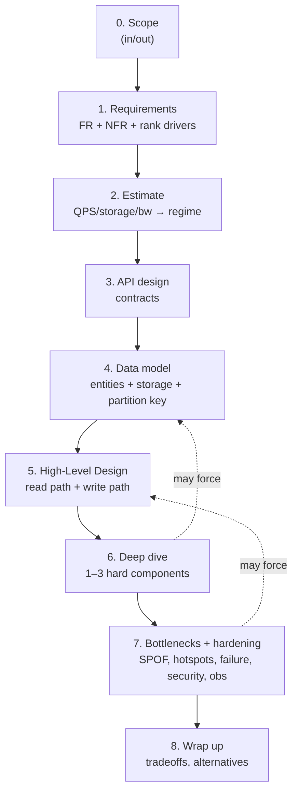

# Lesson 1.3.1 — A Repeatable Design Framework

> Part 1: The Mindset of System Design · Module 1.3: The Design Process · Difficulty: 🟡
>
> **Prerequisites:** all of Module 1.1 and 1.2.
> **Unlocks:** [1.3.2 Driving the Conversation], every [Part 19] interview problem, [Part 20 Capstone].

---

## 1. Learning Objectives

After this lesson you will be able to:

- Execute a **repeatable, step-by-step framework** for any system design — in interviews *and* real design docs.
- Allocate **time/effort** across the steps so you never run out of time before reaching the interesting part.
- Understand *why each step exists* and what failure it prevents, so you can adapt the framework rather than recite it.
- Produce the standard artifacts: requirements, estimates, API sketch, data model, high-level diagram, deep dives, and bottleneck analysis.

---

## 2. Motivation — Why a framework at all

Faced with "design YouTube," beginners freeze or dive randomly into one component. A framework gives you a **default control flow**: it guarantees you cover requirements before solutions (1.1.1), quantify scale before choosing patterns (1.1.4), and reason about tradeoffs (1.1.5) instead of listing technologies. 

The same framework serves two contexts: the **45–60 minute interview** (where structure signals seniority and prevents rambling) and the **real-world design doc/RFC** (where it becomes the document outline). It's not a rigid script — senior engineers flex it — but having a default means you never stare at a blank page. This lesson is referenced by every Part 19 problem and the capstone; learn it once, apply it forever.

---

## 3. Theory — The framework, step by step

A widely-used structure `[CONV]` (synthesizing the *System Design Interview* volumes and real RFC practice), with **rough interview time budgets** for a 45-min session:

### Step 0 — Understand & scope the problem (~3–5 min)
Restate the prompt. Clarify what's **in scope** vs out (you can't design "all of Twitter" in 45 min — pick the core). This is problem-space discipline (1.1.1 §3.2). *Prevents:* solving the wrong problem.

### Step 1 — Requirements (~5 min)
- **Functional** (actor→action→outcome triples) — the few core features.
- **Non-functional** (measurable) — latency, availability, consistency needs, scale.
- **Constraints & assumptions** — explicitly stated.
- **Rank the driving characteristics** (1.2.4) — name the 2–3 that will drive the design.
*Prevents:* unjustified architecture; characteristic wishlists (Module 1.2).

### Step 2 — Capacity estimation (~3–5 min)
Run the funnel (1.1.4): DAU → QPS (read/write) → storage → bandwidth → memory. Conclude with the **regime** ("this needs sharding + caching"). *Prevents:* designing for the wrong scale. *(Skip or shorten only if the interviewer signals they don't want numbers.)*

### Step 3 — API design (~3–5 min)
Sketch the key endpoints/contracts (REST/gRPC), with parameters and responses. This pins down *what the system promises to clients* and forces clarity on the core operations. *Prevents:* fuzzy boundaries; surfaces auth, pagination, idempotency needs early.

### Step 4 — Data model / schema (~3–5 min)
Define the main entities, their relationships, and the storage choice (SQL/NoSQL/etc.) with a *first-principles justification* tied to access patterns and the driving characteristics (Parts 4, 5). Identify the **partition/primary key** — often a one-way door (1.1.1). *Prevents:* a data model that can't support the queries or scale.

### Step 5 — High-Level Design (~8–10 min)
Draw the boxes and arrows: clients → load balancer/gateway → services → caches → databases → queues. Show the **main read path and write path** end to end. Keep it coherent with the driving characteristics (1.2.4 §3.5). *This is the skeleton everything else hangs on.*

### Step 6 — Deep dive into 1–3 components (~10–15 min)
The interviewer (or the hardest part of the problem) guides which components to detail: the data partitioning scheme, the caching strategy, the consistency/replication model, the notification fan-out, the matching algorithm, etc. This is where you **demonstrate depth** — internals, algorithms, tradeoffs (the bulk of Parts 4–17). *Prevents:* staying shallow; this is what separates senior from junior.

### Step 7 — Identify & resolve bottlenecks; scale and harden (~5–8 min)
Walk the design looking for: single points of failure, hot spots/skew, the database bottleneck, the latency tail, cache stampedes. Add: caching, replication, partitioning, async processing, CDNs. Then address **non-functional hardening**: failure scenarios (Part 11), security (Part 15), observability (Part 16), cost (1.2.3). *Prevents:* a happy-path-only design.

### Step 8 — Wrap up (~2–3 min)
Summarize the design, restate the key tradeoffs and *why* (tie to the ranking), mention what you'd do with more time, and note alternative architectures. *Prevents:* trailing off; shows you can self-critique (Staff+ signal).

### 3.1 The framework as a loop, not a line
Though presented linearly, you'll **revisit** earlier steps: a deep dive may reveal the data model needs changing; an estimate may force re-scoping. State that explicitly ("this changes my earlier schema choice") — it shows mature, iterative thinking (1.1.1's design loop), not indecision.

### 3.2 Why this order
The order encodes the dependency structure: you can't estimate without requirements, can't choose a data model without scale, can't draw an HLD without an API and data model, can't find bottlenecks without an HLD. It's the dependency graph (file 03) applied to the *act of designing*.

---

## 4. Visual Intuition



### Time allocation (45-min interview, illustrative)

```
Scope+Reqs  ████░░░░░░░░░░░░░░░░  ~8 min
Estimate    ███░░░░░░░░░░░░░░░░░  ~4 min
API+Data    █████░░░░░░░░░░░░░░░  ~8 min
HLD         ██████░░░░░░░░░░░░░░  ~9 min
Deep dive   ████████░░░░░░░░░░░░  ~12 min  ← the part that scores you
Bottlenecks ████░░░░░░░░░░░░░░░░  ~6 min
Wrap        ██░░░░░░░░░░░░░░░░░░  ~3 min
```

---

## 5. Real-World Analogy

**A doctor's diagnostic protocol.** A good physician doesn't reach for a prescription the moment you sit down (jumping to solutions). They follow a protocol: chief complaint (scope), history and symptoms (requirements), vitals and tests (estimation/measurement), then a working diagnosis (HLD), then focused investigation of the most concerning finding (deep dive), then a treatment plan that accounts for complications and side effects (bottlenecks/hardening), and finally a summary with follow-up (wrap-up). The protocol exists so they never skip a step that matters — and the *experienced* doctor flexes it fluidly while the novice clings to the checklist. Same with design.

---

## 6. Industry Example

- **The *System Design Interview* canon** `[CONV]`: both volumes structure essentially every problem as scope → requirements → estimation → API → data → HLD → deep dive → wrap, which is why this framework transfers directly to those problems (Part 19).
- **RFC/design-doc culture** `[CONV]`: at most large engineering orgs (Google, Amazon, etc.), design documents follow a near-identical outline — context/goals (requirements), proposed design (HLD), detailed design (deep dive), alternatives considered, and risks (bottlenecks/tradeoffs). The interview framework is a compressed design doc.
- **ADRs** `[BP]`: the "alternatives considered + decision + tradeoffs" portion maps to Architecture Decision Records (1.3.3), the durable artifact of the wrap-up step.

---

## 7. Implementation Details — Running it well

**Driving it (see 1.3.2 for depth):** narrate as you go ("I'll start with requirements, then estimate, then sketch the API"). Make the interviewer a collaborator — ask which area they want deep. Manage time actively; if you're 20 min in and still on requirements, you've failed the time budget.

**Adapting to the problem type:**
- *Data-heavy* (URL shortener, KV store) → spend more on data model, partitioning, caching.
- *Real-time* (chat, ride-share) → spend more on connection management, push, geo (Parts 3, 19).
- *Computation/pipeline* (metrics, ad aggregation) → spend more on streaming, windowing (Part 9).
- *Correctness-critical* (payments) → spend more on consistency, idempotency, sagas (Parts 10, 11).

**Adapting to seniority:** Staff+ interviews push harder on step 7–8 (failure modes, operability, cost, organizational/evolution concerns) and expect you to *drive* and *self-critique*, not be led.

**As a real design doc**, expand each step into a section, add "alternatives considered" and "risks/open questions," and circulate for review.

---

## 8. Advantages

- **Never blank** — you always have a next step.
- **Covers the essentials** — requirements and scale before solutions, depth before breadth-of-buzzwords.
- **Time-bounded** — the budget keeps you reaching the deep dive (where you score).
- **Transferable** — same structure for interviews and real RFCs.
- **Signals seniority** — structure + driving + self-critique read as experience.

---

## 9. Disadvantages / Limits

- **Rigid recitation is a trap** — robotically marching through steps without adapting (or without *thinking*) reads as junior. The framework is scaffolding, not a script.
- **Over-investing early steps** — spending 20 minutes on requirements and never designing. Time discipline is essential.
- **Not a substitute for knowledge** — the framework organizes your reasoning, but the *deep dive* still requires real understanding (Parts 4–17). Structure with no depth is empty.

---

## 10. When NOT to use it as-is

- **Tiny/obvious designs** — collapse the steps; don't run a full framework for a CRUD endpoint.
- **A focused follow-up question** ("how would you shard this table?") — answer the question directly; don't restart from scope.
- **Brainstorming/exploration** — when the goal is generating options, not converging on one design, the linear framework is the wrong tool.

---

## 11. Common Mistakes

1. **Jumping to the HLD** (drawing boxes) before requirements and estimation — the #1 error (Module 1.1 sin).
2. **Skipping estimation**, then making scaling decisions with no numbers to justify them.
3. **Never reaching the deep dive** — burning all the time on setup; the deep dive is what's scored.
4. **Listing technologies instead of reasoning** ("I'll use Kafka, Redis, Cassandra") with no tie to requirements/tradeoffs.
5. **Ignoring failure/security/cost** (step 7) — presenting a happy-path-only design.
6. **Not driving** — passively waiting to be led instead of proposing and asking.
7. **No wrap-up** — trailing off without summarizing tradeoffs and alternatives.

---

## 12. Interview Questions
*(This lesson is itself the meta-skill for Part 19; questions here are about applying it.)*

**🟢 Easy**
- List the steps of the design framework in order and the one-line purpose of each.
- Roughly how would you budget 45 minutes across the steps, and which step should get the most time?

**🟡 Medium**
- For "design a rate limiter," sketch how you'd move through steps 0–4 (scope, requirements, estimate, API, data). What are the driving characteristics?
- The interviewer says "skip estimation." How do you adapt, and what do you make sure not to lose?

**🔴 Hard**
- Mid-design, your deep dive reveals the chosen partition key creates hotspots. Walk through how you'd loop back through the framework to fix it without restarting, and how you'd communicate the change.
- Contrast how you'd weight the framework's steps for "design a payment system" vs "design a news feed," and justify the different time allocations from the driving characteristics.

**⚫ Staff+**
- You're given an open-ended "design our next-gen platform" with vague requirements. How do you use (and bend) the framework to drive clarity, surface the real constraints, and still produce a defensible design and a list of alternatives + risks?
- How does the framework change between a Senior and a Staff+ interview? What additional dimensions (org, evolution, cost, failure, buy-vs-build) do you proactively raise, and where in the framework?

---

## 13. Production Pitfalls (when used for real design docs)

- **Skipping "alternatives considered"** — the section reviewers most want; its absence reads as you didn't explore the space.
- **No "risks/open questions"** — designs that pretend certainty get less useful review.
- **Estimates that never get validated** — back-of-envelope numbers carried into production without load testing (1.1.4 §9).
- **The doc that's all HLD, no deep dive** — looks complete, hides the hard unsolved parts (the bottlenecks that'll bite in production).

---

## 14. Optimization Techniques

- **Pre-memorize the step list and time budget** so cognition goes to *content*, not *structure*.
- **Lead each step with its purpose** ("now I'll estimate to figure out if we need sharding") — keeps you and the interviewer aligned.
- **Keep a running "parking lot"** of things to revisit (failure modes, security) so you don't forget them by step 7.
- **End the deep dive with an explicit tradeoff statement** (1.1.5 verbal pattern) — the highest-value sentence you'll say.
- **Practice the framework on Part 19 problems repeatedly** until it's automatic; then focus practice on deep-dive depth.

---

## 15. Summary

A repeatable design framework gives you a default control flow for any system design: **scope → requirements (+ rank drivers) → capacity estimate → API → data model → high-level design (read & write paths) → deep dive into the hard components → bottlenecks & hardening → wrap-up with tradeoffs and alternatives.** The order encodes dependencies (you can't estimate without requirements, can't find bottlenecks without an HLD), and the *time budget* ensures you reach the deep dive — the part that actually demonstrates seniority. Treat it as a **loop** you can revisit, not a rigid script, and **adapt** its weighting to the problem type and the seniority bar. The framework organizes your reasoning; the depth in steps 4–7 comes from the rest of this platform. Master it once and apply it to every Part 19 problem and the capstone.

---

## 16. Revision Notes (flashcard-ready)

- **Q:** The framework steps in order? **A:** Scope → Requirements(+drivers) → Estimate → API → Data model → HLD(read/write paths) → Deep dive → Bottlenecks/hardening → Wrap-up.
- **Q:** Which step is scored most? **A:** The deep dive (step 6) — depth on hard components.
- **Q:** Why this order? **A:** Encodes dependencies; each step needs the prior ones.
- **Q:** #1 beginner mistake? **A:** Jumping to the HLD/boxes before requirements + estimation.
- **Q:** Framework is a line or a loop? **A:** A loop — revisit earlier steps as deep dives reveal issues.
- **Q:** Staff+ emphasis? **A:** Failure modes, security, cost, evolution, org; driving + self-critique.
- **Q:** What ends the deep dive well? **A:** An explicit tradeoff statement tied to the driving characteristics.

---

## 17. Further Reading + Knowledge-Graph Links

**Within this platform**
- **Previous:** Module 1.2 (the characteristics you rank in step 1). **Next:** [1.3.2 Driving a Design Conversation].
- **Uses:** [1.1.2 Requirements], [1.1.4 Estimation], [1.1.5 Tradeoffs], [1.2.4 Prioritization] — steps 1–2 directly.
- **Produces:** the artifact recorded by [1.3.3 ADRs].
- **Applied throughout:** every [Part 19] interview design and [Part 20 Capstone] follow this structure; the FR/data/HLD/deep-dive depth comes from Parts 4–17.
- **Reference:** `reference/interview-framework-onepager.md`, `reference/design-review-template.md`.

**Foundational texts (synthesized)**
- *System Design Interview* Vol. 1 & 2 — the scope→requirements→estimate→API→data→HLD→deep-dive→wrap structure, applied per problem.
- Richards & Ford, *Fundamentals of Software Architecture* — identifying characteristics and driving the design from them.

**Concept tags:** `[CONV]` the framework structure, time budgets, RFC/design-doc parallel · `[BP]` requirements-before-solutions, alternatives-and-risks sections.
