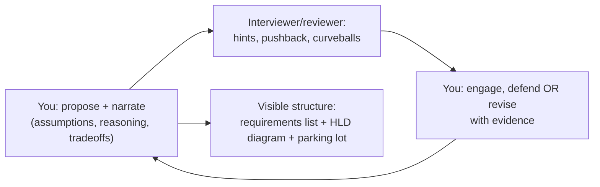
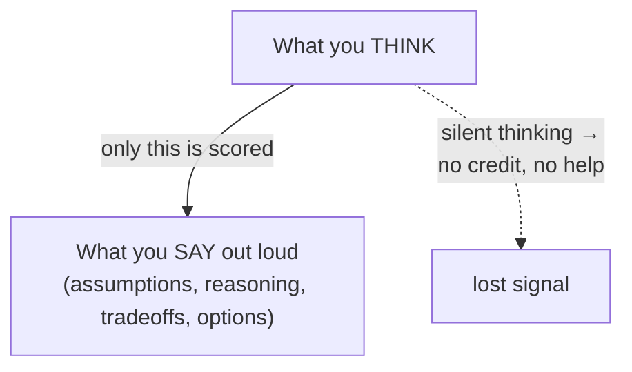

# Lesson 1.3.2 — Driving a Design Conversation

> Part 1: The Mindset of System Design · Module 1.3: The Design Process · Difficulty: 🟡
>
> **Prerequisites:** [1.3.1 The Design Framework].
> **Unlocks:** [Part 19 Interview Designs] (execution skill), real-world design reviews.

---

## 1. Learning Objectives

After this lesson you will be able to:

- **Drive** a design discussion (interview or review) rather than passively answering — proposing, narrating, and steering.
- Use **clarifying questions** strategically to scope and to surface the driving characteristics.
- **Communicate while you think**: narrate reasoning, state assumptions, and make tradeoffs audible.
- Handle **pushback, hints, and curveballs** gracefully, treating them as collaboration signals.
- Recognize the **behavioral signals** that distinguish junior, senior, and Staff+ performance in a live design session.

---

## 2. Motivation — Knowing the framework isn't enough

Two candidates can know the framework (1.3.1) equally well, yet one passes a Staff+ interview and the other doesn't. The difference is **execution and communication**: the strong candidate *drives* — they scope actively, narrate their reasoning so the interviewer can follow and credit it, make tradeoffs explicit, and treat hints as collaboration rather than correction. 

This isn't interview gamesmanship; it's the *same skill* a real architect uses in a design review with skeptical senior engineers and stakeholders. A correct design no one can follow, or that the architect can't defend under questioning, fails in both rooms. The framework is *what* you do; this lesson is *how* you do it live, under pressure, with another human.

---

## 3. Theory — The mechanics of driving

### 3.1 Drive, don't wait
The single biggest behavioral signal `[CONV]`: senior engineers **propose and steer**; juniors wait to be told what to do. Driving means: stating what you'll do next ("I'll scope, then estimate, then sketch the API"), making decisions and justifying them, and proactively raising concerns (failure modes, security) before being asked. The interviewer/reviewer should feel like a *collaborator you're leading*, not an examiner extracting answers.

### 3.2 Clarifying questions as a scoping tool
Ask questions that **change the design**, not trivia. Good questions:
- *Scope:* "Should I include DMs and search, or focus on posting and the timeline?"
- *Scale:* "Roughly how many DAU should I design for?"
- *Driving characteristics:* "Is it more important that the feed is always available, or perfectly up to date?" (forces the consistency↔availability ranking, 1.2.4).
- *Constraints:* "Any compliance or data-residency requirements?" (1.2.3).

Bad questions are ones whose answer wouldn't change anything you do. Ask 2–4 sharp questions, then **proceed** — don't interrogate endlessly (a failure mode in itself).

### 3.3 Think out loud (make reasoning audible)
The reviewer can only credit what they *hear*. Externalize:
- **Assumptions:** "I'll assume a 100:1 read:write ratio; tell me if that's off." (states it so it can be corrected — 1.1.2).
- **Reasoning:** "Since reads dominate, I'll add a cache here — that lets the DB handle writes only."
- **Tradeoffs:** the 1.1.5 verbal pattern ("I choose X over Y, accepting A to gain B, because driver C dominates").
- **Options:** "There are two approaches here; let me weigh them." (shows you see the space, not one answer.)

Silence is the enemy — long silent pauses while you think privately give the reviewer nothing to evaluate and no chance to help.

### 3.4 Manage the whiteboard/structure
Keep a visible structure: list requirements where they can be seen, draw the HLD clearly with labeled boxes and directional arrows, and keep a "parking lot" of things to revisit (failure, security, cost). A legible, evolving diagram is itself communication. Refer back to it ("recall this cache from earlier…").

### 3.5 Handle hints, pushback, and curveballs
- **Hints** ("what happens when this node fails?") are *gifts* — the interviewer is steering you toward what they want to assess, or rescuing you. Engage immediately and adjust; don't defend a now-wrong choice out of ego.
- **Pushback** ("why not a single database?") — don't crumble or dig in blindly. Restate the tradeoff: "A single DB is simpler and fine up to ~X QPS; given our estimate of Y, we exceed that, so I'm partitioning — but if the estimate is lower, the single DB wins." Showing you can *defend or revise* based on evidence is a Staff+ signal.
- **Curveballs / scope expansion** ("now make it work across regions") — treat as a new sub-problem; re-apply the framework to that slice, and call out what it changes (consistency, latency, cost).
- **"I don't know"** — handle honestly: state what you *do* know, reason from first principles, and say how you'd find out. Fabricating specifics is worse than a reasoned "I'm not certain, but here's how I'd approach it" (integrity — and it's what real seniors do).

### 3.6 Time and depth management
You (not just the interviewer) own the clock (1.3.1 budget). If you're deep in one component and time's short, surface it: "I could go deeper here, but let me make sure we cover failure handling — shall I?" This shows judgment about *what matters*. Don't rabbit-hole on a minor optimization while the core design is incomplete.

### 3.7 The seniority ladder of behavior
What the *same problem* looks like at each level `[CONV]`:
- **Junior:** waits for direction; lists technologies; happy-path only; struggles to justify choices.
- **Senior:** drives the framework; justifies with tradeoffs; handles the main failure modes; reaches a solid, defensible design.
- **Staff+:** drives *and* zooms out — questions the requirements themselves, raises org/evolution/cost/buy-vs-build, proactively designs for failure and operability, self-critiques, and discusses alternatives and what they'd revisit. They treat the interviewer as a peer in a design review.

---

## 4. Visual Intuition

### The collaboration loop

### What gets credited

---

## 5. Real-World Analogy

**A pilot communicating with air traffic control.** A good pilot doesn't fly silently and hope; they continuously *call out* intentions ("descending to 10,000 feet, turning to heading 270"), state assumptions, and respond to controller instructions (hints) immediately — adjusting course without ego. The controller and pilot are collaborators with a shared goal, narrating constantly so each can catch the other's errors. A pilot who goes radio-silent, or who argues with a course correction mid-approach, is dangerous. Driving a design conversation is the same: continuous, calm narration; treat instructions as collaboration; adjust based on new information; and keep everyone oriented to the shared picture.

---

## 6. Industry Example

- **Design-review culture** `[CONV]`: at large engineering orgs, design docs are defended in live reviews where senior engineers probe assumptions and alternatives. The skill assessed in a Staff+ interview is a *proxy* for this real meeting — which is why interviews weight driving, defending, and self-critique so heavily.
- **The "strong hire" rubric** `[CONV]`: published interview guidance (including the *System Design Interview* volumes) consistently lists communication, driving the discussion, structured thinking, and handling of tradeoffs/failure as core evaluation criteria — often above arriving at one "correct" architecture (which usually doesn't exist anyway — 1.1.1, 1.2.4).
- **Blameless, evidence-based debate** `[BP]`: SRE/postmortem culture (Part 14) prizes reasoning from data and revising views on evidence — the same posture that makes design-conversation pushback productive rather than adversarial.

---

## 7. Implementation Details — A practical playbook

**Opening (first 2 minutes):** restate the prompt, ask 2–4 scoping/scale/driver questions, then declare your plan ("I'll do requirements, a quick estimate, API, data model, HLD, then deep-dive the hardest part"). You've now *taken the wheel*.

**Throughout:** narrate purpose before each step; state assumptions explicitly and invite correction; verbalize every non-trivial decision as a tradeoff; keep the diagram legible; maintain a parking lot.

**On a hint:** pause, acknowledge ("good point — under that failure…"), engage, and adjust. Never ignore a hint.

**On pushback:** restate the tradeoff and the condition under which each side wins; then either defend with your estimate or revise gracefully. Both are fine; *ego-defense of a wrong choice* is not.

**On uncertainty:** "I'm not 100% sure of the exact mechanism, but from first principles it should work like…; I'd verify by…" — reason and stay honest.

**Closing:** summarize, restate the top tradeoffs tied to the drivers, list what you'd do with more time and one or two alternatives. Leave them with a coherent picture.

**Practice method:** record yourself doing Part 19 problems out loud; review for silence gaps, untimed rambles, missed tradeoff statements, and whether you *drove*. The framework becomes automatic; communication is what you deliberately polish.

---

## 8. Advantages (of driving well)

- **Maximizes credited signal** — the reviewer can follow and reward your reasoning.
- **Turns the reviewer into an ally** — hints and collaboration flow when you're communicative.
- **Demonstrates seniority directly** — driving, tradeoffs, and self-critique *are* the senior signals.
- **Mirrors the real job** — the same skill wins real design reviews and builds trust.

---

## 9. Disadvantages / Risks

- **Over-talking** — narrating *everything*, including trivia, wastes time and buries the signal. Narrate *decisions and reasoning*, not keystrokes.
- **Driving past the interviewer** — steamrolling without checking in; ignoring hints because you're committed to your plan. Driving ≠ not listening.
- **Performative confidence** — projecting certainty you don't have; fabricating specifics. Integrity beats polish.
- **Analysis-out-loud paralysis** — verbalizing endless options without converging (the 1.1.5 §3.6 trap, now audible).

---

## 10. When the dynamics differ

- **Real design reviews** are longer, multi-person, and async-augmented (a doc circulated first); driving means facilitating, not monologuing, and integrating others' concerns.
- **Mentoring/teaching contexts** — you may deliberately *not* drive, to let a mentee lead.
- **Higher-stakes/political reviews** — more emphasis on documenting alternatives and risks (ADRs, 1.3.3) so decisions survive scrutiny after the meeting.

---

## 11. Common Mistakes

1. **Silent thinking** — long pauses with no narration; the reviewer can't credit or help.
2. **Waiting to be led** — answering only what's asked; never proposing or steering.
3. **Ignoring hints** — missing the interviewer's steering (or rescue) signal.
4. **Ego-defending a wrong choice** under pushback instead of revising on evidence.
5. **Endless clarifying questions** — interrogating instead of designing.
6. **Listing tech without reasoning** — "Kafka, Redis, Cassandra" with no tradeoff narration (also 1.3.1).
7. **No summary** — ending abruptly with no recap of tradeoffs/alternatives.
8. **Fabricating specifics** when unsure instead of reasoning honestly.

---

## 12. Interview Questions
*(Meta-skill; these are about the conduct of the session.)*

**🟢 Easy**
- Give three clarifying questions for "design Instagram" that would actually change your design, and say what each would change.
- Why is thinking out loud important in a design interview?

**🟡 Medium**
- The interviewer pushes back: "Why not just one big database?" Script a strong response that defends *or* revises based on evidence.
- You realize 30 minutes in that an earlier assumption was wrong. How do you handle it live without losing credibility?

**🔴 Hard**
- The interviewer keeps expanding scope (add regions, add search, add real-time). How do you stay in control of time and depth while still engaging each curveball?
- You genuinely don't know the internals of a component the interviewer drills into. Demonstrate how to respond from first principles without fabricating.

**⚫ Staff+**
- Describe how your *conduct* (not just content) should differ in a Staff+ design interview versus a Senior one. What do you proactively raise, and how do you treat the interviewer differently?
- In a real cross-team design review, two senior engineers disagree with your proposal for different reasons. Facilitate the conversation to a decision using evidence and tradeoffs, without it becoming a status contest. (Ties to 1.1.5 §14 and ADRs.)

---

## 13. Production Pitfalls (real reviews)

- **The undefended doc:** a design that looks fine on paper but the author can't defend under questioning — usually because the tradeoffs and alternatives were never reasoned through (fix: ADRs, 1.3.3).
- **Decision-by-loudest-voice:** reviews resolved by seniority/volume rather than evidence — leads to poorly-justified one-way-door decisions.
- **Hidden disagreement:** stakeholders nod in the meeting but disagree later; driving includes *surfacing* dissent explicitly.
- **No written record:** a great verbal review with no captured decision/rationale → the same debate recurs in three months.

---

## 14. Optimization Techniques

- **Pre-script your opening** (restate + 3 questions + plan) so you start strong and in control.
- **Keep a parking lot** visible so failure/security/cost aren't forgotten under time pressure.
- **Use the tradeoff sentence template** (1.1.5) as a verbal reflex at every decision.
- **Time-check aloud** at the midpoint and steer toward the deep dive and hardening.
- **Record and review practice sessions**, scoring yourself on driving, narration, tradeoffs, hint-handling, and wrap-up — not just on "did I get the right answer."

---

## 15. Summary

Knowing the framework (1.3.1) is necessary but not sufficient — you must **drive the conversation**: propose and steer rather than wait; ask a few **clarifying questions that change the design** (especially the driving-characteristic ranking); **think out loud** so your assumptions, reasoning, and tradeoffs are audible and creditable; keep a **legible, evolving structure**; and treat **hints and pushback as collaboration**, defending or revising on evidence rather than ego. Manage time and depth deliberately, handle uncertainty with honest first-principles reasoning, and close with a summary of tradeoffs and alternatives. The behavioral ladder is clear: juniors wait and list tech; seniors drive and justify; Staff+ drive, zoom out to requirements/org/evolution, design for failure, and self-critique. These are the *same* skills that win real design reviews — making this lesson as much about being an effective architect as about passing interviews.

---

## 16. Revision Notes (flashcard-ready)

- **Q:** Biggest behavioral signal of seniority? **A:** Driving — proposing/steering vs waiting to be led.
- **Q:** What makes a clarifying question good? **A:** Its answer changes the design (scope/scale/driver/constraint).
- **Q:** Why think out loud? **A:** Only what you *say* is credited; silence gives no signal and no chance for hints.
- **Q:** How to treat a hint? **A:** As a gift — engage immediately and adjust; never ignore.
- **Q:** Response to pushback? **A:** Restate the tradeoff + the condition each side wins; defend or revise on evidence, not ego.
- **Q:** Handling "I don't know"? **A:** State what you know, reason from first principles, say how you'd verify — never fabricate.
- **Q:** Staff+ vs Senior conduct? **A:** Staff+ questions requirements, raises org/evolution/cost/failure, self-critiques, treats reviewer as peer.
- **Q:** Over-talking fix? **A:** Narrate decisions and reasoning, not trivia/keystrokes.

---

## 17. Further Reading + Knowledge-Graph Links

**Within this platform**
- **Previous:** [1.3.1 The Design Framework]. **Next:** [1.3.3 Architecture Decision Records].
- **Uses:** the verbal tradeoff pattern from [1.1.5 §7], the driver ranking from [1.2.4].
- **Applied in:** every [Part 19] problem (this is the execution layer) and [Part 20 Capstone] review.
- **Reference:** `reference/interview-framework-onepager.md`, `reference/design-review-template.md`.

**Foundational texts (synthesized)**
- *System Design Interview* Vol. 1 & 2 — guidance on communication, driving the discussion, and what interviewers evaluate.
- Beyer et al., *SRE* — blameless, evidence-based technical debate (the posture for productive pushback).
- Richards & Ford, *Fundamentals of Software Architecture* — the architect as communicator and decision-driver.

**Concept tags:** `[CONV]` driving/communication as the dominant interview signal, the seniority ladder, hint-handling · `[BP]` evidence-based revision, honest uncertainty · `[OPINION]` "drive but listen" balance.
