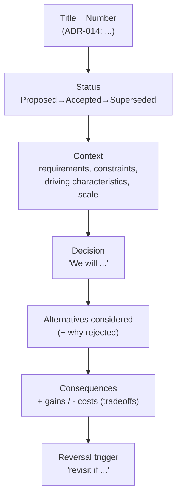
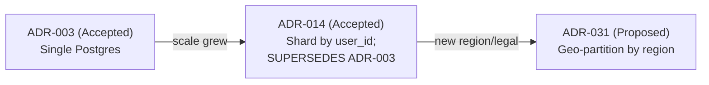

# Lesson 1.3.3 — Documenting Decisions: Architecture Decision Records (ADRs)

> Part 1: The Mindset of System Design · Module 1.3: The Design Process · Difficulty: 🟢🟡 · **Final lesson of Part 1**
>
> **Prerequisites:** [1.1.1 Decisions under uncertainty], [1.1.5 Tradeoffs], [1.3.1 Framework].
> **Unlocks:** [2.3.1 Architecture Decisions], [2.3.3 Evolutionary Architecture], real-world design docs, and the capstone's decision log (Part 20.13).

---

## 1. Learning Objectives

After this lesson you will be able to:

- Explain what an **Architecture Decision Record (ADR)** is and why undocumented decisions are a hidden liability.
- Write a clean ADR capturing **context, decision, alternatives, consequences/tradeoffs, and status**.
- Distinguish decisions worth recording (one-way doors, contested choices) from those that aren't.
- Use ADRs to make architecture **evolvable** — so future teams know *why* a choice was made and *when* it no longer holds (the reversal trigger from 1.1.5).
- Connect ADRs to the broader practice of documenting tradeoffs and conducting design reviews.

---

## 2. Motivation — Why write decisions down

Six months after a decision, the context evaporates. A new engineer sees "we use eventual consistency here" and asks *why* — and nobody remembers. Worse, they "fix" it by adding strong consistency, breaking the availability the original team deliberately chose (1.2.4). **Undocumented architectural decisions become indistinguishable from accidents** (recall 1.1.1's production pitfall): the next team can't tell deliberate tradeoffs from oversights, so they either fearfully preserve everything or recklessly change things that mattered.

An ADR captures the *reasoning* — the context, the alternatives, the accepted tradeoff — at the moment of decision, when it's freshest. This is the durable artifact of the design framework's wrap-up step (1.3.1) and the tradeoff worksheet (1.1.5). It's cheap to write and enormously valuable later, which is why it's the structural enabler of **evolvability** (1.2.2) and **evolutionary architecture** (2.3.3). It's also the closing lesson of Part 1 because it operationalizes the entire mindset: *design is decisions under uncertainty, and decisions must be remembered to be revisited.*

---

## 3. Theory — From first principles

### 3.1 What an ADR is
> An **Architecture Decision Record** is a short, dated, immutable document capturing **one significant architectural decision**: its context, the decision made, the alternatives considered, and the consequences (tradeoffs) accepted. `[CONV]`

Key properties:
- **One decision per ADR** — focused, linkable, individually revisable.
- **Immutable** — you don't edit a past ADR; you write a *new* one that *supersedes* it (preserving history). Decisions form an append-only log (notice the parallel to event sourcing, Part 9/20).
- **Dated and numbered** — ADR-001, ADR-002… stored in the repo (e.g., `docs/adr/`), versioned with the code.
- **Records the *why*, not just the *what*** — the context and rationale are the whole point; the decision alone is the cheap part.

### 3.2 The standard structure
A widely-used template (Michael Nygard's, adopted broadly) `[CONV]`:

1. **Title** — short noun phrase: "ADR-014: Use eventual consistency for the activity feed."
2. **Status** — Proposed / Accepted / Deprecated / Superseded (by ADR-NNN). Tracks the decision's lifecycle.
3. **Context** — the forces at play: requirements, constraints, the driving characteristics (1.2.4), scale estimates, what problem prompted the decision. *This is where future readers reconstruct the world you were in.*
4. **Decision** — what you decided, stated actively ("We will…").
5. **Consequences** — the resulting tradeoffs, *both positive and negative*: what this buys you and what you're giving up / what becomes harder. Honesty here is the value.

Common additions: **Alternatives considered** (and why rejected — prevents the next team re-litigating settled options), and a **reversal trigger** ("revisit if write volume exceeds X" — directly from 1.1.5 §3.3).

### 3.3 What deserves an ADR
Not every decision — that would be noise. Record decisions that are `[BP]`:
- **Architecturally significant** — affect structure, cross-cutting concerns, or are hard to reverse (**one-way doors**, 1.1.1): data model, partitioning key, consistency model, sync vs async communication, build-vs-buy, primary datastore choice, auth model.
- **Contested or non-obvious** — where reasonable engineers disagreed, or where the choice will surprise future readers.
- **Constraint-driven** — where compliance/security/cost (1.2.3) forced a non-obvious structure.

Skip: reversible, low-blast-radius, obvious choices (two-way doors — a cache TTL, a library version). Match documentation effort to reversibility × blast radius (1.1.1 §10).

### 3.4 ADRs vs other documentation
- **ADR** = *why* a decision was made (point-in-time, immutable, decision-focused).
- **Design doc / RFC** = the broader proposed design (the full 1.3.1 framework expanded; may *contain* or spawn ADRs).
- **README / runbook** = *how* to use/operate the system (current state, mutable).
- **Architecture diagrams** = *what* the structure is now (current state).

ADRs are uniquely valuable because they preserve the **historical reasoning** that all the "current state" docs discard. Diagrams show today's architecture; ADRs explain *how and why it got that way*.

### 3.5 ADRs as the engine of evolvability
Because requirements and context drift (1.1.5 §3.5), the "right" decision expires. An ADR's **context** lets a future team check whether the original justification still holds; its **reversal trigger** tells them when to act; and **superseding** ADRs record the evolution as an auditable chain. This is exactly what makes an architecture *evolvable* rather than a frozen mystery (1.2.2, 2.3.3). Without ADRs, every change is made blind; with them, change is informed.

---

## 4. Visual Intuition

### Anatomy of an ADR



### Decisions as an append-only, superseding log



History is preserved; you can always see *why* the previous choice was right *then* and what changed.

---

## 5. Real-World Analogy

**A surgeon's operative notes / a ship's logbook.** A surgeon doesn't just leave the patient stitched up; they record *why* they chose one procedure over another, what they found, and what complications to watch for. Years later, another doctor reading the chart understands the reasoning, not just the outcome — and won't undo a deliberate choice thinking it was a mistake. A ship's log is **append-only and dated**: you never erase yesterday's entry; you add today's. If a later captain changes course, the log shows both the original reasoning and the new one, with the conditions that prompted the change. ADRs are your codebase's operative notes and logbook: append-only, reasoning-focused, and indispensable to whoever inherits the system.

---

## 6. Industry Example

- **Nygard's ADR format & the `adr-tools` ecosystem** `[CONV]`: the lightweight, in-repo, numbered-Markdown ADR practice originated by Michael Nygard is widely adopted across the industry; many orgs keep an `docs/adr/` directory versioned with code.
- **ThoughtWorks Technology Radar** `[CONV]`: ADRs have been recommended ("adopt") by ThoughtWorks as a default practice for capturing architectural decisions.
- **RFC/design-doc culture** `[CONV]`: large engineering organizations (Google, Amazon, etc.) institutionalize "alternatives considered" and "decision + rationale" sections in design docs — the same impulse as ADRs, at document scale.
- **Evolutionary architecture** `[BP]`: Ford/Parsons/Kua pair ADRs with *fitness functions* (2.3.3) — ADRs record the decision; fitness functions automatically guard it.

---

## 7. Implementation Details — Writing and managing ADRs

**A concrete ADR example (abbreviated):**

```
# ADR-014: Eventual consistency for the activity feed

Status: Accepted (2026-06-30)

Context:
- Driving characteristics (1.2.4): availability and read latency dominate; the
  feed is non-critical (a slightly stale feed is acceptable; an unavailable feed is not).
- Estimate (1.1.4): ~120k peak read QPS, 40:1 read:write, global users.
- Constraint: must stay available during regional partitions.

Decision:
- We will serve the activity feed from asynchronously-replicated, eventually-
  consistent read replicas, with fan-out-on-write into per-user feed caches.

Alternatives considered:
- Strong consistency via synchronous replication — rejected: violates the
  availability driver under partition (CAP), and adds write latency we don't need
  for a non-critical feed.
- Read-on-demand (fan-out-on-read) — rejected: too slow for celebrity fan-out at
  our read QPS.

Consequences:
+ High availability and low read latency; scales reads horizontally.
+ Stays up during partitions (AP choice).
- Users may see stale feeds for up to ~seconds; "read-your-writes" needs a
  special-case (serve own posts from primary/session cache).
- Fan-out-on-write is write-amplifying and needs a hybrid for very high-follower accounts.

Reversal trigger:
- Revisit if the feed becomes correctness-critical (e.g., monetized ordering) or
  if staleness complaints exceed our SLO.
```

**Process `[BP]`:**
- Keep ADRs in-repo (`docs/adr/NNNN-title.md`), versioned with the code they describe.
- Write the ADR *when the decision is made* (during/after the design review), not retroactively.
- Use **Proposed** status for review, flip to **Accepted** when agreed; never delete — mark **Superseded by ADR-NNN**.
- Link ADRs from design docs and from code comments where the decision is implemented.
- Keep them **short** — one page. Length kills adoption; the goal is enough context to reconstruct the reasoning, not an essay.

**Tooling:** `adr-tools`, templates in many languages, and IDE snippets exist; but a Markdown file with the five sections is enough.

---

## 8. Advantages

- **Preserves rationale** — future teams understand *why*, not just *what* (the core value).
- **Enables safe evolution** — context + reversal triggers tell future teams when a decision expires (1.2.2, 2.3.3).
- **Prevents re-litigation** — "alternatives considered" stops the team re-debating settled questions.
- **Onboarding accelerator** — new engineers read the ADR log to understand the architecture's history.
- **Cheap** — a one-page Markdown file; high value-to-cost ratio.
- **Accountability & review** — makes decisions explicit and reviewable, improving decision quality.

---

## 9. Disadvantages / Costs

- **Discipline required** — ADRs only help if consistently written *at decision time*; teams drift.
- **Can become stale/ignored** if not maintained or if status isn't kept current (a Superseded chain that's actually abandoned).
- **Over-documentation risk** — writing ADRs for trivial two-way-door decisions creates noise that hides the important ones.
- **No automatic enforcement** — an ADR is a record, not a guardrail; the code can drift from it unless paired with fitness functions (2.3.3).

---

## 10. When NOT to write one

- **Reversible, low-impact decisions** (two-way doors) — a comment or commit message suffices.
- **Obvious, uncontested choices** with no surprising tradeoff.
- **Throwaway prototypes** — capture nothing or a single note; the code is temporary.
- Reserve ADRs for the **significant, contested, or irreversible** — the one-way doors of 1.1.1.

---

## 11. Common Mistakes

1. **Not writing them at all** — the default failure; rationale is lost forever.
2. **Recording the decision but not the *why*** — "We use Cassandra" with no context/alternatives is nearly useless.
3. **Editing past ADRs in place** — destroys the historical record; supersede instead.
4. **Omitting negative consequences** — only listing benefits hides the accepted costs (dishonest and unhelpful).
5. **Skipping alternatives considered** — the next team re-debates settled options.
6. **ADRs for everything** — noise drowns the signal; document only the significant.
7. **No reversal trigger** — future teams can't tell when the decision has expired.
8. **Writing retroactively from memory** — context is already lost; write at decision time.

---

## 12. Interview Questions

**🟢 Easy**
- What is an ADR and what are its core sections?
- Why should an ADR record alternatives and *negative* consequences, not just the decision?

**🟡 Medium**
- Which of these warrant an ADR and which don't: choice of primary datastore; a cache TTL value; the partitioning key; a logging library? Justify using one-way vs two-way doors.
- Write a short ADR (context/decision/alternatives/consequences) for choosing async messaging over synchronous calls between two services.

**🔴 Hard**
- A decision recorded two years ago is now causing pain as the system scaled 50×. Walk through how a well-written ADR (context + reversal trigger) makes evolving it *safer* than if the decision were undocumented, and how you'd record the change.
- How do ADRs and fitness functions (2.3.3) complement each other? Give an example where an ADR records a decision and a fitness function enforces it.

**⚫ Staff+**
- Design a lightweight org-wide ADR practice: where they live, who reviews them, how status/superseding works, and how you'd prevent both under-documentation (lost rationale) and over-documentation (noise). How do you make it *stick* culturally?
- You're auditing a "big ball of mud" with no ADRs. Describe how you'd reconstruct and capture the critical past decisions going forward to make the system evolvable, without boiling the ocean.

---

## 13. Production Pitfalls

- **The lost-rationale incident:** an engineer "optimizes" by changing a deliberately-chosen consistency/replication setting, causing an outage, because no ADR explained *why* it was set that way.
- **Stale status:** a Superseded ADR still referenced as current, or an "Accepted" decision long abandoned in code — the log lies, eroding trust.
- **Drift between ADR and reality:** the code no longer matches the documented decision (no fitness function caught it), so the ADR misleads.
- **ADR graveyard:** a `docs/adr/` folder no one reads or updates — documentation theater. (Fix: integrate ADR review into the design-review/PR process.)

---

## 14. Optimization Techniques

- **Template + automation** (`adr-tools` or a repo snippet) to lower the writing cost and standardize structure.
- **Make ADRs part of the definition of done** for significant changes (PR checklist / design-review gate) so they're written at decision time.
- **Pair ADRs with fitness functions** (2.3.3) — record the decision *and* automatically guard it against drift.
- **Always include a reversal trigger** so two-way-door aspects get revisited and one-way doors are clearly flagged.
- **Link ADRs bidirectionally** with code and design docs so readers find the rationale from the implementation and vice versa.
- **Periodically review the log** (e.g., at architecture reviews) to update statuses and catch expired decisions.

---

## 15. Summary

An **Architecture Decision Record** is a short, dated, immutable, in-repo document that captures *one significant architectural decision* and — crucially — its **context, alternatives, and consequences (tradeoffs)**, i.e., the **why**. Undocumented decisions decay into indistinguishable-from-accidents, so future teams either freeze the system or break deliberate choices. ADRs solve this: they preserve the reasoning at its freshest, prevent re-litigation, accelerate onboarding, and — via recorded context and **reversal triggers** — make the architecture **evolvable**, since teams can tell when a once-right decision has expired. Record only the **significant, contested, or irreversible** decisions (one-way doors); supersede rather than edit; always include the negative consequences and a reversal trigger; and pair ADRs with fitness functions to guard against drift. As the closing lesson of Part 1, the ADR is where the whole mindset lands: design is decisions under uncertainty (1.1.1), made by trading conflicting characteristics (1.2.4) via explicit tradeoffs (1.1.5) — and decisions you don't write down, you don't really own.

---

## 16. Revision Notes (flashcard-ready)

- **Q:** What is an ADR? **A:** A short, dated, immutable record of *one* significant architectural decision and its why (context, alternatives, consequences).
- **Q:** The five core sections? **A:** Title, Status, Context, Decision, Consequences (often + Alternatives + reversal trigger).
- **Q:** Why immutable? **A:** Preserve history; supersede with a new ADR rather than editing.
- **Q:** What deserves an ADR? **A:** Significant, contested, or irreversible (one-way-door) decisions — not trivial two-way doors.
- **Q:** Most important content? **A:** The *why* — context + alternatives + negative consequences.
- **Q:** ADR vs design doc vs README? **A:** Why a decision was made vs the full proposed design vs how to use/operate (current state).
- **Q:** How do ADRs enable evolvability? **A:** Context + reversal trigger let future teams know if/when a decision expired.
- **Q:** ADR + fitness function? **A:** ADR records the decision; fitness function automatically enforces it against drift.

---

## 17. Further Reading + Knowledge-Graph Links

**Within this platform**
- **Previous:** [1.3.2 Driving a Design Conversation]. **This completes Part 1.** Next: **Part 2 — Architecture Fundamentals**, starting with [2.1.1 Modularity, Cohesion, Coupling, Connascence].
- **Captures the output of:** [1.1.5 Tradeoff Worksheet], [1.3.1 Framework wrap-up].
- **Deep dives:** [2.3.1 Architecture Decisions], [2.3.3 Evolutionary Architecture & Fitness Functions], [Part 20.13] (the capstone's full decision log).
- **Reference:** `reference/design-review-template.md`, `reference/tradeoff-worksheet.md`.

**Foundational texts (synthesized)**
- Nygard, *Documenting Architecture Decisions* (the originating ADR essay) — the lightweight format.
- Ford, Parsons, Kua, *Building Evolutionary Architecture* — ADRs + fitness functions for change.
- Ford et al., *Software Architecture: The Hard Parts* — architecture decisions and recording tradeoffs.
- Richards & Ford, *Fundamentals of Software Architecture* — the architect's responsibility to document and justify decisions.

**Concept tags:** `[CONV]` ADR format/Nygard, in-repo numbered Markdown, supersede-don't-edit · `[BP]` document one-way doors only, include negatives + reversal triggers, pair with fitness functions · `[OPINION]` "decisions you don't write down, you don't own."
