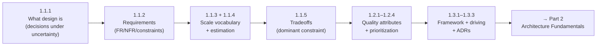

# Part 1 — The Mindset of System Design ✅ COMPLETE

The foundational mental models and vocabulary the rest of the platform builds on. **No distributed-systems concepts yet** — this part rewires *how you think* before you learn *what to build*.

> **Milestone M0** (see `../../02-LEARNING-ROADMAP.md`): after this part, take a vague prompt and produce a requirements doc + capacity estimate + one ADR + a high-level component diagram, with the driving characteristics ranked.

---

## Lessons

### Module 1.1 — Thinking in Systems
| # | Lesson | Core idea |
|---|--------|-----------|
| 1.1.1 | [What System Design Actually Is](1.1.1-what-system-design-is.md) | Structure + contracts + tradeoffs; decisions under uncertainty; one-way vs two-way doors |
| 1.1.2 | [Functional vs Non-Functional Requirements](1.1.2-functional-vs-nonfunctional-requirements.md) | FRs sketch the boxes; NFRs + constraints drive the architecture; rank them |
| 1.1.3 | [The Vocabulary of Scale](1.1.3-vocabulary-of-scale.md) | Latency/throughput/concurrency/utilization; Little's Law; the utilization knee; percentiles; nines |
| 1.1.4 | [Back-of-the-Envelope Capacity Estimation](1.1.4-capacity-estimation.md) | DAU→QPS→storage→bandwidth→memory; design for peak; conclude with the architectural implication |
| 1.1.5 | [Tradeoffs as the Core Skill](1.1.5-tradeoffs-as-the-core-skill.md) | Recurring axes; the dominant constraint; real vs false (dominated) tradeoffs |

### Module 1.2 — Quality Attributes (Architecture Characteristics)
| # | Lesson | Core idea |
|---|--------|-----------|
| 1.2.1 | [Scalability, Performance, Availability, Reliability](1.2.1-scalability-performance-availability-reliability.md) | The big four are orthogonal; fault→error→failure; availability ≈ MTBF/(MTBF+MTTR) |
| 1.2.2 | [Maintainability, Evolvability, Operability, Observability](1.2.2-maintainability-evolvability-operability-observability.md) | Day-2 qualities dominate lifetime cost; accidental vs essential complexity; observability ≠ monitoring |
| 1.2.3 | [Security, Compliance, Cost as First-Class](1.2.3-security-compliance-cost.md) | CIA triad; secure-by-design; compliance as constraint; cost trades against everything |
| 1.2.4 | [How Characteristics Conflict & How to Prioritize](1.2.4-how-characteristics-conflict.md) | Satisfice, don't maximize; pick 2–3 driving characteristics; drivers propagate coherently |

### Module 1.3 — The Design Process
| # | Lesson | Core idea |
|---|--------|-----------|
| 1.3.1 | [A Repeatable Design Framework](1.3.1-the-design-framework.md) | Scope→reqs→estimate→API→data→HLD→deep-dive→bottlenecks→wrap; the deep dive is what's scored |
| 1.3.2 | [Driving a Design Conversation](1.3.2-driving-a-design-conversation.md) | Drive don't wait; think out loud; treat hints/pushback as collaboration; the seniority ladder |
| 1.3.3 | [Architecture Decision Records (ADRs)](1.3.3-architecture-decision-records.md) | Record the *why*; immutable + supersede; reversal triggers; the engine of evolvability |

---

## The through-line of Part 1

**One sentence:** Design is *choosing structure under conflicting constraints*; you state requirements, estimate scale, rank the few driving quality attributes, resolve tradeoffs by the dominant constraint, run a repeatable framework to produce the design, and record the irreversible decisions so the system stays evolvable.

---

## Self-check before advancing to Part 2

Without notes, can you:
1. Define system design and explain one-way vs two-way doors?
2. Turn "design a photo app" into FRs, measurable NFRs, constraints, and a capacity estimate?
3. State Little's Law and explain why latency explodes near 100% utilization?
4. Name five tradeoff axes and explain what the "dominant constraint" does?
5. Distinguish availability from reliability, and fault from error from failure?
6. Explain why you pick only 2–3 driving characteristics, and give the CAP/PACELC conflict?
7. Run the design framework end-to-end and write a one-page ADR?

If any answer is shaky, re-read that lesson's Revision Notes (Section 16) before moving on. Part 2 assumes all seven.

---

*Cross-cutting reference assets used in this part live in `../../reference/`: `latency-and-estimation-cheatsheet.md`, `tradeoff-worksheet.md`. The interview-framework one-pager and design-review template are referenced and will be added as Part 2/19 come online.*
