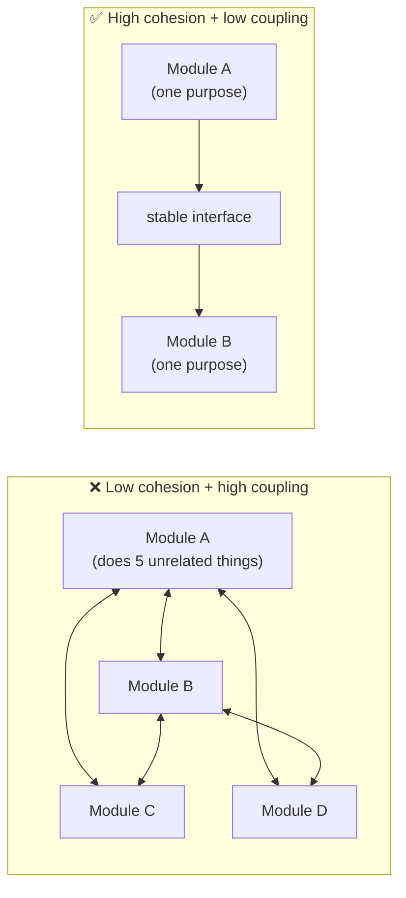
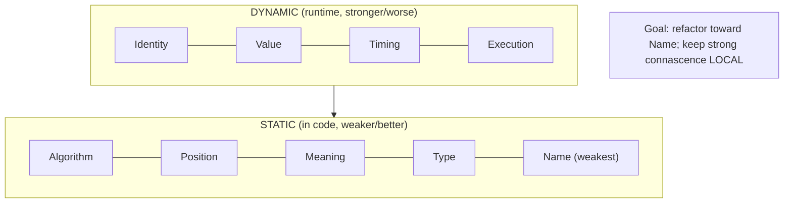
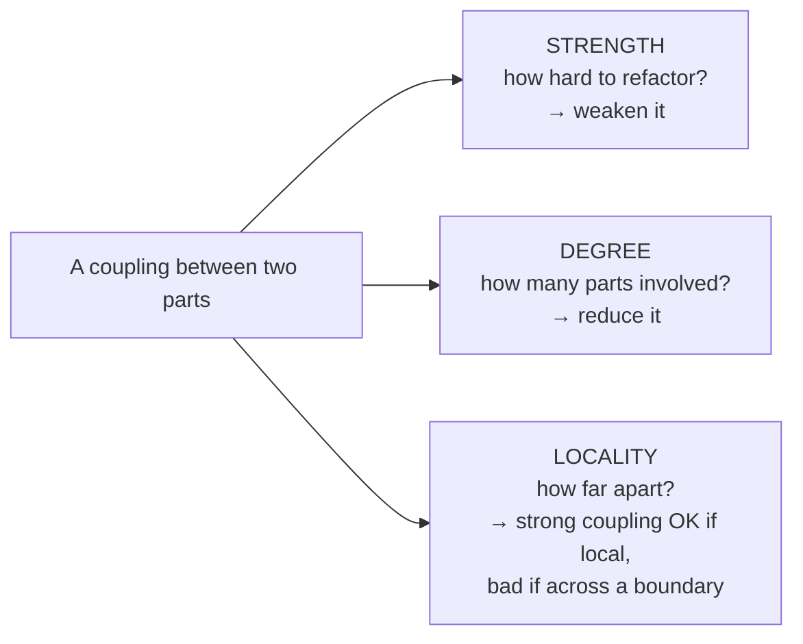

# Lesson 2.1.1 — Modularity, Cohesion, Coupling, and Connascence

> Part 2: Architecture Fundamentals · Module 2.1: Components & Coupling · Difficulty: 🟡
>
> **Prerequisites:** Part 1 (especially [1.2.2 Maintainability] — simplicity/evolvability).
> **Unlocks:** [2.1.2 Layering & Hexagonal], [2.1.3 DDD], [2.2 Architecture Styles], [Part 12 Microservices decomposition].

---

## 1. Learning Objectives

After this lesson you will be able to:

- Define **modularity**, **cohesion**, and **coupling** precisely and explain why "high cohesion, low coupling" is the foundational law of structural design.
- Use **connascence** as a precise, modern vocabulary for *kinds* and *strength* of coupling (going beyond the vague "tight/loose").
- Distinguish **static** vs **dynamic** connascence and apply the rules of **degree, locality, and strength** to decide what to refactor.
- Recognize the types of cohesion and coupling, and rank them from worst to best.
- Connect these class/module-level properties to system-level decomposition (services, bounded contexts) — the *same physics* at every scale.

---

## 2. Motivation — Why structure is everything

Part 1 established that design is *choosing structure* (1.1.1) and that **simplicity and evolvability** dominate a system's lifetime cost (1.2.2). This lesson gives you the precise tools to *measure* structural quality. 

Every architecture — a single class, a module, a microservice mesh — is judged by the same two questions: **how well do the things inside one unit belong together (cohesion)?** and **how entangled is this unit with others (coupling)?** Get these wrong and you get the dreaded *big ball of mud*: a system where every change ripples unpredictably, nothing can be understood in isolation, and velocity grinds to zero. Get them right and the system is understandable, testable, and changeable — i.e., evolvable.

The phrase "high cohesion, low coupling" is repeated everywhere but rarely made precise. **Connascence** (introduced by Meilir Page-Jones, popularized for architecture by Richards & Ford) gives us a *measurable* language for coupling — not just "tight vs loose" but *what kind*, *how much*, and *how far apart*. This is the vocabulary that lets you reason rigorously about decomposition, from class design (LLD, Module 2.4) all the way to service boundaries (Part 12). Crucially, the *same principles* govern good class design and good microservice boundaries — learn them once, apply them at every scale.

---

## 3. Theory — From first principles

### 3.1 Modularity

> **Modularity** = decomposing a system into discrete units (modules/components) that can be understood, developed, tested, and changed largely independently. `[CS]`

A module exposes an **interface** (its contract — recall 1.1.1's "guarantees components make to each other") and hides its **implementation**. The goal is *information hiding* (Parnas): a module should encapsulate a decision that's likely to change, so changing it doesn't ripple. Modularity is the structural enabler of everything in 1.2.2 — simplicity (understand one piece at a time), evolvability (change one piece), and even team scaling (different teams own different modules).

### 3.2 Cohesion — how well a unit's contents belong together

> **Cohesion** = the degree to which the elements *inside* a single module belong together and serve a single, well-defined purpose. **High cohesion is good.** `[CS]`

A highly cohesive module does *one thing* and contains everything needed for that thing (and nothing unrelated). The classic cohesion spectrum, **worst → best**:

1. **Coincidental** (worst) — elements grouped arbitrarily (a "Utils" dumping ground).
2. **Logical** — elements grouped because they're the same *category* (all "validations") but unrelated in purpose.
3. **Temporal** — grouped because they happen at the same *time* (everything in "startup()").
4. **Procedural** — grouped because they run in sequence.
5. **Communicational** — grouped because they operate on the same data.
6. **Sequential** — output of one element is input to the next.
7. **Functional** (best) — all elements contribute to a single, well-defined task.

Higher cohesion → the module has a clear reason to exist and a clear reason to change (this is the heart of the **Single Responsibility Principle**: "a module should have one reason to change" — Lesson 2.4.1). Low cohesion → the module changes for many unrelated reasons, making it fragile and hard to name.

### 3.3 Coupling — how entangled units are with each other

> **Coupling** = the degree of interdependence *between* modules. **Low (loose) coupling is good.** `[CS]`

The more module A knows about / depends on module B's internals, the more changes to B force changes to A. The coupling spectrum, **worst → best**:

1. **Content coupling** (worst) — A reaches into B's internals (modifies B's private data). Pathological.
2. **Common coupling** — A and B share global mutable state.
3. **Control coupling** — A passes a flag that controls B's internal logic.
4. **Stamp coupling** — A passes a whole structure when B needs one field.
5. **Data coupling** (best) — A and B communicate only through simple, explicit parameters.

The aim: depend on **stable abstractions/interfaces**, not on concrete internals (Dependency Inversion, 2.4.1). Loose coupling lets you change, replace, or test a module in isolation.

### 3.4 The fundamental tension (cohesion vs coupling are linked)

These aren't independent dials. **Increasing cohesion within modules tends to decrease coupling between them, and vice versa** — because if related things live together (cohesive), there are fewer cross-module dependencies. The pathology of low cohesion is that related logic gets scattered across modules, which *forces* high coupling to coordinate it. So "high cohesion, low coupling" is really *one* principle viewed from two sides: **put what changes together in the same place, and minimize what crosses boundaries.**

But you can't drive coupling to zero — a system of perfectly decoupled modules that never interact does nothing. The goal is the *right* coupling: explicit, minimal, through stable contracts (data coupling), not implicit and pervasive (content/common coupling). This is itself a tradeoff (1.1.5): over-decomposition creates so many boundaries that the *integration* coupling explodes (a real microservices failure mode — Part 12).

### 3.5 Connascence — a precise vocabulary for coupling

"Tight/loose" is too coarse. **Connascence** `[CS]` gives a precise framework: *two components are connascent if a change in one requires a corresponding change in the other to keep the system correct.* It classifies coupling along three measures and into kinds.

**The three properties of connascence (how to evaluate/improve it):**
1. **Strength** — how hard the coupling is to discover and refactor. *Refactor toward weaker forms.*
2. **Degree** — how many components are involved. *Lower degree (fewer affected) is better.*
3. **Locality** — how close the connascent elements are. *Connascence is more acceptable when elements are close (same module) and worse when distant (across services).* The same kind of connascence that's fine within a class is dangerous across a network boundary.

**Static connascence** (detectable by reading the code), weakest → stronger:
- **Connascence of Name (CoN)** — agree on a *name* (a method/variable name). Weakest; renaming tools handle it.
- **Connascence of Type (CoT)** — agree on a *type*.
- **Connascence of Meaning/Convention (CoM)** — agree on the *meaning* of a value (e.g., `0` means "inactive"). Fix with named constants/enums.
- **Connascence of Position (CoP)** — agree on the *order* of values (positional args, tuple order). Fix with named parameters/objects.
- **Connascence of Algorithm (CoA)** — agree on a specific *algorithm* (e.g., both sides must hash/checksum identically).

**Dynamic connascence** (only detectable at runtime), generally *stronger and worse*:
- **Connascence of Execution (CoE)** — the *order* of execution matters (must call `init()` before `use()`).
- **Connascence of Timing (CoT)** — the *timing* matters (race conditions, timeouts).
- **Connascence of Value (CoV)** — several values must change *together* to stay consistent (e.g., a range's min and max).
- **Connascence of Identity (CoI)** — multiple components must reference the *same* instance/entity.

**The guidelines** `[BP]`:
- **Minimize overall connascence** by breaking the system into encapsulated units.
- **Minimize connascence that crosses boundaries** (low locality) — this is the key rule for service decomposition.
- **Maximize within-boundary connascence acceptability** — strong connascence is fine if it's local and easy to see.
- **Refactor toward weaker, more static forms** (e.g., positional args → named args turns CoP into CoN).

> Connascence is the rigorous version of "loose coupling." When someone says "these services are too tightly coupled," connascence lets you say *exactly how* (e.g., "they share Connascence of Meaning across a network boundary — high strength, bad locality") and *how to fix it*.

### 3.6 Same physics at every scale

The profound point: **cohesion, coupling, and connascence apply identically to classes, modules, components, and services.** A microservice is just a module with a network boundary. Good service decomposition (Part 12) = high cohesion (a service owns one capability) + low coupling (services interact through stable contracts, minimizing cross-boundary connascence). The network boundary *raises the stakes* — cross-service connascence is expensive to change (deploys, versioning, no compiler to catch it) — but the principles are the same ones you use to design a single class. Master them here and they transfer all the way up.

---

## 4. Visual Intuition

### Cohesion vs coupling

### Connascence strength ladder (refactor downward)

### The three properties to evaluate any coupling

---

## 5. Real-World Analogy

**Organizing a kitchen.** **Cohesion** is keeping all the baking supplies in one cabinet and all the spices in another — each cabinet has a clear purpose, so you instantly know where to look and what belongs. A *low-cohesion* kitchen scatters flour in three drawers and stores knives with the cereal (a "miscellaneous" drawer is the coincidental-cohesion "Utils" class). **Coupling** is how much rearranging one cabinet forces you to rearrange others: if the only way to reach the plates is by first moving the pots (content coupling), the kitchen is fragile. **Connascence** is the precise diagnosis: "the recipe assumes the third jar from the left is salt" (Connascence of Position — fragile, fix by labeling the jars → Connascence of Name); "the oven must be preheated before the cake goes in" (Connascence of Execution — order matters, dynamic, harder to see). A well-designed kitchen, like a well-designed system, lets one cook work in one area without disturbing another — and the same organizing principles scale from a single drawer to a restaurant's whole kitchen.

---

## 6. Industry Example

- **Microservice decomposition** `[CONV]`: the dominant guidance (Newman, *Building Microservices*; Part 12) is to draw service boundaries around **high cohesion** (a service owns one business capability) and **low coupling** (services share nothing but explicit contracts). Failed microservice migrations are almost always *cohesion/coupling failures* — boundaries that split things that change together, creating chatty, change-coupled "distributed monoliths" (high cross-boundary connascence).
- **Domain-Driven Design bounded contexts** `[CONV]`: DDD (2.1.3) is essentially a method for finding *high-cohesion* boundaries (a model that's consistent within a context) and managing *coupling* between them (context maps, anti-corruption layers — 2.1.3, 12.9).
- **Richards & Ford** `[BP]`: explicitly teach connascence as the measurable foundation for evaluating coupling in modern architecture, and tie cross-boundary connascence directly to service-granularity decisions.
- **The "modular monolith" trend** `[EMERGING]`: a reaction to over-decomposition — keep high cohesion and clear module boundaries *without* the network coupling cost of microservices (Part 2.2, Part 12). It's cohesion/coupling reasoning applied to choose *where the boundaries go*, separate from *whether they're network boundaries*.

---

## 7. Implementation Details — Applying it

**Diagnosing a module:**
- *Cohesion check:* can you describe what this module does in one sentence without "and"? If it takes a paragraph or a list, cohesion is low. Does it change for multiple unrelated reasons? (SRP violation.)
- *Coupling check:* if I change this module's internals, how many others break? Does it reach into others' data (content), share globals (common), or take control flags (control)? Push toward data coupling through interfaces.

**Refactoring with connascence (worked):**
- Function `createUser(true, false, 1)` — three booleans/ints by **position** and **meaning** (CoP + CoM). Refactor to `createUser({ isAdmin: true, sendEmail: false, tier: Tier.Basic })` — now it's **Connascence of Name** (weakest) and self-documenting. You moved *down* the strength ladder.
- Two services that must both compute the same signature **algorithm** (CoA) across the network — extract a shared, versioned library or make one service own the operation, reducing cross-boundary connascence.

**At service scale (preview of Part 12):**
- Put data and behavior that change together in the *same* service (high cohesion → "database per service" makes sense because the data is cohesive with the logic).
- Communicate through explicit, versioned contracts (APIs, events) — keep cross-service connascence to weak, static forms (Name/Type via schemas) and avoid sharing databases (which creates content/common coupling across the network — a cardinal microservices sin).

**Tooling:** dependency-analysis tools and architecture *fitness functions* (2.3.3) can detect forbidden dependencies, cyclic coupling, and excessive afferent/efferent coupling, failing the build when structure erodes.

---

## 8. Advantages (of high cohesion / low coupling)

- **Evolvability** — changes are local; you can modify one module without a ripple (1.2.2).
- **Testability** — loosely coupled modules can be tested in isolation (mock the interface).
- **Understandability** — high cohesion means each module has a clear, nameable purpose.
- **Parallel development & team scaling** — teams own cohesive modules with clear contracts (Conway's Law, 2.1.3).
- **Replaceability** — a loosely coupled module can be swapped (e.g., change the storage implementation behind an interface).

---

## 9. Disadvantages / Costs

- **Over-decomposition** — too many tiny modules/services create so many boundaries that *integration* coupling and cognitive overhead explode (the distributed-monolith trap). Decomposition is itself a tradeoff (1.1.5).
- **Abstraction cost** — interfaces and indirection add layers; excessive abstraction *reduces* simplicity (the 1.2.2 evolvability-vs-simplicity tension).
- **Boundary mistakes are expensive** — drawing a boundary through something that should be cohesive (splitting things that change together) creates permanent cross-boundary connascence; at service scale this is a costly one-way door (1.1.1).
- **Judgment-heavy** — there's no formula for "the right boundary"; it requires domain understanding (hence DDD, 2.1.3).

---

## 10. When NOT to over-apply

- **Small, stable code** — a 200-line script doesn't need elaborate module boundaries; over-modularizing it adds accidental complexity (1.2.2).
- **Premature decomposition** — splitting into services/modules before you understand the domain's natural seams almost always draws boundaries in the wrong place (monolith-first, Part 12). It's easier to split a cohesive monolith later than to re-merge wrongly-split services.
- **Within a single cohesive unit** — strong connascence (even dynamic) is *acceptable and normal* when locality is high; don't contort local code to avoid coupling that isn't crossing a boundary.

---

## 11. Common Mistakes

1. **The "Utils"/"Helpers" dumping ground** — coincidental cohesion; a sign of no real home for the logic.
2. **Confusing "loose coupling" with "no coupling"** — modules must interact; the goal is *minimal, explicit* coupling, not zero.
3. **Shared mutable global state / shared database** — common/content coupling; the most insidious because it's invisible until a change breaks something far away (especially across services).
4. **Positional/boolean parameters** — Connascence of Position + Meaning; refactor to named params/objects.
5. **Splitting cohesive things across boundaries** — putting data that changes together in different services, creating chronic cross-boundary change-coupling (distributed monolith).
6. **Ignoring locality** — tolerating strong (dynamic) connascence *across* a network boundary, where it's hardest to change and there's no compiler to catch breaks.
7. **Over-abstracting for imagined flexibility** — speculative interfaces that add complexity without reducing real coupling (1.2.2 §11).

---

## 12. Interview Questions

**🟢 Easy**
- Define cohesion and coupling. Why do we want high cohesion and low coupling?
- Give an example of a low-cohesion module and explain how you'd improve it.

**🟡 Medium**
- What is connascence, and what are its three properties (strength, degree, locality)? Why does locality matter for deciding service boundaries?
- Refactor `processOrder(order, true, false, 2)` to reduce connascence. Name the connascence types before and after.

**🔴 Hard**
- Two microservices must always be deployed together because a change in one breaks the other. Diagnose this with connascence vocabulary, explain why it's especially bad across a network boundary, and propose fixes.
- Explain why "high cohesion, low coupling" is effectively a single principle, and how driving cohesion up naturally drives cross-module coupling down. Where does this break down (over-decomposition)?

**⚫ Staff+**
- You're deciding microservice boundaries for a new system. Lay out how cohesion, coupling, and *cross-boundary connascence* guide where you cut, why getting it wrong is a costly one-way door, and why "monolith-first" can be the lower-risk path. Tie it to Conway's Law.
- Critique connascence as a metric: where is it useful for governing a large codebase (fitness functions), and where does it fail to capture architectural quality? What would you measure alongside it?

---

## 13. Production Pitfalls

- **The distributed monolith:** services that look independent but are change-coupled (high cross-boundary connascence) — every "feature" touches five services that must deploy in lockstep, getting the *costs* of microservices with none of the *benefits* (Part 12).
- **Shared-database coupling:** multiple services reading/writing the same tables — content/common coupling across a boundary; a schema change silently breaks distant consumers.
- **Hidden execution-order coupling (CoE):** components that work only if called in a specific, undocumented order — fragile, breaks during refactors or concurrency changes, and invisible in code review.
- **The god module / big ball of mud:** accumulated low cohesion + high coupling until no change is safe and onboarding takes months (the 1.2.2 maintainability collapse).

---

## 14. Optimization Techniques

- **Refactor connascence downward** (toward Name) and **inward** (keep strong connascence local).
- **Depend on interfaces/abstractions, not concretions** (Dependency Inversion, 2.4.1) to convert content/control coupling into data coupling.
- **Use fitness functions** (2.3.3) to fail the build on cyclic dependencies, forbidden cross-module imports, or excessive coupling metrics — preventing erosion over time.
- **Apply the "change together → stay together" heuristic** when drawing boundaries: things with high mutual connascence belong in the same module/service.
- **Prefer named parameters/objects, enums, and value objects** to eliminate positional/meaning connascence at the code level.
- **Introduce anti-corruption layers** (12.9) at boundaries to keep one module's model from leaking coupling into another.

---

## 15. Summary

The foundation of all structural design is **modularity** — decomposing a system into units that hide their implementation behind contracts — judged by two linked properties: **cohesion** (how well a unit's contents belong together; *high is good*, with functional cohesion the ideal) and **coupling** (interdependence between units; *low is good*, with data coupling the ideal). These are two views of one principle: *keep what changes together in one place, and minimize what crosses boundaries*. **Connascence** makes "coupling" rigorous: two parts are connascent if changing one forces a change in the other, evaluated by **strength** (refactor toward weaker, static forms like Connascence of Name), **degree** (fewer parts involved), and **locality** (strong coupling is acceptable when local, dangerous across boundaries). The decisive insight is that these principles are **scale-invariant** — the same physics governs a single class and a mesh of microservices, where a service is just a module with a network boundary that makes cross-boundary connascence especially expensive. Master cohesion, coupling, and connascence here and you have the core tool for every decomposition decision in the platform, from LLD to bounded contexts to service granularity.

---

## 16. Revision Notes (flashcard-ready)

- **Q:** Cohesion vs coupling, and which direction is good? **A:** Cohesion = how well a unit's contents belong together (high good); coupling = interdependence between units (low good).
- **Q:** Best/worst cohesion? **A:** Functional (best) → coincidental (worst).
- **Q:** Best/worst coupling? **A:** Data coupling (best) → content coupling (worst).
- **Q:** What is connascence? **A:** Two parts are connascent if changing one requires changing the other for correctness.
- **Q:** Connascence's three properties? **A:** Strength (refactor weaker), Degree (fewer parts), Locality (strong is OK if local, bad if distant).
- **Q:** Static vs dynamic connascence? **A:** Static = visible in code (Name/Type/Meaning/Position/Algorithm, weak→strong); dynamic = runtime (Execution/Timing/Value/Identity), generally worse.
- **Q:** Weakest connascence to refactor toward? **A:** Connascence of Name.
- **Q:** Why does locality matter for services? **A:** Cross-boundary (network) connascence is expensive and uncatchable by a compiler — minimize it.
- **Q:** Distributed monolith = ? **A:** Services with high cross-boundary connascence that must deploy together — costs of microservices, none of the benefits.
- **Q:** "Change together → ?" **A:** Stay together (in the same module/service) — high mutual connascence implies one boundary.

---

## 17. Further Reading + Knowledge-Graph Links

**Within this platform**
- **Builds on:** [1.2.2 Maintainability/Simplicity/Evolvability] — connascence is the measurable basis of those qualities.
- **Next:** [2.1.2 Layering, Ports & Adapters (Hexagonal), Clean Architecture] — applying low coupling structurally.
- **Then:** [2.1.3 Domain-Driven Design] — finding high-cohesion boundaries (bounded contexts).
- **Deep dives:** [2.4.1 SOLID/GRASP] (SRP = cohesion; DIP = coupling), [Part 12 Microservices] (decomposition = cohesion/coupling/connascence at network scale), [2.3.3 Fitness Functions] (enforcing structure).

**Foundational texts (synthesized)**
- Richards & Ford, *Fundamentals of Software Architecture* — connascence as the measure of coupling; cohesion/coupling for component design.
- Page-Jones (via the above) — the original connascence taxonomy.
- Newman, *Building Microservices* — cohesion/coupling as the basis of service boundaries.
- Ford et al., *Software Architecture: The Hard Parts* — coupling and granularity tradeoffs in decomposition.

**Concept tags:** `[CS]` cohesion/coupling spectra, connascence taxonomy, information hiding · `[BP]` refactor connascence weaker+local, change-together-stay-together · `[CONV]` cohesion/coupling for service boundaries · `[EMERGING]` modular monolith.
