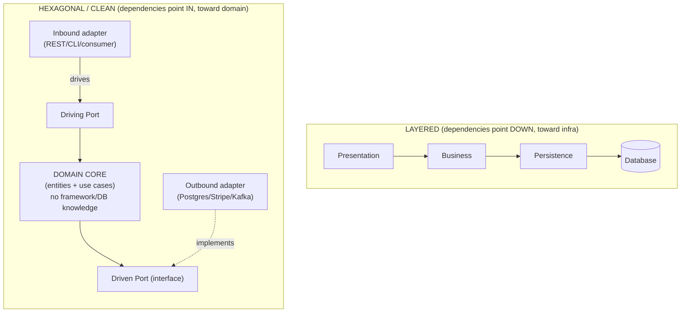
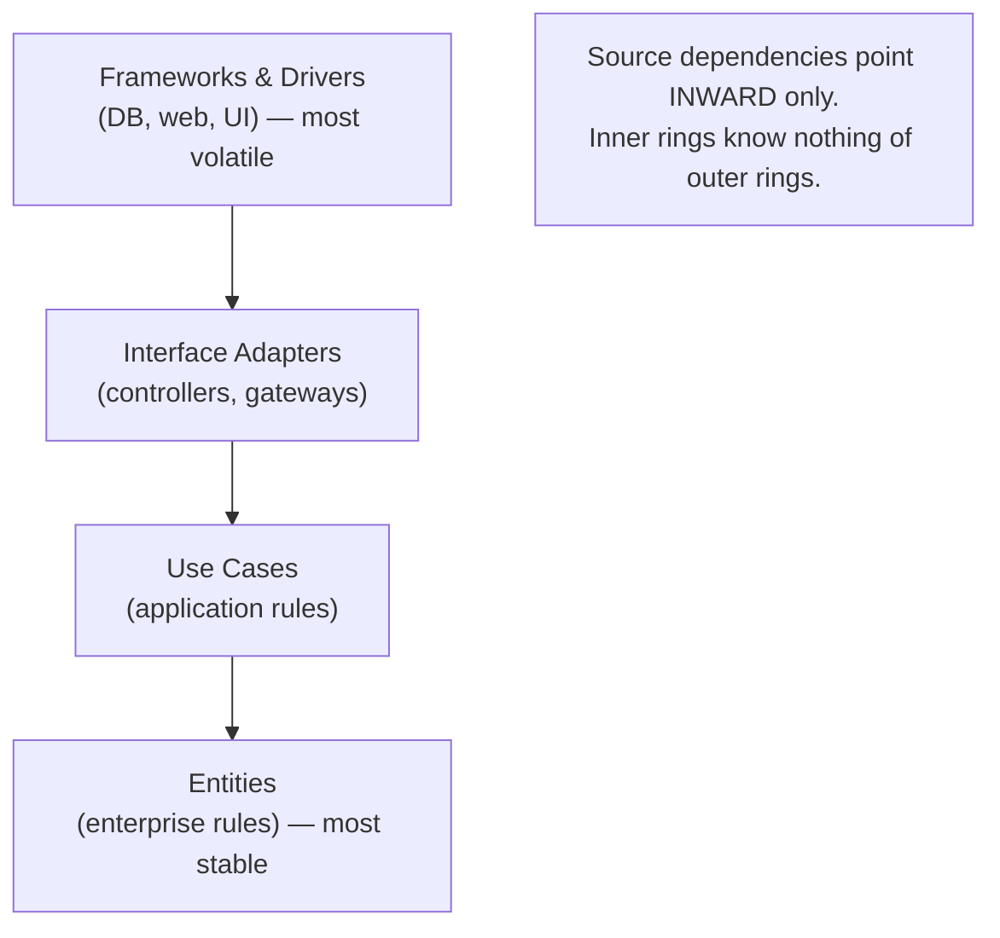

# Lesson 2.1.2 — Layering, Ports & Adapters (Hexagonal), and Clean Architecture

> Part 2: Architecture Fundamentals · Module 2.1: Components & Coupling · Difficulty: 🟡
>
> **Prerequisites:** [2.1.1 Cohesion/Coupling/Connascence], [1.2.2 Maintainability].
> **Unlocks:** [2.1.3 DDD], [2.2 Architecture Styles], [2.4 LLD], [Part 12 Microservices internal structure].

---

## 1. Learning Objectives

After this lesson you will be able to:

- Explain **layered architecture**, its benefits, and its failure modes (the "layered monolith" and leaky layers).
- Describe **Ports & Adapters (Hexagonal)** architecture and the **Dependency Inversion** insight that makes it work.
- Explain **Clean Architecture / Onion** and the **Dependency Rule** (dependencies point inward, toward the domain).
- Articulate *why* all three exist: to **protect business logic from infrastructure churn** so the system stays testable and evolvable.
- Choose an appropriate internal structure for a service and avoid over-engineering it.

---

## 2. Motivation — Protecting what matters from what changes

A system has two kinds of code: **business logic** (the rules that *are the product* — how a payment is computed, how a feed is ranked) and **infrastructure** (databases, web frameworks, message brokers, third-party APIs). Infrastructure changes constantly — you swap Postgres for a different store, REST for gRPC, one cloud queue for another. Business logic changes for *different* reasons (the business changes).

The central problem these patterns solve: **if business logic is entangled with infrastructure, every infrastructure change risks the core logic, and you can't test the logic without spinning up the infrastructure.** That's high coupling (2.1.1) across the worst possible boundary. Layering, Hexagonal, and Clean Architecture are three increasingly principled answers to the same question: *how do we structure a unit so the stable, valuable business logic is insulated from the volatile, replaceable infrastructure?* This is the 1.2.2 evolvability/testability goal made structural, and it directly applies the cohesion/coupling/connascence tools from 2.1.1.

---

## 3. Theory — From first principles

### 3.1 Layered (n-tier) architecture

> **Layered architecture** organizes code into horizontal layers, each with a role, where each layer depends only on the layer(s) below it. `[CS]`

The classic layers:
- **Presentation** (UI / API controllers) → **Business/Application** (use cases, domain logic) → **Persistence** (data access) → **Database**.

Key concept: **layers of isolation** — a change in one layer shouldn't ripple to others if the contracts hold. Layers can be **closed** (a request must pass through each layer in turn — the default, enforcing isolation) or **open** (a request may skip a layer — used for shared services, but weakens isolation).

**Strengths:** simple, universally understood, maps to team skills (UI team, backend team), great default for small/medium apps. **Weaknesses:**
- **The dependency points the wrong way.** Business logic depends *downward* on persistence — so a database change can ripple *up* into business logic. The thing that changes most (infrastructure) is depended on by the thing that should be most stable (domain). This is the flaw Hexagonal/Clean fix.
- **The "architecture sinkhole" anti-pattern** `[CONV]`: requests that pass straight through every layer doing nothing but forwarding — pure overhead.
- **Tends toward the "layered monolith"** that's hard to scale independently and where layers leak into each other over time.

### 3.2 The Dependency Inversion insight (the hinge for everything that follows)

The fix comes from the **Dependency Inversion Principle** (DIP, the "D" in SOLID — 2.4.1) `[CS]`:

> High-level (business) modules should not depend on low-level (infrastructure) modules. *Both* should depend on **abstractions**. And abstractions should not depend on details — details depend on abstractions.

Concretely: instead of the business logic calling `PostgresUserRepository` directly (depending on infrastructure), the business logic *defines an interface* it needs — `UserRepository` — and the infrastructure *implements* that interface. Now the dependency arrow is **inverted**: infrastructure depends on the business layer's abstraction, not the reverse. The domain no longer knows or cares that Postgres exists. Swap in a different store, or an in-memory fake for tests, and the domain is untouched. **This single inversion is the engine behind both Hexagonal and Clean Architecture.**

### 3.3 Ports & Adapters (Hexagonal architecture)

Coined by Alistair Cockburn `[CS]`. The metaphor: the application core is a hexagon; the outside world plugs into it through **ports** and **adapters**.

- **The core** (inside) — the application/business logic, with *no knowledge of the outside world* (no framework imports, no SQL, no HTTP).
- **Ports** — interfaces *defined by the core* that describe what it needs or offers. Two kinds:
  - **Driving (primary) ports** — how the outside *drives* the application (e.g., a `PlaceOrder` use-case interface). Called by inbound adapters.
  - **Driven (secondary) ports** — what the application *needs* from the outside (e.g., `OrderRepository`, `PaymentGateway`). Implemented by outbound adapters.
- **Adapters** — concrete implementations that connect a technology to a port:
  - **Driving adapters** (inbound): REST controller, gRPC handler, CLI, message consumer — they call driving ports.
  - **Driven adapters** (outbound): a Postgres repository, a Stripe client, a Kafka publisher — they implement driven ports.

The result: the *same* core can be driven by REST or a CLI or a test, and can be backed by Postgres or an in-memory fake — by swapping adapters. The technology lives at the edges; the business logic lives in the protected center. The "hexagon" shape is incidental — the point is *multiple symmetric ports*, not exactly six sides.

### 3.4 Clean Architecture / Onion

Robert C. Martin's **Clean Architecture** (and Jeffrey Palermo's **Onion**) generalize Hexagonal into concentric rings `[CS]`:

- **Center: Entities** — enterprise-wide business rules (the most stable, most general).
- **Use Cases** — application-specific business rules (orchestrate entities).
- **Interface Adapters** — controllers, presenters, gateways (translate between use cases and the outside).
- **Frameworks & Drivers** (outer ring) — the database, web framework, UI, devices (the most volatile).

**The Dependency Rule** (the one rule to remember): **source-code dependencies point *only inward*, toward higher-level policy.** Inner rings know nothing about outer rings. The database and framework are *details* in the outermost ring — plugins to the business rules, not the foundation. Crossing a boundary inward uses DIP (the inner ring defines the interface; the outer ring implements it).

> Hexagonal, Clean, and Onion are essentially the **same idea** at different levels of detail: *put the domain at the center, point all dependencies inward via abstractions, and treat infrastructure as replaceable plugins at the edge.* If you understand DIP (3.2), you understand all three.

### 3.5 What these patterns actually buy you (and the connascence view)

- **Independence of frameworks/DB/UI** — the core doesn't import them, so they're swappable.
- **Testability** — the core is tested in isolation by plugging in fake adapters; no DB or HTTP needed. This is the headline benefit in practice.
- **Evolvability** — infrastructure churn is contained at the edges (1.2.2).

In connascence terms (2.1.1): these patterns ensure the **strong connascence stays inside the core** (high locality — fine), while the connascence *crossing the boundary* to infrastructure is reduced to weak **Connascence of Name/Type** through interfaces. They convert content/control coupling (domain↔DB) into clean data coupling through ports.

### 3.6 The cost: this is a tradeoff, not a free win

These patterns add **indirection and ceremony**: more interfaces, mapping between layers (domain objects ↔ DB entities ↔ DTOs), more files. That's the **simplicity ↔ flexibility** tradeoff from 1.1.5/1.2.2 made concrete. For a small CRUD service with no real business logic, full Clean Architecture is over-engineering — the indirection *adds* accidental complexity without protecting any valuable logic (there's little to protect). The richer and more long-lived the *business logic*, the more these patterns pay off. Match the structure to the stakes.

---

## 4. Visual Intuition

### Layered vs Hexagonal — where do dependencies point?


Note the inverted arrow: in Hexagonal the **database adapter depends on the core's interface**, not the other way around (DIP).

### Clean Architecture rings (the Dependency Rule)



---

## 5. Real-World Analogy

**A power tool with interchangeable attachments.** The motor (the domain core) is the valuable, stable part. It exposes a standard **port** — the chuck/socket. You plug in adapters: a drill bit, a sander, a saw (outbound adapters/technologies). You can also drive it different ways — a trigger, a foot pedal, a remote (inbound adapters). The motor neither knows nor cares which attachment is plugged in; it just spins the standard interface. Swap a worn drill bit for a sander without touching the motor. Compare this to a cheap appliance where the motor is welded to a single fixed blade (the layered monolith with the domain bonded to one database): when the blade design changes, you rebuild the whole motor, and you can't test the motor without the blade attached. Ports & Adapters is the philosophy of the standard socket: protect the expensive core, make the cheap, changeable parts pluggable.

---

## 6. Industry Example

- **Testability as the real driver** `[CONV]`: teams that adopt Hexagonal/Clean almost always cite *fast, infrastructure-free unit testing of business logic* as the payoff — the core is exercised with in-memory fakes instead of a real database, making test suites fast and deterministic.
- **Microservice internal structure** `[CONV]`: a common pattern (Newman; Part 12) is microservices that are *small Hexagonal/Clean apps internally* — the network boundary is one adapter; the database is another. This keeps each service's domain logic swappable and testable even as infrastructure evolves.
- **DDD pairing** `[CONV]`: Hexagonal/Clean are the natural *implementation structure* for a Domain-Driven Design bounded context (2.1.3) — the domain model sits in the protected core, persistence and messaging are adapters. The two are almost always taught together.
- **Framework-independence debates** `[OPINION]`: there's healthy industry disagreement about how far to take "the framework is a detail" — some argue strict Clean Architecture over-abstracts in framework-centric ecosystems. The mature position is to apply it proportionally to the richness of the business logic (3.6).

---

## 7. Implementation Details — Structuring a service

**A pragmatic Hexagonal layout for one service:**
```
domain/        ← entities, value objects, domain services (no imports of infra/framework)
application/   ← use cases; defines PORTS (interfaces) it needs
  ports/
    in/        ← driving ports (use-case interfaces)
    out/       ← driven ports (UserRepository, PaymentGateway interfaces)
adapters/
  in/          ← REST controllers, message consumers (call driving ports)
  out/         ← PostgresUserRepository, StripeAdapter (implement driven ports)
config/        ← wiring: inject concrete adapters into the core (composition root)
```

- **Dependency direction:** `adapters → application → domain`. Nothing in `domain` imports anything from `adapters` or frameworks.
- **Wiring (composition root):** at startup, dependency injection plugs concrete adapters into the ports. This is the *only* place that knows about both the core and the concrete infrastructure.
- **Mapping:** convert between domain objects, persistence entities, and API DTOs at the adapter boundary — so the domain model isn't polluted by ORM annotations or JSON concerns. (This mapping is the "ceremony" cost of 3.6.)
- **Testing:** unit-test the domain/use-cases with in-memory fake adapters (fast, no DB); use integration tests for the real adapters.

**SOLID connection (2.4.1):** these patterns are essentially *Dependency Inversion + Single Responsibility* applied at the module level — the domain owns its interfaces (DIP), and each adapter has one reason to change (SRP).

---

## 8. Advantages

- **Protects business logic** from infrastructure churn (the core goal).
- **Testability** — core logic tested in isolation, fast and deterministic.
- **Swappable infrastructure** — change DB, framework, broker, or external API by writing a new adapter.
- **Clear boundaries** — high cohesion in the core, low coupling to the edges (2.1.1).
- **Parallel work** — teams build adapters against agreed ports independently.

---

## 9. Disadvantages / Costs

- **Indirection & boilerplate** — more interfaces, mapping layers, and files; reduces simplicity (1.2.2).
- **Over-engineering risk** — for thin CRUD with no real domain logic, the ceremony protects almost nothing (3.6).
- **Learning curve** — teams new to DIP misplace responsibilities (e.g., leaking ORM entities into the domain), getting the costs without the benefits.
- **Mapping overhead** — domain↔entity↔DTO conversions are real code to write and maintain.

---

## 10. When NOT to use (or to use lightly)

- **Simple CRUD services** where the "business logic" is just validation and storage — a clean layered structure is enough; full Clean Architecture is overkill.
- **Prototypes / spikes** — don't build elaborate ports for code you'll delete.
- **Tiny scripts/tools** — no boundary needed.
- **When the team won't maintain the discipline** — half-applied Hexagonal (leaky core) is worse than honest layering. Apply proportionally to the value and longevity of the business logic.

---

## 11. Common Mistakes

1. **Layered architecture with the dependency pointing the wrong way** — domain depending on the concrete DB, so DB changes ripple into business logic (the flaw DIP fixes).
2. **Leaky core** — importing framework/ORM annotations or SQL types into the domain, defeating the whole purpose.
3. **Anemic ports** — interfaces that just mirror the database (`save`, `find`) with no domain meaning, so you get boilerplate without real decoupling.
4. **Architecture sinkhole** — layers/adapters that only forward calls, adding overhead with no value.
5. **Over-applying to trivial services** — full Clean Architecture on a thin CRUD endpoint (accidental complexity, 1.2.2).
6. **Mapping skipped** — exposing domain objects directly as API/DB models, re-coupling the core to external concerns.
7. **No composition root** — wiring scattered everywhere instead of one place that injects adapters.

---

## 12. Interview Questions

**🟢 Easy**
- What are the typical layers in a layered architecture, and which way do dependencies point?
- In Ports & Adapters, what's the difference between a driving (primary) and a driven (secondary) port?

**🟡 Medium**
- Explain the Dependency Inversion Principle and how it lets the database depend on the domain rather than the reverse.
- Your domain code imports the ORM's `@Entity` annotation. Why is that a problem in a Hexagonal design, and how do you fix it?

**🔴 Hard**
- Walk through structuring an "order placement" service using Hexagonal architecture: name the entities, use cases, ports, and adapters, and show where the database and payment provider plug in. How does this make it testable without a real DB?
- Compare layered vs hexagonal for a service whose database will likely be replaced and whose business rules are complex. Which do you choose and why? Where would layered be the better call?

**⚫ Staff+**
- Critique "the database/framework is just a detail." When is this principle genuinely valuable, and when does strictly applying Clean Architecture cause more harm (accidental complexity) than good? How do you decide per service?
- You're standardizing internal structure across 40 microservices. Would you mandate Hexagonal/Clean? Discuss the tradeoff between consistency/evolvability and the boilerplate/over-engineering cost for simple services, and how you'd let teams opt out.

---

## 13. Production Pitfalls

- **Slow, flaky test suites** because business logic was never decoupled from the DB/HTTP — every test needs real infrastructure. (Hexagonal's main fix.)
- **Big-bang DB migration pain** in a layered monolith where persistence concerns leaked everywhere — what should be an adapter swap becomes a system-wide rewrite.
- **Domain pollution** — ORM/JSON/framework concerns creeping into entities over time, silently re-coupling the core (catch with fitness functions, 2.3.3 — e.g., "domain package must not import persistence package").
- **Adapter logic creep** — business rules sneaking into adapters (controllers/repositories) instead of the core, scattering the logic and undermining cohesion (2.1.1).

---

## 14. Optimization Techniques

- **Enforce the dependency rule with fitness functions** (2.3.3): fail the build if `domain` imports `adapters`/framework packages.
- **Keep ports domain-meaningful**, not database-shaped — express what the *business* needs, not CRUD verbs.
- **One composition root** for wiring; use dependency injection so swapping adapters is a config change.
- **Apply proportionally:** rich domain → full Hexagonal/Clean; thin CRUD → simple layering. Don't pay the ceremony where there's no logic to protect.
- **Pair with DDD** (2.1.3): let bounded contexts define the cores and ports naturally.

---

## 15. Summary

Layered, Hexagonal (Ports & Adapters), and Clean/Onion architectures all answer one question: **how do we protect stable, valuable business logic from volatile, replaceable infrastructure?** Plain **layered** architecture is the simple, familiar default but has a fatal flaw — dependencies point *down toward infrastructure*, so database/framework changes ripple up into the domain. **Dependency Inversion** fixes this: the domain defines the interfaces (ports) it needs, and infrastructure implements them, **inverting the dependency to point inward**. **Hexagonal** structures this as a technology-agnostic core surrounded by driving and driven ports with pluggable adapters; **Clean/Onion** generalizes it into concentric rings governed by one **Dependency Rule: source dependencies point only inward, toward the domain.** The payoff is **testability** (exercise the core with fakes, no DB) and **evolvability** (swap infrastructure by swapping adapters) — i.e., the 1.2.2 qualities made structural, using the cohesion/coupling/connascence tools of 2.1.1. The cost is indirection and ceremony, so apply it **proportionally to the richness of the business logic**: essential for complex, long-lived domains, over-engineering for thin CRUD.

---

## 16. Revision Notes (flashcard-ready)

- **Q:** Flaw of plain layered architecture? **A:** Dependencies point down toward infrastructure, so DB/framework changes ripple up into the domain.
- **Q:** The principle that fixes it? **A:** Dependency Inversion — domain defines interfaces; infrastructure implements them (dependency points inward).
- **Q:** Driving vs driven port? **A:** Driving (primary) = how the outside drives the app (use-case interface); driven (secondary) = what the app needs (repository/gateway interface).
- **Q:** What's an adapter? **A:** A concrete implementation connecting a technology to a port (REST controller, Postgres repo, Stripe client).
- **Q:** Clean Architecture's one rule? **A:** The Dependency Rule — source dependencies point only inward, toward higher-level policy/domain.
- **Q:** Relationship of Hexagonal/Clean/Onion? **A:** Same idea — domain at center, dependencies inward via DIP, infrastructure as pluggable edge — at different detail levels.
- **Q:** Headline practical benefit? **A:** Testability — test the core with fakes, no DB/HTTP.
- **Q:** When is it over-engineering? **A:** Thin CRUD with no real business logic to protect.

---

## 17. Further Reading + Knowledge-Graph Links

**Within this platform**
- **Previous:** [2.1.1 Cohesion/Coupling/Connascence] (the tools these patterns apply). **Next:** [2.1.3 Domain-Driven Design] (defines the cores these patterns wrap).
- **Builds toward:** [2.2 Architecture Styles] (these are *intra*-component structures; styles are *inter*-component), [2.4.1 SOLID] (DIP/SRP are the underlying principles), [Part 12] (service internal structure).
- **Enforced by:** [2.3.3 Fitness Functions].

**Foundational texts (synthesized)**
- Richards & Ford, *Fundamentals of Software Architecture* — layered architecture, its anti-patterns (sinkhole), and isolation.
- Cockburn — Ports & Adapters (Hexagonal) original concept.
- Martin, *Clean Architecture* — the Dependency Rule, rings, "DB/framework as detail."
- Newman, *Building Microservices* — Hexagonal as the internal shape of a service.

**Concept tags:** `[CS]` layering, DIP, Ports & Adapters, the Dependency Rule · `[CONV]` testability as driver, Hexagonal-per-microservice, DDD pairing · `[OPINION]` how far to take "framework is a detail."
