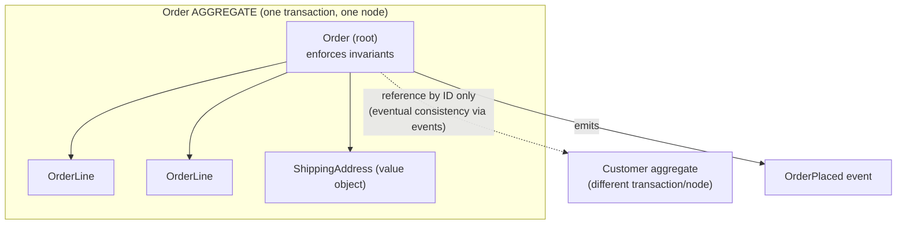
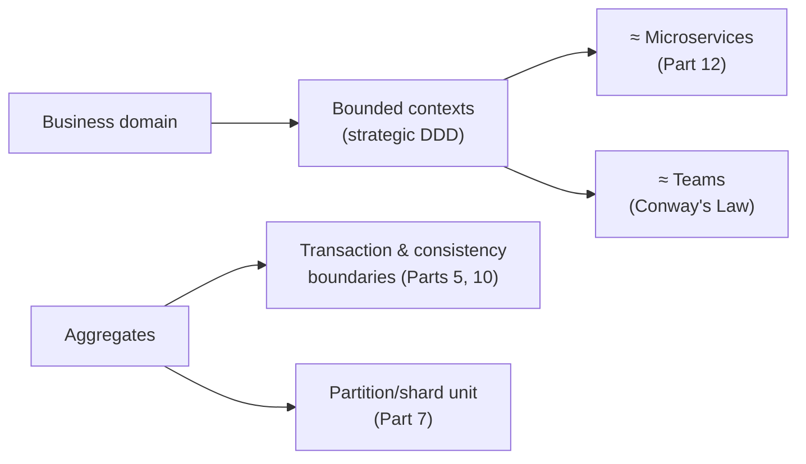

# Lesson 2.1.3 — Domain-Driven Design Essentials: Bounded Contexts, Aggregates, Ubiquitous Language

> Part 2: Architecture Fundamentals · Module 2.1: Components & Coupling · Difficulty: 🟡🔴 · **Completes Module 2.1**
>
> **Prerequisites:** [2.1.1 Cohesion/Coupling/Connascence], [2.1.2 Layering/Hexagonal].
> **Unlocks:** [2.2 Architecture Styles], [Part 12 Microservices decomposition], [Part 10 consistency boundaries], the capstone's bounded contexts (Part 20.1).

---

## 1. Learning Objectives

After this lesson you will be able to:

- Explain what **Domain-Driven Design (DDD)** is and why it's the primary tool for finding *where to draw boundaries* (services, modules).
- Define and apply the key building blocks: **ubiquitous language, bounded context, entity, value object, aggregate (+ aggregate root), domain event, repository**.
- Explain why the **aggregate is the unit of consistency** — and how that directly determines transaction and partition boundaries (linking to Parts 5, 10).
- Use **context maps** and **anti-corruption layers** to manage relationships *between* contexts.
- Recognize how **Conway's Law** ties domain boundaries to team boundaries.

---

## 2. Motivation — The boundary problem

Lesson 2.1.1 told you to draw boundaries around **high cohesion / low coupling**, and 2.1.2 told you how to *structure* a unit internally. But neither answers the hardest question: **where exactly do the boundaries go?** Split a system the wrong way and you get a distributed monolith (2.1.1 §13) no matter how clean each piece is.

**DDD (Eric Evans) is the discipline for finding those boundaries from the *business domain* itself.** Its core insight: software boundaries should mirror the *natural seams in the business*, where the language, rules, and rate of change differ. Get the boundaries from the domain, and cohesion/coupling fall out correctly; impose arbitrary technical boundaries, and you fight the domain forever.

DDD matters enormously for system design because **the bounded context is the natural candidate for a microservice**, and the **aggregate is the natural unit of a transaction and a consistency boundary** — which means DDD decisions directly shape your data model (Part 5), your consistency strategy (Part 10), your service decomposition (Part 12), and your team structure. It's the bridge from "business problem" to "system structure."

---

## 3. Theory — From first principles

DDD has two halves: **strategic** (the big-picture boundaries) and **tactical** (the building blocks inside a boundary). For system design, *strategic* DDD matters most, but the tactical patterns explain consistency boundaries.

### 3.1 Ubiquitous Language

> A **ubiquitous language** is a shared, precise vocabulary — used identically by domain experts *and* in the code — within a specific context. `[CS]`

The same word means different things in different parts of a business. "Customer" in *sales* (a lead, a prospect) is not "Customer" in *support* (an account with tickets) or *billing* (a payer with invoices). Forcing one universal "Customer" model produces a bloated, low-cohesion mess that satisfies no one. DDD says: **let each context have its own precise language and model.** When the code uses the exact words the experts use (`Order.place()`, not `OrderManager.processOrderData()`), the model stays aligned with the business and miscommunication drops. The ubiquitous language is *scoped to a bounded context* — that's the link to §3.2.

### 3.2 Bounded Context (the central strategic pattern)

> A **bounded context** is an explicit boundary within which a particular domain model and its ubiquitous language are consistent and valid. `[CS]`

Outside the boundary, the same terms may mean different things and a *different* model applies. Examples for an e-commerce system: `Catalog`, `Ordering`, `Inventory`, `Shipping`, `Billing`, `Support` — each is a bounded context with its own model of "product" or "customer."

Why it's the keystone:
- **It's the natural unit of high cohesion** (2.1.1): everything inside shares one language and changes together for the same business reasons.
- **It's the candidate boundary for a microservice** (Part 12): one team, one model, one deployable, owning its own data (database-per-service).
- **It localizes the model**, so a change in how *Billing* models a customer doesn't ripple into *Support* — low coupling across contexts.

> Rule of thumb: **one bounded context ≈ one microservice ≈ one team** (Conway's Law, §3.7) — though a context may start as a module in a modular monolith and become a service later (Part 12, monolith-first).

### 3.3 Entities vs Value Objects

Inside a context, two kinds of domain objects `[CS]`:
- **Entity** — has a distinct **identity** that persists over time, independent of its attributes. A `Customer` with ID 42 is the same customer even if their name and address change. Equality is by identity.
- **Value Object** — defined *only* by its attributes, has **no identity**, and is **immutable**. `Money(100, USD)`, an `Address`, a `DateRange`. Two value objects with equal attributes are interchangeable. Equality is by value.

This distinction matters: value objects are simpler, safe to share, and eliminate whole classes of bugs (immutability removes Connascence of Value/Identity from 2.1.1). Prefer value objects where identity isn't needed.

### 3.4 Aggregates and the Aggregate Root (the consistency boundary)

This is the most system-design-relevant tactical pattern `[CS]`:

> An **aggregate** is a cluster of related entities and value objects treated as a *single unit for data changes*, with one entity designated the **aggregate root**. All external access goes *through* the root; the root enforces the aggregate's invariants (consistency rules).

Example: an `Order` (root) contains `OrderLine` items and a `ShippingAddress` value object. You don't modify an `OrderLine` directly from outside — you go through `Order`, which enforces rules like "total must equal the sum of lines" and "a shipped order can't add lines."

**The critical system-design rules** `[BP]`:
1. **The aggregate is the unit of consistency / the transaction boundary.** Everything inside one aggregate is kept *strongly consistent within a single transaction*. This is huge: it means **one transaction should modify one aggregate**.
2. **Across aggregates, use eventual consistency** (via domain events), *not* a single big transaction. References between aggregates are *by identity* (store the other aggregate's ID, not a direct object link).
3. **Therefore the aggregate is also the natural unit of partitioning/sharding** (Part 7) — an aggregate stays together on one node so its invariants can be enforced atomically.

This directly links DDD to the deepest distributed-systems decisions: the aggregate boundary *is* where you draw the line between "must be strongly consistent (one transaction, one node)" and "can be eventually consistent (across nodes, via events)." Get aggregates right and consistency/partitioning decisions (Parts 5, 7, 10) follow naturally; get them wrong (too big → contention and unscalable transactions; too small → broken invariants) and you fight the database forever.

### 3.5 Domain Events and Repositories

- **Domain Event** — a record that something meaningful happened in the domain (`OrderPlaced`, `PaymentReceived`). Events are how aggregates and contexts communicate *asynchronously* while staying decoupled — the basis of event-driven architecture (2.2.4), the outbox pattern, event sourcing, and Sagas (Parts 9, 11, 12). Cross-aggregate consistency is achieved by emitting events and reacting to them.
- **Repository** — an abstraction (a *driven port* in Hexagonal terms, 2.1.2) for retrieving and persisting *aggregates* (you load/save whole aggregates through their root, not individual child entities). It hides the storage technology from the domain.

### 3.6 Context Maps and Anti-Corruption Layers (managing coupling between contexts)

Contexts must still interact. A **context map** documents the relationships and the *power dynamics* between them `[CS]`. Common relationship patterns:
- **Partnership / Shared Kernel** — two contexts share a small common model (high coupling — use sparingly).
- **Customer–Supplier** — upstream context serves a downstream one, which has some influence.
- **Conformist** — downstream just accepts the upstream model as-is (e.g., a third-party API you can't change).
- **Anti-Corruption Layer (ACL)** — a translation layer that protects a context from an external/legacy model by mapping it into the local ubiquitous language. **This is how you keep one context's model from corrupting another's** — critically important when integrating legacy systems or third parties (also used in migrations, 12.9).

The ACL is the cross-context application of low coupling (2.1.1): it confines the connascence to a thin, explicit boundary instead of letting a foreign model leak everywhere.

### 3.7 Conway's Law — the organizational mirror

> **Conway's Law:** organizations design systems that mirror their *communication structure*. `[CS]`

Implication: your architecture *will* end up shaped like your org chart whether you plan it or not. DDD leverages this deliberately via the **"Inverse Conway Maneuver"** `[CONV]` — structure your *teams* around bounded contexts so the desired architecture emerges naturally. One team owning one bounded context (one service) minimizes cross-team coordination (the most expensive coupling of all). This is why "one context ≈ one team ≈ one service" is a recurring rule and why service decomposition is as much an *organizational* decision as a technical one (Part 12).

---

## 4. Visual Intuition

### Bounded contexts with different models of the same word

```mermaid
flowchart TB
    subgraph Sales["Bounded Context: Sales"]
        SC["Customer = lead/prospect\n(name, interest, stage)"]
    end
    subgraph Billing["Bounded Context: Billing"]
        BC["Customer = payer\n(invoices, payment methods, balance)"]
    end
    subgraph Support["Bounded Context: Support"]
        SUC["Customer = account\n(tickets, entitlements)"]
    end
    SC -. "same person, different model\n(linked by ID, ACL at edges)" .- BC
    BC -. .- SUC
```

### Aggregate = consistency boundary



### From domain to architecture



---

## 5. Real-World Analogy

**A hospital.** The word "patient" means something different in each department, even though it's the same human. In *Radiology*, a patient is an imaging case with scans and dosages; in *Billing*, a patient is an account with insurance and charges; in *Pharmacy*, a patient is a set of prescriptions and allergies. Each department (bounded context) has its own forms, vocabulary, and rules (ubiquitous language) — and forcing all departments to share one giant universal "patient form" would be a bureaucratic disaster that serves none of them well. Departments coordinate through standard handoff documents (domain events) and translate each other's paperwork at the desk (anti-corruption layer), referencing the same patient by medical record number (reference by identity). And crucially, the hospital's departments are organized around these natural divisions of work (Conway's Law) — the org chart *is* the architecture. An **aggregate** is like a patient's single medication chart: you change it as one coherent unit with strict rules (no conflicting prescriptions), and it lives in one place so those rules can be enforced.

---

## 6. Industry Example

- **Microservices from bounded contexts** `[CONV]`: the dominant guidance (Newman, *Building Microservices*; widely echoed by ThoughtWorks/Fowler) is to decompose along bounded contexts, not technical layers — and many documented monolith-to-microservices journeys explicitly used DDD to find the seams. Wrong decomposition (splitting an aggregate across services) is a top cause of distributed-monolith failure.
- **Aggregate = consistency boundary in distributed databases** `[CONV]`: the "one transaction per aggregate, eventual consistency across aggregates via events" rule is foundational to how scalable systems avoid distributed transactions (Sagas, Part 11) — and maps directly to entity-group/partition concepts in systems like Google Datastore/Spanner and DynamoDB single-table design (Parts 5, 18).
- **Inverse Conway Maneuver** `[CONV]`: organizing teams around contexts to shape architecture is a documented practice at companies scaling engineering orgs (and central to *Team Topologies*).
- **Event-driven integration** `[CONV]`: domain events as the cross-context communication mechanism underpin event-driven architectures (2.2.4) at many large firms (order/payment/shipping choreography).

---

## 7. Implementation Details — Applying DDD in design

**Strategic (do this in the design framework's data-model step, 1.3.1):**
1. Talk to domain experts; capture the ubiquitous language; notice where the *same word changes meaning* — those are context boundaries.
2. Draw the **bounded contexts** and a **context map** (relationships + ACLs).
3. Treat each context as a candidate module/service (one team, one model, its own data).

**Tactical (inside a context):**
- Identify **aggregates**: cluster entities/value objects by invariants that must hold together. Keep aggregates **small** (one root + the minimum needed to enforce its invariants) — large aggregates cause contention and don't scale.
- **One transaction modifies one aggregate**; cross-aggregate updates go through **domain events** + eventual consistency (Sagas/outbox — Parts 9, 11).
- Reference other aggregates **by ID**, not direct object references.
- Persist via **repositories** (driven ports, 2.1.2) that load/save whole aggregates.
- Prefer **value objects** (immutable) over entities where identity isn't needed.

**Connecting to the rest of the platform:**
- Aggregate boundary → **transaction boundary** (Part 5) and **partition key** candidate (Part 7).
- Cross-aggregate/-context → **eventual consistency**, **messaging** (Part 9), **Sagas** (Part 11).
- Context → **microservice + database-per-service** (Part 12).
- Hexagonal core (2.1.2) ← the domain model of one bounded context.

**Caution:** full DDD (especially tactical patterns + event sourcing) is heavyweight. Apply strategic DDD (bounded contexts) broadly; apply tactical patterns where the domain is genuinely complex (the capstone's ledger; not a simple CRUD context). This is the 3.6/§9 over-engineering tradeoff again.

---

## 8. Advantages

- **Correct boundaries** — derived from the business, yielding natural high cohesion / low coupling.
- **Aligned model and code** — ubiquitous language reduces miscommunication and bugs.
- **Clear consistency strategy** — aggregates tell you exactly what's strongly vs eventually consistent.
- **Scalable decomposition** — bounded contexts map cleanly to services and teams.
- **Manages complexity** — each context's model stays small and focused instead of one giant universal model.

---

## 9. Disadvantages / Costs

- **Requires domain expertise & collaboration** — you can't do real DDD without access to domain experts and time to learn the domain.
- **Heavyweight if over-applied** — full tactical DDD on a simple domain is ceremony without payoff.
- **Boundary mistakes are costly** — wrong context/aggregate boundaries become expensive one-way doors once data and services depend on them (1.1.1).
- **Learning curve & jargon** — easy to cargo-cult the patterns (e.g., aggregates that are really just CRUD entities) without the underlying reasoning.

---

## 10. When NOT to use (or use lightly)

- **Simple, CRUD-ish domains** with little business complexity — strategic context-splitting may still help, but heavy tactical patterns are overkill.
- **Tiny apps / prototypes** — don't model bounded contexts for a weekend project.
- **When you can't access domain experts** — DDD without domain knowledge degrades into guessing; better to start with a modular monolith and discover boundaries as understanding grows (monolith-first, Part 12).
- **Premature decomposition** — drawing context boundaries before understanding the domain almost guarantees wrong seams; defer hard service splits.

---

## 11. Common Mistakes

1. **One universal model** for an entity across the whole system (a god "Customer" class) — the anti-DDD; kills cohesion.
2. **Aggregates too large** — trying to keep too much strongly consistent in one transaction → contention, lock conflicts, won't scale.
3. **Aggregates too small / broken invariants** — splitting things that must be consistent together across transactions, so invariants can be violated.
4. **Cross-aggregate transactions** — trying to update multiple aggregates atomically instead of using events + eventual consistency (forces distributed transactions, Part 11).
5. **Direct object references between aggregates** instead of by-ID references (re-couples them).
6. **Technical (not domain) boundaries** — splitting by layer (a "service" per database table) instead of by business capability → distributed monolith.
7. **Cargo-cult tactical DDD** — entities/repositories/aggregates as labels with no real invariants or language behind them.
8. **Ignoring Conway's Law** — designing contexts that cut across team boundaries, guaranteeing coordination pain.

---

## 12. Interview Questions

**🟢 Easy**
- What is a bounded context, and why shouldn't there be one universal model of "Customer" across a large system?
- Entity vs value object — define each with an example.

**🟡 Medium**
- What is an aggregate and an aggregate root? Why is "one transaction modifies one aggregate" an important rule?
- How do two bounded contexts communicate while staying decoupled? What's an anti-corruption layer for?

**🔴 Hard**
- For an e-commerce system, identify 4–5 bounded contexts and, for the Ordering context, design the `Order` aggregate (root, members, invariants). Explain how it determines the transaction boundary and the eventual-consistency edges.
- Explain how aggregate boundaries influence partitioning/sharding (Part 7) and consistency strategy (Part 10). Walk through what goes wrong if an aggregate is too big, and if it's too small.

**⚫ Staff+**
- You're decomposing a monolith into microservices. Lay out how you'd use strategic DDD (bounded contexts, context maps, ACLs) plus Conway's Law to choose service boundaries and team structure, why getting it wrong is a costly one-way door, and why "monolith-first" can reduce that risk.
- Critique DDD: where does it add the most value, where do teams most often misapply it (and pay the ceremony cost), and how would you introduce *strategic* DDD without forcing heavyweight *tactical* patterns everywhere?

---

## 13. Production Pitfalls

- **The distributed monolith from bad context boundaries** — services split by technical layer or arbitrary entity, so every business change touches many services that must deploy together (2.1.1 §13; Part 12).
- **Contention from oversized aggregates** — a "huge" aggregate (e.g., an entire `Account` with all its history) becomes a lock/hotspot bottleneck under load (Part 7 hot partitions).
- **Invariant violations from undersized aggregates** — splitting consistency-critical data across aggregates/transactions, so the system can reach states the business rules forbid (e.g., order total ≠ sum of lines).
- **Model leakage across contexts** — no ACL, so a third-party or legacy model's concepts spread through the codebase, re-coupling everything.
- **Org/architecture mismatch** — contexts owned by no clear team, or split across teams, producing the coordination overhead Conway's Law predicts.

---

## 14. Optimization Techniques

- **Keep aggregates as small as the invariants allow** — smaller aggregates scale better and reduce contention; only cluster what *must* be transactionally consistent.
- **Use domain events + outbox** for cross-aggregate/-context consistency instead of distributed transactions (Parts 9, 11).
- **Reference by ID** between aggregates to keep them independently loadable and partitionable.
- **Apply the Inverse Conway Maneuver** — align teams to contexts to make the architecture emerge and minimize cross-team coupling.
- **Introduce ACLs at every external/legacy boundary** to confine foreign-model coupling.
- **Start with a modular monolith** organized by bounded context; promote a context to a service only when scale/team pressures justify it (defers the one-way-door risk).

---

## 15. Summary

**Domain-Driven Design is the discipline for finding *where boundaries go* by mirroring the natural seams of the business.** Its strategic core is the **bounded context** — an explicit boundary within which one **ubiquitous language** and domain model are consistent — which is the natural unit of high cohesion and the prime candidate for a **microservice and a team** (Conway's Law, via the Inverse Conway Maneuver). Inside a context, the tactical building blocks — **entities** (identity), **value objects** (immutable, by-value), **repositories** (aggregate persistence ports), and **domain events** (decoupled communication) — culminate in the **aggregate**, the cluster guarded by an **aggregate root** that is the **unit of consistency**. The decisive system-design rules follow directly: **one transaction modifies one aggregate**, **across aggregates use eventual consistency via events**, and **reference other aggregates by ID** — which makes the aggregate also the natural **transaction boundary** (Part 5), **consistency boundary** (Part 10), and **partition unit** (Part 7). Contexts interact through **context maps** and **anti-corruption layers** that confine cross-boundary coupling. DDD is thus the bridge from business problem to system structure — but it's judgment-heavy and easy to over-apply, so use strategic boundaries broadly and heavyweight tactical patterns only where the domain's complexity earns them. This completes Module 2.1: you now have the full toolkit — cohesion/coupling/connascence (2.1.1), internal structure (2.1.2), and where the boundaries go (2.1.3).

---

## 16. Revision Notes (flashcard-ready)

- **Q:** What problem does DDD solve for system design? **A:** Where to draw boundaries — by mirroring the business's natural seams.
- **Q:** Bounded context? **A:** An explicit boundary within which one ubiquitous language and domain model are consistent.
- **Q:** Bounded context ≈ ? **A:** One microservice ≈ one team (Conway's Law).
- **Q:** Entity vs value object? **A:** Identity over time (entity) vs immutable, defined only by attributes (value object).
- **Q:** Aggregate + root? **A:** A cluster changed as one unit; the root enforces invariants and is the only external entry point.
- **Q:** The three aggregate rules? **A:** One transaction per aggregate; eventual consistency across aggregates (via events); reference others by ID.
- **Q:** Why is the aggregate central to distributed design? **A:** It's the unit of consistency → transaction boundary → partition/shard unit.
- **Q:** Anti-corruption layer? **A:** A translation layer that protects a context's model from a foreign/legacy model.
- **Q:** Conway's Law / Inverse Conway Maneuver? **A:** Systems mirror org communication; so structure teams around contexts to shape the architecture.
- **Q:** Cross-aggregate consistency mechanism? **A:** Domain events + eventual consistency (Sagas/outbox), not distributed transactions.

---

## 17. Further Reading + Knowledge-Graph Links

**Within this platform**
- **Previous:** [2.1.2 Layering/Hexagonal] (the domain model sits in the Hexagonal core). **Completes Module 2.1.** Next: [2.2.1 Monolith & Modular Monolith].
- **Directly determines:** [Part 5 Transactions] (aggregate = transaction boundary), [Part 7 Partitioning] (aggregate = shard unit), [Part 10 Consistency] (strong within aggregate, eventual across), [Part 12 Microservices] (context = service).
- **Uses tools from:** [2.1.1 Cohesion/Coupling/Connascence] (contexts/aggregates = high-cohesion units), [2.1.2 Repositories as ports].
- **Feeds:** [2.2.4 Event-Driven Architecture] (domain events), [Part 11 Sagas/Outbox], [Part 20.1 Capstone bounded contexts].

**Foundational texts (synthesized)**
- Evans, *Domain-Driven Design* — the originating work: ubiquitous language, bounded contexts, aggregates, context maps.
- Vernon, *Implementing DDD* — aggregate design rules ("small aggregates," reference by ID, eventual consistency across).
- Newman, *Building Microservices* — bounded contexts as service boundaries; Conway's Law.
- Richards & Ford, *Fundamentals of Software Architecture* — component identification and boundary alignment.

**Concept tags:** `[CS]` bounded context, aggregate/root, entity/value object, Conway's Law, ACL · `[BP]` one-transaction-per-aggregate, small aggregates, reference-by-ID, eventual consistency across aggregates · `[CONV]` context-per-microservice, Inverse Conway Maneuver, event-driven integration.
