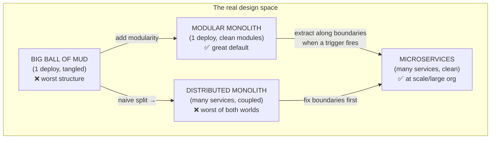
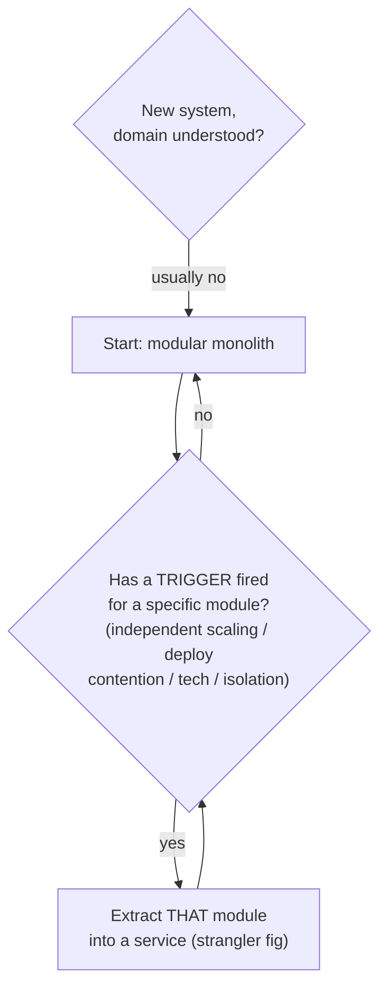

# Lesson 2.2.1 — The Monolith and the Modular Monolith

> Part 2: Architecture Fundamentals · Module 2.2: Architecture Styles · Difficulty: 🟡
>
> **Prerequisites:** [2.1.1 Cohesion/Coupling], [2.1.3 DDD/bounded contexts], [1.1.5 Tradeoffs].
> **Unlocks:** [2.2.3 Service-based/Microservices], [2.3 Hard Parts], [Part 12 Microservices & migration].

---

## 1. Learning Objectives

After this lesson you will be able to:

- Define a **monolith** precisely and separate the *deployment* property (single deployable) from the *structural* property (internal organization).
- Explain the **modular monolith** and why it's often the best starting architecture — capturing most microservice benefits without the distributed-systems cost.
- Articulate the real advantages and failure modes of monoliths (the "big ball of mud").
- Apply the **"monolith-first"** principle and know the *triggers* that justify moving toward services.
- Reason about why a monolith is a low-risk *two-way door* while premature microservices is a costly *one-way door*.

---

## 2. Motivation — The most consequential early decision

"Monolith or microservices?" is the architecture question engineers fixate on — usually choosing microservices for the wrong reasons (résumé, hype, or imagined scale). This lesson exists to dismantle the false binary. The truth `[BP]`:

- "Monolith" is **not** a slur, and "microservices" is **not** automatically better. Each is the *correct* choice under different constraints (1.1.5 — there is no best, only best-given-constraints).
- The real spectrum runs from **big ball of mud** → **modular monolith** → **services** → **microservices**, and the *modular monolith* is frequently the sweet spot.
- Choosing microservices prematurely is one of the most expensive mistakes in the industry: you pay the full distributed-systems tax (Parts 8–11) before you've earned any of the benefits.

Getting this decision right early — and knowing it's reversible in one direction but not the other — is among the highest-leverage things in system design. It directly sets up Part 12, where we go deep on decomposition and migration.

---

## 3. Theory — From first principles

### 3.1 What a monolith actually is

> A **monolith** is an application **deployed as a single unit** — one process / one deployable artifact, typically with one shared database. `[CS]`

The defining property is **deployment**, not size or quality: you build it, ship it, and run it as one thing. A monolith can be beautifully organized *or* a tangled mess — those are *structural* properties, independent of the deployment property. This separation is the key insight of the lesson:

- **Deployment axis:** single deployable (monolith) ↔ many independently deployable units (services).
- **Structure axis:** well-modularized (high cohesion, low coupling — 2.1.1) ↔ big ball of mud.

These are **orthogonal**. You can have a *modular monolith* (single deploy, clean internal modules) or a *distributed monolith* (many services, but so coupled they must deploy together — the worst of both worlds, 2.1.1 §13). Confusing the two axes is the root of most bad monolith-vs-microservices reasoning.

### 3.2 The big ball of mud (the monolith's failure mode)

The **big ball of mud** `[CONV]` is a monolith with **no enforced internal boundaries**: low cohesion, high coupling everywhere, no clear modules. Over time, rushed changes accumulate (1.2.2 accidental complexity) until any change risks breaking something unrelated, onboarding takes months, and velocity collapses. 

Crucially, this is a *structural* failure, **not** a consequence of being a monolith per se. Teams often blame "the monolith" and reach for microservices — but distributing a ball of mud just gives you a *distributed* ball of mud, now with network latency, partial failure, and no compiler to catch the broken boundaries. **The cure for a ball of mud is modularity, not necessarily distribution.**

### 3.3 The modular monolith

> A **modular monolith** is a single deployable whose internals are organized into **well-defined, loosely-coupled modules** — ideally aligned to **bounded contexts** (2.1.3) — with explicit boundaries and contracts between them. `[EMERGING]`/`[CONV]`

It keeps the *deployment simplicity* of a monolith while gaining much of the *structural discipline* that makes microservices attractive:
- Each module has high cohesion and a clear public interface; cross-module access goes through that interface, not into internals.
- Modules can have their *own* logical schema/tables (even sharing one physical DB) so data ownership is respected.
- Boundaries are enforced (by package structure, build rules, or fitness functions — 2.3.3) so they don't erode into mud.

Why it's often the right starting point:
- **In-process calls** instead of network calls: no serialization, no network latency, no partial-failure handling, **transactions still work normally** (one DB, ACID — Part 5). You avoid the entire distributed-systems tax.
- **Simple operations:** one thing to deploy, monitor, and debug; a stack trace spans the whole request.
- **Refactorable boundaries:** because modules are in-process, you can move a boundary cheaply (a two-way door). If you later need to extract a module into a service, clean module boundaries make that extraction straightforward.

The modular monolith is, in effect, **microservice-ready code without the microservice operational cost** — you get the cohesion/coupling benefits now and *option value* on distribution later.

### 3.4 Why monoliths are underrated (the advantages)

For most systems below very large scale/org size, a (modular) monolith *wins* on:
- **Simplicity & velocity early on** — no distributed plumbing; ship features fast.
- **Transactional consistency** — a single database means real ACID transactions across the whole request; no Sagas, no eventual-consistency headaches (Parts 10, 11).
- **Performance** — in-process calls are orders of magnitude faster than network calls (recall latency numbers, 1.1.3); no serialization overhead.
- **Operational simplicity** — one deployable to build, test, deploy, monitor; one place to look when debugging.
- **Lower cost** — fewer moving parts, less infrastructure, smaller ops burden.

### 3.5 When monoliths struggle (the real limits)

A monolith hits genuine ceilings — but note these are usually **organizational and scaling** limits, not "monoliths are bad":
- **Team scaling / deployment contention** — many teams committing to one deployable creates merge/coordination friction and a shared release cadence (you can't deploy your change without everyone's). This is often the *first real pain*, before any technical scaling limit.
- **Independent scaling** — you must scale the *whole* app even if only one module is hot (can't scale just the image-processing part). Wasteful at large scale.
- **Technology lock-in** — the whole app shares one language/runtime; you can't use a different stack for one component.
- **Blast radius** — a memory leak or crash in one module can take down the whole process (though good modularity limits *logical* blast radius).
- **Build/test times** — a huge monolith's CI can become painfully slow.

Most of these bite at **large scale and large org size** — which is exactly why the decision is contextual (§3.6).

### 3.6 Monolith-first and the triggers to decompose

The widely-endorsed principle `[BP]` (Fowler, Newman, and others): **start with a monolith** (ideally modular), and extract services only when you have a *concrete reason*. Why:
- You usually **don't yet understand the domain** well enough to draw correct service boundaries (2.1.3) — and wrong boundaries are a costly one-way door (distributed monolith). A monolith lets boundaries emerge as understanding grows, then you extract along clean seams.
- It defers the distributed-systems tax until the benefits actually justify it.

**Triggers that justify moving toward services** (any of these, *for a specific module*):
- A module needs to **scale independently** (very different load profile).
- Teams are **blocked by deployment contention** on that area.
- A module needs a **different technology** for good reasons.
- A module has a **different reliability/security profile** (isolation needed).
- The module's **boundary is now well-understood and stable** (safe to extract).

The mature pattern: **modular monolith → extract specific services when a trigger fires (strangler fig, 12.9)**, not "rewrite everything as microservices."

### 3.7 The reversibility asymmetry (tie to 1.1.1)

- **Monolith → services:** a relatively safe, *incremental* path — extract one module at a time along clean boundaries. The monolith is a **two-way door**.
- **Premature microservices → back to monolith:** rare and painful; you've spread data across services, built distributed plumbing, and coupled teams to it. Effectively a **one-way door** that's hard to reverse.

So when uncertain, the lower-risk default is the monolith: you preserve the option to decompose later, while avoiding the irreversible cost of premature distribution. This is the 1.1.1 one-way/two-way-door reasoning applied to the biggest structural decision you'll make.

---

## 4. Visual Intuition

### The two orthogonal axes (deployment × structure)

Vertical = structural quality; horizontal = degree of distribution. The good path is **up first (modularize), then right (distribute when justified)** — never right before up.

### Monolith-first decision flow

---

## 5. Real-World Analogy

**Building a house vs a neighborhood of houses.** A single well-organized house (modular monolith) has clearly separated rooms (modules) but shares one foundation, plumbing, and electrical system (one deployable, one database). It's cheap to build, easy to maintain, and you can walk between rooms instantly (in-process calls). A *badly* built single house with no walls and pipes running everywhere is the big ball of mud — but the fix is to add proper walls (modularity), not to bulldoze it into separate buildings. 

Separate houses (microservices) make sense when different families need independence — their own schedules, utilities, and renovations without disturbing neighbors (independent deployment, scaling, tech). But now you need roads between them, separate utility hookups, and mail delivery (network, infra, ops) — far more expensive and complex. And critically: it's easy to *subdivide* a well-planned property into separate lots later (monolith → services), but enormously costly to *merge* separate houses back into one once families have moved in and built their lives around the separation (premature microservices → back).

---

## 6. Industry Example

- **Monolith-first endorsements** `[BP]`: Martin Fowler ("MonolithFirst") and Sam Newman (*Building Microservices*) both explicitly recommend starting monolithic and extracting services as boundaries stabilize — and document teams that *failed* by starting with microservices on a poorly-understood domain.
- **High-profile re-consolidations** `[CONV]`: several publicly discussed cases (e.g., teams at various companies, and notably some Amazon Prime Video tooling that publicly described moving from a distributed/serverless design back to a more consolidated one for cost/performance) illustrate that microservices are not universally optimal and that consolidation is sometimes the right call. *(Treat specifics as representative of the general lesson, not a universal rule.)*
- **The modular-monolith resurgence** `[EMERGING]`: a growing industry movement (Shopify's well-known modular monolith being a frequently-cited example) argues that disciplined modular monoliths deliver most microservice benefits without the operational cost, for many companies.
- **DDD as the extraction guide** `[CONV]`: when teams *do* extract services, the successful ones cut along bounded contexts (2.1.3), confirming that the monolith's value is partly as a place to *discover* the right boundaries before committing.

---

## 7. Implementation Details — Building a good modular monolith

- **Organize by bounded context / business capability**, not technical layer. Top-level modules = `ordering`, `billing`, `inventory` — *not* `controllers`, `services`, `repositories`. (Avoids the layered-mud trap; aligns with 2.1.3.)
- **Enforce boundaries:** make each module expose a small public API; forbid other modules from importing its internals. Enforce with package/visibility rules and **fitness functions** (2.3.3) that fail the build on illegal cross-module dependencies.
- **Respect data ownership:** each module owns its tables; other modules go through the module's API, not its tables directly (even within one physical DB). This is what makes later extraction feasible.
- **Communicate in-process via interfaces** (or an in-process event bus for decoupling) — so the call sites look like service calls and could later become network calls.
- **Keep extraction in mind:** clean boundaries + data ownership = a module can be lifted into a service with minimal surgery when a trigger fires (strangler fig, 12.9).
- **Single database, real transactions:** lean into ACID while you can (Part 5) — it's a huge simplicity win the monolith gives you for free.

**Connection to the design framework (1.3.1):** in the HLD step, "modular monolith" is a perfectly strong answer for most problems, and a *more senior* one than reflexively drawing microservices. State the triggers that *would* make you decompose later (shows you understand the tradeoff).

---

## 8. Advantages (modular monolith)

- **Velocity & simplicity** early — no distributed plumbing.
- **ACID transactions** across the whole request (one DB).
- **Performance** — in-process calls, no serialization/network cost.
- **Operational simplicity** — one deployable to build/deploy/monitor/debug.
- **Lower cost** — minimal infrastructure and ops burden.
- **Option value** — clean modules can be extracted into services later (preserves the two-way door).

---

## 9. Disadvantages / Limits

- **Deployment contention** as many teams share one release cadence (often the first real pain).
- **No independent scaling** — scale the whole app, not just the hot module.
- **Technology lock-in** — one runtime/language for everything.
- **Process-level blast radius** — a crash/leak can affect the whole app.
- **Slow CI/build** at very large size.
- **Discipline required** — without enforced boundaries it can decay into a ball of mud.

---

## 10. When NOT to use a monolith

- **Already at large scale with many teams** where deployment contention and independent scaling are *current, concrete* pains — services may be justified from the start (rare for new systems).
- **Genuinely independent products** with little shared domain — separate services/apps may be natural.
- **Components with sharply different scaling/reliability/tech needs** known up front (e.g., a heavy ML inference component) — those may warrant their own service even early.
- But even then, the *rest* of the system is often best as a modular monolith; it's not all-or-nothing.

---

## 11. Common Mistakes

1. **Choosing microservices by default** (hype/résumé) without a trigger — paying the distributed tax for no benefit.
2. **Confusing "monolith" with "ball of mud"** — blaming the deployment model for a structural problem; distributing it makes it worse.
3. **Building a distributed monolith** — splitting into services that are still tightly coupled (must deploy together) — worst of both worlds (2.1.1).
4. **No enforced module boundaries** — letting the modular monolith decay into mud because nothing prevents cross-module reaching-in.
5. **Organizing the monolith by technical layer** instead of business capability — recreates low cohesion.
6. **Sharing tables across modules** — destroys data ownership and makes future extraction impossible.
7. **Premature decomposition** before the domain/boundaries are understood — drawing the seams wrong (a one-way door).

---

## 12. Interview Questions

**🟢 Easy**
- What defines a monolith — its size, or its deployment model? What's a modular monolith?
- Why is a "big ball of mud" not the same thing as "a monolith"?

**🟡 Medium**
- Explain "monolith-first." Why is it usually safer than starting with microservices for a new product?
- A team wants to split their ball-of-mud monolith into microservices to "fix the mess." What's wrong with that reasoning, and what would you advise instead?

**🔴 Hard**
- Design a modular monolith for an e-commerce system: name the modules, how boundaries are enforced, how data ownership works with one database, and how you'd extract one module into a service later when a trigger fires.
- Discuss the reversibility asymmetry between monolith→services and premature-microservices→monolith. How does this asymmetry shape your default choice under uncertainty? (Tie to one-way/two-way doors.)

**⚫ Staff+**
- An org of 200 engineers on one monolith has severe deployment contention but a poorly-modularized codebase. Lay out a strategy: do you go to microservices? What must happen *first*, what triggers guide extraction order, and how do you avoid creating a distributed monolith?
- Make the case that the modular monolith is the right default for *most* companies, and identify the specific signals (scale, org, domain maturity) that should flip the decision toward microservices. Where would you draw the line and why?

---

## 13. Production Pitfalls

- **The distributed monolith in production:** services that must be deployed in lockstep, with synchronous call chains so failures cascade — all the ops cost of microservices, none of the independence (Part 12).
- **Mud decay:** a modular monolith with unenforced boundaries that slowly becomes a ball of mud as deadlines pile up (fix: fitness functions, 2.3.3).
- **Shared-DB extraction trap:** discovering during a service extraction that modules read each other's tables, so the "service" can't actually own its data — a massive, risky data-untangling project.
- **Scaling the whole app for one hot path:** paying to scale the entire monolith because one module is CPU-heavy — a real cost signal that may justify extracting *that* module.

---

## 14. Optimization Techniques

- **Modularize before (or instead of) distributing** — fix structure with in-process boundaries first; distribute only the modules that need it.
- **Enforce boundaries with fitness functions / build rules** (2.3.3) so the modular monolith can't decay.
- **Give each module its own schema/tables** (logical data ownership) even within one physical DB — preserves the option to extract.
- **Extract via strangler fig** (12.9): peel off one well-bounded module into a service at a time, never a big-bang rewrite.
- **Let triggers, not hype, drive extraction** — extract a service only when independent scaling/deploy/tech/isolation demands it.
- **Profile to find the real bottleneck module** before deciding what (if anything) to extract.

---

## 15. Summary

A **monolith** is defined by its *deployment* (a single deployable, usually one database), **not** by its size or quality — and that deployment axis is **orthogonal** to the structural axis (well-modularized ↔ big ball of mud). The dreaded ball of mud is a *structural* failure cured by **modularity, not distribution** — distributing a tangled monolith just yields a *distributed* monolith, the worst of both worlds. The **modular monolith** — a single deployable with clean, enforced, bounded-context-aligned modules — is frequently the best starting architecture: it keeps in-process performance, real ACID transactions, and operational simplicity while gaining the cohesion/low-coupling discipline that makes microservices attractive, *and* it preserves the option to extract services later. Hence **monolith-first**: start monolithic, understand the domain, and extract specific services only when a concrete **trigger** fires (independent scaling, deployment contention, differing tech/reliability needs, stable boundary). This default is reinforced by a **reversibility asymmetry** — monolith→services is an incremental two-way door, while premature microservices→monolith is a costly one-way door. Choose distribution deliberately, not reflexively; modularize first, distribute when justified.

---

## 16. Revision Notes (flashcard-ready)

- **Q:** What defines a monolith? **A:** Single deployable unit (deployment property), not size/quality.
- **Q:** The two orthogonal axes? **A:** Deployment (mono ↔ distributed) and structure (modular ↔ ball of mud).
- **Q:** Cure for a big ball of mud? **A:** Modularity, not distribution (distributing it → distributed monolith).
- **Q:** Modular monolith? **A:** One deployable with clean, enforced, bounded-context-aligned modules.
- **Q:** Why is the modular monolith a great default? **A:** In-process speed + ACID + ops simplicity, with cohesion/low-coupling and option to extract later.
- **Q:** Monolith-first rationale? **A:** Domain not yet understood → wrong service boundaries are a costly one-way door; defer the distributed tax.
- **Q:** Triggers to extract a service? **A:** Independent scaling, deploy contention, different tech, different reliability/security, now-stable boundary.
- **Q:** Reversibility asymmetry? **A:** Monolith→services = incremental two-way door; premature microservices→monolith = painful one-way door.
- **Q:** First pain of a monolith, usually? **A:** Deployment contention across many teams (organizational, before technical scaling limits).

---

## 17. Further Reading + Knowledge-Graph Links

**Within this platform**
- **Previous:** [2.1.3 DDD] (bounded contexts = the module/extraction boundaries). **Next:** [2.2.2 Layered, Pipeline, Microkernel] (structural styles a monolith can use internally).
- **Builds toward:** [2.2.3 Service-based/Microservices/SOA], [2.3.1 Characteristics→Style], [Part 12 Microservices & strangler-fig migration].
- **Uses:** [2.1.1 Cohesion/Coupling] (modular vs mud), [1.1.1 One-way/two-way doors] (reversibility), [2.3.3 Fitness Functions] (enforcing boundaries).

**Foundational texts (synthesized)**
- Newman, *Building Microservices* — monolith-first, decomposition triggers, distributed monolith warning.
- Ford et al., *Software Architecture: The Hard Parts* — monolith vs distributed tradeoffs, granularity.
- Richards & Ford, *Fundamentals of Software Architecture* — monolithic vs distributed styles; big ball of mud.
- Fowler, "MonolithFirst" / "Microservice Premium" (essays) — the monolith-first argument.

**Concept tags:** `[CS]` monolith = single deployable; deployment vs structure axes · `[BP]` monolith-first, extract on triggers · `[CONV]` distributed monolith anti-pattern, DDD-guided extraction · `[EMERGING]` modular-monolith movement.
