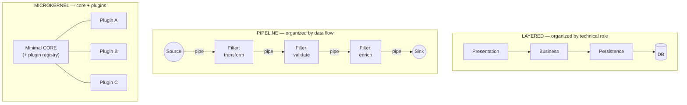
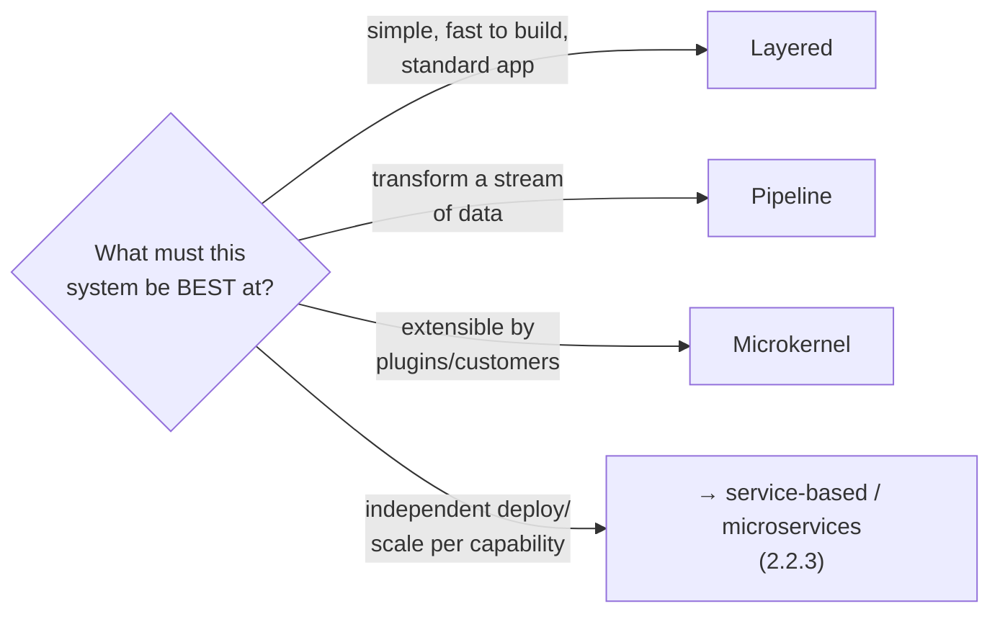

# Lesson 2.2.2 — Structural Styles: Layered, Pipeline, and Microkernel (Plugin)

> Part 2: Architecture Fundamentals · Module 2.2: Architecture Styles · Difficulty: 🟡
>
> **Prerequisites:** [2.1.1 Cohesion/Coupling], [2.1.2 Layering], [2.2.1 Monolith].
> **Unlocks:** [2.2.4 Event-Driven], [2.3.1 Characteristics→Style], [Part 9 Pipelines/Streaming].

---

## 1. Learning Objectives

After this lesson you will be able to:

- Describe three classic **monolithic deployment** styles — **layered**, **pipeline (pipes & filters)**, and **microkernel (plugin)** — their topologies, and what each optimizes for.
- Match each style to the **architecture characteristics** (1.2) it naturally favors (and the ones it sacrifices).
- Recognize these patterns at *every* scale — pipeline as a streaming data flow (Part 9), microkernel as a plugin/extension system.
- Choose a structural style for a problem and justify it from first principles.

---

## 2. Motivation — Styles are reusable structural solutions

An **architecture style** is a named, reusable way of arranging components and their interactions — a proven answer to "what's the overall shape?" Knowing the catalog matters because each style is a **pre-packaged set of tradeoffs** (1.1.5): pick the style whose strengths match your *driving characteristics* (1.2.4) and you start from a good place; pick wrong and you fight the structure forever.

This lesson covers the three foundational *monolithic* (single-deployable) styles. They're not mutually exclusive with the modular monolith (2.2.1) — they describe *how the internals are shaped*. They also recur fractally: the **pipeline** is how stream-processing systems (Part 9) and Unix shells are built; the **microkernel** is how IDEs, browsers, and extensible platforms work. Learn the shapes once and you'll spot them everywhere.

---

## 3. Theory — From first principles

### 3.1 Layered (n-tier) architecture — *recap and placement*

Covered in depth in 2.1.2; here's its place among the styles. **Layers stacked, dependencies pointing down** (presentation → business → persistence → DB), each layer a "layer of isolation."

- **Optimizes for:** simplicity, familiarity, separation of *technical* concerns, ease of staffing (team-per-layer). The default general-purpose style.
- **Sacrifices:** deployability/elasticity (it's monolithic and scales as a whole), and — without DIP (2.1.2) — evolvability, since the domain depends downward on infrastructure.
- **Failure modes:** the **architecture sinkhole** (requests passing straight through doing nothing) and decay into a layered ball of mud.
- **Use when:** small-to-medium apps, well-understood CRUD-ish domains, teams organized by technical specialty, and you value getting started fast over independent scaling.

> Layered organizes by **technical role**. The next two styles organize by **flow** (pipeline) and **extensibility** (microkernel) — different shapes for different goals.

### 3.2 Pipeline architecture (pipes and filters)

> **Pipeline architecture** structures processing as a sequence of independent **filters** (transformations) connected by **pipes** (channels that pass data one direction). `[CS]`

Each **filter** does one well-defined transformation and is **stateless and composable**; each **pipe** carries the output of one filter to the input of the next. Data flows in one direction through the chain. Classic filter roles:
- **Producer/source** — originates the stream.
- **Transformer** — maps input to output.
- **Tester/filter** — passes or discards based on a condition.
- **Consumer/sink** — terminates the flow (stores/displays).

**Why it's powerful:** filters are **highly cohesive** (one transformation each) and **loosely coupled** (they only know the pipe contract — data coupling, 2.1.1). You can **reorder, add, remove, or reuse** filters freely, and run them concurrently. This is the architecture of:
- **Unix shell pipelines** (`cat | grep | sort | uniq`) — the canonical example.
- **ETL / data pipelines** and **stream processing** (Part 9) — source → transform → enrich → sink.
- **Compilers** (lexer → parser → optimizer → codegen) and **request middleware chains**.

- **Optimizes for:** modularity, reusability, composability, testability of each stage, and natural parallelism/throughput.
- **Sacrifices:** it's a poor fit for problems that aren't a *linear flow* (complex branching/interactive logic feels forced); error handling across stages is trickier; end-to-end latency is the sum of stages.
- **Use when:** the problem is fundamentally **data flowing through transformations** — pipelines, stream processing, ETL, log processing, media transcoding.

### 3.3 Microkernel (plugin) architecture

> **Microkernel architecture** separates a minimal **core system** from optional **plug-in components** that add features. The core provides the basic, general functionality and the *registry/extension points*; plug-ins provide specialized, independent capabilities. `[CS]`

Two parts:
- **Core system** — the minimal functionality common to all use cases, plus the mechanism to discover, register, and invoke plug-ins. It should know as little as possible about specific plug-ins.
- **Plug-in components** — independent, ideally decoupled modules that extend the core. They register against the core's extension points and (ideally) don't depend on each other.

The contract between core and plug-ins (the plug-in API/registry) is the crucial design artifact. Done well, you can add capabilities **without modifying the core** (Open/Closed Principle, 2.4.1).

This is the architecture of **extensible products**:
- **IDEs and editors** (VS Code, Eclipse, IntelliJ) — small core, everything else a plugin.
- **Browsers** with extensions; **CMSs** with plugins; **CI tools** with plugin ecosystems.
- **Business-rules engines** where each rule/workflow is a plug-in over a generic engine — a common enterprise use.

- **Optimizes for:** **extensibility** and **customization** — third parties (or different customers) add features without touching the core; great for products with a stable core but variable, evolving feature set.
- **Sacrifices:** the core's **extension API is hard to design and to change** (it's a one-way door once plug-ins depend on it); plug-in isolation/versioning is tricky; not a fit when the system isn't naturally "core + variable features."
- **Use when:** you need a customizable platform, support third-party/customer extensions, or have many feature variations over a common base.

### 3.4 Styles as tradeoff packages (the unifying view)

Each style is a **bundle of architecture characteristics** (1.2) you get "for free" with that shape — and a corresponding set you give up:

| Style | Naturally strong | Naturally weak | Shape organizes by |
|---|---|---|---|
| **Layered** | simplicity, familiarity, separation of concerns | independent scaling, agility (without DIP) | technical role |
| **Pipeline** | modularity, reusability, throughput/parallelism, testable stages | non-linear logic, cross-stage error handling, end-to-end latency | data flow |
| **Microkernel** | extensibility, customization, feature isolation | core-API evolvability, cross-plugin coordination | extensibility (core + plugins) |

This is why style selection (2.3.1) starts from the **driving characteristics**: name what the system must be best at, then pick the style whose "naturally strong" column matches. You can also **combine** styles (a microkernel core whose plug-ins are pipelines; a layered app with a pipeline subsystem) — they're composable shapes, not exclusive religions.

### 3.5 These are mostly *monolithic* (single-deployment) styles

Layered, pipeline, and microkernel are typically realized as **single deployables** (2.2.1) — they describe internal structure, not distribution. (Pipelines *can* be distributed — that's essentially stream processing, Part 9 — but the classic pattern is in-process.) The *distributed* styles — service-based, microservices, event-driven, space-based — come next (2.2.3–2.2.5). Keeping this distinction straight prevents the common error of conflating "layered" (a structure) with "monolith" (a deployment) and "microservices" (a distribution).

---

## 4. Visual Intuition

### The three structural shapes

### Picking a style from the driving characteristic

---

## 5. Real-World Analogy

- **Layered** = a **multi-story office building**: reception on the ground floor, departments stacked above, each floor relying on the one below; you generally enter at the bottom and go up. Clear, familiar, but you renovate the whole building to add capacity.
- **Pipeline** = a **car assembly line**: each station does one job (weld, paint, install seats) and passes the car to the next. Stations are independent and reorderable; you can add a station or run several lines in parallel — but it only works for things that move *linearly* down the line.
- **Microkernel** = a **smartphone**: a minimal OS core (calls, settings, app runtime) plus apps you install to add capabilities. The phone works without any apps, and you customize it by adding plug-ins (apps) without modifying the OS. The catch: if the OS changes its app API, every app may break — so that core contract is sacred.

---

## 6. Industry Example

- **Pipeline everywhere** `[CONV]`: Unix pipes, compiler stages, and especially **stream-processing** systems (Kafka Streams, Flink-style topologies — Part 9) and **ETL/data pipelines** are pipeline architecture at scale; media-transcoding pipelines (source → decode → transform → encode → store) are a documented pattern at video platforms (Part 18).
- **Microkernel products** `[CONV]`: **VS Code, Eclipse, IntelliJ** (editor core + extensions), **browsers** with extension APIs, **WordPress/CMS** plugins, and **CI/CD tools** (Jenkins-style plugin ecosystems) — all minimal-core + plugin platforms. Enterprise **rules/workflow engines** use plug-ins for individual rules over a generic core.
- **Layered ubiquity** `[CONV]`: the default for countless business applications and the structure most frameworks (MVC web frameworks) nudge you toward.
- **Style combination** `[BP]`: Richards & Ford note styles are routinely combined (e.g., a layered app containing a pipeline subsystem, or a microkernel whose plug-ins are internally layered) — choose per subsystem, not dogmatically for the whole system.

---

## 7. Implementation Details — Applying each style

**Pipeline:**
- Make filters **stateless** and single-purpose; define a clear **pipe contract** (the data shape passed between stages) — keep it to weak connascence (Type/Name, 2.1.1).
- Decide pipe semantics: in-process (function composition / iterators) vs message-based (queues — Part 9) for distributed/async pipelines.
- Handle errors explicitly per stage (dead-letter / error channel — Part 9) since a failed filter shouldn't silently drop the flow.
- Reuse and reorder filters; this composability is the payoff — design filters to be context-independent.

**Microkernel:**
- Design the **plug-in contract** (registration, lifecycle, extension points) carefully — it's a one-way door once plug-ins depend on it (version it; treat it like a public API).
- Keep the **core minimal** — only truly common functionality + the registry; resist letting feature logic creep into the core.
- Decide **plug-in isolation**: same process (simple, but a bad plug-in can crash the core) vs isolated processes/sandboxing (safer, more complex). Browsers/IDEs lean toward isolation for untrusted plug-ins (security, Part 15).
- Avoid **plug-in interdependencies** (they undermine independence) — route interactions through the core.

**Layered:** (see 2.1.2) keep layers closed for isolation; apply DIP so the domain doesn't depend on infrastructure; avoid sinkhole pass-throughs.

**Design-framework tie (1.3.1):** in the HLD step, naming a style ("this is naturally a pipeline because it's a stream of transformations") and justifying it from the driving characteristic is a strong, senior move.

---

## 8. Advantages (by style)

- **Layered:** simple, familiar, easy to staff and start; good separation of technical concerns.
- **Pipeline:** highly modular/reusable filters; easy to test stages in isolation; natural concurrency and throughput; trivially extensible by inserting filters.
- **Microkernel:** add features without touching the core (OCP); supports customization and third-party/customer extensions; feature isolation.

---

## 9. Disadvantages (by style)

- **Layered:** monolithic scaling, sinkhole risk, weak agility/independent deployability; domain-on-infra coupling without DIP.
- **Pipeline:** poor fit for non-linear/interactive logic; cross-stage error handling and transactions are awkward; end-to-end latency = sum of stages.
- **Microkernel:** the core API is hard to design and costly to change; plug-in versioning/isolation complexity; not applicable unless the problem is "core + variable features."

---

## 10. When NOT to use each

- **Pipeline:** when the logic is highly branching, stateful, or interactive (not a clean linear flow) — forcing it into pipes is awkward.
- **Microkernel:** when there's no meaningful "minimal core + optional extensions" split, or when you don't need extensibility (the plug-in machinery is pure overhead).
- **Layered:** when you need independent scaling/deployment per capability (→ services, 2.2.3) or strong domain protection (→ Hexagonal/Clean, 2.1.2) more than you need familiarity.

---

## 11. Common Mistakes

1. **Forcing every system into layered** by default, even when it's naturally a pipeline or needs extensibility.
2. **Pipeline filters that are stateful or know about each other** — destroys composability and reuse.
3. **A bloated microkernel core** — feature logic creeping into the core instead of plug-ins, defeating extensibility.
4. **Unstable plug-in API** — changing the core contract after plug-ins depend on it, breaking the ecosystem (it's a one-way door).
5. **Ignoring cross-stage error handling** in pipelines (silent data loss).
6. **Conflating style with deployment** — thinking "layered = monolith" or "pipeline = distributed"; style is internal shape, deployment is separate (2.2.1).
7. **Dogmatic single-style systems** — refusing to combine styles where subsystems have different needs.

---

## 12. Interview Questions

**🟢 Easy**
- Describe pipeline (pipes & filters) architecture and give a real example.
- What are the two parts of a microkernel architecture, and what does each do?

**🟡 Medium**
- Why are pipeline filters easy to reuse and test? What property of the filters makes this possible (tie to cohesion/coupling)?
- For an extensible product (e.g., an IDE or a rules engine), why is microkernel a good fit, and what's the hardest part to get right?

**🔴 Hard**
- Design a media-transcoding system as a pipeline: name the filters, the pipe contracts, where you'd parallelize, and how you'd handle a failing stage. When would a pipeline be the *wrong* choice here?
- You're building a platform that customers extend with custom workflows. Choose a style, design the core/plug-in contract, decide plug-in isolation (same-process vs sandboxed), and explain the tradeoffs and the one-way-door risk in the API.

**⚫ Staff+**
- Show how you'd combine styles in one system: e.g., a microkernel core whose plug-ins are internally pipelines, inside a layered/modular-monolith deployment. Justify each choice from the driving characteristics, and explain how you'd keep the combination coherent (1.2.4).
- Critique "always use layered." Walk through how the *driving characteristic* should select the structural style, and give two systems where layered is clearly the wrong default and what you'd choose instead.

---

## 13. Production Pitfalls

- **Pipeline backpressure & error propagation:** in distributed pipelines, a slow/failing stage backs up the whole flow; without backpressure (Part 9/3) and dead-letter handling, you get data loss or memory blowups.
- **Microkernel plug-in blast radius:** an in-process plug-in with a memory leak or crash takes down the core (the IDE freezes); production-grade platforms isolate untrusted plug-ins (security + reliability, Parts 15, 11).
- **Frozen microkernel API:** the core team can't evolve the platform because every change breaks plug-ins — the API became an unmovable one-way door (versioning discipline needed).
- **Layered sinkhole overhead:** chains of pass-through layers adding latency and code with no value, discovered under performance pressure.

---

## 14. Optimization Techniques

- **Pipeline:** parallelize independent filters; batch within a stage to trade latency for throughput (1.1.3); use message queues + backpressure for distributed, resilient pipes (Part 9).
- **Microkernel:** keep the core tiny; version the plug-in API and support multiple versions during migration; sandbox/limit plug-ins for isolation; lazy-load plug-ins for startup performance.
- **Layered:** keep layers closed for isolation, apply DIP (2.1.2), and eliminate sinkhole pass-throughs.
- **General:** select style per subsystem from its driving characteristics (2.3.1); combine styles deliberately; enforce the chosen structure with fitness functions (2.3.3).

---

## 15. Summary

An **architecture style** is a reusable structural shape that comes pre-loaded with a set of tradeoffs, so you choose the style whose strengths match your **driving characteristics** (1.2.4). The three classic *monolithic* (single-deployable) styles organize the system differently: **layered** organizes by **technical role** (simple, familiar, but monolithic-scaling and weak agility); **pipeline (pipes & filters)** organizes by **data flow** through stateless, composable filters (excellent modularity, reuse, and throughput — the shape of Unix pipes, compilers, ETL, and stream processing — but a poor fit for non-linear logic); and **microkernel (plugin)** organizes by **extensibility**, a minimal core plus plug-ins (great for customizable/extensible products like IDEs and rules engines, but the core's extension API is a costly one-way door). These styles describe *internal structure*, distinct from *deployment* (monolith, 2.2.1) and *distribution* (services, 2.2.3–2.2.5), and they're **composable** — real systems mix them per subsystem. Master the shapes and you'll recognize them at every scale, and you'll select structure deliberately from first principles rather than defaulting to layered for everything.

---

## 16. Revision Notes (flashcard-ready)

- **Q:** What is an architecture style? **A:** A reusable structural shape that bundles a specific set of tradeoffs.
- **Q:** Layered organizes by…? **A:** Technical role (presentation/business/persistence); simple but monolithic-scaling.
- **Q:** Pipeline organizes by…? **A:** Data flow — stateless composable filters connected by one-way pipes.
- **Q:** Pipeline's superpower and weakness? **A:** Reusable/composable/parallel stages; bad for non-linear/interactive logic.
- **Q:** Microkernel's two parts? **A:** Minimal core (+ plugin registry) and independent plug-ins.
- **Q:** Microkernel optimizes for / hardest part? **A:** Extensibility/customization; designing and evolving the plug-in API (one-way door).
- **Q:** Real microkernel examples? **A:** IDEs (VS Code/Eclipse), browsers w/ extensions, CMS plugins, rules engines.
- **Q:** Style vs deployment vs distribution? **A:** Internal shape (style) ≠ single-deployable (monolith) ≠ many services (distribution).
- **Q:** Can styles combine? **A:** Yes — choose per subsystem; e.g., microkernel core with pipeline plug-ins.

---

## 17. Further Reading + Knowledge-Graph Links

**Within this platform**
- **Previous:** [2.2.1 Monolith & Modular Monolith]. **Next:** [2.2.3 Service-based, Microservices, SOA] (the distributed styles).
- **Builds on:** [2.1.2 Layering] (detail on the layered style), [2.1.1 Cohesion/Coupling] (why pipeline filters compose).
- **Recurs in:** [Part 9 Messaging & Streaming] (pipeline as distributed stream processing), [2.4.1 SOLID] (microkernel ↔ Open/Closed), [2.3.1 Characteristics→Style selection].

**Foundational texts (synthesized)**
- Richards & Ford, *Fundamentals of Software Architecture* — layered, pipeline, microkernel styles and their characteristic ratings; combining styles.
- Buschmann et al., *Pattern-Oriented Software Architecture* — pipes-and-filters and microkernel as architectural patterns.
- Kleppmann, *DDIA* — batch/stream pipelines (the distributed realization of the pipeline style; Part 9).

**Concept tags:** `[CS]` pipes-and-filters, microkernel/plugin, layered styles · `[BP]` select style from driving characteristics, combine styles per subsystem · `[CONV]` pipeline in stream processing/ETL, microkernel in IDEs/CMS/rules engines.
