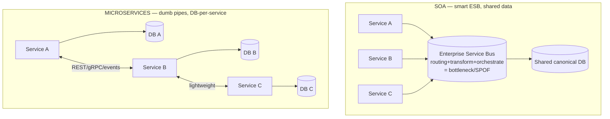
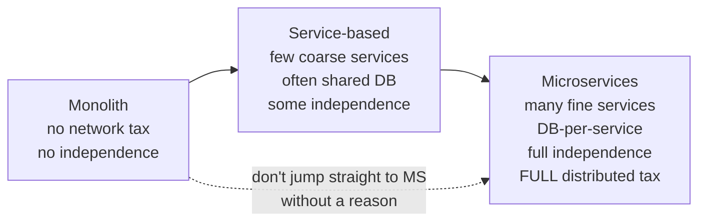

# Lesson 2.2.3 — Distributed Styles: Service-Based, Microservices, and SOA

> Part 2: Architecture Fundamentals · Module 2.2: Architecture Styles · Difficulty: 🟡🔴
>
> **Prerequisites:** [2.2.1 Monolith], [2.2.2 Structural Styles], [2.1.3 DDD].
> **Unlocks:** [2.2.4 Event-Driven], [2.3 Hard Parts], [Part 12 Microservices], [Part 13 Cloud Native].

---

## 1. Learning Objectives

After this lesson you will be able to:

- Place **SOA**, **service-based architecture**, and **microservices** on a single spectrum of distribution and granularity.
- Identify the **defining characteristics of microservices** (small, independently deployable, owns its data, bounded-context aligned) and why "independent deployability" is the core idea.
- Explain why **service-based architecture** is an underrated middle ground (coarse-grained services, often a shared DB) that avoids many microservice pitfalls.
- Understand **why SOA fell out of favor** (the ESB, shared everything) and what microservices reacted against.
- Reason about the **costs** every distributed style imposes (the distributed-systems tax) and when those costs are justified.

---

## 2. Motivation — Granularity is the whole game

Once you decide to *distribute* a system into separately-deployed pieces (2.2.1 said: only when triggers justify it), the next question is **how big should the pieces be?** That single dimension — **granularity** — separates the three distributed styles:

- **SOA** (Service-Oriented Architecture): coarse, enterprise-wide services coordinated by heavy middleware (the ESB). The 2000s answer.
- **Microservices:** fine-grained, single-purpose, independently deployable services, each owning its data. The 2010s reaction to SOA.
- **Service-based:** a pragmatic middle — a *few* coarse-grained "domain services," often sharing a database and infrastructure. Less hype, fewer pitfalls.

Getting granularity right is the central skill: too coarse and you lose independence; too fine and the *integration* coupling and operational overhead explode (the distributed monolith, 2.1.1). This lesson frames the spectrum so you can choose deliberately; Part 12 goes deep on building and operating microservices specifically.

---

## 3. Theory — From first principles

### 3.1 The distribution spectrum

```
Monolith ── Modular Monolith ── Service-Based ── Microservices
(1 deploy)   (1 deploy,         (few coarse        (many fine
              clean modules)     services,           services,
                                 maybe shared DB)    DB-per-service)
                  ↑ no network          ↑ some network      ↑ all network
              fewer, cheaper boundaries  ──────────────►  more, costlier boundaries
```

Moving right: more **independent deployability/scalability**, but more **network calls, partial failure, eventual consistency, and operational complexity** (the distributed tax). The art is stopping at the right point for your constraints (1.2.4).

### 3.2 SOA (Service-Oriented Architecture) — what came before

> **SOA** organizes the enterprise into reusable **services** that communicate through a central **Enterprise Service Bus (ESB)**, which handles routing, transformation, orchestration, and protocol mediation. `[CS]`

SOA's intent was good: reuse, enterprise-wide integration, break down silos. But the common implementation had fatal flaws `[CONV]`:
- **The ESB became a centralized bottleneck and single point of failure** — business logic and orchestration crept into the bus, making it a complex, fragile, hard-to-change monolith *in the middle*.
- **Shared everything** — shared databases, shared canonical data models across services → high coupling (services couldn't evolve independently).
- **Heavyweight protocols** — SOAP/WS-* ceremony.
- **Coarse, enterprise-scoped services** with unclear ownership.

The net effect: services that were supposed to be independent were coupled through the ESB and shared data, so you got distribution's costs without its independence. **Microservices were largely a deliberate reaction against SOA's ESB and shared-everything model.**

### 3.3 Microservices — the defining characteristics

> A **microservice** is a small, **independently deployable** service organized around a **business capability** (bounded context), that **owns its own data** and communicates with others only through **explicit contracts** (APIs/events) — with **no centralized orchestrator** and **decentralized governance**. `[CS]`

The defining properties (Newman; Fowler/Lewis) `[CONV]`:
1. **Independent deployability** — *the* core idea. You can deploy one service without coordinating with others. This is what enables team autonomy and fast, safe releases. If you *can't* deploy independently, you don't have microservices (you have a distributed monolith).
2. **Database-per-service** — each service owns its data; **no shared database**. Others access it only via its API. This is what gives true decoupling (and what forces eventual consistency + Sagas, Parts 10, 11).
3. **Bounded-context aligned** (2.1.3) — service boundaries follow business capabilities, giving high cohesion.
4. **Smart endpoints, dumb pipes** — logic lives in the services; communication uses simple mechanisms (REST/gRPC/lightweight messaging), **not** a smart ESB. (The direct anti-SOA stance.)
5. **Decentralized governance & data** — teams choose their own tech where sensible; no enforced canonical model.
6. **Designed for failure** — the network is unreliable, so resilience (timeouts, retries, circuit breakers — Part 11) is mandatory.

Microservices optimize for **independent deployability, scalability, evolvability, fault isolation, and team autonomy** — at the cost of **operational complexity and distributed-systems hardness** (Parts 8–11). They're the right choice at **large scale and large org size**, when those benefits outweigh the substantial tax.

### 3.4 Service-based architecture — the pragmatic middle

> **Service-based architecture** is a distributed style with a **small number of coarse-grained "domain services"** (e.g., 4–12, not hundreds), which **often share a single database** and infrastructure, and typically have **no ESB**. `[CONV]`

It's a hybrid that keeps many monolith benefits while gaining *some* distribution benefits:
- **Coarse services** (a whole "Order" domain, not 20 tiny services) → fewer boundaries, less inter-service chatter, simpler operations.
- **Shared database (often)** → you can still use real ACID transactions in many cases, avoiding the Saga/eventual-consistency tax. (The cost: shared-DB coupling, 2.1.1 — but contained to a few services.)
- **No ESB** → avoids SOA's central bottleneck.
- Services can usually be **deployed independently** (the main win over a monolith) and scaled somewhat independently.

Why it's underrated `[BP]`: it captures **most of the practical benefit (independent deployment of coarse domains, some scaling)** while **avoiding the hardest microservice problems** (distributed transactions, hundreds of services to operate, pervasive eventual consistency). For many mid-sized systems, service-based is the **sweet spot** between modular monolith and full microservices — yet it gets far less hype than microservices.

### 3.5 The distributed-systems tax (paid by all distributed styles)

The moment a call crosses a network boundary (2.1.1 §3.6 — connascence with bad locality), you inherit `[CS]`:
- **Network latency & unreliability** — calls are ~1000× slower than in-process (1.1.3) and can fail/partition (Part 8).
- **Partial failure** — some services up, some down; you must handle every call failing (Part 11: timeouts, retries, circuit breakers).
- **No distributed transactions (cheaply)** — cross-service consistency needs Sagas/eventual consistency (Parts 10, 11), not ACID.
- **Operational complexity** — many deployables to build, deploy, monitor; you *need* service discovery, API gateways, distributed tracing, centralized logging (Parts 12, 13, 16).
- **Data consistency & duplication** — data spread across service-owned stores; queries spanning services need composition or CQRS (Part 12).
- **Versioning & contract management** — services evolve independently, so contracts must be versioned and backward-compatible (Part 4.3, Part 12).

This tax is *fixed overhead* you pay regardless of benefit — which is exactly why 2.2.1 says don't distribute until a trigger justifies it, and why the *number* of services multiplies the tax (favoring coarser granularity unless fine granularity is earned).

### 3.6 Choosing granularity (the key decision)

Granularity is itself a tradeoff (1.1.5):
- **Too coarse** (toward monolith): lose independent deployability/scaling; large services become mini-monoliths.
- **Too fine** (toward nano-services): every business operation spans many services → chatty calls, high cross-boundary connascence, hard-to-trace failures, operational overhead per service — the **distributed monolith** if they're also coupled.

Heuristics `[BP]`: align to **bounded contexts/aggregates** (2.1.3 — things that change together stay together); start **coarser** and split only when a service has a *concrete* reason to split (independent scaling, team ownership, differing reliability); the **right size is "as big as cohesion allows, as small as independence requires."** When in doubt, fewer, coarser services beat many tiny ones.

---

## 4. Visual Intuition

### SOA vs Microservices (the ESB is the key difference)



### The granularity spectrum and its tax



---

## 5. Real-World Analogy

**Organizing a company's operations.**
- **SOA** is like routing *every* inter-department request through one central operations office (the ESB) that also makes decisions and holds all the records. It promised coordination but became a bureaucratic bottleneck — nothing moves without going through the central office, and changing how the office works is terrifying because everything depends on it.
- **Microservices** is like fully autonomous teams, each owning its own files (database-per-service), making its own decisions, and talking to other teams directly through simple, agreed protocols (smart endpoints, dumb pipes). Highly autonomous and scalable — but now you need company-wide directory services, clear contracts, and a lot of coordination infrastructure, and a request that touches five teams can fail in five places.
- **Service-based** is the pragmatic middle: a handful of solid departments (coarse services) that still share some common records (shared DB) and infrastructure, deploy on their own schedules, but don't fragment into dozens of tiny teams. Less overhead, less autonomy — often the right size for a mid-sized organization.

---

## 6. Industry Example

- **The SOA → microservices shift** `[CONV]`: the microservices movement (Netflix, Amazon, and the Fowler/Lewis articulation) was explicitly a reaction to SOA's ESB-centric, shared-everything model — replacing the smart bus with smart endpoints and dumb pipes, and shared DBs with database-per-service.
- **Amazon's "two-pizza teams" + service ownership** `[CONV]`: a widely-cited example of aligning small autonomous teams to independently-deployable services (Conway's Law, 2.1.3) — independent deployability as an organizational enabler.
- **Database-per-service in practice** `[CONV]`: the rule that microservices don't share a database is foundational guidance (Newman); violating it (a shared DB across "microservices") is the classic way teams accidentally build a distributed monolith.
- **Service-based pragmatism** `[BP]`: Richards & Ford explicitly present service-based architecture as a lower-risk distributed style that retains transactional integrity (shared DB) and is easier to adopt than full microservices — recommended for many organizations not at hyperscale.

---

## 7. Implementation Details — Choosing and structuring

**Decide *whether* to distribute** (2.2.1): only on concrete triggers. If you distribute:

**Pick granularity from constraints:**
- Few teams, mid scale, want independent deploys, value transactional simplicity → **service-based** (coarse domain services, possibly shared DB).
- Large org, large scale, need per-capability independent scaling/deploy/tech, can afford the ops investment → **microservices** (DB-per-service, bounded-context aligned).
- Avoid **SOA-style ESB** centralization; prefer smart endpoints + dumb pipes regardless.

**For microservices specifically (preview of Part 12):** database-per-service; communicate via API (sync) and events (async); add the *required* infrastructure — API gateway (3.3, 12.6), service discovery (12.6), distributed tracing + centralized logging (Part 16), resilience patterns (Part 11), CI/CD per service (Part 13). Manage cross-service consistency with Sagas/outbox (Part 11) and cross-service queries with API composition/CQRS (Part 12).

**Migration, not big bang:** evolve **modular monolith → service-based → microservices** incrementally via the strangler fig (12.9), extracting one service at a time along clean bounded-context seams. Never rewrite a working monolith into microservices wholesale.

**Design-framework tie (1.3.1):** in the HLD step, name the style *and* its granularity, justify from the driving characteristics, and explicitly acknowledge the distributed tax you're accepting — a senior signal.

---

## 8. Advantages (of distributed styles, strongest at microservices)

- **Independent deployability** → team autonomy, fast/safe releases (the core win).
- **Independent scalability** → scale only the hot service (cost-efficient at scale).
- **Fault isolation** → one service failing needn't take down others (with bulkheads, Part 11).
- **Technology heterogeneity** → right tool per service.
- **Evolvability** → small services are easier to understand and replace.
- **Service-based specifically:** much of the above with far less operational tax and retained transactional simplicity.

---

## 9. Disadvantages / Costs

- **The full distributed-systems tax** (§3.5): latency, partial failure, eventual consistency, operational complexity, contract versioning.
- **Operational burden** — many deployables; requires mature CI/CD, observability, and platform investment (Parts 13, 16).
- **Hard to get boundaries right** — wrong granularity → distributed monolith (costly one-way door).
- **Data management is hard** — no easy cross-service transactions or joins.
- **SOA specifically:** ESB bottleneck/SPOF, shared-data coupling, heavyweight protocols.

---

## 10. When NOT to use each

- **Microservices:** small teams, early-stage products, undefined domain, or no platform/ops maturity — the tax dwarfs the benefit (use modular monolith, 2.2.1).
- **SOA (ESB-centric):** essentially deprecated as a *new* choice; avoid centralizing logic in a bus. (Integration buses still exist for legacy/enterprise integration, but not as the default for new systems.)
- **Service-based:** when you genuinely need fine-grained independent scaling/tech per capability (then go microservices) — or when a modular monolith suffices (then don't distribute at all).

---

## 11. Common Mistakes

1. **Microservices without independent deployability** (shared DB, lockstep deploys) → **distributed monolith** (the cardinal sin).
2. **Sharing a database across microservices** → re-coupling; destroys the core benefit.
3. **Too-fine granularity** (nano-services) → chatty calls, untraceable failures, ops overhead per service.
4. **Recreating SOA** — putting orchestration/logic in a central bus/gateway (smart pipes) instead of smart endpoints.
5. **Distributing a poorly-understood domain** → wrong boundaries that are expensive to fix.
6. **Skipping the platform investment** (no tracing, discovery, CI/CD) then drowning in operational pain.
7. **Big-bang rewrite** monolith→microservices instead of incremental strangler-fig extraction.
8. **Ignoring the tax** — assuming microservices are "just better" without accounting for latency, consistency, and ops cost.

---

## 12. Interview Questions

**🟢 Easy**
- What is the single most defining characteristic of a microservice? Why does it matter?
- Why don't microservices share a database?

**🟡 Medium**
- Place SOA, service-based, and microservices on a spectrum. What distinguishes each, and what did microservices react against in SOA?
- What is the "distributed-systems tax," and name four specific costs it includes.

**🔴 Hard**
- A mid-sized company with ~30 engineers wants "microservices." Argue for service-based architecture instead, and specify when you'd revisit and move to full microservices.
- Explain how wrong service granularity produces a distributed monolith. How do bounded contexts and aggregates (2.1.3) guide you to the right size, and why is getting it wrong a one-way door?

**⚫ Staff+**
- Design a migration path from a monolith to microservices for a system under active development: sequencing (modular monolith → service-based → microservices), how you'd choose extraction order, the platform investments required first, and how you'd avoid both a distributed monolith and a big-bang rewrite.
- Defend the claim that "most companies should not use microservices." Identify the specific organizational and scale signals that justify the distributed tax, and contrast with service-based and modular-monolith alternatives. Where exactly is the line?

---

## 13. Production Pitfalls

- **Distributed monolith in production:** services that deploy in lockstep with synchronous call chains; a single slow service cascades failures system-wide, and "independent" teams are actually blocked on each other (Part 11, Part 12).
- **Shared-DB time bomb:** "microservices" quietly reading each other's tables; a schema change breaks distant services with no compile-time warning.
- **Observability gap:** distributing without distributed tracing/centralized logs → incidents become unsolvable (you can't follow a request across services) — long MTTR (1.2.1, Part 16).
- **Saga/consistency bugs:** cross-service operations that aren't transactional, leaving the system in partially-updated states without proper Saga compensation (Part 11).
- **Cost surprise:** cross-service/cross-AZ traffic and per-service infrastructure inflating the bill (1.2.3) beyond the monolith it replaced.

---

## 14. Optimization Techniques

- **Right-size with bounded contexts/aggregates** (2.1.3): "as big as cohesion allows, as small as independence requires"; start coarse.
- **Prefer service-based** until fine-grained independence is genuinely needed — minimizes the tax.
- **Smart endpoints, dumb pipes** — keep logic in services; avoid ESB-style central orchestration.
- **Invest in the platform first** (CI/CD, service discovery, API gateway, tracing, logging) before proliferating services (Parts 13, 16).
- **Async + events** to decouple services and reduce synchronous failure chains (Part 9); resilience patterns for the rest (Part 11).
- **Strangler-fig migration** (12.9) and **fitness functions** (2.3.3) to enforce no-shared-DB and dependency rules as you go.

---

## 15. Summary

The distributed architecture styles sit on a single **granularity spectrum**: **SOA** (coarse, enterprise services coordinated by a smart **ESB** with shared data — now largely deprecated due to the bus becoming a bottleneck and the shared-everything coupling), **microservices** (fine-grained, **independently deployable**, **database-per-service**, bounded-context-aligned, "smart endpoints/dumb pipes," designed for failure — the deliberate reaction to SOA), and **service-based** (a pragmatic middle of a *few coarse* domain services, often sharing a database, no ESB — capturing independent deployment and some scaling while *avoiding* the hardest microservice problems). **Independent deployability** is the defining idea of microservices; if you can't deploy a service alone, you have a distributed monolith. Every distributed style pays the **distributed-systems tax** (network latency/unreliability, partial failure, no cheap transactions, operational complexity, contract versioning), which is *fixed overhead* multiplied by the number of services — so the central skill is choosing **granularity**: align to bounded contexts/aggregates, start coarse, and split only on concrete triggers. For most organizations not at hyperscale, **modular monolith or service-based** is the right call; full microservices earn their tax only at large scale and org size, reached **incrementally** (strangler fig), never via big-bang rewrite.

---

## 16. Revision Notes (flashcard-ready)

- **Q:** The three distributed styles by granularity? **A:** SOA (coarse + ESB) → service-based (few coarse, often shared DB) → microservices (many fine, DB-per-service).
- **Q:** Defining characteristic of microservices? **A:** Independent deployability (no shared DB, no lockstep deploys).
- **Q:** Why did microservices react against SOA? **A:** ESB bottleneck + shared everything → coupling; replaced by smart endpoints/dumb pipes + DB-per-service.
- **Q:** Service-based architecture in one line? **A:** A few coarse domain services, often sharing a DB, no ESB — independent deploy with less distributed tax.
- **Q:** The distributed-systems tax? **A:** Network latency/unreliability, partial failure, no cheap transactions, ops complexity, contract versioning.
- **Q:** Right service size heuristic? **A:** As big as cohesion allows, as small as independence requires; align to bounded contexts; start coarse.
- **Q:** Microservices without independent deploy = ? **A:** Distributed monolith (worst of both worlds).
- **Q:** Migration approach? **A:** Modular monolith → service-based → microservices, incrementally via strangler fig — never big-bang.
- **Q:** When are microservices justified? **A:** Large scale + large org + platform maturity, where independence benefits outweigh the tax.

---

## 17. Further Reading + Knowledge-Graph Links

**Within this platform**
- **Previous:** [2.2.2 Layered/Pipeline/Microkernel]. **Next:** [2.2.4 Event-Driven Architecture] (how distributed services often communicate).
- **Builds on:** [2.2.1 Monolith] (when/whether to distribute), [2.1.3 DDD] (bounded contexts = service boundaries).
- **Deep dives:** [Part 12 Microservices] (decomposition, communication, Saga/outbox, service mesh, migration), [Part 13 Cloud Native] (running services), [Part 11 Fault Tolerance] (the tax's resilience patterns), [Part 16 Observability] (tracing across services).

**Foundational texts (synthesized)**
- Newman, *Building Microservices* — definition, independent deployability, database-per-service, decomposition triggers.
- Richards & Ford, *Fundamentals of Software Architecture* — service-based vs microservices vs SOA as distinct styles with characteristic ratings.
- Fowler & Lewis, "Microservices" (article) — the canonical characteristics (smart endpoints/dumb pipes, decentralized data/governance, designed for failure).

**Concept tags:** `[CS]` independent deployability, database-per-service, distributed tax · `[CONV]` SOA→microservices reaction, ESB anti-pattern, two-pizza teams · `[BP]` service-based as pragmatic middle, start coarse, strangler-fig migration.
