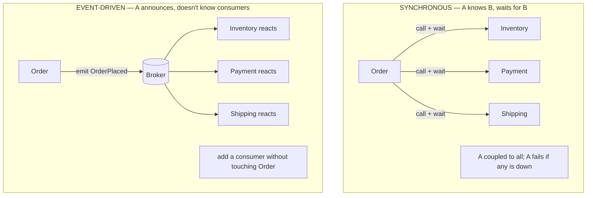
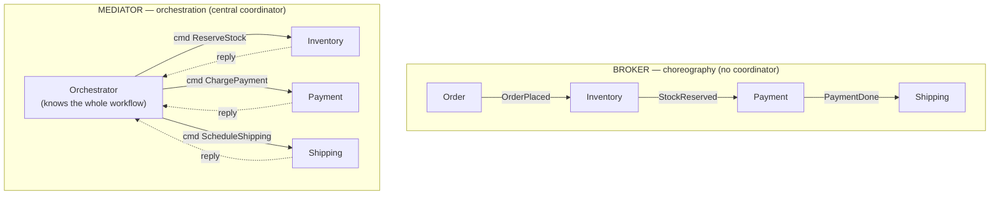

# Lesson 2.2.4 — Event-Driven Architecture (Broker vs Mediator)

> Part 2: Architecture Fundamentals · Module 2.2: Architecture Styles · Difficulty: 🟡🔴
>
> **Prerequisites:** [2.1.3 DDD/domain events], [2.2.3 Distributed Styles], [1.1.5 Tradeoffs].
> **Unlocks:** [Part 9 Messaging & Streaming], [Part 11 Sagas], [Part 12 Microservices comms], [Part 20 Capstone event flows].

---

## 1. Learning Objectives

After this lesson you will be able to:

- Explain **event-driven architecture (EDA)**: components communicating asynchronously via **events**, and why this inverts the usual request/response control flow.
- Distinguish an **event** ("something happened") from a **command** ("do this") and a **query** ("tell me"), and why the distinction shapes coupling.
- Compare the two EDA topologies — **broker** (choreography) vs **mediator** (orchestration) — and their tradeoffs.
- Articulate EDA's signature benefits (decoupling, scalability, responsiveness, extensibility) and its hard costs (eventual consistency, debugging, error handling).
- Recognize when EDA is the right style and when synchronous request/response is better.

---

## 2. Motivation — Decoupling in time and knowledge

Most systems start with **synchronous request/response**: A calls B, waits for a reply, and *knows about* B. This couples A to B in two ways — **temporally** (A blocks until B responds; if B is down, A fails) and in **knowledge** (A must know B exists and how to call it). As systems grow and one event needs to trigger *many* reactions (a new order must update inventory, notify the user, start shipping, update analytics, trigger fraud checks…), synchronous chains become brittle, slow, and tightly coupled — adding a new reaction means modifying the caller.

**Event-driven architecture** breaks both couplings. A component simply **announces that something happened** ("OrderPlaced") without knowing or caring who reacts. Interested components subscribe and react independently and asynchronously. This is the architectural expression of the **domain event** (2.1.3) and the foundation of how decoupled microservices (2.2.3) communicate, how Sagas coordinate (Part 11), and how high-throughput data systems are built (Part 9). It's one of the most important and most *misused* styles — powerful when the problem fits, painful when forced.

---

## 3. Theory — From first principles

### 3.1 Events vs commands vs messages

Precision here drives everything `[CS]`:
- **Event** — a statement that *something happened*, in the past: `OrderPlaced`, `PaymentReceived`. It's a **fact**, immutable, with **no expectation of a specific response** and (ideally) **no knowledge of who consumes it**. The producer is decoupled from consumers. *Events enable the loosest coupling.*
- **Command** — a request to *do something*, directed at a specific handler: `PlaceOrder`, `ChargeCard`. It expects to be processed and implies a known recipient → tighter coupling than an event.
- **Query** — a request for information: `GetOrderStatus`. Expects a response.
- **Message** — the generic envelope; events and commands are both carried as messages over a channel (Part 9).

The key coupling insight: **events invert the dependency.** With a command, the *sender* knows the receiver. With an event, the *receiver* knows the sender's event type — the producer knows nothing about consumers. Adding a new consumer requires **zero change** to the producer. That inversion is the source of EDA's extensibility.

### 3.2 The core EDA shape

- **Event producers** emit events when state changes.
- An **event channel / broker** (a message queue or log — Part 9) transports events.
- **Event consumers** subscribe and react, often producing further events (cascades).

Communication is **asynchronous and non-blocking**: the producer fires the event and moves on (fire-and-forget), not waiting for consumers. This is what decouples them *temporally* — a consumer can be down and catch up later (if the channel is durable). It also enables **broadcast** (one event → many independent reactions) — the publish/subscribe pattern.

### 3.3 Topology 1 — Broker (choreography)

> In the **broker topology**, events flow through a broker with **no central coordinator**. Each component listens for events it cares about and reacts, possibly emitting new events. Control is **distributed**; the workflow **emerges** from the chain of reactions. `[CS]`

Example (order flow): `Order service` emits `OrderPlaced` → `Inventory service` reacts (reserves stock), emits `StockReserved` → `Payment service` reacts (charges), emits `PaymentCompleted` → `Shipping service` reacts… No one orchestrates; each service knows only its own triggers and outputs. This is **choreography** (dancers responding to the music and each other, no director).

- **Strengths:** maximum decoupling, easy extensibility (add a consumer without touching anyone), high performance/scalability, no central bottleneck.
- **Weaknesses:** **the overall workflow is implicit** — no single place describes the business process, making it hard to understand, monitor, and *change* as a whole; **error handling and compensation are hard** (if step 3 fails, who undoes steps 1–2? → Sagas, Part 11); risk of **event cascades** that are hard to trace.

### 3.4 Topology 2 — Mediator (orchestration)

> In the **mediator topology**, a central **mediator/orchestrator** receives an initiating event and **explicitly coordinates** the steps of the workflow, sending commands to each component and tracking progress. Control is **centralized**; the workflow is **explicit**. `[CS]`

Example: an `OrderOrchestrator` receives `OrderPlaced`, then explicitly: command `ReserveStock` → on success, command `ChargePayment` → on success, command `ScheduleShipping`. The orchestrator *knows* the whole process. This is **orchestration** (a conductor directing each musician).

- **Strengths:** the **workflow is explicit and centralized** — easy to understand, monitor, and modify; **error handling/compensation is manageable** (the orchestrator knows what's been done and can compensate — Saga orchestration, Part 11); good for complex, multi-step processes with conditional logic.
- **Weaknesses:** the mediator is a **coupling point and potential bottleneck/SPOF**; components are **more coupled** to the mediator (less independent); the orchestrator can grow complex (risking a "smart pipe"/mini-ESB if overloaded — recall SOA, 2.2.3).

### 3.5 Choosing the topology (and mixing them)

The choice mirrors **choreography vs orchestration** in Sagas (Part 11) — same tradeoff `[BP]`:
- **Broker/choreography** when steps are **simple, independent reactions**, decoupling and extensibility matter most, and there's no complex cross-step logic. (E.g., "when X happens, several teams independently react.")
- **Mediator/orchestration** when the workflow is **complex, multi-step, needs error handling/compensation, conditional branching, or must be observable/changeable as a unit.** (E.g., a payment or order-fulfillment saga.)

Real systems **mix**: high-level complex workflows use orchestration; within/around them, simple notifications use choreography. A common heuristic: *orchestrate within a bounded context where you own the process; choreograph across contexts to keep them decoupled.*

### 3.6 The hard costs (what EDA forces you to accept)

EDA's decoupling isn't free `[CS]`:
- **Eventual consistency** — because reactions are asynchronous, the system is *temporarily inconsistent* (the order exists before inventory is updated). You must design for this (Parts 10, 11) — it's the dominant cost.
- **No simple transactions** — you can't wrap an event cascade in one ACID transaction; you need **Sagas + compensation** (Part 11) and the **outbox pattern** (Part 9/12) to publish events atomically with state changes.
- **Debugging & tracing are hard** — a single business action becomes a web of async events across components; you *need* distributed tracing and correlation IDs (Part 16). Causality is non-obvious.
- **Error handling is complex** — failed/duplicate/out-of-order events; you need **idempotent consumers**, **dead-letter queues**, retries (Parts 9, 11). At-least-once delivery means consumers *must* handle duplicates.
- **Eventual everything** — ordering guarantees, exactly-once *effects*, and replay all become design problems (Part 9).

These costs are exactly why EDA is **not** a default — it's chosen when its decoupling/scalability benefits outweigh this real complexity.

### 3.7 EDA's relationship to the rest of the platform

EDA is the connective tissue for much of what's coming: **domain events** (2.1.3) are its currency; **message brokers and logs** (Part 9) are its transport; **Sagas** (Part 11) are how it handles multi-step consistency; **microservices** (Part 12) commonly integrate via events to stay decoupled; **CQRS and event sourcing** (Part 9, Part 20) are built on event streams; and the **outbox pattern** solves its atomic-publish problem. Understanding EDA's tradeoffs now makes all of those land faster.

---

## 4. Visual Intuition

### Synchronous vs event-driven (control flow inverted)

### Broker (choreography) vs Mediator (orchestration)

---

## 5. Real-World Analogy

**A wedding.** **Choreography (broker):** guests act on cues without a director — when the music starts, people dance; when food appears, they eat; when the couple kisses, everyone claps. No one coordinates; each guest reacts to events. It's flexible and scales effortlessly (add 100 guests, no extra coordination) — but if something goes wrong (the cake is missing), there's no one tracking the overall plan to fix it, and an outsider can't tell what the "process" is. **Orchestration (mediator):** a **wedding planner** (the orchestrator) holds the schedule and explicitly tells each vendor when to act: "now serve dinner," "now cut the cake," "photographer, you're up." The process is clear, observable, and if a step fails the planner knows and adapts — but the planner is a single point everything depends on, and they can get overwhelmed coordinating everything. Most weddings, like most systems, **mix**: a planner for the critical sequence, and guests choreographing the rest.

---

## 6. Industry Example

- **Order/payment/fulfillment flows** `[CONV]`: e-commerce and fintech systems widely use EDA — an `OrderPlaced` event fans out to inventory, payment, shipping, notifications, and analytics. Whether choreographed or orchestrated is an explicit, documented design choice (often orchestrated for the core payment saga, choreographed for peripheral reactions).
- **Kafka-centric architectures** `[CONV]`: LinkedIn's Kafka lineage (Part 18) popularized the event-log backbone where services publish events and many consumers react independently — choreography at massive scale, with the log providing durability and replay.
- **Sagas in microservices** `[CONV]`: the orchestration-vs-choreography decision for distributed transactions (Newman; *Microservices Patterns* by Richardson) is exactly the mediator-vs-broker tradeoff applied to consistency (Part 11).
- **Serverless/event triggers** `[CONV]`: cloud functions triggered by events (file uploaded → process; row changed → react) are EDA at the platform level (Part 13).
- **The outbox pattern** `[BP]`: the standard solution for "atomically update my DB *and* publish an event" — widely documented for reliable EDA in microservices (Parts 9, 12).

---

## 7. Implementation Details — Building EDA well

**Events:**
- Model events as **immutable facts** in past tense (`OrderPlaced`), carrying enough data for consumers (but beware: fat events couple consumers to your schema; thin events force callbacks). Version event schemas for evolution (Part 4.3).
- Decide **event-carried state transfer** (event contains the data consumers need → fewer callbacks, more decoupling) vs **thin events + query back** (less data duplication, more coupling). A real tradeoff (1.1.5).

**Transport (Part 9):** choose a **broker** (queue, e.g., RabbitMQ-style — good for commands/work distribution) vs a **log** (e.g., Kafka-style — good for events, replay, multiple independent consumers). Logs enable replay and many consumers; queues typically consume-and-remove.

**Reliability (the non-negotiables):**
- **Idempotent consumers** — at-least-once delivery means duplicates *will* happen; consumers must dedupe (idempotency keys, Part 11).
- **Outbox pattern** — write state change + outbox event in one local transaction, then relay to the broker → avoids the "DB updated but event lost" (or vice versa) dual-write problem (Part 9/12).
- **Dead-letter queues** for poison messages; retries with backoff (Parts 9, 11).
- **Correlation/trace IDs** on every event for distributed tracing (Part 16) — essential for debugging cascades.

**Topology:** orchestrate complex, stateful, compensable workflows (a Saga orchestrator); choreograph simple independent reactions. Don't let an orchestrator absorb business logic until it becomes a mini-ESB (2.2.3 lesson).

**Design-framework tie (1.3.1):** in the HLD/deep-dive, identify which interactions are naturally events (state changes others react to) vs synchronous queries (need an immediate answer), and justify topology from the workflow's complexity.

---

## 8. Advantages

- **Loose coupling** — producers don't know consumers; inverts the dependency.
- **Extensibility** — add new consumers/reactions without touching producers (a major win).
- **Scalability & throughput** — async, non-blocking; consumers scale independently; natural buffering absorbs spikes (Part 9 backpressure).
- **Responsiveness** — producers don't block on slow consumers; better user-facing latency.
- **Resilience (temporal decoupling)** — a down consumer catches up later from a durable channel; failure of one consumer doesn't fail the producer.

---

## 9. Disadvantages / Costs

- **Eventual consistency** — temporary inconsistency is inherent; not for operations needing immediate strong consistency (Part 10).
- **Hard to debug/trace** — async cascades obscure causality; requires tracing investment (Part 16).
- **Complex error handling** — duplicates, out-of-order, poison messages, compensation (Sagas) — must be designed for.
- **No easy transactions** — needs outbox + Sagas for atomicity/consistency.
- **Implicit workflows (broker)** — no single description of the business process; hard to reason about as a whole.
- **Operational complexity** — a broker/log to run, monitor, and scale (Part 9).

---

## 10. When NOT to use EDA

- **Operations needing an immediate, consistent response** (e.g., "is this username available?", a synchronous payment authorization the user waits on) → request/response is simpler and correct.
- **Simple CRUD** with no fan-out of reactions — events add complexity for nothing.
- **Strong-consistency requirements** that can't tolerate eventual consistency for the core operation (Part 10) — though you can still emit events *after* a consistent write.
- **Small systems / early stage** without the maturity to operate a broker and handle async error cases — the costs dominate.

> Heuristic: use **synchronous** when the caller *needs the answer now*; use **events** when the caller is *announcing a fact others may care about*.

---

## 11. Common Mistakes

1. **Using EDA everywhere by default**, including for operations that need a synchronous answer → unnecessary complexity and eventual-consistency bugs.
2. **Non-idempotent consumers** — assuming exactly-once delivery; duplicates cause double-charges/double-sends (Part 11).
3. **Dual-write problem** — updating the DB and publishing an event as two separate steps, so a crash leaves them inconsistent (fix: outbox).
4. **Overloaded orchestrator** — business logic creeping into the mediator until it's a fragile mini-ESB (2.2.3).
5. **No tracing/correlation IDs** — making async cascades impossible to debug in production.
6. **Ignoring ordering/out-of-order events** where order matters (Part 9 partitioning).
7. **Fat events leaking internal schema** — coupling consumers to producer internals (a connascence-across-boundary issue, 2.1.1).
8. **No dead-letter handling** — poison messages block or get silently dropped.

---

## 12. Interview Questions

**🟢 Easy**
- What's the difference between an event and a command, and why does it affect coupling?
- In EDA, why can you add a new consumer without changing the producer?

**🟡 Medium**
- Compare broker (choreography) and mediator (orchestration) topologies. When would you choose each?
- Why does event-driven architecture force eventual consistency, and name two mechanisms you'd use to handle it correctly.

**🔴 Hard**
- Design an order-fulfillment flow with EDA. Decide which parts to orchestrate vs choreograph, how you'd handle a payment failure after stock was reserved (compensation), and how you'd guarantee an event is published atomically with the DB write.
- Your event-driven system occasionally double-charges customers. Diagnose the likely causes (delivery semantics, non-idempotent consumer, dual-write) and lay out the fixes.

**⚫ Staff+**
- You're choosing between synchronous request/response and event-driven integration for a new platform spanning 8 services. Build the decision framework: which interactions become events vs calls, choreography vs orchestration per workflow, and the reliability infrastructure (outbox, idempotency, DLQ, tracing) you'd mandate. Quantify the costs you're accepting.
- Critique "event-driven everything." Where does EDA's eventual consistency and debugging cost outweigh its decoupling benefit, and how do you decide per interaction? How do you keep an orchestrator from becoming an ESB?

---

## 13. Production Pitfalls

- **Double-processing:** at-least-once delivery + a non-idempotent consumer → duplicate side effects (double charge, double email). The most common EDA production bug (Part 11 idempotency).
- **The dual-write inconsistency:** service updates its DB but crashes before publishing the event (or vice versa) → permanent divergence between state and downstream consumers (fix: outbox/CDC, Part 9).
- **Untraceable incident:** a business problem manifests three hops downstream with no correlation IDs, so engineers can't reconstruct the causal chain → long MTTR (Part 16).
- **Silent backlog/poison messages:** a consumer failing on a bad message blocks the partition or silently drops events; without DLQ + alerting, data is lost (Part 9).
- **Orchestrator bottleneck/SPOF:** a central mediator that becomes overloaded or whose downtime halts all workflows.
- **Event-storm cascades:** an event triggering reactions that emit more events in unbounded fan-out, overwhelming the system.

---

## 14. Optimization Techniques

- **Idempotency keys + dedup** on consumers so retries/duplicates are safe (Part 11).
- **Outbox pattern / CDC** to publish events atomically with state changes (Parts 9, 12).
- **Partition events by key** (e.g., order ID) to preserve per-entity ordering while scaling consumers (Part 9).
- **Distributed tracing + correlation IDs** end-to-end so cascades are debuggable (Part 16).
- **Choose log vs queue deliberately** — log for replayable, multi-consumer events; queue for work distribution (Part 9).
- **Bound fan-out and add backpressure/DLQ** to prevent event storms and handle failures gracefully (Parts 9, 11).
- **Orchestrate the complex core, choreograph the periphery** — keep orchestrators thin (coordination, not business logic).

---

## 15. Summary

**Event-driven architecture** has components communicate **asynchronously via events** — immutable facts ("OrderPlaced") that a producer announces *without knowing who consumes them*. This **inverts the dependency** (consumers know event types; producers know nothing of consumers), delivering EDA's signature benefits: **loose coupling, extensibility** (add consumers without touching producers), **scalability/responsiveness** (async, non-blocking, independently scaled consumers), and **temporal resilience**. Two topologies trade off control: **broker/choreography** (no coordinator; workflow emerges; maximal decoupling but implicit, hard-to-change processes and tricky error handling) and **mediator/orchestration** (a central coordinator makes the workflow explicit and compensable, but adds a coupling point/bottleneck) — the same tradeoff as Saga choreography vs orchestration (Part 11), and real systems mix them. EDA's power comes at a real price: **eventual consistency**, **no easy transactions** (needing the outbox pattern and Sagas), **complex error handling** (idempotent consumers, DLQs, out-of-order/duplicate events), and **hard debugging** (requiring distributed tracing). So it's not a default: use **synchronous request/response when the caller needs an answer now**, and **events when announcing a fact others may react to**. EDA is the connective tissue for messaging (Part 9), Sagas (Part 11), microservice integration (Part 12), and CQRS/event sourcing (Part 20) — making it one of the most leverage-heavy styles to understand deeply.

---

## 16. Revision Notes (flashcard-ready)

- **Q:** Event vs command? **A:** Event = "something happened" (fact, no known consumer); command = "do this" (directed at a handler). Events couple loosest.
- **Q:** Why is EDA extensible? **A:** Producer doesn't know consumers → add a consumer without changing the producer (inverted dependency).
- **Q:** Broker topology? **A:** Choreography — no central coordinator; workflow emerges from reactions; max decoupling, implicit process.
- **Q:** Mediator topology? **A:** Orchestration — central coordinator runs the workflow explicitly; observable/compensable, but a coupling point/bottleneck.
- **Q:** When broker vs mediator? **A:** Broker for simple independent reactions; mediator for complex, multi-step, compensable workflows.
- **Q:** EDA's dominant cost? **A:** Eventual consistency (async reactions → temporary inconsistency).
- **Q:** Dual-write problem & fix? **A:** DB write and event publish as separate steps can diverge on crash; fix with the outbox pattern/CDC.
- **Q:** Why must consumers be idempotent? **A:** At-least-once delivery → duplicates will occur.
- **Q:** Sync vs event heuristic? **A:** Sync when caller needs the answer now; event when announcing a fact others may care about.

---

## 17. Further Reading + Knowledge-Graph Links

**Within this platform**
- **Previous:** [2.2.3 Service-Based/Microservices/SOA]. **Next:** [2.2.5 Space-Based Architecture] (completes the styles).
- **Built on:** [2.1.3 Domain Events].
- **Deep dives:** [Part 9 Messaging & Streaming] (brokers vs logs, delivery semantics, ordering, outbox, CDC, stream processing), [Part 11 Sagas & idempotency], [Part 12 Microservice communication], [Part 16 Tracing], [Part 20 CQRS/event sourcing].

**Foundational texts (synthesized)**
- Richards & Ford, *Fundamentals of Software Architecture* — event-driven style; broker vs mediator topologies and their tradeoffs.
- Richardson, *Microservices Patterns* — Saga orchestration vs choreography, outbox, idempotent consumers.
- Kleppmann, *DDIA* — event logs, stream processing, the dual-write problem, exactly-once semantics (Part 9 foundations).
- Newman, *Building Microservices* — event-based collaboration between services.

**Concept tags:** `[CS]` event/command distinction, broker vs mediator, eventual consistency · `[BP]` outbox pattern, idempotent consumers, orchestrate-core/choreograph-periphery · `[CONV]` Kafka event backbone, order/payment sagas, serverless event triggers.
