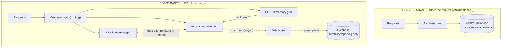
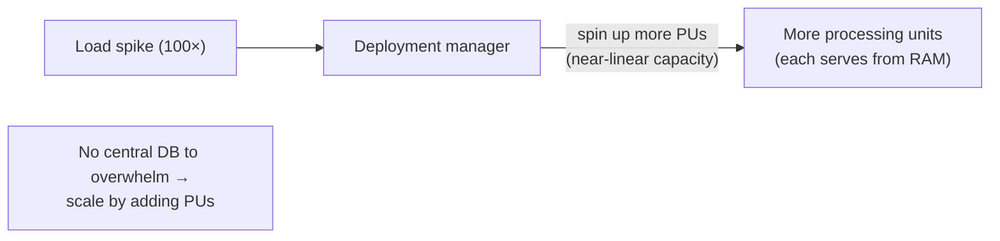

# Lesson 2.2.5 — Space-Based Architecture (In-Memory Data Grids)

> Part 2: Architecture Fundamentals · Module 2.2: Architecture Styles · Difficulty: 🔴 · **Completes Module 2.2**
>
> **Prerequisites:** [1.1.3 Vocabulary of Scale], [2.2.1 Monolith], [2.2.4 EDA], [1.2.1 Scalability].
> **Unlocks:** [Part 6 Caching], [Part 7 Scalability], [Part 10 Consistency].

---

## 1. Learning Objectives

After this lesson you will be able to:

- Explain **space-based architecture (SBA)** and the specific problem it solves: **extreme, spiky scalability** where the database is the bottleneck.
- Describe its core idea — **remove the central database from the request path** by keeping data in a replicated **in-memory data grid**, with async persistence.
- Identify the components (processing units, virtualized middleware, data pumps/writers/readers) and how they collaborate.
- Reason about SBA's tradeoffs: extreme scalability/performance vs complexity, eventual durability, and consistency challenges.
- Recognize where the *ideas* of SBA reappear (in-memory grids, near-cache, CQRS, event sourcing) even if the full style is rare.

---

## 2. Motivation — When the database is the wall

Recall the utilization knee (1.1.3) and the recurring lesson that **the database is usually the bottleneck** (Part 7). Most architectures scale the app tier easily (stateless instances) but then hammer a central database, which can't scale horizontally as easily. For systems with **extreme, unpredictable, spiky load** — think a concert ticket on-sale, a flash sale, online betting during a goal, a trading surge — the database becomes the wall: it can't absorb a 100× spike, and adding read replicas/sharding (Parts 7, 10) has limits and latency.

**Space-based architecture** is the radical answer: **take the database out of the synchronous request path entirely.** Keep the operational data **in memory**, replicated across processing units, so reads and writes hit RAM (1.1.3: ~100ns vs disk's ms — ~1000×+ faster), and persist to the database **asynchronously** in the background. With no shared central database in the hot path, the system scales by simply adding more in-memory processing units — near-linear elastic scalability. It's the least-common of the architecture styles but the most instructive about *what becomes possible when you remove the central bottleneck* — and its ideas pervade caching (Part 6) and high-performance systems.

The name comes from **tuple space** / "space-based" computing — a shared in-memory space that units read/write, decoupled in time and reference.

---

## 3. Theory — From first principles

### 3.1 The core idea: no central DB in the request path

In a typical architecture, every request ultimately contends on a shared database — the **scalability bottleneck**. SBA's insight `[CS]`: if the data lives **in memory, replicated across the processing units themselves**, then:
- Requests are served entirely from local/replicated RAM — **no DB round trip** on the hot path (huge latency win, 1.1.3).
- There's **no central contention point**, so you scale by **adding processing units**; capacity grows near-linearly (straightening the scalability curve — 1.2.1).
- The database still exists for **durability and reporting**, but it's updated **asynchronously**, off the critical path, so its limited throughput no longer caps request throughput.

You've traded the database bottleneck for the challenges of keeping replicated in-memory state consistent and durable — a deliberate tradeoff for extreme scale.

### 3.2 The components

Richards & Ford describe SBA's parts `[CS]`:

- **Processing Unit (PU)** — the deployable that handles requests. It contains **application logic + an in-memory data grid** holding the data it needs (often a replicated copy). PUs are **stateful** (they hold data) but interchangeable — you add/remove them to scale. Each PU can serve requests without calling a database.
- **Virtualized Middleware** — the infrastructure that manages the units and the "space." Its parts:
  - **Messaging grid** — manages requests and routes them to available PUs (like a load balancer aware of the grid).
  - **Data grid** — keeps the in-memory data **replicated/synchronized across PUs** (so any PU has the data; this is the heart of SBA). Uses replication so a PU failure doesn't lose data.
  - **Processing grid** — coordinates request processing that spans multiple PU types (orchestration within the grid).
  - **Deployment manager** — handles **elastic** scaling: spins PUs up/down based on load (autoscaling, Part 13).
- **Data Pumps / Data Writers / Data Readers** — the asynchronous bridge to the database:
  - **Data pump** — sends updates from the in-memory grid to be persisted (usually via messaging — an EDA element, 2.2.4).
  - **Data writer** — consumes from the pump and writes to the database asynchronously.
  - **Data reader** — loads data from the database into the grid (e.g., on startup or to repopulate a new PU).

### 3.3 How a request flows (no DB on the path)

1. A request arrives; the **messaging grid** routes it to a PU.
2. The PU reads/updates data **in its in-memory grid** — no database call. Response returns fast.
3. The **data grid** asynchronously **replicates** the change to other PUs (so the in-memory state stays consistent across units).
4. A **data pump** asynchronously sends the change toward the **data writer**, which persists it to the database **in the background**.
5. The database is thus *eventually* updated; it's never in the synchronous hot path.

The key consequence: **request throughput is bounded by RAM and the grid, not by the database.** Scale by adding PUs (the deployment manager does this elastically).

### 3.4 The tradeoffs (what you gain and pay)

**Gains:**
- **Extreme, elastic scalability** — near-linear; add PUs to handle spikes; ideal for unpredictable, high-volume load.
- **Very high performance / low latency** — all reads/writes hit memory (1.1.3).
- **No central bottleneck or single point of contention** in the request path.

**Costs (significant):**
- **High complexity** — the virtualized middleware, replication, and async persistence are hard to build and operate; this is an advanced, specialized style.
- **Eventual durability** — because persistence is async, a window exists where an acknowledged change is only in memory; a correlated failure of enough PUs before persistence could lose data. (Replication across PUs mitigates single-node loss, but it's not the same as synchronous durability — a latency↔durability tradeoff, 1.1.5.)
- **Consistency challenges** — keeping replicated in-memory copies consistent across many PUs is a distributed-consistency problem (Part 10); the DB is eventually consistent with the grid.
- **Memory cost & data-size limits** — data must fit in (replicated) RAM; expensive and bounded; best for data that fits in memory.
- **Operational specialization** — requires a grid product and expertise.

### 3.5 When SBA fits (a narrow but real niche)

SBA is the right call when `[BP]`:
- Load is **extremely high and spiky/unpredictable**, and the **database is the proven bottleneck** you can't scale otherwise.
- **Low, consistent latency** under spikes is a top driving characteristic.
- The **working data set fits in memory** (replicated).
- You can **tolerate eventual durability/consistency** for the operational data (or design around it).
- Classic domains: **concert/ticket sales, flash sales, online auctions/betting, trading, gaming** — bursty, high-concurrency, latency-sensitive workloads.

When these don't hold (moderate or predictable load, data too large for RAM, strong durability required for every write), simpler styles (modular monolith, service-based) with conventional caching and replication (Parts 6, 10) are better — SBA's complexity isn't justified.

### 3.6 The enduring ideas (even if the full style is rare)

You may never build a *pure* SBA, but its ideas are everywhere `[CONV]`:
- **In-memory data grids** (Hazelcast, Apache Ignite, Oracle Coherence, GemStone/GemFire lineage) — the products that implement SBA, also used as distributed caches (Part 6).
- **Removing the DB from the hot path** is the soul of aggressive caching (Part 6) and of CQRS read models (serve reads from a fast, denormalized store; Part 20).
- **Async persistence** is the write-back cache pattern (Part 6) and the basis of event sourcing (persist the event stream, derive state — Part 20).
- **Replicated in-memory state for elasticity** appears in stateful stream processors (Part 9) and distributed caches.

So even as a "rare" style, SBA crystallizes a principle you'll reuse constantly: **when the database is the wall, move the hot data into memory and persist asynchronously — accepting eventual durability/consistency for extreme scale and speed.**

---

## 4. Visual Intuition

### Conventional vs space-based (the DB leaves the hot path)

### Scaling model

---

## 5. Real-World Analogy

**A flash sale at a stadium vs a single cashier.** A conventional architecture is one central cashier (the database): no matter how many salespeople (app servers) you hire, every sale must queue at that one register — when 50,000 fans rush at once, the line (and latency) explodes (the utilization knee). Space-based architecture is like giving **every salesperson their own synchronized cash drawer with a live shared inventory count** (in-memory data grid replicated across processing units): each can complete sales instantly without walking to a central register, and they keep their counts in sync with each other in real time. The official accounting ledger (the database) is updated **later, in the back office** (async persistence) — it never holds up a sale. To handle a bigger crowd, you just add more salespeople-with-drawers (processing units). The risk mirrors the architecture: if the building loses power before the back-office ledger is reconciled, some just-completed sales recorded only in the drawers could be lost (eventual durability) — which is why this setup is reserved for events where *speed under a massive crowd* is the overriding priority.

---

## 6. Industry Example

- **In-memory data grid products** `[CONV]`: Hazelcast, Apache Ignite, Oracle Coherence, and the GemFire lineage are the canonical implementations of SBA's data grid, used for both full space-based systems and as high-performance distributed caches (Part 6).
- **High-volume, spiky domains** `[CONV]`: ticketing, online betting/gaming, trading, and flash-sale systems are the classic motivating use cases — workloads where database-centric designs collapse under burst concurrency and low-latency demands.
- **The idea generalized** `[CONV]`: serving reads from in-memory/denormalized stores with async write-back (CQRS read models, write-back caches) is mainstream even where the full SBA style isn't used — the "remove the DB from the hot path" principle (Parts 6, 20).
- **Richards & Ford** `[BP]`: present space-based as the highest-scalability architecture style, explicitly noting its complexity and narrow applicability — choose it for elasticity/extreme variable load, not as a general default.

---

## 7. Implementation Details — Realizing (the ideas of) SBA

- **Choose an in-memory data grid** (Hazelcast/Ignite/Coherence-style) that provides replication, partitioning, and the messaging/data-grid primitives — you do **not** build this from scratch.
- **Make PUs hold the working set in memory**, replicated for fault tolerance (a PU loss shouldn't lose data); partition large data across PUs if it doesn't all fit per node (grid partitioning ~ Part 7 sharding).
- **Async persistence pipeline:** data pump → writer → database, typically over a durable message channel (EDA, 2.2.4) so persistence is reliable even though it's off the hot path. Use the **outbox/event-log** ideas (Part 9) to avoid losing updates.
- **Handle the durability window deliberately:** for data where eventual durability is unacceptable, either keep that subset synchronously persisted or use grid replication factor high enough that correlated loss is acceptably improbable — a conscious latency↔durability decision (1.1.5).
- **Elastic scaling:** configure the deployment manager/autoscaler (Part 13) to add PUs on load; the grid rebalances data to new units.
- **Consistency:** decide read/write consistency within the grid (replicated vs partitioned, sync vs async replication — Part 10); SBA typically accepts eventual consistency between grid and DB and tunes intra-grid consistency.

**Design-framework tie (1.3.1):** SBA is a *deep-dive* answer for a specific bottleneck — in an interview, reach for it (or its ideas: in-memory grid + async write-back) when capacity estimation (1.1.4) shows extreme spiky load that a database can't absorb, and justify the eventual-durability tradeoff explicitly.

---

## 8. Advantages

- **Extreme elastic scalability** — near-linear; add PUs to absorb huge spikes; no central bottleneck.
- **Very high performance / low latency** — memory-speed reads and writes (1.1.3).
- **High availability under load** — no single DB to overwhelm; replicated grid survives PU loss.
- **Smooths spiky/unpredictable load** — ideal for bursty, high-concurrency workloads.

---

## 9. Disadvantages / Costs

- **Very high complexity** — advanced middleware, replication, and async persistence; specialized expertise required.
- **Eventual durability** — async persistence creates a data-loss window for acknowledged-but-unpersisted changes (mitigated, not eliminated, by replication).
- **Consistency challenges** — replicated in-memory state + eventually-consistent DB (Part 10).
- **Memory cost and data-size limits** — data must fit in (replicated) RAM; expensive; not for huge datasets.
- **Operational burden** — running and tuning a data grid is non-trivial; harder to debug.
- **Narrow applicability** — overkill for the vast majority of systems.

---

## 10. When NOT to use SBA

- **Predictable or moderate load** — conventional scaling (replicas, caching, sharding — Parts 6, 7, 10) is far simpler and sufficient.
- **Data too large to fit in memory** (even partitioned/replicated) — the model breaks down or gets prohibitively expensive.
- **Strong/synchronous durability required for every write** (e.g., a financial ledger where no acknowledged write may ever be at risk) — the eventual-durability window is unacceptable without careful design.
- **Teams without grid expertise** — the complexity will dominate.
- For most systems: prefer the simpler styles and standard caching; borrow SBA's *ideas* (in-memory grid, async write-back) selectively for a specific hot path rather than adopting the whole style.

---

## 11. Common Mistakes

1. **Reaching for SBA when simpler scaling would do** — over-engineering; the complexity isn't justified unless the DB is a proven, severe bottleneck.
2. **Ignoring the durability window** — assuming in-memory + async persistence is as safe as synchronous DB writes; losing acknowledged data on correlated PU failure.
3. **Underestimating consistency** — treating replicated in-memory state as trivially consistent (it's a distributed-consistency problem, Part 10).
4. **Trying to fit too-large data in memory** — memory cost explodes or the grid thrashes.
5. **Building the grid from scratch** instead of using a proven product.
6. **Using SBA for data that needs strong durability** without isolating that subset.
7. **No plan for repopulating PUs** (data readers) on restart/scale-out — cold PUs that can't serve.

---

## 12. Interview Questions

**🟢 Easy**
- What core problem does space-based architecture solve, and how does it solve it?
- Why does removing the database from the request path improve scalability and latency?

**🟡 Medium**
- Describe the main components of SBA (processing unit, data grid, data pump/writer/reader) and the path of a request.
- What is the "eventual durability" tradeoff in SBA, and which workloads can tolerate it?

**🔴 Hard**
- Design a concert-ticket flash-sale system that must handle a 100× spike with low latency. Show how SBA (or its ideas) removes the DB bottleneck, how you'd keep in-memory inventory consistent across processing units, and how you'd avoid overselling (a consistency-critical operation) despite eventual persistence.
- Compare SBA to "conventional app tier + aggressive caching + sharded DB" for the same spiky workload. What does SBA give you that caching doesn't, and what new problems does it introduce?

**⚫ Staff+**
- A trading/betting platform needs extreme throughput and low latency but also cannot lose confirmed transactions. Architect a hybrid: SBA-style in-memory grid for the hot path plus a durability strategy that protects confirmed writes. Walk through the latency↔durability↔consistency tradeoffs and where you draw the synchronous-persistence line.
- Argue why pure space-based architecture is rare while its *ideas* are pervasive. Identify those ideas (in-memory grid, async write-back, CQRS read models, event sourcing) and where each shows up in modern systems — and when you'd adopt the full style vs borrow a piece.

---

## 13. Production Pitfalls

- **Data loss on correlated PU failure:** a power/zone event takes down enough PUs before the data writer persists recent changes → acknowledged data lost (the eventual-durability window made real). Mitigate with cross-zone replication and bounded write-back lag.
- **Grid split-brain / inconsistency:** network partitions among PUs cause divergent in-memory copies (Part 10 consistency) — overselling tickets or mismatched balances.
- **Memory pressure / GC pauses:** the grid outgrowing RAM or suffering long garbage-collection pauses, causing latency spikes (the very thing SBA aimed to avoid).
- **Slow/backed-up persistence pipeline:** the async data writer falling behind under sustained load, growing the durability window and risk (Part 9 backpressure).
- **Cold PU on scale-out:** a new PU that hasn't loaded data (no/slow data reader) serving incomplete results until warmed.

---

## 14. Optimization Techniques

- **Use a proven in-memory data grid** with built-in replication, partitioning, and persistence hooks; don't hand-roll.
- **Tune replication factor** for the durability/consistency you need vs memory cost (more copies = safer but pricier).
- **Bound write-back lag** and monitor the persistence pipeline so the durability window stays small and known (Part 9 backpressure, Part 16 monitoring).
- **Partition large data across PUs** (grid partitioning) when it won't fit per-node; keep hot data co-located.
- **Isolate consistency-critical operations** (e.g., inventory decrement) with grid-level atomic operations/locks or a synchronous path, while keeping the rest async.
- **Borrow the ideas selectively:** for many systems, an in-memory cache with write-back for one hot path (Part 6) captures most of SBA's benefit at a fraction of the complexity.

---

## 15. Summary

**Space-based architecture** is the extreme-scalability style that solves the most common scaling wall — the central database — by **removing it from the request path entirely**. Operational data lives in a **replicated in-memory data grid** distributed across **processing units**; requests are served at memory speed with **no DB round trip**, and the database is updated **asynchronously** in the background (via data pumps/writers) purely for durability and reporting. With no central contention point, the system scales **near-linearly by adding processing units** (elastically), making it ideal for **extreme, spiky, latency-sensitive load** — ticketing, flash sales, betting, trading, gaming. The price is steep and deliberate: **high complexity**, **eventual durability** (a data-loss window from async persistence, mitigated by replication), **distributed-consistency challenges** between grid copies and the DB, **memory cost/size limits**, and the need for specialized middleware — so it's a **narrow, advanced** choice, not a default. Even when you don't build a pure SBA, its core principle — *when the database is the wall, move hot data into replicated memory and persist asynchronously, trading eventual durability for extreme scale and speed* — recurs throughout distributed caching (Part 6), CQRS read models, and event sourcing (Part 20). **This completes Module 2.2:** you now have the full architecture-styles catalog — monolithic (2.2.1), structural (2.2.2), distributed (2.2.3), event-driven (2.2.4), and space-based (2.2.5) — ready for style *selection* in Module 2.3.

---

## 16. Revision Notes (flashcard-ready)

- **Q:** What problem does SBA solve? **A:** The central database as the scalability bottleneck under extreme/spiky load.
- **Q:** Core idea? **A:** Keep data in a replicated in-memory grid across processing units; remove the DB from the request path; persist asynchronously.
- **Q:** Why does it scale near-linearly? **A:** No central contention — add processing units to add capacity.
- **Q:** Key components? **A:** Processing units (app + in-memory grid), virtualized middleware (messaging/data/processing grids, deployment manager), data pump/writer/reader (async persistence).
- **Q:** Main cost? **A:** Eventual durability (async persistence → data-loss window) + consistency complexity + high operational complexity.
- **Q:** Ideal workloads? **A:** Ticketing, flash sales, betting/gaming, trading — extreme, spiky, latency-sensitive.
- **Q:** When NOT to use? **A:** Moderate/predictable load, data too big for RAM, strong per-write durability required, no grid expertise.
- **Q:** Enduring ideas it embodies? **A:** In-memory data grids, async write-back caching, CQRS read models, event sourcing — "remove the DB from the hot path."

---

## 17. Further Reading + Knowledge-Graph Links

**Within this platform**
- **Previous:** [2.2.4 Event-Driven Architecture] (async persistence uses EDA). **Completes Module 2.2.** Next: [2.3.1 Architecture Characteristics → Style Selection] (choosing among all these styles).
- **Builds on:** [1.1.3 Vocabulary of Scale] (memory vs disk latency, the knee), [1.2.1 Scalability] (near-linear scaling), [2.2.1 the DB bottleneck].
- **Reappears in:** [Part 6 Caching] (in-memory grids, write-back), [Part 7 Scalability] (partitioning), [Part 10 Consistency] (replicated in-memory state), [Part 20 CQRS/event sourcing].

**Foundational texts (synthesized)**
- Richards & Ford, *Fundamentals of Software Architecture* — space-based architecture: components (processing units, virtualized middleware, data pumps), tradeoffs, and applicability.
- Kleppmann, *DDIA* — in-memory data systems, replication, and the durability/consistency tradeoffs that SBA navigates.

**Concept tags:** `[CS]` space-based components, remove-DB-from-hot-path, async persistence · `[BP]` narrow applicability, borrow the ideas selectively, tune replication for durability · `[CONV]` in-memory data grids (Hazelcast/Ignite/Coherence), ticketing/betting/trading use cases.
