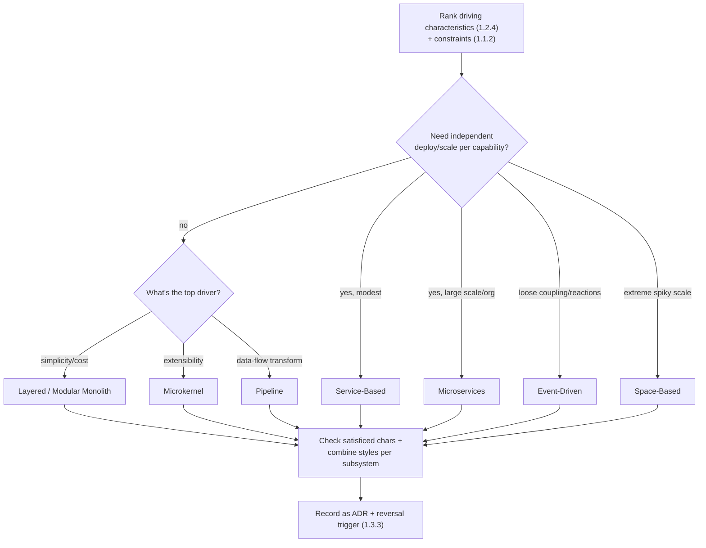

# Lesson 2.3.1 — Architecture Characteristics → Style Selection

> Part 2: Architecture Fundamentals · Module 2.3: Decisions & Tradeoffs · Difficulty: 🟡🔴
>
> **Prerequisites:** [1.2.4 Prioritizing Characteristics], [2.2.1–2.2.5 all styles].
> **Unlocks:** [2.3.2 The Hard Parts], [2.3.3 Evolutionary Architecture], [1.3.1 Design Framework HLD step].

---

## 1. Learning Objectives

After this lesson you will be able to:

- Turn the **ranked driving characteristics** (1.2.4) into a concrete **architecture-style choice** using a decision process, not intuition.
- Read and build an **architecture-style comparison matrix** (which style rates well on which characteristic).
- Avoid the two classic errors: **picking a style by hype** and **forcing one style on a whole system**.
- Justify a style choice in a design review/interview by tracing it back to the driving characteristics and constraints.

---

## 2. Motivation — Closing the loop from characteristics to structure

Module 1.2 ended with the key skill: rank the **2–3 driving characteristics**. Module 2.2 gave the **catalog of styles**, each a bundle of tradeoffs. This lesson connects them: **the driving characteristics *select* the style.** That's the whole point of learning both — without the link, you either guess or follow fashion.

This is exactly the decision a designer makes in the HLD step of the framework (1.3.1), and the one Staff+ interviews probe: *"Why this architecture?"* The senior answer is never "microservices are modern" — it's "availability and independent team deployment are our top two driving characteristics, and among the styles, X rates best on those while keeping our satisficed characteristics acceptable." This lesson makes that reasoning systematic.

---

## 3. Theory — From first principles

### 3.1 The selection process

A repeatable method `[BP]` (synthesizing Richards & Ford):

1. **Rank the driving characteristics** (1.2.4) — the top 2–3 the system must be best at, plus the hard constraints (1.1.2: budget, team, compliance).
2. **Determine the deployment/distribution need first** — does the system need *independent deployability/scalability* per capability? This splits monolithic styles (2.2.1–2.2.2) from distributed ones (2.2.3–2.2.5). Don't distribute without a trigger (2.2.1).
3. **Match the driving characteristics to a style's strengths** using the comparison matrix (§3.2). Pick the style whose "naturally strong" set covers your drivers.
4. **Check the satisficed characteristics** — does the chosen style keep the *rest* acceptable, or does it sacrifice something you actually need? (E.g., microservices' strong scalability comes with weak simplicity — fine only if simplicity isn't a driver.)
5. **Consider combining styles per subsystem** (2.2.2 §3.4) — you don't need one style for everything.
6. **Record the decision and the tradeoff** as an ADR (1.3.3), with the reversal trigger.

The output isn't "the best style" (there's none — 1.1.5) but "the style whose tradeoffs best fit *these* ranked priorities and constraints."

### 3.2 The architecture-style comparison matrix

A qualitative rating of how each style tends to score on key characteristics. (Ratings are *general tendencies* from Richards & Ford's analysis, `[CONV]`; real implementations vary — treat as a starting heuristic, not law. Scale: ★ low → ★★★★★ high.)

| Characteristic | Layered | Pipeline | Microkernel | Service-Based | Event-Driven | Microservices | Space-Based |
|---|---|---|---|---|---|---|---|
| **Simplicity / ease** | ★★★★★ | ★★★★ | ★★★ | ★★★ | ★★ | ★ | ★ |
| **Cost (low = cheap)** | ★★★★★ | ★★★★ | ★★★★ | ★★★ | ★★ | ★ | ★ |
| **Deployability** | ★★ | ★★ | ★★★ | ★★★★ | ★★★ | ★★★★★ | ★★★ |
| **Elasticity / scalability** | ★ | ★ | ★ | ★★★ | ★★★★ | ★★★★★ | ★★★★★ |
| **Fault tolerance** | ★ | ★ | ★ | ★★★ | ★★★★ | ★★★★ | ★★★ |
| **Evolvability** | ★ | ★★★ | ★★★ | ★★★ | ★★★★ | ★★★★★ | ★★ |
| **Performance** | ★★ | ★★★ | ★★★ | ★★★ | ★★★ | ★★ | ★★★★★ |
| **Testability** | ★★★ | ★★★★ | ★★★ | ★★★ | ★★ | ★★★★ | ★★ |
| **Overall complexity (low=better)** | ★★★★★ | ★★★★ | ★★★ | ★★★ | ★★ | ★ | ★ |

How to read it: find your **driving** characteristic(s) in the rows, then pick the style with the highest stars there — while checking it doesn't tank a characteristic you also need.

### 3.3 Worked selections (driver → style)

- **Driver = simplicity + low cost, small team, standard CRUD:** → **Layered / modular monolith**. (Top simplicity & cost; you don't need elasticity.)
- **Driver = extensibility/customization (a product others extend):** → **Microkernel**. (Best at extensibility.)
- **Driver = processing a stream of data through transformations:** → **Pipeline** (in-process) or distributed streaming (Part 9).
- **Driver = independent deployability + team autonomy + per-capability scaling, at large scale/org:** → **Microservices**. (Top deployability/elasticity/evolvability — accept low simplicity/high cost.)
- **Driver = independent deployment with less complexity, mid-size, want transactional simplicity:** → **Service-based**. (Good deployability without the full distributed tax.)
- **Driver = loose coupling + responsiveness + many reactions to events:** → **Event-driven** (often combined with services).
- **Driver = extreme, spiky scalability + low latency, DB is the wall:** → **Space-based**. (Top elasticity/performance — accept high complexity + eventual durability.)

Notice each choice **accepts a sacrifice** (the low-star columns) — naming that sacrifice is the senior part.

### 3.4 The two cardinal errors

1. **Hype-driven selection** — choosing microservices/event-driven because they're fashionable, ignoring that your drivers are simplicity and cost (→ you pay complexity you don't need; 2.2.1/2.2.3). The matrix exists to anchor the choice in *characteristics*, not trends.
2. **One style for everything** — forcing the whole system into a single style. Real systems **combine** (2.2.2 §3.4): a modular monolith with a pipeline subsystem; microservices that communicate event-driven; a microkernel core. Choose per subsystem from *its* drivers.

### 3.5 Style choice is a (partly) one-way door

Some style decisions are easy to reverse (internal structure — two-way door), but the **distribution decision** (monolith vs microservices) and the **data-distribution** that comes with it are largely **one-way doors** (1.1.1, 2.2.1): once data is split across service-owned stores and teams depend on it, reversing is painful. So apply *more* rigor to the distribution choice than to internal-structure choices, and prefer the reversible default (modular monolith) when uncertain. This is why the selection process puts the deployment/distribution question first (§3.1 step 2).

---

## 4. Visual Intuition

---

## 5. Real-World Analogy

**Choosing a type of building for a purpose.** You don't pick "skyscraper" because skyscrapers are impressive — you pick based on requirements: a single-family home (layered monolith) for a family on a budget; a shopping mall with leasable units (microkernel — a core structure others fill with shops/plugins); a factory assembly line building (pipeline); a business park of separate buildings (microservices) when independent tenants need autonomy; a stadium engineered for sudden 50,000-person surges (space-based). An architect who proposes a 50-story tower for a couple wanting a house has confused *fashion* with *fit*. And large developments mix building types on one site — exactly as software systems combine architecture styles per subsystem.

---

## 6. Industry Example

- **Characteristic-driven selection** `[BP]`: Richards & Ford's central teaching method is exactly this — identify and rank architecture characteristics, then choose the style whose ratings match. Their per-style "star ratings" are the basis of the §3.2 matrix.
- **Reaction against hype** `[CONV]`: numerous public engineering retrospectives describe teams that adopted microservices/event-driven by fashion and paid heavily, then simplified — reinforcing that the *drivers*, not the trend, must decide (2.2.1, 2.2.3).
- **Style combination in practice** `[CONV]`: large real systems routinely mix — e.g., microservices (distribution) communicating via event-driven integration (2.2.4) with an in-memory grid (space-based ideas) on a hot path — selected per subsystem.

---

## 7. Implementation Details — Using it in the design framework

In the **HLD step (1.3.1)**:
1. State the ranked driving characteristics (from your requirements step).
2. Decide distribution need (monolithic vs distributed) explicitly.
3. Name the style and point to the 1–2 matrix rows that justify it.
4. Explicitly state the sacrifice you're accepting (the weak columns) and confirm it's acceptable given the satisficed characteristics.
5. Note where you'd combine styles for specific subsystems.
6. Capture it as an ADR with a reversal trigger.

**Interview phrasing (the senior move):** *"My top two drivers are elasticity and independent deployability, with simplicity and cost as satisficed. On the style matrix, microservices rate highest on both drivers; I accept their low simplicity and high cost because those aren't drivers here — though I'd start service-based and split to microservices as scale demands, since the distribution decision is a one-way door."*

Use `reference/architecture-comparison-matrix.md` (created alongside this lesson) as the lookup.

---

## 8. Advantages (of systematic selection)

- **Defensible, non-arbitrary choices** anchored to characteristics and constraints.
- **Avoids hype-driven over-engineering** and accidental complexity.
- **Surfaces sacrifices explicitly** so the team agrees on what's being traded.
- **Supports combination** — right tool per subsystem rather than one-size-fits-all.

---

## 9. Disadvantages / Limits

- **The matrix is a heuristic, not a formula** — real implementations vary; ratings are directional. Don't treat stars as precise.
- **Requires honest ranking** — a wrong driver ranking selects a coherent but wrong style.
- **Combination adds its own complexity** — mixing styles needs coherence (1.2.4 §3.5) and clear boundaries.

---

## 10. When NOT to over-apply

- **Trivial systems** — any reasonable style works; don't run a full matrix analysis for a script or tiny CRUD app (just pick layered/monolith).
- **When a constraint dominates** — e.g., a hard "must be a single deployable for the customer's on-prem box" constraint may settle it without matrix analysis.

---

## 11. Common Mistakes

1. **Hype-driven selection** — picking the trendy style regardless of drivers.
2. **Skipping the ranking** — choosing a style without first knowing the driving characteristics (no basis for the choice).
3. **One style for the whole system** — ignoring that subsystems have different drivers.
4. **Treating matrix stars as exact** — over-trusting a heuristic.
5. **Ignoring the accepted sacrifice** — choosing a style strong on drivers but silently tanking a needed satisficed characteristic.
6. **Under-rigor on the distribution decision** — flipping to microservices casually despite it being a one-way door.

---

## 12. Interview Questions

**🟢 Easy**
- How do the driving characteristics relate to choosing an architecture style?
- Which style tends to rate highest on simplicity? On elasticity?

**🟡 Medium**
- A system's top drivers are independent deployability and per-capability scaling, at a large org. Which style, and what do you sacrifice?
- Why is "we'll use microservices because they're modern" a poor justification? Reframe it correctly.

**🔴 Hard**
- Given a system that's mostly a standard CRUD app but has one extreme-spike subsystem (flash sale) and one stream-processing subsystem, propose a *combination* of styles and justify each from its drivers.
- Walk through selecting a style for a mid-size product that needs independent deploys but wants to keep transactional simplicity. Compare service-based vs microservices using the matrix, and state your reversal trigger.

**⚫ Staff+**
- Build the full selection rationale for a new platform: rank characteristics, decide distribution, choose style(s), justify via the matrix, name sacrifices, plan style combination per subsystem, and explain which decisions are one-way doors deserving extra rigor.
- Critique the comparison-matrix approach. Where is it genuinely useful, and where could blindly following star ratings mislead you (e.g., a well-built layered app outperforming a badly-built microservices one)?

---

## 13. Production Pitfalls

- **Hype-style in production:** a small team running unnecessary microservices, drowning in operational complexity their drivers never required (2.2.3) — high cost, slow delivery.
- **Mismatched style:** choosing a style weak on an actual (satisficed-but-needed) characteristic, discovered only under load/incident (e.g., layered app that can't scale a hot path).
- **Incoherent combination:** mixing styles without clear boundaries, producing a confusing hybrid no one can reason about (1.2.4 §3.5).
- **Irreversible distribution regret:** casually choosing microservices, then being unable to consolidate when the complexity proves unjustified (one-way door).

---

## 14. Optimization Techniques

- **Rank characteristics first, always** — the ranking is the selection input.
- **Decide distribution before style** — it's the highest-stakes, least-reversible axis.
- **Use the matrix to shortlist, then validate** against satisficed characteristics and constraints.
- **Combine styles per subsystem** from each subsystem's drivers; keep boundaries clean.
- **Default to the reversible option** (modular monolith/service-based) when uncertain; record a reversal trigger to revisit at scale milestones.
- **Capture the rationale in an ADR** so the choice (and its expiry conditions) is remembered (1.3.3).

---

## 15. Summary

Architecture-style selection is the act of mapping your **ranked driving characteristics** (1.2.4) onto the **style whose tradeoff bundle best fits** (the catalog of 2.2). The process: rank characteristics + constraints → decide distribution need first (the least-reversible, highest-rigor axis) → match drivers to a style's strengths using the **comparison matrix** → verify the satisficed characteristics stay acceptable → combine styles per subsystem → record as an ADR with a reversal trigger. The matrix is a **directional heuristic** (★ ratings of simplicity, cost, deployability, elasticity, fault tolerance, evolvability, performance), not a formula — a well-built instance of a "lower-rated" style can beat a poorly-built "higher-rated" one. The two cardinal errors are **hype-driven selection** (ignoring your actual drivers) and **forcing one style on the whole system** (real systems combine styles). The senior signal is naming both the style *and the sacrifice you accept*, traced explicitly to the drivers — which is exactly what closes the loop from Part 1's mindset to a concrete, defensible architecture.

---

## 16. Revision Notes (flashcard-ready)

- **Q:** What selects the architecture style? **A:** The ranked driving characteristics + constraints (not hype).
- **Q:** First axis to decide? **A:** Distribution need (monolithic vs distributed) — the least-reversible, highest-rigor choice.
- **Q:** Highest simplicity/cost style? **A:** Layered / modular monolith.
- **Q:** Highest elasticity styles? **A:** Microservices and space-based.
- **Q:** Best for extensibility? **A:** Microkernel.
- **Q:** Two cardinal errors? **A:** Hype-driven selection; forcing one style on the whole system.
- **Q:** The matrix is…? **A:** A directional heuristic, not a formula — implementations vary.
- **Q:** Senior justification pattern? **A:** "Top drivers X,Y → style Z (matrix), accepting sacrifice S, combining styles per subsystem, reversal trigger T."

---

## 17. Further Reading + Knowledge-Graph Links

**Within this platform**
- **Builds on:** [1.2.4 Prioritizing Characteristics], all of [2.2 Styles]. **Next:** [2.3.2 The Hard Parts].
- **Applied in:** [1.3.1 Design Framework HLD step], every [Part 19] design, [Part 20 Capstone].
- **Reference:** `reference/architecture-comparison-matrix.md`, `reference/tradeoff-worksheet.md`.

**Foundational texts (synthesized)**
- Richards & Ford, *Fundamentals of Software Architecture* — characteristic ratings per style; selecting style from characteristics.
- Ford et al., *Software Architecture: The Hard Parts* — tradeoff-driven decisions, no best practices.

**Concept tags:** `[BP]` characteristic-driven selection, decide distribution first, combine per subsystem · `[CONV]` style star-ratings, anti-hype retrospectives · `[CS]` styles as tradeoff bundles.
