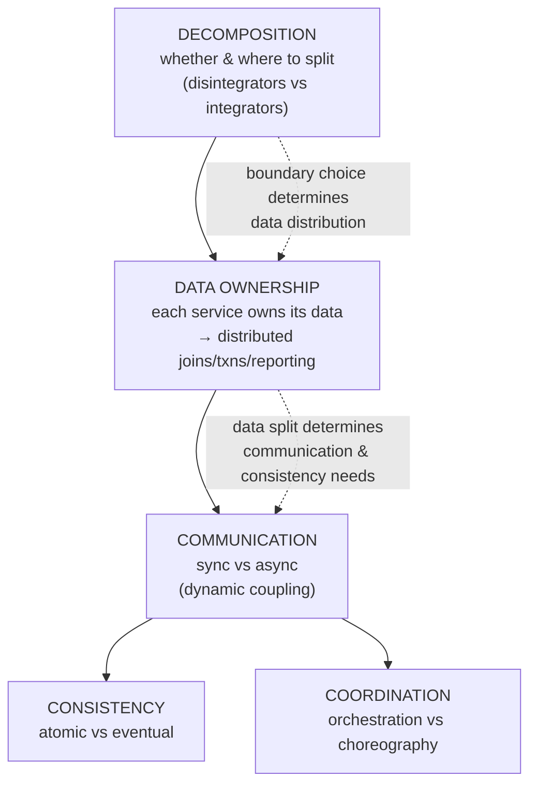
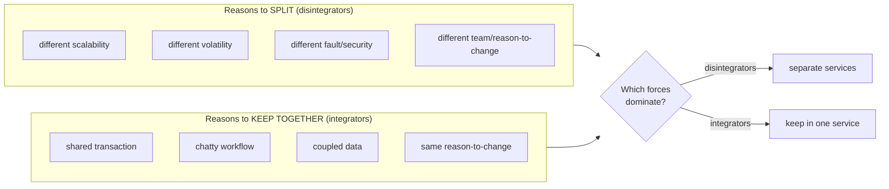

# Lesson 2.3.2 — The "Hard Parts": Decomposition, Data Ownership, Communication Tradeoffs

> Part 2: Architecture Fundamentals · Module 2.3: Decisions & Tradeoffs · Difficulty: 🔴
>
> **Prerequisites:** [2.1.1 Coupling], [2.1.3 DDD], [2.2.3 Distributed Styles], [2.2.4 EDA], [1.1.5 Tradeoffs].
> **Unlocks:** [Part 10 Consistency], [Part 11 Sagas/Transactions], [Part 12 Microservices].

---

## 1. Learning Objectives

After this lesson you will be able to:

- Explain why distributed architecture has **no best practices, only tradeoffs** — the thesis of *Software Architecture: The Hard Parts*.
- Reason about **decomposition**: when to break apart a monolith and *where* the seams go (component-based vs tactical forking).
- Apply the **data-ownership** rules and the hard problem of **distributed data** (joins, transactions, reporting across service-owned databases).
- Choose between **synchronous and asynchronous** communication and understand the **dynamic coupling** dimensions (communication, consistency, coordination).
- Recognize these as the genuinely *hard*, judgment-heavy decisions that distinguish senior architects.

---

## 2. Motivation — Where the easy answers run out

Parts 1–2 so far have given you *frameworks* with reasonably clear guidance. The "hard parts" are different: they're the decisions where **every option is bad in some way** and you must pick the *least-worst* (1.2.4) for your context. Ford, Richards, Sadalage, and Dehghani named their book *The Hard Parts* precisely because, at the architectural scale of distributed systems, **the easy, universal answers don't exist** — decomposition, data, and communication choices are irreducibly about tradeoffs.

This lesson is the bridge from "styles" (2.2) to the deep distributed-systems machinery (Parts 8–12). It frames the three hardest recurring decisions — **how to break things apart, who owns the data, and how the pieces talk** — so that when you reach consensus, consistency, and Sagas later, you understand *why* those mechanisms are needed: they're the tools for surviving the hard parts.

---

## 3. Theory — From first principles

### 3.1 The thesis: tradeoffs all the way down

> In distributed architecture, **there are no "best practices" — only tradeoffs** that depend on your specific drivers and constraints. `[BP]`

The corollary (from *The Hard Parts*): an architect's job is to *find* and *analyze* the tradeoffs (the 1.1.5 worksheet), not to recall a recipe. Anyone offering a universal "always do X" for these decisions is wrong, because the right answer flips with the driving characteristics (1.2.4). This lesson catalogs the three hardest tradeoff *spaces*.

### 3.2 Hard part #1 — Decomposition (whether and where to break apart)

**Whether to decompose** (recap 2.2.1): start monolithic; decompose only on a concrete trigger. But *when* you do, *where* do the seams go? Two approaches `[CONV]`:

- **Component-based decomposition** — first refactor the monolith into well-defined, loosely-coupled **components/modules** (a modular monolith, 2.2.1), *then* extract components into services along those clean seams. **The safer, recommended path** — you discover and stabilize boundaries in-process (cheap to move) before paying the network cost.
- **Tactical forking** — clone the monolith and *delete* what each new service doesn't need. A pragmatic but messy approach for tangled monoliths where clean extraction is hard.

**Where the seams go:** along **bounded contexts and aggregates** (2.1.3) — high-cohesion units that change together. The granularity disintegrators (reasons to *split*) vs integrators (reasons to *keep together*) `[CS]`:
- **Reasons to split (disintegrators):** different scalability needs, different volatility (rate of change), different fault-tolerance/security profiles, distinct code that changes for different reasons, different team ownership.
- **Reasons to keep together (integrators):** a database transaction must span them, tight workflow coupling (chatty calls), shared/coupled data, or the same reason-to-change.

The art is balancing these forces — **split when disintegrators dominate, keep together when integrators dominate.** Over-splitting → distributed monolith (2.1.1); under-splitting → a service that's a mini-monolith.

### 3.3 Hard part #2 — Data ownership and distributed data

This is often *the* hardest part `[BP]`, because **breaking apart the code is easy; breaking apart the data is brutal.**

**Data ownership rule:** in a distributed system (microservices especially), **each service owns its data; no shared database** (2.2.3). Ownership usually follows *writes* — the service that writes a table owns it. But this creates wicked problems:

1. **Distributed joins** — data you used to `JOIN` in one database now lives in different service-owned stores. You can no longer join in SQL. Options (each a tradeoff):
   - **API composition / data-of-data** — query each service and join in code (simple, but chatty, N+1 risk, latency).
   - **CQRS / read replicas / materialized views** — maintain a denormalized read model fed by events (fast reads, but eventual consistency + duplication — Part 9, Part 20).
   - **Data replication** — copy needed data into the service that needs it (fast, but stale + storage cost).
2. **Distributed transactions** — you can no longer wrap a multi-table change in one ACID transaction (it now spans services). Options:
   - **Avoid them** by aligning aggregates so one transaction = one service (2.1.3 — the best answer).
   - **Sagas** — a sequence of local transactions with compensating actions for rollback (eventual consistency; Part 11). Orchestrated or choreographed (2.2.4).
   - **2PC/distributed transactions** — strong consistency but blocking, fragile, poor availability under partition (Part 11) — usually avoided.
3. **Reporting/analytics** — cross-cutting queries that need *all* the data. Solved by **shipping data out** to a separate analytics store/data warehouse/lake via events or CDC (Part 9), keeping operational stores clean.

The meta-tradeoff: **data distribution forces you to choose, per query, between consistency, latency, complexity, and coupling** — there's no free lunch. This is why DDD aggregate design (2.1.3) matters so much: get the aggregate/ownership boundaries right and most of these problems shrink; get them wrong and you fight distributed data forever.

### 3.4 Hard part #3 — Communication tradeoffs (and dynamic coupling)

How do services talk? *The Hard Parts* frames this as **dynamic coupling** — the runtime coupling that arises when services communicate — along three dimensions `[CS]`:

1. **Communication: synchronous vs asynchronous.**
   - **Synchronous** (request/response, e.g., REST/gRPC): the caller waits. Simple, immediate result, easier error handling — but **temporal coupling** (caller blocks; callee must be up), and failures/latency propagate (1.1.3 tail amplification).
   - **Asynchronous** (events/messages, 2.2.4): fire-and-forget; decoupled in time; resilient and scalable — but eventual consistency, harder error handling/tracing, complexity.
2. **Consistency: atomic vs eventual.** Must all participants be consistent immediately (atomic — needs synchronous coordination or distributed transactions, costly) or can they converge over time (eventual — cheaper, more available)? This is the CAP/PACELC tradeoff (Part 10) at the communication level.
3. **Coordination: orchestration vs choreography.** Is there a central coordinator (orchestration — explicit, observable, but a coupling point) or do services react independently (choreography — decoupled, but implicit workflow)? (Exactly the 2.2.4 broker/mediator and Part 11 Saga choice.)

These three dimensions combine into communication patterns, each a tradeoff bundle. The key skill: **choose synchronous when the caller needs an immediate answer and atomicity matters; choose asynchronous + eventual when decoupling, resilience, and scale matter more** (2.2.4 §10 heuristic). Most real systems mix both, deliberately.

### 3.5 Why these are the "hard" parts (and how to approach them)

They're hard because:
- **Every option has serious downsides** — there's no choice that's strong on consistency, availability, latency, simplicity, *and* cost simultaneously (they conflict — 1.2.4).
- **They're often one-way doors** (1.1.1) — data ownership and decomposition boundaries calcify as data accumulates and teams depend on them.
- **They interact** — your decomposition determines your data distribution, which determines your communication and consistency needs. A change in one cascades.

**The approach:** apply the tradeoff worksheet (1.1.5) rigorously, ground every choice in the ranked driving characteristics (1.2.4), prefer reversible defaults, align boundaries to aggregates (2.1.3) to *minimize* distributed-data pain, and record decisions as ADRs (1.3.3). The deep mechanisms (consensus, Sagas, consistency models) you'll learn in Parts 8–12 are the *tools* for executing these hard choices — this lesson tells you *which tool a situation calls for and why*.

---

## 4. Visual Intuition

### The three hard parts and how they cascade

### Disintegrators vs integrators (where to draw the boundary)

---

## 5. Real-World Analogy

**Splitting a household into separate apartments.** Deciding *whether and where* to split (decomposition) is easy on paper but hard in practice: you'd split along natural lines — the adult child who keeps different hours and wants independence (a disintegrator: different "volatility" and ownership) — but you'd keep the shared nursery's twins together (an integrator: they need the same caregiver in one transaction). The truly brutal part is **dividing the shared finances and records** (data ownership): once you had one joint bank account and one filing cabinet (one database), separating them means deciding who owns what, how you'll reconcile shared bills (distributed transactions → you now coordinate via agreements and IOUs = Sagas), and how you'll answer "what did the whole family spend?" (reporting → you each send copies to an accountant = data warehouse). And then **how you communicate**: a quick phone call when you need an immediate answer (synchronous) vs leaving a note on the fridge others read later (asynchronous). None of these has a clean answer — every split creates coordination cost. That's why they're the hard parts.

---

## 6. Industry Example

- **Database decomposition as the hard part** `[CONV]`: *The Hard Parts* and numerous migration retrospectives identify **splitting the shared database** — not the code — as the dominant difficulty in monolith→microservices journeys; teams that split code but kept a shared DB built distributed monoliths (2.2.3).
- **Sagas over distributed transactions** `[CONV]`: the industry consensus (Richardson, *Microservices Patterns*; Newman) is to **avoid 2PC** across services and use **Sagas** with compensation for cross-service consistency — accepting eventual consistency to preserve availability (Part 11).
- **CQRS + events for distributed queries** `[CONV]`: maintaining denormalized read models fed by events (Part 9) is the standard answer to "I can't JOIN across services" — used widely for feeds, search, and reporting (Parts 18, 20).
- **CDC to analytics** `[CONV]`: change-data-capture pipelines streaming operational data into warehouses/lakes (e.g., Debezium-style → Kafka → warehouse) is the documented pattern for cross-service reporting without coupling operational stores (Part 9).

---

## 7. Implementation Details — Navigating each hard part

**Decomposition:**
- Prefer **component-based** decomposition: modularize in-process first (modular monolith), stabilize boundaries, then extract via **strangler fig** (12.9).
- Weigh **disintegrators vs integrators** per candidate boundary; align to **bounded contexts/aggregates** (2.1.3). Start coarser (2.2.3).
- If the monolith is too tangled to modularize cleanly, **tactical forking** is a pragmatic fallback.

**Data ownership:**
- One owner per data set (the writer); others read via API/events, never the DB.
- **Align aggregates so one transaction = one service** to avoid distributed transactions (the highest-leverage move).
- For cross-service queries: **API composition** (simple/chatty) vs **CQRS read models** (fast/eventual) vs **replication** (fast/stale) — choose per query's consistency/latency needs.
- For cross-service consistency: **Sagas** (orchestrated or choreographed; Part 11), not 2PC.
- For reporting: **ship data out** via events/CDC to a separate analytics store (Part 9).

**Communication:**
- Choose **sync** when the caller needs an immediate answer and/or atomicity (queries, user-blocking operations); **async** when decoupling, resilience, and scale dominate (2.2.4).
- Decide **consistency** (atomic vs eventual) and **coordination** (orchestration vs choreography) per workflow, consciously.
- Add resilience to all synchronous calls (timeouts, retries, circuit breakers — Part 11) since they propagate failure.

**Always:** run the tradeoff worksheet (1.1.5), ground in driving characteristics (1.2.4), prefer reversible defaults, record ADRs (1.3.3).

---

## 8. Advantages (of treating these as tradeoffs)

- **Context-appropriate decisions** instead of cargo-culted recipes that fit someone else's drivers.
- **Fewer distributed-data disasters** — aligning aggregates and choosing the right query/consistency pattern prevents the worst pain.
- **Defensible architecture** — every hard choice traced to drivers and tradeoffs (review/interview-ready).
- **Right communication coupling** — sync/async chosen deliberately, not by default.

---

## 9. Disadvantages / Costs

- **High cognitive load** — these decisions are genuinely hard and require deep understanding (Parts 8–12).
- **No formula** — judgment-heavy; reasonable architects disagree.
- **Expensive to reverse** — data-ownership and decomposition mistakes are often one-way doors.
- **Interaction complexity** — the three hard parts entangle, so a change in one ripples.

---

## 10. When NOT to over-engineer

- **Monoliths/modular monoliths** — most of these hard parts *don't apply* (one database, in-process calls, real transactions). This is a major reason to stay monolithic until forced (2.2.1) — you avoid the hard parts entirely.
- **Small/early systems** — don't pre-solve distributed-data problems you don't have.
- **When integrators dominate** — if a transaction must span two things, *don't split them*; the hard part is avoided by keeping them together.

---

## 11. Common Mistakes

1. **Seeking a "best practice"** for these decisions instead of analyzing the tradeoff (the thesis violation).
2. **Splitting the code but sharing the database** → distributed monolith (2.2.3) — the cardinal data-ownership sin.
3. **Reaching for distributed transactions (2PC)** across services instead of aligning aggregates or using Sagas.
4. **Over-splitting** (ignoring integrators) → chatty distributed joins and untraceable workflows.
5. **Defaulting all communication to synchronous** → cascading failures and tight temporal coupling (Part 11).
6. **No plan for cross-service reporting** → analysts querying operational stores and destabilizing them.
7. **Decomposing a tangled monolith directly** (skipping the modularize-first step) → wrong, leaky boundaries.

---

## 12. Interview Questions

**🟢 Easy**
- Why does *The Hard Parts* say there are "no best practices, only tradeoffs" in distributed architecture?
- Name two reasons to split a service and two reasons to keep functionality together.

**🟡 Medium**
- After splitting a monolith, you can no longer JOIN two tables that now live in different services. What are your options, and what does each trade off?
- Compare synchronous and asynchronous communication along temporal coupling, failure handling, and consistency.

**🔴 Hard**
- Design the data strategy for an order system split into Order, Inventory, and Payment services: how do you handle the place-order transaction (no 2PC), how do you answer "show order + inventory + payment status" queries, and how do you do cross-service reporting?
- Walk through choosing a service boundary using disintegrators vs integrators for a module that has different scalability needs but shares a transaction with its neighbor. Which force wins, and why?

**⚫ Staff+**
- You're decomposing a large monolith. Lay out the full strategy across all three hard parts: decomposition approach (component-based vs tactical forking), data-ownership and distributed-data plan (joins, transactions, reporting), and communication/consistency/coordination choices — and explain which decisions are one-way doors needing the most rigor.
- Critique the reflex to use Sagas everywhere. When is eventual consistency genuinely unacceptable, and what are your options when a business operation truly needs atomicity across services? (Tie to Parts 10–11.)

---

## 13. Production Pitfalls

- **The shared-database distributed monolith:** services split in code but coupled through one DB; a schema change breaks distant services and no one can deploy independently (2.2.3).
- **Saga consistency bugs:** a multi-service operation partially completes and compensation is missing/buggy, leaving the system in an invalid state (Part 11).
- **Distributed-join latency/N+1:** API composition fanning out to many services per request, blowing up tail latency (1.1.3) and cascading failures.
- **Reporting on operational stores:** heavy analytics queries hitting service databases, causing latency spikes and incidents (fix: CDC to a warehouse, Part 9).
- **2PC fragility:** a distributed transaction coordinator blocking or failing mid-commit, locking resources and reducing availability (Part 11).

---

## 14. Optimization Techniques

- **Align aggregates so one transaction = one service** — the single highest-leverage move to avoid distributed transactions (2.1.3).
- **Modularize before distributing** — discover boundaries cheaply in-process (2.2.1).
- **Use CQRS read models / materialized views** (events/CDC-fed) for cross-service queries instead of synchronous fan-out joins (Part 9, Part 20).
- **Ship data to a warehouse/lake** for reporting; keep operational stores clean (Part 9 CDC).
- **Prefer Sagas + idempotency over 2PC**; choose orchestration for complex/compensable flows, choreography for simple reactions (Parts 11, 2.2.4).
- **Add resilience to all sync calls** (timeout/retry/circuit breaker) and prefer async where decoupling helps (Part 11).
- **Record every hard decision as an ADR** with its tradeoff and reversal trigger (1.3.3).

---

## 15. Summary

The "hard parts" of distributed architecture are the decisions where **every option carries serious downsides, so there are no best practices — only tradeoffs** to analyze against your driving characteristics. There are three recurring hard spaces. **Decomposition:** whether to split (only on triggers, 2.2.1) and *where* — balancing **disintegrators** (different scalability/volatility/fault-profile/team) against **integrators** (shared transaction, chatty workflow, coupled data), aligned to bounded contexts/aggregates, via the safer component-based approach (modularize first, extract second). **Data ownership:** each service owns its data (no shared DB), which makes the *data* far harder to split than the code — forcing tradeoff-laden answers for **distributed joins** (API composition vs CQRS vs replication), **distributed transactions** (align aggregates → avoid them; else Sagas, not 2PC), and **reporting** (ship data out via events/CDC). **Communication:** the **dynamic-coupling** choices of **sync vs async**, **atomic vs eventual** consistency, and **orchestration vs choreography** — each a tradeoff bundle chosen per workflow. These parts are hard because the options conflict, they're often one-way doors, and they entangle (decomposition → data distribution → communication). The way through is disciplined tradeoff analysis (1.1.5), grounding in ranked drivers (1.2.4), aligning aggregates to minimize distributed-data pain, preferring reversible defaults, and recording ADRs — with the deep mechanisms of Parts 8–12 as the tools you'll wield to execute these choices.

---

## 16. Revision Notes (flashcard-ready)

- **Q:** Thesis of *The Hard Parts*? **A:** No best practices in distributed architecture — only tradeoffs for your context.
- **Q:** The three hard parts? **A:** Decomposition, data ownership/distributed data, communication.
- **Q:** Disintegrators vs integrators? **A:** Reasons to split (diff scalability/volatility/fault/team) vs keep together (shared txn, chatty, coupled data, same reason-to-change).
- **Q:** Safer decomposition approach? **A:** Component-based — modularize in-process first, then extract (vs tactical forking).
- **Q:** Hardest part of decomposition? **A:** Splitting the *data*, not the code.
- **Q:** Distributed-join options? **A:** API composition (chatty), CQRS read model (fast/eventual), replication (stale).
- **Q:** Cross-service transaction approach? **A:** Align aggregates to avoid them; else Sagas (not 2PC).
- **Q:** Cross-service reporting? **A:** Ship data out via events/CDC to a warehouse/lake.
- **Q:** Dynamic-coupling dimensions? **A:** Communication (sync/async), consistency (atomic/eventual), coordination (orchestration/choreography).
- **Q:** Best way to avoid distributed transactions? **A:** Align aggregate boundaries so one transaction = one service.

---

## 17. Further Reading + Knowledge-Graph Links

**Within this platform**
- **Previous:** [2.3.1 Style Selection]. **Next:** [2.3.3 Technical Debt & Evolutionary Architecture].
- **Builds on:** [2.1.3 DDD aggregates] (boundaries/ownership), [2.2.3 Distributed styles] (the tax), [2.2.4 EDA] (orchestration/choreography).
- **Deep dives (the tools):** [Part 10 Consistency/CAP/PACELC], [Part 11 Distributed Transactions, Sagas, Idempotency], [Part 9 Events/CDC/CQRS], [Part 12 Microservices data & communication].

**Foundational texts (synthesized)**
- Ford, Richards, Sadalage, Dehghani, *Software Architecture: The Hard Parts* — decomposition (disintegrators/integrators, component-based vs tactical forking), distributed data ownership, dynamic coupling (communication/consistency/coordination).
- Richardson, *Microservices Patterns* — Sagas, CQRS, API composition for distributed data.
- Newman, *Building Microservices* — splitting the database, data ownership.
- Kleppmann, *DDIA* — distributed transactions, CDC, derived/materialized data.

**Concept tags:** `[BP]` no best practices/only tradeoffs, align aggregates to avoid distributed txns, modularize-before-distributing · `[CS]` disintegrators/integrators, dynamic coupling dimensions · `[CONV]` Sagas over 2PC, CQRS for distributed queries, CDC for reporting.
