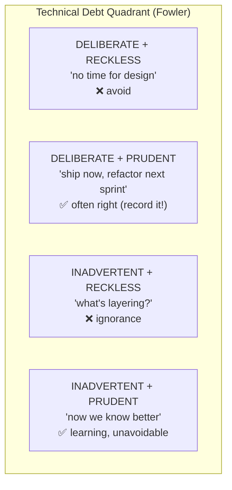
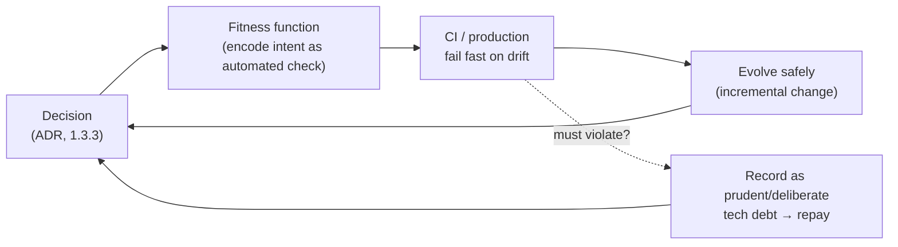

# Lesson 2.3.3 — Technical Debt, Fitness Functions, and Evolutionary Architecture

> Part 2: Architecture Fundamentals · Module 2.3: Decisions & Tradeoffs · Difficulty: 🟡🔴 · **Completes Module 2.3**
>
> **Prerequisites:** [1.2.2 Maintainability/Evolvability], [1.3.3 ADRs], [2.1.1 Coupling].
> **Unlocks:** [2.4 LLD], [Part 12 Microservices evolution], [Part 14 SRE], ongoing architecture governance.

---

## 1. Learning Objectives

After this lesson you will be able to:

- Define **technical debt** precisely, distinguish *deliberate vs inadvertent* and *prudent vs reckless* debt (the debt quadrant), and decide when taking it on is rational.
- Explain **evolutionary architecture**: designing for **guided, incremental change** as a first-class goal rather than a one-time big design.
- Define and write **fitness functions** — automated, objective checks that protect architecture characteristics from erosion over time.
- Connect these to ADRs (1.3.3) and the whole Part-1 mindset: architecture is a living thing that must be *governed*, not just designed once.

---

## 2. Motivation — Architecture decays unless governed

Every prior lesson produced a *decision* — a style, a boundary, a coupling choice. But here's the uncomfortable truth: **architecture erodes.** The clean modular monolith (2.2.1) decays into a ball of mud; the loose coupling (2.1.1) tightens as people take shortcuts; the bounded contexts (2.1.3) blur. Requirements change (1.1.1 — design is a loop), deadlines force compromises (technical debt), and entropy wins unless something actively resists it.

This lesson is about **keeping architecture healthy over time**:
- **Technical debt** is the vocabulary for the compromises you make (sometimes wisely) under pressure.
- **Evolutionary architecture** is the philosophy that change is constant, so you should design *for* change and guide it.
- **Fitness functions** are the *mechanism* — automated guardrails that catch erosion before it becomes a ball of mud.

Together they're how a system stays evolvable (1.2.2) for years instead of calcifying. This is the governance layer that makes all the earlier decisions *durable*, and it completes Module 2.3's theme: decisions aren't one-time; they must be maintained.

---

## 3. Theory — From first principles

### 3.1 Technical debt — the metaphor and its precision

> **Technical debt** (Ward Cunningham's metaphor) is the implied future cost of choosing an easier/faster solution now instead of a better one that would take longer. Like financial debt, it accrues **interest** — the ongoing extra cost of working around the shortcut. `[CS]`

Crucially, **debt isn't always bad** — sometimes borrowing is the right business decision (ship now to learn/survive). The key is *which kind*. Martin Fowler's **technical-debt quadrant** `[CONV]`:

| | **Reckless** | **Prudent** |
|---|---|---|
| **Deliberate** | "We don't have time for design." (bad — knowingly cutting corners with no plan) | "We must ship now and will refactor next sprint." (often *right* — conscious, planned) |
| **Inadvertent** | "What's layering?" (ignorance — the team didn't know better) | "Now we know how it *should* have been done." (learning — unavoidable, healthy) |

- **Prudent + deliberate** debt is a legitimate tool (a 1.1.5 tradeoff: time-to-market ↔ maintainability) — *if* it's recorded and repaid.
- **Reckless** debt (either kind) is the problem — it accumulates silently into a ball of mud (1.2.2 accidental complexity).
- **The danger is invisibility:** undocumented debt becomes indistinguishable from incompetence (recall 1.1.1, 1.3.3). **Make debt visible** — record it (a "tech-debt backlog," ADRs, code comments) so it's a *decision*, not an accident, and can be prioritized for repayment.

**Managing debt:** track it; pay "interest" awareness into planning; repay high-interest debt (the shortcuts that slow you most) deliberately; and *prevent reckless debt* with the practices below (fitness functions, reviews). You never pay it *all* off — the goal is keeping it at a level where velocity stays healthy (tie to SRE's sustainable pace, Part 14).

### 3.2 Evolutionary architecture — change as a first-class concern

> **Evolutionary architecture** (Ford, Parsons, Kua) is one that supports **guided, incremental change across multiple dimensions** as a first-class principle. `[CS]`

The premise rejects "big design up front" as the sole approach: you *cannot* predict all future requirements (1.1.1 — uncertainty), so instead of designing the perfect architecture once, you design one that's **safe and cheap to change**, and you *guide* its evolution. Three key words:
- **Guided** — change is directed toward goals, not random drift (that's where fitness functions come in).
- **Incremental** — change happens in small, safe steps (enabled by modularity 2.1.1, CI/CD Part 13, automated tests).
- **Multiple dimensions** — evolvability isn't just code; it spans data (schema evolution, Part 4.3), integration contracts, operations, security, etc.

This is the *active* form of the evolvability quality attribute (1.2.2): not just "the architecture *can* change cheaply" but "we have a system that *guides* it as it changes." It connects directly to monolith-first/strangler-fig (2.2.1, 12.9) — start simple, evolve as understanding and load grow — and to ADRs (1.3.3), which record *why* the architecture is the way it is so future evolution is informed.

### 3.3 Fitness functions — the mechanism that guides evolution

> An **architectural fitness function** is an **objective, automated** assessment of how well the architecture meets a desired characteristic. `[CS]` (Borrowed from genetic algorithms, where a "fitness function" measures how close a solution is to the goal.)

Fitness functions are to *architecture* what unit tests are to *code*: automated checks that **fail the build when the architecture drifts** from its intended characteristics. They turn the abstract "-ilities" (1.2) into *enforceable, continuously-verified* rules — the antidote to erosion. Types:

- **By scope:**
  - **Atomic** — test one characteristic in isolation (e.g., "module A must not import module B's internals" — enforcing coupling rules, 2.1.1).
  - **Holistic** — test combined characteristics under realistic conditions (e.g., end-to-end latency under load).
- **By trigger:**
  - **Triggered** — run on an event (in CI, on commit, in tests).
  - **Continuous** — run constantly in production (e.g., monitoring/SLO checks — Part 14, 16).
- **By nature:** static (code analysis, dependency rules), dynamic (performance/latency tests), manual (rare; a human review step encoded as a gate).

**Concrete examples:**
- *Coupling/structure:* "the `domain` package must not depend on `infrastructure`" (enforces Hexagonal/Clean, 2.1.2; cohesion/coupling, 2.1.1) — via tools like ArchUnit/dependency-cruiser.
- *No cyclic dependencies* between modules.
- *Performance:* "p99 of endpoint X must stay < 150 ms" in a load test (1.1.3).
- *Security/compliance:* "no public storage buckets," "all PII fields encrypted" (policy-as-code, 1.2.3).
- *Resilience:* a chaos experiment asserting the system survives a node loss (Part 14).
- *Scalability:* "no service may share another's database" (enforces data ownership, 2.2.3/2.3.2).

The payoff: characteristics you *care* about (and the ADR decisions you made, 1.3.3) are **protected automatically and continuously**, so the architecture can evolve *without* silently degrading. This is what makes "guided" evolution real rather than aspirational.

### 3.4 How the three fit together (the governance loop)

```
ADR (1.3.3): record the decision + intended characteristic
   ↓
Fitness function: encode that intent as an automated check
   ↓
CI/production: continuously verify; fail fast on drift
   ↓
Evolutionary architecture: change safely & incrementally, guarded by the above
   ↓
Technical debt: when you must violate intent, record it as prudent/deliberate debt → repay
```

This loop is how the *one-time decisions* of Parts 1–2 become a *living, governed* architecture. Without it, every decision degrades; with it, the system stays as evolvable at year five as at month one.

### 3.5 The tradeoffs (this isn't free either)

- Fitness functions cost effort to write and maintain; too many/too strict and they become friction (false positives, slowing delivery) — a simplicity/governance tradeoff (1.1.5).
- Evolutionary architecture's "design for change" can tip into **speculative generality** (over-abstraction, 1.2.2 §11) if misapplied — you design for *changeability*, not for *every imagined future feature*.
- Some debt is fine; obsessively repaying *all* debt wastes effort better spent on features. The skill is *prioritizing* by interest rate.

---

## 4. Visual Intuition

### The technical-debt quadrant



### The governance loop



---

## 5. Real-World Analogy

**Maintaining a house over decades.** **Technical debt** is like deferring maintenance: skipping a paint job to save money now is fine *if* you plan to do it before the wood rots (prudent, deliberate) — but ignoring a small leak because you don't notice it (inadvertent, reckless) compounds into structural damage and a far bigger bill (interest). Smart owners keep a **maintenance log** (record the debt) so deferred work is a *choice*, not a surprise. **Evolutionary architecture** is designing the house so it's *easy to renovate* — standard fittings, accessible wiring, room to extend — because you know the family's needs will change, rather than building one rigid configuration. **Fitness functions** are the **inspections and smoke detectors**: automated, objective checks (the annual inspection, the alarm that trips on smoke) that catch problems early and *fail loudly* before the house burns down — so the home can be safely renovated again and again without slowly degrading into a hazard.

---

## 6. Industry Example

- **Fitness functions in practice** `[CONV]`: tools like **ArchUnit** (Java), **dependency-cruiser** (JS), and architecture-linting are widely used to enforce layering/coupling rules in CI (e.g., "controllers must not access repositories directly," "no cyclic dependencies"). ThoughtWorks (where the concept originated) and many orgs treat them as standard governance.
- **Policy-as-code** `[CONV]`: cloud/security fitness functions (OPA/Conftest, `tfsec`, cloud config rules) fail builds on non-compliant infrastructure (no public buckets, encryption required) — security/compliance characteristics (1.2.3) enforced continuously.
- **SLOs as continuous fitness functions** `[BP]`: Google SRE's SLO/error-budget monitoring (Part 14) is a *continuous holistic* fitness function for availability/latency — the architecture is "fit" while it meets its SLOs.
- **Technical-debt management** `[CONV]`: many engineering orgs maintain explicit tech-debt backlogs and allocate a fixed fraction of capacity to repayment — operationalizing the quadrant (prudent debt, deliberately repaid).
- **Evolutionary architecture** `[BP]`: the strangler-fig migration pattern (Fowler; 12.9) and incremental monolith→services evolution (2.2.1, 2.2.3) are evolutionary architecture in action.

---

## 7. Implementation Details — Putting it to work

**Technical debt:**
- **Make it visible:** a tech-debt backlog/register; mark deliberate debt in ADRs (1.3.3) and code (`// DEBT: ...` with a ticket link).
- **Classify** with the quadrant; only *prudent + deliberate* debt should be intentional, and always with a repayment plan.
- **Prioritize repayment by interest rate** — fix the shortcuts that most slow current work or most increase risk first.
- **Budget capacity** for repayment (e.g., a standing fraction each iteration) so debt doesn't compound to a crisis.

**Evolutionary architecture:**
- Enable cheap, safe change: strong modularity (2.1.1), automated tests, CI/CD (Part 13), backward-compatible contracts/schema evolution (Part 4.3), feature flags.
- Evolve incrementally (strangler fig, 12.9; monolith→service-based→microservices, 2.2.3) rather than big-bang rewrites.
- Design for *changeability*, not speculative features (avoid over-abstraction, §3.5).

**Fitness functions:**
- For each *driving* characteristic (1.2.4) and key ADR decision, write a fitness function that encodes it.
- **Static/structural:** dependency rules, no-cycles, package-access rules (ArchUnit-style) in CI.
- **Dynamic:** performance/latency assertions in load tests (1.1.3); chaos experiments for resilience (Part 14).
- **Continuous:** SLO/burn-rate alerts in production (Parts 14, 16); policy-as-code for security/compliance (1.2.3).
- **Fail the build/alert** on violation; keep the set lean to avoid friction (§3.5).

**The loop:** ADR → fitness function → CI/prod verification → safe evolution → (record new debt if intent must be violated). Run it continuously.

---

## 8. Advantages

- **Architecture stays healthy over time** — erosion is caught automatically, not discovered in an incident.
- **Debt becomes a managed decision**, not silent rot — preserving velocity (1.2.2).
- **Safe, continuous change** — you can evolve confidently because guardrails catch regressions.
- **Objective governance** — fitness functions replace subjective "is this still good architecture?" debates with automated facts.
- **Protects ADR decisions** — the *why* is enforced, not just documented.

---

## 9. Disadvantages / Costs

- **Effort to build/maintain** fitness functions and debt tracking; they're code too.
- **Friction risk** — too many/too-strict functions cause false positives and slow delivery (a tradeoff, §3.5).
- **Speculative-generality trap** — misapplying "design for change" into over-abstraction (1.2.2).
- **Discipline required** — debt registers and repayment budgets only work if the org actually honors them; otherwise they're theater.

---

## 10. When NOT to over-apply

- **Tiny/throwaway systems** — don't build a fitness-function suite for a prototype you'll delete.
- **Very early stage** — some deliberate reckless-looking debt may be acceptable to find product-market fit *fast* (but keep a minimal baseline and record it).
- **Over-governance** — a startup with 5 engineers doesn't need dozens of architecture-linting rules; add fitness functions for the few characteristics that actually matter and grow the set with the system.

---

## 11. Common Mistakes

1. **Invisible debt** — taking shortcuts without recording them; they become indistinguishable from incompetence and compound into mud.
2. **Treating all debt as bad** (or all as fine) — missing the quadrant nuance; prudent deliberate debt is a tool, reckless debt is the enemy.
3. **Never repaying** — letting prudent debt become permanent because there's no repayment budget.
4. **Big-design-up-front rigidity** — trying to design the perfect architecture once instead of evolving it.
5. **No fitness functions** — relying on code review and good intentions to prevent erosion (they don't, at scale).
6. **Too many/too-strict fitness functions** — creating friction and false positives until the team ignores or disables them.
7. **Design-for-change → speculative generality** — over-abstracting for imagined futures (1.2.2 §11).

---

## 12. Interview Questions

**🟢 Easy**
- What is technical debt, and is it always bad? Explain with the quadrant.
- What is a fitness function, and how is it analogous to a unit test?

**🟡 Medium**
- Give three concrete fitness functions you'd add to protect a layered/hexagonal architecture from eroding.
- Explain evolutionary architecture. How does it relate to monolith-first and strangler-fig (2.2.1, 12.9)?

**🔴 Hard**
- Design a governance setup for a 20-service system: which architecture characteristics get fitness functions, what kind (static/dynamic/continuous), and how you'd prevent both erosion *and* governance friction.
- A team has accumulated crippling technical debt. Lay out how you'd make it visible, classify it, prioritize repayment by interest, and prevent recurrence — while still shipping features.

**⚫ Staff+**
- Build the full governance loop for an org: ADRs → fitness functions → CI/production enforcement → debt management. How do you keep architecture decisions *durable* as teams and requirements change over years, and how do you balance governance against delivery velocity (tie to error budgets, Part 14)?
- Critique "design for change." When does evolutionary architecture pay off, and when does it degrade into speculative generality and accidental complexity? How do you tell the difference in a real codebase?

---

## 13. Production Pitfalls

- **Silent architecture erosion:** without fitness functions, coupling creeps in commit by commit until the once-modular system is a ball of mud — discovered only when velocity has already collapsed (1.2.2).
- **Debt crisis:** unrecorded, unrepaid debt compounding until a "we must rewrite everything" moment — usually avoidable with visible tracking and steady repayment.
- **Disabled guardrails:** fitness functions so noisy/strict that the team disables them, removing all protection (governance friction, §3.5).
- **Shared-DB drift:** without a "no shared database" fitness function, microservices quietly start reading each other's tables → distributed monolith (2.2.3, 2.3.2).
- **SLO blind spots:** no continuous fitness functions (SLO monitoring) in production, so reliability degrades unnoticed (Part 14).

---

## 14. Optimization Techniques

- **Encode every driving characteristic and key ADR as a fitness function** — protect what matters, automatically.
- **Keep the fitness-function set lean and high-signal** — enforce the few rules that prevent real erosion; avoid noise.
- **Maintain a tech-debt register + repayment budget** (a fixed capacity fraction) so debt stays manageable.
- **Prioritize debt by interest rate** — repay the shortcuts slowing you most/raising risk most first.
- **Pair ADRs with fitness functions** (1.3.3) — decision recorded *and* enforced.
- **Use continuous fitness functions in production** (SLOs, policy-as-code) for characteristics that can only be verified live (Parts 14, 16).
- **Evolve incrementally** (strangler fig) and design for *changeability*, not speculative features.

---

## 15. Summary

Architecture is a **living thing that erodes unless governed** — this lesson provides the governance. **Technical debt** is the future cost of choosing the faster solution now; it's not inherently bad — Fowler's quadrant distinguishes **prudent + deliberate** debt (a legitimate time-to-market tradeoff, *if recorded and repaid*) from **reckless** debt (silent rot that compounds into a ball of mud). The cardinal rule: **make debt visible** so it's a managed decision, not an accident, and repay it by *interest rate*. **Evolutionary architecture** treats **guided, incremental change across multiple dimensions** as a first-class goal — since you can't predict the future, design for *changeability* and *guide* the evolution (the active form of evolvability, 1.2.2; the basis of monolith-first and strangler-fig). **Fitness functions** are the mechanism: objective, automated checks (atomic/holistic, triggered/continuous, static/dynamic) that **fail the build or alert when the architecture drifts** from its intended characteristics — unit tests for architecture, turning the abstract "-ilities" and your ADR decisions into continuously-enforced guardrails. Together they form the governance loop — **ADR → fitness function → CI/production enforcement → safe incremental evolution → record new prudent debt when needed** — which is what keeps the carefully-made decisions of Parts 1–2 *durable* and the system as evolvable at year five as at month one. **This completes Module 2.3** (decisions & tradeoffs) and the architecture-styles/governance arc; next is Module 2.4, where we zoom into Low-Level Design.

---

## 16. Revision Notes (flashcard-ready)

- **Q:** Technical debt? **A:** Future cost of choosing the easier/faster solution now; accrues "interest."
- **Q:** Fowler's debt quadrant axes? **A:** Deliberate vs inadvertent × reckless vs prudent. Prudent+deliberate is OK (record + repay); reckless is the enemy.
- **Q:** Biggest danger with debt? **A:** Invisibility — unrecorded debt looks like incompetence and compounds.
- **Q:** Evolutionary architecture? **A:** Architecture that supports guided, incremental change across multiple dimensions as a first-class concern.
- **Q:** Fitness function? **A:** An objective, automated check of how well the architecture meets a desired characteristic — "unit test for architecture."
- **Q:** Fitness-function types? **A:** Atomic/holistic (scope), triggered/continuous (timing), static/dynamic (nature).
- **Q:** Example structural fitness function? **A:** "domain must not import infrastructure"; "no cyclic dependencies"; "no shared DB across services."
- **Q:** The governance loop? **A:** ADR → fitness function → CI/prod enforcement → safe evolution → record prudent debt if intent must be violated.
- **Q:** SLOs are which kind of fitness function? **A:** Continuous + holistic (production).

---

## 17. Further Reading + Knowledge-Graph Links

**Within this platform**
- **Previous:** [2.3.2 The Hard Parts]. **Completes Module 2.3.** Next: [2.4.1 SOLID/GRASP] (LLD).
- **Builds on:** [1.2.2 Evolvability/Maintainability], [1.3.3 ADRs] (paired with fitness functions), [2.1.1 Coupling rules] (enforced by fitness functions), [2.1.2 Hexagonal] (dependency-rule fitness functions).
- **Applied in:** [Part 13 CI/CD], [Part 14 SRE/SLOs as continuous fitness functions], [Part 12 microservice evolution], [2.2.1 strangler-fig evolution].

**Foundational texts (synthesized)**
- Ford, Parsons, Kua, *Building Evolutionary Architecture* — evolutionary architecture and fitness functions (atomic/holistic, triggered/continuous).
- Cunningham (the debt metaphor) and Fowler ("TechnicalDebtQuadrant") — technical debt classification.
- Richards & Ford, *Fundamentals of Software Architecture* — fitness functions for governing characteristics.
- Beyer et al., *SRE* — SLOs/error budgets as continuous fitness functions (Part 14).

**Concept tags:** `[CS]` technical debt metaphor, evolutionary architecture, fitness functions · `[CONV]` debt quadrant, ArchUnit/policy-as-code, tech-debt backlogs · `[BP]` make debt visible + repay by interest, pair ADRs with fitness functions, design for changeability not speculation.
