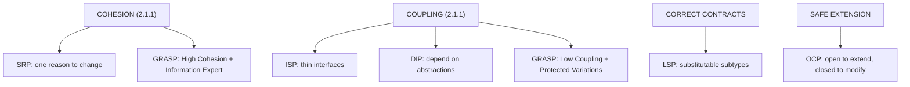
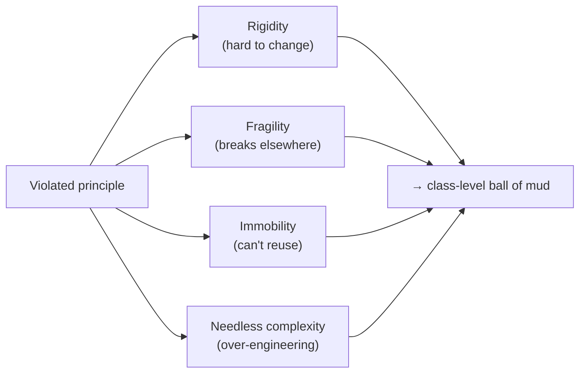

# Lesson 2.4.1 — SOLID, GRASP, and Design Smells

> Part 2: Architecture Fundamentals · Module 2.4: Low-Level Design · Difficulty: 🟡
>
> **Prerequisites:** [2.1.1 Cohesion/Coupling/Connascence], [2.1.2 DIP/Hexagonal].
> **Unlocks:** [2.4.2 Design Patterns], [2.4.4 LLD Case Studies], better class-level design everywhere.

---

## 1. Learning Objectives

After this lesson you will be able to:

- Apply the five **SOLID** principles correctly and explain each as a specific application of cohesion/coupling (2.1.1).
- Use the **GRASP** principles (esp. *Information Expert*, *Controller*, *Low Coupling*, *High Cohesion*) to decide **which class gets which responsibility**.
- Recognize common **design smells** (rigidity, fragility, immobility, needless complexity) and the code smells that signal them.
- Understand that LLD is the *same physics* as HLD (2.1.1) at the class/object scale — and avoid dogmatic over-application.

---

## 2. Motivation — Good systems are built from good objects

System design interviews and real systems both have a **low-level design (LLD)** dimension: how the classes and objects *inside* a component are structured. A beautifully architected system (Parts 1–2 so far) can still rot internally if its classes are tangled, god-like, and rigid. SOLID and GRASP are the principles that keep *class-level* design healthy — and they're not separate from everything you've learned: **they're cohesion, coupling, and connascence (2.1.1) applied at the object scale.**

This matters for two reasons: (1) many interviews have a dedicated LLD round (design a parking lot, a rate limiter — 2.4.4), and (2) the internal quality of every service determines its maintainability and evolvability (1.2.2). Getting LLD right is how the abstract "high cohesion, low coupling" becomes concrete code. This lesson is the principles; 2.4.2 (patterns) and 2.4.4 (case studies) are the application.

---

## 3. Theory — From first principles

### 3.1 SOLID (Robert C. Martin) — five principles for class design

Each SOLID principle is really a *specific tactic* for high cohesion and low coupling `[CS]`:

**S — Single Responsibility Principle (SRP).**
> A class should have **one reason to change** — i.e., be responsible to one actor/stakeholder.

This is **cohesion** (2.1.1) at the class level: a class doing reporting *and* persistence *and* validation changes for three unrelated reasons → low cohesion, fragile. Split responsibilities so each class has one cohesive purpose. (Caveat: don't over-split into anemic fragments — "one reason to change," not "one method per class.")

**O — Open/Closed Principle (OCP).**
> Software entities should be **open for extension, closed for modification.**

Add new behavior by adding new code (new subclasses/implementations), not by editing existing, tested code. Achieved via **polymorphism/abstraction** — the basis of the strategy pattern (2.4.2) and the microkernel style (2.2.2). Reduces the risk of breaking working code when requirements grow.

**L — Liskov Substitution Principle (LSP).**
> Subtypes must be **substitutable** for their base types without breaking correctness.

If `S` is a subtype of `T`, code using `T` must work with `S` unchanged. Violations (a subclass that throws on a method the base supports, or weakens a guarantee) mean your inheritance hierarchy is *lying* — a correctness/connascence problem. The classic example: `Square extends Rectangle` breaks LSP because setting width/height independently violates `Square`'s invariant. Favor composition or correct modeling over inheritance that breaks substitutability.

**I — Interface Segregation Principle (ISP).**
> Clients shouldn't be forced to depend on methods they don't use.

Prefer many small, focused interfaces over one fat interface. A class implementing a huge interface but only needing part of it has needless coupling (stamp/control coupling, 2.1.1). Segregate so each client depends only on what it uses.

**D — Dependency Inversion Principle (DIP).**
> Depend on **abstractions**, not concretions; high-level modules and low-level modules both depend on abstractions.

This is the engine of Hexagonal/Clean architecture (2.1.2): the domain defines interfaces; infrastructure implements them. At the class level: depend on an interface, inject the concrete implementation. Enables testing (inject fakes) and swapping implementations — low coupling.

> Mnemonic: **S**RP=cohesion, **O**CP=extend-don't-modify, **L**SP=honest subtypes, **I**SP=thin interfaces, **D**IP=depend on abstractions. Three of the five (SRP, ISP, DIP) are *directly* about coupling/cohesion; OCP and LSP are about safe extension and correctness.

### 3.2 GRASP (Craig Larman) — assigning responsibilities

SOLID tells you *qualities* good classes have; **GRASP** (General Responsibility Assignment Software Patterns) helps you decide **which class should do what** — the actual hard question in LLD `[CS]`. The key ones:

- **Information Expert** — assign a responsibility to the class that *has the information* needed to fulfill it. (E.g., `Order` computes its own total because it has the line items.) The default heuristic for *where* logic goes — keeps behavior with data (high cohesion), avoiding anemic models.
- **Creator** — the class that should *create* an object is one that aggregates/contains/closely uses it. (E.g., `Order` creates `OrderLine`.)
- **Controller** — assign the responsibility of handling a system event/use-case to a coordinating "controller" object (not the UI, not the domain entity) — the entry point for a use case (relates to the application layer, 2.1.2).
- **Low Coupling** & **High Cohesion** — GRASP names these explicitly as principles to evaluate every assignment against (it *is* 2.1.1).
- **Polymorphism** — handle type-based variation with polymorphism, not conditionals (OCP enabler).
- **Pure Fabrication** — when no domain class is a good home for a responsibility, invent a service/helper class to keep cohesion (e.g., a `PersistenceService`) rather than polluting a domain class.
- **Indirection** — introduce an intermediary to decouple two things (e.g., an adapter — 2.1.2).
- **Protected Variations** — wrap points of likely change behind a stable interface (the unifying principle behind OCP, DIP, encapsulation).

GRASP is the **reasoning toolkit** for LLD: faced with "where does this method go?", ask *who's the information expert?* and *does this keep coupling low and cohesion high?*

### 3.3 Design smells (Martin) — symptoms of rotting design

When principles are violated, the design exhibits **smells** `[CS]` — symptoms that it's degrading (the class-level version of the ball of mud, 1.2.2):

- **Rigidity** — hard to change; one change forces cascading changes elsewhere (high coupling/connascence).
- **Fragility** — changes break things in unexpected, unrelated places (poor cohesion/coupling).
- **Immobility** — can't reuse parts elsewhere because they're entangled with their context (low cohesion, high coupling).
- **Viscosity** — doing the right thing is harder than doing the hacky thing (so people hack → debt, 2.3.3).
- **Needless complexity** — over-engineering, speculative generality (1.2.2 §11) — abstractions for futures that never come.
- **Needless repetition** — copy-paste instead of abstraction (violates DRY); a change must be made in many places (connascence of algorithm, 2.1.1).
- **Opacity** — code that's hard to understand (low simplicity).

**Code smells** (Fowler) are finer-grained signals of these: **god class / large class** (SRP violation), **long method**, **long parameter list** (connascence of position), **feature envy** (a method more interested in another class's data — Information Expert violation), **shotgun surgery** (one change → many classes — rigidity), **divergent change** (one class changes for many reasons — SRP violation), **primitive obsession** (use value objects instead — 2.1.3), **switch statements on type** (use polymorphism — OCP). Smells are *prompts to consider refactoring*, not absolute rules.

### 3.4 The unifying view: LLD = 2.1.1 at object scale

The profound simplification: **SOLID, GRASP, and design smells are all expressions of "high cohesion, low coupling, minimal connascence" (2.1.1) at the class/object level.** SRP and high-cohesion GRASP = cohesion. ISP, DIP, low-coupling GRASP, Protected Variations = coupling. LSP = honest contracts (connascence). Smells = the symptoms when these erode. You already learned the physics in 2.1.1; SOLID/GRASP are its named, class-level tactics. This is why the *same* reasoning scales from a method to a microservice mesh.

### 3.5 The crucial caveat: principles, not laws

SOLID/GRASP are **heuristics to reduce coupling and improve cohesion — not commandments** `[BP]`. Dogmatic application causes its own harm:
- Extreme SRP → an explosion of tiny anemic classes (needless complexity).
- Excessive DIP/interfaces → boilerplate and indirection for implementations that will never vary (speculative generality, 1.2.2).
- Over-abstraction "for OCP" → complexity protecting against changes that never happen.

Apply them **when they reduce real coupling/complexity**, and stop when they start *adding* it (the simplicity↔flexibility tradeoff, 1.1.5). The goal is maintainable, evolvable code — not a checklist score.

---

## 4. Visual Intuition

### SOLID mapped to cohesion/coupling

### Smells as erosion symptoms

---

## 5. Real-World Analogy

**A well-run kitchen brigade.** **SRP/Information Expert**: each cook owns one station and the ingredients for it — the person with the fish makes the fish dish (responsibility goes to who has the information), not the pastry chef. **OCP**: to add a new dish you add a new recipe card, not rewrite the whole menu. **LSP**: any line cook trained for the grill station can substitute for another without the kitchen breaking — if a "substitute" can't actually do the grill's job, the substitution is a lie. **ISP**: you hand each cook only the tools their station needs, not the entire kitchen's toolset. **DIP**: cooks depend on the *concept* "an oven" (an interface), so you can swap a gas oven for electric without retraining everyone. A kitchen that violates these — one overwhelmed cook doing everything (god class), recipes that require rewriting the menu, tools scattered everywhere — is **rigid, fragile, and immobile**: exactly the design smells. But over-applying (a separate specialist for every single ingredient) makes the kitchen needlessly complex and slow — principles, not dogma.

---

## 6. Industry Example

- **SOLID as the LLD baseline** `[CONV]`: SOLID is near-universal in object-oriented codebases and interview LLD rubrics; OCP+DIP underpin plugin systems (microkernel, 2.2.2) and the dependency-injection frameworks (Spring, etc.) most backends use.
- **DIP/Hexagonal in production** `[CONV]`: the "depend on abstractions, inject implementations" pattern is how testable services are built (2.1.2) — fakes for the domain, real adapters in prod.
- **Design/code smells in tooling** `[CONV]`: static analyzers and linters (SonarQube, etc.) detect god classes, long methods, duplication, and high coupling — *fitness functions* (2.3.3) for class-level health.
- **The anti-dogma view** `[OPINION]`: experienced engineers widely caution that mechanical SOLID (especially over-abstraction "for OCP/DIP") produces needless complexity — apply to reduce *real* coupling, not to satisfy a checklist.

---

## 7. Implementation Details — Applying SOLID/GRASP in LLD

**A practical LLD workflow (used in 2.4.4 case studies):**
1. **Identify the entities/value objects** (2.1.3) and responsibilities from the requirements (nouns → classes, verbs → methods/behaviors).
2. **Assign responsibilities with GRASP** — *Information Expert* decides where behavior lives (keep it with the data; avoid anemic models); *Controller* handles use-case entry; *Creator* decides who instantiates what.
3. **Check each class against SRP** (one reason to change) and **High Cohesion**.
4. **Define interfaces (ISP, DIP)** for variation points and dependencies; inject implementations.
5. **Use polymorphism (OCP)** for type-based variation instead of `switch`/`if-else` on type.
6. **Verify LSP** for any inheritance — would every subtype work where the base is expected? If not, prefer composition.
7. **Watch for smells** — a class growing god-like, a method growing long, duplication creeping in — and refactor.
8. **Stop when it's clean enough** — don't over-abstract (§3.5).

**Composition over inheritance** `[BP]`: a recurring LLD heuristic — inheritance creates strong coupling and LSP risks; prefer composing behaviors (strategy/decorator, 2.4.2) for flexibility.

**Connection to patterns (2.4.2):** most design patterns are *named applications* of SOLID — Strategy/Template Method (OCP), Adapter (DIP/indirection), Factory (Creator), Observer (low coupling). Patterns are the vocabulary; SOLID/GRASP are the principles they embody.

---

## 8. Advantages

- **Maintainable, evolvable classes** — changes stay local (SRP), extensions don't break existing code (OCP).
- **Testable** — DIP/ISP let you inject fakes and test in isolation (1.2.2).
- **Reusable** — high cohesion + low coupling make classes portable.
- **A shared vocabulary** — SOLID/GRASP/smells let teams discuss class design precisely (and feed code review).
- **Foundation for patterns** — patterns (2.4.2) become natural once you internalize the principles.

---

## 9. Disadvantages / Costs

- **Over-application → needless complexity** — too many tiny classes/interfaces, speculative abstraction (the dominant failure mode).
- **Judgment required** — "one reason to change" and "the right interface" are interpretive; reasonable engineers disagree.
- **Upfront effort** — designing interfaces and splitting responsibilities takes time that thin/throwaway code doesn't warrant.
- **Inheritance pitfalls** — LSP violations and fragile hierarchies if inheritance is overused (prefer composition).

---

## 10. When NOT to over-apply

- **Tiny scripts / throwaway code** — full SOLID is overkill; clarity beats ceremony.
- **Truly stable, simple classes** — don't add interfaces/abstraction "for DIP/OCP" when there's only ever one implementation and no foreseeable variation (YAGNI; speculative generality, 1.2.2).
- **Performance-critical hot paths** — sometimes a flatter, less-abstracted design is justified (a deliberate, documented tradeoff — 1.1.5/2.3.3).
- Apply principles **proportionally** to the code's complexity, longevity, and likelihood of change.

---

## 11. Common Mistakes

1. **God class** — one class doing everything (SRP violation); the most common LLD smell.
2. **Anemic domain model** — data classes with no behavior + a "manager/service" doing all logic (violates Information Expert; behavior separated from data).
3. **Type-checking conditionals** (`if type == A ... elif B ...`) instead of polymorphism (OCP violation).
4. **Fat interfaces** forcing clients to implement unused methods (ISP violation).
5. **Inheritance that breaks LSP** (e.g., Square/Rectangle, or subclasses throwing `UnsupportedOperation`).
6. **Depending on concretions** (new-ing dependencies inside a class) instead of injecting abstractions (DIP violation) → untestable.
7. **Over-abstraction / speculative generality** — interfaces and layers for variation that never materializes (needless complexity).
8. **Ignoring smells** — letting long methods, duplication, and feature envy accumulate into rot.

---

## 12. Interview Questions

**🟢 Easy**
- State each SOLID principle in one sentence.
- What is the Single Responsibility Principle, and how is it related to cohesion?

**🟡 Medium**
- Explain the Dependency Inversion Principle with an example, and how it enables testing.
- Give a Liskov Substitution Principle violation and how you'd fix it (e.g., Square/Rectangle).
- What does GRASP's "Information Expert" tell you, and how does it prevent anemic domain models?

**🔴 Hard**
- You have a class that handles parsing, validation, business rules, and database writes. Walk through refactoring it using SOLID and GRASP. Which responsibilities split out, and how do you assign them?
- Where do SOLID principles become harmful if applied dogmatically? Give a concrete case where adding an interface "for DIP" is the wrong call.

**⚫ Staff+**
- Critique SOLID as a complete LLD methodology. What does it *not* cover (concurrency, error handling, performance), and how do you balance its principles against simplicity and the realities of a deadline (tie to technical debt, 2.3.3)?
- Explain how class-level principles (SOLID/GRASP) and architecture-level principles (cohesion/coupling/connascence, 2.1.1) are the *same* ideas at different scales, and how you'd enforce both with fitness functions (2.3.3) across a large codebase.

---

## 13. Production Pitfalls

- **God-class bottleneck:** a central class everyone modifies → constant merge conflicts and shotgun-surgery changes; a velocity killer (rigidity/fragility).
- **Untestable code from concretions:** classes that `new` their dependencies internally can't be unit-tested with fakes → slow/flaky tests reliant on real infra (the DIP fix, 2.1.2).
- **Fragile inheritance hierarchies:** LSP violations causing subtle bugs when a subclass is used where the base is expected.
- **Over-engineered abstraction layers:** so many interfaces/indirections that new engineers can't trace the actual logic (opacity, needless complexity) — the over-application failure.
- **Smell accumulation:** unaddressed long methods/duplication compounding into a class-level ball of mud (1.2.2).

---

## 14. Optimization Techniques

- **Use GRASP Information Expert as the default** for placing behavior (keeps logic with data; prevents anemic models).
- **Prefer composition over inheritance** to avoid LSP pitfalls and gain flexibility (strategy/decorator, 2.4.2).
- **Inject dependencies (DIP)** so classes are testable and implementations swappable.
- **Replace type conditionals with polymorphism** (OCP) where variation is real.
- **Refactor on smells** (boy-scout rule): split god classes, shorten long methods, extract value objects for primitive obsession.
- **Enforce class-level health with static analysis / fitness functions** (2.3.3) — coupling metrics, cyclomatic complexity, duplication thresholds.
- **Apply proportionally** — abstract where variation is real/likely; stay concrete where it isn't (avoid speculative generality).

---

## 15. Summary

Low-level design keeps the *classes inside a component* healthy, and its core principles — **SOLID** and **GRASP** — are simply **cohesion, coupling, and connascence (2.1.1) applied at the object scale.** SOLID: **SRP** (one reason to change = cohesion), **OCP** (extend without modifying, via polymorphism), **LSP** (subtypes must be substitutable — honest contracts), **ISP** (thin, client-specific interfaces), **DIP** (depend on abstractions, inject concretions — the engine of testable, Hexagonal design). **GRASP** answers the harder question of *which class gets which responsibility* — chiefly **Information Expert** (behavior goes to the class with the data, preventing anemic models), plus **Controller, Creator, Low Coupling, High Cohesion, Polymorphism, Pure Fabrication, Indirection, and Protected Variations**. When these are violated, the design exhibits **smells** — rigidity, fragility, immobility, needless complexity (and finer code smells like god class, long method, feature envy) — the class-level form of the ball of mud. Critically, these are **heuristics, not laws**: applied to reduce *real* coupling/complexity they yield maintainable, evolvable, testable code; applied dogmatically they produce needless complexity and speculative generality. Internalize them as the named tactics of the same physics you learned in 2.1.1, lean on **composition over inheritance** and **Information Expert** as defaults, refactor on smells, and stop abstracting when it stops helping.

---

## 16. Revision Notes (flashcard-ready)

- **Q:** SOLID expanded? **A:** Single Responsibility, Open/Closed, Liskov Substitution, Interface Segregation, Dependency Inversion.
- **Q:** SRP in one line? **A:** A class should have one reason to change (= cohesion).
- **Q:** OCP? **A:** Open for extension, closed for modification — add behavior via new code (polymorphism), don't edit tested code.
- **Q:** LSP? **A:** Subtypes must be substitutable for their base without breaking correctness.
- **Q:** ISP / DIP? **A:** Thin client-specific interfaces / depend on abstractions, inject concretions.
- **Q:** GRASP's default for placing behavior? **A:** Information Expert — give the responsibility to the class with the data (prevents anemic models).
- **Q:** Four design smells? **A:** Rigidity, fragility, immobility, needless complexity (also viscosity, repetition, opacity).
- **Q:** LLD principles are fundamentally…? **A:** Cohesion/coupling/connascence (2.1.1) at the class scale.
- **Q:** Big caveat? **A:** Heuristics, not laws — over-application → needless complexity/speculative generality.
- **Q:** Inheritance vs composition? **A:** Prefer composition (avoids LSP pitfalls, more flexible).

---

## 17. Further Reading + Knowledge-Graph Links

**Within this platform**
- **Previous:** [2.3.3 Fitness Functions] (which enforce class-level health). **Next:** [2.4.2 Design Patterns] (named applications of SOLID).
- **Builds on:** [2.1.1 Cohesion/Coupling/Connascence] (the same physics), [2.1.2 DIP/Hexagonal], [2.1.3 Entities/Value Objects/anemic-model avoidance].
- **Applied in:** [2.4.4 LLD Case Studies], [2.4.3 Concurrency], and every service's internal code.

**Foundational texts (synthesized)**
- Martin, *Clean Code* / *Agile Software Development* — SOLID principles and design smells (rigidity/fragility/immobility/viscosity).
- Larman, *Applying UML and Patterns* — GRASP responsibility-assignment principles.
- Fowler, *Refactoring* — code smells and refactorings.
- Gamma et al., *Design Patterns* — patterns as embodiments of these principles (2.4.2).

**Concept tags:** `[CS]` SOLID, GRASP, design smells · `[BP]` composition over inheritance, Information Expert default, apply proportionally · `[CONV]` static-analysis enforcement · `[OPINION]` anti-dogma: principles not laws.
