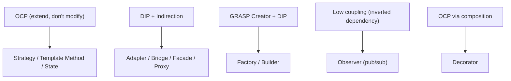
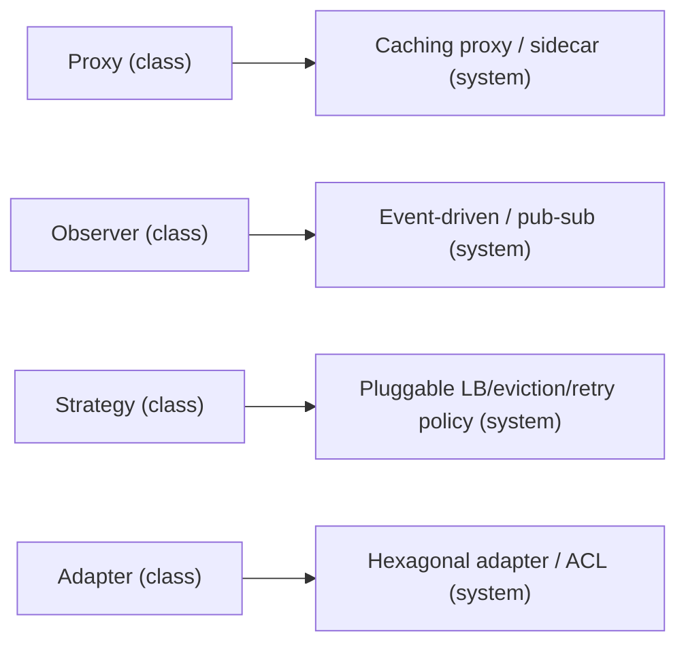

# Lesson 2.4.2 — Design Patterns That Matter for Systems

> Part 2: Architecture Fundamentals · Module 2.4: Low-Level Design · Difficulty: 🟡
>
> **Prerequisites:** [2.4.1 SOLID/GRASP], [2.1.1 Coupling], [2.1.2 DIP].
> **Unlocks:** [2.4.3 Concurrency], [2.4.4 LLD Case Studies], pattern vocabulary used across Parts 6–12.

---

## 1. Learning Objectives

After this lesson you will be able to:

- Explain what a **design pattern** is (a named, reusable solution to a recurring design problem) and why patterns are *embodiments of SOLID* (2.4.1).
- Apply the **creational, structural, and behavioral** patterns that recur most in system design — and recognize them in real infrastructure.
- Map design patterns to the larger architectural and distributed patterns they foreshadow (Strategy→policy, Adapter→Hexagonal, Observer→EDA, Proxy→caching/service mesh).
- Avoid **patternitis** — forcing patterns where simple code suffices.

---

## 2. Motivation — A shared vocabulary for proven solutions

Design patterns (Gang of Four) are **named, reusable solutions to recurring object-design problems.** Their value is twofold: (1) they encode *proven* structures so you don't reinvent them, and (2) they give teams a **shared vocabulary** — saying "use a Strategy here" communicates an entire design instantly. 

For system design specifically, patterns matter because: they're frequent in **LLD interviews** (2.4.4); they're the building blocks SOLID principles produce (2.4.1 — most patterns are OCP/DIP made concrete); and the *same shapes* scale up into the architectural and distributed patterns you'll meet later (a class-level Proxy becomes a caching proxy and a service-mesh sidecar; Observer becomes event-driven architecture; Strategy becomes pluggable policies). This lesson covers the patterns that actually earn their keep in systems work — not the whole catalog, but the high-value subset — and stresses the discipline of *not* over-using them.

---

## 3. Theory — From first principles

A design pattern has: a **name**, a **problem** (the recurring situation), a **solution** (the structure/collaboration), and **consequences** (tradeoffs — every pattern is a 1.1.5 tradeoff). The GoF taxonomy: **creational** (object creation), **structural** (object composition), **behavioral** (object interaction/responsibility). We focus on the system-relevant ones.

### 3.1 Creational patterns (how objects are made)

- **Factory Method / Abstract Factory** — create objects through a method/interface instead of `new`, so the *concrete type* is decided in one place and clients depend on the abstraction (DIP + GRASP Creator, 2.4.1). Use when object creation varies or you want to decouple clients from concrete classes. *(Recurs as: connection factories, client builders.)*
- **Builder** — construct a complex object step-by-step, avoiding telescoping constructors and **connascence of position** (2.1.1). Use for objects with many optional parameters (fluent `Request.builder()...build()`). *(Recurs everywhere config objects are built.)*
- **Singleton** — ensure one instance with global access. **Use sparingly** — it's effectively global state (common coupling, 2.1.1), hurts testability (hard to mock — DIP violation), and is a concurrency hazard (2.4.3). Prefer **dependency injection** of a single instance over the Singleton pattern. *(Mentioned because it's the most overused/abused pattern.)*
- **Prototype / Object Pool** — clone or reuse expensive objects. **Object Pool** is system-relevant: reuse costly resources (DB connections, threads) instead of recreating them — the basis of **connection pooling** (Part 5) and **thread pools** (2.4.3). Critical for performance (1.1.3 — avoid repeated expensive setup).

### 3.2 Structural patterns (how objects compose)

- **Adapter** — wrap an incompatible interface to make it usable by a client (the "Driven adapter" of Hexagonal, 2.1.2; the **Anti-Corruption Layer**, 2.1.3). Use to integrate third-party/legacy code without leaking its model. *(The most important structural pattern for systems — it's how you keep external dependencies from coupling your core.)*
- **Facade** — a simple unified interface over a complex subsystem (reduces coupling; clients depend on the facade, not the internals). *(Recurs as: API gateways/BFFs at the service level, Part 12.)*
- **Proxy** — a stand-in that controls access to an object, adding behavior (caching, lazy loading, access control, logging) transparently. **Hugely system-relevant**: the conceptual basis of **caching proxies, reverse proxies, lazy-loading ORMs, and service-mesh sidecars** (Parts 3, 6, 12). Same shape, every scale.
- **Decorator** — wrap an object to add responsibilities dynamically without changing it (OCP via composition, not inheritance — 2.4.1 §7). Use to stack behaviors (e.g., a stream wrapped with buffering + compression + encryption). Favored over subclass explosions. *(Recurs as: middleware chains — itself a pipeline, 2.2.2.)*
- **Composite** — treat individual objects and compositions uniformly (tree structures). Use for hierarchies (file systems, UI trees, nested aggregates).
- **Bridge** — decouple an abstraction from its implementation so both vary independently (avoids a combinatorial subclass explosion).

### 3.3 Behavioral patterns (how objects interact / assign responsibility)

- **Strategy** — encapsulate interchangeable algorithms behind a common interface; select at runtime. **The canonical OCP pattern** (2.4.1) — add a new algorithm by adding a class, no `if/else` on type. *(Recurs as: pluggable policies everywhere — load-balancing algorithms (Part 3), eviction policies (Part 6), partitioning strategies (Part 7), retry policies (Part 11). Foreshadows the microkernel plug-in, 2.2.2.)*
- **Observer (Publish/Subscribe)** — objects subscribe to a subject and are notified on change; decouples producer from consumers. **The class-level seed of event-driven architecture** (2.2.4) and messaging (Part 9). *(Same inversion-of-dependency idea: the subject doesn't know its observers.)*
- **Template Method** — define an algorithm's skeleton, letting subclasses fill in steps (OCP via inheritance; the inheritance counterpart to Strategy's composition).
- **Command** — encapsulate a request as an object (so it can be queued, logged, undone, retried). *(Recurs as: messages/commands in messaging (Part 9, 2.2.4), task queues, the basis of replayable logs and undo.)*
- **State** — an object changes behavior when its internal state changes (replaces sprawling state conditionals with state classes). *(Recurs as: state machines in workflows/Sagas, Part 11.)*
- **Chain of Responsibility** — pass a request along a chain of handlers until one handles it. *(Recurs as: middleware/interceptor chains, request filters — a pipeline, 2.2.2.)*
- **Iterator / Mediator / Memento / Visitor** — useful but less central to system design; know they exist.

### 3.4 Patterns are SOLID made concrete (the unifying view)

Almost every valuable pattern is a **named application of SOLID/GRASP** (2.4.1) `[CS]`:
- **Strategy / Template Method / State** → **OCP** (extend behavior without modifying).
- **Adapter / Bridge / Facade / Proxy** → **DIP + low coupling + Indirection** (depend on/insulate behind abstractions).
- **Factory / Builder** → **GRASP Creator + DIP** (decouple creation).
- **Observer** → **low coupling** (subject independent of observers) — and the dependency inversion that powers EDA.
- **Decorator** → **OCP via composition** (favored over inheritance, 2.4.1).

So you don't memorize 23 patterns in isolation — you recognize them as the recurring *shapes* that emerge when you apply SOLID well. That's why internalizing 2.4.1 makes patterns feel obvious rather than arbitrary.

### 3.5 Patterns scale up into architecture (the fractal insight)

The most important takeaway for *system* design: **the same patterns reappear at the architectural and distributed scale** — this is the "same physics at every scale" theme (2.1.1) applied to patterns:

| Class-level GoF pattern | Architectural/distributed manifestation |
|---|---|
| Proxy | reverse proxy, caching proxy (Part 6), service-mesh sidecar (Part 12) |
| Adapter | Hexagonal driven adapter (2.1.2), anti-corruption layer (2.1.3) |
| Facade | API gateway / BFF (Part 12) |
| Observer | event-driven architecture, pub/sub messaging (2.2.4, Part 9) |
| Strategy | pluggable load-balancing/eviction/partitioning/retry policies (Parts 3, 6, 7, 11) |
| Command | messages, task queues, replayable logs (Part 9) |
| Decorator / Chain of Responsibility | middleware/interceptor pipelines (2.2.2) |
| Object Pool | connection pools, thread pools (Parts 5, 2.4.3) |
| State | workflow/Saga state machines (Part 11) |

Recognizing this lets you reason about huge systems with the intuition you built on small ones.

### 3.6 Patternitis — the anti-pattern of patterns

The dominant misuse `[BP]`: **forcing patterns where simple code would do.** Symptoms — a `FactoryFactory`, a Strategy with one implementation, Singletons everywhere, layers of indirection no one can follow. Patterns add **structure and indirection**, which is *cost* (simplicity↔flexibility, 1.1.5; needless complexity smell, 2.4.1). Use a pattern when it solves a *real* recurring problem (variation, decoupling, extensibility you actually need), not to demonstrate knowledge. **The simplest code that works is usually right**; reach for a pattern when simplicity starts breaking down.

---

## 4. Visual Intuition

### Patterns as SOLID embodiments

### The fractal: class pattern → distributed pattern

---

## 5. Real-World Analogy

**Patterns are like standard architectural blueprints and fittings in construction.** A "load-bearing arch," a "cantilever," a "standard door frame" are named, proven solutions builders reuse — saying "use an arch here" conveys an entire engineering solution instantly (shared vocabulary). You don't reinvent how to hold up a roof every time. A **Proxy** is like a building's reception desk: everyone goes through it, and it can add services (security check, logging visitors, caching messages) transparently — and the same idea scales from a desk to a whole building's security checkpoint (reverse proxy). But **patternitis** is the architect who insists on a grand spiral staircase and three atriums in a one-room cabin — applying impressive patterns where a simple, cheap structure was correct, adding cost and confusion for no benefit. Good builders use the right standard solution for the actual problem, and plain construction when that's all that's needed.

---

## 6. Industry Example

- **Patterns in infrastructure** `[CONV]`: connection/thread pools (Object Pool) are in every database driver and web server; reverse/caching proxies (Proxy) like NGINX/Envoy and CDNs (Parts 3, 6); pluggable load-balancing and eviction algorithms (Strategy) in load balancers and caches (Parts 3, 6); pub/sub (Observer) in every message broker (Part 9).
- **Adapter/ACL in microservices** `[CONV]`: integrating third-party APIs (payment providers, etc.) behind adapters/anti-corruption layers is standard practice (2.1.2, 2.1.3, Part 12).
- **Builder & fluent APIs** `[CONV]`: ubiquitous in SDKs/clients (request builders, query builders) to avoid telescoping constructors.
- **Anti-Singleton sentiment** `[OPINION]`: widely-shared guidance that Singleton is overused and that **dependency injection** of single instances is preferable (testability, avoiding global state) — a common code-review correction.
- **GoF as shared vocabulary** `[CONV]`: pattern names are a standard part of engineering communication and code review across the industry.

---

## 7. Implementation Details — Using patterns well

- **Start simple; refactor *to* patterns** when a real need appears (variation, duplication, an OCP/DIP pressure) — don't design pattern-first.
- **Prefer composition-based patterns** (Strategy, Decorator) over inheritance-based ones (Template Method) when flexibility matters (2.4.1 composition-over-inheritance).
- **Adapter at every external boundary** to keep third-party models from coupling your core (2.1.2/2.1.3).
- **Object Pool for expensive resources** (connections, threads) — but size pools with Little's Law (1.1.3) and beware over-pooling.
- **Replace `Singleton` with DI** of a single instance where possible (testability).
- **Recognize the fractal** (§3.5): when you reach Parts 6–12, map the big patterns back to these class-level ones — it accelerates understanding.
- **In LLD interviews (2.4.4):** name patterns explicitly as you use them ("I'll use Strategy for the pricing rules so we can add rules without modifying the engine — OCP") — it signals fluency.

---

## 8. Advantages

- **Proven solutions** — don't reinvent; fewer bugs in well-understood structures.
- **Shared vocabulary** — communicate designs instantly across a team.
- **Embody SOLID** — patterns operationalize OCP/DIP/low-coupling concretely.
- **Scalable intuition** — recognizing patterns at class scale transfers to architectural scale (§3.5).

---

## 9. Disadvantages / Costs

- **Patternitis / over-engineering** — forcing patterns adds needless indirection and complexity (the dominant failure).
- **Indirection cost** — patterns trade directness for flexibility (simplicity↔flexibility, 1.1.5); harder to trace if overused.
- **Misapplication** — using the wrong pattern (e.g., Singleton for shared state → coupling/concurrency bugs) is worse than no pattern.
- **Learning curve / dogma** — treating patterns as goals rather than tools.

---

## 10. When NOT to use patterns

- **Simple, stable code** — a plain function/class is clearer than a pattern; don't add a Strategy for an algorithm that will never vary.
- **Single implementation, no foreseeable variation** — abstracting "just in case" is speculative generality (2.4.1, 1.2.2).
- **When the pattern obscures intent** — if the pattern makes the code harder to understand than the problem warrants, drop it.
- Default: **simplest thing that works**; introduce a pattern when simplicity genuinely breaks down.

---

## 11. Common Mistakes

1. **Patternitis** — applying patterns to show knowledge rather than solve a real problem (over-abstraction).
2. **Singleton abuse** — using it as a globally-accessible bucket of state (coupling, concurrency hazards, untestable) — prefer DI.
3. **Strategy/Factory with one implementation** — indirection protecting against variation that doesn't exist.
4. **Inheritance-heavy patterns where composition fits** (Template Method overuse vs Strategy) — LSP risks (2.4.1).
5. **Leaky Adapter** — letting the third-party model leak through the adapter, defeating its purpose (2.1.3 ACL).
6. **Not recognizing the pattern you already need** — hand-rolling pub/sub or a state machine badly instead of using the known shape.
7. **Pattern-first design** — designing around patterns instead of around the problem.

---

## 12. Interview Questions

**🟢 Easy**
- What is a design pattern, and what are the three GoF categories?
- What problem does the Strategy pattern solve, and which SOLID principle does it embody?

**🟡 Medium**
- Compare Strategy vs Template Method. When would you choose composition (Strategy) over inheritance (Template Method)?
- Explain Adapter and Proxy. How do these patterns reappear at the system/architectural scale?

**🔴 Hard**
- Design the pricing engine for a checkout: support multiple, swappable discount/tax rules added over time without modifying the engine. Which patterns, and why? (Strategy + maybe Chain of Responsibility/Decorator.)
- Show how Observer at the class level is the same idea as event-driven architecture (2.2.4). What changes when the observers are across a network?

**⚫ Staff+**
- Walk through the "patterns are fractal" idea: pick three GoF patterns and trace each to its distributed/architectural manifestation, explaining what stays the same and what new concerns (network, failure) appear at scale.
- Critique pattern usage in a codebase suffering from patternitis. How do you decide which patterns add value vs which are needless indirection, and how do you refactor toward simplicity without losing real flexibility?

---

## 13. Production Pitfalls

- **Singleton concurrency/state bugs:** a Singleton holding mutable state shared across threads → race conditions and hard-to-trace bugs (2.4.3); also a hidden global dependency that breaks tests.
- **Over-abstracted codebase:** so many factories/strategies/decorators that tracing a single request requires navigating ten indirections (opacity smell, 2.4.1) → slow onboarding and debugging.
- **Leaky adapters:** third-party concepts leaking past the adapter, so a vendor API change ripples through the core (2.1.3).
- **Mis-sized object pools:** connection/thread pools too small (starvation, queuing — 1.1.3) or too large (resource exhaustion) because they weren't sized with Little's Law.

---

## 14. Optimization Techniques

- **Refactor to patterns on demand** (when duplication/variation/coupling pressure appears), not preemptively.
- **Use Strategy for pluggable policies** (eviction, retry, LB, pricing) — clean OCP extension points.
- **Use Proxy/Decorator for cross-cutting concerns** (caching, logging, auth) without touching core logic — the basis of middleware and sidecars (Parts 6, 12).
- **Object Pool expensive resources**, sized via Little's Law (1.1.3); reuse beats recreate for connections/threads.
- **Replace Singletons with injected single instances** for testability and explicit dependencies (DIP).
- **Map patterns to their distributed forms** (§3.5) to design large systems with small-system intuition.

---

## 15. Summary

Design patterns are **named, reusable solutions to recurring object-design problems** — valuable as proven structures *and* as a shared team vocabulary. The system-relevant subset spans **creational** (Factory/Builder to decouple creation; **Object Pool** for connection/thread reuse; Singleton — overused, prefer DI), **structural** (**Adapter** for boundary integration/ACL; **Proxy** for transparent caching/access control; **Decorator** for composable behavior; Facade for simplified subsystem access), and **behavioral** (**Strategy** for pluggable algorithms — the canonical OCP pattern; **Observer** for decoupled pub/sub — the seed of EDA; **Command** for queueable/replayable requests; **State** for state machines; **Chain of Responsibility** for handler pipelines). The unifying insight: **patterns are SOLID/GRASP made concrete** (2.4.1) — so they feel obvious once you've internalized those principles — and they're **fractal**, reappearing at architectural scale (Proxy→sidecar/CDN, Observer→event-driven, Strategy→pluggable policies, Adapter→Hexagonal/ACL, Command→messages, Object Pool→connection pools), giving you small-system intuition for huge systems. The essential discipline is avoiding **patternitis**: patterns add indirection (cost), so use them only when they solve a *real* recurring problem — otherwise the simplest code that works is right.

---

## 16. Revision Notes (flashcard-ready)

- **Q:** Three GoF categories? **A:** Creational, structural, behavioral.
- **Q:** Strategy solves / embodies? **A:** Interchangeable algorithms behind an interface; embodies OCP.
- **Q:** Observer is the class-level seed of…? **A:** Event-driven architecture / pub-sub (2.2.4, Part 9).
- **Q:** Proxy reappears as…? **A:** Reverse/caching proxy, service-mesh sidecar (Parts 3, 6, 12).
- **Q:** Adapter reappears as…? **A:** Hexagonal driven adapter / anti-corruption layer (2.1.2/2.1.3).
- **Q:** Object Pool is the basis of…? **A:** Connection pools and thread pools (Parts 5, 2.4.3).
- **Q:** Patterns are fundamentally…? **A:** SOLID/GRASP made concrete; recognizable shapes from applying SOLID well.
- **Q:** Singleton — what to prefer? **A:** Dependency injection of a single instance (testability, avoid global state).
- **Q:** Patternitis? **A:** Forcing patterns where simple code suffices — needless indirection/complexity.
- **Q:** Decorator vs Template Method? **A:** Decorator adds behavior via composition (favored); Template Method via inheritance.

---

## 17. Further Reading + Knowledge-Graph Links

**Within this platform**
- **Previous:** [2.4.1 SOLID/GRASP] (patterns embody these). **Next:** [2.4.3 Concurrency Patterns].
- **Patterns scale into:** [Part 6 Caching] (Proxy, Strategy eviction), [Part 3 Networking] (reverse proxy, Strategy LB), [Part 9 Messaging] (Observer, Command), [Part 11 Resilience] (Strategy retry, State machines/Sagas), [Part 12 Microservices] (Facade/gateway, Adapter, sidecar).
- **Builds on:** [2.1.2 Adapter/Hexagonal], [2.2.2 microkernel/pipeline], [2.2.4 Observer→EDA].

**Foundational texts (synthesized)**
- Gamma, Helm, Johnson, Vlissides (GoF), *Design Patterns* — the creational/structural/behavioral catalog.
- Freeman & Freeman, *Head First Design Patterns* — patterns as applications of OO principles.
- Martin, *Clean Code* / Larman, *Applying UML and Patterns* — patterns as SOLID/GRASP embodiments.

**Concept tags:** `[CS]` GoF patterns, pattern = problem+solution+consequences · `[BP]` refactor-to-patterns, composition over inheritance, avoid patternitis, prefer DI over Singleton · `[CONV]` patterns in infrastructure (pools, proxies, pub/sub) · `[OPINION]` Singleton overuse critique.
