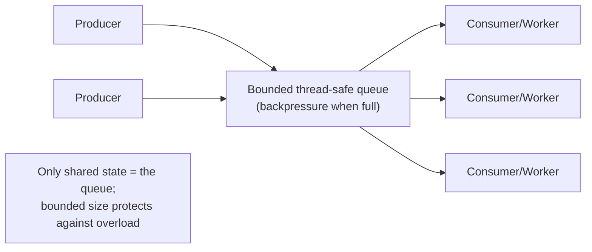
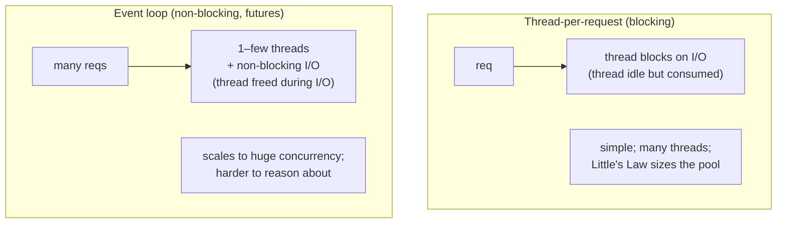
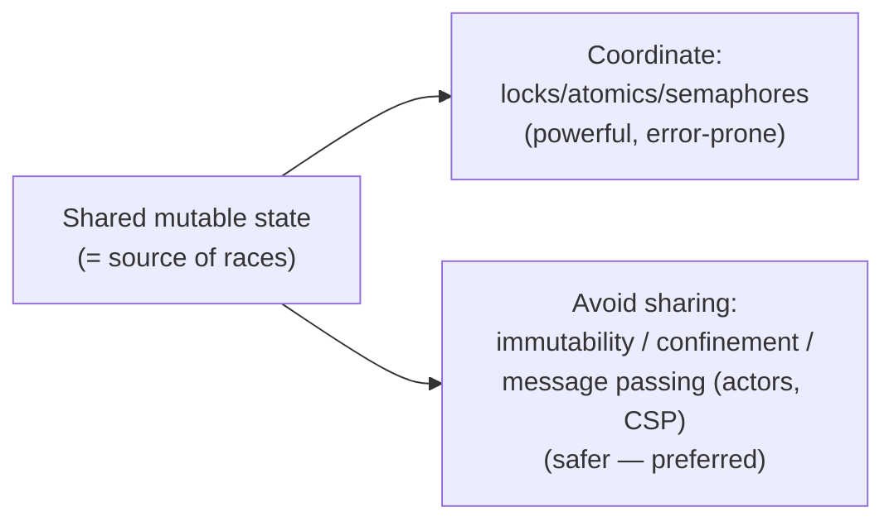

# Lesson 2.4.3 — Concurrency Patterns: Producer-Consumer, Thread Pools, Futures, Actors

> Part 2: Architecture Fundamentals · Module 2.4: Low-Level Design · Difficulty: 🟡🔴
>
> **Prerequisites:** [2.4.1 SOLID], [2.4.2 Patterns], [1.1.3 Concurrency vs Parallelism / Little's Law].
> **Unlocks:** [2.4.4 LLD Case Studies], [Part 8 Distributed Systems], [Part 17 Performance (concurrency models)].

---

## 1. Learning Objectives

After this lesson you will be able to:

- Distinguish **concurrency from parallelism** (recap 1.1.3) and the core hazards: **race conditions, deadlock, livelock, starvation**.
- Apply the foundational concurrency patterns: **producer-consumer (bounded buffer), thread pool, futures/promises, actor model**, and **immutability/CSP** approaches.
- Reason about **why shared mutable state is the root of concurrency bugs** and the two escape strategies (don't share, or coordinate carefully).
- Size thread/worker pools with **Little's Law** (1.1.3) and recognize blocking vs non-blocking (async) models.
- Choose a concurrency approach for an LLD problem and articulate its tradeoffs.

---

## 2. Motivation — Concurrency is where correctness goes to die

Almost every real system is concurrent: web servers handle many requests at once, caches are read/written by many threads, queues are produced and consumed in parallel. Yet concurrency is the single hardest source of *correctness* bugs — race conditions are non-deterministic, hard to reproduce, and can corrupt data silently (a reliability failure, 1.2.1). SOLID and patterns (2.4.1–2.4.2) say nothing about *time* and *simultaneity*; this lesson fills that gap.

Concurrency patterns are battle-tested structures for getting concurrency *right* — they appear constantly in LLD interviews (a thread-safe cache, a rate limiter, a bounded queue — 2.4.4) and underpin everything in distributed systems (Part 8 is concurrency *across machines*, with the added horror of network failure). Understanding the local concurrency model also directly drives performance (1.1.3 Little's Law, Part 17). Master these and you can build correct, high-throughput components; ignore them and you ship data corruption that surfaces only under load.

---

## 3. Theory — From first principles

### 3.1 Concurrency vs parallelism, and the hazards

Recap (1.1.3): **concurrency** = dealing with many things *in progress* (structure); **parallelism** = doing many things *at the same instant* (execution, needs multiple cores). Concurrency is about *managing* simultaneity; you can have concurrency without parallelism (one core, interleaved) `[CS]`.

The hazards, all rooted in **shared mutable state** accessed simultaneously:
- **Race condition** — the result depends on the unpredictable *timing/interleaving* of threads (e.g., two threads `count++` → lost update). The fundamental bug.
- **Deadlock** — threads wait on each other in a cycle, none proceeds (the four Coffman conditions: mutual exclusion, hold-and-wait, no preemption, circular wait — break any one to prevent).
- **Livelock** — threads keep changing state in response to each other but make no progress (deadlock's "busy" cousin).
- **Starvation** — a thread never gets the resource it needs (unfair scheduling/locking).
- **Memory visibility** — without proper synchronization, one thread's writes may not be *visible* to another (caches, reordering) — hence `volatile`/memory barriers/atomics.

### 3.2 The two strategies to tame concurrency

Everything reduces to two approaches `[CS]`:

1. **Coordinate access to shared mutable state** — use synchronization (locks/mutexes, semaphores, condition variables, atomics) so only safe interleavings occur. Powerful but error-prone: locks risk deadlock, hurt performance (contention → the utilization knee, 1.1.3), and are hard to get right.
2. **Avoid sharing mutable state** — the safer philosophy: 
   - **Immutability** — immutable data can be shared freely (no writes → no races). The strongest tool; value objects (2.1.3) and functional approaches lean on this.
   - **Confinement** — give each thread its own data (no sharing). 
   - **Message passing** — threads/actors communicate by sending messages, not sharing memory (actors, CSP — §3.6). "Don't communicate by sharing memory; share memory by communicating."

> The senior instinct: **prefer "don't share" over "share carefully."** Immutability and message passing eliminate whole classes of bugs that locking only *manages*.

### 3.3 Producer-Consumer (bounded buffer)

> Producers generate work and put it on a **shared queue**; consumers take work off and process it. A **bounded** queue decouples their rates and provides **backpressure**. `[CS]`

The foundational concurrency pattern. Key points:
- The queue is the *only* shared state, and it's made thread-safe (a blocking queue / concurrent queue). Producers and consumers don't touch each other directly (low coupling).
- **Decouples producer and consumer speeds** — bursts are absorbed by the buffer (smoothing, like 1.1.3).
- **Bounded** is critical: an unbounded queue hides overload until OOM; a bounded queue applies **backpressure** (producers block/are rejected when full — Part 3, Part 9) — a reliability safeguard.
- This is the class-level seed of **message queues** (Part 9) and the **thread pool** (§3.4).

### 3.4 Thread Pool (worker pool)

> A fixed (or bounded) set of reusable worker threads pull tasks from a queue (producer-consumer). Instead of creating a thread per task, you **reuse** threads. `[CS]`

Why it matters (performance + stability):
- **Thread creation is expensive** (1.1.3); reuse via a pool (an **Object Pool**, 2.4.2) avoids it.
- **Bounds concurrency** — limits how many tasks run at once, preventing resource exhaustion (unbounded threads → context-switch thrash, OOM; the L3 regime of 1.1.3).
- **Sizing with Little's Law (1.1.3):** `threads ≈ throughput × task_time`. For CPU-bound work, ~#cores; for I/O-bound work (threads mostly waiting), more threads help (until the downstream saturates). This is *the* practical sizing tool.
- The backing **queue must be bounded** with a rejection/backpressure policy — an unbounded task queue is a classic production OOM.

### 3.5 Futures / Promises (async results)

> A **Future/Promise** is a placeholder for a result that isn't ready yet; you get the handle immediately and retrieve/await the value later (or attach a callback). `[CS]`

Enables **asynchronous, non-blocking** programming: submit work, don't block the calling thread, compose results (`thenApply`, `await`). Key value:
- **Non-blocking I/O** — instead of a thread blocking on a slow call (wasting it), the thread is freed and resumes on completion → far higher throughput with fewer threads (the **C10K→C10M** story, Part 17).
- **Composition** — chain/combine async operations without nested callbacks ("callback hell"); `async/await` is syntactic sugar over futures.
- Underpins **event loops** (Node.js, Netty, async runtimes) where one/few threads handle thousands of concurrent connections via non-blocking I/O — the opposite end from thread-per-request.

The tradeoff: async code is harder to reason about and debug (control flow is non-linear), and a single blocking call in an event loop stalls everything. Blocking thread-per-request is simpler; async scales better for I/O-bound, high-concurrency workloads (a 1.1.5 tradeoff; Part 17).

### 3.6 The Actor model and CSP (share-nothing concurrency)

> **Actor model:** independent **actors** each own private state and a mailbox; they communicate *only* by sending asynchronous messages, processed one at a time. No shared memory → **no locks, no races** within an actor. `[CS]`

Because an actor processes one message at a time on its own state, internal state needs no locking. Concurrency comes from many actors running independently; coordination is via messages. Used in **Erlang/Elixir (OTP), Akka** — the basis of highly-concurrent, fault-tolerant systems (Erlang's "let it crash" + supervision trees foreshadow Part 11 resilience). Actors are the **Observer/Command patterns** (2.4.2) + message passing, and the *direct conceptual ancestor of microservices* (independent, message-passing, fail-isolated — Part 12) and event-driven architecture (2.2.4).

> **CSP (Communicating Sequential Processes)** — the related model behind Go's goroutines + channels: lightweight processes communicating over channels (a typed producer-consumer). Same philosophy: *share by communicating, not by sharing memory.*

### 3.7 Choosing an approach (the LLD decision)

| Need | Approach |
|---|---|
| Decouple work generation from processing; smooth bursts | **Producer-consumer (bounded queue)** |
| Run many tasks with bounded resource use | **Thread pool** (sized via Little's Law) |
| High-concurrency I/O-bound work, few threads | **Futures + non-blocking I/O / event loop** |
| Independent stateful entities, fault isolation, no locks | **Actor model / CSP** |
| Eliminate races structurally | **Immutability + confinement + message passing** |
| Must share mutable state | **Locks/atomics carefully** (last resort) |

The recurring senior heuristic: **minimize shared mutable state; when you must share, keep critical sections tiny and prefer atomics/immutable snapshots over coarse locks.**

---

## 4. Visual Intuition

### Producer-consumer with a bounded buffer (backpressure)

### Thread-per-request (blocking) vs event loop (async)

### The two strategies

---

## 5. Real-World Analogy

**A restaurant kitchen at the dinner rush.** **Producer-consumer:** waiters (producers) clip orders onto a rail (the bounded queue); cooks (consumers) pull them off. The rail decouples their pace — a burst of orders waits on the rail rather than overwhelming the cooks, and when the rail is full, the host stops seating (backpressure). **Thread pool:** the restaurant has a *fixed* number of cooks (workers); you don't hire a new cook per order — you reuse them, and the number of cooks bounds how much cooks at once (sized to the kitchen's throughput). **Futures:** a cook starts the steak, then — instead of standing and watching it (blocking) — starts the next dish, returning when the steak's timer dings (non-blocking, async); one cook juggles many dishes. **Actor model:** each cook owns their station and ingredients (private state) and communicates by passing tickets and finished plates (messages) — never reaching into another cook's station (no shared state, no collisions). The disasters are familiar: two cooks grabbing the same pan (race condition), two cooks each waiting for the other to finish with a shared oven (deadlock), and a new cook who never gets oven time (starvation).

---

## 6. Industry Example

- **Thread pools everywhere** `[CONV]`: web/app servers (Tomcat, etc.), database drivers, and task executors all use bounded thread pools + queues; misconfiguring the pool/queue is a top cause of production outages (OOM from unbounded queues, starvation from undersized pools).
- **Event-loop / async runtimes** `[CONV]`: Node.js, Netty, nginx, and async frameworks handle massive concurrent connections with few threads via non-blocking I/O + futures — the C10K solution (Part 17).
- **Actor/CSP systems** `[CONV]`: Erlang/Elixir (telecom, WhatsApp's backend lineage) and Akka use actors for highly-concurrent, fault-tolerant systems; Go's goroutines+channels (CSP) power much modern infrastructure (Kubernetes, Docker). Actors directly inspired microservice thinking (Part 12).
- **Immutability for concurrency** `[BP]`: functional and immutable-data approaches (persistent data structures, immutable DTOs/value objects) are widely promoted to sidestep races — "make illegal states unrepresentable."

---

## 7. Implementation Details — Practical concurrency

- **Default to share-nothing:** immutable value objects (2.1.3), thread confinement, and message passing eliminate races by construction. Reach for locks only when truly sharing mutable state.
- **Producer-consumer:** use a **bounded** concurrent/blocking queue; define an explicit policy when full (block, drop, or reject — backpressure, Parts 3, 9). Never unbounded.
- **Thread pools:** size with **Little's Law** (1.1.3): CPU-bound ≈ #cores; I/O-bound > #cores (more, since threads wait) — measure and tune. Always use a **bounded** task queue + rejection policy. Separate pools for different workloads (bulkheads, Part 11) to prevent one slow task type starving others.
- **Atomics over locks** for simple counters/flags (`AtomicLong`, CAS) — lock-free, faster, no deadlock. Keep critical sections **tiny**; never do I/O while holding a lock.
- **Avoid deadlock:** acquire locks in a consistent global order; use timeouts (`tryLock`); minimize lock scope; prefer single-lock or lock-free designs.
- **Async/futures** for I/O-bound high-concurrency paths; but never block inside an event loop. Use `async/await` for readable composition.
- **Actors/CSP** for independent stateful entities needing isolation and fault tolerance.
- **Test concurrency deliberately** — stress tests, fuzzing interleavings, tools like race detectors (Go's `-race`); concurrency bugs hide under light load.

**LLD interview tie (2.4.4):** for a thread-safe cache or rate limiter, state your concurrency strategy explicitly ("I'll use a `ConcurrentHashMap` + atomic counters to avoid coarse locking; the token-bucket refill uses CAS") — it's a strong signal.

---

## 8. Advantages (of using these patterns)

- **Correctness under concurrency** — patterns encapsulate safe structures, avoiding hand-rolled race-prone code.
- **Throughput & resource control** — pools bound resource use; async maximizes I/O concurrency (1.1.3, Part 17).
- **Backpressure & stability** — bounded queues prevent overload collapse (Part 11).
- **Fault isolation** — actors isolate state and failures (foreshadows resilience, Part 11).
- **Simplicity via share-nothing** — immutability/message-passing remove entire bug classes.

---

## 9. Disadvantages / Costs

- **Inherent complexity** — concurrency is hard to reason about, test, and debug regardless of patterns; bugs are non-deterministic.
- **Async cognitive cost** — non-blocking code is harder to follow/debug than blocking; a single blocking call can stall an event loop.
- **Lock pitfalls** — deadlock, contention (the utilization knee), and priority inversion when coordinating shared state.
- **Tuning burden** — pool sizes, queue bounds, and backpressure policies need measurement and care.
- **Message-passing overhead** — actors/CSP add message-copying and mailbox overhead vs direct shared memory.

---

## 10. When NOT to over-engineer

- **Single-threaded / low-concurrency code** — don't add pools/actors where a simple sequential design works.
- **Premature async** — if the workload is CPU-bound or low-concurrency, blocking thread-per-request is simpler and fine (async pays off mainly for I/O-bound high concurrency).
- **Over-actored designs** — actors everywhere add indirection; use them where isolation/fault-tolerance genuinely helps.
- Default to the **simplest correct** concurrency model; escalate to more sophisticated patterns only when throughput/scaling demands it.

---

## 11. Common Mistakes

1. **Unbounded queues** (producer-consumer or thread-pool backing queue) → memory exhaustion under load (hides overload until OOM). The most common production concurrency outage.
2. **Shared mutable state without synchronization** → races/lost updates/visibility bugs (the root hazard).
3. **Coarse locks / locking during I/O** → contention and the utilization knee; holding a lock across a network call is catastrophic.
4. **Deadlock from inconsistent lock ordering** → hangs under load.
5. **Mis-sized thread pools** → starvation (too small) or thrash/OOM (too large) — not using Little's Law.
6. **Blocking inside an event loop** → stalls all concurrent work in async runtimes.
7. **Singleton with mutable state** (2.4.2) → hidden shared-state races.
8. **Testing only under light load** → concurrency bugs that only appear under contention slip to production.

---

## 12. Interview Questions

**🟢 Easy**
- Concurrency vs parallelism — define each. Name three concurrency hazards.
- What is the producer-consumer pattern, and why is a *bounded* queue important?

**🟡 Medium**
- Why use a thread pool instead of creating a thread per task? How do you size one (Little's Law)?
- Explain blocking thread-per-request vs an async event loop. When does each win?
- What are the four conditions for deadlock, and how do you prevent it?

**🔴 Hard**
- Design a thread-safe, bounded in-memory cache with concurrent reads/writes and LRU eviction. What's your concurrency strategy (locks vs concurrent structures vs sharding), and how do you avoid contention? (Preview of 2.4.4.)
- Explain how the actor model eliminates the need for locks, and how it foreshadows microservices and event-driven architecture. What new problems appear when "actors" become network services?

**⚫ Staff+**
- A service's thread pool exhausts and requests pile up under load. Walk through diagnosing it with Little's Law and utilization analysis (1.1.3), and the fixes (pool/queue sizing, bulkheads, async I/O, backpressure, shedding). 
- Make the case for "share-nothing" concurrency (immutability, message passing, actors/CSP) over lock-based shared-state concurrency at scale. Where does each break down, and how does this scale up into distributed-systems design (Part 8)?

---

## 13. Production Pitfalls

- **The unbounded-queue OOM:** a thread pool with an unbounded task queue silently accumulates work under overload until the process crashes — should have been bounded with backpressure/rejection (Part 11 load shedding).
- **Lock-held-during-I/O stall:** a thread holding a lock while making a slow network/DB call serializes all other threads behind it → throughput collapse (utilization knee, 1.1.3).
- **Heisenbugs:** race conditions that pass tests and light load but corrupt data under production contention — non-deterministic and brutal to reproduce (need stress tests + race detectors).
- **Event-loop stall:** one accidental blocking call (a sync DB driver) in a Node/Netty event loop freezes all concurrent requests.
- **Deadlock under peak:** inconsistent lock ordering that only manifests when two specific operations interleave at high load → hung threads, cascading timeouts.
- **Thread-pool starvation / mutual blocking:** tasks in a pool that submit and wait on other tasks in the *same* pool → deadlock (use separate pools / bulkheads).

---

## 14. Optimization Techniques

- **Prefer immutability and message passing** to eliminate races structurally (the highest-leverage move).
- **Use atomics/CAS and concurrent data structures** (e.g., concurrent maps) instead of coarse locks; keep critical sections tiny.
- **Size pools with Little's Law** (1.1.3) and use **bounded queues with explicit backpressure** (Parts 3, 9, 11).
- **Bulkhead with separate pools** per workload type so one slow path can't starve others (Part 11).
- **Async/non-blocking I/O** for I/O-bound high-concurrency paths to maximize throughput per thread (Part 17); never block the event loop.
- **Consistent lock ordering + tryLock timeouts** to prevent/detect deadlock.
- **Stress/concurrency-test** with race detectors and high-contention scenarios, not just light load.

---

## 15. Summary

Concurrency — managing many things *in progress* (distinct from parallelism, actual simultaneous execution) — is the hardest source of correctness bugs, all rooted in **shared mutable state** accessed simultaneously (races, deadlock, livelock, starvation, visibility bugs). There are exactly two strategies: **coordinate access** (locks/atomics/semaphores — powerful but error-prone) or, preferably, **avoid sharing** (immutability, confinement, message passing). The foundational patterns: **producer-consumer** with a **bounded** queue decouples work generation from processing and provides backpressure; the **thread pool** reuses a bounded set of workers (sized via **Little's Law**, 1.1.3) over that queue to bound resource use; **futures/promises** enable **non-blocking async** I/O so few threads handle huge concurrency (event loops, the C10K solution); and the **actor model/CSP** achieve share-nothing concurrency through message-passing isolation (no locks, fault isolation) — the conceptual ancestor of microservices and event-driven architecture. The senior heuristics: **minimize shared mutable state, prefer immutability/message-passing, always bound your queues, size pools with Little's Law, keep critical sections tiny, and never block while holding a lock or inside an event loop.** Concurrency patterns are what make components correct *and* high-throughput — and they're the local foundation for the distributed concurrency (with network failure added) you'll tackle in Part 8.

---

## 16. Revision Notes (flashcard-ready)

- **Q:** Root cause of concurrency bugs? **A:** Shared mutable state accessed simultaneously.
- **Q:** Two strategies to tame concurrency? **A:** Coordinate access (locks/atomics) or avoid sharing (immutability/confinement/message passing — preferred).
- **Q:** Producer-consumer — why bounded queue? **A:** Decouples rates + provides backpressure; unbounded → OOM under overload.
- **Q:** Why a thread pool? **A:** Reuse threads (creation is expensive) + bound concurrency; size via Little's Law (≈ throughput × task time).
- **Q:** Futures/promises enable? **A:** Non-blocking async I/O — few threads handle huge concurrency (event loops).
- **Q:** Actor model key property? **A:** Private state + message passing, one message at a time → no locks, no races, fault isolation.
- **Q:** Four deadlock conditions? **A:** Mutual exclusion, hold-and-wait, no preemption, circular wait (break one to prevent).
- **Q:** Two cardinal sins? **A:** Unbounded queues (OOM) and locking during I/O (throughput collapse).
- **Q:** Actors foreshadow…? **A:** Microservices + event-driven architecture (independent, message-passing, fail-isolated).
- **Q:** CSP (Go) philosophy? **A:** Share memory by communicating (channels), not communicate by sharing memory.

---

## 17. Further Reading + Knowledge-Graph Links

**Within this platform**
- **Previous:** [2.4.2 Design Patterns] (Object Pool→thread pool; Observer/Command→actors). **Next:** [2.4.4 LLD Case Studies] (apply concurrency to a cache/rate limiter).
- **Builds on:** [1.1.3 Concurrency vs Parallelism, Little's Law] (sizing/utilization).
- **Scales into:** [Part 8 Distributed Systems] (concurrency across machines + network failure), [Part 17 Performance] (concurrency models, C10K, async), [Part 11 Resilience] (bulkheads, backpressure, load shedding), [Part 9 Messaging] (producer-consumer at scale).

**Foundational texts (synthesized)**
- Goetz et al., *Java Concurrency in Practice* — shared-state hazards, thread pools, producer-consumer, immutability.
- Tanenbaum, *Distributed Systems* / OS texts — synchronization, deadlock conditions, mutual exclusion.
- Hewitt (actor model), Hoare (CSP) — message-passing concurrency foundations.
- Kleppmann, *DDIA* — concurrency and its escalation into distributed systems (Part 8).

**Concept tags:** `[CS]` concurrency hazards, producer-consumer, thread pools, futures, actors/CSP, deadlock conditions · `[BP]` prefer share-nothing/immutability, bound queues, size via Little's Law, tiny critical sections · `[CONV]` event loops (Node/Netty), actor systems (Erlang/Akka), Go goroutines/channels.
