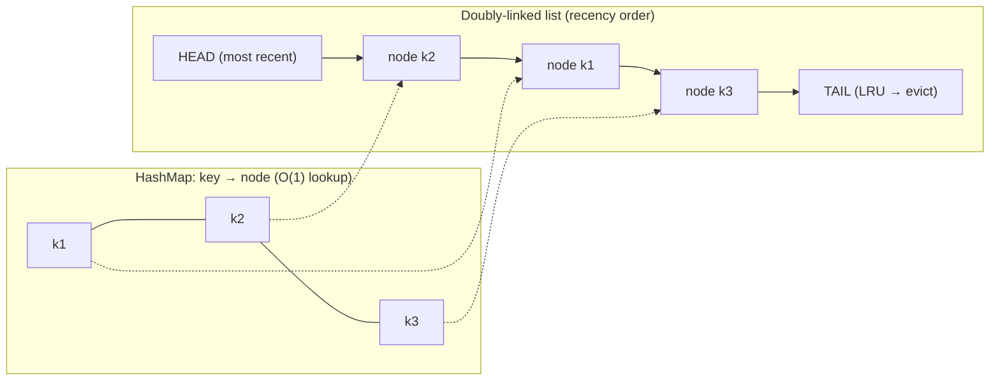
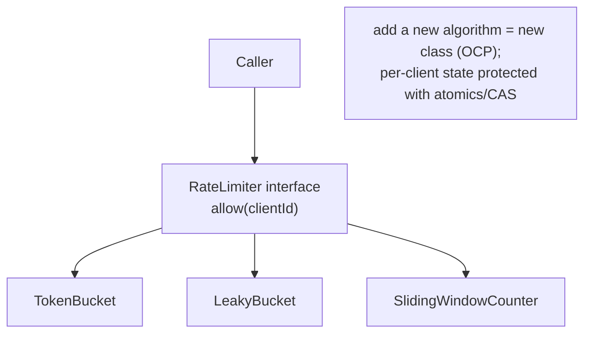
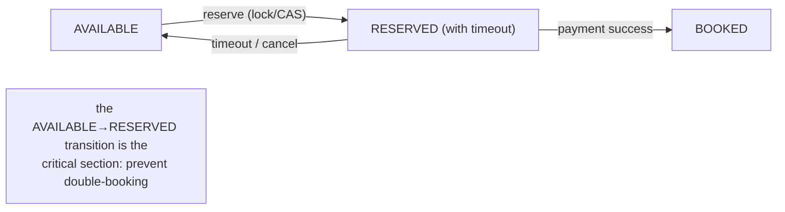

# Lesson 2.4.4 — LLD Case Studies: Parking Lot, Rate Limiter, In-Memory Cache, BookMyShow

> Part 2: Architecture Fundamentals · Module 2.4: Low-Level Design · Difficulty: 🟡🔴
>
> **Prerequisites:** [2.4.1 SOLID/GRASP], [2.4.2 Patterns], [2.4.3 Concurrency], [2.1.3 DDD].
> **Unlocks:** [2.4.5 LLD→HLD], LLD interview rounds, [Part 6 Caching], [Part 19.1.2 Rate Limiter HLD].

---

## 1. Learning Objectives

After this lesson you will be able to:

- Run a **repeatable LLD method**: requirements → entities/value objects → responsibilities (GRASP) → interfaces (SOLID) → patterns → concurrency.
- Produce clean class designs for four canonical LLD-interview problems: **parking lot, rate limiter, in-memory LRU cache, BookMyShow (movie booking)**.
- Apply SOLID, GRASP, design patterns, and concurrency *together* on concrete problems.
- Recognize where LLD meets HLD (e.g., the rate limiter and cache reappear as distributed systems in Parts 6 and 19).

---

## 2. Motivation — Where the principles become code

LLD interviews ask you to design the *classes* of a bounded problem in 30–45 minutes: "design a parking lot," "design a rate limiter." They test whether you can apply SOLID (2.4.1), patterns (2.4.2), and concurrency (2.4.3) to produce a clean, extensible, thread-safe object model — and whether you can *drive* (1.3.2) at the class level. These four problems are the most common, and each showcases different skills: the **parking lot** (modeling, OCP/Strategy), the **rate limiter** (algorithms + concurrency), the **LRU cache** (data structures + thread safety + the bridge to distributed caching), and **BookMyShow** (concurrency/booking correctness + a richer domain). This lesson gives you a reusable method and four worked designs, deliberately connecting each to the HLD topics it foreshadows.

---

## 3. Theory — The LLD method, then four worked designs

### 3.1 The repeatable LLD method

1. **Clarify requirements & scope** (mini-1.3.1): core features, key constraints, what's out of scope.
2. **Identify entities & value objects** (2.1.3): nouns → candidate classes; distinguish identity (entity) from value (value object).
3. **Assign responsibilities (GRASP):** Information Expert decides where behavior lives; Controller for the use-case entry point; Creator for instantiation.
4. **Define interfaces for variation points (SOLID):** where will behavior vary? → interface + Strategy (OCP); dependencies → DIP/injection.
5. **Apply patterns (2.4.2)** where they solve a real need (Strategy for pluggable algorithms, Factory for creation, Observer for notifications…).
6. **Handle concurrency (2.4.3):** what's shared mutable state? Protect with atomics/concurrent structures; keep critical sections small.
7. **State tradeoffs & extension points.** Name what's easy to extend (OCP) and what you deferred.

### 3.2 Case study A — Parking Lot

**Requirements (typical):** multiple levels; spots of types (compact, large, handicapped, motorcycle); vehicles of types; assign a spot on entry, free it on exit; compute fee; find availability.

**Entities/value objects:** `ParkingLot`, `Level`, `ParkingSpot` (with `SpotType`), `Vehicle` (abstract; `Car`/`Truck`/`Motorcycle`), `Ticket` (value-ish, holds entry time/spot), `Account`/`Display` (optional).

**Responsibilities (GRASP):**
- `ParkingLot` (Controller/Information Expert for the whole lot) — `parkVehicle()`, `unpark()`, tracks levels and availability.
- `Level` knows its spots (Information Expert for spot availability on that level).
- `ParkingSpot` knows if it can fit a vehicle (`canFit(vehicle)`).

**SOLID/patterns:**
- **Strategy (OCP)** for **spot-assignment policy** (nearest, by type, random) and for **fee calculation** (hourly, flat, type-based) — add a new policy without modifying the lot. This is the key extensibility point interviewers probe.
- **Factory** to create the right `Vehicle`/`Spot` subtype.
- **Polymorphism over type-switches** — `spot.canFit(vehicle)` instead of `if vehicle.type == ...` (2.4.1).
- **Observer** (optional) for the availability display board (notify on spot free/occupied).

**Concurrency (2.4.3):** spot assignment is **shared mutable state** — two cars must not get the same spot. Protect the assignment with a lock per level or atomic compare-and-set on spot state; keep the critical section to just the claim. (At scale this becomes a distributed-locking problem — a bridge to Part 8/11.)

**Tradeoffs/extensions:** Strategy makes pricing/assignment pluggable (OCP); per-level locking avoids a global bottleneck (scales better than one lot-wide lock).

### 3.3 Case study B — Rate Limiter

**Requirements:** limit requests per client (e.g., 100 req/min); decide allow/deny per request; thread-safe; pluggable algorithm. (HLD version: distributed across servers — Part 19.1.2.)

**The algorithms (the core of this problem)** `[CS]`:
- **Token Bucket** — a bucket holds up to `N` tokens, refilled at rate `r`; each request consumes a token; empty → reject. **Allows bursts** up to bucket size; smooth average rate. *(Most popular; used by many APIs/cloud gateways.)*
- **Leaky Bucket** — requests enter a queue (bucket) drained at a fixed rate; overflow → reject. **Smooths output to a constant rate** (no bursts).
- **Fixed Window Counter** — count requests per fixed time window (e.g., per minute); reset each window. Simple, but allows **2× burst at window edges**.
- **Sliding Window Log** — store timestamps of requests; count those within the trailing window. Accurate, but **memory-heavy** (stores every timestamp).
- **Sliding Window Counter** — hybrid: weight the previous window's count into the current — accurate enough, low memory. *(Common production choice.)*

**Design (SOLID/patterns):**
- **Strategy (OCP)** — `RateLimiter` interface with `allow(clientId)`; implementations `TokenBucketLimiter`, `SlidingWindowLimiter`, etc. Swap algorithms without changing callers — the headline extensibility.
- Per-client state in a map (`clientId → bucket/counter`).

**Concurrency (2.4.3):** the per-client counter/bucket is **shared mutable state** updated on every request. Use **atomics/CAS** (e.g., atomically decrement tokens) or a per-client lock; avoid a global lock (contention → the utilization knee, 1.1.3). Token refill computed lazily from elapsed time on access (avoid a background thread per client).

**Bridge to HLD (Part 19.1.2):** distributed rate limiting moves the counter to a shared store (Redis) with atomic operations (Lua scripts/INCR+EXPIRE), introducing consistency and latency tradeoffs — *the same algorithm, now distributed.* (Note how 2.4.3's "share-nothing vs coordinate" reappears across the network.)

### 3.4 Case study C — In-Memory LRU Cache

**Requirements:** `get(key)` and `put(key, value)` in **O(1)**; bounded capacity; evict **least-recently-used** on overflow; thread-safe.

**The classic data-structure design** `[CS]`:
- **HashMap + Doubly-Linked List.** The map gives O(1) lookup (`key → node`); the doubly-linked list maintains recency order (most-recently-used at head, LRU at tail). On `get`/`put`, move the node to the head; on overflow, evict the tail. Both operations O(1).
- This is *the* canonical LLD data-structure question — know it cold.

**SOLID/patterns:**
- **Strategy (OCP)** for the **eviction policy** — `EvictionPolicy` interface (LRU, LFU, FIFO) so the cache supports different policies without modification. (Foreshadows Part 6's eviction policies.)
- **Generics** for key/value types.
- Optional **TTL** per entry (expiry).

**Concurrency (2.4.3):** `get`/`put` mutate shared structures (map + list). Options, in order of sophistication:
- A single lock (simple, but serializes all access — contention).
- **Sharded/striped locks** (partition keys into segments, lock per segment) — far less contention (this is how `ConcurrentHashMap` works).
- Concurrent structures + careful ordering. State the tradeoff: simplicity vs throughput (1.1.5).

**Bridge to HLD (Part 6):** the same cache, distributed, becomes Redis/Memcached with consistent hashing (Part 7), eviction policies, and write strategies (cache-aside/write-through) — the LRU you build here is the *node-local* version of a distributed cache.

### 3.5 Case study D — BookMyShow (movie ticket booking)

**Requirements:** browse movies/shows by city/theater; view a show's seat map; **book seats** (the crux); handle payment; prevent **double-booking** of the same seat.

**Entities/value objects:** `City`, `Theater`, `Screen`, `Movie`, `Show` (movie + screen + time), `Seat` (with `SeatType`/status), `Booking`, `User`, `Payment`. (Notice this is a small **bounded context** model, 2.1.3.)

**Responsibilities (GRASP):**
- `Show` is the Information Expert for its seat availability.
- A `BookingController`/`BookingService` (Controller) coordinates the booking use case.
- `Payment` handled behind an interface (DIP — swap providers; Adapter/ACL, 2.1.2/2.1.3).

**The hard part — concurrency & correctness (2.4.3):** the central challenge is **two users must not book the same seat.** This is a race condition on shared seat state. Solutions (escalating):
- **Pessimistic locking** — lock the seats during booking (hold seats "in progress" for N minutes), reject others. Simple, correct, but holds resources and reduces availability under contention.
- **Optimistic concurrency** — let both proceed, detect conflict at commit (version/CAS on seat status), retry/fail the loser. Better under low contention.
- **Seat reservation with timeout** — mark seats `RESERVED` with an expiry (a temporary hold) so abandoned bookings free up; confirm on payment.

This is *exactly* the local version of the **distributed locking / consistency** problem (Parts 8, 10, 11) — at HLD scale, seat state lives in a database and you use row locks, conditional updates, or a distributed lock (with fencing tokens, Part 8). The LLD interview tests whether you *recognize the race and pick a correct strategy*.

**SOLID/patterns:** **State** pattern for seat status (`AVAILABLE → RESERVED → BOOKED`); **Strategy** for pricing (by seat type/show time); **Adapter** for payment providers; **Observer** for notifications (booking confirmed → notify user — foreshadows Part 19.1.4 notification system).

### 3.6 The meta-lesson: LLD problems are HLD problems in miniature

Each case study's hard part is the *local* version of a *distributed* problem you'll meet later: the parking-spot/seat race → **distributed locking & consistency** (Parts 8, 10, 11); the rate limiter → **distributed rate limiting** (Part 19.1.2); the LRU cache → **distributed caching** (Part 6); booking → **distributed transactions/Sagas** (Part 11). This is the "same physics at every scale" theme (2.1.1, 2.4.2 fractal) once more: **solve it correctly at the object level and you have the intuition for the distributed level.** 2.4.5 makes this LLD↔HLD relationship explicit.

---

## 4. Visual Intuition

### LRU cache: HashMap + doubly-linked list

### Rate limiter: Strategy pattern over algorithms

### Booking: seat State machine (the race-prone transition)

---

## 5. Real-World Analogy

**These four are like designing the fixtures of a building well.** The **parking lot** is the actual garage — you need a clean scheme for spot types, assignment rules (and you'd want to change pricing without rebuilding the garage — Strategy). The **rate limiter** is the bouncer at a club door enforcing "100 people per hour" — different counting methods (a clicker reset each hour vs a rolling count) give different fairness, and the bouncer must count correctly even as people rush in simultaneously (concurrency). The **LRU cache** is a small desk where you keep the documents you've used most recently within arm's reach and file away the oldest when the desk fills up — fast access, bounded space. **BookMyShow** is the box office: the one rule that *cannot* break is selling the same seat twice — so you need a correct hold-and-confirm protocol even when two customers reach for seat 14F at the same instant. Each is a self-contained, well-modeled fixture — and each scales up into a building-wide (distributed) system.

---

## 6. Industry Example

- **Token bucket in API gateways** `[CONV]`: token/leaky-bucket rate limiting is standard in cloud API gateways and CDNs (and the sliding-window-counter is a common production choice) — the LLD algorithm is the real algorithm (Part 19.1.2).
- **LRU/eviction in real caches** `[CONV]`: the HashMap+DLL LRU is the textbook design; production caches (Redis, Caffeine, OS page caches) use LRU/LFU/approximations and pluggable policies (Strategy) — Part 6.
- **Seat/inventory booking concurrency** `[CONV]`: ticketing and e-commerce inventory systems use reservation-with-timeout + optimistic/pessimistic concurrency to prevent overselling — the booking case study's exact problem at scale (Part 11, Part 20).
- **Striped locking** `[CONV]`: `ConcurrentHashMap`'s lock striping is the production technique behind the thread-safe cache's sharded-lock approach (2.4.3).

---

## 7. Implementation Details — Running an LLD interview

- **Spend the first ~5 min on requirements + scope** (mini-1.3.1) and **clarify the crux** (the race in booking, the algorithm in rate limiting). Drive (1.3.2).
- **Sketch entities/value objects**, then **assign responsibilities with GRASP** (Information Expert), explicitly avoiding the **anemic model** (2.4.1).
- **Name the variation points and use Strategy** (OCP) — assignment/pricing (parking), algorithm (rate limiter), eviction (cache), pricing (booking). Stating "Strategy here for OCP" is a strong signal.
- **Address concurrency explicitly** (2.4.3) — identify shared mutable state and your protection (atomics/striped locks/reservation-with-timeout); avoid global locks.
- **Show the data structure** for cache (HashMap+DLL) and the **state machine** for booking seats.
- **Mention the HLD bridge** (§3.6) — "node-local now; distributed it becomes Redis/consistent hashing/distributed lock" — demonstrates range from LLD to HLD.
- **State tradeoffs and extension points** at the end (OCP wins, locking granularity, deferred features).

---

## 8. Advantages (of this method)

- **Repeatable** — the 7-step method works for any LLD problem, not just these four.
- **Demonstrates the full toolkit** — SOLID, GRASP, patterns, and concurrency applied together.
- **Extensible designs** — Strategy/State make pricing/algorithms/eviction/status pluggable (OCP).
- **Correct under concurrency** — explicitly handling shared state avoids the most common LLD failure.
- **Range** — connecting LLD to HLD shows senior breadth.

---

## 9. Disadvantages / Limits

- **Time pressure** — full SOLID + concurrency in 30–45 min requires prioritizing the crux over completeness.
- **Over-modeling risk** — too many classes/patterns for a small problem (patternitis, 2.4.2) wastes time and signals poor judgment.
- **The crux dominates** — interviewers care most about the hard part (the race, the algorithm); a beautiful class hierarchy that ignores the race fails.

---

## 10. When NOT to over-engineer

- **Don't gold-plate** — a parking lot doesn't need 12 patterns; model cleanly, apply Strategy where extension is real, and move on.
- **Don't ignore the crux for breadth** — better to nail the concurrency/algorithm than to enumerate every edge entity.
- **Match depth to the round** — a 30-min LLD round wants the core model + crux, not an exhaustive system.

---

## 11. Common Mistakes

1. **Ignoring concurrency** — designing the parking lot/booking/cache as if single-threaded, missing the race (the most common failure).
2. **Anemic model** — all data in entities, all logic in a "Manager" (violates Information Expert, 2.4.1).
3. **Type-switch instead of polymorphism/Strategy** — `if vehicle.type==...` rather than `spot.canFit()` (OCP violation).
4. **Global lock** — one coarse lock serializing everything (contention; use striped/per-entity locks).
5. **Patternitis** — over-applying patterns to a small problem.
6. **Wrong LRU data structure** — using only a list (O(n) lookup) or only a map (no recency order) instead of HashMap+DLL.
7. **Missing the HLD bridge** — not recognizing that these scale into distributed problems (a missed senior signal).
8. **No reservation timeout in booking** — holds that never expire, or no hold at all (race).

---

## 12. Interview Questions

**🟢 Easy**
- Design the class model for a parking lot. Where would you use the Strategy pattern, and why?
- What data structure gives O(1) get and put for an LRU cache, and how does eviction work?

**🟡 Medium**
- Implement a thread-safe token-bucket rate limiter. How do you store per-client state and avoid a global lock?
- Design the seat-booking flow to prevent double-booking. Compare pessimistic locking, optimistic concurrency, and reservation-with-timeout.

**🔴 Hard**
- Design a thread-safe LRU cache with pluggable eviction (LRU/LFU) and TTL. Explain your concurrency strategy (single lock vs striped locks) and its tradeoffs, and how this maps to a distributed cache (Part 6).
- Compare the five rate-limiting algorithms (token/leaky bucket, fixed/sliding window log/counter) on burst behavior, accuracy, and memory. Which would you choose for a public API and why?

**⚫ Staff+**
- Take any one case study and walk it from LLD to HLD: e.g., the rate limiter from a single-process token bucket to a distributed rate limiter across 100 servers (shared store, atomic ops, consistency/latency tradeoffs — Part 19.1.2). What stays the same, what changes?
- Critique an over-engineered LLD solution (12 classes, 6 patterns) for a simple problem. How do you balance extensibility (OCP) against simplicity (1.1.5/2.4.2), and how do you decide which variation points actually deserve a Strategy?

---

## 13. Production Pitfalls

- **Double-booking / overselling:** the booking race not handled correctly in production (missing locks/reservations) → two customers, one seat (a correctness/reliability failure, 1.2.1). The classic ticketing/inventory bug (Part 11, Part 20).
- **Rate-limiter inaccuracy:** fixed-window allowing 2× burst at window boundaries, letting abuse through; or a global lock making the limiter itself a bottleneck.
- **Cache contention:** a single-locked cache serializing all reads/writes under load → throughput collapse (utilization knee, 1.1.3) — fixed by striped locks.
- **Memory blowup:** sliding-window-log rate limiter storing every timestamp, or an unbounded cache without eviction → OOM.
- **Reservation leaks:** seat holds without timeouts, permanently locking inventory when users abandon bookings.

---

## 14. Optimization Techniques

- **Strategy for all variation points** (assignment/pricing/algorithm/eviction/status) — clean OCP extension.
- **Striped/per-entity locks or atomics/CAS** instead of global locks (2.4.3) for throughput under contention.
- **Reservation-with-timeout** for booking (and inventory) — prevents double-booking without holding resources forever; auto-frees abandoned holds.
- **HashMap+DLL for O(1) LRU**; consider approximate LRU (sampling) at scale (Part 6).
- **Lazy token refill** (compute from elapsed time) instead of background refill threads — scales to many clients.
- **Recognize and state the HLD bridge** — design the LLD so it maps cleanly to its distributed form.

---

## 15. Summary

LLD case studies are where SOLID (2.4.1), patterns (2.4.2), and concurrency (2.4.3) combine into concrete class designs, via a repeatable **7-step method**: clarify → entities/value objects → responsibilities (GRASP Information Expert) → interfaces/variation points (SOLID) → patterns → concurrency → tradeoffs. The four canonical problems each highlight a skill: the **parking lot** (modeling + Strategy for assignment/pricing, polymorphism over type-switches, per-level locking for the spot race); the **rate limiter** (the five algorithms — token/leaky bucket, fixed/sliding window — behind a Strategy interface, with per-client atomic state); the **LRU cache** (the canonical **HashMap + doubly-linked list** for O(1) get/put, pluggable eviction via Strategy, striped locks for thread safety); and **BookMyShow** (a small bounded-context domain whose crux is preventing **double-booking** via pessimistic/optimistic concurrency or reservation-with-timeout, modeled as a seat **State** machine). The deepest lesson is the **fractal** one: each problem's hard part is the *local* version of a *distributed* problem — the seat race → distributed locking/consistency (Parts 8, 10, 11), the rate limiter → distributed rate limiting (Part 19.1.2), the LRU cache → distributed caching (Part 6), booking → Sagas (Part 11). Solve them correctly at the object scale and you've built the intuition for the distributed scale — which is exactly the bridge 2.4.5 formalizes next.

---

## 16. Revision Notes (flashcard-ready)

- **Q:** The LLD method steps? **A:** Clarify → entities/value objects → responsibilities (GRASP) → interfaces (SOLID) → patterns → concurrency → tradeoffs.
- **Q:** Parking lot: key pattern? **A:** Strategy for spot-assignment and fee policies (OCP); polymorphism (`canFit`) over type-switches.
- **Q:** Rate-limiter algorithms? **A:** Token bucket (bursty), leaky bucket (smooth), fixed window (edge-burst), sliding window log (accurate/heavy), sliding window counter (hybrid).
- **Q:** LRU cache data structure? **A:** HashMap (O(1) lookup) + doubly-linked list (recency); evict the tail.
- **Q:** LRU thread safety at throughput? **A:** Striped/segmented locks (like ConcurrentHashMap), not a single global lock.
- **Q:** BookMyShow crux + solutions? **A:** Prevent double-booking; pessimistic lock, optimistic CAS, or reservation-with-timeout (seat State machine).
- **Q:** Booking seat states? **A:** AVAILABLE → RESERVED (timeout) → BOOKED.
- **Q:** The fractal meta-lesson? **A:** Each LLD crux is the local version of a distributed problem (locking→Part 8/11, cache→Part 6, rate limit→19.1.2).
- **Q:** Biggest LLD failure? **A:** Ignoring concurrency / the race condition (treating it as single-threaded).

---

## 17. Further Reading + Knowledge-Graph Links

**Within this platform**
- **Previous:** [2.4.3 Concurrency Patterns]. **Next:** [2.4.5 From LLD to HLD] (formalizes the bridge). 
- **Uses:** [2.4.1 SOLID/GRASP], [2.4.2 Strategy/State/Adapter/Observer], [2.4.3 locks/atomics/striping], [2.1.3 entities/value objects/bounded context].
- **Scales into:** [Part 6 Caching] (distributed LRU), [Part 19.1.2 Rate Limiter HLD], [Part 8 Distributed Locks], [Part 10 Consistency], [Part 11 Sagas/optimistic concurrency], [Part 20 Capstone booking/inventory].

**Foundational texts (synthesized)**
- *System Design Interview* Vol. 1 — rate limiter algorithms (token/leaky/window) and the LLD↔HLD framing.
- Gamma et al., *Design Patterns* — Strategy, State, Adapter, Observer used here.
- Goetz et al., *Java Concurrency in Practice* — thread-safe collections, striped locking, the cache concurrency model.
- Larman, *Applying UML and Patterns* — GRASP-driven class modeling for these kinds of problems.

**Concept tags:** `[CS]` LRU = HashMap+DLL, rate-limit algorithms, booking concurrency · `[BP]` Strategy for variation, striped locks, reservation-with-timeout, avoid anemic models · `[CONV]` token bucket in gateways, LRU in real caches, oversell-prevention in ticketing.
