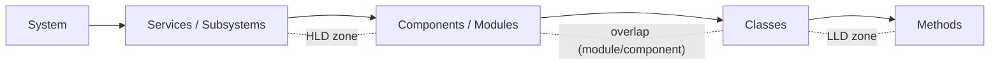
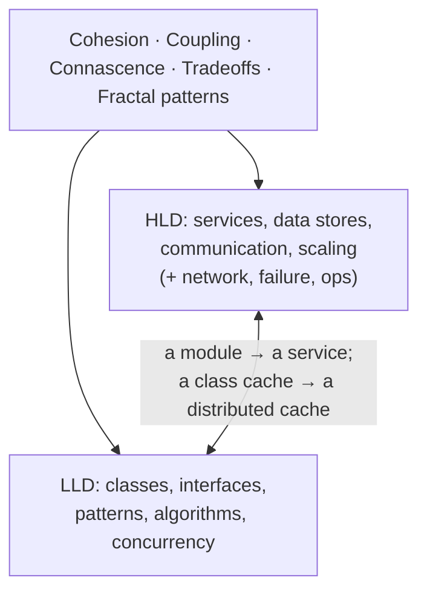

# Lesson 2.4.5 — From LLD to HLD: Where the Boundary Really Is

> Part 2: Architecture Fundamentals · Module 2.4: Low-Level Design · Difficulty: 🟡 · **Completes Module 2.4 and Part 2**
>
> **Prerequisites:** all of Module 2.4, [1.1.1 What Design Is], [2.1.1 Coupling].
> **Unlocks:** Part 3 onward (all HLD), [Part 19 Interview Designs] (which blend both levels).

---

## 1. Learning Objectives

After this lesson you will be able to:

- Precisely distinguish **Low-Level Design (LLD)** from **High-Level Design (HLD)** — and see they're a *continuum of zoom levels*, not a hard wall.
- Explain why the **same principles** (cohesion, coupling, tradeoffs, the fractal patterns) govern both levels.
- Know which concerns belong to which level and how an LLD decision can become an HLD one (and vice versa).
- Navigate fluidly between levels in interviews and real design — the hallmark of a senior engineer.
- Transition confidently from Part 2 (fundamentals/LLD) into the HLD-heavy remainder of the platform.

---

## 2. Motivation — One skill, two zoom levels

Engineers often treat LLD and HLD as separate disciplines: "LLD is classes and patterns; HLD is boxes and databases." That framing is *useful* for organizing study but *misleading* about the underlying reality. As this whole part has shown, **the same physics — cohesion, coupling, connascence (2.1.1), tradeoffs (1.1.5), and the fractal patterns (2.4.2) — governs both levels.** A microservice is a class with a network boundary (2.1.1 §3.6); a distributed cache is the LRU you built (2.4.4) with consistent hashing; a Saga is a State machine across services.

This closing lesson of Part 2 makes the LLD↔HLD relationship explicit, so that as you move into Parts 3–20 (which are HLD-heavy), you carry your LLD intuition with you — and so you can *zoom fluidly* between "what are the services?" and "what are the classes inside this one?" in a design conversation. That fluidity is a defining senior trait (1.3.2).

---

## 3. Theory — From first principles

### 3.1 Definitions and the continuum

> **High-Level Design (HLD)** is the *macro* view: what **components/services** exist, what data stores and infrastructure they use, and how they **interact** (APIs, events, data flows). It answers "what are the boxes and arrows?"
>
> **Low-Level Design (LLD)** is the *micro* view: how a **single component is structured internally** — its classes, interfaces, data structures, algorithms, and concurrency. It answers "how is this box built inside?"

But these are **zoom levels on one continuum**, not separate worlds `[CS]`:

```
System  →  Subsystems/Services  →  Components/Modules  →  Classes  →  Methods
└────────────── HLD ──────────────┘                    └──────── LLD ────────┘
                          (they overlap in the middle)
```

There's no hard boundary — "module" and "component" sit in the overlap. The same decomposition question ("where do boundaries go?") applies at every zoom; only the *granularity* and the *cost of getting it wrong* change.

### 3.2 What lives at each level (a rough division of concerns)

| Concern | Primarily HLD | Primarily LLD |
|---|---|---|
| Service/component boundaries | ✓ (which services) | ✓ (which classes) |
| Data stores & their choice | ✓ | — |
| Inter-service communication (API/events) | ✓ | — |
| Scaling, replication, partitioning | ✓ | — |
| Class structure, interfaces | — | ✓ |
| Design patterns (GoF) | — | ✓ |
| Algorithms & data structures | — | ✓ |
| Concurrency within a component | — | ✓ |
| Cohesion / coupling | ✓ (services) | ✓ (classes) |
| Tradeoff reasoning (1.1.5) | ✓ | ✓ |
| Patterns (fractal) | ✓ (architectural) | ✓ (object) |

The bottom three rows are the point: **the principles span both levels.** HLD decides the boxes; LLD decides each box's internals; and both are governed by cohesion/coupling and tradeoffs.

### 3.3 The same principles at both scales (the unifying thesis)

This part has repeatedly shown the **scale-invariance**:
- **Cohesion/coupling/connascence (2.1.1)** → applies to classes (LLD) *and* services (HLD); a microservice is a module with a network boundary.
- **DDD bounded contexts (2.1.3)** → define both module boundaries (LLD/modular monolith) and service boundaries (HLD/microservices).
- **The fractal patterns (2.4.2)** → Proxy (class) → caching proxy/sidecar (HLD); Observer (class) → event-driven architecture (HLD); Strategy (class) → pluggable LB/eviction policies (HLD).
- **Concurrency (2.4.3)** → local concurrency (LLD) → distributed concurrency with network failure (HLD/Part 8); actors → microservices.
- **The LLD case-study cruxes (2.4.4)** → each is the local version of a distributed (HLD) problem.
- **Tradeoffs (1.1.5)** and **decisions under uncertainty (1.1.1)** → identical reasoning at both levels.

So learning isn't "LLD then a totally new subject called HLD" — it's **the same skill applied at a higher zoom,** with new *forces* introduced by distribution (network, partial failure, the distributed tax — 2.2.3, 2.3.2).

### 3.4 What's genuinely *different* at HLD (the new forces)

Zooming out to HLD does introduce concerns that barely exist in LLD `[CS]`:
- **The network** — calls are slow (1.1.3) and *can fail independently* (partial failure, Part 8) — no compiler, no shared memory.
- **Distributed data** — no single transaction across boundaries (2.3.2; Sagas, Part 11).
- **Independent failure & scaling** — components fail/scale separately (Parts 7, 11).
- **Operational concerns** — deployment, observability, infrastructure (Parts 13, 14, 16).
- **Irreversibility** — HLD boundary decisions (service splits, data ownership) are bigger one-way doors (1.1.1) than LLD ones (you can refactor a class far more easily than re-merge services).

So the *principles* are the same, but the *stakes and failure modes* grow as you zoom out. This is why HLD gets the bulk of the platform (Parts 3–20): the principles are familiar, but the distributed forces require deep, dedicated study.

### 3.5 An LLD decision can become an HLD one (and vice versa)

The boundary *moves*:
- A **module** in a modular monolith (LLD-ish) becomes a **service** (HLD) when extracted (2.2.1) — the same boundary, now a network boundary.
- A **class-level cache** (LLD, 2.4.4) becomes a **distributed cache** (HLD, Part 6) when it must be shared across servers.
- A **Strategy** for an algorithm (LLD) becomes a **configurable policy across a fleet** (HLD).
- Conversely, an HLD service's internals are an LLD problem.

This fluidity is why you must hold *both* levels: a good HLD decision (extract this service) creates LLD work (design its internal classes), and a good LLD design (clean module boundaries) *enables* future HLD options (cheap extraction). They co-evolve.

### 3.6 Navigating levels in practice (the senior skill)

In a design conversation (1.3.2), you **zoom fluidly**:
- Start at HLD (the framework's HLD step, 1.3.1): services, data, flows.
- **Zoom into LLD** when the interviewer (or the hard part) demands a component's internals: "let me design the booking service's classes and how it prevents double-booking" (2.4.4).
- **Zoom back to HLD** to discuss how that component scales/replicates/fails.
- Explicitly **signal the zoom** ("zooming into the rate-limiter's internals… now back to how it's distributed across servers").

The senior signal (1.3.2 §3.7): handling *both* levels and connecting them ("this class-level Strategy becomes a fleet-wide policy"; "this LRU is the node-local version of our distributed cache"). Juniors often get stuck at one level; Staff+ engineers move between them deliberately and show the connections.

---

## 4. Visual Intuition

### The zoom continuum (no hard wall)



### Same principle, two scales



---

## 5. Real-World Analogy

**Designing a building vs designing a room.** **HLD** is the architect's site plan: how many buildings, where the roads and utilities run, how the buildings connect (the boxes and arrows). **LLD** is the interior design of a single room: where the furniture, outlets, and fixtures go (the classes and methods inside one component). These feel like different jobs — but they obey the **same principles**: good *flow* and *separation of function* (cohesion), minimal awkward dependencies between spaces (coupling), and tradeoffs (more walls = more privacy but less light). A great architect moves fluidly between the site plan and the room layout, knowing a room's design (LLD) must serve the building's plan (HLD), and the plan must leave room for good interiors. The genuinely *new* concerns when you zoom out to the whole site — plumbing across buildings, what happens if one building loses power (partial failure), permits and maintenance (operations) — are exactly the "distributed forces" that HLD adds on top of the shared design principles.

---

## 6. Industry Example

- **Interviews blend both** `[CONV]`: senior/Staff system-design interviews routinely start at HLD (design the system) then zoom into LLD for a critical component (design these classes / this algorithm / this concurrency) — and back. The ability to do both is explicitly assessed (Part 19).
- **Modular monolith → microservice extraction** `[CONV]`: a real-world example of an LLD-scale module boundary *becoming* an HLD-scale service boundary (2.2.1) — same boundary, bigger stakes.
- **Distributed versions of LLD primitives** `[CONV]`: distributed caches (Part 6) are LRU caches across machines; distributed rate limiters (Part 19.1.2) are token buckets across servers; distributed locks (Part 8) are mutexes across machines — the LLD primitive scaled up with new (network/failure) forces.
- **The fractal patterns** `[CONV]`: Proxy/Observer/Strategy appearing identically at class and architectural scale (2.4.2 §3.5) is the clearest industry evidence that it's one skill at two zooms.

---

## 7. Implementation Details — Working across levels

- **In the design framework (1.3.1):** HLD is steps 4–5 (data model, high-level design); LLD deep-dives happen in step 6 when a component's internals are the hard part. Move between them as the problem demands.
- **Let the crux decide the zoom:** if the hard part is *which services and how they share data* → stay HLD; if it's *how this one component prevents a race or achieves O(1)* → zoom to LLD (2.4.4).
- **Design LLD to enable HLD options:** clean module boundaries + data ownership (2.2.1) make future service extraction cheap; a Strategy interface makes a behavior fleet-configurable later.
- **Carry LLD intuition into HLD:** when you meet distributed caching (Part 6), recall the LRU (2.4.4); when you meet Sagas (Part 11), recall the State machine; when you meet consistent hashing (Part 7), recall partitioning.
- **Signal zooms explicitly** in conversation (1.3.2) so the interviewer follows you between levels.

---

## 8. Advantages (of seeing it as one continuum)

- **Transferable intuition** — LLD skills accelerate HLD learning (and vice versa) because it's the same physics.
- **Fluid design conversations** — you move between "the services" and "this class" without friction (senior signal).
- **Better decisions** — LLD designs that preserve HLD options (cheap extraction), and HLD decisions that respect LLD realities.
- **Coherent mental model** — one framework (cohesion/coupling/tradeoffs/fractal patterns) for everything, instead of two disconnected toolkits.

---

## 9. Disadvantages / Caveats

- **The continuum can blur responsibilities** — on large teams, HLD (architects) and LLD (component teams) may be owned separately; the *handoff* needs clear contracts (the boundary between them is itself a coupling point).
- **New HLD forces are genuinely hard** — "same principles" doesn't mean "same difficulty"; the network, partial failure, and distributed data (Parts 8–11) require dedicated study, not just zoomed-in LLD intuition.
- **Over-zooming** — diving to LLD too early in an HLD discussion (or vice versa) wastes time; match the zoom to the crux.

---

## 10. When the distinction matters most

- **Interviews** — know whether the round is HLD, LLD, or both, and zoom accordingly (don't give a class diagram for an HLD prompt).
- **Team handoffs** — when architects hand an HLD to component teams, the LLD is theirs; define the contract (the component's interface/responsibilities) clearly.
- **Deciding extraction** — when an LLD module should *become* an HLD service (2.2.1 triggers) is a decision that explicitly crosses the boundary.

---

## 11. Common Mistakes

1. **Treating LLD and HLD as unrelated subjects** — missing that the same principles govern both (the central error this lesson corrects).
2. **Wrong zoom for the context** — giving classes for an HLD prompt, or boxes-and-arrows for an LLD prompt.
3. **LLD that blocks HLD** — a monolith with no module boundaries that can't be extracted later (2.2.1 ball of mud).
4. **Ignoring the new HLD forces** — applying LLD intuition to distributed problems without accounting for network/partial failure (e.g., treating a remote call like a local one — fallacies of distributed computing, Part 11).
5. **Getting stuck at one level** — unable to zoom in to internals or out to architecture during a design (a junior signal, 1.3.2).
6. **Not signaling zooms** — confusing the interviewer by jumping levels silently.

---

## 12. Interview Questions

**🟢 Easy**
- What's the difference between HLD and LLD? Give an example concern at each level.
- Why do we say they're a "continuum" rather than separate disciplines?

**🟡 Medium**
- Give three examples of the same principle/pattern appearing at both the class (LLD) and architecture (HLD) levels.
- An interviewer asks you to "design Twitter" and then "now design the Tweet service's internal classes." How do you recognize and handle each zoom level?

**🔴 Hard**
- Take a class-level LRU cache (2.4.4) and walk it up to an HLD distributed cache (Part 6): what stays the same (the principle/structure) and what new forces appear (network, partitioning, consistency, failure)?
- When should an LLD module become an HLD service? Walk through the decision (2.2.1 triggers) and what new concerns the boundary crossing introduces.

**⚫ Staff+**
- Argue that LLD and HLD are "one skill at two zoom levels." Use cohesion/coupling, the fractal patterns, and the LLD case-study cruxes to support it — then identify precisely what is *genuinely new* at HLD and why it warrants the bulk of system-design study.
- Describe how you'd structure a design review/interview to assess a candidate at *both* levels and their ability to connect them. What would distinguish a Staff+ answer from a Senior one in moving between levels?

---

## 13. Production Pitfalls

- **Local-call assumptions on remote calls:** treating a network call like an in-process method (no timeout/retry, assuming it can't fail) — the LLD→HLD intuition gap; a top distributed-systems bug (fallacies of distributed computing, Part 11).
- **Unextractable monolith:** LLD with no clean module boundaries, so the HLD decision to extract a service becomes a massive rewrite (2.2.1, 2.3.2 data untangling).
- **Over-distributed design:** applying HLD distribution (microservices) to what is really an LLD-scale concern, paying the distributed tax for nothing (2.2.3).
- **Handoff gaps:** HLD that under-specifies a component's contract, so LLD teams build the wrong internals or couple to neighbors incorrectly.

---

## 14. Optimization Techniques

- **Design LLD to preserve HLD options** — clean module boundaries + data ownership enable cheap future extraction (2.2.1).
- **Reuse LLD primitives' intuition at HLD** — LRU→distributed cache, mutex→distributed lock, State→Saga, Observer→EDA; this accelerates HLD reasoning.
- **Match zoom to the crux** and **signal zooms explicitly** in design conversations (1.3.2).
- **Account for the new forces** when crossing to HLD — add network/failure/consistency reasoning (Parts 8–11) on top of the shared principles.
- **Define clear component contracts** at the HLD/LLD handoff so the boundary stays a clean coupling point.

---

## 15. Summary

LLD and HLD are not separate disciplines but **two zoom levels on one continuum**: HLD is the *macro* view (which services/components exist, their data stores, and how they interact) and LLD is the *micro* view (a single component's classes, interfaces, patterns, algorithms, and concurrency) — overlapping in the middle at "module/component." The unifying thesis of this entire part holds: **the same principles — cohesion, coupling, connascence (2.1.1), tradeoffs (1.1.5), decisions under uncertainty (1.1.1), and the fractal design patterns (2.4.2) — govern both levels**, so a microservice is a class with a network boundary, a distributed cache is the LRU you built scaled up, and a Saga is a State machine across services. What's *genuinely new* at HLD is not the principles but the **forces**: the network and partial failure, distributed data, independent failure/scaling, operational concerns, and the greater **irreversibility** of boundary decisions — which is exactly why HLD warrants the deep, dedicated study of Parts 3–20. The boundary *moves* (a module becomes a service; a class cache becomes a distributed cache), so good LLD preserves HLD options and good HLD respects LLD realities — they co-evolve. The senior skill (1.3.2) is **zooming fluidly between levels and connecting them**. With this, **Part 2 is complete**: you have the architecture fundamentals — components/coupling (2.1), styles (2.2), decisions/governance (2.3), and low-level design (2.4) — and you're ready to descend into the HLD substrate, beginning with **Part 3: Networking**, the medium on which every distributed system runs.

---

## 16. Revision Notes (flashcard-ready)

- **Q:** HLD vs LLD? **A:** HLD = macro (services, data stores, interactions); LLD = micro (a component's classes, patterns, algorithms, concurrency).
- **Q:** Are they separate disciplines? **A:** No — zoom levels on one continuum (overlap at module/component).
- **Q:** What's shared across both levels? **A:** Cohesion, coupling, connascence, tradeoffs, fractal patterns.
- **Q:** What's genuinely new at HLD? **A:** Network/partial failure, distributed data, independent failure/scaling, ops, greater irreversibility.
- **Q:** A microservice is…? **A:** A class/module with a network boundary (2.1.1 §3.6).
- **Q:** Examples of a boundary moving LLD→HLD? **A:** Module→service; class cache→distributed cache; Strategy→fleet-wide policy.
- **Q:** Senior skill re: levels? **A:** Zooming fluidly between them and connecting them (signal the zoom).
- **Q:** Why does HLD get the bulk of study? **A:** Same principles, but the distributed *forces* (network/failure/data/ops) are genuinely hard.
- **Q:** Top LLD→HLD pitfall? **A:** Treating a remote call like a local one (no failure handling) — fallacies of distributed computing.

---

## 17. Further Reading + Knowledge-Graph Links

**Within this platform**
- **Previous:** [2.4.4 LLD Case Studies]. **Completes Module 2.4 and Part 2.** **Next: Part 3 — Networking Deep Dive** ([3.1.1 The Layered Model in Practice]).
- **Synthesizes:** all of Part 2 — [2.1 Components & Coupling], [2.2 Styles], [2.3 Decisions], [2.4 LLD] — and ties back to [1.1.1 What Design Is].
- **Forward (HLD with new forces):** [Part 6 distributed caching], [Part 7 partitioning/consistent hashing], [Part 8 distributed locks/clocks/consensus], [Part 11 Sagas/fallacies of distributed computing], [Part 19 interview designs blending both levels].

**Foundational texts (synthesized)**
- Richards & Ford, *Fundamentals of Software Architecture* — architecture (HLD) vs design (LLD) as related zoom levels; the architect–developer continuum.
- Newman, *Building Microservices* — services as modules with network boundaries (the LLD↔HLD bridge).
- Ford et al., *Software Architecture: The Hard Parts* — how component (LLD-ish) decisions become distributed (HLD) ones.

**Concept tags:** `[CS]` HLD/LLD as a zoom continuum, scale-invariant principles · `[CONV]` interviews assess both levels, distributed versions of LLD primitives · `[BP]` design LLD to preserve HLD options, signal zooms, account for new forces.
