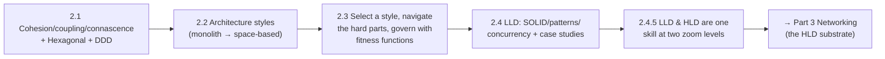

# Part 2 — Architecture Fundamentals ✅ COMPLETE

The structural building blocks and styles, the decision/governance discipline, and low-level design — all unified by one idea: **cohesion, coupling, and tradeoffs are the same physics at every scale.**

---

## Lessons

### Module 2.1 — Components & Coupling
| # | Lesson | Core idea |
|---|--------|-----------|
| 2.1.1 | [Modularity, Cohesion, Coupling, Connascence](2.1.1-modularity-cohesion-coupling-connascence.md) | High cohesion + low coupling; connascence (strength/degree/locality); same physics at every scale |
| 2.1.2 | [Layering, Ports & Adapters, Clean](2.1.2-layering-hexagonal-clean.md) | Dependency Inversion; protect the domain from infrastructure; testability |
| 2.1.3 | [Domain-Driven Design Essentials](2.1.3-domain-driven-design-essentials.md) | Bounded contexts, aggregates (= consistency boundary), ubiquitous language, Conway's Law |

### Module 2.2 — Architecture Styles
| # | Lesson | Core idea |
|---|--------|-----------|
| 2.2.1 | [Monolith & Modular Monolith](2.2.1-monolith-and-modular-monolith.md) | Deployment vs structure axes; monolith-first; extraction triggers; reversibility asymmetry |
| 2.2.2 | [Layered, Pipeline, Microkernel](2.2.2-layered-pipeline-microkernel.md) | Structural styles as tradeoff bundles; pipeline & plugin patterns at every scale |
| 2.2.3 | [Service-Based, Microservices, SOA](2.2.3-service-based-microservices-soa.md) | The granularity spectrum; distributed-systems tax; independent deployability |
| 2.2.4 | [Event-Driven Architecture](2.2.4-event-driven-architecture.md) | Inverted dependency; broker vs mediator; eventual consistency; outbox |
| 2.2.5 | [Space-Based Architecture](2.2.5-space-based-architecture.md) | In-memory grid; remove the DB from the hot path; eventual durability |

### Module 2.3 — Decisions & Tradeoffs
| # | Lesson | Core idea |
|---|--------|-----------|
| 2.3.1 | [Characteristics → Style Selection](2.3.1-characteristics-to-style-selection.md) | Map ranked drivers to a style; the comparison matrix; avoid hype |
| 2.3.2 | [The Hard Parts](2.3.2-the-hard-parts.md) | Decomposition (disintegrators/integrators), data ownership, communication (dynamic coupling) |
| 2.3.3 | [Tech Debt, Fitness Functions, Evolutionary Architecture](2.3.3-technical-debt-fitness-functions-evolutionary.md) | The governance loop that keeps decisions durable |

### Module 2.4 — Low-Level Design (LLD)
| # | Lesson | Core idea |
|---|--------|-----------|
| 2.4.1 | [SOLID, GRASP, Design Smells](2.4.1-solid-grasp-design-smells.md) | LLD principles = cohesion/coupling at object scale; heuristics not laws |
| 2.4.2 | [Design Patterns for Systems](2.4.2-design-patterns-for-systems.md) | Patterns = SOLID made concrete; fractal (Proxy→sidecar, Observer→EDA) |
| 2.4.3 | [Concurrency Patterns](2.4.3-concurrency-patterns.md) | Producer-consumer, thread pools, futures, actors; share-nothing > coordinate |
| 2.4.4 | [LLD Case Studies](2.4.4-lld-case-studies.md) | Parking lot, rate limiter, LRU cache, BookMyShow — each a distributed problem in miniature |
| 2.4.5 | [From LLD to HLD](2.4.5-from-lld-to-hld.md) | LLD/HLD are zoom levels on one continuum; same principles, new distributed forces |

---

## The through-line of Part 2

**One sentence:** Structure is governed by cohesion, coupling, and tradeoffs at *every* scale — so you decompose by bounded context, choose an architecture style from your ranked drivers, navigate the irreducibly hard tradeoffs of distribution, govern against erosion with fitness functions, and design clean classes with SOLID/patterns/concurrency — knowing LLD and HLD are the same skill zoomed in and out.

---

## Self-check before Part 3

Without notes, can you:
1. Define cohesion, coupling, and connascence (with its 3 properties), and explain "same physics at every scale"?
2. Explain Dependency Inversion and how Hexagonal/Clean protects the domain?
3. Define a bounded context and why an aggregate is the unit of consistency?
4. Place the architecture styles on the distribution spectrum and pick one from driving characteristics?
5. Explain the monolith-first principle and the triggers to decompose?
6. Describe broker vs mediator event-driven topologies and the outbox pattern?
7. State the three "hard parts" and why distributed data is the hardest?
8. Explain technical debt (the quadrant), fitness functions, and evolutionary architecture?
9. Apply SOLID/GRASP and the key patterns; design a thread-safe LRU cache and a rate limiter?
10. Explain why LLD and HLD are one continuum?

If any are shaky, revisit that lesson's Revision Notes. Part 3 (Networking) begins the HLD substrate.

---

*Reference assets for this part: `../../reference/architecture-comparison-matrix.md`, `../../reference/tradeoff-worksheet.md`.*
