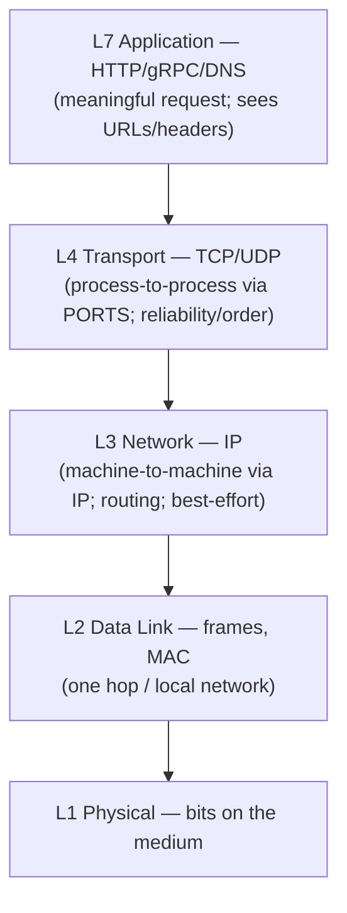
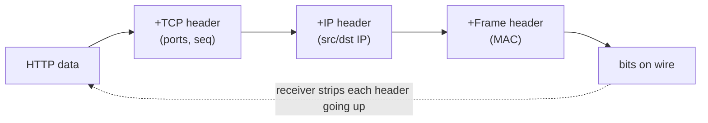
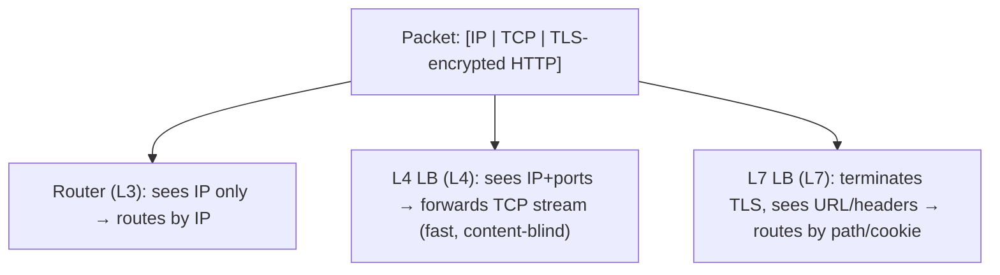

# Lesson 3.1.1 — The Layered Network Model in Practice (L3/L4/L7)

> Part 3: Networking Deep Dive · Module 3.1: Transport & Internet Layers · Difficulty: 🟡
>
> **Prerequisites:** basic networking (IP, ports, client/server); [1.1.3 Latency].
> **Unlocks:** [3.1.2 IP/Routing], [3.1.3 TCP], [3.2 Application Protocols], [3.3 Load Balancing].

---

## 1. Learning Objectives

After this lesson you will be able to:

- Explain the layered network model (OSI vs the practical TCP/IP model) and **why layering exists** (it's the cohesion/coupling principle of 2.1.1 applied to networks).
- Map the layers an architect actually cares about: **L3 (network/IP), L4 (transport/TCP-UDP), L7 (application/HTTP)** — and what each adds.
- Understand **encapsulation** — how data is wrapped in headers layer by layer — and why it matters for performance and debugging.
- Use the L3/L4/L7 distinction to reason about **load balancers, firewalls, and proxies** (which operate at which layer).

---

## 2. Motivation — Why an architect must know the layers

Every distributed system runs on the network, and the network is **layered**. You don't need to be a network engineer, but you *must* know enough to make architectural decisions: Is this load balancer L4 or L7, and why does that matter (3.3)? Why does TLS sit between L4 and L7? Why is a "connection" expensive to set up (3.1.3)? Why does HTTP/2 multiplexing help but TCP head-of-line blocking still bite (3.2.2)? All of these are *layer* questions.

The layered model is also a beautiful real-world example of the **architecture principles from Part 2**: each layer has **high cohesion** (one job), **low coupling** (talks only to adjacent layers via a clean interface), and is **swappable** (you can change the physical medium without touching HTTP) — it's the Ports & Adapters idea (2.1.2) at internet scale. Understanding *why* it's layered makes the whole stack intuitive rather than memorized. This lesson is the map for the rest of Part 3.

---

## 3. Theory — From first principles

### 3.1 Why layer at all?

The network must solve an enormous range of problems: turning bits into signals on wire/fiber/radio, getting packets across the globe through unknown routers, ensuring reliable delivery despite loss, and giving applications a meaningful conversation. Cramming all of that into one monolithic protocol would be an unmaintainable ball of mud (1.2.2). 

Instead, networking uses **layering** `[CS]`: each layer solves *one* problem and offers a clean service to the layer above, depending only on the layer below. This is exactly **high cohesion + low coupling** (2.1.1):
- **Separation of concerns** — the application (HTTP) doesn't care if it's on fiber or Wi-Fi; the physical layer doesn't know about web requests.
- **Swappability** — replace the physical medium (Ethernet → Wi-Fi → 5G) without changing TCP or HTTP. Each layer is a swappable adapter (2.1.2).
- **Independent evolution** — HTTP can evolve (1.1→2→3) and IP can evolve (v4→v6) somewhat independently.

The cost (a tradeoff, 1.1.5): layering adds **overhead** (each layer's header, processing) and can hide information (a layer can't easily see another's state — e.g., TCP retransmits invisibly to HTTP, causing head-of-line blocking, 3.2.2). But the maintainability/evolvability win is overwhelming — which is why the internet is layered.

### 3.2 OSI vs TCP/IP (the practical model)

Two reference models `[CS]`:

- **OSI 7-layer model** (conceptual teaching model): Physical (1) → Data Link (2) → Network (3) → Transport (4) → Session (5) → Presentation (6) → Application (7).
- **TCP/IP model** (what's actually implemented): Link → Internet → Transport → Application. The session/presentation layers are folded into the application layer in practice.

For an architect, the layers that matter day to day are referenced by their OSI numbers:
- **L3 — Network (IP):** routing packets between machines across networks. Address = **IP address**. (3.1.2)
- **L4 — Transport (TCP/UDP):** delivering data between *processes* on machines. Address = **port**. Adds reliability (TCP) or speed (UDP). (3.1.3–3.1.4)
- **L7 — Application (HTTP, gRPC, DNS, etc.):** the meaningful conversation between applications. (3.2)

You'll constantly hear "L4 vs L7" (especially for load balancers and proxies, 3.3) — that's this model. (TLS sits conceptually between L4 and L7, sometimes called "L5/6" or just "the TLS layer" — 3.2.3.)

### 3.3 What each layer does (bottom-up, architect's view)

- **Physical (L1):** raw bits → electrical/optical/radio signals on a medium. (Architects rarely touch this.)
- **Data Link (L2):** frames between *directly connected* nodes on the same local network; uses **MAC addresses**; handles local delivery (e.g., Ethernet switches). Scope: one hop / one LAN.
- **Network (L3 — IP):** moves **packets** between *any* two machines across multiple networks via **routing**; uses **IP addresses**; **best-effort** (no delivery guarantee, no order). This is what makes the "inter-net" — networks of networks. (3.1.2)
- **Transport (L4 — TCP/UDP):** delivers data between **processes** (via **ports**). **TCP** adds reliability, ordering, flow & congestion control (a *connection*); **UDP** is bare, fast, connectionless (3.1.3–3.1.4).
- **Application (L7):** the protocol the apps actually speak — HTTP, gRPC, DNS, SMTP, WebSocket. Carries the meaningful request/response. (3.2)

Each layer **uses** the layer below and **serves** the layer above — a strict dependency direction (recall layered architecture, 2.2.2; the dependency points down the stack).

### 3.4 Encapsulation — how a request becomes packets

When you send an HTTP request, it's **encapsulated** layer by layer `[CS]` — each layer wraps the data from above in its own **header** (and sometimes trailer):

```
Application: [ HTTP request ]
Transport:   [ TCP header | HTTP request ]        ← adds ports, seq numbers
Network:     [ IP header  | TCP header | HTTP ]   ← adds source/dest IP
Data Link:   [ Frame hdr  | IP | TCP | HTTP | Frame trailer ]  ← adds MAC
Physical:    bits on the wire
```

At the receiver, each layer **strips its header** (de-encapsulation) and hands the payload up. Each layer only reads *its own* header — it treats the rest as opaque payload (information hiding, 2.1.2). 

Why this matters for architects:
- **Overhead:** every layer adds header bytes — relevant for small messages and high throughput (the per-packet overhead, MTU considerations).
- **Where things operate:** an **L3 device** (router) reads IP headers; an **L4 load balancer** reads TCP headers (ports); an **L7 load balancer/proxy** reads the HTTP payload (URLs, headers, cookies) — which is why L7 can route by URL but L4 can't (3.3). 
- **Encryption boundary:** TLS encrypts the L7 payload (and TCP payload), so an L4 device can route by IP/port but *can't see the HTTP content* (3.2.3) — a key security and load-balancing implication.

### 3.5 The L4 vs L7 distinction (the most practically important takeaway)

Because each layer sees only its header, **devices operate at a layer and can only act on what that layer exposes** `[CS]`:

- **L3 (IP):** sees source/destination IP. Routers forward by IP; basic IP firewalls filter by IP.
- **L4 (TCP/UDP):** sees IP + **ports** + connection state. An **L4 load balancer** routes by IP/port, is fast and protocol-agnostic, but **can't see the URL or content** (it just forwards the TCP stream). Cheaper, lower latency.
- **L7 (HTTP):** sees the full application payload — **URLs, headers, cookies, methods**. An **L7 load balancer / reverse proxy / API gateway** can route by path (`/api/*` → service A), do TLS termination, header-based routing, and content inspection — but is more expensive (must parse the payload) and protocol-specific.

This single distinction drives a huge number of architecture decisions (3.3, Part 12 gateways) — *know which layer your routing/filtering needs to see, and pick the device at that layer.*

---

## 4. Visual Intuition

### The layers and what each adds



### Encapsulation (headers added going down)



### What each device "sees" (L3 vs L4 vs L7)



---

## 5. Real-World Analogy

**The postal system.** Sending a letter abroad is layered exactly like the network. You **write the letter** (L7 — the meaningful content). You put it in an **envelope with a recipient name** (L4 — addressing the specific *person/process* in the building via a "port" = apartment number). The envelope goes in a **mailbag addressed to a city/building** (L3 — the IP address, routed across the country by postal hubs that only read the city address, not the letter inside). Trucks and planes carry the bag (L1/L2 — the physical medium). Each handler reads **only their layer's label**: the long-haul trucker reads the city (L3), the local mail carrier reads the street/building, the receptionist reads the apartment number (L4), and only the recipient opens and reads the letter (L7). A sorting facility (an **L3 router**) can forward your bag by city without ever opening the envelope; a building concierge who *can* open envelopes (an **L7 proxy**) could route mail by its contents — but that's slower and more invasive. And if the letter is in a **sealed, coded message** (TLS), the postal workers can deliver the envelope by address but can't read the contents — exactly like an L4 load balancer with encrypted traffic.

---

## 6. Industry Example

- **L4 vs L7 load balancers** `[CONV]`: cloud load balancers are explicitly split — e.g., L4 (network/TCP) load balancers for raw speed and protocol-agnostic forwarding, and L7 (application/HTTP) load balancers for path/host-based routing, TLS termination, and content rules (AWS NLB vs ALB, GCP/Azure equivalents). The choice is a direct application of §3.5 (3.3 goes deep).
- **TLS termination at L7** `[CONV]`: reverse proxies / API gateways (NGINX, Envoy) commonly terminate TLS at L7 so they can read and route by HTTP content, then re-encrypt or forward internally — a layering decision with security implications (3.2.3, Part 15).
- **The end-to-end principle** `[CS]`: a foundational internet design principle — keep the network (lower layers) simple and "dumb," push intelligence (reliability, application logic) to the endpoints (higher layers). This is *why* IP is best-effort and TCP/apps handle reliability — and it's the same "keep the core minimal" idea as microkernel (2.2.2).
- **Service mesh sidecars** `[CONV]`: operate largely at L7 (and L4), inspecting/routing application traffic transparently (Part 12) — a Proxy pattern (2.4.2) at the network layer.

---

## 7. Implementation Details — Using the model

- **Pick the device at the layer that sees what you need to act on** (§3.5): route by URL/path/header → **L7**; raw TCP/UDP forwarding, max throughput, non-HTTP protocols → **L4**. Filter by IP → **L3** firewall; by port → **L4**.
- **Account for layering overhead** in capacity estimation (1.1.4): header bytes per packet, MTU (~1500 bytes typical Ethernet) limiting packet payload, and the cost of L7 parsing vs L4 forwarding.
- **Know the encryption boundary** (3.2.3): TLS hides L7 content from L4/L3 devices — so content-based routing requires TLS termination at an L7 device (a security/architecture decision; mTLS in service mesh keeps it encrypted between sidecars — Part 12, 15).
- **Debug by layer:** when something's broken, isolate the layer — is it DNS (L7 name resolution, 3.2.4), TCP connectivity (L4 — can you open the port?), IP routing (L3 — can you reach the host?), or the application (L7)? Tools map to layers (`ping`=L3, `telnet`/port checks=L4, `curl`=L7).
- **Respect the end-to-end principle:** don't push application reliability into the network; handle retries/idempotency at the endpoints (Part 11).

---

## 8. Advantages (of the layered model)

- **Separation of concerns** — each layer solves one problem (high cohesion, 2.1.1).
- **Swappability & evolution** — change the medium (Wi-Fi/5G) or a protocol (IPv4→v6, HTTP/1→2→3) without rewriting the rest.
- **Interoperability** — standardized layer interfaces let any vendor's hardware/software interoperate (the internet works because of this).
- **Clear reasoning for architects** — the L3/L4/L7 distinction makes load-balancer/proxy/firewall choices straightforward.

---

## 9. Disadvantages / Costs

- **Overhead** — per-layer headers and processing add latency and bytes (relevant at high throughput / small messages).
- **Information hiding cuts both ways** — a layer can't see another's state, causing issues like TCP head-of-line blocking being invisible to (and unfixable by) HTTP/2 (3.2.2) — which QUIC fixes by *reshuffling* the layers (3.1.5).
- **Leaky abstractions** — sometimes you *must* understand lower layers to debug/optimize upper ones (e.g., TCP behavior affecting HTTP latency).

---

## 10. When this matters most (and least)

- **Matters most:** choosing load balancers/proxies/gateways (L4 vs L7, 3.3, Part 12), designing for TLS/security (3.2.3, Part 15), debugging connectivity, and reasoning about latency/overhead (1.1.3, Part 17).
- **Matters least:** day-to-day application coding above L7 — you mostly use HTTP/gRPC libraries without thinking about frames. But the moment performance, security, or routing decisions arise, the layers re-enter.

---

## 11. Common Mistakes

1. **Confusing L4 and L7 load balancers** — expecting an L4 LB to route by URL (it can't see the URL) or paying for L7 parsing when L4 forwarding suffices (3.3).
2. **Forgetting the encryption boundary** — trying to do content-based routing on TLS-encrypted traffic without terminating TLS (3.2.3).
3. **Ignoring layering overhead** — underestimating per-packet header cost / MTU effects in high-throughput estimates.
4. **Treating the network as reliable** (violating the end-to-end principle) — assuming IP/TCP guarantee delivery to your app without endpoint-level retries/idempotency (Part 11 fallacies).
5. **Layer confusion in debugging** — checking the application when the real problem is DNS (L7), routing (L3), or a closed port (L4).
6. **Assuming OSI = implementation** — OSI is a teaching model; TCP/IP is what's deployed (sessions/presentation folded into the app).

---

## 12. Interview Questions

**🟢 Easy**
- What do L3, L4, and L7 correspond to, and what address does each use (IP / port / URL)?
- Why is the network layered? Give one benefit and one cost.

**🟡 Medium**
- What's the difference between an L4 and an L7 load balancer? Give a routing decision each can and cannot make.
- Explain encapsulation. Why can an L4 device not route based on the URL?

**🔴 Hard**
- TLS-encrypted traffic needs path-based routing (`/api` → service A, `/img` → service B). At which layer must this happen, what does it require (TLS termination), and what are the security implications (Part 15)?
- Explain the end-to-end principle and how it shaped IP (best-effort) and TCP. How does it relate to "keep the core minimal" (microkernel, 2.2.2)?

**⚫ Staff+**
- TCP head-of-line blocking hurts HTTP/2 performance, but HTTP/2 can't fix it because the relevant state is in a lower layer it can't see. Explain how this is a *consequence of layering*, and how QUIC (3.1.5) addresses it by restructuring the stack. What's the tradeoff?
- Design the L3/L4/L7 traffic-management strategy for a global service: where do you use L4 vs L7 LBs, where does TLS terminate, and how does this interact with CDNs (3.3.3) and a service mesh (Part 12)? Justify each layer choice.

---

## 13. Production Pitfalls

- **Wrong-layer load balancer:** deploying an L4 LB then discovering you need path-based routing (an L7 capability) — a re-architecture; or using an expensive L7 LB where L4 would be faster and cheaper.
- **TLS-everywhere blind spots:** content-based routing/inspection silently impossible because traffic is encrypted end-to-end and never terminated at an L7 device.
- **MTU/fragmentation issues:** oversized packets fragmented or dropped (e.g., MTU mismatches in tunnels/VPNs) causing mysterious connectivity/perf problems — a lower-layer issue manifesting as app errors.
- **Mis-diagnosed outages:** hours spent debugging the application when the fault is DNS (L7), routing (L3), or a firewall blocking a port (L4) — layer-by-layer isolation would have found it fast.

---

## 14. Optimization Techniques

- **Match the device to the layer** — L4 for raw throughput/non-HTTP, L7 only when you need content-based routing (saves cost/latency).
- **Minimize layers/hops on the hot path** — each proxy/LB adds latency (1.1.3); terminate TLS once, avoid unnecessary L7 parsing.
- **Mind MTU and header overhead** for high-throughput/small-message workloads (jumbo frames in datacenters where supported).
- **Use the right tool per layer for debugging** (`ping`/`traceroute` L3, port checks L4, `curl`/`dig` L7) to localize faults fast (lowers MTTR, 1.2.1).
- **Push reliability to endpoints** (end-to-end principle) — retries, idempotency, timeouts at the app, not assumptions about the network (Part 11).

---

## 15. Summary

The network is **layered** because no single protocol could handle everything from electrical signals to web conversations — so each layer solves one problem and serves the layer above through a clean interface, which is exactly **high cohesion + low coupling** (2.1.1) and the **Ports & Adapters** idea (2.1.2) at internet scale, enabling **swappability and independent evolution**. The practical **TCP/IP model** (Link → Internet → Transport → Application) maps to the layers architects name constantly: **L3 (IP)** routes packets between machines (best-effort, addressed by IP), **L4 (TCP/UDP)** delivers data between processes (addressed by ports; TCP adds reliability/ordering/flow control), and **L7 (HTTP/gRPC/DNS)** is the meaningful application conversation. Data is **encapsulated** — each layer wraps the payload in its own header and reads only that header (information hiding) — which has the crucial consequence that **devices act only on what their layer exposes**: an **L4 load balancer** sees IP/ports (fast, content-blind), while an **L7 load balancer** sees URLs/headers/cookies (content-based routing, TLS termination, but costlier). This **L4-vs-L7 distinction** is the single most practically important takeaway, driving load-balancer, proxy, gateway, and security decisions throughout Part 3, Part 12, and Part 15. Layering costs overhead and hides cross-layer state (e.g., TCP head-of-line blocking invisible to HTTP/2 — fixed by QUIC restructuring the stack, 3.1.5), but its maintainability and interoperability are why the internet works. This is the map for the rest of Part 3.

---

## 16. Revision Notes (flashcard-ready)

- **Q:** Why is the network layered? **A:** Separation of concerns + swappability + independent evolution (high cohesion, low coupling).
- **Q:** L3 / L4 / L7 and their addresses? **A:** L3 = IP (machine-to-machine routing); L4 = TCP/UDP ports (process-to-process); L7 = application (HTTP, sees URLs).
- **Q:** TCP/IP model layers? **A:** Link → Internet → Transport → Application (OSI's session/presentation folded into app).
- **Q:** Encapsulation? **A:** Each layer wraps the payload in its own header and reads only its own header (information hiding).
- **Q:** L4 vs L7 load balancer? **A:** L4 sees IP/ports (fast, content-blind); L7 sees URLs/headers/cookies (path routing, TLS termination, costlier).
- **Q:** Why can't an L4 LB route by URL? **A:** The URL is in the L7 payload it doesn't parse (and may be TLS-encrypted).
- **Q:** End-to-end principle? **A:** Keep the network dumb/simple; push reliability and intelligence to the endpoints.
- **Q:** Cost of layering? **A:** Header/processing overhead + hidden cross-layer state (e.g., TCP HOL blocking invisible to HTTP/2).
- **Q:** Where does TLS sit? **A:** Between L4 and L7 (it encrypts the application payload; L4 devices can't read it).

---

## 17. Further Reading + Knowledge-Graph Links

**Within this platform**
- **Builds on:** [2.1.1 Cohesion/Coupling], [2.1.2 Ports & Adapters], [2.2.2 layered style], [1.1.3 Latency]. **Next:** [3.1.2 IP, Routing, NAT, Subnets].
- **Directly used by:** [3.1.3 TCP], [3.2 Application Protocols], [3.2.3 TLS], [3.3 Load Balancing / Reverse Proxies / CDN], [Part 12 API gateway / service mesh], [Part 15 network security].

**Foundational texts (synthesized)**
- Kurose & Ross, *Computer Networking: A Top-Down Approach* — the layered model, encapsulation, the application-down approach, the end-to-end principle.
- Tanenbaum, *Computer Networks* / *Distributed Systems* — OSI vs TCP/IP, layer responsibilities.

**Concept tags:** `[CS]` layered model, encapsulation, end-to-end principle, L3/L4/L7 · `[CONV]` L4 vs L7 load balancers, TLS termination at L7, service-mesh sidecars · `[BP]` match device to layer, push reliability to endpoints.
