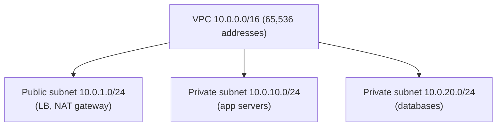
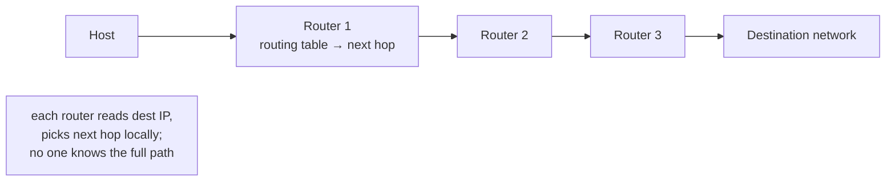
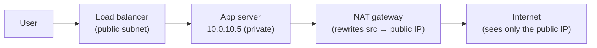

# Lesson 3.1.2 — IP, Routing, NAT, and Subnets (What an Architect Must Know)

> Part 3: Networking Deep Dive · Module 3.1: Transport & Internet Layers · Difficulty: 🟡
>
> **Prerequisites:** [3.1.1 Layered Model].
> **Unlocks:** [3.1.3 TCP], [3.2.4 DNS], [3.3 Load Balancing], [Part 13 Cloud Networking/VPC].

---

## 1. Learning Objectives

After this lesson you will be able to:

- Explain **IP addressing** (IPv4 vs IPv6), what an IP identifies, and why IPv4 exhaustion drove NAT and IPv6.
- Read **CIDR notation** and reason about **subnets** (the basis of cloud VPC design — Part 13).
- Explain **routing** at a high level: how packets traverse the internet hop by hop, and what a routing table does.
- Explain **NAT** (Network Address Translation) — private vs public IPs, why it exists, and its architectural consequences.
- Apply this to **cloud networking** (VPCs, subnets, public/private addressing) and connect it to load balancing and security.

---

## 2. Motivation — The addressing and routing layer you build on

Every service you deploy has an IP address, lives in a subnet, sits behind NAT or a load balancer, and is reached via routing. When you design a cloud architecture (Part 13), you make decisions about **VPCs, public vs private subnets, NAT gateways, and IP ranges** — and you can't make them well without understanding L3 addressing and routing. When you debug "why can't service A reach service B," the answer is often routing, subnets, or NAT.

You don't need a network engineer's depth, but you need the **architect's working model**: what an IP identifies, how subnets partition address space, how packets find their way, and why most of your servers have *private* IPs behind NAT. This lesson gives you that model and connects it to the cloud-networking and security decisions you'll make later. It builds directly on the L3 layer from 3.1.1.

---

## 3. Theory — From first principles

### 3.1 IP addresses — what they identify

An **IP address** identifies a **network interface of a machine** on an IP network (L3, 3.1.1) — it's the "where" for routing packets `[CS]`.

- **IPv4:** 32-bit address, written as four octets (`192.168.1.10`). ~4.3 billion addresses — which sounds huge but **ran out** (the internet outgrew it). This exhaustion drove **NAT** (§3.4) and **IPv6**.
- **IPv6:** 128-bit address (`2001:0db8:...`), an effectively unlimited space (~3.4×10³⁸). Adoption is gradual; both coexist today. For architects, the main IPv6 implication is "vastly more addresses, no NAT needed in principle," but IPv4+NAT remains dominant in practice.

An IP address has two conceptual parts: the **network portion** (which network) and the **host portion** (which machine on it). The split is defined by the **subnet mask / CIDR prefix** (§3.2). Routing uses the network portion to get packets to the right network; the host portion finds the machine within it.

### 3.2 Subnets and CIDR (the cloud-design essential)

A **subnet** is a logical subdivision of an IP network — a contiguous range of addresses sharing a network prefix `[CS]`. **CIDR notation** (Classless Inter-Domain Routing) expresses it:

- `10.0.0.0/24` means: the first **24 bits** are the network prefix; the remaining **8 bits** (32−24) are for hosts → **2⁸ = 256** addresses (`10.0.0.0`–`10.0.0.255`), ~254 usable (some reserved for network/broadcast).
- `/16` → 16 host bits → 65,536 addresses. `/8` → huge. **Smaller prefix number = larger network.**
- The "/N" is the **prefix length**: how many leading bits are fixed (the network), the rest are host space.

**Private IP ranges** (RFC 1918) — reserved for internal networks, not routable on the public internet:
- `10.0.0.0/8`, `172.16.0.0/12`, `192.168.0.0/16`.

These are what your home network and cloud VPCs use internally. **This is the basis of cloud VPC design (Part 13):** you carve a VPC (e.g., `10.0.0.0/16`) into subnets (e.g., `10.0.1.0/24` public, `10.0.2.0/24` private) to organize and secure your infrastructure. Knowing CIDR is what lets you plan address space, avoid overlaps (critical when peering VPCs), and size subnets.

### 3.3 Routing — how packets find their way

IP is **best-effort and hop-by-hop** (3.1.1). A packet doesn't know its whole path; each **router** along the way makes a *local* decision `[CS]`:

1. A router receives a packet, reads the **destination IP** (L3 header).
2. It consults its **routing table** — a set of rules mapping destination network prefixes (CIDR ranges) to the next hop (the next router/interface toward that network).
3. It uses **longest-prefix match** (the most specific matching route wins) to pick the next hop and forwards the packet.
4. Repeat at each router until the packet reaches the destination network, where it's delivered to the host (via L2/MAC locally).

Key properties:
- **No router knows the full path** — routing is distributed; each makes a local best decision. (This is itself a distributed-systems property — no global view, like much of Part 8.)
- **Routes can change** — failures and congestion cause rerouting; packets in one "flow" can even take different paths (relevant to why UDP/QUIC handle reordering, 3.1.4–3.1.5).
- **Default route** — if no specific route matches, send to the default gateway (e.g., your home router → ISP).
- Internet-scale routing between large networks uses **BGP** (Border Gateway Protocol) — autonomous systems advertising which prefixes they can reach. (Architects rarely configure BGP, but BGP misconfigurations cause famous internet outages — relevant to understanding large-scale failures.)

**Latency consequence (1.1.3):** more hops and longer physical distance = more latency (speed of light + per-hop processing). This is *why* CDNs and edge (3.3.3) put content closer to users — fewer/shorter hops.

### 3.4 NAT (Network Address Translation)

Because IPv4 ran out, most devices don't have a unique public IP. **NAT** lets many devices share one (or few) public IP(s) `[CS]`:

- Your devices have **private IPs** (RFC 1918, §3.2) on an internal network.
- A **NAT device** (your home router, a cloud NAT gateway) **translates** between private internal IPs and a public IP when traffic goes to/from the internet — rewriting the source IP (and port) on outbound packets and reversing it on the responses (tracking the mapping in a NAT table, often using ports → **PAT**, port address translation).

Why it matters architecturally:
- **Most servers have private IPs.** In a cloud VPC, your application servers typically sit in **private subnets** (no public IP), reaching the internet *outbound* via a **NAT gateway**, and receiving *inbound* traffic only through a **load balancer** in a public subnet. This is a fundamental security pattern (Part 13, 15): the servers aren't directly reachable from the internet.
- **NAT breaks "direct addressability."** A device behind NAT can't be reached *inbound* by its private IP from outside — which is why inbound traffic needs a public-facing entry point (LB/proxy) and why peer-to-peer connections need NAT traversal techniques (STUN/TURN — relevant to WebRTC, real-time systems).
- **NAT is stateful** — it tracks connections; this adds a (usually small) consideration for connection limits and long-lived connections.

IPv6 largely removes the *need* for NAT (enough addresses for every device), but NAT also became a de-facto (if accidental) security boundary, so it persists.

### 3.5 Putting it together: the cloud network model (preview of Part 13)

A typical cloud architecture composes all of the above:
- A **VPC** with a private CIDR block (e.g., `10.0.0.0/16`).
- **Public subnets** (e.g., `10.0.1.0/24`) holding internet-facing components: load balancers, NAT gateways.
- **Private subnets** (e.g., `10.0.10.0/24`) holding application servers and databases (no public IPs).
- **Routing tables** per subnet directing traffic (private subnet → NAT gateway for outbound internet; public subnet → internet gateway).
- **Security groups / firewalls** filtering by IP/port (L3/L4, 3.1.1) controlling who can talk to whom.
- Inbound user traffic: internet → load balancer (public subnet) → app servers (private subnet). Outbound from app servers: → NAT gateway → internet.

This model — *private servers, public-facing LB, NAT for outbound, subnets for isolation* — is the default secure cloud topology, and it's built entirely on IP/subnets/routing/NAT. (Part 13 goes deep; this is the L3 foundation.)

---

## 4. Visual Intuition

### Subnets carving a VPC

### Routing hop-by-hop (longest-prefix match, local decisions)

### NAT: private servers reach the internet via a public IP

---

## 5. Real-World Analogy

**A large office complex's mail and addressing.** The **public IP** is the building's single street address that the outside world knows. Inside, hundreds of offices have **private internal numbers** (private IPs) that mean nothing to the postal service outside. **Subnets** are the floors and wings — the complex (a `/16` VPC) is divided into departments (`/24` subnets), each a contiguous block of office numbers, which keeps things organized and lets security lock down each wing separately. **Routing** is how a courier crosses the city: no single courier knows the whole route — each hub just forwards the package toward the right neighborhood (longest-prefix match), and if a road is closed, they reroute. **NAT** is the **mailroom**: internal offices send outbound mail through the mailroom, which stamps it with the building's public street address (so replies come back to the building, then the mailroom routes them to the right internal office) — and crucially, outsiders **can't** send mail directly to an internal office number; it must go through the building's front desk (the load balancer). That's exactly why your app servers sit on private internal addresses, reachable from outside only through a public-facing entry point.

---

## 6. Industry Example

- **Cloud VPC design** `[CONV]`: AWS VPC, GCP VPC, and Azure VNet are *exactly* §3.5 — you define a CIDR block, carve public/private subnets, place LBs/NAT gateways in public subnets and app servers/databases in private subnets, and control traffic with security groups and route tables. This is the bread-and-butter of cloud architecture (Part 13).
- **The private-servers-behind-an-LB pattern** `[CONV]`: nearly universal — internet-facing load balancer in a public subnet, application fleet in private subnets with no public IPs, outbound via NAT gateway. A core security posture (Part 15: minimize attack surface).
- **BGP outages** `[CONV]`: well-documented large-scale internet incidents have been caused by BGP route misconfigurations/leaks — illustrating that internet routing is a distributed system with global blast radius (a real-world failure-mode lesson).
- **CDN/edge and routing** `[CONV]`: anycast routing (the same IP advertised from many locations) lets CDNs route users to the nearest edge via BGP — minimizing hops/latency (3.3.3, Part 18 Cloudflare-style).

---

## 7. Implementation Details — Applying it

- **Plan VPC/subnet CIDRs deliberately** (Part 13): pick non-overlapping ranges (critical for VPC peering / hybrid connectivity), size subnets for growth, and separate public vs private subnets. Reserve room — re-IPing later is painful (a one-way door, 1.1.1).
- **Keep servers in private subnets**; expose only load balancers publicly; use NAT gateways for outbound. This minimizes attack surface (Part 15) — a default secure topology.
- **Use security groups/firewalls (L3/L4)** to allow only necessary IP/port traffic between tiers (least privilege, 1.2.3).
- **Understand routing for connectivity debugging**: "can't reach service B" → check route tables, subnet associations, NAT, and security groups before blaming the app (3.1.1 layer-by-layer debugging).
- **Mind latency from hops/distance** (1.1.3): place resources in regions near users; use edge/CDN to cut hops (3.3.3).
- **For IPv6:** know it removes NAT necessity and offers vast space; adopt where your platform/users support it, but expect IPv4+NAT to persist.

---

## 8. Advantages (of understanding L3)

- **Sound cloud network design** — correct VPC/subnet/NAT topology (Part 13).
- **Security by topology** — private servers, public LBs, least-privilege firewalls (Part 15).
- **Effective debugging** — quickly isolate routing/subnet/NAT/firewall issues (lower MTTR, 1.2.1).
- **Latency awareness** — reason about hops/distance and why edge/CDN helps (1.1.3, 3.3.3).

---

## 9. Disadvantages / Complexities

- **NAT complexity** — breaks direct inbound addressability (P2P/WebRTC need traversal), is stateful, and can obscure source IPs (logging/security considerations).
- **CIDR planning is a one-way door** — overlapping or too-small ranges cause painful re-IPing and block VPC peering later.
- **Routing is distributed and opaque** — you don't control the internet's path; failures (BGP) can have wide blast radius and are outside your control.
- **IPv4/IPv6 coexistence** — dual-stack adds operational complexity.

---

## 10. When this matters (and how deep)

- **Matters a lot:** designing cloud infrastructure (VPC/subnets/NAT — Part 13), security topology (Part 15), and debugging connectivity. Architects make these decisions regularly.
- **Less depth needed:** you rarely configure routers/BGP yourself (the cloud/ISP handles it); you need the *model*, not router CLI mastery. Don't over-invest in low-level routing protocol internals unless you're a network engineer.

---

## 11. Common Mistakes

1. **Overlapping CIDR ranges** across VPCs/networks → can't peer or connect them later (a painful one-way door).
2. **Putting app servers in public subnets** with public IPs → unnecessary attack surface (should be private behind an LB).
3. **Forgetting outbound connectivity** for private servers (no NAT gateway) → servers can't reach the internet for updates/APIs.
4. **Too-small subnets** → running out of IPs as the fleet grows (autoscaling fails to launch instances).
5. **Blaming the app** for connectivity issues that are really routing/subnet/NAT/security-group problems.
6. **Ignoring latency from region/hops** → deploying far from users and wondering why latency is high (1.1.3).
7. **Confusing private and public IP reachability** — expecting to reach a private IP directly from outside.

---

## 12. Interview Questions

**🟢 Easy**
- What does an IP address identify? What's the difference between IPv4 and IPv6 at a high level?
- What does `10.0.0.0/24` mean, and how many addresses does it contain?

**🟡 Medium**
- Explain NAT and why most cloud servers have private IPs. How do they receive inbound traffic and make outbound connections?
- Describe how a packet is routed across the internet. Why does no single router know the full path?

**🔴 Hard**
- Design the VPC/subnet topology for a web application: where do the load balancer, app servers, NAT gateway, and database go, and why? How do route tables and security groups enforce the design?
- Why is CIDR planning a "one-way door"? What goes wrong with overlapping ranges, and how does subnet sizing interact with autoscaling?

**⚫ Staff+**
- Design the network architecture for a multi-region, multi-VPC system with private connectivity (peering) and a CDN/edge. How do you plan CIDR space to avoid overlaps, where does NAT/LB sit, and how does routing/anycast minimize latency (3.3.3)?
- A BGP route leak takes down reachability to your service in a region. Explain what happened at the routing layer, why it's outside your direct control, and how you'd design for resilience (multi-region, anycast, failover — Parts 11, 13).

---

## 13. Production Pitfalls

- **CIDR overlap discovered at peering time:** two VPCs both use `10.0.0.0/16`, so they can't be peered — forcing a costly re-IP of one (a one-way-door regret).
- **Subnet exhaustion under autoscaling:** a `/27` subnet (30 hosts) runs out of IPs during a scale-up, so new instances fail to launch during peak — an availability incident from undersized address space.
- **Missing NAT gateway:** private servers can't pull dependencies/patches or call external APIs because there's no outbound path.
- **Accidental public exposure:** a database or app server given a public IP / placed in a public subnet → directly attackable (a serious security incident, Part 15).
- **Cross-AZ/region data transfer cost & latency:** traffic crossing zones/regions due to poor subnet/placement design inflating cost (1.2.3) and latency (1.1.3).

---

## 14. Optimization Techniques

- **Plan generous, non-overlapping CIDR space** up front (the cheap time to do it) and size subnets for growth + autoscaling headroom.
- **Default topology:** private subnets for compute/data, public subnets only for LBs/NAT — minimizes attack surface and is the secure default.
- **Co-locate communicating resources** (same AZ/region where possible) to cut cross-zone latency and cost (1.1.3, 1.2.3).
- **Use edge/anycast/CDN** to minimize hops and latency for users (3.3.3).
- **Restrict with security groups/NACLs** (least privilege, L3/L4) between tiers (Part 15).
- **Debug layer-by-layer** (3.1.1): route tables → subnet associations → NAT → security groups → app.

---

## 15. Summary

At L3, an **IP address** identifies a machine's network interface for routing; **IPv4**'s 32-bit space (~4.3B) ran out, driving **NAT** and **IPv6** (128-bit, effectively unlimited). Addresses split into a **network prefix** and **host portion**, expressed in **CIDR** (`10.0.0.0/24` = 24 network bits, 256 addresses) — the essential tool for carving **VPCs into subnets** (the foundation of cloud networking, Part 13), using **private ranges** (RFC 1918) internally. **Routing** is **distributed and hop-by-hop**: each router reads the destination IP, consults its routing table, and forwards to the next hop via **longest-prefix match** — no router knows the full path (a distributed-systems property), and more hops/distance means more latency (why CDNs exist). **NAT** lets many private-IP devices share a public IP by rewriting source addresses, which is why the **default secure cloud topology** puts app servers and databases in **private subnets** (no public IP), reachable inbound only through a **load balancer in a public subnet** and reaching out via a **NAT gateway**. The architect's job here isn't router configuration but **sound topology**: plan non-overlapping CIDR space (a one-way door), keep servers private, expose only LBs, enforce least-privilege firewalls, and debug connectivity layer-by-layer. This L3 foundation underpins load balancing (3.3), DNS (3.2.4), cloud networking (Part 13), and network security (Part 15).

---

## 16. Revision Notes (flashcard-ready)

- **Q:** What does an IP identify? **A:** A machine's network interface on an IP network (L3 routing address).
- **Q:** Why NAT + IPv6? **A:** IPv4 (~4.3B addresses) ran out.
- **Q:** `10.0.0.0/24` means? **A:** 24-bit network prefix, 8 host bits → 256 addresses (~254 usable).
- **Q:** Private IP ranges (RFC 1918)? **A:** 10.0.0.0/8, 172.16.0.0/12, 192.168.0.0/16.
- **Q:** How is routing done? **A:** Hop-by-hop; each router reads dest IP, uses longest-prefix match in its routing table; no router knows the full path.
- **Q:** What does NAT do? **A:** Rewrites private↔public IPs (and ports) so many private devices share a public IP.
- **Q:** Default secure cloud topology? **A:** App servers/DBs in private subnets; LB in public subnet; outbound via NAT gateway.
- **Q:** Why is CIDR planning a one-way door? **A:** Overlapping/too-small ranges break peering and force painful re-IPing.
- **Q:** Why do CDNs reduce latency at L3? **A:** Fewer/shorter hops and less distance (speed-of-light + per-hop cost).

---

## 17. Further Reading + Knowledge-Graph Links

**Within this platform**
- **Previous:** [3.1.1 Layered Model] (L3 in context). **Next:** [3.1.3 TCP] (L4 on top of IP).
- **Directly enables:** [3.2.4 DNS] (names → IPs), [3.3 Load Balancing] (LB in public subnet), [Part 13 Cloud Native] (VPC/subnet/NAT design), [Part 15 Security] (network topology, least privilege).
- **Connects to:** [1.1.3 Latency] (hops/distance), [3.3.3 CDN/anycast] (minimizing hops), [Part 8] (routing as a distributed system).

**Foundational texts (synthesized)**
- Kurose & Ross, *Computer Networking* — IP addressing, CIDR, routing, NAT, the network layer.
- Tanenbaum, *Computer Networks* — routing algorithms, addressing.
- Cloud provider VPC documentation (AWS/GCP/Azure) — practical subnet/NAT/route-table design (Part 13).

**Concept tags:** `[CS]` IP addressing, CIDR/subnets, hop-by-hop routing, longest-prefix match, NAT · `[CONV]` cloud VPC/subnet/NAT topology, private-servers-behind-LB, anycast/BGP · `[BP]` plan non-overlapping CIDR, private subnets by default, least-privilege firewalls.
