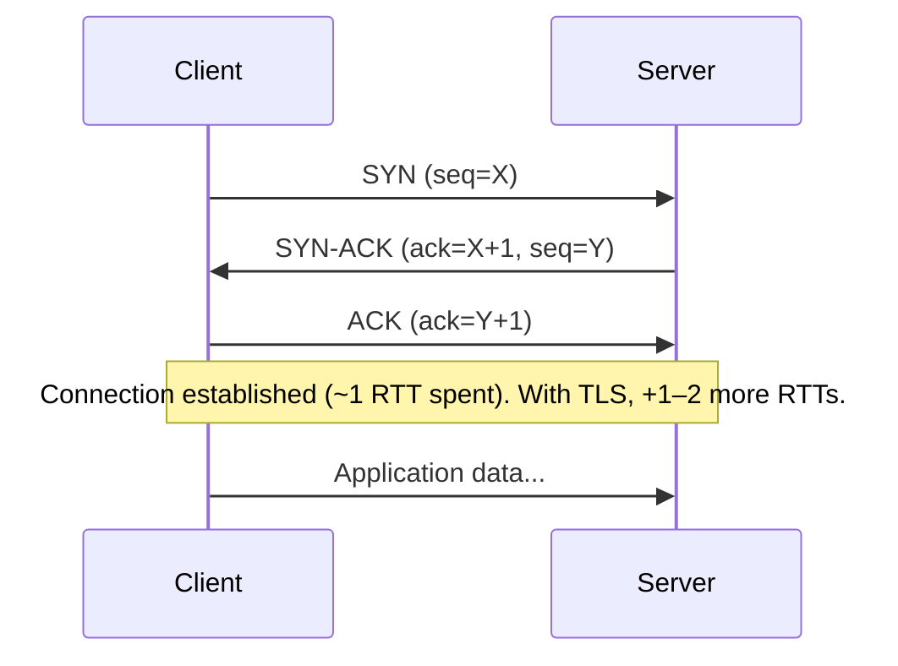
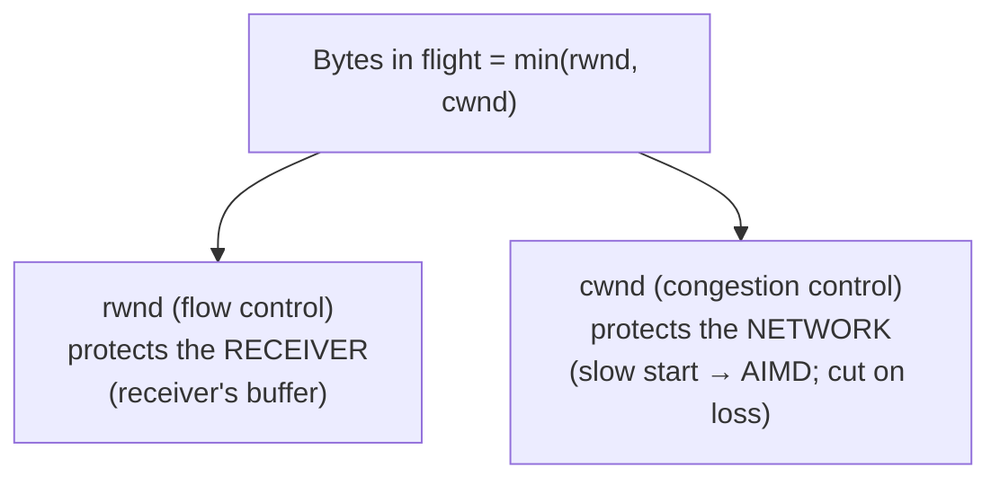
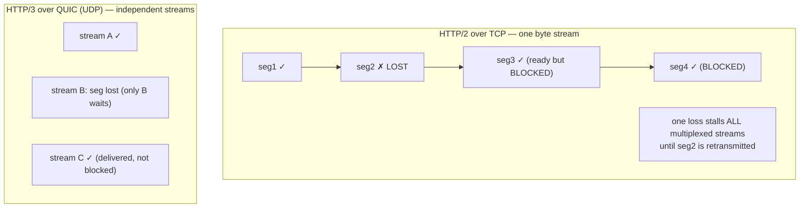

# Lesson 3.1.3 — TCP Deep Dive: Handshake, Flow Control, Congestion Control, Head-of-Line Blocking

> Part 3: Networking Deep Dive · Module 3.1: Transport & Internet Layers · Difficulty: 🟡🔴
>
> **Prerequisites:** [3.1.1 Layered Model], [3.1.2 IP], [1.1.3 Latency/Throughput].
> **Unlocks:** [3.1.4 UDP], [3.1.5 QUIC], [3.2 HTTP/TLS], [3.3.4 Connection Management], [Part 17 Performance].

---

## 1. Learning Objectives

After this lesson you will be able to:

- Explain what **TCP** provides (reliable, ordered, connection-oriented byte stream) and *how* — sequence numbers, ACKs, retransmission.
- Walk through the **3-way handshake** (and connection teardown) and quantify its **latency cost** (why connection reuse matters).
- Explain **flow control** (sliding window) vs **congestion control** (slow start, AIMD) — two different mechanisms solving two different problems.
- Explain **TCP head-of-line (HOL) blocking** and why it limits HTTP/2 (and motivates QUIC, 3.1.5).
- Apply this to architecture: connection pooling/reuse, keep-alive, and why latency ≠ bandwidth.

---

## 2. Motivation — The protocol almost everything runs on

TCP carries the overwhelming majority of application traffic — HTTP(S), database connections, RPC, most APIs. Its behavior directly shapes the **latency and throughput** (1.1.3) of your systems. Understanding TCP explains a dozen architectural realities:
- Why establishing a connection is *expensive* (the handshake) → why we **pool and reuse connections** (3.3.4, Part 5 DB pools).
- Why a far-away server is slow even with huge bandwidth (latency from round trips, congestion ramp-up) → why **CDNs/edge** help (3.3.3).
- Why a single lost packet can stall an entire HTTP/2 connection (**HOL blocking**) → why **QUIC** exists (3.1.5).
- Why long-lived connections (WebSockets, gRPC streams) perform better (avoid repeated handshakes/slow-start).

You don't implement TCP, but you *design around* it constantly. This lesson gives you the mechanisms and their architectural consequences — it's the L4 substrate for HTTP, TLS, and everything above.

---

## 3. Theory — From first principles

### 3.1 What TCP provides (the guarantees)

TCP (Transmission Control Protocol) turns IP's unreliable, best-effort, unordered packets (3.1.2) into a **reliable, ordered, connection-oriented byte stream between two processes** (identified by IP+port) `[CS]`:

- **Reliable:** lost data is retransmitted; nothing acknowledged is lost.
- **Ordered:** bytes are delivered to the application in the order sent (TCP reorders out-of-order packets before delivery).
- **Connection-oriented:** a connection is *established* (handshake), *used*, and *torn down* — with per-connection state on both ends.
- **Byte stream:** the app sees a continuous stream of bytes, not packets (TCP segments and reassembles invisibly).
- **Flow & congestion controlled:** TCP paces sending to avoid overwhelming the receiver (flow control) or the network (congestion control).

It achieves reliability/order with **sequence numbers** (each byte is numbered) and **acknowledgments (ACKs)** (the receiver confirms what it got); unacknowledged data is **retransmitted** after a timeout or duplicate ACKs. This machinery is *why* TCP is reliable — and *why* it costs round trips and state.

### 3.2 The 3-way handshake (and its latency cost)

Before any data flows, TCP establishes a connection with a **3-way handshake** `[CS]`:

1. **SYN** — client → server: "I want to connect, my sequence number is X."
2. **SYN-ACK** — server → client: "OK, I acknowledge X; my sequence number is Y."
3. **ACK** — client → server: "I acknowledge Y." → connection established.

**Latency cost:** this is **1 round trip (RTT)** before the client can send data (the client can piggyback data on the 3rd packet in some cases). Add **TLS** (3.2.3) and you pay *more* RTTs before the first byte of application data. Recall the latency numbers (1.1.3): a cross-continent RTT is ~100+ ms — so **each round trip is expensive**, and the handshake is pure overhead before useful work.

**This is the #1 architectural takeaway:** because every new connection costs at least 1 RTT (plus TLS RTTs), **reusing connections** (keep-alive, connection pools, long-lived streams) is one of the highest-leverage latency optimizations (3.3.4, Part 17). Opening a fresh connection per request (the old HTTP/1.0 model) is wasteful.

**Teardown:** connections close with a **4-way handshake** (FIN/ACK each direction). Closed connections linger briefly in `TIME_WAIT` to handle stray packets — relevant at very high connection churn (port exhaustion).

### 3.3 Flow control — don't overwhelm the *receiver*

**Flow control** prevents a fast sender from overwhelming a slow receiver `[CS]`. Mechanism: the **sliding window**.

- The receiver advertises a **receive window** (`rwnd`) — how much buffer space it has free.
- The sender may have at most `rwnd` bytes "in flight" (sent but unacknowledged) at once.
- As the receiver processes data and frees buffer, it advertises a larger window; if its buffer fills, it advertises a smaller (even zero) window, telling the sender to slow/stop.

The **sliding window** lets multiple segments be in flight without waiting for each ACK individually (pipelining) — crucial for throughput. **Bandwidth-Delay Product (BDP)** matters here: to fully utilize a link, the window must be ≥ bandwidth × RTT. On high-bandwidth, high-latency links ("long fat networks"), a too-small window caps throughput far below the link capacity — a real performance issue (Part 17). This is why **latency limits throughput** even when bandwidth is plentiful (a key 1.1.3 nuance).

### 3.4 Congestion control — don't overwhelm the *network*

Flow control protects the *receiver*; **congestion control** protects the *network* (the routers/links between them) from collapse `[CS]`. TCP can't see the network's capacity directly, so it *probes* it and reacts to **packet loss** (and delay) as a congestion signal. The classic mechanism (TCP Reno/CUBIC lineage):

- **Slow start:** begin with a small **congestion window** (`cwnd`) and grow it *exponentially* (roughly double per RTT) until loss or a threshold — quickly finding capacity.
- **Congestion avoidance (AIMD):** after the threshold, grow **linearly** (Additive Increase), and on detecting loss, **multiplicatively decrease** (cut `cwnd`, often by half) — Additive Increase, Multiplicative Decrease. This makes TCP "fair" and responsive: back off hard on congestion, probe back up gently.
- **Fast retransmit/recovery:** duplicate ACKs signal a likely single loss; retransmit without waiting for a full timeout.

The actual amount in flight = **min(rwnd, cwnd)** — the more restrictive of flow and congestion control.

**Architectural consequences:**
- **Slow start means new connections start *slow*** — they haven't probed capacity yet. A short-lived connection may finish before reaching full speed → another reason to **reuse long-lived connections** (the window stays "warmed up").
- **Loss is interpreted as congestion**, so lossy links (mobile/wireless) can hurt TCP throughput even when bandwidth exists (a reason QUIC/newer algorithms like BBR were developed — 3.1.5).
- Throughput ramps up over several RTTs — so for a far user, even a big download starts slow (latency compounds with slow start). CDNs/edge mitigate by shortening RTT (3.3.3).

### 3.5 Head-of-Line (HOL) blocking — TCP's ordering bites back

TCP guarantees **in-order delivery** to the application. The downside `[CS]`: if **one segment is lost**, all subsequently-received segments must **wait** in TCP's buffer until the lost one is retransmitted and arrives — even if those later segments are complete and ready. The whole stream is blocked behind the missing piece. This is **TCP head-of-line blocking**.

This becomes a serious problem with **HTTP/2** (3.2.2): HTTP/2 multiplexes *many* independent request/response streams over a *single* TCP connection. But because they share one TCP byte stream, **a single lost packet stalls *all* the multiplexed streams** — even those whose data already arrived — because TCP won't deliver *anything* out of order. So HTTP/2 solved HTTP-level HOL blocking (1.1's one-request-per-connection problem) but is still subject to *TCP-level* HOL blocking it can't fix (the relevant state is in a lower layer it can't see — exactly the layering limitation from 3.1.1 §3.1).

**This is precisely why QUIC (3.1.5) exists:** QUIC runs over UDP and implements *independent* streams at the transport level, so a loss in one stream doesn't block the others — eliminating transport-level HOL blocking. HTTP/3 = HTTP over QUIC. (Full treatment in 3.1.5/3.2.2.)

### 3.6 Why latency ≠ bandwidth (the TCP lens on 1.1.3)

TCP makes concrete why **latency and bandwidth are different** (1.1.3):
- The **handshake** (and TLS) cost RTTs before data flows — pure latency, unaffected by bandwidth.
- **Slow start** ramps throughput over several RTTs — so high latency *delays* reaching full bandwidth.
- **Window size vs BDP** — on high-latency links, a limited window caps throughput regardless of available bandwidth.

So a 1 Gbps link to a server 150 ms away can deliver *terrible* effective throughput for short transfers (handshake + slow start dominate) — which is why **reducing RTT (CDN/edge) and reusing warm connections** often matters more than raw bandwidth for user-perceived latency (Part 17, 3.3.3).

---

## 4. Visual Intuition

### 3-way handshake (1 RTT before data)

### Flow vs congestion control (two windows)

### TCP head-of-line blocking (and why QUIC helps)

---

## 5. Real-World Analogy

**A careful phone call vs the postal system.** IP (3.1.2) is like mailing numbered postcards that may arrive out of order, late, or not at all. **TCP** turns that into a reliable phone conversation: first you **dial and exchange greetings** ("Hi, can you hear me?" "Yes, can you hear me?" "Yes" — the **3-way handshake**, a full back-and-forth before you say anything useful). Then you **don't talk faster than the listener can follow** — if they say "hold on, let me catch up," you pause (**flow control**). And you **don't all shout at once on a crowded line** — if you hear static (congestion), everyone instinctively slows down, then carefully speeds back up (**congestion control / AIMD**). The catch is the **insistence on order**: if you're reading a numbered list aloud and the listener misses item #2, they make you *repeat from #2* before accepting #3, #4 — even though they already heard those (**head-of-line blocking**). If you were reading *several independent lists* over the same call, missing one item in one list would stall *all* of them — which is exactly HTTP/2's problem, and why a smarter protocol (QUIC) keeps the lists independent.

---

## 6. Industry Example

- **Connection reuse everywhere** `[CONV]`: HTTP keep-alive, HTTP/2 multiplexing, database connection pools (Part 5), and gRPC long-lived channels all exist to **amortize the handshake + slow-start cost** — a direct response to §3.2/§3.4. Opening a connection per request is a known anti-pattern.
- **CDNs and TCP** `[CONV]`: CDNs (3.3.3, Part 18) reduce RTT (handshake + slow start cheaper) *and* maintain warm, pre-established connections to origins — attacking exactly the latency TCP imposes.
- **HTTP/2 HOL blocking → HTTP/3/QUIC** `[CONV]`: the industry move to HTTP/3 (QUIC over UDP) by major players (Google, Cloudflare, etc.) was driven substantially by eliminating TCP-level HOL blocking for multiplexed streams (3.1.5, 3.2.2).
- **BBR congestion control** `[CONV]`: Google developed BBR (a model-based congestion-control algorithm) because loss-based control (Reno/CUBIC) underperforms on modern lossy/high-BDP links — a documented evolution of §3.4.
- **TIME_WAIT/port exhaustion** `[CONV]`: high-churn services (many short connections) hit ephemeral port/`TIME_WAIT` limits — a real production scaling concern that pushes toward connection reuse.

---

## 7. Implementation Details — Designing around TCP

- **Reuse connections aggressively** (the #1 lever): HTTP keep-alive, HTTP/2, connection pools (DB, HTTP clients), gRPC channels. Avoid per-request connections. Size pools with Little's Law (1.1.3, 2.4.3).
- **Terminate TLS/connections at the edge** (CDN/LB, 3.3.3) so users pay the handshake to a *nearby* node, and reuse warm backend connections.
- **Mind slow start for short-lived/bursty traffic** — connections that reset lose their warmed window; long-lived connections sustain throughput.
- **Watch BDP on high-latency links** — ensure adequate TCP window sizes (OS/socket tuning) for high-bandwidth, long-distance transfers (Part 17).
- **Avoid TCP HOL blocking for many independent streams** — prefer HTTP/3 (QUIC) where stream independence matters, or separate connections (3.2.2, 3.1.5).
- **For real-time/loss-tolerant data** (media, gaming) where retransmission/HOL hurts more than loss, consider UDP/QUIC (3.1.4–3.1.5).
- **Monitor connection metrics** (retransmits, RTT, `TIME_WAIT` counts) — they reveal network/perf problems (Part 16).

### Connection-cost intuition (illustrative)
> A user 100 ms RTT away: TCP handshake ≈ 1 RTT (~100 ms), TLS 1.2 ≈ +2 RTTs (~200 ms), TLS 1.3 ≈ +1 RTT (~100 ms). So *before any HTTP data*, a fresh HTTPS connection can cost ~200–300 ms. Reusing the connection avoids paying it again — hence keep-alive's huge impact on perceived latency. *(Numbers illustrative; depend on RTT and TLS version.)*

---

## 8. Advantages (of TCP)

- **Reliability & ordering** — the app gets exactly the bytes sent, in order, without implementing reliability itself (the end-to-end guarantee most apps want).
- **Flow & congestion control** — built-in pacing protects receivers and the network; TCP is a "good citizen."
- **Ubiquity & maturity** — universally supported, battle-tested, works through most networks.
- **Byte-stream abstraction** — simple programming model (a reliable pipe).

---

## 9. Disadvantages / Costs

- **Connection setup latency** — handshake (+TLS) costs RTTs before data (mitigated by reuse).
- **Head-of-line blocking** — in-order delivery stalls everything behind a lost packet; brutal for multiplexed streams (HTTP/2) → motivates QUIC.
- **Slow start** — new connections ramp up slowly; short transfers never reach full speed.
- **Loss = congestion assumption** — hurts throughput on lossy (wireless) links.
- **Per-connection state & overhead** — limits very-high-connection-count scenarios (`TIME_WAIT`, memory).
- **Not ideal for real-time/loss-tolerant data** — retransmission adds latency you may not want (use UDP/QUIC).

---

## 10. When NOT to use TCP (use UDP/QUIC instead)

- **Real-time media / gaming / VoIP** — where *fresh* data matters more than *complete* data; a retransmitted old packet is useless, and HOL blocking adds harmful latency → **UDP** (3.1.4) or QUIC.
- **High-throughput multiplexed web** where TCP HOL blocking hurts → **HTTP/3 over QUIC** (3.1.5).
- **Simple request/response where you handle reliability yourself** (e.g., DNS uses UDP, 3.2.4) — TCP's overhead isn't worth it.
- For most general application traffic, **TCP remains the default** — these are specific exceptions.

---

## 11. Common Mistakes

1. **Opening a new connection per request** — paying the handshake + slow start repeatedly (the classic latency killer; use keep-alive/pools).
2. **Ignoring slow start** — expecting full throughput immediately on a fresh connection (especially for far/short transfers).
3. **Confusing flow control and congestion control** — they protect *different* things (receiver vs network) with different mechanisms.
4. **Assuming bandwidth = throughput** — ignoring that handshake/slow-start/window-vs-BDP cap effective throughput on high-latency links.
5. **Multiplexing many streams over one TCP connection and being surprised by HOL blocking** (HTTP/2) — and not knowing QUIC fixes it.
6. **Using TCP for real-time data** where retransmission/HOL adds harmful latency (should use UDP/QUIC).
7. **Connection churn → port/`TIME_WAIT` exhaustion** at high request rates without reuse.

---

## 12. Interview Questions

**🟢 Easy**
- What guarantees does TCP provide that IP doesn't?
- Describe the 3-way handshake and its latency cost.

**🟡 Medium**
- What's the difference between flow control and congestion control? What does each protect?
- Why does reusing connections (keep-alive/pooling) improve latency? Tie it to the handshake and slow start.

**🔴 Hard**
- Explain TCP head-of-line blocking and why it limits HTTP/2 performance even though HTTP/2 multiplexes streams. How does QUIC (HTTP/3) solve it, and what's the layering insight (3.1.1)?
- A high-bandwidth link to a distant data center delivers poor throughput for large transfers. Explain using slow start, RTT, and bandwidth-delay product, and how you'd address it.

**⚫ Staff+**
- Design the connection strategy for a global API serving mobile clients: address handshake/TLS cost, slow start, HOL blocking, lossy mobile links, and connection reuse. Where do CDNs, HTTP/3, and connection pooling fit, and what do you measure?
- Explain why "loss = congestion" is a flawed assumption on modern networks and how it motivated newer congestion control (e.g., BBR). What are the tradeoffs of changing congestion-control behavior at scale?

---

## 13. Production Pitfalls

- **Per-request connections at scale:** a service opening a fresh TCP+TLS connection per call → latency dominated by handshakes and CPU burned on TLS; fixed by keep-alive/pooling (huge, common win).
- **Port/`TIME_WAIT` exhaustion:** very high connection churn exhausting ephemeral ports, causing connection failures under load — a subtle, painful production limit (reuse connections; tune OS where appropriate).
- **Slow-start penalty on short connections:** APIs that close connections quickly never reach full throughput, inflating tail latency for larger responses (1.1.3).
- **HTTP/2 HOL blocking on lossy networks:** multiplexed connections stalling under packet loss (mobile), degrading *all* concurrent requests — mitigated by HTTP/3 (3.1.5).
- **Undersized TCP windows on long-fat networks:** large cross-region transfers capped far below link bandwidth due to default window sizes (Part 17 tuning).

---

## 14. Optimization Techniques

- **Reuse connections** (keep-alive, HTTP/2, pools, gRPC channels) — amortize handshake + keep windows warm (the top lever).
- **Reduce RTT** via CDN/edge and regional placement (3.3.3, 3.1.2) — makes handshakes and slow start cheaper.
- **Use TLS 1.3 / 0-RTT resumption** to cut TLS handshake RTTs (3.2.3).
- **Adopt HTTP/3 (QUIC)** where transport-level HOL blocking and lossy links hurt (3.1.5).
- **Tune TCP windows** for high-BDP links so throughput isn't window-capped (Part 17).
- **Use UDP/QUIC for real-time/loss-tolerant** data where retransmission/ordering hurts (3.1.4).
- **Monitor RTT, retransmits, connection counts** to catch network/perf regressions early (Part 16).

---

## 15. Summary

**TCP** turns IP's unreliable, unordered, best-effort packets into a **reliable, ordered, connection-oriented byte stream** using **sequence numbers, ACKs, and retransmission**. It establishes connections with a **3-way handshake** costing **~1 RTT** (plus TLS RTTs) *before any data* — making **connection reuse** (keep-alive, pools, long-lived streams) one of the highest-leverage latency optimizations, since a fresh HTTPS connection to a distant user can cost hundreds of ms before the first byte. TCP runs two distinct pacing mechanisms: **flow control** (the sliding `rwnd` window) protects the **receiver** from being overwhelmed, while **congestion control** (slow start → AIMD, cutting the `cwnd` window on packet loss) protects the **network** — with bytes-in-flight = min(rwnd, cwnd). These mechanisms explain why **latency ≠ bandwidth**: handshakes, slow start, and window-vs-BDP limits cap effective throughput on high-latency links regardless of available bandwidth (hence CDNs/edge and warm connections often beat raw bandwidth). TCP's insistence on **in-order delivery** causes **head-of-line blocking** — one lost packet stalls everything behind it — which becomes acute for **HTTP/2** multiplexing many streams over one TCP connection (a single loss stalls *all* streams, a lower-layer limitation HTTP/2 can't fix), directly motivating **QUIC/HTTP/3** (3.1.5). The architect's job is to *design around* TCP: reuse connections, reduce RTT, use TLS 1.3, adopt HTTP/3 where HOL blocking/lossy links hurt, and choose UDP/QUIC for real-time data. TCP is the L4 foundation under HTTP, TLS, RPC, and databases — its behavior shapes the performance of nearly everything you build.

---

## 16. Revision Notes (flashcard-ready)

- **Q:** What does TCP add over IP? **A:** Reliable, ordered, connection-oriented byte stream (via seq numbers, ACKs, retransmission) + flow/congestion control.
- **Q:** 3-way handshake steps + cost? **A:** SYN → SYN-ACK → ACK; ~1 RTT before data (+TLS RTTs).
- **Q:** #1 architectural takeaway from the handshake? **A:** Reuse connections (keep-alive/pools) — amortize the per-connection RTT cost.
- **Q:** Flow vs congestion control? **A:** Flow (rwnd) protects the receiver; congestion (cwnd, slow start→AIMD) protects the network. In-flight = min(rwnd, cwnd).
- **Q:** Slow start? **A:** New connections start slow and ramp exponentially until loss/threshold — so short/far transfers never reach full speed.
- **Q:** AIMD? **A:** Additive Increase, Multiplicative Decrease — grow linearly, cut hard on loss.
- **Q:** TCP head-of-line blocking? **A:** In-order delivery stalls all later (ready) data behind one lost packet.
- **Q:** Why does HOL blocking hurt HTTP/2? **A:** Many streams share one TCP byte stream → one loss stalls all multiplexed streams (fixed by QUIC/HTTP/3).
- **Q:** Why latency ≠ bandwidth (TCP)? **A:** Handshake + slow start + window-vs-BDP cap effective throughput regardless of bandwidth on high-latency links.

---

## 17. Further Reading + Knowledge-Graph Links

**Within this platform**
- **Previous:** [3.1.2 IP/Routing] (TCP runs on IP). **Next:** [3.1.4 UDP] (the bare alternative), then [3.1.5 QUIC] (fixes HOL blocking).
- **Directly affects:** [3.2.1–3.2.2 HTTP/1.1/2/3], [3.2.3 TLS] (adds handshake RTTs), [3.3.4 Connection Management] (pooling/keep-alive), [Part 5 DB connection pools], [Part 17 Performance] (tail latency, BDP tuning).
- **Builds on:** [1.1.3 Latency/Throughput, Little's Law] (RTT cost, BDP, percentiles).

**Foundational texts (synthesized)**
- Kurose & Ross, *Computer Networking* — TCP reliability, handshake, flow control, congestion control (slow start, AIMD), head-of-line blocking.
- Tanenbaum, *Computer Networks* — transport-layer mechanisms.
- QUIC/HTTP-3 design discussions (for the HOL-blocking motivation; 3.1.5).

**Concept tags:** `[CS]` handshake, seq/ACK/retransmit, sliding window, slow start/AIMD, HOL blocking, BDP · `[CONV]` connection reuse/keep-alive, CDN warm connections, HTTP/3 adoption, BBR · `[BP]` reuse connections, reduce RTT, TLS 1.3, HTTP/3 for multiplexing.
