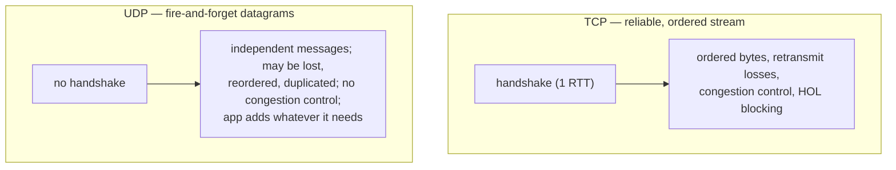
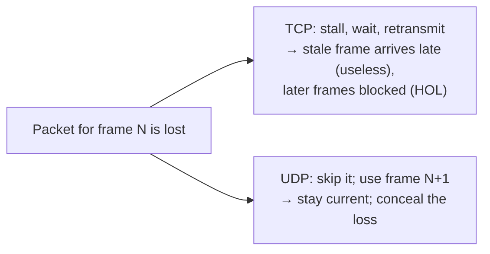

# Lesson 3.1.4 — UDP and When Datagrams Win

> Part 3: Networking Deep Dive · Module 3.1: Transport & Internet Layers · Difficulty: 🟡
>
> **Prerequisites:** [3.1.1 Layered Model], [3.1.3 TCP].
> **Unlocks:** [3.1.5 QUIC], [3.2.4 DNS], [3.2.5 Real-time transport], real-time/media systems.

---

## 1. Learning Objectives

After this lesson you will be able to:

- Explain what **UDP** provides (and deliberately *doesn't*) and how it differs from TCP (3.1.3).
- Identify the workloads where UDP's "fire-and-forget, no guarantees" model is the *right* choice — and why.
- Understand that UDP isn't "TCP minus features for no reason" — it's a **minimal substrate** apps build their own semantics on (the foundation QUIC uses).
- Reason about the tradeoff: lose reliability/ordering/congestion-control, gain low latency, no HOL blocking, and full application control.

---

## 2. Motivation — Sometimes you don't want TCP's guarantees

TCP (3.1.3) gives reliability and ordering — but those guarantees *cost* latency (handshake, retransmission waits, head-of-line blocking). For some workloads, those costs are *worse than the problem they solve*:
- In a **live video call or game**, a packet that's 200 ms late is **useless** — you want the *next* frame, not a retransmission of the stale one. TCP would stall everything waiting for the lost packet (HOL blocking, 3.1.3) — exactly the wrong behavior.
- In **DNS** (3.2.4), a request is tiny and you just retry if no answer — TCP's handshake overhead per lookup would be wasteful.

**UDP** exists for these cases: a minimal, connectionless transport that just sends datagrams with no guarantees, leaving reliability/ordering (if wanted) to the application. Understanding UDP is essential because it's the foundation of **QUIC/HTTP-3** (3.1.5), real-time media (3.2.5), DNS, and many high-performance systems. This lesson completes the TCP-vs-UDP picture at L4 and sets up QUIC.

---

## 3. Theory — From first principles

### 3.1 What UDP is (and isn't)

**UDP (User Datagram Protocol)** is a thin L4 protocol (3.1.1) that adds almost nothing to IP `[CS]`:

- **Connectionless** — no handshake. Just send a datagram to an IP+port. No connection state, no setup RTT.
- **Unreliable** — no acknowledgments, no retransmission. Lost datagrams are simply *gone* (the app may or may not notice).
- **Unordered** — datagrams may arrive in any order (or be duplicated). UDP doesn't reorder.
- **Message-oriented (datagrams)** — unlike TCP's byte stream, UDP preserves message boundaries: one send = one datagram = one receive.
- **No flow control, no congestion control** — UDP sends as fast as the app tells it to (which can be antisocial — §3.4).
- **Minimal header** — source/dest port, length, checksum. That's essentially it.

So UDP provides almost *nothing* beyond IP's "get this packet to a process on that machine, maybe." Everything else — reliability, ordering, congestion control — is left to the application *if it wants them*.

### 3.2 Why "no guarantees" is sometimes exactly right

The key insight: TCP's guarantees are **not free**, and for some data they're **counterproductive** `[CS]`:

- **Latency over completeness:** for real-time data (voice, video, game state), the *freshest* data matters; a retransmitted old packet is worthless by the time it arrives, and waiting for it (HOL blocking) actively *hurts*. UDP lets you skip the stale packet and use the next one. **Loss tolerance > reliability** here.
- **No handshake:** for tiny request/response (DNS), avoiding the 1-RTT handshake per query is a big win at scale.
- **No HOL blocking:** independent datagrams don't block each other — a loss affects only that datagram, not the whole stream.
- **Application control:** the app can implement *exactly* the reliability it needs (e.g., retransmit only critical packets, forward-error-correction, custom ordering) — TCP's one-size-fits-all is replaced by tailored semantics. This is *why QUIC uses UDP* (3.1.5): it builds *better* transport semantics on top of UDP's minimal base, rather than being stuck with TCP's fixed behavior.

So UDP isn't "worse TCP" — it's a **minimal, flexible substrate**. You choose it when you want *control* and *low latency* more than built-in guarantees.

### 3.3 Classic UDP use cases

- **DNS (3.2.4):** small queries; retry on no response; handshake overhead unwanted. (Falls back to TCP for large responses.)
- **Real-time media — VoIP, video conferencing, live streaming (3.2.5):** loss-tolerant; a dropped audio/video packet is better skipped than re-sent late. Often paired with codecs that conceal loss.
- **Online gaming:** frequent position/state updates; only the *latest* matters; the app sends a fresh update rather than re-sending old ones.
- **QUIC / HTTP-3 (3.1.5):** builds reliable, multiplexed, congestion-controlled transport *on UDP* to escape TCP's HOL blocking and ossification.
- **Network services:** DHCP, NTP (time sync — relevant to Part 8 clocks), SNMP.
- **Multicast/broadcast:** UDP supports one-to-many delivery (TCP can't); used for service discovery, streaming to many receivers.
- **High-frequency telemetry/metrics** where occasional loss is acceptable (e.g., statsd-style metrics over UDP).

### 3.4 The responsibility UDP hands you (and its danger)

Because UDP omits congestion control (3.1.3 §3.4), **a naive UDP application can flood the network** — it has no built-in "back off on congestion" behavior. This is antisocial and can cause **congestion collapse** if everyone did it. So `[BP]`:
- Real UDP applications that send significant volume **must implement their own congestion/rate control** (QUIC does this carefully; media protocols pace themselves).
- This is part of why QUIC (3.1.5) re-implements congestion control on top of UDP — you don't get it for free, and you *must* be a good network citizen.

Also, because UDP gives no reliability, the app must decide: tolerate loss (media), or build selective reliability (acknowledge/retransmit only what matters). This is *more work* — the tradeoff for the control and latency you gain.

### 3.5 The decision: TCP vs UDP (the L4 choice)

| Dimension | TCP | UDP |
|---|---|---|
| Connection | yes (handshake, ~1 RTT) | none (fire-and-forget) |
| Reliability | guaranteed (retransmit) | none (app's job if wanted) |
| Ordering | in-order | none |
| HOL blocking | yes (in-order delivery) | no (independent datagrams) |
| Congestion control | built-in | none (app must add) |
| Boundaries | byte stream | message (datagram) |
| Best for | most app traffic; correctness matters | real-time, loss-tolerant, tiny req/resp, custom transport |

**The heuristic:** use **TCP by default** (correctness, simplicity, and it's a good network citizen); choose **UDP when low latency and freshness beat completeness, when you need no-HOL-blocking independent messages, or when you're building custom transport semantics (QUIC).** For real-time media/gaming and DNS, UDP wins; for almost everything else, TCP. (And increasingly, **QUIC** gives you "UDP's flexibility with TCP-like reliability done better" — 3.1.5.)

---

## 4. Visual Intuition

### TCP vs UDP

### Why real-time prefers UDP (freshness > completeness)

---

## 5. Real-World Analogy

**A live phone conversation vs a certified-mail contract.** TCP is **certified mail**: every page is numbered, the recipient signs for each, and if page 2 is lost the sender *must* resend it before you'll accept page 3 — perfect for a legal contract (correctness), useless for a live chat. **UDP is a live phone/walkie-talkie conversation**: if a word gets garbled by static, you don't stop and demand they repeat that exact word from five seconds ago — you say "say again?" only if it mattered, and otherwise just keep going with the *current* conversation (freshness over completeness). For a live broadcast, re-playing a word that was lost 3 seconds ago would be absurd — you want what's being said *now*. That's exactly why voice/video/games use UDP: a late retransmission of stale data is worse than a small gap you can paper over. And just as a considerate speaker doesn't shout over a bad line (self-pacing), a well-behaved UDP app must add its own congestion control rather than flooding the network.

---

## 6. Industry Example

- **DNS over UDP** `[CONV]`: DNS uses UDP for its small, fast queries (falling back to TCP for large responses / zone transfers) — avoiding handshake overhead per lookup (3.2.4).
- **Real-time media (WebRTC/RTP)** `[CONV]`: video conferencing, VoIP, and live streaming use UDP-based protocols (RTP/SRTP, WebRTC) precisely for loss tolerance and low latency; codecs include loss concealment (3.2.5).
- **Gaming** `[CONV]`: fast-paced multiplayer games send state over UDP, using the latest update rather than retransmitting stale positions.
- **QUIC over UDP** `[CONV]`: Google's QUIC (now HTTP/3) deliberately builds on UDP to implement a *better* transport than TCP — independent streams (no HOL blocking), faster handshakes, and evolvable congestion control — because UDP is the flexible substrate and TCP is "ossified" in middleboxes (3.1.5).
- **NTP for clock sync** `[CONV]`: time synchronization (relevant to distributed clocks, Part 8) uses UDP.

---

## 7. Implementation Details — Using UDP well

- **Default to TCP**; choose UDP deliberately for real-time/loss-tolerant data, tiny req/resp, multicast, or custom transport.
- **If you build on UDP, you own reliability and congestion control:** decide what (if anything) to retransmit, how to detect loss, and — critically — **implement rate/congestion control** to be a good network citizen (§3.4). Don't naively blast packets.
- **Consider QUIC instead of raw UDP** (3.1.5): if you want UDP's benefits (no HOL blocking, fast handshake) *plus* reliability/multiplexing/congestion control done right, QUIC gives you that without reimplementing transport from scratch. Most teams should reach for QUIC/HTTP-3 rather than hand-rolling UDP reliability.
- **Mind datagram size / MTU** (3.1.2): UDP datagrams larger than the path MTU get fragmented (or dropped) — keep them within MTU (~1200–1500 bytes practical) to avoid loss/fragmentation issues.
- **Handle loss at the app level** for media (forward error correction, loss concealment) or accept it (telemetry).
- **Firewalls/NAT and UDP** (3.1.2): UDP's connectionless nature makes NAT traversal trickier (no connection state) — relevant to P2P/WebRTC (STUN/TURN).

---

## 8. Advantages (of UDP)

- **Low latency** — no handshake, no retransmission waits, no HOL blocking.
- **Freshness for real-time data** — skip stale packets, use the latest.
- **Application control** — implement exactly the reliability/ordering you need (the basis of QUIC).
- **Message boundaries preserved** — one send = one receive (simpler for message-based protocols).
- **Multicast/broadcast support** — one-to-many delivery (TCP can't).
- **Low overhead** — tiny header, no per-connection state (scales to huge numbers of clients).

---

## 9. Disadvantages / Costs

- **No reliability/ordering** — the app must add them if needed (more work, easy to get wrong).
- **No congestion control** — naive use can flood the network / cause congestion collapse; you *must* add pacing.
- **No connection state** — harder NAT traversal; no built-in connection lifecycle.
- **Not suitable for data needing guaranteed, ordered delivery** (use TCP/QUIC).
- **Datagram size limits / fragmentation** concerns (MTU).

---

## 10. When NOT to use UDP

- **When you need guaranteed, ordered delivery** of all data (most application traffic — file transfer, transactions, APIs) → **TCP** (or QUIC).
- **When you'd just end up reimplementing TCP poorly** — if you need reliability + ordering + congestion control, use TCP or QUIC rather than hand-rolling them on UDP (a classic mistake).
- **When you can't guarantee good network-citizen behavior** (no congestion control) for high-volume traffic.
- Reserve UDP for genuine real-time/loss-tolerant/tiny-req-resp/multicast cases, or use QUIC for "better transport."

---

## 11. Common Mistakes

1. **Using UDP and then reimplementing TCP badly** on top (ad-hoc retransmission/ordering with bugs) — when TCP or QUIC would be correct and easier.
2. **Omitting congestion/rate control** on high-volume UDP — flooding the network, harming yourself and others (antisocial, can cause collapse).
3. **Sending oversized datagrams** (> MTU) → fragmentation/loss.
4. **Using UDP for data that needs reliability** (e.g., financial messages) and silently losing it.
5. **Assuming UDP is "just faster TCP"** — it has no guarantees; the speed comes from *dropping* features you may actually need.
6. **Ignoring NAT/firewall issues** with connectionless UDP (traversal, blocked ports).

---

## 12. Interview Questions

**🟢 Easy**
- What does UDP provide and not provide compared to TCP?
- Give two use cases where UDP is the right choice and explain why.

**🟡 Medium**
- Why is UDP preferred for live video/audio and gaming? What's wrong with TCP's behavior there (tie to HOL blocking and retransmission)?
- UDP has no congestion control — why is that a problem, and what must a high-volume UDP application do about it?

**🔴 Hard**
- You're designing a live multiplayer game's networking. Which transport, and how do you handle loss, ordering, and the "only the latest state matters" requirement? Where might you add selective reliability?
- Why did QUIC build on UDP rather than TCP? What does UDP give QUIC that TCP couldn't (tie to HOL blocking, handshake, and protocol ossification — 3.1.5)?

**⚫ Staff+**
- Compare TCP, raw UDP, and QUIC for a real-time communication platform (calls + chat + file transfer). Which transport for which feature, and why? How do you handle congestion control responsibly across them?
- A team built a custom reliable protocol over UDP and it's buggy and underperforms TCP. Diagnose why hand-rolling transport is hard (congestion control, retransmission, ordering edge cases) and when it's justified vs adopting QUIC.

---

## 13. Production Pitfalls

- **Network flooding from uncontrolled UDP:** a high-volume UDP service without congestion control saturating links and degrading *all* traffic (including itself) — and being a bad neighbor.
- **Silent data loss:** using UDP for data that actually needed reliability, losing messages under loss/congestion with no detection.
- **Buggy hand-rolled reliability:** a custom UDP reliability layer with edge-case bugs (retransmission storms, reordering errors) that's slower and less correct than TCP/QUIC would be.
- **MTU/fragmentation loss:** oversized UDP datagrams fragmented and dropped on paths with smaller MTU (tunnels/VPNs), causing intermittent failures.
- **NAT traversal failures:** UDP-based P2P (WebRTC) failing to connect without STUN/TURN due to NAT (3.1.2).

---

## 14. Optimization Techniques

- **Keep datagrams within MTU** to avoid fragmentation/loss.
- **Implement responsible congestion/rate control** for high-volume UDP (or use QUIC, which does it well).
- **Use loss concealment / FEC** for media instead of retransmission (latency-friendly reliability).
- **Send only the latest state** for real-time (don't retransmit stale data) — design around freshness.
- **Prefer QUIC over hand-rolled UDP** when you need reliability + multiplexing + congestion control without TCP's HOL blocking (3.1.5).
- **Use multicast** for efficient one-to-many delivery where applicable (discovery, fan-out streaming).

---

## 15. Summary

**UDP** is a deliberately **minimal L4 transport**: connectionless (no handshake), unreliable (no retransmission), unordered, message-oriented, with **no flow or congestion control** — essentially IP plus ports. Its value is precisely in what it *omits*: for **real-time, loss-tolerant data** (voice, video, gaming) the **freshest** data matters and a late retransmission of stale data is worse than a small gap, so TCP's reliability and **head-of-line blocking** (3.1.3) are *counterproductive* — UDP lets you skip losses and stay current. It also wins for **tiny request/response** (DNS — no per-query handshake), **multicast** (one-to-many), and as the **flexible substrate for custom transport** — which is exactly why **QUIC/HTTP-3 builds on UDP** (3.1.5) to implement *better* transport (independent streams, fast handshake, evolvable congestion control) than TCP allows. The price: the application must add any reliability/ordering it needs and — critically — **its own congestion control** (omitting it floods the network). The decision rule: **default to TCP** (correctness, good network citizen); choose **UDP when low latency and freshness beat completeness, when you need no-HOL independent messages, or when building custom transport** — and increasingly, reach for **QUIC** to get UDP's flexibility with reliability done right rather than hand-rolling it. This completes the TCP/UDP picture at L4 and sets up QUIC next.

---

## 16. Revision Notes (flashcard-ready)

- **Q:** What does UDP provide vs TCP? **A:** Connectionless, unreliable, unordered, message-oriented, no flow/congestion control — minimal (IP + ports).
- **Q:** Why is UDP good for real-time media/gaming? **A:** Freshness > completeness; skip lost/stale packets instead of stalling (no HOL blocking, no retransmit wait).
- **Q:** Classic UDP use cases? **A:** DNS, VoIP/video (RTP/WebRTC), gaming, QUIC, NTP/DHCP, multicast, telemetry.
- **Q:** Big responsibility UDP hands you? **A:** You must add congestion control (or flood the network) and any reliability you need.
- **Q:** Why does QUIC use UDP? **A:** UDP is a flexible substrate to build better transport (independent streams, fast handshake, evolvable CC) without TCP's HOL blocking/ossification.
- **Q:** Default transport choice? **A:** TCP (correctness, good citizen); UDP/QUIC for real-time/loss-tolerant/custom.
- **Q:** Common UDP mistake? **A:** Reimplementing TCP badly on UDP, or omitting congestion control.
- **Q:** Datagram size concern? **A:** Keep within MTU to avoid fragmentation/loss.

---

## 17. Further Reading + Knowledge-Graph Links

**Within this platform**
- **Previous:** [3.1.3 TCP] (the contrast). **Next:** [3.1.5 QUIC] (reliable, multiplexed transport built on UDP).
- **Used by:** [3.2.4 DNS] (UDP queries), [3.2.5 WebSockets/SSE/real-time] (media transport), [Part 8 clocks] (NTP), real-time/streaming systems.
- **Builds on:** [3.1.1 L4], [3.1.2 MTU/NAT], [1.1.3 latency vs completeness].

**Foundational texts (synthesized)**
- Kurose & Ross, *Computer Networking* — UDP design, connectionless transport, when to use it, congestion-control responsibility.
- Tanenbaum, *Computer Networks* — UDP, multicast.
- QUIC/HTTP-3 literature — UDP as the substrate for next-gen transport (3.1.5).

**Concept tags:** `[CS]` connectionless/unreliable datagrams, no congestion control, message boundaries · `[CONV]` DNS/RTP/WebRTC/gaming/QUIC over UDP · `[BP]` default TCP, add congestion control on UDP, prefer QUIC over hand-rolled reliability.
