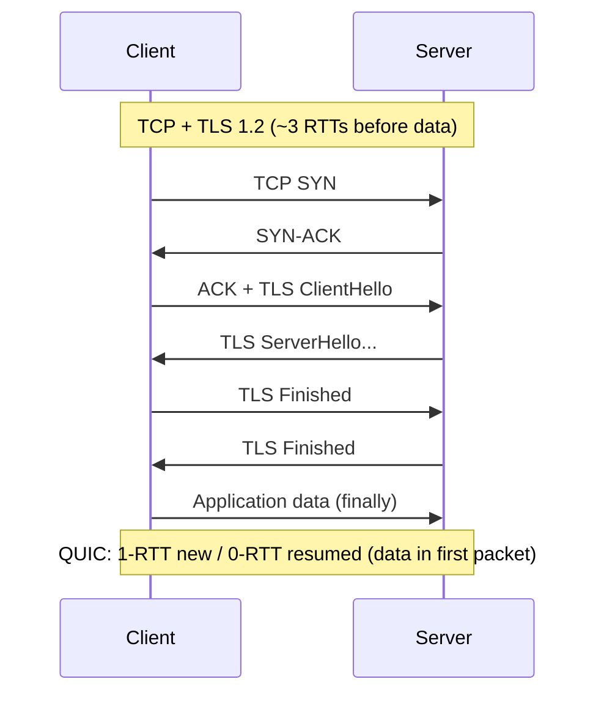
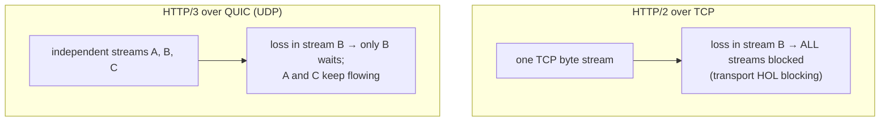
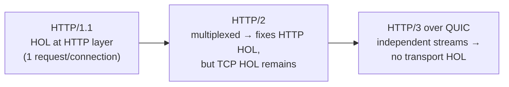

# Lesson 3.1.5 — QUIC and the Motivation Behind It

> Part 3: Networking Deep Dive · Module 3.1: Transport & Internet Layers · Difficulty: 🔴 · **Completes Module 3.1**
>
> **Prerequisites:** [3.1.3 TCP] (handshake, HOL blocking), [3.1.4 UDP], [3.1.1 layering].
> **Unlocks:** [3.2.2 HTTP/3], [3.2.3 TLS], [3.3.3 CDN/edge], [Part 17 Performance].

---

## 1. Learning Objectives

After this lesson you will be able to:

- Explain the **problems with TCP** that QUIC was designed to solve: transport-level HOL blocking, slow handshakes, and protocol **ossification**.
- Describe what **QUIC** is: a reliable, multiplexed, secure transport built **on UDP**, with **independent streams**, **integrated TLS 1.3**, and **connection migration**.
- Explain why QUIC = the transport for **HTTP/3**, and the latency wins (0-/1-RTT handshakes, no transport HOL blocking).
- Reason about QUIC's tradeoffs (UDP handling, CPU cost, middlebox issues) and when it helps most (lossy/mobile networks, high-multiplexing web).

---

## 2. Motivation — Why reinvent transport?

TCP (3.1.3) has carried the internet for decades, but it has three deep problems that *can't be fixed within TCP*:

1. **Transport-level HOL blocking** (3.1.3 §3.5): HTTP/2 multiplexes many streams over one TCP connection, but a single lost packet stalls *all* of them because TCP enforces in-order delivery of the whole byte stream. HTTP/2 can't fix this — the problem is *below* it (layering, 3.1.1).
2. **Slow connection setup:** TCP handshake (1 RTT) + TLS handshake (1–2 RTTs) = 2–3 RTTs before any data (3.1.3 §3.2). On high-latency/mobile links, that's hundreds of ms of pure overhead per new connection.
3. **Ossification:** TCP is implemented in OS kernels and inspected/modified by countless middleboxes (firewalls, NATs, proxies). This makes TCP nearly *impossible to evolve* — new TCP features break on the deployed internet. You can't ship TCP improvements.

**QUIC** (originally Google, now an IETF standard) solves all three by building a *new* transport on top of **UDP** (3.1.4) — using UDP precisely because it's the minimal, flexible substrate that middleboxes pass through and that lets the transport live in *user space* (evolvable) rather than the kernel. QUIC is the transport for **HTTP/3**. This lesson explains the *why* and *how*, completing the transport layer and setting up HTTP/3 (3.2.2).

---

## 3. Theory — From first principles

### 3.1 What QUIC is

> **QUIC** is a **reliable, ordered-per-stream, multiplexed, encrypted, connection-oriented transport protocol that runs over UDP.** `[CS]`

It re-implements (in user space, over UDP) the good parts of TCP — reliability, ordering, congestion control — *plus* fixes TCP's flaws and integrates encryption. Think of it as **"TCP + TLS, redesigned, on UDP."** Its defining features:

1. **Independent streams (no transport HOL blocking)** — the headline feature.
2. **Integrated TLS 1.3** — encryption is built-in, not layered on top.
3. **Fast handshakes (1-RTT, often 0-RTT)** — combines transport + crypto setup.
4. **Connection migration** — connections survive network changes (Wi-Fi ↔ cellular).
5. **User-space, evolvable** — escapes kernel/middlebox ossification.

### 3.2 Independent streams — fixing HOL blocking

This is QUIC's core innovation `[CS]`. Like HTTP/2, QUIC multiplexes many streams over one connection — but unlike TCP, **QUIC understands streams at the transport level and keeps them independent.** Each stream has its own ordering/delivery; a lost packet affecting stream B blocks *only* stream B, while streams A and C continue to be delivered.

Contrast with TCP (3.1.3 §3.5): TCP sees one opaque byte stream, so one loss blocks everything. QUIC sees the streams, so loss is **isolated per stream**. This eliminates **transport-level head-of-line blocking** — the problem HTTP/2 couldn't solve because it was stuck below it in TCP. **This is *why* QUIC was built and why HTTP/3 runs on it** (3.2.2). The benefit is largest on **lossy networks** (mobile/wireless), where TCP HOL blocking is most painful.

### 3.3 Integrated TLS 1.3 and fast handshakes

TCP+TLS is *two* handshakes layered: TCP (1 RTT) then TLS (1–2 RTTs) — 2–3 RTTs total before data (3.1.3). QUIC **integrates TLS 1.3 into the transport handshake** `[CS]`:

- **1-RTT** handshake for a new connection (transport + crypto combined) — already better than TCP+TLS.
- **0-RTT** for *resumed* connections to a previously-visited server: the client can send application data *in the very first packet*, with no round trip before data. A major latency win for repeat visits (recall: each RTT to a far server is ~100 ms — 1.1.3).
- **Always encrypted** — there's no unencrypted QUIC; security is built in, not optional (good for privacy and harder for middleboxes to meddle, reducing ossification).

(0-RTT has a security caveat — replay risk for non-idempotent requests — so it's used carefully; 3.2.3, Part 11 idempotency.)

### 3.4 Connection migration

A TCP connection is identified by the 4-tuple (src IP, src port, dst IP, dst port). If your **IP changes** — e.g., phone moving from Wi-Fi to cellular — the TCP connection *breaks* and must be re-established (new handshake) `[CS]`. QUIC instead identifies connections by a **connection ID** independent of IP/port, so a connection **survives network changes**: your download/video call continues seamlessly when you walk out of Wi-Fi range onto cellular. This is a significant mobile UX win that TCP fundamentally can't offer.

### 3.5 Escaping ossification (why user-space + UDP)

TCP improvements are stuck because TCP lives in the **OS kernel** (slow to update across billions of devices) and is mangled by **middleboxes** that assume specific TCP behavior `[CS]`. QUIC sidesteps this:
- It runs in **user space** (part of the application/library), so it can be updated by shipping a new app/library version — *fast* evolution, no kernel/OS dependency.
- It runs over **UDP** (3.1.4), which middleboxes pass through more transparently, and it **encrypts almost everything** (including most transport metadata), so middleboxes *can't* inspect/modify it — preventing future ossification.

This is a profound architectural choice: QUIC trades the kernel's efficiency for **evolvability** (1.2.2) — it's *designed to keep improving*. (The same "keep it changeable" value as evolutionary architecture, 2.3.3.)

### 3.6 The tradeoffs (QUIC isn't free)

- **CPU cost:** QUIC runs in user space and encrypts everything, so it can be **more CPU-intensive** than kernel TCP (though optimizations and hardware offload are closing the gap). At massive scale this matters (Part 17).
- **UDP handling:** some networks rate-limit, deprioritize, or block UDP (it's historically less "important" traffic), so QUIC must **fall back to TCP** where UDP is blocked — clients try QUIC and fall back to HTTP/2 over TCP if it fails.
- **Maturity/tooling:** newer than TCP; debugging/observability tooling and middlebox support are less mature (improving rapidly).
- **Not always faster:** on clean, low-loss, high-bandwidth wired networks, TCP+HTTP/2 may perform comparably; QUIC's biggest wins are on **lossy/high-latency/mobile** links and for **0-RTT repeat connections**. (A 1.1.5 tradeoff — measure for your workload.)

### 3.7 QUIC and HTTP/3 (the relationship)

**HTTP/3 = HTTP semantics over QUIC** (3.2.2) `[CS]`. HTTP/2 fixed HTTP-level HOL blocking (one request per connection in HTTP/1.1) by multiplexing — but reintroduced the problem at the *TCP* level. HTTP/3 finishes the job: by running over QUIC's independent streams, it eliminates transport-level HOL blocking too. So the progression is: **HTTP/1.1 (HOL at HTTP layer) → HTTP/2 (multiplexed, but TCP HOL) → HTTP/3 (QUIC, no transport HOL).** QUIC also brings the faster handshakes and connection migration. This is why major CDNs and browsers adopted HTTP/3 (3.2.2, 3.3.3, Part 18).

---

## 4. Visual Intuition

### TCP+TLS vs QUIC handshake (RTTs before data)

### Independent streams (QUIC) vs shared byte stream (TCP)

### The HTTP evolution (HOL blocking, layer by layer)

---

## 5. Real-World Analogy

**Upgrading a shared delivery truck to independent couriers.** TCP+HTTP/2 is like sending many separate packages (streams) on **one truck on one road**: if the truck gets stuck behind an accident (a lost packet), *every* package is delayed, even ones that were ready — and before the truck even leaves, you waste time at multiple checkpoints (TCP handshake, then a separate security check = TLS). **QUIC** is like dispatching **independent couriers** who each take their own path: one courier hitting traffic doesn't delay the others (no HOL blocking), security clearance is combined with dispatch so they leave faster (integrated TLS, 1-/0-RTT), and — remarkably — if a courier's phone switches networks mid-route (Wi-Fi → cellular), they keep going instead of starting over (connection migration). The catch: couriers cost a bit more to run (CPU), and some checkpoints are suspicious of this new method and occasionally turn them away (UDP blocking) — so you keep the old truck as a backup (fall back to TCP).

---

## 6. Industry Example

- **Google → IETF QUIC, then HTTP/3** `[CONV]`: QUIC originated at Google (deployed across Chrome/YouTube/Google services), was standardized by the IETF, and became the transport for **HTTP/3** — now supported by major browsers and widely deployed.
- **CDN adoption** `[CONV]`: Cloudflare, Google, Fastly, and other CDNs (3.3.3, Part 18) offer HTTP/3/QUIC, citing latency improvements especially on **mobile and lossy networks** and faster connection setup for repeat visitors.
- **Mobile UX (connection migration)** `[CONV]`: QUIC's connection migration is repeatedly cited as a real benefit for mobile users moving between networks (calls/streams not dropping).
- **Fallback in practice** `[CONV]`: clients negotiate HTTP/3 and **fall back to HTTP/2 over TCP** when UDP/QUIC is blocked — a documented, necessary robustness measure.
- **CPU cost at scale** `[CONV]`: large operators have publicly discussed QUIC's higher CPU cost vs kernel TCP and ongoing optimization work — the §3.6 tradeoff in the real world.

---

## 7. Implementation Details — Adopting QUIC/HTTP-3

- **You usually adopt QUIC via HTTP/3** (3.2.2) at the **edge** (CDN / load balancer / reverse proxy) rather than implementing QUIC yourself — enable HTTP/3 on your CDN/LB and clients negotiate it automatically (with TCP fallback).
- **Biggest wins on lossy/high-latency/mobile** clients and for **repeat connections** (0-RTT). On clean wired networks, gains are smaller — **measure for your user base** (Part 17).
- **Keep TCP/HTTP-2 fallback** — never assume UDP is available everywhere; clients fall back when QUIC is blocked.
- **Mind 0-RTT replay safety** (§3.3): only send **idempotent** requests in 0-RTT data (a GET, not a non-idempotent POST), since 0-RTT data can be replayed (3.2.3, Part 11 idempotency).
- **Budget CPU** at very high scale (§3.6); monitor QUIC vs TCP performance and CPU (Part 16/17).
- **Combine with edge/CDN** (3.3.3): terminate QUIC near users so handshakes are cheap and connections are warm — compounding with the TCP lessons (3.1.3).

---

## 8. Advantages

- **No transport-level HOL blocking** — independent streams; big win on lossy/mobile networks (the headline benefit).
- **Faster connection setup** — 1-RTT new, **0-RTT** resumed (integrated TLS 1.3) — major latency reduction (1.1.3).
- **Connection migration** — survives IP/network changes (seamless Wi-Fi ↔ cellular).
- **Always encrypted** — built-in TLS 1.3; better privacy, harder to meddle with.
- **Evolvable** — user-space + UDP escapes kernel/middlebox ossification; transport can keep improving.

---

## 9. Disadvantages / Costs

- **Higher CPU cost** than kernel TCP (user-space + pervasive encryption) — matters at massive scale.
- **UDP blocking/throttling** on some networks → must fall back to TCP (added complexity).
- **Maturity gap** — tooling, debugging, and middlebox support less mature than TCP (improving fast).
- **Not universally faster** — limited gains on clean wired networks; biggest on lossy/mobile and repeat connections (measure).
- **0-RTT replay risk** — requires care (idempotent-only) for the 0-RTT path.

---

## 10. When QUIC/HTTP-3 helps most (and least)

- **Most:** mobile/lossy/high-latency users, latency-sensitive web with high multiplexing, frequent repeat connections (0-RTT), and applications where connection migration matters (mobile streaming/calls).
- **Least:** clean low-loss wired/datacenter networks (TCP/HTTP-2 comparable), CPU-constrained environments at extreme scale, or where UDP is widely blocked. For *internal* datacenter RPC, TCP/HTTP-2 or gRPC-over-TCP often remains fine.
- **Default approach:** enable HTTP/3 at the edge with TCP fallback — get the wins where available, lose nothing where not.

---

## 11. Common Mistakes

1. **Assuming QUIC is always faster** — ignoring that wins are concentrated on lossy/mobile/repeat-connection cases; not measuring (1.1.5).
2. **No TCP fallback** — breaking for users on networks that block/throttle UDP.
3. **Sending non-idempotent requests in 0-RTT** — exposing replay vulnerabilities (3.2.3, Part 11).
4. **Reimplementing QUIC yourself** instead of adopting via CDN/LB libraries (it's complex; use proven implementations).
5. **Ignoring CPU cost** at scale — deploying QUIC broadly without budgeting the higher CPU.
6. **Confusing HTTP/3 with HTTP/2** — HTTP/3 is specifically HTTP over QUIC (no TCP HOL); HTTP/2 still has TCP HOL blocking.

---

## 12. Interview Questions

**🟢 Easy**
- What transport does QUIC run on, and why not TCP?
- What is QUIC's headline advantage over TCP for multiplexed connections?

**🟡 Medium**
- Explain how QUIC eliminates transport-level head-of-line blocking that HTTP/2 over TCP suffers.
- What is connection migration, and why can't TCP do it?

**🔴 Hard**
- Walk through the handshake/latency differences between TCP+TLS 1.2, TCP+TLS 1.3, and QUIC (1-RTT/0-RTT). When does 0-RTT help, and what's its security caveat?
- Explain "protocol ossification" and how QUIC's user-space + UDP + full-encryption design escapes it. What does this trade away (CPU)?

**⚫ Staff+**
- You serve a global, mostly-mobile user base from a CDN. Make the case for enabling HTTP/3/QUIC: which users benefit most, what you'd measure, how you handle UDP-blocking fallback and 0-RTT replay safety, and the CPU-cost tradeoff at scale.
- Trace the HTTP evolution (1.1 → 2 → 3) through the lens of head-of-line blocking at different layers (3.1.1). What problem did each solve, what did it leave, and why did fixing the last one require a new transport rather than a new HTTP version?

---

## 13. Production Pitfalls

- **UDP blocked → broken or slow:** users on restrictive networks where UDP is throttled/blocked; without robust TCP fallback, they get failures or fall-back delays.
- **0-RTT replay vulnerability:** non-idempotent requests sent in 0-RTT data being replayed by an attacker → duplicate side effects (must restrict 0-RTT to idempotent requests, Part 11).
- **CPU saturation at scale:** broad QUIC deployment spiking server CPU vs TCP, requiring capacity/optimization work (Part 17).
- **Observability gaps:** QUIC's encryption hides transport details that TCP tooling relied on, complicating debugging until QUIC-aware tooling is in place (Part 16).
- **Assuming gains everywhere:** rolling out QUIC and seeing little benefit (or regressions) on clean wired networks because the wins are elsewhere.

---

## 14. Optimization Techniques

- **Enable HTTP/3 at the edge (CDN/LB)** with **automatic TCP/HTTP-2 fallback** — capture wins, lose nothing.
- **Use 0-RTT for idempotent requests** to cut repeat-connection latency safely.
- **Terminate QUIC near users** (edge, 3.3.3) — cheap handshakes, warm connections (compounds 3.1.3 lessons).
- **Measure per-user-segment** (mobile vs wired, region) to target QUIC where it helps and monitor CPU (Part 17).
- **Adopt proven QUIC libraries/CDN support** rather than implementing transport yourself.
- **Combine with TLS 1.3** (built into QUIC) and connection migration for mobile UX.

---

## 15. Summary

**QUIC** is a modern transport — **reliable, multiplexed, encrypted, connection-oriented — built on UDP** (3.1.4) — designed to fix three problems TCP *can't* solve from within: **transport-level head-of-line blocking**, **slow handshakes**, and **protocol ossification**. Its core innovation is **independent streams**: because QUIC understands streams at the transport level, a lost packet blocks only *its* stream (not all multiplexed streams as in HTTP/2-over-TCP) — eliminating transport HOL blocking, with the biggest gains on **lossy/mobile networks**. It **integrates TLS 1.3** for **1-RTT (new) and 0-RTT (resumed)** handshakes (vs TCP+TLS's 2–3 RTTs), supports **connection migration** (survives Wi-Fi↔cellular changes via a connection ID, which TCP's 4-tuple can't), and runs in **user space over UDP** to **escape kernel/middlebox ossification** — trading some CPU efficiency for **evolvability** and pervasive encryption. QUIC is the transport for **HTTP/3**, completing the HTTP evolution against HOL blocking (1.1 HTTP-layer → 2 fixed it but added TCP HOL → 3 over QUIC removes transport HOL). Its tradeoffs — higher CPU, occasional UDP blocking (needing TCP fallback), 0-RTT replay caution, and gains concentrated on lossy/mobile/repeat-connection cases — mean you adopt it pragmatically (usually via a CDN/LB with fallback, measuring per segment). This completes **Module 3.1 (Transport & Internet layers)**; Module 3.2 moves up to the application protocols (HTTP/1.1→2→3, TLS, DNS, real-time, gRPC/REST/GraphQL) that ride on top.

---

## 16. Revision Notes (flashcard-ready)

- **Q:** What is QUIC? **A:** A reliable, multiplexed, encrypted, connection-oriented transport built on UDP — the transport for HTTP/3.
- **Q:** Three TCP problems QUIC fixes? **A:** Transport HOL blocking, slow handshakes, protocol ossification.
- **Q:** QUIC's headline feature? **A:** Independent streams — a loss blocks only its stream, not all (no transport HOL blocking).
- **Q:** Handshake advantage? **A:** Integrated TLS 1.3 → 1-RTT new, 0-RTT resumed (vs TCP+TLS's 2–3 RTTs).
- **Q:** Connection migration? **A:** Connections survive IP/network changes (connection ID, not 4-tuple) — TCP can't.
- **Q:** Why user-space + UDP? **A:** Escapes kernel/middlebox ossification → evolvable; UDP passes through middleboxes.
- **Q:** Main costs? **A:** Higher CPU, UDP sometimes blocked (need TCP fallback), 0-RTT replay risk, maturity gap.
- **Q:** HTTP evolution vs HOL blocking? **A:** 1.1 (HTTP-layer HOL) → 2 (multiplexed but TCP HOL) → 3 over QUIC (no transport HOL).
- **Q:** 0-RTT caveat? **A:** Replay risk → only idempotent requests in 0-RTT data.

---

## 17. Further Reading + Knowledge-Graph Links

**Within this platform**
- **Previous:** [3.1.4 UDP] (QUIC's substrate). **Completes Module 3.1.** **Next:** [3.2.1 HTTP/1.1 semantics] → [3.2.2 HTTP/2 & HTTP/3].
- **Directly enables:** [3.2.2 HTTP/3], [3.2.3 TLS 1.3] (integrated), [3.3.3 CDN/edge] (where QUIC terminates), [Part 17 Performance] (CPU/latency tradeoffs).
- **Builds on:** [3.1.3 TCP] (handshake, HOL blocking), [3.1.1 layering] (HOL as a layering consequence), [2.3.3 evolvability] (escaping ossification).

**Foundational texts (synthesized)**
- IETF QUIC / HTTP-3 specifications and design rationale (HOL blocking, handshake, migration, ossification).
- Kurose & Ross, *Computer Networking* — transport evolution context (TCP limitations QUIC addresses).
- CDN/browser engineering writing on HTTP/3 deployment and measured benefits (representative).

**Concept tags:** `[CS]` independent streams, integrated TLS 1.3, connection migration, ossification · `[CONV]` Google→IETF QUIC, HTTP/3 CDN adoption, TCP fallback, CPU cost · `[BP]` adopt via CDN/LB with fallback, 0-RTT idempotent-only, measure per segment.
