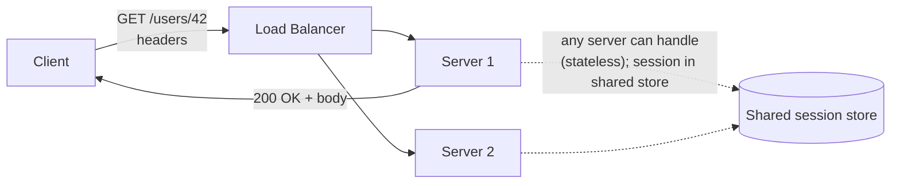
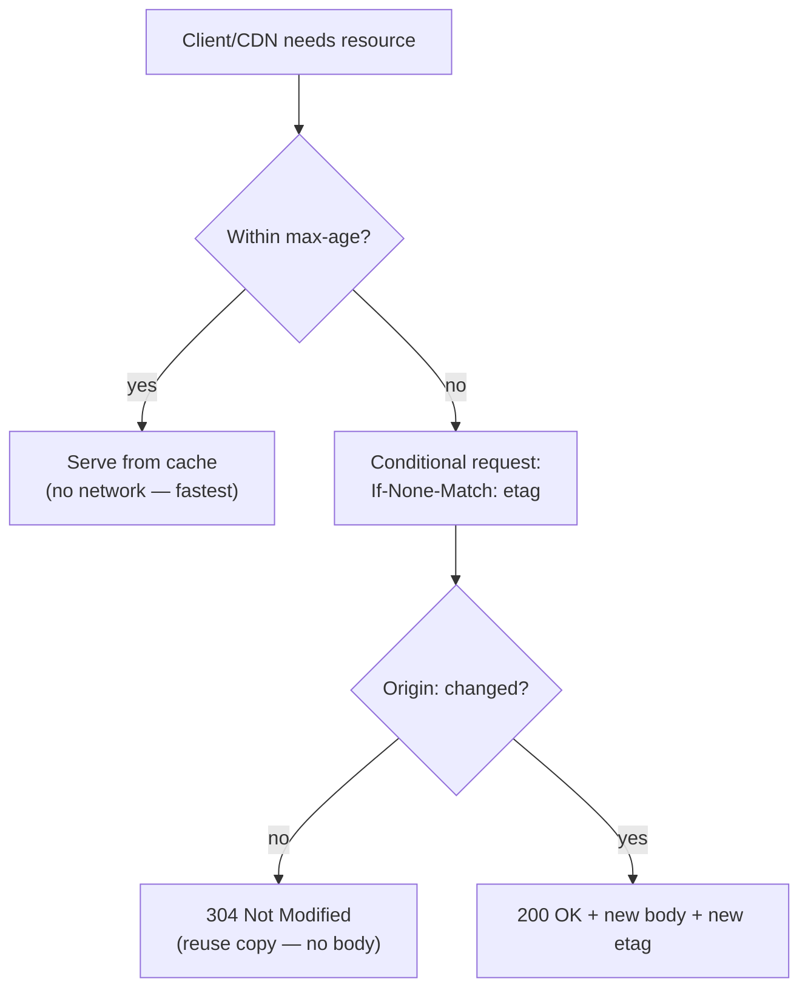

# Lesson 3.2.1 — HTTP/1.1 Semantics: Methods, Status Codes, Caching Headers

> Part 3: Networking Deep Dive · Module 3.2: Application Protocols · Difficulty: 🟡
>
> **Prerequisites:** [3.1.1 Layered Model], [3.1.3 TCP].
> **Unlocks:** [3.2.2 HTTP/2-3], [3.2.6 REST/gRPC/GraphQL], [Part 6 Caching], [Part 19 API Design].

---

## 1. Learning Objectives

After this lesson you will be able to:

- Explain HTTP as a **stateless, text-based request/response** protocol and what that statelessness enables (horizontal scaling, Part 7).
- Use HTTP **methods** correctly, with their **safety** and **idempotency** properties (critical for retries — Part 11).
- Choose appropriate **status codes** and understand their classes.
- Apply HTTP **caching headers** (`Cache-Control`, `ETag`, etc.) — the foundation of web caching and CDNs (Part 6, 3.3.3).
- Recognize HTTP/1.1's limitations (HOL blocking, connection overhead) that motivated HTTP/2 (3.2.2).

---

## 2. Motivation — The protocol your APIs speak

HTTP is the application-layer protocol (L7, 3.1.1) underlying the web and most APIs. Even if you "just use a framework," HTTP's semantics shape critical decisions: which **method** to use determines whether a request is safe to **retry** (idempotency, Part 11); **status codes** drive client and proxy behavior; **caching headers** determine what a CDN or browser can cache (Part 6, 3.3.3) — one of the highest-leverage performance/cost tools. And HTTP's **statelessness** is *why* you can scale web servers horizontally (Part 7).

Getting HTTP semantics right is foundational to API design (Part 19) and to leveraging caching. This lesson covers the semantics that matter architecturally and sets up HTTP/2/3 (which change the *transport efficiency* but keep these semantics).

---

## 3. Theory — From first principles

### 3.1 HTTP is stateless request/response

HTTP is a **client-initiated, request/response** protocol: the client sends a request (method + URL + headers + optional body), the server returns a response (status + headers + optional body). Crucially, HTTP is **stateless** `[CS]`: each request is independent; the server keeps **no client state between requests** (any state is in the request, or in a shared store the server consults).

Why statelessness matters enormously (recall 1.2.1 scalability, Part 7):
- **Horizontal scaling:** any server can handle any request (no server-affinity needed), so you put a fleet of identical stateless servers behind a load balancer (3.3) and scale by adding more. State (sessions) is externalized to a shared store (Redis/DB) — the **stateless-services** pattern (Part 7).
- **Resilience:** a server can die mid-traffic and another handles the next request — no lost session state on the server.

(Statefulness like "logged-in user" is achieved *on top* of stateless HTTP via cookies/tokens that carry/reference state — the protocol itself stays stateless.)

### 3.2 Methods and their safety/idempotency (the retry-critical part)

HTTP methods (verbs) express intent. The architecturally crucial properties are **safe** (no side effects — read-only) and **idempotent** (doing it N times = doing it once) `[CS]`:

| Method | Purpose | Safe? | Idempotent? |
|---|---|---|---|
| **GET** | retrieve a resource | ✓ | ✓ |
| **HEAD** | GET headers only | ✓ | ✓ |
| **PUT** | create/replace a resource at a known URI | ✗ | ✓ |
| **DELETE** | remove a resource | ✗ | ✓ |
| **POST** | create/submit (server decides URI); general action | ✗ | ✗ (not idempotent) |
| **PATCH** | partial update | ✗ | not necessarily |
| **OPTIONS** | query capabilities | ✓ | ✓ |

**Why this is critical (Part 11):** networks fail; clients/proxies **retry**. Retrying a **GET/PUT/DELETE** (idempotent) is safe — same end state. Retrying a **POST** (non-idempotent) can **double-create** (two orders, two charges!). This is why payment/order APIs use **idempotency keys** to make POST safely retryable (Part 11, 19.2.3), and why GET must never have side effects (a crawler or prefetch hitting a side-effecting GET causes havoc). **Respecting method semantics is a correctness issue, not a style preference.**

### 3.3 Status codes (the classes)

The response status code drives client/proxy behavior. Five classes `[CS]`:
- **1xx Informational** — interim (e.g., `100 Continue`).
- **2xx Success** — `200 OK`, `201 Created` (after POST/PUT), `204 No Content`.
- **3xx Redirection** — `301 Moved Permanently` (cacheable redirect), `302/307 Found/Temporary Redirect`, `304 Not Modified` (caching, §3.4).
- **4xx Client Error** — the *client* did something wrong: `400 Bad Request`, `401 Unauthorized` (not authenticated), `403 Forbidden` (authenticated but not allowed), `404 Not Found`, `409 Conflict`, `422 Unprocessable`, `429 Too Many Requests` (rate limiting — 19.1.2).
- **5xx Server Error** — the *server* failed: `500 Internal Server Error`, `502 Bad Gateway`, `503 Service Unavailable` (overloaded/down — load shedding, Part 11), `504 Gateway Timeout`.

**Architectural relevance:** clients/proxies decide whether to **retry** based on status — retry `503`/`504`/`429` (often with backoff + respecting `Retry-After`), *don't* blindly retry `4xx` (the request itself is wrong). `429` and `503` are how you signal **backpressure/rate limiting** (Part 11). Correct status codes are essential for resilient client behavior and observability (Part 16).

### 3.4 Caching headers (the high-leverage performance tool)

HTTP has a rich, built-in **caching model** — the basis of browser caches, CDNs (3.3.3), and reverse-proxy caches (Part 6) `[CS]`. The key headers:

- **`Cache-Control`** — the master directive: `max-age=N` (cache for N seconds), `no-cache` (must revalidate before use), `no-store` (never cache — for sensitive data), `private` (only browser, not shared caches/CDN), `public` (any cache), `immutable`.
- **`Expires`** — older absolute-time expiry (superseded by `max-age`).
- **`ETag`** — an opaque version identifier (e.g., a content hash) for a resource. Enables **conditional requests**: the client sends `If-None-Match: <etag>`; if unchanged, the server returns **`304 Not Modified`** with *no body* — saving bandwidth (revalidation).
- **`Last-Modified` / `If-Modified-Since`** — timestamp-based revalidation (alternative to ETag).
- **`Vary`** — which request headers affect the cached response (e.g., `Vary: Accept-Encoding`) so caches store correct variants.

Two caching modes:
1. **Fresh (no network):** within `max-age`, the cache serves the stored response directly — *zero* origin traffic. Fastest and cheapest.
2. **Revalidation:** after expiry, the cache asks the origin "still valid?" with `ETag`/`If-Modified-Since`; a `304` means "reuse your copy" (cheap — no body re-sent).

**Why this matters:** correct caching headers offload huge traffic from your origin to browsers/CDNs (cost + latency win, 1.1.3/1.2.3), while wrong headers cause either stale data (over-caching) or wasted origin load (under-caching). Static assets → long `max-age` + `immutable` (with versioned URLs); dynamic/private data → `no-store`/`private`. This is the foundation Part 6 (Caching) and 3.3.3 (CDN) build on.

### 3.5 HTTP/1.1's limitations (why HTTP/2 came)

HTTP/1.1 improved on 1.0 with **persistent connections (keep-alive)** — reusing one TCP connection for multiple requests (amortizing the handshake, 3.1.3). But it has serious limits `[CS]`:

- **HTTP-level head-of-line blocking:** on one connection, requests are served **one at a time, in order** — request 2 waits for request 1's response. (HTTP/1.1 *pipelining* tried to fix this but was broken in practice.)
- **Workaround = many parallel connections:** browsers open ~6 connections per host to get parallelism — but each has its own handshake/slow-start cost (3.1.3) and consumes server resources.
- **Verbose, repetitive text headers** sent in full on every request (no compression).

These limits — especially HTTP-level HOL blocking and connection overhead — directly motivated **HTTP/2** (multiplexing + header compression) and then **HTTP/3** (over QUIC, fixing TCP HOL too) — the subject of 3.2.2. Note the **semantics** (methods, status codes, headers, caching) stay the same across versions; only the *transport efficiency* changes.

---

## 4. Visual Intuition

### Request/response and statelessness

### Caching: fresh vs revalidation

---

## 5. Real-World Analogy

**A library request desk with a strict protocol.** HTTP is like handing the librarian a **request slip**: the slip fully describes what you want (the request is self-contained), and the librarian doesn't remember you between visits — every slip stands alone (**stateless**), which is *why* the library can put several interchangeable librarians at the desk and you'll be served by whoever's free (horizontal scaling). The **method** is your intent: "look at this book" (GET — safe, repeatable), "replace this book with this exact copy" (PUT — repeating it changes nothing new, idempotent), vs "file a new complaint" (POST — do it twice and you've filed *two* complaints, not idempotent — which is why you'd never auto-resubmit it). The **status code** is the librarian's reply: "here you go" (200), "that book doesn't exist" (404), "you're not allowed in this section" (403), "I'm overwhelmed, come back shortly" (503). And **caching headers** are the photocopy policy: for a reference page that never changes, the librarian says "keep this copy for a year" (long max-age); for today's newspaper, "check with me each time, but I'll just say 'no change' if it's the same" (revalidation with 304) — saving everyone the trip.

---

## 6. Industry Example

- **REST APIs and method semantics** `[CONV]`: well-designed REST APIs (3.2.6, Part 19) map CRUD to GET/POST/PUT/DELETE respecting safety/idempotency, enabling safe retries and proxy/CDN caching of GETs.
- **Idempotency keys for POST** `[CONV]`: payment APIs (Stripe and others publicly) require an idempotency key on POST so a retried charge doesn't double-charge — a direct application of §3.2 (Part 11, 19.2.3).
- **CDN caching via headers** `[CONV]`: CDNs (Cloudflare, etc.; 3.3.3, Part 18) cache based on `Cache-Control`/`ETag`; sites set long `max-age` + versioned/`immutable` URLs for static assets to offload origins — a major cost/latency optimization (Part 6).
- **`429`/`Retry-After` for rate limiting** `[CONV]`: APIs signal rate limits with `429 Too Many Requests` + `Retry-After`, and well-behaved clients back off (19.1.2, Part 11).
- **`503` for load shedding** `[CONV]`: overloaded services return `503` to shed load and trigger client backoff rather than collapsing (Part 11).

---

## 7. Implementation Details — Applying HTTP semantics

- **Use methods per their semantics** — GET only for reads (never side-effecting), PUT/DELETE for idempotent writes, POST for non-idempotent creates/actions. Make **POST safely retryable with idempotency keys** where retries are expected (Part 11).
- **Return correct status codes** — distinguish `401` vs `403`, use `409` for conflicts, `429` for rate limits, `503`/`Retry-After` for overload; clients/proxies depend on these for retry decisions.
- **Set caching headers deliberately** (the big lever): static assets → long `max-age` + `immutable` + versioned URLs; dynamic public data → short `max-age` or revalidation with `ETag`; sensitive/private → `no-store`/`private`. Use `Vary` correctly.
- **Keep servers stateless** — externalize session state to a shared store (Part 7) so any server handles any request and you scale horizontally.
- **Reuse connections (keep-alive)** — amortize the TCP handshake (3.1.3, 3.3.4); upgrade to HTTP/2/3 for multiplexing (3.2.2).
- **Design for retries idempotently** end to end (methods + idempotency keys + correct status codes) — the trifecta for resilient APIs (Part 11).

---

## 8. Advantages (of HTTP's design)

- **Statelessness → horizontal scalability & resilience** (Part 7) — the foundation of web scaling.
- **Rich, standard caching model** — browsers/CDNs/proxies offload origins for free (Part 6, cost/latency).
- **Clear method/status semantics** — enable safe retries, proxy behavior, and interoperability.
- **Ubiquity & tooling** — universally supported; vast ecosystem.
- **Human-readable** (text-based) — easy to debug (`curl`, logs).

### 9. Disadvantages / Limits

- **HTTP/1.1 HOL blocking & connection overhead** (§3.5) — fixed by HTTP/2/3.
- **Verbose text headers** (uncompressed in 1.1) — overhead per request.
- **Statelessness pushes state elsewhere** — sessions need an external store (added component).
- **Easy to misuse semantics** — side-effecting GETs, non-idempotent retried POSTs, wrong status codes → correctness and caching bugs.

---

## 10. When semantics matter most

- **API design** (Part 19, 3.2.6) — method/status/caching choices define your contract.
- **Retry/resilience design** (Part 11) — idempotency of methods drives safe retries.
- **Caching/CDN strategy** (Part 6, 3.3.3) — headers determine offload.
- Less critical for internal RPC where you might use gRPC (3.2.6), but the idempotency/retry reasoning still applies.

---

## 11. Common Mistakes

1. **Side-effecting GETs** — a GET that mutates state; crawlers/prefetchers/caches then cause havoc (and it's wrongly cacheable).
2. **Retrying non-idempotent POSTs without idempotency keys** → duplicate creates/charges (a serious correctness bug, Part 11).
3. **Wrong status codes** — returning `200` for errors (breaks clients/monitoring), confusing `401`/`403`, not using `429`/`503` for backpressure.
4. **Bad caching headers** — `no-store` on cacheable static assets (wasted origin load) or long `max-age` on data that changes (stale data served).
5. **Stateful servers** (in-memory sessions) — breaks horizontal scaling and loses sessions on server death (externalize state).
6. **Ignoring `Vary`** — caches serving the wrong variant (e.g., compressed to a client that can't decompress).

---

## 12. Interview Questions

**🟢 Easy**
- Why is HTTP stateless, and what does that enable for scaling?
- Which HTTP methods are idempotent, and why does idempotency matter for retries?

**🟡 Medium**
- Explain the difference between `401` and `403`, and when you'd return `429` vs `503`.
- How does HTTP caching work with `Cache-Control`, `ETag`, and `304`? Describe fresh vs revalidation.

**🔴 Hard**
- A payment API's POST /charge is being retried by clients on timeout, causing double charges. Diagnose using method semantics and design a fix (idempotency keys). What status codes and client behavior support safe retries?
- Design the caching header strategy for a site with static assets, public dynamic pages, and private user data. Justify each choice and the origin-offload/staleness tradeoffs.

**⚫ Staff+**
- Design an end-to-end resilient API contract: method semantics, idempotency, status codes for retry/backpressure, and caching — such that clients, proxies, and CDNs all behave correctly under failure and load. How do these interact with rate limiting (19.1.2) and load shedding (Part 11)?
- HTTP/1.1 has HOL blocking and connection overhead. Explain how these limits motivated HTTP/2 and HTTP/3 (3.2.2), and why the *semantics* (this lesson) stay constant across versions while the *transport* changes.

---

## 13. Production Pitfalls

- **Double-charge/double-create from retried POSTs:** the classic non-idempotency bug under client/proxy retries — fixed with idempotency keys (Part 11, 19.2.3).
- **Stale content from over-caching:** long `max-age` on content that changed, served by CDNs/browsers for hours — needs versioned URLs or revalidation (Part 6).
- **Origin overload from under-caching:** cacheable assets marked `no-store`, hammering the origin and inflating cost/latency (1.2.3).
- **Broken retries from wrong status codes:** returning `200` on failure (clients think it worked) or `500` for client errors (clients retry uselessly) — corrupting both behavior and monitoring (Part 16).
- **Lost sessions from stateful servers:** in-memory sessions evaporating on deploy/scale-in, logging users out — fixed by externalizing state (Part 7).

---

## 14. Optimization Techniques

- **Cache aggressively with correct headers** — long `max-age` + `immutable` + versioned URLs for static; revalidation (`ETag`) for dynamic; offload origins to CDN/browser (Part 6, biggest lever).
- **Keep servers stateless** + externalized sessions for clean horizontal scaling (Part 7).
- **Use idempotent methods + idempotency keys** so retries are safe (Part 11).
- **Reuse connections (keep-alive) / upgrade to HTTP/2-3** to cut connection overhead and HOL blocking (3.1.3, 3.2.2).
- **Signal backpressure** with `429`/`503` + `Retry-After` so clients back off instead of hammering (Part 11).
- **Compress responses** (`gzip`/`brotli` via `Content-Encoding`, with correct `Vary`) to cut bandwidth.

---

## 15. Summary

HTTP is a **stateless, client-initiated request/response** protocol at L7 — and its **statelessness is precisely what enables horizontal scaling** (any server handles any request; sessions externalized to a shared store — Part 7) and resilience. Its **methods** carry **safety** (read-only) and **idempotency** (repeat = once) properties that are **correctness-critical for retries**: GET/PUT/DELETE are idempotent (safe to retry), POST is not (retrying double-creates — hence idempotency keys for payments/orders, Part 11). **Status codes** (2xx success, 3xx redirect, 4xx client error, 5xx server error) drive client/proxy retry behavior and signal backpressure (`429`, `503` + `Retry-After`). HTTP's rich **caching model** (`Cache-Control` with `max-age`/`no-store`/`private`, `ETag` + conditional requests → `304 Not Modified`, `Vary`) is the foundation of browser/CDN/proxy caching (Part 6, 3.3.3) — one of the highest-leverage performance/cost levers, offloading origins entirely when used correctly. HTTP/1.1's limits — **HTTP-level head-of-line blocking** (one request at a time per connection) and **connection overhead** (browsers open ~6 connections, verbose headers) — directly motivated **HTTP/2 and HTTP/3** (3.2.2), which change *transport efficiency* while keeping these *semantics* constant. Mastering HTTP semantics is foundational to API design (Part 19), resilient retries (Part 11), and caching (Part 6).

---

## 16. Revision Notes (flashcard-ready)

- **Q:** Why is HTTP statelessness valuable? **A:** Any server handles any request → horizontal scaling + resilience (sessions externalized).
- **Q:** Which methods are idempotent? **A:** GET, HEAD, PUT, DELETE, OPTIONS (idempotent); POST is NOT.
- **Q:** Why does idempotency matter? **A:** Retries (network failures) of non-idempotent POST double-create → use idempotency keys.
- **Q:** Safe method? **A:** No side effects (GET/HEAD) — must never mutate state.
- **Q:** Status code classes? **A:** 1xx info, 2xx success, 3xx redirect, 4xx client error, 5xx server error.
- **Q:** 401 vs 403? **A:** 401 = not authenticated; 403 = authenticated but not authorized.
- **Q:** Backpressure/rate-limit codes? **A:** 429 (rate limit) and 503 (overloaded) + Retry-After.
- **Q:** Key caching headers? **A:** Cache-Control (max-age/no-store/private/public), ETag (+ If-None-Match → 304), Vary.
- **Q:** Fresh vs revalidation? **A:** Fresh = serve from cache (no network); revalidation = conditional request, 304 if unchanged (no body).
- **Q:** HTTP/1.1 limits that motivated HTTP/2? **A:** HTTP-level HOL blocking + connection overhead/verbose headers.

---

## 17. Further Reading + Knowledge-Graph Links

**Within this platform**
- **Builds on:** [3.1.1 L7], [3.1.3 TCP/keep-alive]. **Next:** [3.2.2 HTTP/2 & HTTP/3] (transport efficiency; same semantics).
- **Foundational for:** [Part 6 Caching] (HTTP caching model), [3.3.3 CDN] (edge caching by headers), [3.2.6 REST/gRPC/GraphQL] (API styles), [Part 11 Resilience] (idempotency/retries/backpressure), [Part 19 API design].
- **Connects to:** [Part 7 Stateless services], [19.1.2 Rate Limiter (429)], [19.2.3 Payments (idempotency)].

**Foundational texts (synthesized)**
- Kurose & Ross, *Computer Networking* — HTTP, persistent connections, web caching/conditional GET.
- Fielding's REST dissertation (for statelessness/uniform interface — 3.2.6).
- HTTP specifications (methods, status codes, caching semantics).

**Concept tags:** `[CS]` statelessness, method safety/idempotency, status classes, HTTP caching model · `[CONV]` idempotency keys, CDN header-based caching, 429/503 backpressure · `[BP]` cache correctly, keep servers stateless, respect method semantics.
