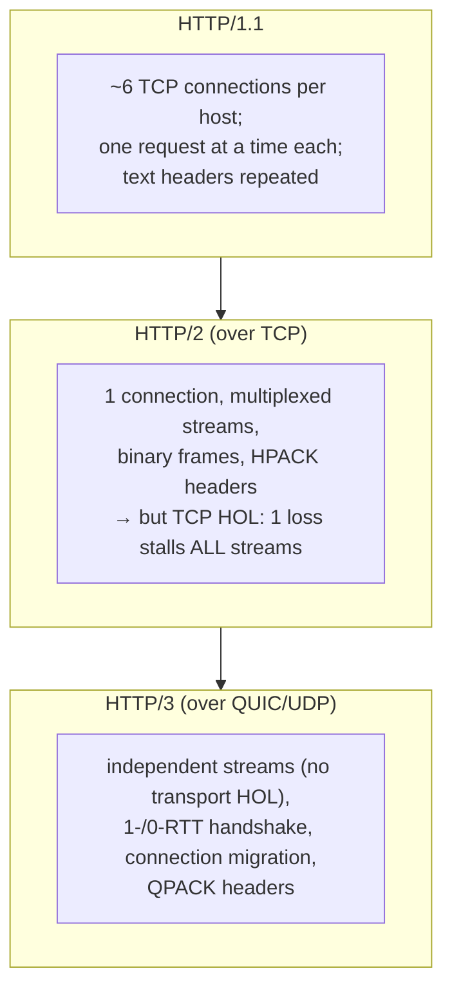
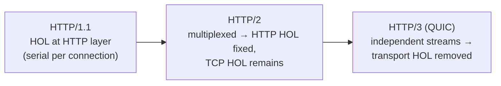

# Lesson 3.2.2 — HTTP/2 Multiplexing and HTTP/3 over QUIC

> Part 3: Networking Deep Dive · Module 3.2: Application Protocols · Difficulty: 🟡🔴
>
> **Prerequisites:** [3.2.1 HTTP/1.1], [3.1.3 TCP/HOL blocking], [3.1.5 QUIC].
> **Unlocks:** [3.2.6 gRPC], [3.3.3 CDN], [Part 17 Performance].

---

## 1. Learning Objectives

After this lesson you will be able to:

- Explain HTTP/2's core improvements over 1.1: **multiplexing, binary framing, header compression (HPACK), server push** — and the problem each solves.
- Explain why HTTP/2 still suffers **TCP head-of-line blocking** despite multiplexing (the layering trap, 3.1.1).
- Explain HTTP/3 = **HTTP over QUIC** (3.1.5), eliminating transport-level HOL blocking, with faster handshakes and connection migration.
- Reason about when each version matters and how the *semantics* (3.2.1) stay constant while *transport efficiency* evolves.

---

## 2. Motivation — Same semantics, faster delivery

HTTP/1.1 (3.2.1) carries unchanged *semantics* (methods, status, caching) but has two performance killers: **HTTP-level head-of-line blocking** (one request at a time per connection) and **connection overhead** (browsers open ~6 connections per host, verbose uncompressed headers). HTTP/2 and HTTP/3 are about **transport efficiency** — delivering the *same* HTTP semantics far faster.

This matters because page-load and API latency directly affect user experience and conversion (1.1.3 tail latency). HTTP/2's multiplexing and HTTP/3's QUIC-based transport are among the most impactful, low-effort latency wins available — usually enabled at the CDN/load balancer (3.3.3) with no application change. Understanding them explains *why* you enable HTTP/2/3 and what each actually fixes (and doesn't). This lesson builds directly on TCP HOL blocking (3.1.3) and QUIC (3.1.5).

---

## 3. Theory — From first principles

### 3.1 HTTP/2: the improvements

HTTP/2 keeps HTTP semantics (3.2.1) but rebuilds the wire format `[CS]`:

1. **Multiplexing over one connection** — the headline feature. Many **streams** (request/response pairs) share a *single* TCP connection, interleaved as **frames**. Requests no longer wait in line (HTTP-level HOL blocking gone); you don't need ~6 parallel connections. This solves HTTP/1.1's core problem.
2. **Binary framing** — messages are split into binary **frames** (vs 1.1's text), enabling efficient multiplexing and parsing.
3. **Header compression (HPACK)** — headers are compressed and a dynamic table avoids re-sending repeated headers (cookies, user-agent) on every request. HTTP/1.1 sent full text headers each time; HPACK slashes that overhead (significant for many small requests).
4. **Stream prioritization** — clients can hint relative priority (e.g., CSS before images).
5. **Server push** (deprecated in practice) — server could proactively send resources before the client asked. It proved hard to use well and is largely abandoned `[CONV]`.

The net: far fewer connections, less header overhead, and concurrent requests on one connection → big latency improvement over 1.1, especially for pages with many resources.

### 3.2 The catch: TCP head-of-line blocking remains

HTTP/2 multiplexes streams over **one TCP connection** — and there's the rub `[CS]`. TCP delivers a single in-order byte stream (3.1.3 §3.5). HTTP/2's many streams are interleaved into that *one* byte stream. So if **one TCP packet is lost**, TCP holds back *all* subsequent bytes — meaning **all** the multiplexed HTTP/2 streams stall until the lost packet is retransmitted, **even streams whose data already arrived**.

HTTP/2 solved HTTP-*level* HOL blocking but is helpless against TCP-*level* HOL blocking, because the blocking happens in a **lower layer it can't see or control** (3.1.1 §3.1 — the cost of layering). This is most painful on **lossy networks** (mobile/wireless): more loss → more frequent全-stream stalls. Ironically, on a lossy link, HTTP/1.1's *separate* connections can sometimes do better (a loss only stalls one connection, not all streams) — a real, measured tradeoff.

**This is exactly the problem QUIC was built to solve (3.1.5), and why HTTP/3 exists.**

### 3.3 HTTP/3 = HTTP over QUIC

**HTTP/3** runs HTTP semantics over **QUIC** (3.1.5) instead of TCP `[CS]`. Because QUIC implements **independent streams at the transport level**, a lost packet affecting one stream blocks *only that stream* — the others keep flowing. This **eliminates transport-level HOL blocking** — the thing HTTP/2 couldn't fix.

HTTP/3 also inherits QUIC's other benefits (3.1.5):
- **Faster handshakes** — 1-RTT (new) / 0-RTT (resumed), integrated TLS 1.3, vs TCP+TLS's 2–3 RTTs.
- **Connection migration** — survives Wi-Fi↔cellular changes.
- **Always encrypted.**

So the HTTP evolution against HOL blocking is now complete:
- **HTTP/1.1:** HOL blocking at the **HTTP layer** (one request per connection).
- **HTTP/2:** multiplexing fixes HTTP-layer HOL, but **TCP-layer HOL** remains.
- **HTTP/3:** QUIC's independent streams remove **transport-layer HOL** too.

HTTP/3 uses **QPACK** (HPACK adapted for QUIC's out-of-order streams) for header compression. Semantics (methods, status, caching — 3.2.1) remain identical across all three versions.

### 3.4 When each version matters (and the tradeoffs)

`[BP]`:
- **HTTP/2** is a near-universal win over 1.1 for browser traffic (fewer connections, header compression, multiplexing) — enable it. Still subject to TCP HOL blocking on lossy links.
- **HTTP/3** adds the most value on **lossy/high-latency/mobile** networks (no transport HOL, faster handshake) and for repeat connections (0-RTT). On clean wired/datacenter networks, gains over HTTP/2 are smaller (3.1.5 §3.6). It costs more CPU and needs UDP (with TCP fallback).
- **Internal datacenter RPC** often uses HTTP/2 (e.g., gRPC, 3.2.6) over reliable low-loss links where TCP HOL is rarely triggered — HTTP/3's benefit is smaller there.
- **You usually adopt both at the edge** (CDN/LB, 3.3.3): clients negotiate the best version they and the server support (HTTP/3 → fall back to HTTP/2 → 1.1), so you get wins where available and lose nothing where not.

The recurring theme (1.1.5): these are *transport-efficiency* tradeoffs; measure for your user base (mobile vs wired) and enable at the edge with fallback.

---

## 4. Visual Intuition

### HTTP/1.1 vs HTTP/2 vs HTTP/3

### HOL blocking across the versions

---

## 5. Real-World Analogy

**A checkout counter evolving.** **HTTP/1.1** is one cashier serving one customer fully before the next — so you open *six* checkout lanes (six connections) to get parallelism, and each customer repeats their whole membership info every time (uncompressed headers). **HTTP/2** is a clever single cashier who interleaves many customers' items on one belt (multiplexing) and remembers repeat info (header compression) — far more efficient. But there's one shared conveyor belt, so if one item jams the belt (a lost packet), *everyone's* items behind it wait, even ready ones (**TCP HOL blocking**) — and that single belt is the bottleneck on a bumpy floor (lossy network). **HTTP/3** gives each customer their own independent mini-belt that can't jam the others (QUIC independent streams), checks membership faster (combined, 0-RTT for returning customers), and even lets a customer keep their cart if they switch lanes (connection migration). Same store, same products (semantics) — just progressively smarter logistics.

---

## 6. Industry Example

- **HTTP/2 ubiquity** `[CONV]`: HTTP/2 is broadly deployed across the web and CDNs; gRPC (3.2.6) is built on HTTP/2 for its multiplexed streaming.
- **HTTP/3 adoption** `[CONV]`: major browsers and CDNs (Cloudflare, Google, Fastly) support HTTP/3, reporting latency improvements especially on **mobile/lossy** networks — driven by the no-transport-HOL and faster-handshake benefits (3.1.5).
- **Server push abandoned** `[CONV]`: HTTP/2 server push was largely deprecated/removed by browsers because it was hard to use beneficially and often wasted bandwidth — a cautionary tale that a feature that sounds good can fail in practice (preload hints replaced it).
- **Edge negotiation + fallback** `[CONV]`: clients negotiate HTTP/3 with fallback to HTTP/2/1.1 when QUIC/UDP is unavailable — standard robust deployment (3.1.5, 3.3.3).

---

## 7. Implementation Details — Adopting HTTP/2 and HTTP/3

- **Enable at the edge (CDN/LB/reverse proxy)** — usually no application changes; the edge speaks HTTP/2/3 to clients and may use HTTP/1.1 or HTTP/2 to origins. Clients auto-negotiate best supported version with fallback (3.3.3, 3.1.5).
- **HTTP/2:** reap multiplexing + HPACK with one connection — *stop* HTTP/1.1 sharding hacks (don't shard domains/concatenate as aggressively; HTTP/2 handles many resources on one connection).
- **HTTP/3:** biggest wins on mobile/lossy/high-latency users and repeat visits (0-RTT); enable with TCP fallback; budget CPU at scale; only send **idempotent** requests in 0-RTT (3.1.5 replay caveat, Part 11).
- **Measure per segment** (mobile vs wired, region) — HTTP/3's benefit is uneven (3.1.5 §3.6); don't assume universal speedups.
- **Internal RPC:** gRPC over HTTP/2 is standard (3.2.6); HTTP/3 internally is less common (low-loss datacenter links rarely trigger TCP HOL) but emerging.
- **Mind that semantics are unchanged** (3.2.1) — your API/caching/idempotency design carries across versions.

---

## 8. Advantages

- **HTTP/2:** multiplexing (no HTTP-level HOL, fewer connections), HPACK header compression, binary framing — big latency win over 1.1.
- **HTTP/3:** removes *transport-level* HOL blocking (independent QUIC streams), faster handshakes (1-/0-RTT), connection migration, always encrypted — especially strong on lossy/mobile networks.
- **Both:** same HTTP semantics (no app rewrite), enabled at the edge, automatic negotiation/fallback.

---

## 9. Disadvantages / Costs

- **HTTP/2:** still suffers **TCP HOL blocking** (one connection, one byte stream) — worse on lossy links; prioritization is tricky; server push failed.
- **HTTP/3:** higher CPU (user-space + encryption), needs UDP (blocked on some networks → TCP fallback), less mature tooling, gains uneven (3.1.5).
- **Operational:** more protocol versions to support/observe; QUIC's encryption complicates some debugging (Part 16).

---

## 10. When each matters

- **HTTP/2:** essentially always over HTTP/1.1 for client-facing web and gRPC.
- **HTTP/3:** prioritize for mobile/global/lossy user bases and latency-sensitive sites; lower priority for low-loss internal/wired traffic.
- **HTTP/1.1:** still fine for simple internal calls or where 2/3 aren't available; semantics identical.

---

## 11. Common Mistakes

1. **Keeping HTTP/1.1 sharding hacks under HTTP/2** (domain sharding, aggressive concatenation) — counterproductive; HTTP/2 multiplexes on one connection.
2. **Assuming HTTP/2 fixed all HOL blocking** — it didn't fix *TCP* HOL blocking (need HTTP/3).
3. **Expecting HTTP/3 to be universally faster** — gains are concentrated on lossy/mobile/repeat connections; measure (3.1.5).
4. **No TCP fallback for HTTP/3** — breaking users on UDP-blocking networks.
5. **0-RTT for non-idempotent requests** — replay risk (3.1.5, Part 11).
6. **Relying on server push** — deprecated; use preload hints instead.

---

## 12. Interview Questions

**🟢 Easy**
- What are HTTP/2's main improvements over HTTP/1.1?
- What transport does HTTP/3 use, and what does it primarily fix vs HTTP/2?

**🟡 Medium**
- Explain why HTTP/2 still suffers head-of-line blocking despite multiplexing. At which layer does the blocking occur, and why can't HTTP/2 fix it?
- Why should you drop HTTP/1.1 domain-sharding when moving to HTTP/2?

**🔴 Hard**
- Trace the HTTP evolution (1.1 → 2 → 3) through head-of-line blocking at different layers. What did each version fix, what did it leave, and why did the final fix require a new transport (QUIC) rather than a new HTTP version?
- For a mobile-heavy global app, justify enabling HTTP/3: expected benefits, what you'd measure, fallback handling, and the CPU/0-RTT tradeoffs.

**⚫ Staff+**
- Design the protocol strategy across a system: client-facing edge (HTTP/2 + HTTP/3 with fallback) and internal service-to-service (HTTP/2/gRPC). Justify each choice from network characteristics (loss, latency, datacenter vs internet) and the HOL-blocking analysis.
- HTTP/2 server push was a well-intentioned feature that failed in practice. Analyze why, and what it teaches about adding protocol features (tie to over-engineering, 1.1/2.4.2 patternitis).

---

## 13. Production Pitfalls

- **TCP HOL stalls on HTTP/2 over lossy mobile:** all multiplexed requests stalling on packet loss, degrading perceived performance — the case HTTP/3 addresses.
- **Counterproductive 1.1 optimizations under HTTP/2:** domain sharding forcing multiple connections (defeating multiplexing) and excessive bundling hurting caching.
- **HTTP/3 broken on UDP-restricted networks** without fallback → connection failures or fallback delays.
- **CPU spikes from broad HTTP/3** at scale (3.1.5) requiring capacity planning.
- **0-RTT replay vulnerability** if non-idempotent requests use early data (Part 11).

---

## 14. Optimization Techniques

- **Enable HTTP/2 and HTTP/3 at the edge with negotiation + fallback** (3.3.3) — wins where available, safe everywhere.
- **Remove HTTP/1.1-era hacks** (sharding, over-concatenation) under HTTP/2.
- **Use HTTP/3 0-RTT for idempotent repeat requests** to cut handshake latency safely.
- **Combine with CDN/edge** so handshakes are cheap and connections warm (3.1.3, 3.3.3).
- **Measure per network segment** (mobile vs wired) to target HTTP/3 where it helps and watch CPU (Part 17).
- **Keep caching/semantics (3.2.1) correct** — they carry across versions and remain the biggest offload lever (Part 6).

---

## 15. Summary

HTTP/2 and HTTP/3 keep HTTP's **semantics** (3.2.1) identical while dramatically improving **transport efficiency**. **HTTP/2** introduces **multiplexing** (many streams over one TCP connection — eliminating HTTP/1.1's HTTP-level head-of-line blocking and the need for ~6 parallel connections), **binary framing**, and **HPACK header compression** — a large win over 1.1. But because all streams share **one TCP byte stream**, HTTP/2 still suffers **TCP-level head-of-line blocking**: a single lost packet stalls *all* multiplexed streams, a lower-layer problem HTTP/2 can't fix (3.1.1 layering, 3.1.3) — worst on lossy/mobile networks. **HTTP/3** solves this by running over **QUIC** (3.1.5): independent transport-level streams mean a loss blocks only its stream, plus faster (1-/0-RTT) handshakes, connection migration, and built-in encryption. The HTTP evolution against HOL blocking is thus complete — **1.1 (HTTP-layer) → 2 (multiplexed, TCP HOL remains) → 3 (QUIC, no transport HOL)**. Practically: HTTP/2 is a near-universal win over 1.1; HTTP/3 adds most value on **lossy/mobile/high-latency** networks and repeat connections, at higher CPU cost and needing UDP (with TCP fallback). You enable both at the edge with automatic negotiation, drop 1.1-era hacks, restrict 0-RTT to idempotent requests, and measure per user segment — all while your API/caching/idempotency design (3.2.1) carries unchanged across versions.

---

## 16. Revision Notes (flashcard-ready)

- **Q:** HTTP/2's main improvements? **A:** Multiplexing (streams over one connection), binary framing, HPACK header compression, prioritization (server push deprecated).
- **Q:** What HOL blocking did HTTP/2 fix and not fix? **A:** Fixed HTTP-level HOL; did NOT fix TCP-level HOL (shared byte stream).
- **Q:** Why can't HTTP/2 fix TCP HOL blocking? **A:** It's in a lower layer (TCP) HTTP/2 can't see/control (layering).
- **Q:** HTTP/3 = ? **A:** HTTP over QUIC (UDP) — independent streams remove transport HOL; 1-/0-RTT handshake; connection migration.
- **Q:** HTTP evolution vs HOL blocking? **A:** 1.1 (HTTP-layer) → 2 (multiplexed, TCP HOL) → 3 (QUIC, no transport HOL).
- **Q:** Where does HTTP/3 help most? **A:** Lossy/mobile/high-latency networks + repeat connections (0-RTT).
- **Q:** HTTP/2 + sharding? **A:** Drop domain sharding under HTTP/2 — it defeats multiplexing.
- **Q:** Do semantics change across versions? **A:** No — methods/status/caching (3.2.1) are identical; only transport efficiency changes.
- **Q:** HTTP/3 costs? **A:** Higher CPU, needs UDP (TCP fallback), 0-RTT replay caution, uneven gains.

---

## 17. Further Reading + Knowledge-Graph Links

**Within this platform**
- **Previous:** [3.2.1 HTTP/1.1 Semantics]. **Builds on:** [3.1.3 TCP HOL blocking], [3.1.5 QUIC]. **Next:** [3.2.3 TLS/SSL].
- **Used by:** [3.2.6 gRPC] (HTTP/2), [3.3.3 CDN] (where HTTP/2-3 terminate), [Part 17 Performance] (latency optimization).
- **Connects to:** [3.2.1 caching/semantics] (unchanged across versions), [Part 6 Caching].

**Foundational texts (synthesized)**
- HTTP/2 and HTTP/3 specifications and design rationale (multiplexing, HPACK/QPACK, HOL blocking).
- Kurose & Ross, *Computer Networking* — HTTP evolution, persistent connections, multiplexing context.
- CDN/browser engineering writing on HTTP/2 and HTTP/3 performance (representative).

**Concept tags:** `[CS]` multiplexing, binary framing, HPACK/QPACK, TCP-vs-transport HOL blocking · `[CONV]` HTTP/3 CDN adoption, server-push deprecation, edge negotiation+fallback · `[BP]` enable at edge with fallback, drop 1.1 hacks, measure per segment.
