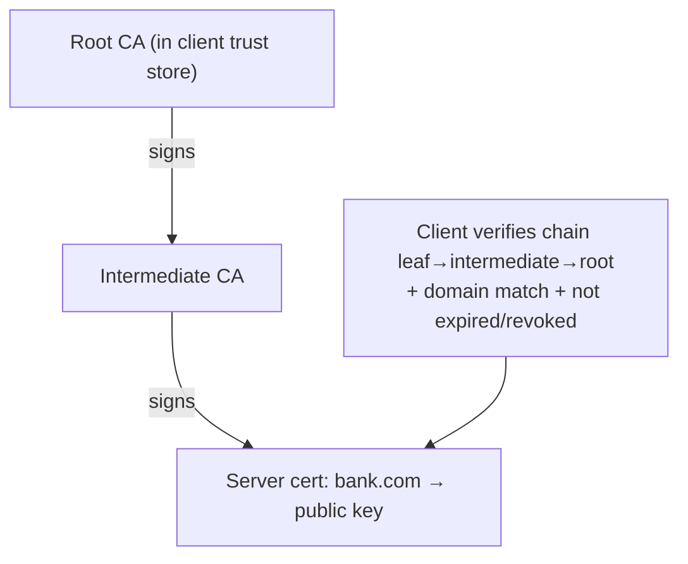
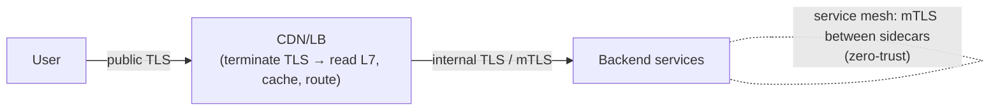

# Lesson 3.2.3 — TLS/SSL: Handshake, Certificates, mTLS, PKI

> Part 3: Networking Deep Dive · Module 3.2: Application Protocols · Difficulty: 🟡🔴
>
> **Prerequisites:** [3.1.3 TCP handshake], [3.2.1 HTTP].
> **Unlocks:** [3.2.4 DNS], [3.3.3 CDN/TLS termination], [Part 12 service mesh/mTLS], [Part 15 Security].

---

## 1. Learning Objectives

After this lesson you will be able to:

- Explain what **TLS** provides — **confidentiality, integrity, and authentication** (the CIA triad in transit, 1.2.3) — and where it sits in the stack (3.1.1).
- Walk through the **TLS handshake** at a conceptual level (key exchange, certificate verification) and its **latency cost** (RTTs) — and how TLS 1.3 / 0-RTT reduce it.
- Explain **certificates, Certificate Authorities (CAs), and PKI** — how trust is established (the chain of trust).
- Distinguish **TLS** (server auth) from **mTLS** (mutual auth) and where mTLS is used (service mesh, zero-trust — Part 12, 15).
- Reason about **TLS termination** (at the CDN/LB) and its architectural/security implications.

---

## 2. Motivation — Encryption is non-negotiable, and it shapes architecture

Virtually all traffic today is encrypted (HTTPS = HTTP over TLS). TLS isn't just "turn on encryption" — it has real **architectural consequences**:
- It adds **handshake RTTs** (3.1.3) before data → another reason connection reuse and TLS 1.3/0-RTT matter for latency (1.1.3).
- **Where you terminate TLS** (CDN, load balancer, or the service itself) is a design decision affecting performance, security, and what L7 devices can see (3.1.1 — encrypted payloads are opaque to L4 devices).
- **mTLS** underpins zero-trust and service meshes (Part 12, 15) — services authenticating *each other*.
- **Certificate/PKI management** is operational reality (expiry causes outages; rotation is a real concern).

TLS is also the practical embodiment of the **CIA triad in transit** (1.2.3): confidentiality (encryption), integrity (tamper detection), authentication (you're really talking to the right server). This lesson gives the architect's working model — enough to make termination, mTLS, and certificate decisions — without cryptographic depth (Part 15 covers crypto fundamentals). It builds on the TCP handshake (3.1.3).

---

## 3. Theory — From first principles

### 3.1 What TLS provides

**TLS (Transport Layer Security**, the successor to SSL — "SSL" is now a colloquialism; modern is TLS 1.2/1.3) sits between L4 and L7 (3.1.1) and gives the application three guarantees `[CS]`:

1. **Confidentiality** — traffic is encrypted; eavesdroppers see ciphertext, not content.
2. **Integrity** — tampering is detected (message authentication codes); data can't be silently altered in transit.
3. **Authentication** — the client verifies the **server's identity** via its certificate (you're really talking to `bank.com`, not an impostor). Optionally (**mTLS**, §3.4), the server also verifies the *client*.

These map exactly to the **CIA triad** (1.2.3). Without authentication, encryption alone is useless (you might be encrypting to an attacker) — which is why certificates/PKI (§3.3) are central.

### 3.2 The handshake (and its latency cost)

Before encrypted application data flows, client and server perform a **TLS handshake** that (conceptually) `[CS]`:
1. **Negotiates** the TLS version and cipher suite (which algorithms to use).
2. **Authenticates the server** — the server presents its **certificate**; the client verifies it (§3.3).
3. **Establishes a shared session key** via **asymmetric→symmetric** key exchange: they use public-key cryptography (or Diffie-Hellman) to agree on a **symmetric session key** without ever sending it in the clear. Subsequent data uses fast **symmetric** encryption with that key. (Asymmetric is slow but solves key distribution; symmetric is fast — best of both.)

**Latency cost (the architectural part):**
- **TLS 1.2:** ~**2 RTTs** for the handshake — *on top of* the TCP handshake (3.1.3) → ~3 RTTs total before data.
- **TLS 1.3:** streamlined to **1 RTT** (and **0-RTT** for resumed sessions — the client sends data immediately using a pre-shared key from a prior session).
- Recall (1.1.3): each RTT to a distant server is ~100 ms, so these RTTs are *expensive*. This reinforces the 3.1.3 lessons: **reuse connections** (amortize the handshake), **use TLS 1.3**, **terminate TLS near users** (CDN/edge, §3.5, 3.3.3), and prefer **QUIC/HTTP-3** which integrates TLS 1.3 into the transport handshake (3.1.5).

**0-RTT caveat (security):** 0-RTT early data can be **replayed** by an attacker, so it must be limited to **idempotent** requests (3.1.5, 3.2.1, Part 11). Don't put a non-idempotent POST in 0-RTT.

### 3.3 Certificates, CAs, and PKI (the chain of trust)

How does a client *know* a server's certificate is legitimate (and not an impostor's)? Via **Public Key Infrastructure (PKI)** and the **chain of trust** `[CS]`:

- A **certificate** binds an identity (e.g., `bank.com`) to a **public key**, and is **digitally signed** by a **Certificate Authority (CA)**.
- **CAs** are trusted third parties. Operating systems/browsers ship with a set of trusted **root CA** certificates (the **trust store**).
- **Chain of trust:** a server's certificate is signed by an intermediate CA, signed by a root CA that's in the client's trust store. The client verifies the chain up to a trusted root. If the chain is valid and the certificate matches the domain and isn't expired/revoked, trust is established.
- **Revocation:** compromised certificates are revoked (CRL / OCSP) so clients reject them.
- **Let's Encrypt / ACME** `[CONV]` automated free certificate issuance/renewal, making HTTPS ubiquitous (and automated renewal critical — see §13 expiry outages).

The whole system is **trust delegation**: you don't trust `bank.com` directly; you trust a CA, and the CA vouches for `bank.com`. (This is also a single point of trust risk — a compromised/misbehaving CA can issue fraudulent certificates; mitigations like Certificate Transparency exist — Part 15.)

### 3.4 TLS vs mTLS (mutual TLS)

- **Standard TLS:** only the **server** is authenticated (the client verifies the server's cert). The client is *not* authenticated at the TLS layer (it authenticates separately via passwords/tokens at L7). This is normal web HTTPS.
- **mTLS (mutual TLS):** **both** sides present and verify certificates — the server also verifies the **client's** identity via a client certificate `[CS]`. Neither party trusts the other without cryptographic proof of identity.

**Where mTLS is used** `[CONV]`:
- **Service-to-service auth in microservices / service mesh** (Part 12): each service has a certificate; sidecars (Istio/Linkerd) enforce mTLS so only authenticated services communicate — the foundation of **zero-trust** networking (don't trust based on network location, Part 15).
- **High-security APIs / B2B** where strong client identity is required.

mTLS provides strong, cryptographic mutual identity but adds **certificate management complexity** (every service needs a cert, rotated regularly) — which is why service meshes automate it (issuing/rotating short-lived certs). This is a key Part 12/15 building block.

### 3.5 TLS termination (the architectural decision)

**Where does TLS get decrypted?** A real design choice `[CS]`:

- **TLS termination at the edge (CDN / load balancer):** the CDN/LB decrypts TLS, then talks to backend servers over plain HTTP or re-encrypted internal TLS. 
  - *Pros:* the LB can now read L7 content for **content-based routing** (3.1.1 §3.5 — needs to see URLs/headers), caching, and WAF; offloads expensive TLS crypto from backend servers; users complete the handshake with a *nearby* edge (lower latency, 3.3.3).
  - *Cons:* traffic between the LB and backends may be unencrypted (a security consideration — often re-encrypted internally, "TLS bridging").
- **End-to-end TLS (pass-through):** TLS terminates at the actual service; intermediaries can't read the content (L4 forwarding only). More secure (no plaintext anywhere), but the LB can't do L7 routing/caching, and each service bears the crypto cost.
- **mTLS everywhere internally** (service mesh): even internal hops are mutually authenticated and encrypted — zero-trust (Part 12, 15).

A common production pattern: **terminate public TLS at the CDN/edge** (for L7 routing, caching, crypto offload, and low-latency handshakes near users) and **re-encrypt internally** (or use mTLS via a service mesh) so traffic is never plaintext on the wire — balancing performance and security. This decision directly interacts with the L4-vs-L7 load-balancer choice (3.1.1, 3.3).

---

## 4. Visual Intuition

### TLS handshake (conceptual) and the cost

```mermaid
sequenceDiagram
    participant C as Client
    participant S as Server
    Note over C,S: (after TCP handshake — 3.1.3)
    C->>S: ClientHello (versions, ciphers)
    S->>C: ServerHello + Certificate (signed by CA)
    Note over C: verify cert chain to a trusted root (PKI)
    C->>S: key exchange → shared symmetric session key
    Note over C,S: TLS 1.2 ≈ 2 RTTs; TLS 1.3 ≈ 1 RTT; 0-RTT for resumption
    C->>S: encrypted application data (symmetric)
```

### Chain of trust (PKI)



### TLS termination patterns



---

## 5. Real-World Analogy

**Sealed diplomatic correspondence with verified identities.** TLS is like exchanging messages in a **tamper-evident, coded pouch** (confidentiality + integrity — you can't read it or alter it undetected). But coding alone is useless if you're handing the pouch to an impostor — so first you **verify identity**: the server shows a **passport** (certificate) issued by a **passport authority** (CA) that everyone trusts (your country recognizes that authority — the trust store). You check the passport is genuine, issued by a recognized authority, matches the person, and isn't expired (the chain of trust / PKI). In standard TLS, only *you* check *their* passport (server auth); in **mTLS**, both parties show passports (mutual auth — used between embassies that must each prove identity, like internal services in zero-trust). The **handshake** is the upfront ritual of verifying passports and agreeing on the code — it takes time (RTTs), which is why you don't redo it for every message (connection reuse). And **TLS termination** is deciding whether the coded pouch is opened at the **border post** (the CDN/edge, which can then read and route it) or only by the **final recipient** (end-to-end) — a security-vs-functionality tradeoff.

---

## 6. Industry Example

- **HTTPS everywhere + Let's Encrypt** `[CONV]`: free, automated certificates (ACME) made TLS universal; automated renewal is now standard (manual renewal → expiry outages, §13).
- **TLS termination at CDNs/LBs** `[CONV]`: CDNs and L7 load balancers terminate TLS at the edge to enable content routing, caching, WAF, and crypto offload, then re-encrypt to origins — the §3.5 pattern, near-universal (3.3.3, Part 18).
- **mTLS in service meshes** `[CONV]`: Istio/Linkerd (Part 12) automatically issue and rotate short-lived certs and enforce mTLS between service sidecars — operationalizing zero-trust (Part 15) without developers managing certs.
- **TLS 1.3 + QUIC** `[CONV]`: TLS 1.3's 1-RTT/0-RTT handshake and its integration into QUIC (3.1.5) are major latency improvements adopted across the web.
- **Certificate Transparency** `[CONV]`: public logs of issued certificates to detect misissuance — mitigating the "compromised CA" risk (Part 15).

---

## 7. Implementation Details — TLS in architecture

- **Use TLS 1.3** for faster handshakes (1-RTT, 0-RTT) and modern ciphers; deprecate old SSL/TLS versions (security, Part 15).
- **Reuse connections** (keep-alive, HTTP/2-3) to amortize the handshake (3.1.3) — TLS makes connection reuse *even more* valuable (extra RTTs saved).
- **Terminate public TLS at the edge** (CDN/LB) for L7 routing/caching/crypto-offload and near-user handshakes; **re-encrypt internally** (or mTLS) so nothing is plaintext on the wire (§3.5).
- **Automate certificate issuance/renewal** (ACME/Let's Encrypt, cloud cert managers) — never rely on manual renewal (expiry = outage, §13).
- **Use mTLS for service-to-service** in zero-trust/microservices — ideally via a **service mesh** that automates cert issuance/rotation (Part 12, 15).
- **Restrict 0-RTT to idempotent requests** (replay risk, §3.2; Part 11).
- **Offload TLS crypto** where CPU-bound (edge/hardware) — TLS has real CPU cost at scale (Part 17).
- **Monitor cert expiry** and handshake metrics (Part 16) — expiring certs are a top avoidable outage cause.

---

## 8. Advantages

- **Confidentiality, integrity, authentication** — the CIA triad in transit (1.2.3); table-stakes security.
- **Server authentication via PKI** — clients verify they're talking to the real server (anti-impersonation).
- **mTLS** — strong mutual identity for zero-trust service-to-service (Part 12, 15).
- **Mature & ubiquitous** — universal support, automated certs (Let's Encrypt), hardware offload.
- **TLS 1.3/0-RTT** — low handshake latency; integrated into QUIC.

---

## 9. Disadvantages / Costs

- **Handshake latency** — extra RTTs before data (mitigated by 1.3/0-RTT, reuse, edge termination).
- **CPU cost** — encryption/decryption overhead (significant at scale; offload helps).
- **Certificate management complexity** — issuance, renewal, rotation, revocation; expiry causes outages; mTLS multiplies this (mesh automates it).
- **PKI trust risks** — a compromised/misbehaving CA can issue fraudulent certs (mitigated by Certificate Transparency, pinning).
- **0-RTT replay risk** — needs idempotent-only restriction.
- **Termination tradeoffs** — edge termination exposes a plaintext segment unless re-encrypted.

---

## 10. When the decisions matter

- **Always use TLS** for any traffic over untrusted networks (i.e., almost everything) — non-negotiable (Part 15).
- **mTLS:** for internal service-to-service in zero-trust/microservices; overkill for simple internal trusted-network setups (but increasingly default with meshes).
- **Termination choice:** matters when you need L7 routing/caching (terminate at edge) vs maximal end-to-end secrecy (pass-through) — a security/functionality tradeoff.
- **0-RTT:** only where the latency win justifies the replay-safety care (idempotent paths).

---

## 11. Common Mistakes

1. **Certificate expiry outages** — forgetting to renew; the single most common avoidable TLS outage (automate renewal!).
2. **0-RTT for non-idempotent requests** — replay vulnerability (3.1.5, Part 11).
3. **Plaintext internal hops** after edge TLS termination — assuming "internal = safe" (violates zero-trust); re-encrypt or mTLS.
4. **Using outdated TLS/SSL versions or weak ciphers** — security holes (Part 15).
5. **Re-handshaking per request** (no connection reuse) — paying TLS RTTs + CPU repeatedly.
6. **Ignoring mTLS cert rotation** — long-lived service certs that, if leaked, grant long-lived access (use short-lived, rotated certs via a mesh).
7. **Not monitoring cert expiry/handshake errors** — silent until the outage.

---

## 12. Interview Questions

**🟢 Easy**
- What three guarantees does TLS provide, and how do they map to the CIA triad?
- What's the difference between TLS and mTLS?

**🟡 Medium**
- Walk through the TLS handshake conceptually and its latency cost. How does TLS 1.3 (and 0-RTT) reduce it?
- Explain how PKI/certificates establish trust. What's the chain of trust and the role of a CA?

**🔴 Hard**
- Design TLS for a global web app: where do you terminate TLS, how do you secure internal traffic, how do you minimize handshake latency, and how do you manage certificates at scale?
- Explain mTLS in a service mesh: how do services authenticate each other, how are certs issued/rotated, and how does this implement zero-trust (Part 15)?

**⚫ Staff+**
- Your service has high TLS handshake latency for global users and high TLS CPU cost. Design a strategy: TLS 1.3/0-RTT, edge termination + internal re-encryption/mTLS, connection reuse, QUIC, and crypto offload — with the security tradeoffs of each (idempotent 0-RTT, plaintext-segment risk).
- Discuss PKI's trust model and its weaknesses (CA compromise/misissuance). How do Certificate Transparency, short-lived certs, and pinning mitigate them, and what are the operational costs?

---

## 13. Production Pitfalls

- **Expired certificate outage:** a forgotten renewal taking down a service (or breaking internal mTLS) — extremely common and fully avoidable with automation + expiry monitoring (Part 16).
- **0-RTT replay attack:** non-idempotent early-data requests replayed → duplicate side effects (Part 11).
- **Plaintext internal exposure:** edge TLS termination with unencrypted backend traffic on a network later found to be reachable by attackers (Part 15) — fix with internal TLS/mTLS.
- **TLS CPU saturation:** handshake-heavy workloads (no connection reuse) burning CPU on crypto at scale → use reuse, session resumption, offload (Part 17).
- **CA-related breach:** a misissued certificate enabling impersonation; detected via Certificate Transparency monitoring.
- **mTLS cert sprawl:** unrotated, long-lived service certs becoming a security liability — use short-lived automated certs (mesh).

---

## 14. Optimization Techniques

- **TLS 1.3 + session resumption + 0-RTT (idempotent)** to minimize handshake RTTs.
- **Connection reuse (keep-alive, HTTP/2-3, QUIC)** to amortize handshake + CPU (3.1.3, 3.1.5).
- **Edge TLS termination** (CDN/LB) for near-user handshakes + crypto offload, with **internal re-encryption/mTLS** for security (§3.5, 3.3.3).
- **Automate certificates** (ACME/cloud cert managers) and **monitor expiry** — eliminate the #1 avoidable outage.
- **Use a service mesh for mTLS** — automated issuance/rotation of short-lived certs (Part 12, 15).
- **Hardware/edge crypto offload** for TLS-CPU-bound workloads (Part 17).

---

## 15. Summary

**TLS** secures traffic in transit with the **CIA triad** (1.2.3): **confidentiality** (encryption), **integrity** (tamper detection), and **authentication** (verifying the server's identity — optionally the client's too). It sits between L4 and L7 (3.1.1), so an **encrypted payload is opaque to L4 devices** — which makes **where you terminate TLS** an architectural decision. The **handshake** negotiates ciphers, **authenticates the server via its certificate**, and establishes a fast **symmetric session key** through asymmetric key exchange — costing RTTs (TLS 1.2 ≈ 2, **TLS 1.3 ≈ 1, 0-RTT** for resumption), which reinforces the need to **reuse connections, use TLS 1.3, terminate near users (edge), and prefer QUIC** (which integrates TLS 1.3). Trust comes from **PKI**: certificates bind identity to a public key and are signed by **CAs** in a **chain of trust** up to a root in the client's trust store (automated by Let's Encrypt/ACME). **mTLS** authenticates *both* sides and is the foundation of **zero-trust service-to-service** communication in microservices/service meshes (Part 12, 15), with cert issuance/rotation automated by the mesh. The common production pattern **terminates public TLS at the CDN/edge** (for L7 routing, caching, crypto offload, near-user handshakes) and **re-encrypts internally / uses mTLS** so nothing is plaintext — balancing performance and security. The architect's job: always use TLS (1.3), reuse connections, automate and monitor certificates (expiry is the #1 avoidable outage), restrict 0-RTT to idempotent requests, and use mTLS via a mesh for internal zero-trust.

---

## 16. Revision Notes (flashcard-ready)

- **Q:** Three guarantees of TLS? **A:** Confidentiality, integrity, authentication (CIA triad in transit).
- **Q:** Where does TLS sit, and why does that matter? **A:** Between L4 and L7; L4 devices can't read the encrypted payload → termination is a design decision.
- **Q:** Handshake key idea? **A:** Authenticate server (cert), then asymmetric key exchange → fast symmetric session key.
- **Q:** Handshake RTT cost? **A:** TLS 1.2 ≈ 2 RTTs, TLS 1.3 ≈ 1, 0-RTT for resumption (on top of TCP) — reuse connections!
- **Q:** PKI / chain of trust? **A:** Cert binds identity→public key, signed by a CA; client verifies the chain to a trusted root.
- **Q:** TLS vs mTLS? **A:** TLS authenticates the server only; mTLS authenticates both sides (client cert too).
- **Q:** Where is mTLS used? **A:** Service-to-service in microservices/service mesh — zero-trust (Part 12, 15).
- **Q:** TLS termination tradeoff? **A:** Edge termination enables L7 routing/caching/offload but needs internal re-encryption to avoid plaintext hops.
- **Q:** #1 avoidable TLS outage? **A:** Certificate expiry — automate renewal + monitor.
- **Q:** 0-RTT caveat? **A:** Replay risk → idempotent requests only.

---

## 17. Further Reading + Knowledge-Graph Links

**Within this platform**
- **Previous:** [3.2.2 HTTP/2-3]. **Builds on:** [3.1.3 TCP handshake], [3.1.5 QUIC] (integrated TLS 1.3). **Next:** [3.2.4 DNS].
- **Used by:** [3.3.3 CDN] (edge TLS termination), [Part 12 service mesh/mTLS], [Part 15 Security] (crypto, zero-trust, secrets), [Part 17 Performance] (crypto offload).
- **Connects to:** [3.2.1 idempotency] (0-RTT), [1.2.3 CIA triad/security].

**Foundational texts (synthesized)**
- Kurose & Ross, *Computer Networking* — TLS/SSL, handshake, certificates, network security chapter.
- TLS 1.3 specification and PKI literature (chain of trust, CAs, revocation).
- Service-mesh documentation (Istio/Linkerd) for mTLS automation (Part 12).

**Concept tags:** `[CS]` CIA-in-transit, handshake (asymmetric→symmetric), PKI/chain of trust, mTLS · `[CONV]` Let's Encrypt/ACME, edge TLS termination, service-mesh mTLS, Certificate Transparency · `[BP]` TLS 1.3, reuse connections, automate+monitor certs, mTLS via mesh, idempotent-only 0-RTT.
