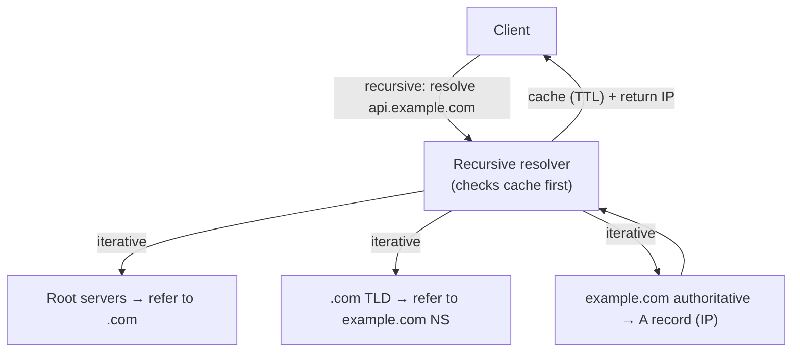
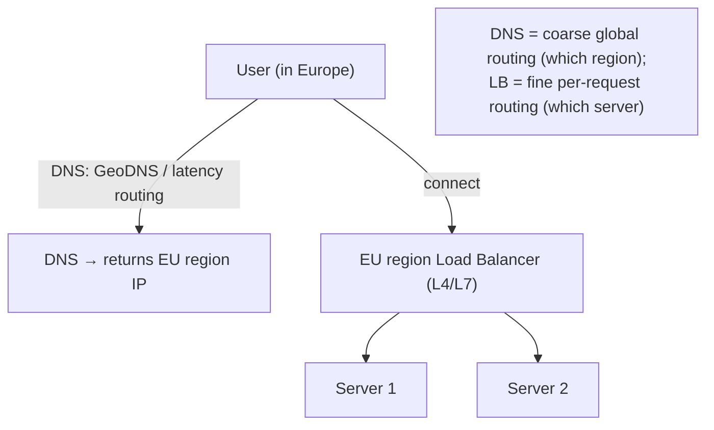

# Lesson 3.2.4 — DNS: Resolution, Records, TTLs, GeoDNS, and DNS as a Load-Balancing Tool

> Part 3: Networking Deep Dive · Module 3.2: Application Protocols · Difficulty: 🟡
>
> **Prerequisites:** [3.1.2 IP], [3.1.4 UDP], [3.2.1 HTTP].
> **Unlocks:** [3.3.1 Load Balancing], [3.3.3 CDN/anycast], [Part 11 failover], [Part 13 multi-region].

---

## 1. Learning Objectives

After this lesson you will be able to:

- Explain **DNS** as the distributed system that maps human names to IP addresses, and walk through the **resolution** process (recursive + iterative).
- Identify the key **record types** (A/AAAA, CNAME, MX, NS, TXT) and the role of **TTL** in caching.
- Explain how **DNS is used as a load-balancing and failover tool** (round-robin, GeoDNS, latency-based, weighted) — the *first* layer of traffic management.
- Reason about DNS's **caching/TTL tradeoffs** (fast failover vs cache efficiency) and why DNS changes propagate slowly.

---

## 2. Motivation — The internet's phone book (and first traffic director)

Every connection starts with a name → IP lookup. **DNS** (Domain Name System) is the globally-distributed, hierarchical, cached database that performs it. It matters to architects far beyond "names resolve to IPs":
- DNS is the **first layer of load balancing and failover** (3.3.1) — before any request reaches your load balancer, DNS decides *which IP* (which region/data center) the client even connects to. **GeoDNS / latency-based routing** sends users to the nearest region (3.3.3, Part 13) — a key global-architecture tool.
- **TTLs** control caching and create a fundamental tradeoff: low TTL = fast failover but more DNS load; high TTL = efficient but slow to change (a real incident factor).
- DNS is itself a beautiful **distributed, hierarchical, cached system** (a mini case study for Parts 7–10): it scales to the whole internet via delegation and caching.

Understanding DNS lets you design global routing, failover, and multi-region architectures (Part 13) — and avoid classic DNS-propagation and TTL pitfalls. It's the entry point to traffic management (Module 3.3).

---

## 3. Theory — From first principles

### 3.1 What DNS does and why it's distributed

DNS maps **domain names** (`api.example.com`) to **IP addresses** (and other records) `[CS]`. It must serve the *entire internet* with low latency and high availability — no single server could. So DNS is:
- **Hierarchical** — the namespace is a tree: root (`.`) → top-level domains (`.com`, `.org`) → domains (`example.com`) → subdomains (`api.example.com`). Authority is **delegated** down the tree.
- **Distributed** — different servers are *authoritative* for different parts of the tree (you run the authoritative servers for *your* domain, or your DNS provider does).
- **Heavily cached** — results are cached at every level (browser, OS, resolver) with a **TTL**, so most lookups never reach authoritative servers. Caching is what makes DNS scale.

This hierarchy + delegation + caching is *why* DNS scales to the whole internet — a textbook distributed-systems design (partitioning by namespace, caching for read scale — Parts 6, 7).

### 3.2 The resolution process

When a client needs `api.example.com` `[CS]`:

1. **Check caches** — browser cache → OS cache → configured **recursive resolver** (often your ISP's or a public one like 8.8.8.8). If cached and within TTL, return immediately (most lookups stop here).
2. If not cached, the **recursive resolver** does the work, querying **iteratively**:
   - Ask a **root** server → it refers to the **TLD** (`.com`) servers.
   - Ask the **`.com` TLD** servers → they refer to `example.com`'s **authoritative name servers** (NS records).
   - Ask `example.com`'s **authoritative servers** → they return the **A record** (the IP).
3. The resolver **caches** the answer (per TTL) and returns it to the client.
4. The client connects to the IP (now TCP/TLS/HTTP proceed — 3.1.3, 3.2.3, 3.2.1).

**Recursive vs iterative:** the *client*→resolver query is **recursive** ("give me the final answer"); the resolver→servers queries are **iterative** ("refer me to who knows next"). DNS mostly uses **UDP** (3.1.4) — small, fast queries, retry on loss — falling back to TCP for large responses (e.g., DNSSEC, zone transfers).

**Latency note (1.1.3):** a *cold* lookup (multiple round trips: root → TLD → authoritative) adds latency before the connection even starts — another reason caching (and keeping TTLs sensible) matters. This is also why DNS resolution time shows up in page-load waterfalls.

### 3.3 Record types (the ones that matter)

| Record | Purpose |
|---|---|
| **A** | name → IPv4 address |
| **AAAA** | name → IPv6 address |
| **CNAME** | alias → another name (e.g., `www` → `example.com`); used heavily for CDNs |
| **NS** | delegates a zone to authoritative name servers |
| **MX** | mail servers for the domain |
| **TXT** | arbitrary text (SPF/DKIM for email auth, domain verification) |
| **SOA** | zone metadata (authority, refresh) |
| **PTR** | reverse DNS (IP → name) |

**CNAME** is especially relevant: pointing your domain at a **CDN** (3.3.3) is typically done via CNAME (`www.you.com` → `you.cdn-provider.net`), letting the CDN control the actual IPs (and route via anycast).

### 3.4 TTL and the caching tradeoff

Every DNS record has a **TTL (Time To Live)** — how long resolvers may cache it `[CS]`. This creates a core tradeoff (1.1.5):

- **Low TTL** (e.g., 30–60s): changes propagate **fast** (good for quick failover/migration), but more queries hit authoritative servers (more load, slightly more latency on misses).
- **High TTL** (e.g., hours/days): efficient (fewer queries, more cache hits), but changes propagate **slowly** — a record change can take up to the TTL (plus stragglers) to take effect everywhere.

**Critical implication — DNS changes are slow:** because of caching across countless resolvers (some of which ignore TTLs), a DNS change isn't instantaneous — old cached values linger. This is why **DNS-based failover is relatively slow** (bounded by TTL) and why you **lower TTLs *before* a planned migration/failover** so the change propagates quickly when you make it. Surprise: you can't speed up propagation *after* the fact — the old high-TTL value is already cached.

### 3.5 DNS as a load-balancing and failover tool

DNS is the **first/coarsest layer of traffic management** — before the request reaches your load balancer (3.3.1), DNS decides which IP the client gets `[CS]`. Techniques:

- **Round-robin DNS:** return multiple A records (multiple IPs); clients/resolvers rotate among them — crude load distribution. *Limitations:* no health awareness (can hand out a dead server's IP), uneven (caching skews distribution), no real balancing logic.
- **GeoDNS (geo-routing):** return different IPs based on the *client's location* → send users to the nearest region/data center (lower latency, 1.1.3). Foundational for **multi-region** architectures (Part 13).
- **Latency-based routing:** return the IP of the region with lowest measured latency to the client.
- **Weighted routing:** distribute by configured weights (e.g., canary: 5% to new region) — useful for gradual rollouts (Part 13).
- **Health-checked failover:** managed DNS (Route 53, etc.) health-checks endpoints and **removes unhealthy IPs**, routing around failures (DNS failover — but bounded by TTL, §3.4).
- **Anycast** (3.3.3): the *same* IP is advertised from many locations via BGP routing (3.1.2); the network routes the client to the nearest instance. CDNs use anycast — it's IP-layer geo-routing complementing GeoDNS.

**Key limitation:** DNS load balancing is **coarse and slow to react** (TTL caching, no per-request control, limited health awareness). So it's used for **global/regional** routing (which data center?), while a **load balancer** (3.3.1) handles **fine-grained, per-request, health-aware** distribution *within* a region. They work together: DNS picks the region; the LB picks the server.

---

## 4. Visual Intuition

### Resolution (recursive + iterative)

### DNS picks the region; the LB picks the server

---

## 5. Real-World Analogy

**A global directory-assistance service with regional branches.** You want to reach "Example Corp" but only know the name, not the number (IP). You call **directory assistance** (the recursive resolver). If they recently looked it up, they answer instantly (cache hit). Otherwise they work up the chain: ask the **national registry** (root) "who handles .com businesses?", which points to the **commercial directory** (TLD), which points to **Example Corp's own receptionist** (authoritative server), who gives the actual number. They then **remember the number for a while** (TTL) so they don't redo this every call. **GeoDNS** is directory assistance giving you the number of the **nearest branch** (your city's office) rather than headquarters across the world — faster to reach. And the **TTL tradeoff** is familiar: if Example Corp changes its number, everyone who memorized the old one keeps dialing it until their memory expires — so before changing the number, the company tells directory services "only remember this for a minute" (lower the TTL ahead of time) so the new number spreads quickly.

---

## 6. Industry Example

- **Managed DNS for global routing/failover** `[CONV]`: AWS Route 53, Cloudflare DNS, Google Cloud DNS offer GeoDNS, latency-based, weighted, and health-checked failover routing — the backbone of multi-region architectures (Part 13) and the §3.5 techniques.
- **CDNs via CNAME + anycast** `[CONV]`: sites point to CDNs (Cloudflare, etc.; 3.3.3, Part 18) via CNAME, and CDNs use **anycast** to route users to the nearest edge POP at the IP layer — DNS + anycast working together for global low latency.
- **DNS outages = internet outages** `[CONV]`: major incidents (e.g., large DNS provider DDoS attacks) have taken down big swaths of popular sites — illustrating DNS as a critical dependency and single point of failure if not redundant (use multiple DNS providers for resilience — Part 11).
- **TTL lowering before migrations** `[BP]`: standard operational practice — lower TTLs hours/days before a planned IP change or failover so the change propagates quickly.

### 7. Implementation Details — Using DNS in architecture

- **Use managed DNS** with health checks for **regional routing + failover** (GeoDNS/latency/weighted) — the first traffic layer (Part 13).
- **Pair DNS with a load balancer:** DNS routes to the *region*; the LB (3.3.1) does fine-grained, health-aware, per-request balancing *within* the region. Don't rely on round-robin DNS alone for real load balancing (no health awareness).
- **Manage TTLs deliberately** (§3.4): keep moderate TTLs normally; **lower TTLs ahead of planned changes/failover** so propagation is fast; remember you can't speed up propagation *after* the change.
- **Use CNAME to point at CDNs** (3.3.3) so the CDN controls IPs/anycast routing.
- **Make DNS itself resilient** — DNS is a critical dependency; use **redundant/multiple DNS providers** to avoid a single DNS provider outage taking you down (Part 11).
- **Account for cold-lookup latency** (1.1.3) — DNS resolution adds time before connecting; caching and reasonable TTLs help; some clients pre-resolve/prefetch DNS.
- **Consider DNSSEC / DNS-over-HTTPS** for integrity/privacy where needed (Part 15).

---

## 8. Advantages (of DNS / DNS routing)

- **Human-friendly names** decoupled from IPs (IPs can change without changing the name).
- **Massive scalability** via hierarchy + delegation + caching (a distributed-systems exemplar).
- **First-layer global routing/failover** — GeoDNS/latency/weighted routing + health-checked failover (Part 13).
- **Decouples clients from infrastructure** — change servers/regions behind the name.
- **CDN integration** via CNAME + anycast for global low latency (3.3.3).

---

## 9. Disadvantages / Limits

- **Slow to change (TTL caching)** — propagation bounded by TTL (and resolvers that ignore TTLs); **DNS failover is slow** (seconds-to-minutes+), not instant.
- **Coarse load balancing** — no per-request control, limited/no health awareness (round-robin), uneven due to caching → needs a real LB for fine-grained balancing.
- **Critical single dependency** — DNS outage = unreachable services (mitigate with redundant providers).
- **Cold-lookup latency** — adds RTTs before connecting (mitigated by caching).
- **Security concerns** — DNS spoofing/cache poisoning, DDoS targets (DNSSEC/DoH/anycast mitigate — Part 15).

---

## 10. When DNS routing is (and isn't) the right tool

- **Right for:** global/regional routing (which data center/region), planned migrations, and coarse failover between regions — the *macro* traffic decision (Part 13).
- **Not right for:** fine-grained, per-request, health-aware load balancing within a region (use an L4/L7 LB, 3.3.1) or fast (sub-second) failover (DNS is too slow — use LB/health-check-driven failover at lower layers).
- DNS and LBs are **complementary layers**, not alternatives.

---

## 11. Common Mistakes

1. **Expecting DNS changes to be instant** — forgetting TTL caching; not lowering TTL *before* a migration/failover.
2. **Relying on round-robin DNS for load balancing** — no health awareness (hands out dead IPs), uneven distribution; use a real LB.
3. **Single DNS provider** — a DNS provider outage takes you fully offline (use redundant providers — Part 11).
4. **Too-low TTLs everywhere** — excessive query load and latency; balance with failover needs.
5. **Using DNS failover for fast recovery** — it's too slow (TTL-bound); use lower-layer health-check failover for sub-second.
6. **Ignoring DNS in latency budgets** — cold lookups add RTTs (1.1.3).
7. **No DNSSEC/DoH where integrity/privacy matters** — vulnerable to spoofing (Part 15).

---

## 12. Interview Questions

**🟢 Easy**
- What does DNS do, and why is it hierarchical and cached?
- What is a TTL in DNS, and what tradeoff does it create?

**🟡 Medium**
- Walk through resolving `api.example.com` from a cold cache (recursive vs iterative).
- How is DNS used for load balancing and failover? Why is it "coarse" and slow to react?

**🔴 Hard**
- Design global traffic routing for a multi-region service: how do DNS (GeoDNS/latency/weighted/health checks), anycast, and regional load balancers work together? Where does each layer make its decision?
- You need to migrate your service to new IPs / fail over to another region with minimal disruption. Walk through the TTL strategy and why timing matters (you can't speed up propagation after the change).

**⚫ Staff+**
- Design a resilient global DNS + routing architecture that survives a DNS provider outage and a regional outage. Discuss redundant DNS providers, health-checked failover, anycast, TTL tuning, and the failover-speed limits of DNS vs lower-layer mechanisms.
- DNS is a critical, slow-to-change, cached distributed system. Analyze it as a case study against the platform's principles: how does it use hierarchy/delegation (partitioning, Part 7), caching/TTL (Part 6), and what consistency model does it effectively provide (eventual — Part 10)?

---

## 13. Production Pitfalls

- **Slow/failed failover:** relying on DNS for fast failover and discovering recovery takes minutes because of TTL caching (and resolvers ignoring TTLs) — users down longer than expected.
- **Migration outage from stale TTLs:** changing IPs without pre-lowering TTLs, so a large fraction of clients keep hitting the old (now dead) IP for hours.
- **DNS provider outage = total outage:** a single DNS provider DDoS/failure making *all* your services unreachable (no redundant provider) — a catastrophic single point of failure (Part 11).
- **Round-robin handing out dead servers:** clients getting a failed server's IP because round-robin DNS has no health awareness.
- **DNS cache poisoning/spoofing:** integrity attacks redirecting users (mitigated by DNSSEC — Part 15).

---

## 14. Optimization Techniques

- **Lower TTLs ahead of planned changes/failover**; restore moderate TTLs afterward for efficiency.
- **Use GeoDNS/latency-based routing + anycast** to send users to the nearest region/edge (cut latency, 1.1.3, 3.3.3).
- **Health-checked DNS failover** for *regional* resilience, complemented by **lower-layer LB failover** for fast (sub-second) recovery within a region.
- **Redundant DNS providers** to eliminate the DNS single point of failure (Part 11).
- **Pair DNS (region) with L4/L7 LB (server)** — coarse + fine traffic management together (3.3.1).
- **DNS prefetch / connection pre-warming** on clients to hide cold-lookup latency.

---

## 15. Summary

**DNS** is the internet's hierarchical, distributed, heavily-cached system that maps human names to IP addresses — and a textbook distributed-systems design (namespace **hierarchy + delegated authority + caching** is what lets it scale to the whole internet). **Resolution** proceeds through caches (browser → OS → recursive resolver) and, on a miss, iteratively from **root → TLD → authoritative** servers (recursive client query, iterative server queries, mostly over UDP). Key **records** (A/AAAA, CNAME, NS, MX, TXT) and especially **TTL** govern caching, creating the core tradeoff: **low TTL = fast change/failover but more load; high TTL = efficient but slow to propagate** — which means **DNS changes are slow** and you must **lower TTLs *before* a planned migration/failover** (you can't speed up propagation afterward). Architecturally, DNS is the **first, coarsest layer of traffic management**: via **round-robin, GeoDNS, latency-based, weighted, and health-checked routing** (plus **anycast** at the IP layer), it decides **which region/data center** a client connects to — while a **load balancer** (3.3.1) handles **fine-grained, per-request, health-aware** distribution *within* a region (DNS picks the region; the LB picks the server). DNS is a critical dependency (a provider outage can take you fully offline — use redundant providers) and is **too slow for sub-second failover** (use lower-layer mechanisms for that). Master DNS and you can design global routing, multi-region failover (Part 13), and CDN integration (3.3.3) — and avoid the classic TTL/propagation pitfalls.

---

## 16. Revision Notes (flashcard-ready)

- **Q:** What is DNS and why distributed/cached? **A:** Maps names→IPs; hierarchy + delegation + caching let it scale to the whole internet.
- **Q:** Recursive vs iterative? **A:** Client→resolver is recursive ("final answer"); resolver→servers is iterative ("refer me onward": root→TLD→authoritative).
- **Q:** Key record types? **A:** A/AAAA (IP), CNAME (alias, used for CDNs), NS (delegation), MX (mail), TXT (SPF/verification).
- **Q:** TTL tradeoff? **A:** Low = fast change/failover + more load; high = efficient + slow propagation.
- **Q:** Why are DNS changes slow? **A:** Cached across many resolvers per TTL (some ignore TTLs) — lower TTL *before* changing.
- **Q:** DNS load-balancing techniques? **A:** Round-robin, GeoDNS, latency-based, weighted, health-checked failover (+ anycast at IP layer).
- **Q:** DNS vs load balancer roles? **A:** DNS = coarse global/regional routing (which region); LB = fine per-request, health-aware (which server).
- **Q:** DNS failover limitation? **A:** Slow (TTL-bound) — not for sub-second failover; use lower-layer mechanisms.
- **Q:** DNS resilience? **A:** Use redundant DNS providers (it's a critical SPOF).

---

## 17. Further Reading + Knowledge-Graph Links

**Within this platform**
- **Previous:** [3.2.3 TLS]. **Builds on:** [3.1.2 IP], [3.1.4 UDP]. **Next:** [3.2.5 WebSockets/SSE/Long-Polling].
- **First layer for:** [3.3.1 Load Balancing], [3.3.3 CDN/anycast], [Part 13 Multi-region], [Part 11 failover/redundancy].
- **Case study of:** [Part 6 Caching] (TTL), [Part 7 partitioning] (namespace), [Part 10 eventual consistency] (propagation).

**Foundational texts (synthesized)**
- Kurose & Ross, *Computer Networking* — DNS hierarchy, resolution (recursive/iterative), records, caching/TTL.
- Tanenbaum, *Distributed Systems* — DNS as a distributed naming system.
- Managed DNS provider documentation (Route 53, etc.) for routing policies (representative).

**Concept tags:** `[CS]` DNS hierarchy/delegation, recursive/iterative resolution, TTL caching · `[CONV]` GeoDNS/latency/weighted/health-checked routing, anycast, CNAME-to-CDN, redundant providers · `[BP]` lower TTL before changes, pair DNS with LB, redundant DNS providers.
