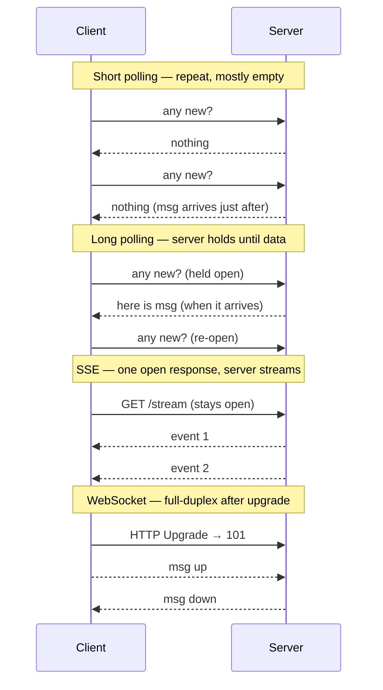
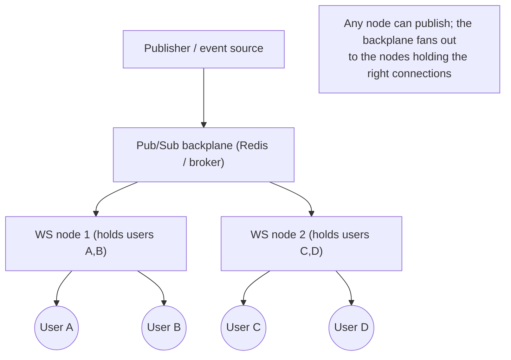

# Lesson 3.2.5 — WebSockets, Server-Sent Events, and Long Polling: Real-Time Transport Tradeoffs

> Part 3: Networking Deep Dive · Module 3.2: Application Protocols · Difficulty: 🟡
>
> **Prerequisites:** [3.1.3 TCP], [3.2.1 HTTP/1.1], [3.2.2 HTTP/2 & HTTP/3].
> **Unlocks:** [3.3.4 Connection Management], [Part 9 Messaging], [Part 11 Resilience], [Part 19 chat/feed designs].

---

## 1. Learning Objectives

After this lesson you will be able to:

- Explain why **plain HTTP request/response is "pull-only"** and what "real-time / server push" actually requires.
- Describe the four mainstream techniques — **short polling, long polling, Server-Sent Events (SSE), and WebSockets** — and how each delivers server→client data.
- Choose between them from first principles based on **direction (one-way vs bidirectional), message rate, payload type, infrastructure, and fallback needs**.
- Reason about the **operational cost of long-lived connections** (memory per connection, load-balancer/proxy behavior, scaling fan-out, reconnection) that the transport choice imposes on the rest of the system.

---

## 2. Motivation — HTTP was built to pull, not to push

Classic HTTP (3.2.1) is **client-initiated**: the client asks, the server answers, the exchange ends. That's perfect for fetching a page, but it can't express "tell me *when* something changes." Yet a huge class of products is exactly that: chat messages, live scores, stock tickers, notifications, collaborative cursors, dashboards, multiplayer state, "someone is typing…". The server needs to **push** data to the client the moment it exists.

Historically engineers faked push on top of pull. First with **short polling** (ask repeatedly — wasteful), then **long polling** (ask and let the server hold the request open until it has something — the "Comet" era). Then the platform grew real primitives: **Server-Sent Events** (a standardized one-way server→client stream over HTTP) and **WebSockets** (a full-duplex, persistent, low-overhead channel after an HTTP upgrade). HTTP/2 and HTTP/3 (3.2.2) later added server-push-ish multiplexing, but for *application-level* real-time you still choose among these four patterns.

This choice ripples through the whole architecture: long-lived connections change how you **load-balance** (3.3.1), how much **memory** you burn per user, how you **scale fan-out** (Part 9), and how you handle **reconnection and missed messages** (Part 11). Picking the transport is really picking an operational model.

---

## 3. Theory — From first principles

### 3.1 The core problem: who initiates, and is the channel open?

Two questions define the whole design space `[CS]`:

1. **Who can initiate a message?** Only the client (pull) or also the server (push)?
2. **Is a connection held open**, or is each exchange a fresh request?

The four techniques are points in that space:

| Technique | Direction | Channel | Mechanism |
|---|---|---|---|
| **Short polling** | client pulls | many short requests | client asks on a timer ("anything new?") |
| **Long polling** | simulated push | one held request at a time | server *holds* the request open until data, then client re-asks |
| **SSE** | server → client only | one long-lived HTTP response | server streams events down an open response body |
| **WebSocket** | full-duplex (both ways) | one persistent TCP connection | HTTP `Upgrade` to the WebSocket protocol, then framed messages |

### 3.2 Short polling

The client sends a normal request every *N* seconds: "any new data?" The server answers immediately (often "nothing"). Simple, stateless, works through every proxy and cache layer. But it's **wasteful and laggy**: most responses are empty (overhead with no payload), and latency is up to the poll interval (a 5s interval means up to 5s stale). Tightening the interval increases load linearly. Use it only for low-rate, latency-tolerant updates where simplicity wins.

### 3.3 Long polling

The client sends a request, and the **server does not respond until it has data** (or a timeout). When data arrives, the server responds; the client immediately **opens a new request** to wait again `[CS]`. This approximates push: the server effectively pushes by completing a request that was waiting.

- **Pros:** works over ordinary HTTP/proxies/firewalls; near-real-time without constant empty polls.
- **Cons:** each message is still a **full request/response cycle** (headers every time); there's a small gap between responses where a message could need buffering; holding many requests open ties up server resources; ordering/dedup needs care across reconnects. It was the dominant pre-WebSocket technique and remains the **universal fallback** when WebSockets/SSE are blocked.

### 3.4 Server-Sent Events (SSE)

SSE is a **standardized, one-way (server→client) stream** over a single long-lived HTTP response (`Content-Type: text/event-stream`) `[CS]`. The server keeps the response body open and writes discrete **events** (`data:` lines) as they occur; the browser's `EventSource` API parses them and fires events. Key properties:

- **One-directional:** server→client only. The client still uses normal HTTP requests to send data *up*.
- **Text-based**, built on plain HTTP — so it traverses proxies, works with HTTP/2 multiplexing, and integrates with standard auth/cookies/CORS.
- **Built-in reconnection + event IDs:** `EventSource` auto-reconnects and can send a `Last-Event-ID` header so the server can resume from where the client left off — a real advantage for resilience (Part 11).
- **Limitation (HTTP/1.1):** browsers cap connections-per-origin (~6), and each SSE stream consumes one — a real constraint over HTTP/1.1, largely relieved by **HTTP/2 multiplexing** (3.2.2). Also historically limited browser support relative to WebSockets, now broadly available.

SSE is the sweet spot when you only need **server→client push of events** (notifications, live feeds, dashboards, progress, log/token streaming) and want to stay on plain HTTP infrastructure.

### 3.5 WebSockets

WebSocket is a distinct protocol that provides a **persistent, full-duplex** channel over a single TCP connection `[CS]`. The connection starts as an HTTP request with `Upgrade: websocket`; the server agrees (`101 Switching Protocols`), and from then on both sides send **frames** (small binary/text messages with minimal framing overhead) **in either direction at any time**.

- **Bidirectional & low-overhead:** after the handshake, there are no per-message HTTP headers — just lightweight frames. Ideal for **high-rate, two-way** traffic (chat, multiplayer, collaborative editing, trading UIs).
- **Stateful & long-lived:** the connection persists, so the server holds per-connection state (which user, which subscriptions). This is the source of most of WebSocket's operational cost.
- **Not plain HTTP after upgrade:** it bypasses HTTP semantics (no per-message caching, methods, or status codes), needs **L7 load balancers / proxies that understand the upgrade and sticky routing** (3.3.1, 3.3.2), and you build your own message protocol (framing, heartbeats/pings, reconnection, auth refresh) on top.

### 3.6 The hidden cost: long-lived connections change the system

The biggest architectural consequence of SSE/WebSockets isn't the protocol — it's that **a connection stays open per client** `[CS]`:

- **Memory/FD per connection:** each open connection costs a file descriptor and buffers. A million concurrent users = a million connections to hold (the **C10K → C10M** problem, Part 17) — pushing you to event-loop/async servers (Netty, Node, Go, epoll/kqueue) rather than thread-per-request.
- **Statefulness fights stateless scaling (Part 7):** you can't freely round-robin every request; a client is *bound* to the server holding its connection. Scaling out means **fanning a published message to whichever servers hold the relevant subscribers** — typically via a **pub/sub backplane** (Redis pub/sub, a message broker — Part 9) so any node can deliver to its connected clients.
- **Load balancers must support it:** L4 LBs pass TCP through fine; L7 LBs and proxies must handle the WebSocket **upgrade** and keep the connection pinned; idle timeouts must exceed your heartbeat interval or connections get culled (3.3.4).
- **Reconnection is normal, not exceptional:** mobile networks, deploys, and LB timeouts drop connections constantly. You **must** design heartbeats, exponential-backoff reconnect, resume tokens / `Last-Event-ID`, and message replay so clients don't miss events (Part 11). With many clients reconnecting at once (after a deploy), beware the **thundering herd** — add jitter.

---

## 4. Visual Intuition

### The four patterns over time

### Scaling push: the pub/sub backplane

---

## 5. Real-World Analogy

Think about how you'd learn that a package arrived.

- **Short polling:** you walk to the mailbox every 10 minutes to check. Mostly wasted trips.
- **Long polling:** you ask the mail carrier "let me know when something comes," and they hold the line until a package arrives, tell you once, then you ask again.
- **SSE:** the post office installs a **one-way intercom** into your house and announces each delivery as it happens — they can talk to you, but you reply through the normal door.
- **WebSocket:** you and the post office install a **dedicated open phone line** — either side can talk anytime, instantly, with almost no per-call setup. Great for constant back-and-forth, but the phone company (your servers) now has to keep a line open for *every* household, which is expensive at city scale.

The analogy also surfaces the operational truth: the open phone line (WebSocket) is the most powerful but the most costly to maintain at scale, and when the line drops you need a plan to reconnect and catch up on what you missed.

---

## 6. Industry Example

- **Chat & collaboration** `[CONV]`: Slack, WhatsApp Web, and collaborative editors (Google Docs-style, 19.2.1) use **WebSockets** for low-latency bidirectional messaging and presence — the canonical high-rate two-way case.
- **Live feeds / dashboards / AI token streaming** `[CONV]`: many "live update" and **streamed LLM responses** are delivered with **SSE** because the flow is server→client only and benefits from plain-HTTP infra and auto-reconnect.
- **Long polling as the historical foundation & fallback** `[CONV]`: the "Comet" era popularized long polling; libraries like **Socket.IO** negotiate the **best available transport** and **fall back to long polling** when WebSockets are blocked by a proxy/firewall — a widely used resilience pattern.
- **Push at scale via backplane** `[CONV]`: large real-time systems fan messages out through a **pub/sub layer** (Redis pub/sub or a broker, Part 9) so any connection-holding node can deliver to its subscribers (Part 18 chat designs). *(Exact internals representative.)*

---

## 7. Implementation Details — choosing and building

**Decision heuristic:**

1. **Need the server to push at all?** No → plain HTTP/short polling. Yes → continue.
2. **One-way (server→client) only?** Yes → **SSE** (simpler, plain HTTP, auto-reconnect, resume via `Last-Event-ID`). Especially good over HTTP/2.
3. **Two-way / high-rate / low-latency interaction?** → **WebSocket**.
4. **Must work through hostile proxies / need universal fallback?** → **long polling** (often auto-negotiated by a library).

**Building blocks regardless of choice:**

- **Heartbeats/ping-pong** to detect dead connections and keep LBs/proxies from idling them out (3.3.4); set LB idle timeout > heartbeat interval.
- **Reconnect with exponential backoff + jitter**; resume via event IDs / resume tokens so clients catch up on missed messages (Part 11).
- **Backpressure** (3.3.4, Part 9): if a client is slow, bound its outbound buffer and drop/coalesce or disconnect rather than running the server out of memory.
- **Auth on long-lived connections:** validate at connect *and* handle token expiry mid-connection (re-auth or disconnect) — a common security gap (Part 15).
- **Scale-out backplane:** use pub/sub (Redis/broker) so any node delivers to its connections; track subscriptions per node.
- **Complexity/cost:** O(connections) memory and FDs; plan capacity for *concurrent connections*, not just request rate (Part 17, 1.1.4).

---

## 8. Advantages

- **Short polling:** trivially simple, stateless, works everywhere, fully cacheable/standard HTTP.
- **Long polling:** near-real-time over ordinary HTTP; universal fallback; no special infra.
- **SSE:** standardized one-way push on **plain HTTP**; **auto-reconnect + event-ID resume** built in; plays well with HTTP/2 multiplexing, auth, and proxies; text-stream simplicity.
- **WebSocket:** true **full-duplex**, **low per-message overhead**, lowest latency for high-rate two-way traffic; supports binary; one connection for everything.

---

## 9. Disadvantages

- **Short polling:** wasteful (empty responses), latency bounded by interval; load scales with poll frequency.
- **Long polling:** full request/response per message (header overhead); held requests consume resources; gap-between-responses buffering; trickier ordering/dedup.
- **SSE:** **one-way only**; text-oriented; HTTP/1.1 per-origin connection cap (relieved by HTTP/2); historically weaker browser support than WebSockets.
- **WebSocket:** **stateful & long-lived** (memory/FD per connection, C10M), needs upgrade-aware L7 LBs/proxies and sticky routing, no HTTP caching/semantics, you build your own protocol (framing, heartbeats, reconnection, auth refresh) — most operationally demanding.

---

## 10. When NOT to use each

- **Don't use WebSockets** when the data is **one-way** (use SSE — simpler) or **low-rate / latency-tolerant** (use polling) — you'd pay the long-lived-connection cost for nothing.
- **Don't use SSE** when you need **client→server streaming or high-rate bidirectional** traffic (use WebSocket), or when you're stuck on HTTP/1.1 with many streams per client (connection cap).
- **Don't use long/short polling** for **high-frequency, low-latency** push (chat, multiplayer) — overhead and latency are too high; reserve them for low-rate updates or as a **fallback**.
- **Don't reach for any push transport** if a simple periodic refresh meets the product's freshness requirement — real-time has real cost.

---

## 11. Common Mistakes

1. **Defaulting to WebSockets for everything**, including one-way feeds — paying statefulness/scaling cost when SSE or polling would do.
2. **Ignoring the connection-count dimension** in capacity planning — sizing for request rate but getting crushed by *concurrent open connections* (Part 17).
3. **No reconnect/resume strategy** — clients silently miss messages after a drop; no `Last-Event-ID`/resume token (Part 11).
4. **LB idle timeout < heartbeat interval** — the LB kills "idle" connections; add heartbeats and tune timeouts (3.3.4).
5. **Forgetting the pub/sub backplane** — a multi-node deployment where a message only reaches users on the publishing node (others never get it).
6. **No backpressure** — a slow client's buffer grows unbounded, OOM-ing the server (Part 9, 3.3.4).
7. **Auth only at connect** — tokens expire mid-connection but the channel stays privileged (Part 15).
8. **Thundering-herd reconnect after deploys** — all clients reconnect simultaneously; no jitter (Part 11).

---

## 12. Interview Questions

**🟢 Easy**
- Why can't plain HTTP request/response "push" data from server to client?
- What's the difference between short polling and long polling?

**🟡 Medium**
- Compare SSE and WebSockets. When would you pick SSE even though WebSockets are "more powerful"?
- Why are long-lived connections operationally expensive, and how does that affect load balancing and capacity planning?

**🔴 Hard**
- Design the real-time delivery layer for a chat app (millions of concurrent users). How do you scale fan-out across many connection-holding nodes? How do you handle reconnection and missed messages?
- A proxy in front of your service silently kills idle connections after 60s. Diagnose how this manifests for WebSockets/SSE and how you'd fix it.

**⚫ Staff+**
- You must support web, mobile, and locked-down corporate networks. Design a transport strategy that negotiates WebSocket → SSE → long polling, with consistent delivery/ordering/resume semantics across all three.
- Analyze the cost model of 10M concurrent connections: memory/FD budget, server architecture (event loop vs thread-per-conn), backplane choice, and failure/reconnect behavior during a rolling deploy. Defend every tradeoff.

---

## 13. Production Pitfalls

- **Silent message loss on reconnect:** no resume token / replay, so messages sent during a drop vanish — users see gaps in chat.
- **Idle-timeout disconnect storms:** misconfigured LB/proxy timeouts cull connections en masse; clients reconnect together (thundering herd) and overload the backplane.
- **Memory blowup from slow consumers:** unbounded per-connection send buffers OOM nodes under backpressure.
- **Sticky-routing failures:** an L7 LB that doesn't pin WebSocket upgrades routes frames to the wrong node; connection breaks.
- **Backplane as SPOF/bottleneck:** the Redis/broker fan-out layer saturates or fails, taking down all real-time delivery (Part 11).
- **Mid-connection auth expiry:** long-lived sessions outliving token validity (security gap, Part 15).

---

## 14. Optimization Techniques

- **Match transport to direction/rate** (SSE for one-way, WS for two-way, polling for low-rate) — avoid over-provisioning the connection model.
- **Event-loop/async servers** (epoll/kqueue, Netty/Go/Node) for high concurrent-connection counts (C10M, Part 17).
- **Pub/sub backplane** (Redis/broker) for horizontal fan-out; partition subscriptions to limit per-node load (Part 9).
- **Heartbeats + tuned idle timeouts**; **batch/coalesce** high-frequency updates (e.g., one frame per animation tick) to cut overhead.
- **Compression** (per-message deflate / binary frames) for bandwidth-heavy streams; mind CPU tradeoff.
- **Reconnect with backoff + jitter** and **resume via event IDs**; pre-warm/limit reconnect bursts after deploys.
- **Backpressure policies:** bounded buffers, drop/coalesce stale updates, disconnect abusive clients.

---

## 15. Summary

Plain HTTP is **pull-only**, so "real-time / server push" is achieved with one of four patterns. **Short polling** repeatedly asks (simple but wasteful and laggy). **Long polling** holds a request open until data exists (near-real-time over ordinary HTTP; the universal fallback). **Server-Sent Events** stream **one-way (server→client)** over a single long-lived HTTP response, with built-in **auto-reconnect and `Last-Event-ID` resume** — ideal for notifications, live feeds, and token streaming on plain-HTTP infrastructure. **WebSockets** provide a **persistent, full-duplex, low-overhead** channel after an HTTP `Upgrade` — the right tool for **high-rate, bidirectional** interaction (chat, multiplayer, collaboration). The decisive architectural fact is that SSE/WebSockets hold a **connection open per client**, which turns a stateless request problem into a **stateful, connection-bound** one: O(connections) memory/FDs (C10M), upgrade-aware L7 load balancing with sticky routing, horizontal **fan-out via a pub/sub backplane**, and first-class **reconnection/resume/backpressure** handling. Choose by **direction, rate, infrastructure, and fallback needs** — and remember that picking a real-time transport is really choosing an operational model the rest of the system must support.

---

## 16. Revision Notes (flashcard-ready)

- **Q:** Why can't HTTP push? **A:** It's client-initiated request/response; the server can't start a message.
- **Q:** Short vs long polling? **A:** Short = repeat on a timer (mostly empty); long = server holds the request open until data, then client re-asks.
- **Q:** What is SSE? **A:** Standardized **one-way** server→client event stream over one long-lived HTTP response; auto-reconnect + `Last-Event-ID` resume.
- **Q:** What is a WebSocket? **A:** Persistent **full-duplex** channel after HTTP `Upgrade` (101); low per-message overhead; you build the protocol on top.
- **Q:** SSE vs WebSocket pick? **A:** One-way → SSE; two-way/high-rate → WebSocket.
- **Q:** Biggest operational cost? **A:** One open connection per client → memory/FDs (C10M), stateful (sticky) routing, needs backplane to scale fan-out.
- **Q:** How to scale push across nodes? **A:** Pub/sub backplane (Redis/broker) fans messages to the nodes holding the right connections.
- **Q:** Must-have resilience features? **A:** Heartbeats, reconnect with backoff+jitter, resume tokens/event IDs, backpressure, mid-connection re-auth.
- **Q:** Universal fallback transport? **A:** Long polling (negotiated by libs like Socket.IO).

---

## 17. Further Reading + Knowledge-Graph Links

**Within this platform**
- **Previous:** [3.2.4 DNS]. **Builds on:** [3.1.3 TCP], [3.2.1 HTTP/1.1], [3.2.2 HTTP/2 & HTTP/3]. **Next:** [3.2.6 gRPC/REST/GraphQL & Serialization].
- **Operationalized by:** [3.3.1 Load Balancing] (L7 upgrade/sticky), [3.3.4 Connection Management] (keep-alive, idle timeouts, backpressure).
- **Scales via:** [Part 9 Messaging & Streaming] (pub/sub backplane), [Part 7 Scalability] (stateful vs stateless), [Part 17 Performance] (C10K→C10M).
- **Resilience:** [Part 11] (reconnect, resume, thundering herd). **Applied in:** [Part 19 chat/feed designs], [Part 18 chat-at-scale].

**Foundational texts (synthesized)**
- Kurose & Ross, *Computer Networking* — HTTP request/response model and its limits.
- Relevant protocol specifications for SSE (`text/event-stream`) and the WebSocket protocol (handshake/framing) — conceptual synthesis only.
- Real-time platform/library documentation (e.g., Socket.IO transport negotiation) — representative.

**Concept tags:** `[CS]` pull vs push, long-lived connections, full-duplex, C10K/C10M · `[CONV]` SSE for one-way feeds, WebSockets for chat/collab, long-polling fallback, pub/sub backplane · `[BP]` heartbeats, reconnect+resume, backpressure, tune LB idle timeouts.
