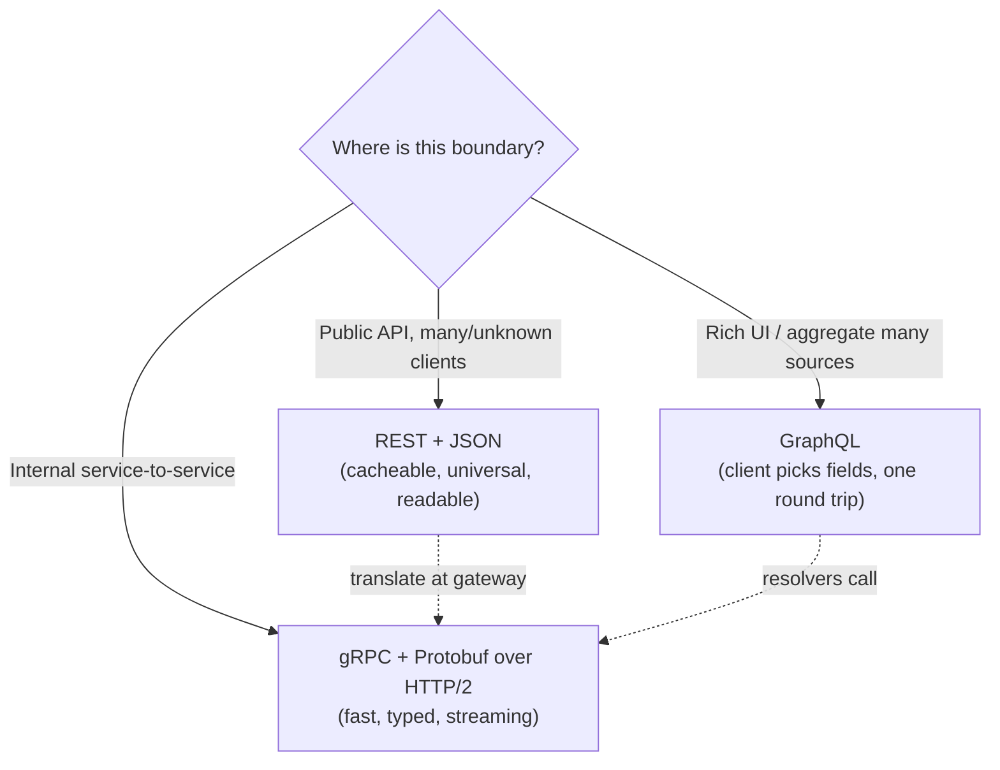
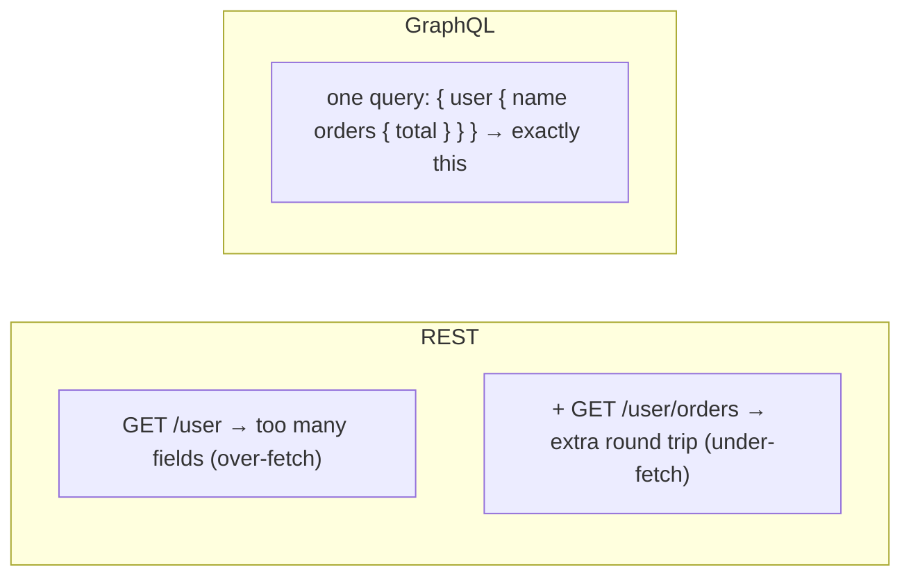

# Lesson 3.2.6 — API Styles & Serialization: REST, gRPC, GraphQL, and Protobuf/Thrift/Avro

> Part 3: Networking Deep Dive · Module 3.2: Application Protocols · Difficulty: 🟡🔴
>
> **Prerequisites:** [3.2.1 HTTP/1.1], [3.2.2 HTTP/2 & HTTP/3], [2.1.x coupling], [4.3.1 encoding/schema evolution (forward ref)].
> **Unlocks:** [3.3.2 API Gateways], [Part 12 Microservices comms], [Part 9 Messaging], [Part 19/20 API design].

---

## 1. Learning Objectives

After this lesson you will be able to:

- Distinguish an **API style** (REST, gRPC, GraphQL) from a **serialization/encoding format** (JSON, Protobuf, Thrift, Avro) — two separate decisions.
- Explain the design philosophy, strengths, and costs of **REST**, **gRPC**, and **GraphQL**, and pick the right one for a given boundary (public API, internal service-to-service, BFF/aggregation).
- Compare **JSON vs binary schema formats** (Protobuf, Thrift, Avro) on size, speed, schema enforcement, and **schema evolution** (backward/forward compatibility).
- Reason about how these choices interact with **HTTP/2** (3.2.2), **coupling/versioning** (2.1.x), **gateways** (3.3.2), and **microservice communication** (Part 12).

---

## 2. Motivation — Two decisions hiding behind "what API should we use?"

When teams argue "REST vs gRPC vs GraphQL," they're usually conflating two independent choices:

1. **The interface style** — how requests/operations are *modeled* (resources & verbs? remote procedure calls? a query language?).
2. **The wire format** — how the bytes are *encoded* (human-readable JSON? a compact binary schema like Protobuf/Thrift/Avro?).

These evolved to solve different pains. **REST** (resources over HTTP) gave the web a uniform, cacheable, loosely-coupled style that anyone can call with a browser or `curl`. **gRPC** (RPC over HTTP/2 with Protobuf) optimized **internal service-to-service** calls for speed, strong contracts, and streaming. **GraphQL** attacked **over-/under-fetching** for client-driven UIs by letting the client ask for exactly the fields it needs in one round trip. Meanwhile **serialization** advanced from verbose text (XML/JSON) to **schema-based binary** formats that are smaller, faster, and — crucially — support **schema evolution** so producers and consumers can change independently (4.3.1).

Getting this right matters because the API boundary is where **coupling** lives (2.1.x). A bad choice creates chatty clients, brittle versioning, ballooning payloads, or contracts no one can evolve. The boundary type — public vs internal vs aggregation — usually decides the answer.

---

## 3. Theory — From first principles

### 3.1 Style vs format: keep them separate

- **Style** = the *interaction model* and contract shape.
- **Format** = the *byte encoding* of messages.

They're largely orthogonal: REST usually carries JSON but can carry Protobuf; gRPC mandates HTTP/2 transport and typically Protobuf; GraphQL is a query language (typically JSON over HTTP). Decide the style for the *boundary*, then the format for *efficiency/contract* needs.

### 3.2 REST (Representational State Transfer)

REST models the world as **resources** (nouns: `/users/42/orders`) manipulated with **HTTP verbs** (GET/POST/PUT/PATCH/DELETE) and **status codes**, leaning on HTTP's existing machinery (3.2.1): caching, idempotency semantics, content negotiation, statelessness `[CS]`. Properly done, it's **uniform, loosely coupled, and cache-friendly**.

- **Strengths:** ubiquitous, human-readable (JSON), works with every tool/proxy/cache, easy to consume publicly, leverages HTTP caching (3.2.1, 3.3.3).
- **Costs:** **over-/under-fetching** (fixed resource shapes mean clients get too much or must make many calls), **chattiness** (N+1 calls to assemble a view), no built-in schema/contract (OpenAPI bolts one on), and versioning is manual (`/v2`, fields).
- **Best for:** **public APIs**, broad/unknown clients, CRUD-ish resource models, anywhere cacheability and universal reach matter.

### 3.3 gRPC (RPC over HTTP/2 + Protobuf)

gRPC models calls as **remote procedures** (`rpc GetUser(GetUserRequest) returns (User)`) defined in a **`.proto` contract**, serialized with **Protobuf**, transported over **HTTP/2** (3.2.2) `[CS]`. HTTP/2 gives it **multiplexing** (many concurrent calls on one connection — no HoL blocking at the HTTP layer), and gRPC adds **four call types**: unary, server-streaming, client-streaming, and bidirectional streaming.

- **Strengths:** **fast & compact** (binary Protobuf + HTTP/2), **strong typed contract** with code generation in many languages, **streaming** first-class, great for **internal microservice** calls (Part 12).
- **Costs:** **not human-readable**, **limited browser support** (needs gRPC-Web + a proxy), harder to debug with curl, requires HTTP/2 end-to-end (proxies/LBs must support it, 3.3.2), no HTTP caching semantics.
- **Best for:** **internal service-to-service** communication, polyglot backends needing a shared contract, low-latency/high-throughput RPC, streaming.

### 3.4 GraphQL (client-specified queries)

GraphQL exposes a **typed schema** and lets the **client send a query** describing exactly the fields/objects it wants; the server resolves and returns precisely that shape, typically in **one round trip** `[CS]`. It targets the **over-/under-fetching** problem and is popular for **aggregating** data from many sources behind one endpoint (a BFF — 3.3.2, Part 12).

- **Strengths:** **no over/under-fetching** (client picks fields), **single round trip** for complex views, strong **typed schema + introspection**, great for **frontend-driven** APIs and aggregation across services.
- **Costs:** **caching is hard** (mostly POST to one endpoint → HTTP caching doesn't apply; needs app-level/persisted-query caching), **server complexity** (resolvers, the **N+1 resolver problem** needing DataLoader-style batching), **query-cost/abuse risk** (a malicious deep/expensive query can DoS — needs depth/cost limiting, Part 15), and harder rate limiting.
- **Best for:** **rich client UIs** with varied data needs, **aggregation/BFF** layers over many backends; less ideal for simple CRUD or where edge caching is critical.

### 3.5 Serialization formats: text vs schema-based binary

| Format | Schema? | Encoding | Notes |
|---|---|---|---|
| **JSON** | none (self-describing) | text | universal, human-readable, verbose, no types enforced, slower to parse |
| **XML** | optional (XSD) | text | verbose, legacy/enterprise/SOAP |
| **Protocol Buffers (Protobuf)** | **required `.proto`** | binary | compact, fast, field **tag numbers** enable evolution; Google; used by gRPC |
| **Thrift** | **required IDL** | binary (several encodings) | Protobuf-like + built-in RPC; Facebook origin |
| **Avro** | **required schema** | binary | schema stored with data / in a **registry**; great for **big-data/Kafka**, dynamic schemas |

**Why schema-based binary wins for internal/high-volume paths** `[CS]`:
- **Smaller & faster:** no field names on the wire (Protobuf/Thrift use numeric tags), compact binary → less bandwidth, less CPU to parse (1.1.3, Part 17).
- **Enforced contract:** the schema *is* the API; codegen gives typed clients in many languages.
- **Schema evolution (the big one, 4.3.1):** designed so producers and consumers can change independently —
  - **Backward compatible:** new code reads old data.
  - **Forward compatible:** old code reads new data.
  - Protobuf/Thrift achieve this via **field tag numbers + optional fields + sane defaults** (add fields with new tags, never reuse/renumber, don't make new fields required). **Avro** uses **reader/writer schema resolution** (often via a **schema registry**), ideal when many writers/readers evolve over time (Part 9, Kafka).

**JSON's place:** unbeatable for **public APIs, debuggability, and browser/human consumption** — readability and ubiquity beat raw efficiency there. The cost is size and the lack of an enforced, evolvable contract (mitigated by JSON Schema/OpenAPI).

### 3.6 How it ties together

The **boundary** drives the **style**; the **volume/contract needs** drive the **format**:
- **Public edge:** REST/JSON (or GraphQL for rich clients) — reach, cacheability, readability.
- **Internal mesh:** gRPC/Protobuf — speed, contracts, streaming (Part 12, service mesh in 12.7).
- **Event/stream pipelines:** Avro (+registry) on Kafka-style logs (Part 9).
- **Aggregation for UIs:** GraphQL as a BFF over REST/gRPC backends (3.3.2).

A gateway (3.3.2) often **translates** between them (public REST/GraphQL ↔ internal gRPC).

---

## 4. Visual Intuition

### Decision by boundary

### Over-fetch / under-fetch vs GraphQL

---

## 5. Real-World Analogy

Think of ordering food.

- **REST** is a **fixed menu of dishes (resources)**: you order dish #42 with standard verbs (order it, cancel it). Simple and universal, but you might get side dishes you didn't want (over-fetch) or have to place several orders to assemble a meal (under-fetch).
- **gRPC** is a **kitchen-to-kitchen hotline** between professional chefs: terse coded orders ("rpc PrepareSauce") over a dedicated fast line, no chit-chat, everyone trained on the same recipe book (the `.proto`). Brutally efficient internally, but not something a walk-in customer could use.
- **GraphQL** is a **build-your-own-plate counter**: you specify *exactly* the items and portions you want and get one plate back, no more, no less. Wonderful for picky eaters (clients), but the kitchen behind it is more complex and a customer asking for a 50-item plate can jam the line (query cost).

And **serialization** is the **language the order is written in**: **JSON** is plain English anyone can read (verbose); **Protobuf/Thrift/Avro** are a compact shorthand with a shared codebook — tiny and fast, but you need the codebook (schema) to read it.

---

## 6. Industry Example

- **gRPC for internal microservices** `[CONV]`: widely used inside large backends (Google's internal RPC lineage → gRPC) for fast, contract-driven, polyglot service-to-service calls (Part 12). *(Internal details representative.)*
- **GraphQL for client aggregation** `[CONV]`: popularized by Facebook for mobile clients with varied data needs; common as a **BFF** aggregating many backends (3.3.2).
- **REST/JSON as the public-API default** `[CONV]`: the overwhelming majority of public web APIs are REST/JSON for reach, tooling, and cacheability.
- **Avro + schema registry on Kafka** `[CONV]`: a standard pattern for evolving event schemas across many producers/consumers in data pipelines (Part 9, 4.3.1).
- **Gateways translating edge↔internal** `[BP]`: API gateways expose REST/GraphQL externally and call gRPC internally (3.3.2).

---

## 7. Implementation Details — choosing and evolving

**Pick the style by boundary:**
- Public/unknown clients, cacheable, simple → **REST/JSON**.
- Internal, high-throughput, typed, streaming → **gRPC/Protobuf**.
- Frontend-driven, multi-source aggregation → **GraphQL** (with cost limits + DataLoader batching).

**Pick the format by need:**
- Human/public/debuggable → **JSON**.
- Compact/fast/typed internal RPC → **Protobuf/Thrift**.
- Evolving schemas across many producers/consumers, big data → **Avro + registry**.

**Evolve safely (4.3.1) — the rules that prevent outages:**
- **Never reuse or renumber Protobuf field tags;** add new fields with new tags; keep new fields **optional** with defaults (preserves backward+forward compat).
- For **REST/JSON**, add fields **additively**; don't repurpose existing fields; version (`/v2`) for breaking changes; tolerant reader (ignore unknown fields).
- For **Avro**, manage compatibility via a **schema registry** (set compatibility mode: backward/forward/full).
- **Test compatibility in CI** (a fitness function, 2.3.3): reject schema changes that break consumers.

**Operational:**
- gRPC needs **HTTP/2 end-to-end**; ensure LBs/proxies/mesh support it (3.3.2, 12.7); use **gRPC-Web** for browsers.
- GraphQL: enforce **query depth/complexity limits + persisted queries** (Part 15), use **DataLoader-style batching** to kill the resolver **N+1** (Part 17).

---

## 8. Advantages

- **REST:** universal, cacheable, human-readable, loosely coupled, every tool supports it; great public API default.
- **gRPC:** compact+fast (Protobuf/HTTP/2), strong typed contracts + codegen, multiplexed, first-class streaming; ideal internal RPC.
- **GraphQL:** exactly-the-fields (no over/under-fetch), one round trip for complex views, typed schema + introspection, great for aggregation/BFF.
- **Schema binary (Protobuf/Thrift/Avro):** small, fast, enforced contract, and **principled schema evolution** (backward/forward compatibility).

---

## 9. Disadvantages

- **REST:** over/under-fetching, chattiness (N+1 round trips), no native contract, manual versioning.
- **gRPC:** not human-readable, weak browser support (needs gRPC-Web/proxy), needs HTTP/2 everywhere, no HTTP caching, harder to debug.
- **GraphQL:** caching is hard (POST to one endpoint), server/resolver complexity + N+1, query-cost/DoS risk, rate-limiting harder.
- **JSON:** verbose, slower to parse, no enforced types/contract.
- **Binary schema formats:** not human-readable, require sharing/maintaining schemas and tooling (registry for Avro).

---

## 10. When NOT to use each

- **Don't use gRPC for public, browser-facing APIs** with diverse external consumers (poor reachability/cacheability) — use REST/GraphQL at the edge.
- **Don't use GraphQL for simple CRUD or cache-critical endpoints** (edge caching is much easier with REST) — the complexity isn't worth it.
- **Don't use REST for chatty internal high-throughput RPC** where gRPC's efficiency, contracts, and streaming clearly win.
- **Don't use plain JSON for huge-volume internal/event pipelines** where binary+schema (Avro/Protobuf) saves major bandwidth/CPU and enables evolution.
- **Don't pick a binary format if human debuggability/ubiquity is the priority** (public APIs).

---

## 11. Common Mistakes

1. **Conflating style and format** — thinking "gRPC vs JSON" instead of separating interface from encoding.
2. **One style everywhere** — forcing gRPC on the public edge or REST on a chatty internal mesh.
3. **Breaking schema evolution** — reusing/renumbering Protobuf tags, making new fields required, repurposing JSON fields → consumer outages (4.3.1).
4. **GraphQL without cost controls** — no depth/complexity limits → a single expensive query DoSes the backend (Part 15).
5. **GraphQL resolver N+1** — no DataLoader batching → a query fans out into hundreds of DB calls (Part 17).
6. **gRPC without HTTP/2-aware infra** — LB/proxy/mesh breaks multiplexing or the connection (3.3.2).
7. **No tolerant reader** — clients crashing on unknown/new fields instead of ignoring them.
8. **Caching GraphQL like REST** — assuming HTTP caching works when everything is POST to `/graphql`.

---

## 12. Interview Questions

**🟢 Easy**
- What's the difference between an API *style* (REST/gRPC/GraphQL) and a serialization *format* (JSON/Protobuf/Avro)?
- Why is JSON great for public APIs but often a poor choice for high-volume internal traffic?

**🟡 Medium**
- Explain over-fetching and under-fetching in REST and how GraphQL addresses them. What new problems does GraphQL introduce?
- Why is gRPC well-suited to internal service-to-service calls? What does HTTP/2 contribute?

**🔴 Hard**
- You're designing APIs for a product with a public mobile app, a web frontend, and 30 internal microservices. Choose styles/formats for each boundary and justify, including how a gateway translates between them.
- Walk through evolving a Protobuf message used by many services without downtime. What are the exact rules, and what breaks compatibility?

**⚫ Staff+**
- Design the contract-and-compatibility strategy for an org with hundreds of services and Kafka pipelines: schema ownership, registry, compatibility modes, CI fitness functions, and rollout discipline. Defend Avro vs Protobuf choices per use case.
- Critically compare REST, gRPC, and GraphQL on coupling, caching, evolvability, and operability. When would you deliberately accept a "worse" technical choice for organizational reasons?

---

## 13. Production Pitfalls

- **Schema-evolution outage:** a renumbered/repurposed field silently corrupts data for older consumers (4.3.1).
- **GraphQL query DoS:** an unbounded nested query (or abusive client) exhausts DB/CPU — no cost limiting (Part 15).
- **Resolver N+1 latency cliff:** GraphQL/ORM fan-out to hundreds of queries under load (Part 17).
- **gRPC through a non-HTTP/2 proxy:** multiplexing collapses or calls fail; intermittent breakage hard to diagnose (3.3.2).
- **Cache misses everywhere:** moving a cacheable REST endpoint to GraphQL POST and losing all edge/CDN caching (3.3.3).
- **Versioning chaos:** breaking changes shipped on the same REST path without `/v2`, breaking existing clients.

---

## 14. Optimization Techniques

- **Right tool per boundary:** REST/JSON edge, gRPC/Protobuf internal, GraphQL for aggregation — minimize round trips and payload size (1.1.3).
- **Binary+schema (Protobuf/Avro)** on hot internal/event paths to cut bandwidth and parse CPU (Part 17, Part 9).
- **GraphQL: DataLoader batching, persisted queries, query-cost limits, response caching** at the app layer.
- **gRPC streaming** to avoid many unary round trips; HTTP/2 multiplexing for concurrency (3.2.2).
- **Compression + field-level pruning** (sparse fieldsets/`fields=` in REST) to reduce over-fetch.
- **Schema registry + CI compatibility checks** as fitness functions (2.3.3) to keep evolution safe and fast.
- **Gateway translation/caching** (3.3.2) to expose efficient internal gRPC behind a cacheable public REST/GraphQL edge.

---

## 15. Summary

"REST vs gRPC vs GraphQL" actually hides **two independent decisions**: the **API style** (interaction model) and the **serialization format** (wire encoding). **REST** models resources over HTTP — universal, cacheable, human-readable, loosely coupled — the default for **public APIs**, at the cost of over/under-fetching and chattiness. **gRPC** is **RPC over HTTP/2 with Protobuf** — compact, fast, strongly typed, streaming — the default for **internal service-to-service** calls, at the cost of browser support and HTTP-caching. **GraphQL** lets clients **request exactly the fields they need in one round trip** — excellent for rich UIs and **aggregation/BFF** — at the cost of hard caching, resolver/N+1 complexity, and query-cost risk. On the wire, **JSON** wins on readability/ubiquity (public, debuggable), while **schema-based binary formats — Protobuf, Thrift, Avro —** win on **size, speed, enforced contracts, and principled schema evolution** (backward/forward compatibility via field tags or registry-based reader/writer resolution). Choose the **style by the boundary** (public vs internal vs aggregation) and the **format by volume/contract/evolution needs**, let a **gateway translate** between edge and internal, and treat **schema evolution discipline** as a first-class, CI-enforced concern — because the API boundary is exactly where coupling and versioning pain accumulate.

---

## 16. Revision Notes (flashcard-ready)

- **Q:** Style vs format? **A:** Style = interaction model (REST/gRPC/GraphQL); format = byte encoding (JSON/Protobuf/Thrift/Avro). Orthogonal decisions.
- **Q:** REST in one line? **A:** Resources + HTTP verbs; universal, cacheable, readable; over/under-fetch & chatty. Best for public APIs.
- **Q:** gRPC in one line? **A:** RPC over HTTP/2 + Protobuf; fast, typed, streaming; weak in browsers/no HTTP cache. Best internal.
- **Q:** GraphQL in one line? **A:** Client specifies exact fields, one round trip; great for UIs/aggregation; caching hard, N+1/query-cost risks.
- **Q:** Why binary schema formats? **A:** Smaller/faster, enforced contract, and schema evolution (backward/forward compat).
- **Q:** Protobuf evolution rules? **A:** Don't reuse/renumber tags; add new fields with new tags; keep them optional with defaults.
- **Q:** Avro's distinctive trait? **A:** Reader/writer schema resolution via a registry — ideal for Kafka/big-data evolving schemas.
- **Q:** GraphQL must-haves in prod? **A:** Depth/cost limits, persisted queries, DataLoader batching.
- **Q:** Boundary→choice cheat? **A:** Public=REST/JSON, internal=gRPC/Protobuf, aggregation=GraphQL, events=Avro.

---

## 17. Further Reading + Knowledge-Graph Links

**Within this platform**
- **Previous:** [3.2.5 WebSockets/SSE/Long-Polling]. **Builds on:** [3.2.1 HTTP/1.1], [3.2.2 HTTP/2 & HTTP/3]. **Next:** [3.3.1 Load Balancing] (Module 3.3 — Edge & Traffic Management).
- **Deepened by:** [4.3.1 Data Encoding & Schema Evolution], [3.3.2 API Gateways] (translation), [Part 12 Microservices] (inter-service comms, service mesh 12.7), [Part 9 Messaging] (Avro on logs).
- **Security/perf:** [Part 15] (GraphQL query-cost/abuse), [Part 17] (N+1, payload size, parsing cost), [2.1.x] (coupling/versioning).

**Foundational texts (synthesized)**
- Kleppmann, *Designing Data-Intensive Applications* — encoding formats (JSON/XML/Protobuf/Thrift/Avro) and schema evolution.
- Fielding's architectural-style concept of REST (synthesized, not quoted).
- gRPC/Protobuf and GraphQL specifications and documentation — conceptual synthesis; details representative.

**Concept tags:** `[CS]` style vs format, schema evolution (backward/forward), RPC vs resource vs query models · `[CONV]` REST public / gRPC internal / GraphQL aggregation / Avro on Kafka · `[BP]` additive schema changes, registry + CI compatibility checks, GraphQL cost limits + batching, gateway translation.
