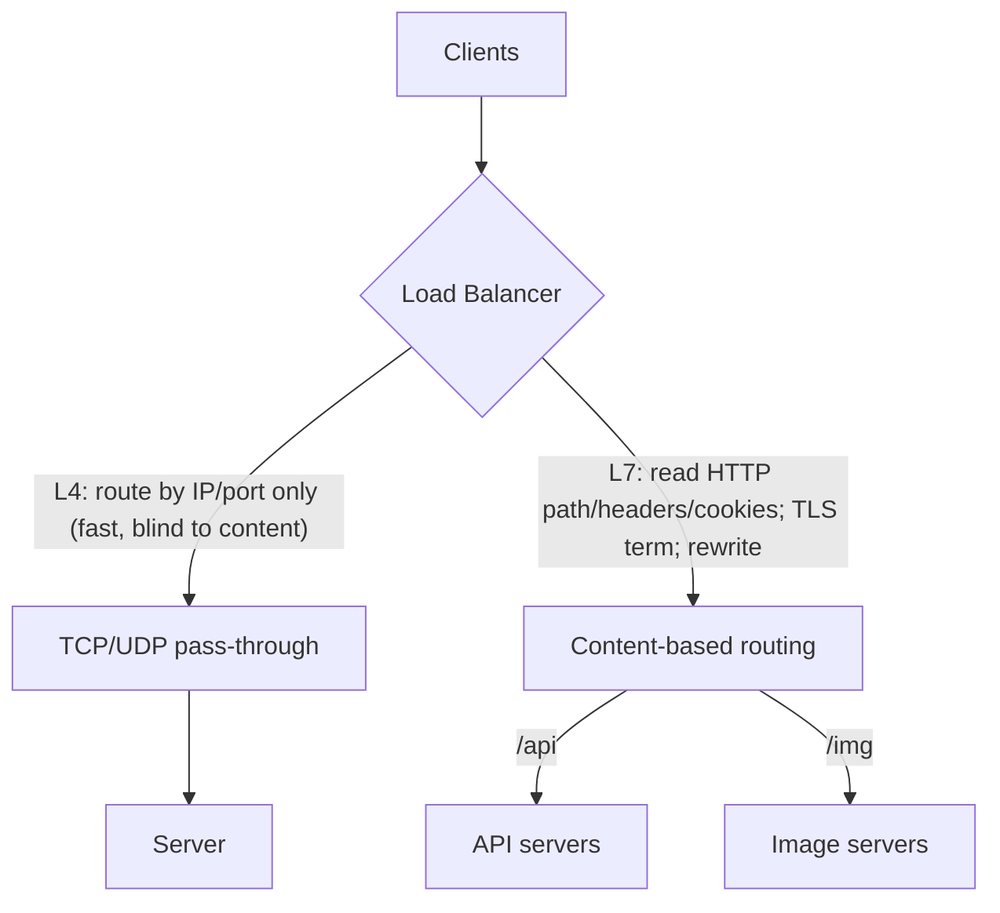
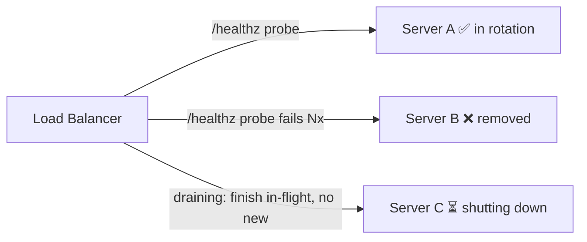

# Lesson 3.3.1 — Load Balancing: L4 vs L7, Algorithms, and Health Checks

> Part 3: Networking Deep Dive · Module 3.3: Edge & Traffic Management · Difficulty: 🟡🔴
>
> **Prerequisites:** [3.1.3 TCP], [3.2.1 HTTP/1.1], [3.2.4 DNS], [1.2.1 availability/scalability].
> **Unlocks:** [3.3.2 Reverse Proxies/Gateways], [3.3.3 CDNs], [Part 7 Scalability], [Part 11 Resilience], [Part 13 Multi-region].

---

## 1. Learning Objectives

After this lesson you will be able to:

- Explain **what a load balancer does** and why it's the keystone of **horizontal scaling** and **availability** (1.2.1, Part 7).
- Distinguish **L4 (transport)** from **L7 (application)** load balancing — what each can see, do, and cost.
- Choose among the core **algorithms** (round-robin, weighted, least-connections, least-response-time, hashing/consistent-hashing) for a given workload.
- Design **health checks**, **connection draining**, and **stickiness/affinity** correctly, and avoid making the load balancer a **single point of failure**.

---

## 2. Motivation — You can't scale or stay up without it

Two of the biggest non-functional needs — **scalability** and **availability** (1.2.1) — depend on putting *more than one* server behind a single address and spreading work across them. The component that does this is the **load balancer (LB)**. It's what makes a fleet of identical stateless servers (Part 7) look like one endpoint, lets you **add/remove capacity** without clients noticing, and **routes around failed instances** so one dead server doesn't take down the service.

DNS (3.2.4) already does *coarse* routing (which region), but it's slow to react and health-unaware. The LB is the **fine-grained, per-connection/per-request, health-aware** layer that picks the **actual server** — and reacts in milliseconds. Get its algorithm, health checks, draining, and redundancy right and you have an elastic, self-healing tier; get them wrong and you create cascading failures, uneven load (hot servers), broken deploys, or a brand-new single point of failure. Almost every scalable architecture in Parts 7–20 sits behind one.

---

## 3. Theory — From first principles

### 3.1 What a load balancer is

A load balancer is a component that accepts incoming connections/requests on a **virtual endpoint** and distributes them across a **pool of backend servers**, while **monitoring backend health** and removing/adding servers from rotation `[CS]`. Its core jobs:

- **Distribute load** across backends (the "balancing").
- **Detect and avoid unhealthy backends** (the availability win).
- **Decouple clients from servers** — clients hit one stable address; servers come and go behind it (enabling elastic scaling and zero-downtime deploys).

It can be **hardware** (legacy appliances), **software** (HAProxy, Nginx, Envoy — representative), or a **managed cloud LB** (ELB/ALB/NLB, GCLB, etc. — representative).

### 3.2 L4 vs L7 — the central distinction

Load balancers operate at one of two layers (recall the layered model, 3.1.1):

**L4 (transport-layer) load balancing** routes based on **TCP/UDP** information — IPs and ports — *without* reading the application payload `[CS]`.
- It forwards/relays packets or connections; it doesn't understand HTTP, paths, headers, or cookies.
- **Very fast and cheap** (minimal processing per packet), can handle enormous throughput, protocol-agnostic (works for any TCP/UDP service, including non-HTTP).
- **Can't** make content-based decisions (route `/api` vs `/images`), do TLS termination, or rewrite headers.

**L7 (application-layer) load balancing** terminates the connection and reads the **application message** (typically HTTP) `[CS]`.
- It can route by **URL path, host, headers, cookies, method**, do **TLS termination**, **header rewriting**, **compression**, **request-level retries**, **rate limiting**, and **content-based routing** (microservice routing, A/B, canary).
- **More CPU/latency per request** (it parses messages, often terminates TLS), but vastly more capable. This overlaps heavily with **reverse proxies / API gateways** (3.3.2).

**Rule of thumb:** **L4** for raw speed, non-HTTP protocols, or simple TCP pass-through; **L7** when you need to make decisions based on *what the request is* (the common case for web/microservice traffic).

### 3.3 Distribution algorithms

Once a request arrives, *which backend gets it?* `[CS]`

- **Round-robin:** rotate through servers in order. Simple, even *if* requests are uniform; ignores actual load/capacity.
- **Weighted round-robin:** assign weights (bigger/faster servers get more) — handles heterogeneous fleets.
- **Least connections:** send to the server with the fewest active connections — better when request durations vary (long-lived connections, 3.2.5).
- **Weighted least connections:** least-connections adjusted for server capacity.
- **Least response time:** pick the server with lowest latency (+ fewest connections) — load-aware, reacts to slow servers.
- **IP hash / hashing:** hash a key (client IP, header) to a server — gives **stickiness** without server-side session state.
- **Consistent hashing:** hash that **minimizes remapping when servers are added/removed** — crucial for cache affinity and sharded backends (deep-dived in Part 7); keeps most keys on the same server during scaling.
- **Random / power-of-two-choices:** pick two at random, send to the less loaded — cheap and surprisingly effective at avoiding hotspots `[CS]`.

**Choosing:** uniform short requests → round-robin/random; variable durations → least-connections/least-response-time; need affinity/cache locality → (consistent) hashing; heterogeneous fleet → weighted variants.

### 3.4 Health checks — the availability mechanism

An LB must know which backends are alive `[CS]`:

- **Passive health checks:** observe real traffic — if a backend errors/times out, mark it unhealthy.
- **Active health checks:** the LB periodically probes a **health endpoint** (e.g., `GET /healthz`). Two flavors matter:
  - **Liveness:** "is the process up?"
  - **Readiness:** "is it ready to serve?" (warmed caches, dependencies reachable) — use readiness for rotation so you don't send traffic to a booting/overloaded instance.
- **Tuning:** thresholds (N consecutive failures → out; M successes → back in), intervals, and timeouts. Too aggressive → flapping (servers bounce in/out); too lax → traffic sent to dead servers. **Health checks should be cheap and meaningful** (a check that always returns 200 regardless of real health is useless; one that hits the database can cause cascading removals if the DB blips).

### 3.5 Stickiness, draining, and statelessness

- **Session affinity / stickiness:** pin a client to one backend (via cookie or IP hash). Needed for **stateful** backends (in-memory session, WebSocket connection — 3.2.5), but it **undermines even balancing and complicates failover** (if that server dies, the session is gone). **Preferred design (Part 7): make servers stateless** and externalize session/state (Redis, etc.), so any server can handle any request — then you don't need stickiness.
- **Connection draining / graceful shutdown:** when removing a server (deploy/scale-in), **stop sending new requests but let in-flight ones finish** before terminating — prevents dropped requests during deploys (Part 13, 11).
- **Slow start / warm-up:** ramp traffic to a freshly added server gradually so cold caches/JIT don't get overwhelmed.

### 3.6 Don't make the LB a single point of failure

A single LB is itself a SPOF (1.2.1, Part 11). Mitigations `[CONV]`:
- **Redundant LBs** (active-active or active-passive) with failover (floating/virtual IP, or DNS/anycast in front).
- **Multiple LBs across AZs/regions**, with **DNS (3.2.4) / anycast (3.3.3)** distributing to them — combining the coarse (DNS) and fine (LB) layers.
- Managed cloud LBs are typically built as redundant, horizontally-scaled fleets internally (representative).

### 3.7 Where the LB sits (the layered picture)

```
DNS (which region) → [redundant LB fleet] → L7 LB / gateway (which service/version)
   → L4 LB (which instance) → backend servers
```
Real architectures often **chain** them: DNS picks the region (3.2.4); a global/edge LB or anycast (3.3.3) lands traffic; an **L7** LB/gateway (3.3.2) routes by content; instances scale behind it (Part 7).

---

## 4. Visual Intuition

### L4 vs L7



### Health checks + draining



---

## 5. Real-World Analogy

A load balancer is the **host at a busy restaurant with many identical servers (waitstaff)**. Guests (requests) arrive at **one podium** (the virtual endpoint) and the host decides who serves them.

- **Round-robin** = seat each new party with the next waiter in line.
- **Least connections** = seat the next party with the waiter currently handling the fewest tables (fairer when some tables linger).
- **Health checks** = the host notices a waiter who's gone home sick (failed probe) and stops sending them tables; when they return and are ready (readiness), they rejoin.
- **Connection draining** = when a waiter's shift ends, the host gives them no new tables but lets them finish serving their current ones before they leave.
- **Stickiness** = insisting a returning guest always gets the same waiter (nice if that waiter remembers their order — *state* — but a problem if that waiter is off that day). The better restaurant **writes the order down centrally** (stateless servers + external store) so *any* waiter can serve *any* guest.

And you never want a **single host** — if they faint, no one gets seated. So you keep **a backup host** (redundant LBs).

---

## 6. Industry Example

- **L4 vs L7 managed LBs** `[CONV]`: cloud providers offer both — e.g., network/L4 LBs (NLB-style) for raw TCP/UDP throughput and application/L7 LBs (ALB-style) for HTTP path/host routing, TLS termination, and canary routing (representative).
- **Software LBs/proxies** `[CONV]`: HAProxy, Nginx, and **Envoy** are widely deployed as L4/L7 LBs and as the data plane of **service meshes** (Envoy in Istio/Linkerd — 12.7).
- **Consistent hashing for cache/shard affinity** `[CS]`: used by distributed caches and sharded systems (and CDNs) so adding/removing nodes remaps minimal keys (Part 7, Part 6).
- **Power-of-two-choices** `[CS]`: a well-studied, low-overhead strategy that avoids the worst hotspots of pure random/round-robin.
- **Redundant LB fleets** `[CONV]`: production LBs are deployed redundantly across AZs with health-checked failover to avoid being a SPOF (Part 11, 13).

---

## 7. Implementation Details — designing the LB tier

- **Pick the layer:** **L7** for HTTP/microservice traffic needing content routing, TLS termination, retries, canary; **L4** for non-HTTP, ultra-high-throughput, or simple pass-through (you can chain L4→L7).
- **Pick the algorithm** to match request-duration variance and fleet heterogeneity (§3.3); default to **least-connections or power-of-two** for variable workloads, **(consistent) hashing** when you need affinity.
- **Design health checks** with **readiness** semantics, sane thresholds/intervals, and **cheap-but-meaningful** probes; avoid probes that cause correlated removals (don't fail readiness on a transient downstream blip across the whole fleet).
- **Enable connection draining** for deploys/scale-in and **slow-start** for scale-out (Part 13).
- **Prefer stateless backends + external session store** (Part 7) so you can avoid stickiness; use affinity only when truly necessary (e.g., WebSocket, 3.2.5).
- **Make the LB redundant** (active-active/passive across AZs) and front it with DNS/anycast (3.2.4, 3.3.3) — never a single LB.
- **Observe it:** per-backend connection counts, error rates, latency percentiles, healthy-host count (Part 16) — the LB is a prime place to see the **four golden signals**.

---

## 8. Advantages

- **Enables horizontal scaling** — add/remove backends behind one endpoint (Part 7).
- **Improves availability** — routes around failed backends via health checks (1.2.1, Part 11).
- **Zero-downtime deploys** — draining + rolling replacement behind the LB (Part 13).
- **Decouples clients from servers** — stable endpoint; elastic fleet.
- **L7 adds capability** — content routing, TLS termination, retries, canary, rate limiting (3.3.2).
- **Better resource use** — smart algorithms reduce hotspots and tail latency.

---

## 9. Disadvantages

- **Potential SPOF / bottleneck** if not made redundant and scaled.
- **L7 costs CPU/latency** (parsing, TLS termination) vs L4.
- **Stickiness undermines balancing** and complicates failover (lost sessions).
- **Operational complexity** — health-check tuning, draining, algorithm choice; misconfig causes flapping or dropped requests.
- **Added hop/latency** — every request traverses the LB.

---

## 10. When NOT to use it / limits

- **Single backend / trivial scale:** an LB adds a hop and ops overhead with no benefit (until you need HA or >1 instance).
- **Ultra-low-latency same-host paths:** an extra L7 hop may be unacceptable — use L4 or direct connections (e.g., service mesh sidecar handles it locally, 12.7).
- **Don't rely on DNS round-robin as your LB** (3.2.4) — no health awareness; use a real LB.
- **Don't use an LB to fix statefulness** — stickiness is a workaround; the real fix is stateless services (Part 7).

---

## 11. Common Mistakes

1. **Single load balancer** — a brand-new SPOF; not deploying it redundantly (Part 11).
2. **Useless health checks** — a `/healthz` that returns 200 regardless of real readiness, so traffic goes to broken servers; or **too-strict** checks that cause flapping/correlated removals.
3. **No connection draining** — deploys/scale-ins drop in-flight requests.
4. **Relying on stickiness** instead of externalizing state — fragile, uneven, breaks on failover (Part 7).
5. **Wrong algorithm for the workload** — round-robin with highly variable request durations creates hot servers (use least-connections).
6. **No slow-start** — cold servers get hammered on join and time out.
7. **L7 everywhere blindly** — paying TLS/parse cost where L4 pass-through would do.
8. **Ignoring LB observability** — not watching healthy-host count / per-backend latency until an incident.

---

## 12. Interview Questions

**🟢 Easy**
- What does a load balancer do, and why does it improve both scalability and availability?
- What's the difference between L4 and L7 load balancing?

**🟡 Medium**
- Compare round-robin, least-connections, and consistent hashing. When would you choose each?
- Why are readiness health checks important, and what goes wrong if health checks are too aggressive or too lax?

**🔴 Hard**
- Design zero-downtime deploys behind a load balancer (draining, readiness, rolling/canary). What failure modes are you preventing?
- Your fleet has uneven load (some servers hot) despite round-robin. Diagnose causes (request-duration variance, stickiness, long-lived connections) and propose fixes.

**⚫ Staff+**
- Design the full traffic-routing path for a global, multi-region service: DNS/anycast → edge → L7 → L4 → instances. Where does each decision happen, how do you avoid SPOFs, and how do you fail over a region?
- Explain consistent hashing and power-of-two-choices. For a sharded cache tier behind an LB, justify your choice and analyze rebalancing behavior when nodes are added/removed (link to Part 6/7).

---

## 13. Production Pitfalls

- **LB SPOF outage:** a non-redundant LB (or its config) fails and takes the whole service down (Part 11).
- **Health-check-induced outage:** a probe that hits a shared dependency fails for all backends at once → LB removes the entire fleet → total outage (correlated failure).
- **Dropped requests on deploy:** no draining, so rolling restarts kill in-flight requests.
- **Hot-server tail latency:** wrong algorithm or sticky sessions concentrate load; p99 spikes (Part 17).
- **Flapping:** thresholds too tight; servers oscillate in/out of rotation, churning connections.
- **Stuck on a dead session:** stickiness pinned users to a crashed server; their sessions are lost with no graceful re-route.

---

## 14. Optimization Techniques

- **Match algorithm to workload** (least-connections / least-response-time / power-of-two for variable durations) to cut tail latency (Part 17).
- **Consistent hashing** for cache/shard affinity to maximize hit rates and minimize remapping on scale events (Part 6/7).
- **Readiness + slow-start + draining** for smooth elasticity and deploys (Part 13).
- **TLS termination + keep-alive/connection reuse** at the L7 LB to offload backends (3.3.4, 3.2.3).
- **Outlier detection / circuit breaking** at the LB/mesh to eject misbehaving backends fast (Part 11, 12.7).
- **Redundant, autoscaled LB tier** fronted by DNS/anycast to remove SPOFs and scale the LB itself (3.2.4, 3.3.3).
- **Rich LB metrics** (golden signals per backend) to detect hotspots/flapping early (Part 16).

---

## 15. Summary

A **load balancer** distributes incoming connections/requests across a pool of backends while **health-checking** them — making it the keystone of **horizontal scalability** and **availability** (it lets many servers look like one stable endpoint and routes around failures). It operates at **L4** (transport: route by IP/port, fast, content-blind, any protocol) or **L7** (application: route by HTTP path/host/headers/cookies, TLS termination, rewrites, retries, canary — more capable, more CPU/latency). The **algorithm** should match the workload: round-robin/random for uniform short requests, **least-connections / least-response-time / power-of-two-choices** for variable durations, **(consistent) hashing** for affinity and minimal remapping on scale events, and **weighted** variants for heterogeneous fleets. **Health checks** (prefer **readiness**, tuned thresholds, cheap-but-meaningful probes) provide the availability win — but careless checks cause flapping or correlated fleet removal. **Connection draining** and **slow-start** make deploys/scaling zero-downtime, and **stateless backends with external session storage** let you avoid fragile **stickiness**. Finally, never let the LB itself be a **single point of failure**: deploy it **redundantly across AZs**, fronted by **DNS/anycast** — combining the coarse (DNS) and fine (LB) traffic layers into one elastic, self-healing tier that nearly every system in Parts 7–20 depends on.

---

## 16. Revision Notes (flashcard-ready)

- **Q:** What does an LB fundamentally provide? **A:** Distribution + health-aware routing → horizontal scalability + availability behind one endpoint.
- **Q:** L4 vs L7? **A:** L4 = route by IP/port (fast, content-blind, any protocol); L7 = read HTTP (path/headers/cookies), TLS term, rewrites, retries — capable but heavier.
- **Q:** Algorithm for variable request durations? **A:** Least-connections / least-response-time (not plain round-robin).
- **Q:** When consistent hashing? **A:** Need affinity/cache locality with minimal remapping when nodes change (Part 6/7).
- **Q:** Power-of-two-choices? **A:** Pick 2 random backends, send to the less loaded — cheap hotspot avoidance.
- **Q:** Readiness vs liveness? **A:** Liveness = process up; readiness = ready to serve (use readiness for rotation).
- **Q:** Connection draining? **A:** Stop new requests, finish in-flight before terminating — zero-downtime deploys.
- **Q:** Stickiness tradeoff? **A:** Enables stateful backends but breaks even balancing/failover; prefer stateless + external state.
- **Q:** Avoid LB as SPOF? **A:** Redundant LBs (active-active/passive) across AZs, fronted by DNS/anycast.

---

## 17. Further Reading + Knowledge-Graph Links

**Within this platform**
- **Previous:** [3.2.6 API Styles & Serialization]. **Builds on:** [3.1.3 TCP], [3.2.1 HTTP], [3.2.4 DNS]. **Next:** [3.3.2 Reverse Proxies, API Gateways, Ingress].
- **Enables:** [Part 7 Scalability] (stateless services, consistent hashing, sharding), [Part 11 Resilience] (failover, outlier detection), [Part 13 Multi-region] (global routing, deploys).
- **Related:** [3.3.3 CDN/anycast] (edge), [3.2.5 WebSockets] (sticky/upgrade), [3.2.3 TLS] (termination), [12.7 service mesh] (Envoy data plane), [Part 16] (golden signals).

**Foundational texts (synthesized)**
- Kleppmann, *Designing Data-Intensive Applications* — partitioning/rebalancing, consistent hashing intuition.
- Kurose & Ross, *Computer Networking* — transport vs application layer (L4/L7 basis).
- LB/proxy documentation (HAProxy, Nginx, Envoy) and cloud LB docs — representative for algorithms/health checks.

**Concept tags:** `[CS]` L4/L7, algorithms (RR/least-conn/consistent-hash/power-of-two), health checks · `[CONV]` managed L4/L7 LBs, redundant LB fleets, draining/slow-start · `[BP]` readiness checks, stateless+external session, avoid stickiness, no single LB.
