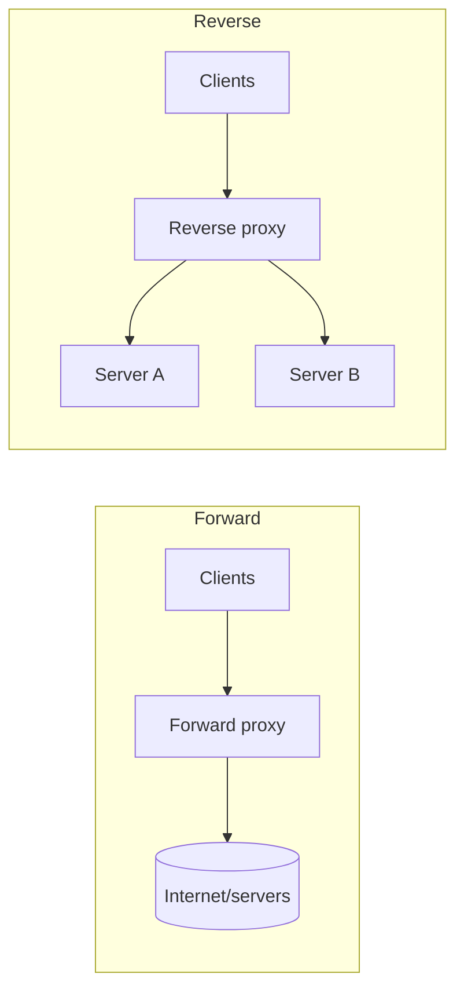
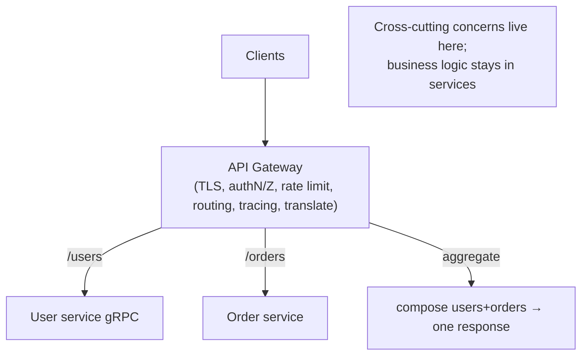

# Lesson 3.3.2 — Reverse Proxies, API Gateways, and Ingress

> Part 3: Networking Deep Dive · Module 3.3: Edge & Traffic Management · Difficulty: 🟡🔴
>
> **Prerequisites:** [3.2.1 HTTP/1.1], [3.2.3 TLS], [3.3.1 Load Balancing], [3.2.6 API styles].
> **Unlocks:** [3.3.3 CDNs], [Part 12 Microservices (gateway, BFF)], [Part 13 Cloud Native (Ingress)], [Part 15 Security].

---

## 1. Learning Objectives

After this lesson you will be able to:

- Define a **reverse proxy** and explain how it differs from a forward proxy and a pure load balancer.
- Explain what an **API gateway** adds on top of a reverse proxy (auth, rate limiting, routing, aggregation, translation) and the **cross-cutting concerns** it centralizes.
- Explain **Ingress** in Kubernetes (3.x → Part 13) as the cloud-native expression of the same idea.
- Reason about the **BFF (Backend-for-Frontend)** pattern and the risk of the gateway becoming a **bottleneck, SPOF, or "distributed monolith" choke point**.

---

## 2. Motivation — Someone has to own the edge

Behind one public address sits a fleet (3.3.1) and, increasingly, *many services* (Part 12). A pile of cross-cutting concerns has to be handled *somewhere* for **every** request: TLS termination (3.2.3), authentication/authorization (Part 15), rate limiting, routing to the right service, request/response logging and tracing (Part 16), caching, compression, and shielding internal servers from the open internet. If each service implements all of this itself, you get massive duplication, inconsistency, and a bigger attack surface.

The answer is a dedicated **edge component**. A **reverse proxy** sits in front of servers and forwards client requests to them (the inverse of a forward proxy, which sits in front of *clients*). An **API gateway** is a reverse proxy specialized for APIs — it centralizes the cross-cutting concerns and becomes the **single, policy-enforcing front door** to a microservice backend. In Kubernetes, **Ingress** (and the newer Gateway API) is how you declare this edge routing natively (Part 13). These overlap heavily with L7 load balancing (3.3.1) — they're often the *same box* wearing different hats — but the framing matters: the gateway is where **edge policy and developer-facing API concerns** live.

Done well, the gateway gives you consistent security, observability, and routing, and lets backend services stay simple. Done badly, it becomes a **central bottleneck, a single point of failure, or a dumping ground for business logic** that recreates a monolith at the edge.

---

## 3. Theory — From first principles

### 3.1 Forward proxy vs reverse proxy

- **Forward proxy:** sits in front of **clients**, forwarding their outbound requests to the internet (corporate egress proxy, content filtering, client anonymity, caching outbound). The *server* doesn't know the real client. `[CS]`
- **Reverse proxy:** sits in front of **servers**, accepting inbound requests and forwarding them to backends. The *client* doesn't know which backend served it. `[CS]`

A reverse proxy is the foundation for load balancing, TLS termination, caching, and the API gateway.

### 3.2 What a reverse proxy does

Core capabilities `[CS]`:
- **Forwarding/routing** to backends (often combined with **L7 load balancing**, 3.3.1).
- **TLS termination** (3.2.3) — decrypt at the edge, optionally re-encrypt to backends (mTLS internally); offloads crypto from app servers.
- **Caching** of responses (a reverse-proxy cache, Part 6) to offload backends.
- **Compression**, **header manipulation**, **request buffering**.
- **Security shielding** — backends aren't directly exposed; the proxy is the only internet-facing surface; can absorb/filter abusive traffic (Part 15).

Nginx, HAProxy, Envoy, and Apache (representative) are common reverse proxies; the same software often *is* the L7 LB.

### 3.3 API gateway — the API-specialized front door

An **API gateway** is a reverse proxy purpose-built for APIs that centralizes cross-cutting concerns so individual services don't reimplement them `[CONV]`:

- **Routing** requests to the right backend service (by path/host/version) — **content-based routing** (3.3.1 L7).
- **Authentication & authorization** — validate tokens/JWT/OAuth (Part 15) at the edge, so services trust an authenticated context.
- **Rate limiting / throttling / quotas** — protect backends from overload and abuse (Part 15, Part 11).
- **TLS termination** and sometimes **mTLS** to backends.
- **Request/response transformation & protocol translation** — e.g., public **REST/GraphQL** ↔ internal **gRPC** (3.2.6).
- **Aggregation / API composition** — combine calls to several services into one client response (overlaps with BFF/GraphQL).
- **Observability** — centralized logging, metrics, **distributed-tracing** context injection (Part 16).
- **Caching, retries, circuit breaking, request collapsing** (Part 11).

The gateway is a key piece of microservice architecture (Part 12): it gives clients **one endpoint** and a stable contract while the backend evolves and decomposes behind it.

### 3.4 BFF — Backend-for-Frontend

A **BFF** is a gateway/aggregation layer **dedicated to a specific frontend** (e.g., one BFF for mobile, one for web) `[CONV]`. Instead of one general gateway trying to serve every client's shape, each BFF tailors **aggregation, payload shaping, and protocol** to its client's needs (mobile wants fewer round trips and smaller payloads; web may want more). It reduces over/under-fetching (3.2.6) and keeps client-specific logic out of core services — at the cost of more edge components to maintain. GraphQL is often used to *implement* a BFF.

### 3.5 Ingress (and the Gateway API) — cloud-native edge

In **Kubernetes** (Part 13), **Ingress** is a resource that declares **how external HTTP(S) traffic is routed to in-cluster services** (by host/path), implemented by an **Ingress controller** (Nginx, Envoy/Contour, Traefik, HAProxy — representative) which is itself a reverse proxy/L7 LB running in the cluster `[CONV]`. It handles TLS termination, host/path routing, and integrates with cert management. The newer **Gateway API** is a more expressive successor (richer routing, role separation). Conceptually it's the **same edge pattern**, expressed declaratively and managed by the platform. A cloud **L4/L7 LB** typically sits *in front of* the Ingress controller (DNS → cloud LB → Ingress controller → Service → Pods).

### 3.6 The layered edge (how it all stacks)

```
DNS (region, 3.2.4) → cloud L4/L7 LB (3.3.1) → reverse proxy / API gateway / Ingress (this lesson)
   → internal LB / service mesh (12.7) → service instances
```

These roles **overlap and are often co-located** (an L7 LB *is* a reverse proxy; an Ingress controller *is* an L7 LB + reverse proxy). The useful distinction is **intent**: load balancing = distribution/health; reverse proxy = forwarding/TLS/caching/shielding; API gateway = API-level policy (auth, rate limit, routing, aggregation, translation).

### 3.7 The danger: gateway as bottleneck / SPOF / distributed monolith

Because *every* request flows through it, the gateway is `[OPINION]`/`[BP]`:
- A **potential SPOF** → must be **redundant and horizontally scaled** (like the LB, 3.3.1, Part 11).
- A **potential bottleneck** → keep its per-request work bounded; scale it out.
- A **magnet for business logic** → resist putting **domain logic** in the gateway. If it accumulates orchestration and business rules, you get a **"distributed monolith"** choke point that every team must change and that recouples services (anti-pattern, Part 12). The gateway should handle **cross-cutting/edge concerns**, not business behavior.

---

## 4. Visual Intuition

### Forward vs reverse proxy



### API gateway centralizing concerns



---

## 5. Real-World Analogy

An API gateway is the **front desk / security lobby of a large office building** that houses many companies (services).

- Visitors don't wander to individual offices; they all enter through **one lobby** (single front door).
- The desk **checks ID and credentials** (authentication/authorization), **enforces visitor limits** (rate limiting), **logs everyone in and out** (observability), and **directs each visitor to the right office** (routing).
- It can **translate** — a visitor speaking the "public language" (REST) is escorted to an office that works in a specialized internal jargon (gID/gRPC).
- A **concierge for VIPs of a specific type** (mobile vs web) is the **BFF** — tailored handling per visitor class.

The danger is obvious too: if the **lobby is the only entrance and it jams or closes**, no one gets in (SPOF/bottleneck) — so you build **multiple staffed lobbies** (redundant, scaled gateways). And you don't want the front desk **doing the companies' actual work** (business logic) — its job is reception and policy, not running the businesses.

---

## 6. Industry Example

- **Reverse proxies / L7 LBs** `[CONV]`: Nginx, HAProxy, and **Envoy** serve as reverse proxies, TLS terminators, and caches across the industry.
- **API gateways** `[CONV]`: managed (AWS API Gateway, Apigee, Kong, etc.) and self-hosted gateways centralize auth, rate limiting, routing, and translation for microservices (Part 12). *(Feature sets representative.)*
- **Ingress controllers** `[CONV]`: Nginx Ingress, Envoy-based Contour, and Traefik route external traffic into Kubernetes clusters; the **Gateway API** is the evolving standard (Part 13).
- **BFF in practice** `[CONV]`: organizations with distinct mobile/web/partner clients run per-client BFFs (often GraphQL) to tailor aggregation and payloads (3.2.6).
- **Gateway anti-pattern warnings** `[OPINION]`: industry guidance repeatedly cautions against overloading the gateway with business logic (creating a distributed-monolith choke point) — keep it to edge concerns (Part 12).

---

## 7. Implementation Details — designing the edge

- **Start with the role you need:** pure distribution/health → LB (3.3.1); TLS/caching/shielding/forwarding → reverse proxy; API policy (auth, rate limit, routing, aggregation, translation) → API gateway. Often one component plays several roles.
- **Centralize cross-cutting concerns** at the gateway: TLS termination (3.2.3), authN/Z (Part 15), rate limiting (Part 15/11), tracing context injection (Part 16) — so services don't reimplement them.
- **Keep business logic OUT** of the gateway — only edge/cross-cutting concerns; otherwise you build a distributed monolith (Part 12).
- **Make it redundant + autoscaled** and front it with a cloud LB/DNS (3.3.1, 3.2.4) — it must not be a SPOF (Part 11).
- **Use translation thoughtfully** (REST/GraphQL edge ↔ gRPC internal, 3.2.6) and **aggregation/BFF** where clients are chatty — but watch latency fan-out (Part 17).
- **In Kubernetes:** declare routing via **Ingress / Gateway API**; let a cloud L4/L7 LB front the Ingress controller; integrate cert-manager for TLS (Part 13).
- **Re-encrypt to backends (mTLS)** if internal traffic must be encrypted (zero-trust, Part 15, 12.7).

---

## 8. Advantages

- **Single front door** — one endpoint/contract; backends evolve/decompose freely (Part 12).
- **Centralized cross-cutting concerns** — consistent TLS, authN/Z, rate limiting, logging/tracing; less duplication.
- **Security shielding** — backends not directly internet-exposed; one hardened surface (Part 15).
- **Protocol translation & aggregation** — REST/GraphQL edge ↔ gRPC internal; combine calls (BFF) to cut round trips (3.2.6).
- **Offload** — TLS termination, caching, compression relieve backends.
- **Cloud-native fit** — Ingress/Gateway API integrate with platform tooling (Part 13).

---

## 9. Disadvantages

- **Potential SPOF/bottleneck** — every request flows through it; must be redundant/scaled.
- **Added latency hop** — extra network/processing per request.
- **Operational + config complexity** — routing rules, auth integration, certs.
- **Distributed-monolith risk** — business logic creeping into the gateway recouples teams/services.
- **Team coupling** — a shared central gateway can become a contended change point.

---

## 10. When NOT to use it / limits

- **Tiny/single-service apps:** a full API gateway is overkill; a simple reverse proxy/LB suffices.
- **Ultra-low-latency internal paths:** avoid an extra edge hop; use **service mesh sidecars** (12.7) for service-to-service cross-cutting concerns instead of routing east-west traffic through a central gateway.
- **Don't centralize east-west (service-to-service) traffic through the API gateway** — gateways are for **north-south** (client↔system) traffic; use a mesh for east-west (Part 12).
- **Don't put domain logic in it** — that's a service's job.

---

## 11. Common Mistakes

1. **Gateway as SPOF** — single, unscaled gateway; no redundancy (Part 11).
2. **Business logic in the gateway** — orchestration/domain rules creep in → distributed-monolith choke point (Part 12).
3. **Routing east-west traffic through the gateway** — using the north-south gateway for service-to-service calls instead of a mesh (12.7).
4. **Inconsistent auth** — some routes bypass gateway auth, or services re-trust unauthenticated traffic (Part 15).
5. **No rate limiting at the edge** — backends exposed to abuse/overload (Part 15/11).
6. **Confusing forward and reverse proxy** roles in design discussions.
7. **Ignoring gateway observability** — not treating it as the prime place for golden signals/tracing (Part 16).
8. **Over-aggregation latency** — a BFF/gateway fanning out to many slow services serially, ballooning tail latency (Part 17).

---

## 12. Interview Questions

**🟢 Easy**
- What's the difference between a forward proxy and a reverse proxy?
- What cross-cutting concerns does an API gateway typically handle?

**🟡 Medium**
- How does an API gateway differ from a plain L7 load balancer? Where do they overlap?
- What is a BFF and what problem does it solve? What's the tradeoff?

**🔴 Hard**
- Design the edge for a microservice platform: where do TLS, authN/Z, rate limiting, routing, translation, and aggregation live, and how do you keep the gateway from becoming a SPOF or a distributed monolith?
- Explain Kubernetes Ingress vs a cloud load balancer vs a service mesh. How do they compose in a real cluster (north-south vs east-west)?

**⚫ Staff+**
- A central API gateway has accumulated business logic and every team must change it to ship features. Diagnose the anti-pattern and propose a migration (thin gateway + BFFs + mesh) without a big-bang rewrite.
- Design a zero-trust edge: TLS termination at the gateway, mTLS to backends, auth at the edge, and end-to-end tracing — and justify where each control sits and how you avoid edge bottlenecks (link Part 15/16).

---

## 13. Production Pitfalls

- **Gateway outage = total outage:** non-redundant gateway fails; all north-south traffic drops (Part 11).
- **Distributed-monolith choke point:** business logic in the gateway means every feature touches it; deploys serialize across teams (Part 12).
- **Auth gap:** a route misconfigured to skip gateway auth exposes an internal service (Part 15).
- **Latency fan-out from aggregation:** a BFF calling many services serially blows p99 (Part 17) — needs parallelism/timeouts.
- **Cert/TLS misconfig at the edge:** expired/mismatched certs at the gateway/Ingress break all clients (3.2.3).
- **Ingress controller saturation:** under-provisioned Ingress pods become the cluster bottleneck (Part 13).

---

## 14. Optimization Techniques

- **Redundant, autoscaled gateway/Ingress** fronted by a cloud LB/DNS — remove SPOF, scale the edge (3.3.1, 3.2.4).
- **Edge caching + compression + TLS termination** to offload backends (Part 6, 3.2.3).
- **Parallel aggregation with timeouts/circuit breakers** in BFFs to bound tail latency (Part 11, 17).
- **Protocol translation** (REST/GraphQL ↔ gRPC) to keep internal calls efficient while staying client-friendly (3.2.6).
- **Push east-west cross-cutting concerns to a service mesh** (mTLS, retries, telemetry via sidecars) so the central gateway handles only north-south (12.7).
- **Thin gateway discipline** — keep it to edge policy; move logic to services/BFFs (Part 12).
- **First-class observability** at the gateway (golden signals + tracing) — best vantage point for the whole system (Part 16).

---

## 15. Summary

Behind the public address, a pile of **cross-cutting concerns** — TLS termination, authN/Z, rate limiting, routing, logging/tracing, caching, shielding — must be handled for every request, and the place to handle them is a dedicated **edge component**. A **reverse proxy** sits in front of **servers** (vs a forward proxy in front of clients), forwarding requests and providing TLS termination, caching, compression, and security shielding. An **API gateway** is a reverse proxy specialized for APIs: it's the **single, policy-enforcing front door** that routes to services, authenticates/authorizes, rate-limits, terminates TLS, **translates protocols** (public REST/GraphQL ↔ internal gRPC), **aggregates** calls, and centralizes observability — giving clients one stable endpoint while the backend decomposes (Part 12). A **BFF** tailors that edge to a specific client (mobile/web). In Kubernetes, **Ingress / the Gateway API** is the cloud-native, declarative expression of the same pattern, implemented by an Ingress controller that is itself a reverse proxy/L7 LB. These roles **overlap and co-locate** with L7 load balancing (3.3.1); the distinction is **intent** (distribution vs forwarding vs API policy). The cardinal rules: make the gateway **redundant and scaled** (it sees every request, so it's a prime SPOF/bottleneck), keep it to **edge concerns** (business logic in the gateway creates a **distributed-monolith** choke point), and use it for **north-south** traffic while a **service mesh** (12.7) handles **east-west**.

---

## 16. Revision Notes (flashcard-ready)

- **Q:** Forward vs reverse proxy? **A:** Forward = in front of clients (egress); reverse = in front of servers (ingress, forwards to backends).
- **Q:** Reverse proxy core jobs? **A:** Forward/route, TLS termination, caching, compression, shield backends.
- **Q:** API gateway adds what? **A:** Routing + authN/Z + rate limiting + translation + aggregation + observability — API-level edge policy.
- **Q:** Gateway vs L7 LB? **A:** Overlap heavily; gateway emphasizes API policy/cross-cutting concerns, LB emphasizes distribution/health. Often same box.
- **Q:** BFF? **A:** A gateway dedicated to one frontend (mobile/web) tailoring aggregation/payload; often GraphQL.
- **Q:** Ingress? **A:** K8s resource declaring external HTTP routing into services, run by an Ingress controller (reverse proxy/L7 LB); Gateway API is its successor.
- **Q:** North-south vs east-west? **A:** Gateway = north-south (client↔system); service mesh = east-west (service↔service).
- **Q:** Biggest anti-pattern? **A:** Business logic in the gateway → distributed-monolith choke point; keep it thin.
- **Q:** Avoid SPOF? **A:** Redundant, autoscaled gateway/Ingress fronted by cloud LB/DNS.

---

## 17. Further Reading + Knowledge-Graph Links

**Within this platform**
- **Previous:** [3.3.1 Load Balancing]. **Builds on:** [3.2.1 HTTP], [3.2.3 TLS], [3.2.6 API styles]. **Next:** [3.3.3 CDNs].
- **Central to:** [Part 12 Microservices] (gateway, BFF, service mesh 12.7), [Part 13 Cloud Native] (Ingress/Gateway API), [Part 15 Security] (edge authN/Z, rate limiting, zero-trust), [Part 16 Observability] (edge tracing/golden signals).
- **Related:** [Part 6 Caching] (reverse-proxy cache), [Part 11 Resilience] (retries, circuit breaking, redundancy), [Part 17] (aggregation fan-out latency).

**Foundational texts (synthesized)**
- Newman, *Building Microservices* — API gateway, BFF, and edge concerns (synthesized).
- Richardson, *Microservices Patterns* — API gateway and composition patterns (synthesized).
- Reverse-proxy / Ingress-controller documentation (Nginx, Envoy, Traefik) — representative.

**Concept tags:** `[CS]` forward vs reverse proxy · `[CONV]` API gateway, Ingress/Gateway API, BFF, managed gateways · `[BP]` thin gateway (no business logic), redundant/scaled edge, north-south vs east-west, mesh for east-west · `[OPINION]` distributed-monolith-gateway anti-pattern.
