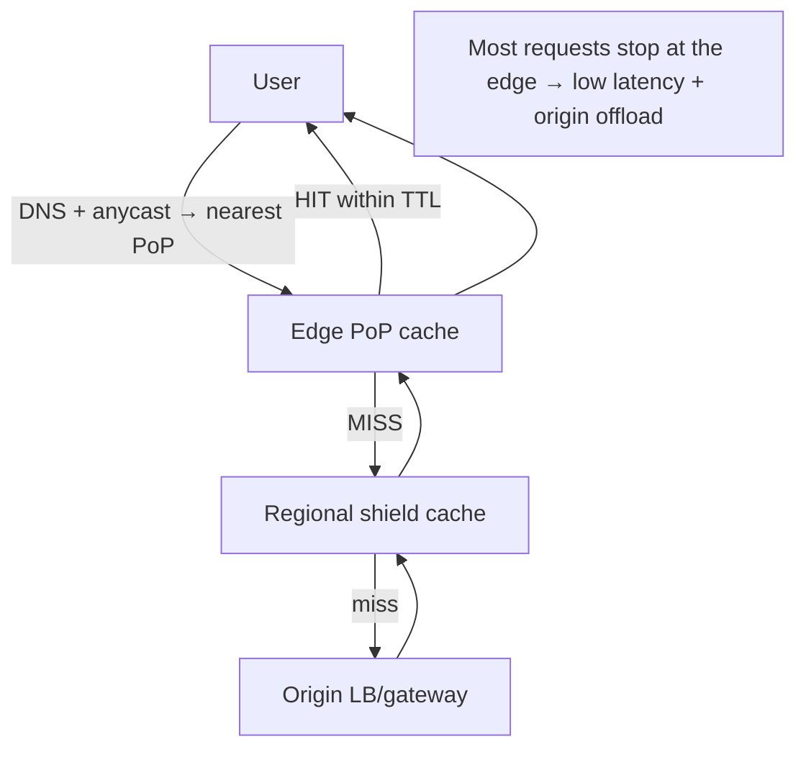
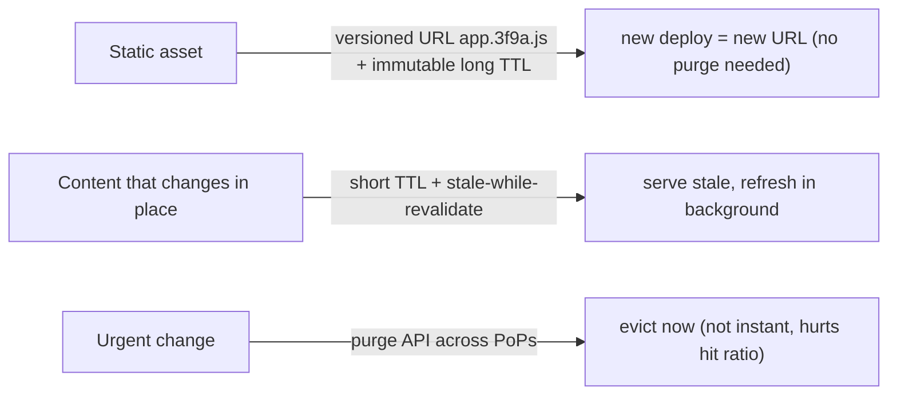

# Lesson 3.3.3 — CDNs: Edge Caching, Invalidation, and Anycast

> Part 3: Networking Deep Dive · Module 3.3: Edge & Traffic Management · Difficulty: 🟡🔴
>
> **Prerequisites:** [3.2.1 HTTP caching headers], [3.2.4 DNS], [3.3.1 Load Balancing], [3.3.2 Reverse Proxies].
> **Unlocks:** [Part 6 Caching], [Part 13 Multi-region], [Part 18 CDN/edge case study], [Part 17 latency].

---

## 1. Learning Objectives

After this lesson you will be able to:

- Explain what a **CDN** is and why putting content **physically close to users** is one of the highest-leverage latency wins (1.1.3, Part 17).
- Describe **edge caching** of static (and increasingly dynamic) content, **cache keys**, **TTLs**, and **origin offload**.
- Explain **cache invalidation** at the edge (purge, versioned URLs, stale-while-revalidate) — "one of the two hard things."
- Explain **anycast** routing and how DNS + anycast steer users to the nearest **edge PoP**, and how CDNs also provide **security** (DDoS/WAF) and **edge compute**.

---

## 2. Motivation — The speed of light is a hard limit

No matter how fast your servers are, a user in Sydney talking to an origin in Virginia pays an unavoidable **round-trip-time tax** set by physics and network hops (1.1.3, 3.1.x). For a page that needs many round trips (DNS, TLS, HTTP), that distance dominates perceived latency. The fix isn't a faster server — it's a **closer** one.

A **Content Delivery Network (CDN)** is a globally distributed fleet of caching servers (**edge PoPs — points of presence**) placed near users worldwide. Static assets (images, CSS, JS, video, downloads) are **cached at the edge**, so most requests are served from a city near the user instead of crossing the planet to the origin. This simultaneously **cuts latency**, **offloads the origin** (fewer requests reach it — a scalability win, Part 7), **absorbs traffic spikes**, and — because the CDN fronts your origin — provides a **security perimeter** (DDoS absorption, WAF, bot mitigation, TLS termination at the edge).

CDNs are the **outermost layer of the caching hierarchy** (Part 6) and the **outermost layer of traffic management** (this module). They're so effective that serving static content *without* one is, for any global audience, leaving large latency and cost wins on the table. Understanding their caching/invalidation model and anycast routing lets you design fast, resilient, global frontends (Part 13, 18).

---

## 3. Theory — From first principles

### 3.1 What a CDN is

A CDN is a **geographically distributed network of reverse-proxy caches** (edge PoPs) that sit between users and your **origin** servers `[CS]`. Each PoP caches copies of your content; users are routed to a **nearby PoP**, which serves cached content directly or fetches it from origin on a miss and caches it for next time. It's a reverse proxy (3.3.2) + cache (Part 6) replicated across the globe.

### 3.2 Edge caching mechanics

When a request hits a PoP `[CS]`:
1. The PoP computes a **cache key** (typically method + host + path + selected query/headers) and checks its local cache.
2. **Cache hit (within TTL):** serve immediately from the edge — fast, no origin contact.
3. **Cache miss / expired:** the PoP fetches from **origin** (or a regional/shield cache), stores it per caching rules, and serves it. (Many CDNs use a **multi-tier**: edge PoP → regional "shield" cache → origin, to further reduce origin load.)

**What controls caching:** the HTTP caching headers you learned in 3.2.1 — `Cache-Control` (`max-age`, `s-maxage`, `public/private`, `no-store`), `ETag`/`Last-Modified` (revalidation), `Vary` (cache-key dimensions). The CDN honors these (plus its own config). **TTL** drives the same tradeoff as DNS (3.2.4): long TTL = better hit rate/offload but staler content; short TTL = fresher but more origin traffic.

**Cacheability:** classically **static, public** assets (images, JS/CSS, fonts, video segments) are ideal. **Dynamic/personalized** responses are harder (per-user → low hit rate), but modern CDNs cache **dynamic content** via micro-TTLs, **edge key normalization**, **ESI/edge includes**, and **edge compute** (see §3.6). `Vary`/`private`/cookies must be handled carefully to avoid caching one user's data for another (a serious correctness/security bug).

### 3.3 Origin offload and the hit ratio

The key metric is **cache hit ratio** — fraction of requests served from the edge `[CS]`. A 95% hit ratio means the origin sees only 5% of traffic → enormous scalability and cost wins (Part 7), and resilience (origin spikes are absorbed). Hit ratio depends on cacheability, TTLs, cache-key design (don't fragment the cache with needless query params), and traffic patterns. **Shield/tiered caching** raises effective hit ratio and protects the origin further.

### 3.4 Cache invalidation — the hard part

"There are only two hard things in computer science: cache invalidation and naming things." At the edge it's harder because content is cached across **many PoPs worldwide** `[CS]`. Approaches:

- **TTL expiry:** simplest — content just expires. Good for content that can be slightly stale; no active work, but you can't force freshness before TTL.
- **Purge / invalidation API:** explicitly tell the CDN to evict an object (or a tag/path prefix) across all PoPs. Powerful but **propagation isn't instant** (like DNS) and aggressive purging hurts hit ratio.
- **Versioned/fingerprinted URLs (cache busting)** `[BP]`: the *best* technique for static assets — embed a content hash in the filename (`app.3f9a2c.js`). New content = new URL = guaranteed fresh, and you can set **very long TTLs (immutable)** on the old URL since it never changes. Avoids invalidation entirely for versioned assets.
- **Stale-while-revalidate / stale-if-error** `[BP]`: serve stale content immediately while fetching a fresh copy in the background (low latency + freshness), and serve stale on origin errors (resilience). A `Cache-Control` extension widely supported.

**Rule of thumb:** **version your static assets** (immutable + long TTL) and **use short TTLs + stale-while-revalidate** (and purge sparingly) for things that change in place.

### 3.5 Anycast and routing to the nearest PoP

How does a user reach the *nearest* PoP? Two complementary mechanisms (recall 3.2.4) `[CS]`:

- **DNS-based (GeoDNS/latency routing):** the CDN's DNS returns the IP of a nearby PoP based on the resolver's location.
- **Anycast:** the **same IP address is announced from many PoPs** via BGP routing (3.1.2). The internet's routing naturally delivers the packet to the **topologically nearest** PoP. One IP, many locations — routing does the geo-steering at the network layer. Anycast also helps **absorb DDoS** (attack traffic is spread across all PoPs) and provides automatic failover (if a PoP withdraws its route, traffic reroutes to the next nearest).

You typically point your domain at the CDN via **CNAME** (3.2.4), and the CDN handles PoP selection via DNS + anycast.

### 3.6 CDNs as a security perimeter and edge compute platform

Modern CDNs do far more than cache `[CONV]`:
- **DDoS mitigation** — massive distributed capacity + anycast absorb volumetric attacks (Part 15, 11).
- **WAF / bot management** — filter malicious requests at the edge before they reach origin.
- **TLS termination at the edge** (3.2.3) — faster handshakes (closer), origin offload.
- **Edge compute** `[EMERGING]` — run lightweight code at PoPs (edge functions/workers) for personalization, A/B routing, auth, header logic, even dynamic rendering — pushing **compute** (not just content) to the edge. This blurs the line between CDN and application platform.

### 3.7 Where the CDN sits

```
User → DNS/anycast → nearest CDN edge PoP (cache + WAF + TLS + edge compute)
   → (miss) regional shield → origin (your LB/gateway, 3.3.1/3.3.2)
```
The CDN is the **outermost** layer: most requests never pass it. It composes with everything inward — DNS (3.2.4) routes to it, your gateway/LB (3.3.1/3.3.2) is its origin, and it's the top of the caching hierarchy (Part 6).

---

## 4. Visual Intuition

### Edge hit vs miss



### Invalidation strategies



---

## 5. Real-World Analogy

A CDN is like a **global chain of local warehouses for a retailer** instead of one central distribution center.

- If every order shipped from one warehouse across the country, delivery would be slow and the warehouse would be swamped. So the retailer stocks **local warehouses near customers** (edge PoPs). Most orders ship from a nearby warehouse — fast delivery (low latency), and the central warehouse (origin) handles far less (offload).
- **TTL** is how long a local warehouse keeps stock before checking headquarters for an updated version.
- **Cache invalidation** is the headache of telling **every local warehouse** to pull an item off the shelf when the product changes — slow and disruptive. The clever fix (**versioned URLs**) is to give the new product a **new SKU** entirely, so old stock is simply never ordered again and you never have to recall it.
- **Anycast** is like every warehouse sharing the **same phone number**, and the phone system automatically connecting each caller to their **nearest** warehouse.
- And the warehouse network also acts as **security/loading docks** (WAF/DDoS) — screening and absorbing a flood of bad orders before they ever reach headquarters.

---

## 6. Industry Example

- **Major CDNs** `[CONV]`: Cloudflare, Akamai, Fastly, AWS CloudFront, Google Cloud CDN operate global edge networks providing caching, anycast routing, TLS, WAF/DDoS, and edge compute (Part 18 deep-dive). *(Internals representative.)*
- **Versioned-asset deploys** `[BP]`: build tools fingerprint static assets (`main.<hash>.js`) and set **immutable, long max-age** so deploys never require purges — a near-universal frontend practice.
- **DDoS absorption via anycast** `[CONV]`: CDNs have absorbed some of the largest recorded volumetric attacks by spreading traffic across global PoPs (Part 15).
- **Edge compute** `[EMERGING]`: edge-function platforms (Cloudflare Workers, Lambda@Edge, Fastly Compute) run code at PoPs for personalization/auth/routing — moving compute to the edge.
- **Stale-while-revalidate** `[BP]`: widely used to keep pages fast and fresh while shielding origins from revalidation stampedes (Part 6).

---

## 7. Implementation Details — using a CDN well

- **Put a CDN in front of all static/cacheable content** (images, JS/CSS, fonts, video, downloads) — point your domain at it via **CNAME** (3.2.4).
- **Set caching headers deliberately** (3.2.1): **immutable + long `max-age`** for **versioned/fingerprinted** assets; **short TTL + `stale-while-revalidate`** for content that changes in place; **`private`/`no-store`** for per-user data.
- **Version (fingerprint) static assets** so deploys never need purges and you get safe long TTLs (`[BP]`).
- **Design cache keys** to maximize hit ratio: normalize/strip needless query params, use `Vary` carefully, never cache personalized responses publicly (correctness/security).
- **Use tiered/shield caching** to raise hit ratio and protect origin (Part 6).
- **Lean on the CDN for security** (TLS termination, WAF, DDoS, bot mitigation) and consider **edge compute** for low-latency personalization/auth/routing (Part 15).
- **Have an origin fallback / `stale-if-error`** so a CDN can serve cached content if origin is down (resilience, Part 11).
- **Watch hit ratio + edge latency + origin offload** as core metrics (Part 16).

---

## 8. Advantages

- **Low latency** — content served from near the user (huge perceived-speed win, 1.1.3, Part 17).
- **Origin offload + scalability** — most traffic served at edge; origin sees a fraction (Part 7); absorbs spikes.
- **High availability/resilience** — edge caches + `stale-if-error` keep serving during origin trouble (Part 11).
- **Security perimeter** — DDoS absorption, WAF, bot mitigation, TLS termination at the edge (Part 15).
- **Global reach cheaply** — instant worldwide presence without building data centers.
- **Edge compute** — push personalization/logic to PoPs `[EMERGING]`.

---

## 9. Disadvantages

- **Invalidation is hard** — global purges are slow/non-instant; stale content risk (mitigated by versioned URLs/short TTL).
- **Poor fit for highly dynamic/personalized** content (low hit ratio) without careful edge strategies.
- **Cost & complexity** — another layer, vendor, config; egress/request pricing.
- **Correctness/security traps** — caching personalized/private responses publicly leaks data (`Vary`/cookie misconfig).
- **Debugging across PoPs** — behavior varies by location; harder to reason about.
- **Vendor lock-in / dependency** — a CDN outage can affect your whole frontend (consider multi-CDN, Part 11).

---

## 10. When NOT to use it / limits

- **Purely dynamic, per-user, uncacheable APIs** with no static content gain little from edge *caching* (though they may still benefit from edge TLS/DDoS/anycast and edge compute).
- **Strictly regional, low-latency-already audiences** (single region, all users nearby) — a CDN adds less.
- **Strong-consistency requirements** where any staleness is unacceptable in place — use versioned URLs or skip caching for those objects.
- **Don't cache personalized/private content publicly** — ever (security).

---

## 11. Common Mistakes

1. **Caching personalized/private responses publicly** — serving one user's data to another (`Cache-Control: public` + missing `Vary`/cookie handling) — a serious leak.
2. **Relying on purges instead of versioned URLs** — slow, hit-ratio-killing; fingerprint assets instead (`[BP]`).
3. **Wrong/short TTLs everywhere** — low hit ratio, origin hammered; or **too-long TTLs** on mutable content → stale users.
4. **Cache-key fragmentation** — letting random query params/headers fragment the cache, tanking hit ratio.
5. **No `stale-if-error`/origin fallback** — CDN can't shield users when origin fails.
6. **Ignoring the security role** — not using WAF/DDoS/TLS at the edge.
7. **Forgetting the CDN is a dependency** — single-CDN outage takes the frontend down (consider multi-CDN, Part 11).
8. **Not invalidating on real changes** — content updated in place but old TTL still serving stale.

---

## 12. Interview Questions

**🟢 Easy**
- What is a CDN and what two main benefits does it provide?
- Why does serving content from an edge PoP reduce latency?

**🟡 Medium**
- How does a CDN decide what to cache and for how long? How do HTTP caching headers drive it?
- Explain cache invalidation options at the edge. Why are versioned URLs preferred for static assets?

**🔴 Hard**
- Design content delivery for a global product (static assets, video, and some dynamic/personalized pages). What's cached where, what TTL/invalidation strategy, and how do you avoid leaking personalized data?
- Explain anycast and how DNS + anycast route users to the nearest PoP and help absorb DDoS. How does failover work when a PoP goes down?

**⚫ Staff+**
- Design a resilient multi-CDN strategy with origin shielding, `stale-if-error`, versioned assets, and edge compute for personalization — and justify the invalidation and routing model. How do you measure and optimize hit ratio and origin offload?
- A deploy caused stale assets and a mismatched JS/CSS bundle for users worldwide for hours. Diagnose the caching/invalidation failure and design a deploy strategy (versioning, atomic releases) that makes it impossible.

---

## 13. Production Pitfalls

- **Stale-content incident:** updating an asset in place with a long TTL (no versioning) → users worldwide run old code for hours; purges propagate slowly.
- **Personalized-data leak:** misconfigured public caching serves user A's account page to user B — a severe security incident.
- **Mismatched bundles on deploy:** non-atomic releases where some assets are new and some cached-old → broken UI (fix with versioned, immutable URLs + atomic deploys).
- **Low hit ratio / origin overload:** cache-key fragmentation or short TTLs send too much to origin, which then falls over under a spike (the CDN was supposed to protect it).
- **CDN outage = frontend outage:** single-CDN dependency; no fallback (Part 11) — consider multi-CDN.
- **DDoS bypass:** origin IP exposed/reachable directly, letting attackers skip the CDN's protection (lock origin to CDN only).

---

## 14. Optimization Techniques

- **Version/fingerprint static assets + immutable long TTL** — best invalidation-avoidance and max hit ratio (`[BP]`).
- **`stale-while-revalidate` + `stale-if-error`** — low latency, freshness, and resilience together.
- **Tiered/shield caching** — raise effective hit ratio, protect origin (Part 6/7).
- **Cache-key normalization** — strip needless params, sensible `Vary` — maximize hit ratio.
- **Edge TLS termination + HTTP/2/3** (3.2.2/3.2.3) — faster handshakes near users.
- **Edge compute** for personalization/auth/A-B at the PoP — keep dynamic decisions close to users `[EMERGING]`.
- **Lock origin to CDN + WAF/DDoS at edge** — security and origin protection (Part 15).
- **Multi-CDN + monitoring (hit ratio, edge latency, offload)** for resilience and tuning (Part 11/16).

---

## 15. Summary

A **CDN** is a globally distributed network of **edge PoPs** (reverse-proxy caches, 3.3.2 + Part 6) that serve content from **near the user**, attacking the one latency cost you can't engineer away: **distance** (1.1.3). By **caching at the edge**, most requests are served close to users — **cutting latency**, **offloading the origin** (high cache **hit ratio** → origin sees a fraction of traffic, a scalability and resilience win, Part 7), and **absorbing spikes**. Caching is governed by the same **HTTP headers** as 3.2.1 (`Cache-Control`/`max-age`/`s-maxage`, `ETag`, `Vary`) and the same **TTL freshness-vs-load tradeoff** as DNS. The genuinely hard part is **invalidation across many PoPs**: prefer **versioned/fingerprinted URLs** (immutable + long TTL — no purge ever needed) for static assets, **short TTL + `stale-while-revalidate`** for content that changes in place, and **purge APIs sparingly**. Users reach the **nearest PoP** via **DNS (GeoDNS/latency) + anycast** (one IP announced from many PoPs, with BGP doing network-layer geo-steering and helping absorb **DDoS**). Modern CDNs are also a **security perimeter** (WAF, DDoS, edge TLS) and an **edge-compute platform** `[EMERGING]`. The CDN is the **outermost** layer of both caching and traffic management — composing with DNS (routes to it), your gateway/LB (its origin), and the inner cache tiers — and is essential for fast, resilient, global frontends (Part 13, 18).

---

## 16. Revision Notes (flashcard-ready)

- **Q:** What is a CDN? **A:** Global network of edge caches (PoPs) serving content near users — low latency + origin offload.
- **Q:** Two core wins? **A:** Lower latency (closer) and origin offload/scalability (high hit ratio), plus resilience + security.
- **Q:** What controls edge caching? **A:** HTTP headers (`Cache-Control`/`max-age`/`s-maxage`, `ETag`, `Vary`) + CDN config; TTL = freshness vs load tradeoff.
- **Q:** Best invalidation for static assets? **A:** Versioned/fingerprinted URLs (immutable + long TTL) — new content = new URL, no purge needed.
- **Q:** For content that changes in place? **A:** Short TTL + `stale-while-revalidate` (+ purge sparingly).
- **Q:** What is anycast? **A:** Same IP announced from many PoPs; BGP routes user to nearest; aids DDoS absorption + failover.
- **Q:** DNS + anycast role? **A:** DNS (GeoDNS/latency) + anycast steer users to the nearest PoP; CNAME points domain at CDN.
- **Q:** Beyond caching? **A:** WAF/DDoS/bot mitigation, edge TLS termination, edge compute.
- **Q:** Biggest correctness trap? **A:** Caching personalized/private responses publicly → data leak (handle `Vary`/cookies, use `private`).

---

## 17. Further Reading + Knowledge-Graph Links

**Within this platform**
- **Previous:** [3.3.2 Reverse Proxies/Gateways]. **Builds on:** [3.2.1 HTTP caching], [3.2.4 DNS/anycast], [3.3.1 LB], [3.3.2 reverse proxy]. **Next:** [3.3.4 Connection Management] (then Part 3 README).
- **Top of:** [Part 6 Caching] (caching hierarchy, invalidation, stampede). **Enables:** [Part 13 Multi-region], [Part 17 latency].
- **Deep-dive:** [Part 18 CDN/edge case study]. **Security:** [Part 15] (DDoS/WAF), [Part 11] (multi-CDN, stale-if-error).

**Foundational texts (synthesized)**
- Kurose & Ross, *Computer Networking* — CDNs, content distribution, DNS-based redirection.
- Kleppmann, *Designing Data-Intensive Applications* — caching/derived-data and staleness concepts (synthesized).
- CDN provider documentation (caching, purge, anycast, edge compute) — representative.

**Concept tags:** `[CS]` edge caching, hit ratio, anycast, invalidation hardness · `[CONV]` major CDNs, anycast DDoS absorption, CNAME-to-CDN, WAF/edge TLS · `[BP]` versioned/immutable assets, stale-while-revalidate/stale-if-error, tiered caching, never cache private content publicly · `[EMERGING]` edge compute.
