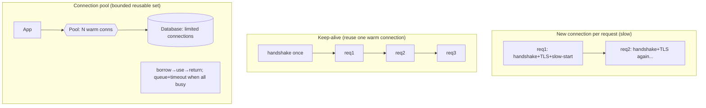
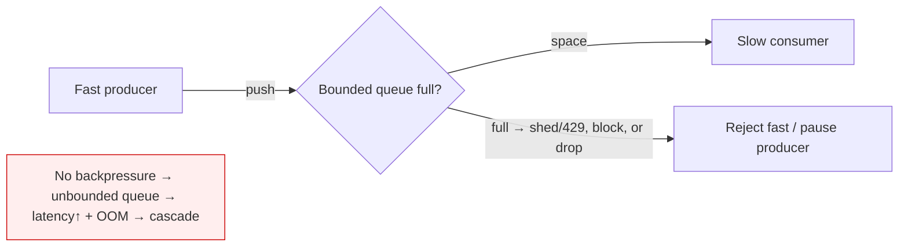

# Lesson 3.3.4 — Connection Management: Keep-Alive, Pooling, and Backpressure

> Part 3: Networking Deep Dive · Module 3.3: Edge & Traffic Management · Difficulty: 🟡🔴
>
> **Prerequisites:** [3.1.3 TCP], [3.2.1 HTTP/1.1], [3.2.2 HTTP/2], [3.3.1 Load Balancing].
> **Unlocks:** [Part 7 Scalability], [Part 9 Messaging (flow control)], [Part 11 Resilience], [Part 17 Performance].

---

## 1. Learning Objectives

After this lesson you will be able to:

- Explain why **establishing connections is expensive** (TCP handshake + TLS, 3.1.3/3.2.3) and how **keep-alive (persistent connections)** amortizes that cost.
- Describe **connection pooling** — why clients and services reuse a bounded set of connections, and how pool sizing affects throughput and the **database bottleneck** (Part 5/7).
- Explain **backpressure** — how a system signals "slow down" so fast producers don't overwhelm slow consumers — and the failure modes when it's missing (unbounded queues, OOM, cascading failure).
- Tune connection-level settings (idle timeouts, max connections, queue limits) across LBs, services, and datastores to avoid resource exhaustion.

---

## 2. Motivation — Connections are a scarce, expensive resource

Every TCP connection costs a **handshake** (a round trip, 3.1.3) and, with TLS, **more round trips + crypto** (3.2.3) — latency *before any data moves* (1.1.3). It also costs **memory, a file descriptor, and kernel/socket buffers** on both ends, plus state on every LB/proxy in between (3.3.1/3.3.2). So connections are simultaneously **slow to create** and **finite to hold**. Naively opening a fresh connection per request (classic HTTP/1.0) wastes enormous time and resources; holding millions of idle connections exhausts memory (the C10M problem, 3.2.5, Part 17).

Three techniques manage this scarce resource. **Keep-alive** reuses one connection for many requests, amortizing setup cost. **Connection pooling** maintains a **bounded, reusable set** of connections (especially to databases and downstream services) so you neither pay per-request setup nor open an unbounded number. **Backpressure** is the flow-control discipline that lets a slow consumer tell fast producers to slow down — without it, queues grow without bound and the system falls over under load (the difference between graceful degradation and catastrophic collapse, Part 11).

These are the unglamorous mechanics that decide whether a system **degrades gracefully or melts down** under pressure. They tie the whole networking part (Part 3) to scalability (Part 7), messaging (Part 9), and resilience (Part 11).

---

## 3. Theory — From first principles

### 3.1 The cost of a connection

Opening a connection involves `[CS]`:
- **TCP 3-way handshake** — ~1 RTT before any request (3.1.3).
- **TLS handshake** — additional RTT(s) + asymmetric crypto (3.2.3); 1 RTT with TLS 1.3, more with older versions.
- **Resource allocation** — socket, file descriptor, send/receive buffers, connection state on both ends and on every intermediary (LB/proxy/firewall).
- **TCP slow start** (3.1.3) — a new connection ramps up its congestion window, so early throughput is low; a *warm* connection is already at full speed.

So a fresh connection costs **latency + memory + lost slow-start ramp**. Reusing connections avoids paying these repeatedly.

### 3.2 Keep-alive (persistent connections)

**HTTP keep-alive** keeps the TCP connection **open after a response** so subsequent requests reuse it instead of reconnecting `[CS]` (default in HTTP/1.1, 3.2.1). Benefits: no repeated handshakes/TLS, stays past slow-start (full throughput), less CPU/memory churn. **HTTP/2** (3.2.2) goes further: **one connection, many multiplexed streams**, so a single warm connection carries huge concurrency.

**Tradeoff:** persistent connections **hold resources while idle**. Servers/proxies set an **idle timeout** to reclaim them. This creates a classic mismatch: if a client/pool thinks a connection is alive but the server/LB already closed it (idle timeout), the next request fails with a connection reset — a **very common production bug** (see §3.6, and 3.2.5 for the heartbeat fix). **Keep-alive timeouts must be coordinated** across client, LB, and server (client idle timeout < server/LB idle timeout).

### 3.3 Connection pooling

A **connection pool** is a **bounded, reusable set** of pre-established connections that clients borrow, use, and return `[CS]`. It's essential for talking to **databases** and **downstream services**:

- **Amortizes setup** — connections are created once and reused (no per-request handshake/TLS).
- **Bounds concurrency** — the pool size caps how many simultaneous connections you open to a backend. This is critical because **databases have limited connection capacity** (each connection costs the DB memory/threads). An unbounded client (or too many app instances × big pools) can **exhaust the database's connection limit** and take it down (a classic outage, Part 5/7).
- **Provides a queue** — when all pooled connections are busy, new requests **wait** (with a timeout) for one to free up — a natural, bounded form of backpressure.

**Sizing is a tradeoff (1.1.5):** too small → requests queue/stall (underutilized backend, high latency); too large → resource exhaustion (on client, backend, or DB), context-switch/lock contention, and *worse* throughput. A counterintuitive result: for databases, a **small pool often outperforms a large one** because the DB has limited parallelism — past a point, more connections just add contention. Pools should be sized to the backend's real concurrency, and you often put a **pooler** (e.g., PgBouncer-style, representative) in front of a database so many app connections multiplex onto few DB connections.

### 3.4 Backpressure — flow control across components

**Backpressure** is the mechanism by which a **slow consumer signals a fast producer to slow down** `[CS]`. It's the application-level generalization of TCP flow control (3.1.3) and the heart of stable systems under load.

The core problem: if a producer sends faster than a consumer can process, the excess must go *somewhere* — a queue/buffer. If that buffer is **unbounded**, it grows until memory is exhausted (OOM/crash) or latency explodes (requests sit in a huge queue longer than their timeout — useless work). If it's **bounded**, the system must decide what to do when full:

- **Block / pause the producer** (TCP does this; pull-based systems do this) — propagates "slow down" upstream.
- **Reject / shed load** (return 429/503, "load shedding", Part 11) — drop excess to protect the system; better to serve *some* requests well than *all* badly (or none).
- **Drop / sample / coalesce** — discard or merge less-important data (e.g., keep only the latest metric value, 3.2.5).
- **Buffer with a bound + timeout** — absorb bursts, but cap the buffer and time-out stale items.

**Pull vs push** `[CS]`: **pull-based** systems (consumer requests data when ready — e.g., Kafka consumers, 3.2.5 long-polling) have **natural backpressure** (the consumer sets the pace). **Push-based** systems must add explicit backpressure signals (credits/windows, bounded queues, acks) or they overwhelm slow consumers (Part 9). This is why **Reactive Streams** and similar frameworks make backpressure a first-class protocol concept `[EMERGING]`.

### 3.5 Why missing backpressure causes cascading failure

Without backpressure, overload propagates and amplifies `[CS]`:
1. A downstream slows (GC pause, hot partition, dependency latency).
2. Upstream callers keep sending; requests pile into unbounded queues.
3. Queues grow → latency grows → callers' timeouts fire → **retries** add *more* load (retry storms, Part 11).
4. Memory/threads/connections exhaust → the slow service crashes → load shifts to peers → **they** fall over → **cascading failure**.

Backpressure (bounded queues + load shedding + circuit breakers, Part 11) breaks this loop: the system **degrades gracefully** (serves a subset well, rejects the rest fast) instead of collapsing entirely. **Fail fast** beats **fail slow**.

### 3.6 Coordinating connection settings end-to-end

Connections pass through many hops (client → LB → gateway → service → DB), each with its own limits/timeouts (3.3.1/3.3.2). Misalignment causes subtle failures `[BP]`:
- **Idle-timeout mismatch** — LB closes an idle connection the client pool still thinks is open → reset on next use. Fix: client idle timeout < LB/server idle timeout; use **heartbeats/validation** (test-on-borrow) for pooled/long-lived connections (3.2.5).
- **Max-connection limits** — every layer (LB, server, DB) caps connections; the *whole chain* must be sized consistently so one layer doesn't exhaust another (e.g., app pool total ≤ DB max connections).
- **Timeouts everywhere** — connect, read/write, and pool-wait timeouts must be set (no infinite waits) and **shorter as you go deeper** so callers fail before callees pile up (timeout budgets, Part 11).
- **Keep-alive on internal calls** — reuse connections to downstream services (and use HTTP/2 multiplexing) to avoid per-call handshakes (Part 17).

---

## 4. Visual Intuition

### Per-request connect vs keep-alive vs pool

### Backpressure vs unbounded queue

---

## 5. Real-World Analogy

Think of a **busy coffee shop**.

- **Opening a connection per request** is like every customer **building their own counter and hiring a barista** just to order one coffee, then tearing it down — absurd overhead. **Keep-alive** is keeping the **same counter open** so a regular can order again without rebuilding anything.
- **Connection pooling** is having a **fixed number of baristas** (the pool). Customers queue and are served as a barista frees up. Too **few** baristas → a long line (requests stall). Too **many** → they bump into each other behind a small counter and the *espresso machine* (the database) can only pull so many shots at once — adding baristas past that point makes things *slower*, not faster. So you staff to the machine's real capacity (and a "head barista" — a connection pooler — can funnel many orders to a few machines).
- **Backpressure** is the shop **putting up a "line full, please wait outside" sign** (load shedding) or the barista calling "slow down, I'm backed up" when orders pile up. Without it, orders stack on the counter until they spill onto the floor (unbounded queue → OOM), drinks go cold before pickup (latency > timeout = wasted work), and impatient customers re-order the same drink (retry storm) making it worse — until the shop seizes up entirely (cascading failure). Telling people to wait (**fail fast**) keeps the shop running for everyone it *can* serve.

---

## 6. Industry Example

- **HTTP keep-alive & HTTP/2 multiplexing** `[CONV]`: persistent connections are the default; HTTP/2 carries many streams on one warm connection (3.2.2), and servers/LBs expose **keep-alive idle timeouts** that must be tuned (3.3.1).
- **Database connection poolers** `[CONV]`: poolers (PgBouncer-style for Postgres, etc., representative) multiplex many application connections onto a small number of DB connections — standard practice to avoid exhausting DB connection limits (Part 5/7).
- **Small-pool guidance** `[BP]`: pool-sizing guidance for databases consistently warns that **bigger pools are not better** — size to the backend's real concurrency to avoid contention.
- **Backpressure as a first-class concept** `[EMERGING]`: Reactive Streams (and frameworks implementing it) and pull-based logs (Kafka, 3.2.5/Part 9) make backpressure explicit; load shedding (429/503) and circuit breakers are standard resilience controls (Part 11).
- **Idle-timeout reset bugs** `[CONV]`: a well-known class of production issues where an LB/server idle timeout closes a connection the client pool still considers valid, causing intermittent connection-reset errors (fixed via aligned timeouts + connection validation).

---

## 7. Implementation Details — tuning connection management

- **Enable keep-alive** everywhere (it's default in HTTP/1.1) and prefer **HTTP/2 multiplexing** for internal high-concurrency calls (3.2.2); keep connections warm to avoid handshakes + slow-start.
- **Use connection pools** to databases and downstream services; **size to the backend's real concurrency**, not "as many as possible" — small pools often win for DBs (§3.3). Ensure **total app connections ≤ backend/DB max**.
- **Put a connection pooler** in front of databases when many app instances each hold pools (avoid exhausting DB connection limits, Part 5/7).
- **Align idle timeouts** across client/LB/server (client < LB < server) and use **connection validation/heartbeats** (test-on-borrow, pings) to avoid stale-connection resets (3.2.5).
- **Set all timeouts** (connect, read/write, pool-wait) — never infinite — with **shorter timeouts deeper** in the call chain (timeout budgets, Part 11).
- **Bound every queue** and choose an overflow policy: **block (propagate backpressure)**, **shed (429/503)**, or **drop/coalesce** — never unbounded (Part 11).
- **Prefer pull-based** or credit/window flow control for streaming (natural backpressure, Part 9); add explicit backpressure to push systems.
- **Combine with circuit breakers + load shedding** so overload degrades gracefully (Part 11); **observe** pool utilization, queue depth, connection errors, and timeouts (Part 16).

---

## 8. Advantages

- **Keep-alive/pooling cut latency** — no repeated handshakes/TLS, stay past slow-start (1.1.3, Part 17).
- **Pools bound resource use** — protect databases/backends from connection exhaustion (Part 5/7).
- **Higher throughput & efficiency** — reuse warm, full-speed connections; less CPU/memory churn.
- **Backpressure prevents collapse** — graceful degradation and load shedding instead of cascading failure (Part 11).
- **Predictability** — bounded queues/pools give bounded latency and resource use under load.

---

## 9. Disadvantages / costs

- **Idle connections hold resources** — keep-alive ties up memory/FDs; needs idle timeouts (and causes stale-connection bugs if misaligned).
- **Pool sizing is hard** — too small stalls, too large exhausts; requires tuning and load testing (Part 7).
- **Backpressure adds complexity** — overflow policies, credit/window logic, coordinated timeouts; harder to reason about.
- **Load shedding drops requests** — graceful, but some users get rejected (a deliberate tradeoff).
- **End-to-end coordination required** — every hop's limits/timeouts must align, which is error-prone.

---

## 10. When NOT to / limits

- **Don't open a connection per request** at scale — almost always wrong (use keep-alive/pooling). Exception: rare, one-off calls where pooling overhead isn't justified.
- **Don't make pools huge "to be safe"** — it backfires by exhausting/contending the backend (especially databases).
- **Don't rely on unbounded buffering** to "smooth" load — it converts a transient spike into an OOM/cascade; bound and shed instead.
- **Don't skip backpressure for "low-traffic" services** — overload happens during incidents/retries exactly when you least expect it.
- **Long-lived connections (WebSocket/SSE, 3.2.5)** need their own keep-alive (heartbeats) and backpressure (bounded send buffers) — pooling doesn't apply the same way.

---

## 11. Common Mistakes

1. **No connection reuse** — per-request handshakes/TLS crushing latency and CPU (1.1.3).
2. **Oversized DB pools** (or too many app instances × big pools) → **exhaust the database's connection limit** → outage (Part 5/7).
3. **Misaligned idle timeouts** — LB/server closes connections the pool still uses → intermittent resets.
4. **No connection validation** — pool hands out dead connections after idle/network blips.
5. **Unbounded queues/buffers** — memory blowup and latency explosion under load → cascade (Part 11).
6. **No timeouts / infinite waits** — a slow downstream stalls everything; threads/connections pile up.
7. **Retries without backpressure/jitter** — retry storms amplify overload (Part 11).
8. **Ignoring backpressure in push/streaming** — fast producer OOMs a slow consumer (Part 9, 3.2.5).

---

## 12. Interview Questions

**🟢 Easy**
- Why is opening a new connection per request expensive? What does keep-alive solve?
- What is a connection pool and why do we use one for databases?

**🟡 Medium**
- Why can a connection pool that's *too large* hurt performance or cause an outage? How do you size it?
- What is backpressure, and what happens to a system that lacks it under overload?

**🔴 Hard**
- Design connection management for a service calling a database and several downstream services: pool sizes, timeouts, idle-timeout alignment, and overflow/backpressure policy. What failure modes are you preventing?
- Explain how missing backpressure leads to cascading failure, and which mechanisms (bounded queues, load shedding, circuit breakers, timeouts, retry jitter) break the loop.

**⚫ Staff+**
- A latency spike in one downstream caused a fleet-wide outage via retry storms and connection/thread exhaustion. Diagnose the cascade and design the end-to-end fix (timeout budgets, bounded pools/queues, load shedding, circuit breakers, backpressure).
- Compare pull-based vs push-based data flow for backpressure. Design a streaming pipeline (Part 9) that maintains backpressure end-to-end from a fast source to a slow sink without unbounded buffering or data loss requirements violated.

---

## 13. Production Pitfalls

- **Database connection exhaustion:** app autoscaling multiplies pools until the DB hits its connection cap and rejects everyone — a total outage (Part 5/7); fix with a pooler + bounded pools.
- **Intermittent connection resets:** LB idle timeout < pool idle timeout, so reused connections are already dead — flaky errors hard to trace (align timeouts + validate connections).
- **Memory blowup from unbounded queues:** a slow consumer + unbounded buffer → OOM crash under a traffic burst.
- **Retry-storm cascade:** no backpressure/jitter; a transient slowdown triggers retries that overload the system into collapse (Part 11).
- **Thread/connection pile-up from missing timeouts:** one slow dependency stalls all worker threads/connections (use timeouts + bulkheads, Part 11).
- **Wasted work past timeout:** requests sit in a huge queue longer than the client's timeout, so the server does work no one is waiting for anymore (bound queues + shed).

---

## 14. Optimization Techniques

- **Keep connections warm** (keep-alive, HTTP/2 multiplexing) to avoid handshakes + slow-start (3.2.2, Part 17).
- **Right-size pools to backend concurrency** (small pools for DBs) + **connection pooler** in front of databases (Part 5/7).
- **Align idle timeouts + validate connections** (test-on-borrow, heartbeats) to eliminate stale-connection errors (3.2.5).
- **Timeout budgets** (shorter deeper in the chain) + **bounded queues** + **load shedding (429/503)** for graceful degradation (Part 11).
- **Circuit breakers + bulkheads + retry with jitter/backoff** to stop cascades (Part 11).
- **Pull-based / credit-window flow control** for streaming to get backpressure for free (Part 9).
- **Observe** pool utilization, queue depth, connection errors, timeouts, and reuse ratio (Part 16) to tune continuously.

---

## 15. Summary

Connections are **slow to create** (TCP handshake + TLS round trips + lost slow-start ramp, 3.1.3/3.2.3) and **finite to hold** (memory, file descriptors, buffers on every hop), so managing them is central to performance and stability. **Keep-alive** reuses one warm connection for many requests (default in HTTP/1.1; supercharged by HTTP/2 multiplexing), amortizing setup and keeping throughput high — at the cost of idle resource use and **idle-timeout coordination** (misalignment causes intermittent connection resets). **Connection pooling** maintains a **bounded, reusable** set of connections to databases and downstream services: it amortizes setup, **bounds concurrency** (crucial because databases have limited connection capacity — oversized pools cause outages), and queues with a timeout when exhausted (a natural backpressure). Counterintuitively, **smaller pools often outperform larger ones** for databases, and a **connection pooler** in front of a DB lets many app connections multiplex onto few. **Backpressure** is the flow-control discipline by which a slow consumer signals a fast producer to slow down; without it, **unbounded queues** explode latency and memory and trigger **retry storms** and **cascading failure**, whereas bounded queues + **load shedding (429/503)** + circuit breakers make the system **degrade gracefully** (**fail fast beats fail slow**). Across the whole chain (client → LB → gateway → service → DB), connection settings — idle timeouts, max connections, and timeout budgets — must be **coordinated end-to-end**. These unglamorous mechanics are exactly what separate systems that **bend** under load from ones that **break** — tying Part 3 directly into scalability (Part 7), messaging (Part 9), and resilience (Part 11).

---

## 16. Revision Notes (flashcard-ready)

- **Q:** Why are connections expensive? **A:** TCP handshake + TLS round trips + crypto, memory/FD/buffers per hop, and TCP slow-start ramp on new connections.
- **Q:** What does keep-alive do? **A:** Reuses one open connection for many requests — no repeated handshakes, stays at full speed (default in HTTP/1.1; HTTP/2 multiplexes).
- **Q:** What is a connection pool? **A:** A bounded, reusable set of connections borrowed/returned by clients — amortizes setup, bounds concurrency, queues when full.
- **Q:** Why not a huge pool? **A:** Exhausts/contends the backend (esp. DB connection limits); small pools often outperform large ones.
- **Q:** Tool to protect DB connections? **A:** A connection pooler multiplexing many app connections onto few DB connections.
- **Q:** What is backpressure? **A:** A slow consumer signaling a fast producer to slow down — app-level flow control (generalizes TCP flow control).
- **Q:** No backpressure → ? **A:** Unbounded queues → latency + OOM → retry storms → cascading failure.
- **Q:** Overflow policies? **A:** Block (propagate), shed (429/503 load shedding), drop/coalesce, or bounded buffer + timeout.
- **Q:** Pull vs push backpressure? **A:** Pull (consumer-paced, e.g., Kafka) has natural backpressure; push needs explicit signals (credits/bounded queues).
- **Q:** Key end-to-end rule? **A:** Align idle timeouts (client < LB < server), bound pools/queues, timeout budgets shorter deeper, validate connections.

---

## 17. Further Reading + Knowledge-Graph Links

**Within this platform**
- **Previous:** [3.3.3 CDNs]. **Builds on:** [3.1.3 TCP] (handshake, flow control, slow start), [3.2.1/3.2.2 HTTP keep-alive & multiplexing], [3.3.1 LB]. **Next (new Part):** [Part 4 Storage Systems] (begins after Part 3 README).
- **Feeds:** [Part 7 Scalability] (pool sizing, DB bottleneck), [Part 9 Messaging] (flow control, pull vs push), [Part 11 Resilience] (load shedding, circuit breaker, retry storms, bulkheads), [Part 17 Performance] (connection reuse, tail latency).
- **Related:** [3.2.5 WebSockets/SSE] (heartbeats, send-buffer backpressure), [Part 5 Databases] (connection limits, poolers), [Part 16 Observability] (pool/queue metrics).

**Foundational texts (synthesized)**
- Kurose & Ross, *Computer Networking* — TCP flow/congestion control, persistent HTTP connections.
- Kleppmann, *Designing Data-Intensive Applications* — overload, backpressure, and load-shedding concepts (synthesized).
- Connection-pooler and reactive-streams documentation — representative for pooling/backpressure.

**Concept tags:** `[CS]` connection cost, keep-alive, pooling, backpressure, pull vs push, cascading failure · `[CONV]` HTTP/2 multiplexing, DB connection poolers, idle-timeout reset bugs · `[BP]` small DB pools, aligned timeouts, bounded queues, load shedding, timeout budgets · `[EMERGING]` reactive-streams backpressure.
