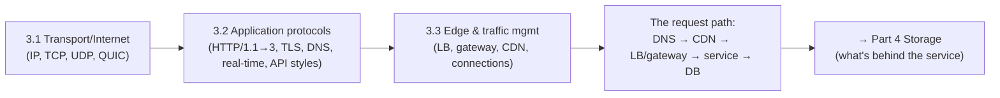

# Part 3 — Networking Deep Dive ✅ COMPLETE

The substrate every distributed system runs on — from packets to protocols to the edge — unified by one idea: **the network is unreliable, has latency you can't beat with hardware, and every layer above it is a managed tradeoff between reach, speed, and control.**

---

## Lessons

### Module 3.1 — Transport & Internet Layers
| # | Lesson | Core idea |
|---|--------|-----------|
| 3.1.1 | [The Layered Model in Practice (L3/L4/L7)](3.1.1-layered-model-in-practice.md) | Layers as separation of concerns; where each decision lives (L3/L4/L7) |
| 3.1.2 | [IP, Routing, NAT, Subnets](3.1.2-ip-routing-nat-subnets.md) | Addressing/routing the architect must know; NAT, subnets, BGP, anycast basis |
| 3.1.3 | [TCP Deep Dive](3.1.3-tcp-deep-dive.md) | Handshake, flow & congestion control, slow start, head-of-line blocking |
| 3.1.4 | [UDP and When Datagrams Win](3.1.4-udp-and-when-datagrams-win.md) | No connection/ordering/reliability — trade guarantees for latency/control |
| 3.1.5 | [QUIC and the Motivation Behind It](3.1.5-quic.md) | UDP-based, encrypted, no HoL blocking; the foundation for HTTP/3 |

### Module 3.2 — Application Protocols
| # | Lesson | Core idea |
|---|--------|-----------|
| 3.2.1 | [HTTP/1.1 Semantics](3.2.1-http-semantics.md) | Methods, status codes, idempotency/safety, caching headers, statelessness |
| 3.2.2 | [HTTP/2 Multiplexing & HTTP/3 over QUIC](3.2.2-http2-and-http3.md) | Solve HoL blocking; multiplexed streams; HTTP/3 on QUIC |
| 3.2.3 | [TLS/SSL, mTLS, PKI](3.2.3-tls-ssl-mtls-pki.md) | Handshake, certificates, chain of trust, mTLS, termination |
| 3.2.4 | [DNS: Resolution, Records, TTLs, GeoDNS](3.2.4-dns.md) | The first/coarsest traffic layer; TTL tradeoff; GeoDNS/anycast routing |
| 3.2.5 | [WebSockets, SSE, Long Polling](3.2.5-websockets-sse-long-polling.md) | Real-time/push transports; long-lived connections change the system |
| 3.2.6 | [API Styles & Serialization (REST/gRPC/GraphQL, Protobuf/Avro)](3.2.6-grpc-rest-graphql-serialization.md) | Style vs format; boundary drives choice; schema evolution |

### Module 3.3 — Edge & Traffic Management
| # | Lesson | Core idea |
|---|--------|-----------|
| 3.3.1 | [Load Balancing (L4/L7, algorithms, health checks)](3.3.1-load-balancing.md) | Keystone of horizontal scale + availability; DNS picks region, LB picks server |
| 3.3.2 | [Reverse Proxies, API Gateways, Ingress](3.3.2-reverse-proxies-api-gateways-ingress.md) | Single policy-enforcing front door; north-south; keep it thin |
| 3.3.3 | [CDNs (edge caching, invalidation, anycast)](3.3.3-cdns.md) | Beat distance; origin offload; versioned URLs > purge; CDN as security perimeter |
| 3.3.4 | [Connection Management (keep-alive, pooling, backpressure)](3.3.4-connection-management.md) | Connections are scarce/expensive; backpressure prevents cascading failure |

---

## The through-line of Part 3



**One sentence:** The network is unreliable and latency-bound, so you build up from IP/TCP/UDP/QUIC, choose application protocols and API styles by their guarantees and boundaries, and manage the edge — DNS routes to a region, a CDN serves from nearby, a load balancer and gateway pick the server and enforce policy, and connection management plus backpressure keep the whole path from collapsing under load.

---

## The end-to-end request path (Part 3 in one picture)

```
Browser
  → DNS (3.2.4)            which region/IP? (GeoDNS/anycast)
  → CDN edge PoP (3.3.3)   cached? serve from nearby; else go to origin
  → Cloud LB (3.3.1)       L4/L7 distribute to healthy backends
  → API gateway/Ingress (3.3.2)  TLS term, authN/Z, rate limit, route, translate
  → Service (HTTP/2 or gRPC over TLS, 3.2.1–3.2.6)
  → Connection pool (3.3.4) → Database / downstream services
  (real-time? WebSocket/SSE, 3.2.5; everything over TCP/QUIC + TLS, 3.1.3/3.1.5/3.2.3)
```

---

## Self-check before Part 4

Without notes, can you:
1. Place a decision at the right layer (L3/L4/L7) and explain why?
2. Explain the TCP handshake, congestion control/slow start, and head-of-line blocking — and how QUIC fixes HoL?
3. Say when UDP/QUIC beats TCP?
4. Use HTTP methods/status codes correctly and reason about idempotency, safety, and caching headers?
5. Explain HTTP/2 multiplexing and HTTP/3-over-QUIC?
6. Walk the TLS handshake, the chain of trust, mTLS, and TLS termination?
7. Walk DNS resolution and explain the TTL tradeoff + GeoDNS/anycast (DNS picks region, LB picks server)?
8. Pick among WebSockets/SSE/long polling and explain the cost of long-lived connections + backplane scaling?
9. Choose REST vs gRPC vs GraphQL (and JSON vs Protobuf/Avro) by boundary, and state schema-evolution rules?
10. Compare L4 vs L7 LBs, choose an algorithm, design health checks/draining, and avoid the LB/gateway becoming a SPOF?
11. Explain CDN edge caching, the invalidation options (versioned URLs vs purge), and anycast?
12. Explain keep-alive, connection pooling (and DB connection exhaustion), and backpressure (and how its absence causes cascading failure)?

If any are shaky, revisit that lesson's Revision Notes. Part 4 (Storage Systems) goes behind the service to how bytes are stored, indexed, and retrieved.

---

*Reference assets for this part: `../../reference/latency-and-estimation-cheatsheet.md`, `../../reference/protocol-selection-cheatsheet.md`.*
