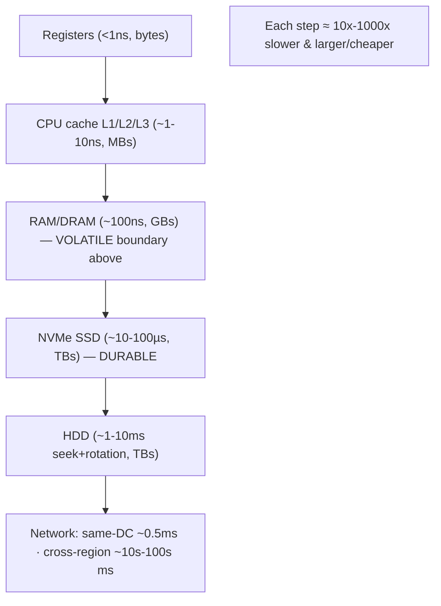
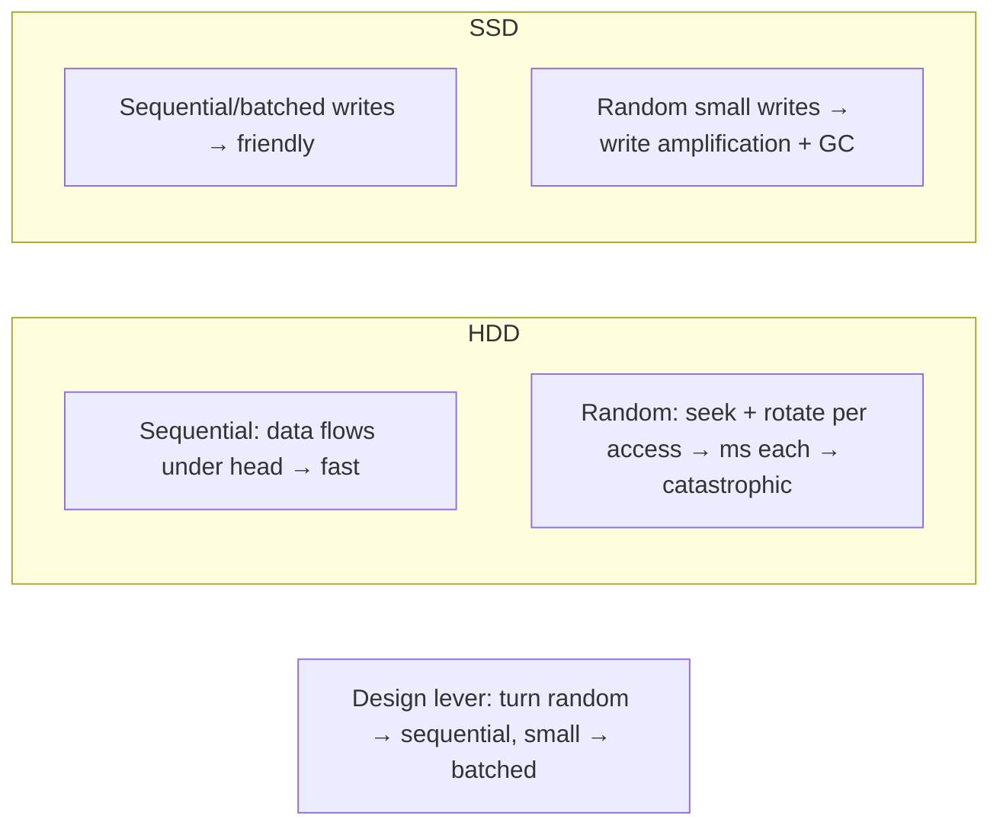

# Lesson 4.1.1 — The Memory Hierarchy, Sequential vs Random I/O, and the Latency Numbers Every Engineer Should Know

> Part 4: Storage Systems · Module 4.1: Storage Hardware Reality · Difficulty: 🟡
>
> **Prerequisites:** [1.1.3 Vocabulary of Scale], [1.1.4 Capacity Estimation], [reference/latency-and-estimation-cheatsheet].
> **Unlocks:** [4.1.2 Disks/page cache/fsync], [4.2.x Storage Engines], [Part 6 Caching], [Part 17 Performance].

---

## 1. Learning Objectives

After this lesson you will be able to:

- Describe the **memory/storage hierarchy** (registers → cache → RAM → SSD → disk → network) and the **orders-of-magnitude** latency and capacity differences between levels.
- Explain why **sequential I/O is dramatically faster than random I/O** on every storage medium, and why this single fact shapes how databases and file systems are designed.
- Internalize the **canonical latency numbers** (and their *ratios*) well enough to do back-of-the-envelope reasoning (1.1.4) about whether a design is I/O-bound, memory-bound, or network-bound.
- Use the hierarchy to reason about **locality, caching, and batching** as the universal performance levers (Part 6, 17).

---

## 2. Motivation — Every storage decision is a bet against physics

Storage systems (databases, caches, file systems, message logs) exist to move bytes between **fast-but-small** and **slow-but-large** places. The entire field is shaped by one stubborn reality: **faster storage is smaller and more expensive; bigger storage is slower and cheaper**, and the gaps between levels are not small — they're **orders of magnitude**. Reading from CPU cache vs spinning disk differs by roughly a **million-fold** in latency.

If you don't have a feel for these numbers, you'll make design errors that no amount of clever code can fix: putting a random-access workload on a medium that's only fast sequentially, assuming a remote call is "basically free," or caching the wrong layer. Conversely, once the hierarchy and the **sequential-vs-random** gap are in your bones, a huge amount of system design becomes *obvious*: keep hot data high in the hierarchy (caching, Part 6), turn random writes into sequential ones (LSM-trees, write-ahead logs — 4.2.x), batch small operations into big ones, and exploit **locality** everywhere.

This lesson is the physical foundation for *all* of Part 4 (storage engines), Part 5 (databases), and Part 6 (caching). The latency numbers here are the same ones in the reference cheat sheet you'll reach for in every capacity estimate (1.1.4).

---

## 3. Theory — From first principles

### 3.1 The hierarchy: a pyramid of speed vs size

Computer storage is organized as a **hierarchy**, fast/small at the top, slow/large at the bottom `[CS]`:

| Level | Typical latency *(order of magnitude, illustrative)* | Typical size | Volatile? |
|---|---|---|---|
| **CPU registers** | < 1 ns | bytes–KB | yes |
| **L1/L2/L3 CPU cache** | ~1–10 ns | KB–tens of MB | yes |
| **Main memory (RAM/DRAM)** | ~100 ns | GB–TB | yes |
| **NVMe SSD** | ~10–100 µs | GB–TB | no |
| **SATA SSD** | ~100 µs | GB–TB | no |
| **Spinning disk (HDD)** | ~1–10 ms (seek + rotation) | TB | no |
| **Same-datacenter network round trip** | ~0.5 ms | — | — |
| **Cross-region network round trip** | ~tens–hundreds of ms | — | — |

> These are **illustrative orders of magnitude**, not benchmarks — exact numbers vary by hardware/generation. What matters is the **ratios**: each step down is roughly **10×–1000×** slower. (See `reference/latency-and-estimation-cheatsheet.md`.)

Two consequences define the hierarchy `[CS]`:
- **Volatility boundary:** everything at RAM and above is **volatile** (lost on power failure); SSD/HDD are **durable**. This is why "is it persisted?" means "did it reach durable storage?" (4.1.2, durability — Part 5/11).
- **Caching is built into the hardware:** CPUs automatically cache RAM in L1/L2/L3; the OS caches disk in RAM (the **page cache**, 4.1.2). The hierarchy *is* a stack of caches — and your application caches (Part 6) just extend it upward.

### 3.2 The defining intuition: "numbers every programmer should know"

The famous insight (popularized by Jeff Dean) is that you should know these latencies *by ratio* `[CONV]`. A useful mental scaling: if an **L1 cache reference were 1 second**, then `[CONV]` (illustrative):
- Main memory ≈ a couple of minutes,
- An SSD read ≈ a day or so,
- A disk seek ≈ months,
- A cross-continent network round trip ≈ years.

The point isn't the exact mapping — it's that **a disk seek or a remote call is astronomically more expensive than a memory access**. Designs that treat them as comparable are wrong by orders of magnitude. This is *the* reasoning tool for "where is my time going?" (Part 17).

### 3.3 Sequential vs random I/O — the most important practical fact

Within any storage medium, **how you access data matters as much as which medium**, because of **sequential vs random access** `[CS]`:

- **Sequential I/O:** reading/writing contiguous data in order (e.g., stream a 1 GB file front-to-back).
- **Random I/O:** reading/writing scattered small pieces at unpredictable locations (e.g., look up 10,000 rows by random keys).

**Sequential is far faster than random on essentially every medium**, but for *different reasons*:
- **Spinning disk (HDD):** a random access requires a **mechanical seek** (move the head) + **rotational delay** (wait for the platter to spin) — milliseconds of physical movement. Sequential access reads data already passing under the head, so it's enormously faster. **Random I/O on HDD is catastrophically slow** — this single fact explains most classic database design.
- **SSD/NVMe:** no moving parts, so random is *much* less penalized than on HDD — but sequential still wins because of **read-ahead, larger transfer units, internal parallelism, and write behavior**. SSDs read/write in **pages** and erase in larger **blocks**, so scattered small writes cause **write amplification** and garbage collection (4.1.2). Sequential/batched writes are friendlier.
- **RAM:** even memory has locality effects — sequential access is **cache-friendly** (the CPU prefetches cache lines), while random access causes **cache misses**, each costing a full RAM round trip. So even "in-memory" is faster when access is sequential/local.

**The universal lever:** **turn random I/O into sequential I/O**, and **turn many small operations into fewer large ones (batching)**. A staggering fraction of storage-engine design (append-only logs, LSM-trees, WAL, B-tree page layout, log-structured file systems — 4.2.x) is fundamentally *"make the access pattern sequential."*

### 3.4 Locality: temporal and spatial

The reason caching and sequential access work at all is **locality of reference** `[CS]`:
- **Temporal locality:** data accessed recently is likely to be accessed again soon → keep it cached (LRU, Part 6).
- **Spatial locality:** data near recently-accessed data is likely to be accessed soon → fetch in **blocks/pages/cache-lines** (read-ahead), so the next access is already in fast storage.

Hardware and software exploit both: CPU cache lines (spatial), page cache read-ahead (spatial), LRU eviction (temporal). **Designing for locality** — co-locating data that's accessed together, accessing in order — is how you keep work high in the hierarchy.

### 3.5 The block/page abstraction

Storage isn't accessed byte-by-byte; it moves in fixed-size **units** `[CS]`:
- CPU↔RAM moves **cache lines** (e.g., 64 bytes).
- OS↔disk moves **pages/blocks** (e.g., 4 KB).
- Databases organize data into **pages** (often 4–16 KB) — the unit of read/write/caching (4.2.2).

This is *why* spatial locality pays off: reading one byte costs you a whole block anyway, so you might as well use the rest of it. It also means **small random accesses waste most of each block transferred** — another reason random I/O is inefficient (read 16 bytes, pay for a 4 KB page).

### 3.6 What this implies for system design

- **Keep hot data high** in the hierarchy → caching (Part 6), in-memory data structures, RAM-resident working sets.
- **Make access sequential/local** → append-only logs, sorted data, clustered indexes, columnar layouts for scans (4.2.x, Part 5).
- **Batch** small operations → group commits, bulk writes, vectorized reads (Part 17).
- **Respect the volatility boundary** → durability requires reaching SSD/HDD (fsync, WAL — 4.1.2, Part 5).
- **Treat the network as the slowest tier** → a remote call can cost more than a local disk read; minimize round trips (1.1.3, 3.3.4, Part 17).

---

## 4. Visual Intuition

### The hierarchy (speed ↑ small, slow ↓ large)

### Sequential vs random (why logs/LSM exist)

---

## 5. Real-World Analogy

Think of the hierarchy as **where you keep information while working**.

- **Registers/CPU cache** = the few facts in your **working memory** right now — instant, but you can only hold a handful.
- **RAM** = papers **spread on your desk** — fast to grab, limited space, and **swept away if the building loses power** (volatile).
- **SSD/HDD** = a **filing cabinet** in the room — much more capacity, but you have to get up and walk over (and the old HDD is like a cabinet where you must physically spin a carousel and slide a drawer to the right spot — a "seek").
- **Network** = documents in **another office across the country** — you have to mail a request and wait.

**Sequential vs random** is the difference between **reading a book cover-to-cover** (the next page is right there) and **looking up 500 random page numbers** (flip, find, flip back, find again). On the carousel cabinet (HDD), random lookups mean spinning and sliding for *every single one* — agonizing. The pro move is to **gather what you need into a stack on your desk** (caching), **read in order** (sequential), and **fetch a whole folder at once** instead of one page at a time (batching/blocks). Every storage system is just an elaborate version of this same desk-management problem.

---

## 6. Industry Example

- **"Numbers every programmer should know"** `[CONV]`: a widely-circulated set of latency figures (popularized by Jeff Dean, Google) used industry-wide for back-of-the-envelope reasoning — the basis of the cheat sheet in `reference/`.
- **Log-structured designs exploit sequential I/O** `[CS]`: Kafka (Part 9) achieves very high throughput largely by writing/reading the commit log **sequentially** and leaning on the OS **page cache**; LSM-tree databases (Cassandra, RocksDB-based systems — 4.2.3) turn random writes into sequential appends + background compaction.
- **Databases organize data in pages** `[CS]`: relational engines (Postgres, MySQL/InnoDB — representative) read/write/cache in fixed-size pages and use a **buffer pool** (RAM cache of pages) — the hierarchy made explicit (4.2.2).
- **SSD write amplification** `[CONV]`: SSD firmware (FTL, garbage collection, wear leveling) makes random small writes more costly than sequential — driving log-structured and batched-write designs (4.1.2).

---

## 7. Implementation Details — using the hierarchy in practice

- **Estimate with ratios** (1.1.4): when reasoning about a design, label each step (memory? local disk? network?) and use order-of-magnitude latencies to find the dominant cost. If a request does 50 random disk reads, *that's* your latency, not the CPU.
- **Cache the hot working set** in RAM (buffer pool, app cache, Part 6) — exploit temporal locality; size caches to the working set, not the whole dataset.
- **Prefer sequential access:** stream/scan in order, sort before bulk operations, use append-only structures; avoid scattered random reads/writes where possible (4.2.x).
- **Batch and group:** group commits, bulk inserts, large sequential reads; amortize per-operation overhead (Part 17).
- **Exploit blocks/pages:** co-locate fields accessed together (row vs column layout, 4.2.x); align data to page boundaries; avoid read-modify-write of tiny pieces.
- **Mind the volatility boundary:** if it must survive a crash, it must reach durable storage (fsync/WAL — 4.1.2); RAM-only is fast but not durable.
- **Account for the network tier:** treat remote calls as the slowest level; reduce round trips, co-locate data with compute, cache across the network boundary (3.3.4, Part 6).

---

## 8. Advantages (of understanding/using the hierarchy)

- **Accurate mental performance model** — predict whether a design is memory/I-O/network-bound *before* building it (1.1.4, Part 17).
- **Massive speedups from the right level** — moving hot data up one tier (disk→RAM) can be a 1000× win.
- **Foundational for caching** — the whole caching discipline (Part 6) is "exploit the hierarchy."
- **Explains storage-engine design** — makes B-trees, LSM-trees, WAL, and columnar layouts intuitive (4.2.x).
- **Better capacity/cost decisions** — balance speed vs cost per byte across tiers.

---

## 9. Disadvantages / Limits (of the physical reality)

- **Hard tradeoff: speed vs capacity vs cost** — you can't have all three; every design picks a point.
- **Volatility** — the fast tiers don't survive power loss; durability forces you down to slow tiers.
- **Random access is expensive** — many natural data structures (trees, hashes) imply random access; mitigating this adds complexity (compaction, caching).
- **Cache coherence/invalidation** — caching up the hierarchy creates staleness and invalidation problems (Part 6, "two hard things").
- **Numbers shift over time** — SSD/NVMe have narrowed gaps; rules of thumb must be updated as hardware evolves (`[EMERGING]` storage-class memory blurs tiers further).

---

## 10. When NOT to optimize for it

- **Tiny datasets / low traffic:** if everything fits in RAM and traffic is small, don't contort the design for sequential I/O — simplicity wins (1.1.5).
- **Premature optimization:** don't restructure access patterns before measuring that I/O is actually the bottleneck (Part 17 — measure first).
- **When the network dominates anyway:** optimizing local disk access is pointless if a cross-region round trip dwarfs it — fix the dominant tier first.
- **Correctness over speed:** never sacrifice durability (skip fsync/WAL) just to make writes sequential/fast unless the data is truly disposable (4.1.2, Part 5).

---

## 11. Common Mistakes

1. **Treating a remote/disk access as "cheap"** — designing as if a DB or network call costs like a memory read (off by 1000×+).
2. **Random-access workload on the wrong medium** — heavy random I/O on HDD (or random small writes on SSD without batching) → terrible throughput.
3. **Ignoring sequential-vs-random** — not realizing why an indexed point-lookup workload behaves utterly differently from a sequential scan (4.2.x).
4. **Caching the whole dataset** instead of the **working set** — wasting RAM, or assuming caching helps when there's no locality.
5. **Confusing "in memory" with "durable"** — losing data on crash because it never reached durable storage (volatility boundary).
6. **Per-row/per-byte operations** — not batching; paying per-operation overhead thousands of times (Part 17).
7. **Stale rules of thumb** — using ancient HDD-era assumptions on NVMe systems (or vice versa).

---

## 12. Interview Questions

**🟢 Easy**
- Sketch the memory/storage hierarchy and give the order-of-magnitude latency and volatility of each level.
- Why is sequential I/O faster than random I/O?

**🟡 Medium**
- Explain temporal vs spatial locality and how caching and read-ahead exploit each.
- Why do databases and Kafka go to such lengths to make their access patterns sequential? Give concrete mechanisms.

**🔴 Hard**
- You're designing a write-heavy store. Explain how you'd turn random writes into sequential I/O and the tradeoffs that creates (link to LSM/WAL — 4.2.x).
- A query does 10,000 random row lookups vs a sequential scan of the same table. Reason about which is faster on HDD vs SSD vs fully cached in RAM, and why.

**⚫ Staff+**
- Given a latency budget for a request, decompose where the time goes across the hierarchy (cache/RAM/SSD/network) and justify where to spend engineering effort (Part 17).
- Discuss how storage-class/persistent memory and NVMe blur the traditional hierarchy, and how that changes classic database design assumptions (`[EMERGING]`).

---

## 13. Production Pitfalls

- **Cache too small for the working set:** thrashing — constant eviction/reload, falling back to slow tiers, latency cliff under load (Part 6).
- **Random-write storm on SSD:** write amplification + garbage collection tanks throughput and wears the drive (4.1.2).
- **Cold-cache latency after restart/deploy:** buffer pool/page cache empty → everything hits disk → severe slowdown until warmed (slow-start, Part 13).
- **Hidden N+1 random I/O:** an ORM issuing thousands of tiny random reads instead of one sequential/batched query (Part 17, 5.x).
- **Assuming network is local-speed:** a chatty service doing many cross-service/cross-region calls in a request path, blowing the latency budget (3.3.4).

---

## 14. Optimization Techniques

- **Cache hot data** at the right tier (buffer pool, app/distributed cache, CDN — Part 6) to keep the working set high in the hierarchy.
- **Sequentialize:** append-only logs, sorted writes, compaction, log-structured engines (4.2.3); sequential scans for analytics (columnar, 4.2.x).
- **Batch & group:** group commit, bulk load, vectorized/columnar reads, read-ahead/prefetch (Part 17).
- **Exploit locality of layout:** cluster related data (clustered index, row vs column store), align to page boundaries (4.2.2/4.2.5).
- **Reduce round trips:** denormalize/co-locate, cache across the network tier, connection reuse (3.3.4).
- **Tier storage by access frequency:** hot in RAM/NVMe, warm on SSD, cold on HDD/object storage (4.1.3, lifecycle).

---

## 15. Summary

Storage systems move bytes between **fast-but-small** and **slow-but-large** tiers, and the gaps are **orders of magnitude**: registers/cache (ns) → RAM (~100 ns, volatile) → SSD/NVMe (µs, durable) → HDD (ms, mechanical seek) → network (sub-ms in-DC to tens/hundreds of ms cross-region). Knowing these latencies **by ratio** (a disk seek or remote call is *astronomically* costlier than a memory access) is the core back-of-the-envelope tool (1.1.4) for finding whether a design is memory-, I/O-, or network-bound (Part 17). The single most practical fact is that **sequential I/O vastly outperforms random I/O** on every medium — catastrophically so on HDD (mechanical seek + rotation), and still meaningfully on SSD (write amplification, blocks, parallelism) and even in RAM (cache lines). This is *why* so much of storage-engine design is about **turning random access into sequential** (append-only logs, LSM-trees, WAL, page layout — 4.2.x) and **batching small operations into large ones**, all enabled by **locality** (temporal → caching; spatial → block/page read-ahead). The design playbook follows directly: **keep the hot working set high in the hierarchy** (caching, Part 6), **make access sequential and local**, **batch**, **respect the volatility boundary** for durability (fsync/WAL — 4.1.2), and **treat the network as the slowest tier**. These numbers and the sequential-vs-random gap are the physical foundation for all of storage (Part 4), databases (Part 5), and caching (Part 6).

---

## 16. Revision Notes (flashcard-ready)

- **Q:** Order the hierarchy by speed/size. **A:** Registers → CPU cache → RAM → NVMe/SSD → HDD → network; each step ≈10×–1000× slower & larger/cheaper.
- **Q:** Where's the volatility boundary? **A:** RAM and above = volatile; SSD/HDD = durable. Durability = data reached durable storage.
- **Q:** RAM vs disk seek vs remote call latency (ratio)? **A:** ~100 ns vs ~ms vs ~ms–100s ms — disk/network are ~10⁴–10⁶× slower than RAM.
- **Q:** Why is sequential faster than random? **A:** HDD: avoids seek+rotation; SSD: avoids write amplification/GC, uses parallelism; RAM: cache-line/prefetch friendly.
- **Q:** The universal design lever? **A:** Turn random→sequential and many-small→few-large (batching); exploit locality.
- **Q:** Temporal vs spatial locality? **A:** Temporal = reused soon (cache it, LRU); spatial = nearby accessed soon (fetch blocks/read-ahead).
- **Q:** Why blocks/pages? **A:** Storage moves fixed units (cache line/page); small random access wastes most of each block.
- **Q:** Design implications? **A:** Cache hot data, sequentialize access, batch, respect durability boundary, minimize network round trips.

---

## 17. Further Reading + Knowledge-Graph Links

**Within this platform**
- **Builds on:** [1.1.3 Vocabulary of Scale], [1.1.4 Capacity Estimation], [reference/latency-and-estimation-cheatsheet]. **Next:** [4.1.2 Disks, Page Cache, fsync, Write Amplification].
- **Foundation for:** [4.2.1–4.2.5 Storage Engines] (log-structured/B-tree/LSM exploit this), [Part 5 Databases] (buffer pool, durability), [Part 6 Caching] (the hierarchy as caching), [Part 17 Performance] (where time goes).
- **Network tier:** [3.3.4 Connection Management], [3.1.x latency].

**Foundational texts (synthesized)**
- Kleppmann, *Designing Data-Intensive Applications* — storage engines, sequential vs random I/O, B-trees vs LSM.
- Silberschatz et al., *Database System Concepts* — storage hierarchy, disk structure, buffering.
- "Latency numbers every programmer should know" (Jeff Dean, widely circulated) — representative figures.

**Concept tags:** `[CS]` memory hierarchy, sequential vs random I/O, locality (temporal/spatial), block/page unit, volatility boundary · `[CONV]` "numbers every programmer should know", page cache/buffer pool · `[EMERGING]` storage-class/persistent memory blurring tiers.
