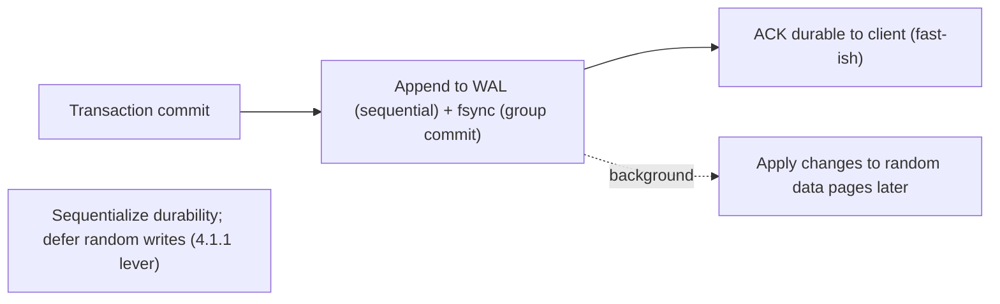

# Lesson 4.1.2 — Disks (HDD/SSD/NVMe), the Page Cache, fsync, and Write Amplification

> Part 4: Storage Systems · Module 4.1: Storage Hardware Reality · Difficulty: 🟡🔴
>
> **Prerequisites:** [4.1.1 Memory hierarchy & sequential vs random I/O], [3.1.3 TCP (for durability framing)].
> **Unlocks:** [4.2.1–4.2.4 Storage engines (LSM/B-tree)], [Part 5 Databases (WAL, durability)], [Part 11 Fault Tolerance].

---

## 1. Learning Objectives

After this lesson you will be able to:

- Explain how **HDDs** (mechanical: seek + rotation) and **SSDs/NVMe** (flash: pages, blocks, erase-before-write) actually work, and why their performance characteristics differ.
- Explain the **OS page cache** — why reads/writes go through RAM, and the crucial difference between "written" and "durably persisted."
- Explain **fsync** and why durability requires forcing data past the page cache (and disk caches) to stable media — the foundation of crash safety and WAL (Part 5).
- Explain **write amplification** on SSDs (pages/blocks, garbage collection, wear leveling) and how log-structured/batched designs reduce it (4.2.3).

---

## 2. Motivation — "I wrote the data" is a lie until it's durable

The gap between **fast/volatile** (RAM) and **slow/durable** (disk) from 4.1.1 is where the hardest correctness bugs in all of computing live. When your code calls `write()`, the data usually lands in the **OS page cache** (RAM) and the call returns *immediately* — but the data is **not yet on disk**. If the machine loses power right then, **it's gone**. Every durable system — databases, message logs, file systems — has to grapple with this, and the mechanism that bridges it (**fsync**) is slow, which is exactly why durability is expensive and why write-ahead logs (Part 5) exist.

Meanwhile, the *medium* matters enormously. HDDs punish random access with **physical seeks** (4.1.1); SSDs eliminate seeks but introduce their own gremlin — **write amplification** — because flash can't overwrite in place; it must erase large blocks before rewriting. Misunderstanding this leads to designs that wear out SSDs, stall under random writes, or lose data they claimed to have saved.

This lesson turns the abstract hierarchy into the concrete hardware behavior that **storage engines** (4.2.x) and **databases** (Part 5) are built around. Get fsync and write amplification right and durability, crash recovery, and write performance all make sense; get them wrong and you ship a system that's either slow, fragile, or quietly losing data.

---

## 3. Theory — From first principles

### 3.1 How a spinning disk (HDD) works

An HDD stores bits magnetically on rotating **platters**, accessed by a moving **read/write head** `[CS]`. To read/write a location:
1. **Seek:** move the head to the right track (milliseconds — mechanical).
2. **Rotational latency:** wait for the platter to spin the right sector under the head (milliseconds).
3. **Transfer:** read/write as the data passes.

So a **random access** pays seek + rotation **every time** (~ms each) — devastatingly slow. **Sequential access** pays it once, then streams. This is the physical root of "sequential ≫ random" (4.1.1) and of decades of database design that minimizes seeks (B-tree page layout, clustering, log-structured writes — 4.2.x). HDDs remain relevant for **cheap, large, cold/sequential** storage (archives, big sequential logs).

### 3.2 How an SSD / NVMe works (flash)

SSDs store bits in **NAND flash cells**, with **no moving parts** — so no seek, and random access is *far* better than HDD `[CS]`. But flash has peculiar rules:
- Data is read/written in **pages** (e.g., 4–16 KB).
- **You cannot overwrite a page in place.** To change data, the SSD must write to a **fresh page** and later **erase** the old one.
- **Erases happen in large units called blocks** (many pages, e.g., 128 pages). You can't erase a single page — only a whole block.

A controller called the **FTL (Flash Translation Layer)** hides this, mapping logical addresses to physical pages and running **garbage collection** (reclaiming blocks) and **wear leveling** (spreading writes so cells wear evenly, since flash cells have limited write/erase cycles) `[CS]`. **NVMe** is a fast interface/protocol for SSDs over PCIe (vs the older SATA/AHCI), enabling much higher throughput and parallelism (deep queues) — but the flash physics are the same.

**Key SSD implications:**
- Random *reads* are cheap; random small *writes* are expensive (see write amplification, §3.5).
- Internal **parallelism** (many flash chips) means batched/sequential and concurrent I/O get high throughput.
- SSDs **wear out** with writes; reducing write volume extends life.

### 3.3 The OS page cache — reads/writes go through RAM

The OS keeps a **page cache** in RAM: a cache of disk pages `[CS]`. It's why repeated reads of the same file are fast (served from RAM, exploiting temporal locality — 4.1.1) and why writes feel instant:

- **Reads:** check page cache → hit returns from RAM; miss reads from disk *and caches it*. The OS also does **read-ahead** (prefetch sequential pages — spatial locality).
- **Writes (write-back):** a normal `write()` copies data into the page cache and marks the page **dirty**, then returns — **without** touching disk yet. The OS flushes dirty pages to disk **asynchronously** later (or under memory pressure). This is **fast** but means **the data is in volatile RAM**, not durable.

This is the central subtlety: **`write()` returning successfully does NOT mean the data survived a crash.** It's in RAM (page cache), pending flush. (Databases often rely on the page cache, and some — like Kafka — deliberately lean on it for performance, Part 9.)

### 3.4 fsync — forcing durability

**`fsync()`** (and `fdatasync`, `O_SYNC`, etc.) tells the OS: **flush this file's dirty pages from the page cache to the storage device and don't return until it's durable** `[CS]`. Only after a successful fsync can you be confident the data survives a power loss.

Subtleties that cause real-world data loss `[CS]`:
- **fsync is slow** — it forces actual device I/O (and waits), so it's orders of magnitude slower than a cached write. This is the fundamental durability tax.
- **Device write caches:** disks/SSDs have their *own* volatile caches. A correct fsync must also flush the device cache (or the device must have power-loss protection); misconfigured systems "fsync" but data still sits in a volatile disk buffer and is lost on power failure.
- **fsync error handling is treacherous** — historically, fsync failures could be mishandled (errors cleared on retry, dirty pages dropped), a notorious class of data-loss bugs ("fsync-gate"). Robust systems treat fsync failure as serious and may need to crash/recover.
- **Metadata vs data:** you often must fsync both the file *and its directory* for a new file's existence to be durable.

**This is why write-ahead logging exists (Part 5, 4.2.2):** instead of fsync-ing scattered random data pages on every transaction (slow), databases **append** the change to a **sequential log** and fsync *that* (one sequential, fast-ish durable write), then apply the data pages later/asynchronously. **Sequential durable write + deferred random writes = durability without paying random-fsync cost on the hot path.** It's 4.1.1's "sequentialize + batch" applied directly to durability. **Group commit** batches many transactions' log records into one fsync to amortize the cost further.

### 3.5 Write amplification (SSD)

**Write amplification (WA)** is the ratio of **actual bytes written to flash** vs **bytes the application asked to write** `[CS]`. Because flash erases in large **blocks** but writes in **pages**, modifying small scattered data forces the SSD to:
1. Write new data to fresh pages.
2. Eventually **garbage-collect**: to reclaim a block, copy its still-valid pages elsewhere, then erase the block.

So a small logical write can cause **several physical writes** (WA > 1). High write amplification:
- **Reduces throughput** (the SSD is busy doing internal copies).
- **Wears the drive faster** (flash has limited erase cycles).
- Is **worse for random small writes** and when the drive is **near full** (less free space for GC to work with → keep some **over-provisioning/headroom**).

**Mitigations (the design response):**
- **Sequential/large/batched writes** (align to block boundaries) reduce WA dramatically.
- **Log-structured designs** (LSM-trees, 4.2.3; log-structured file systems) write **append-only** sequentially, then compact in the background — minimizing in-place random updates and playing to flash's strengths. *(There's a tradeoff: compaction itself causes write amplification of a different kind — 4.2.4.)*
- **TRIM/discard** tells the SSD which pages are free, helping GC.
- **Leave headroom** (don't run SSDs at ~100% full).

### 3.6 Putting it together: the durable-write path

```
app write() → OS page cache (RAM, "dirty") → [returns: FAST but NOT durable]
   ... later (async flush) or on fsync() → device → device cache → flash/platter [DURABLE]
durability discipline: append change to sequential WAL + fsync (group commit) → apply data pages later
SSD reality: in-place overwrite impossible → write fresh page + GC/erase blocks → write amplification
```

The whole of storage-engine and database durability design (4.2.x, Part 5, Part 11) is reconciling **"fast (cached, async, sequential)"** with **"durable (fsync'd to stable media)"** while minimizing **write amplification** and **random I/O**.

---

## 4. Visual Intuition

### Why write() isn't durable; fsync is

```mermaid
flowchart TB
    APP["app write()"] --> PC["OS page cache (RAM, dirty page)"]
    PC -->|returns immediately| FAST["FAST — but lost on power failure"]
    PC -->|fsync() / async flush| DEV["Device (+ its volatile cache)"]
    DEV -->|flushed / power-loss-protected| MEDIA["Flash / platter — DURABLE"]
    note["Durable = data reached stable media; fsync forces it (slow)"]
```

### WAL: sequential durable write instead of random fsyncs



---

## 5. Real-World Analogy

Imagine writing important notes.

- **The page cache** is your **whiteboard**: jotting a note there is instant, and you can read it back instantly — but if the **power goes out / someone wipes the board** (crash), it's gone. When your program "writes," it's usually just writing on the whiteboard.
- **fsync** is **photocopying the whiteboard into a fireproof safe**. Only once the copy is in the safe is the note truly *safe* — but walking to the safe and filing it is **slow**, so you don't want to do it after every single word. That's why you **write a running journal in order** (the WAL) and file *that* in one trip (group commit), rather than re-filing every scattered page individually.
- **HDD random access** is a filing cabinet where you must **spin a carousel and slide a drawer** to each random spot — fine if you read a drawer front-to-back, agony if you jump around.
- **SSD write amplification** is like a notebook written in **permanent ink where you can't erase a single line** — to "change" one line you rewrite it on a fresh page, and periodically, when a page has too many crossed-out lines, you **recopy the still-good lines onto a brand-new page and shred the old one** (garbage collection). One small edit triggers a lot of recopying — and the notebook has only so many pages before it's used up (wear). The fix: **write in clean sequential batches** so you rarely have to recopy.

---

## 6. Industry Example

- **Write-ahead logging everywhere** `[CS]`: Postgres WAL, MySQL/InnoDB redo log, SQLite WAL mode (representative) all turn durable commits into **sequential log appends + fsync**, deferring random data-page writes — exactly §3.4. (ARIES-style recovery — Part 5.)
- **Group commit** `[CONV]`: databases batch many transactions into a single fsync to amortize the durability tax under load (Part 5/17).
- **Kafka leans on the page cache** `[CONV]`: the log is written/read sequentially and served largely from the OS page cache, achieving high throughput (Part 9) — a deliberate use of §3.3.
- **LSM-trees minimize write amplification of random updates** `[CS]`: RocksDB/LevelDB-based and Cassandra-style systems write sequentially (memtable→SSTable) and compact in the background (4.2.3) — flash-friendly, though compaction has its own WA (4.2.4).
- **"fsync-gate"** `[CONV]`: well-documented incidents where fsync error handling caused data loss prompted databases to harden their durability code — a cautionary tale that "we called fsync" isn't automatically safe.

---

## 7. Implementation Details — durability & write efficiency

- **Never assume `write()` is durable** — it's in the page cache (RAM). For crash safety, **fsync** (the right file *and* directory) and ensure **device caches are flushed or power-loss-protected**.
- **Sequentialize durability with a WAL** (Part 5): append + fsync the log (group commit), apply data pages asynchronously — durability without random-fsync cost on the hot path.
- **Batch writes** and align to block/page boundaries to cut write amplification on SSDs (4.2.3, 4.1.1).
- **Choose the medium for the workload:** NVMe/SSD for random-heavy or low-latency; HDD for cheap, large, cold/sequential (logs, archives, backups — 4.1.3); tier hot→cold.
- **Leave SSD headroom / over-provision** and enable **TRIM** to keep garbage collection efficient; monitor drive wear (SMART) on write-heavy fleets.
- **Tune durability vs performance deliberately** (a tradeoff, 1.1.5): synchronous fsync-per-commit (max safety) vs group commit vs periodic flush (faster, small data-loss window on crash) — match to the data's value (Part 11 RPO).
- **Watch fsync errors** — treat failures as serious; many systems crash-and-recover rather than risk silent loss.

---

## 8. Advantages (of understanding/using these mechanics)

- **Correct durability** — you know exactly when data is crash-safe (post-fsync to stable media), avoiding silent data loss.
- **Fast durable writes via WAL** — sequential log + group commit gives durability at high throughput (Part 5).
- **Page cache = free read/write acceleration** — RAM-speed reads and fast buffered writes, exploiting locality (4.1.1).
- **Lower write amplification** — sequential/batched/log-structured writes boost SSD throughput and lifespan (4.2.3).
- **Right medium for the job** — cost/performance balance across HDD/SSD/NVMe (4.1.3).

---

## 9. Disadvantages / costs

- **fsync is slow** — the durability tax; per-commit fsync limits throughput (mitigated by group commit/WAL, at the cost of complexity).
- **Durability vs performance tradeoff** — faster (async/periodic flush) means a crash-loss window; safe (sync) means slower.
- **Page cache hides durability** — easy to *think* data is saved when it isn't (a foot-gun).
- **SSD write amplification & wear** — random small writes degrade throughput and lifespan; managing it (log-structured, headroom) adds complexity.
- **HDD random I/O is brutal** — mechanical limits force design contortions.
- **Subtle correctness traps** — device caches, directory fsync, fsync error handling — easy to get wrong.

---

## 10. When NOT to worry about it (much)

- **Truly disposable/derived data:** if it can be recomputed (caches, regenerable derived state), you may skip fsync and favor speed (Part 6) — but be explicit.
- **Managed databases/cloud storage:** the provider handles fsync/durability/replication; you tune knobs (e.g., durability level) rather than implement it — *but you must still understand the guarantees you're configuring*.
- **In-memory-only systems** (caches, ephemeral compute): durability isn't the goal; don't pay the fsync tax — but know you'll lose data on crash (and plan accordingly, Part 11).
- **Read-mostly/sequential workloads on SSD:** write amplification is a minor concern; don't over-engineer.

---

## 11. Common Mistakes

1. **Believing `write()` = durable** — losing data on power failure because it was only in the page cache (no fsync).
2. **Forgetting device caches / directory fsync** — fsync'ing the file but data still in a volatile disk buffer, or a new file's directory entry not durable.
3. **Mishandling fsync errors** — assuming success, or retrying in a way that drops dirty pages (fsync-gate class of bugs).
4. **fsync per tiny write** — crushing throughput instead of using a WAL + group commit (Part 5).
5. **Random small writes on SSD at scale** — high write amplification, throughput collapse, premature wear (use batched/log-structured — 4.2.3).
6. **Running SSDs near full** — starving garbage collection → worse WA and latency.
7. **Heavy random I/O on HDD** — designing a random-access workload on spinning disks (4.1.1).
8. **Misunderstanding the durability knob** — setting a DB to async/relaxed durability without realizing the crash data-loss window (Part 11 RPO).

---

## 12. Interview Questions

**🟢 Easy**
- When you call `write()`, where does the data actually go, and is it durable? What does fsync do?
- Why is random I/O so slow on a spinning disk?

**🟡 Medium**
- Why do databases use a write-ahead log instead of fsync-ing data pages directly on each commit?
- What is write amplification on an SSD, and what causes it? How do you reduce it?

**🔴 Hard**
- Design the durable write path for a database: page cache, WAL, group commit, fsync, recovery. What exactly is guaranteed after a commit returns, and what's the crash-loss window under each durability setting?
- Explain the SSD's pages/blocks/erase model and how it drives both write amplification and the appeal of log-structured (LSM) storage. What new amplification does compaction introduce (4.2.4)?

**⚫ Staff+**
- A system "called fsync" but still lost data after a power event. Enumerate every place the data could have been stranded (page cache, device cache, directory entry, fsync error handling) and how to make it correct.
- You must hit an RPO of near-zero with high write throughput. Reconcile fsync cost, group commit, WAL, replication, and battery-backed/PLP hardware. Defend the tradeoffs (Part 11).

---

## 13. Production Pitfalls

- **Power-loss data loss:** "successful" writes lost because they sat in the page cache or a volatile device cache (no real fsync / no power-loss protection).
- **fsync-gate-style silent loss:** mishandled fsync errors dropping data while the app believes it's safe.
- **Throughput collapse from per-commit fsync:** durability correctly enabled but no group commit → fsync becomes the bottleneck under load (Part 17).
- **SSD write cliff:** a write-heavy random workload (or near-full drive) triggers garbage collection storms → latency spikes and wear (4.2.3/4.2.4).
- **Cold page cache after restart:** post-deploy/restart everything misses cache and hits disk → slowness until warm (4.1.1, Part 13).
- **Misconfigured durability level:** an ops "performance tweak" relaxes fsync/durability, silently widening the crash data-loss window (Part 11 RPO).

---

## 14. Optimization Techniques

- **WAL + group commit** to make durable commits sequential and amortized (Part 5).
- **Batch & sequentialize writes**, align to page/block size to cut SSD write amplification (4.1.1, 4.2.3).
- **Log-structured engines (LSM)** for write-heavy/flash-friendly workloads (4.2.3) — accept compaction-WA tradeoff (4.2.4).
- **Exploit the page cache** for reads (and read-ahead) — keep the working set in RAM (4.1.1, Part 6).
- **SSD hygiene:** over-provisioning/headroom, TRIM, wear monitoring; NVMe for parallelism/low latency.
- **Tier media** by access pattern (hot NVMe → warm SSD → cold HDD/object storage — 4.1.3).
- **Tune durability to data value** — relaxed/periodic flush for low-value/derivable data; strict fsync for the system of record (Part 11).

---

## 15. Summary

The hierarchy gap from 4.1.1 becomes concrete in disk hardware and the durability path. **HDDs** are mechanical (seek + rotation), so random access costs milliseconds *each* — the physical root of "sequential ≫ random." **SSDs/NVMe** have no seek (random reads are cheap) but can't overwrite flash in place: they write in **pages**, erase in larger **blocks**, and run **garbage collection** and **wear leveling** via the FTL — which causes **write amplification** (a small logical write → several physical writes), worst for random small writes and near-full drives, degrading throughput and lifespan. Above the device sits the **OS page cache**: a normal `write()` lands in volatile RAM (a "dirty" page) and returns **fast but not durable** — so **`write()` ≠ persisted**. **`fsync()`** forces dirty pages past the page cache (and ideally the device cache) to stable media; it's the true durability primitive and it's **slow**, which is *why* databases use a **write-ahead log** — append the change to a **sequential** log and **fsync that** (with **group commit** to amortize), then apply scattered data pages asynchronously: 4.1.1's "sequentialize + batch" lever applied to durability. The recurring traps — assuming cached writes are safe, forgetting device/directory fsync, mishandling fsync errors, and random-write-induced write amplification — are exactly what robust storage engines (4.2.x) and databases (Part 5) are engineered to avoid, by reconciling **fast (cached/async/sequential)** with **durable (fsync'd to stable media)** while minimizing **write amplification** and **random I/O**.

---

## 16. Revision Notes (flashcard-ready)

- **Q:** Where does `write()` put data, and is it durable? **A:** Into the OS page cache (RAM, dirty page); returns fast but **not** durable until flushed.
- **Q:** What does fsync do? **A:** Forces a file's dirty pages to stable media (must also flush device cache); the true durability primitive — and slow.
- **Q:** Why WAL + group commit? **A:** Turn durable commits into one sequential fsync'd log append (batched), defer random data-page writes — durability without per-commit random fsync cost.
- **Q:** HDD random penalty? **A:** Seek + rotational latency (~ms) on every random access; sequential pays it once.
- **Q:** Why can't SSDs overwrite in place? **A:** Flash writes pages but erases larger blocks; must write fresh pages + GC/erase later.
- **Q:** Write amplification? **A:** Physical bytes written ÷ logical bytes; >1 due to GC; worse for random small writes / full drives; wears the drive.
- **Q:** Reduce WA? **A:** Sequential/batched/log-structured writes (LSM), block alignment, headroom/over-provisioning, TRIM.
- **Q:** Durability vs performance knob? **A:** Sync fsync-per-commit (safe, slow) ↔ group commit ↔ periodic flush (fast, crash-loss window = RPO).
- **Q:** fsync foot-guns? **A:** Device write caches, must fsync directory for new files, mishandled fsync errors (fsync-gate).

---

## 17. Further Reading + Knowledge-Graph Links

**Within this platform**
- **Previous:** [4.1.1 Memory hierarchy & sequential vs random I/O]. **Next:** [4.1.3 Block vs File vs Object Storage].
- **Foundation for:** [4.2.1 log-structured vs page-oriented], [4.2.2 B-Trees & WAL], [4.2.3 LSM-Trees & compaction], [4.2.4 B-Tree vs LSM (write amplification)], [Part 5 Databases (durability, ARIES recovery)], [Part 11 Fault Tolerance (RPO, durability)].
- **Related:** [Part 9 Messaging] (Kafka & page cache), [Part 6 Caching] (page cache as caching), [Part 17 Performance].

**Foundational texts (synthesized)**
- Kleppmann, *Designing Data-Intensive Applications* — storage engines, WAL, sequential writes, SSD behavior.
- Silberschatz et al., *Database System Concepts* — disk structure, buffering, recovery/logging.
- OS/file-system literature on the page cache and fsync semantics; SSD/FTL documentation — representative.

**Concept tags:** `[CS]` HDD seek/rotation, SSD pages/blocks/erase, FTL/GC/wear leveling, page cache (write-back), fsync durability, write amplification · `[CONV]` WAL + group commit, Kafka page-cache use, fsync-gate · `[BP]` WAL for durability, batch/sequentialize writes, SSD headroom/TRIM, tune durability to data value.
